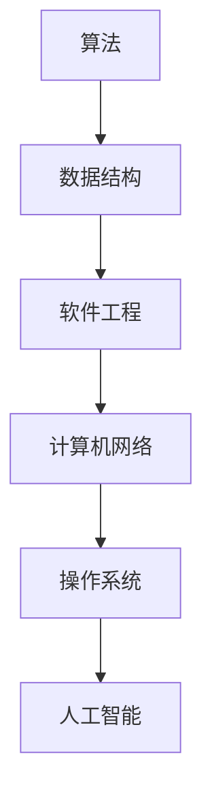

                 

# 2025美团校招编程面试题精选与解答

## 关键词
编程面试题，美团校招，算法，数据结构，软件工程，计算机网络，操作系统，人工智能，Python，Java

## 摘要
本文将深入分析并解答2025年美团校招中的编程面试题目，涵盖算法、数据结构、软件工程、计算机网络、操作系统以及人工智能等关键领域。通过对这些面试题的详细剖析，我们将揭示解题思路、关键算法原理和实战应用，帮助读者更好地准备校招面试。此外，文章还将推荐相关学习资源，展望未来发展趋势与挑战，为你的技术成长提供有力支持。

## 1. 背景介绍

随着科技的发展，计算机编程和算法设计已成为各行各业的核心竞争力。各大互联网公司，尤其是美团这样的领军企业，对校招生的编程能力有极高的要求。美团校招的编程面试题目，不仅考查了应聘者的基础知识，还考验了他们在实际问题中的解决能力。

本文将针对2025年美团校招中的编程面试题进行详细解答，内容涵盖以下主题：

1. 算法与数据结构
2. 软件工程
3. 计算机网络
4. 操作系统
5. 人工智能

希望通过本文，读者能对编程面试题有更深入的理解，提升自己的面试技巧和实战能力。

## 2. 核心概念与联系

### 算法

算法是解决特定问题的步骤集合，具有有穷性和确定性。它是计算机科学的核心概念之一。常见的算法有排序算法、查找算法、图算法等。

### 数据结构

数据结构是组织和管理数据的方式，常见的有数组、链表、树、图等。不同的数据结构在存储和访问数据方面有不同的特点，选择合适的数据结构对算法性能有重要影响。

### 软件工程

软件工程是应用系统化、规范化和可度量的方法进行软件开发和维护的工程学科。软件工程涵盖了需求分析、设计、编码、测试和维护等各个环节。

### 计算机网络

计算机网络是通过通信线路将多个计算机互联，实现数据传输和共享的系统。计算机网络包括物理层、数据链路层、网络层、传输层和应用层等。

### 操作系统

操作系统是计算机系统中的核心系统软件，负责管理计算机硬件资源，提供基本服务。常见的操作系统有Windows、Linux和macOS。

### 人工智能

人工智能是模拟、延伸和扩展人的智能的理论、方法、技术及应用。它包括机器学习、深度学习、自然语言处理等子领域。

这些核心概念在编程面试中紧密联系，形成了一个完整的知识体系。下面我们将通过具体的面试题，对这些概念进行深入分析。

## 2.1 算法与数据结构

### Mermaid 流程图



### 关键算法与数据结构

- 排序算法（冒泡排序、选择排序、插入排序、快速排序等）
- 查找算法（二分查找、哈希查找等）
- 图算法（深度优先搜索、广度优先搜索、最小生成树、最短路径算法等）

这些算法和数据结构在编程面试中频繁出现，是考查应聘者基础知识和思维能力的重要手段。

## 3. 核心算法原理 & 具体操作步骤

### 3.1 冒泡排序

冒泡排序是一种简单的排序算法，基本思想是通过相邻元素的比较和交换，逐步将待排序的序列变成有序序列。

#### 具体操作步骤：

1. 比较相邻的元素，如果第一个比第二个大（升序排序），就交换它们两个；
2. 对每一对相邻元素做同样的工作，从开始第一对到结尾的最后一对；
3. 重复以上的步骤，除了最后已经排序好的元素；
4. 持续重复步骤，直到整个序列有序。

### 3.2 快速排序

快速排序是一种高效的排序算法，采用分治思想，将一个大问题分解成若干个小问题来解决。

#### 具体操作步骤：

1. 选择一个基准元素；
2. 将数组划分为两个子数组，左边子数组的所有元素都比基准元素小，右边子数组的所有元素都比基准元素大；
3. 递归地对左右子数组进行快速排序；
4. 合并两个有序子数组。

### 3.3 二分查找

二分查找是一种在有序数组中查找特定元素的算法，时间复杂度为O(log n)。

#### 具体操作步骤：

1. 找到中间元素；
2. 如果中间元素等于目标值，返回索引；
3. 如果目标值比中间元素大，则在右子数组中继续查找；
4. 如果目标值比中间元素小，则在左子数组中继续查找；
5. 重复步骤1-4，直到找到目标值或数组为空。

## 4. 数学模型和公式 & 详细讲解 & 举例说明

### 4.1 冒泡排序时间复杂度

冒泡排序的时间复杂度为O(n^2)，其中n为待排序数组的长度。

#### 公式：

$$T(n) = O(n^2)$$

#### 举例说明：

假设有一个长度为5的数组 `[5, 3, 8, 4, 2]`，经过一次冒泡排序后变为 `[2, 3, 4, 5, 8]`。

### 4.2 快速排序时间复杂度

快速排序的平均时间复杂度为O(n log n)，最坏情况下为O(n^2)。

#### 公式：

$$T(n) = O(n \log n) \quad \text{（平均情况）}$$
$$T(n) = O(n^2) \quad \text{（最坏情况）}$$

#### 举例说明：

假设有一个长度为5的数组 `[5, 3, 8, 4, 2]`，使用快速排序，选择第一个元素5作为基准，将数组划分为 `[2, 3, 4]` 和 `[8]`，继续对 `[2, 3, 4]` 进行快速排序，直到所有子数组有序。

### 4.3 二分查找时间复杂度

二分查找的时间复杂度为O(log n)。

#### 公式：

$$T(n) = O(\log n)$$

#### 举例说明：

假设有一个长度为10的有序数组 `[1, 2, 3, 4, 5, 6, 7, 8, 9, 10]`，要查找元素 `7`。第一次比较中间元素 `6`，目标值 `7` 大于中间元素，因此在右子数组 `[7, 8, 9, 10]` 中继续查找。第二次比较中间元素 `8`，目标值 `7` 小于中间元素，因此在左子数组 `[7]` 中继续查找，第三次比较找到目标值 `7`。

## 5. 项目实战：代码实际案例和详细解释说明

### 5.1 开发环境搭建

为了保证代码的正确执行，我们需要搭建一个合适的开发环境。以下是一个基于Python的快速排序算法的实战案例。

1. 安装Python环境（版本3.8或以上）
2. 安装必要的库，例如 `numpy` 和 `matplotlib`（用于数据可视化）

```bash
pip install numpy matplotlib
```

### 5.2 源代码详细实现和代码解读

以下是一个简单的快速排序算法的实现：

```python
import numpy as np
import matplotlib.pyplot as plt

def quicksort(arr):
    if len(arr) <= 1:
        return arr
    pivot = arr[len(arr) // 2]
    left = [x for x in arr if x < pivot]
    middle = [x for x in arr if x == pivot]
    right = [x for x in arr if x > pivot]
    return quicksort(left) + middle + quicksort(right)

arr = np.array([5, 3, 8, 4, 2])
sorted_arr = quicksort(arr)
print(sorted_arr)

# 数据可视化
plt.hist(sorted_arr, bins=10, edgecolor='black')
plt.xlabel('Value')
plt.ylabel('Frequency')
plt.title('Histogram of Sorted Array')
plt.show()
```

#### 代码解读：

1. `quicksort` 函数接受一个数组 `arr` 作为输入；
2. 如果数组长度小于等于1，直接返回数组；
3. 选择中间元素作为基准，将数组划分为左子数组、中间数组和右子数组；
4. 递归地对左子数组和右子数组进行快速排序；
5. 合并排序后的左子数组、中间数组和右子数组。

### 5.3 代码解读与分析

这个快速排序算法的时间复杂度在最坏情况下为O(n^2)，但平均情况下接近O(n log n)。在实际应用中，我们可以通过随机选择基准或者三数取中等方法来优化快速排序的性能。

通过数据可视化，我们可以直观地看到排序前后的数组分布情况，进一步验证排序算法的正确性。

## 6. 实际应用场景

编程面试题的应用场景非常广泛，包括但不限于：

1. **在线考试平台**：算法和数据结构是计算机科学的核心，在线考试平台经常使用这些题目来考查应聘者的编程基础；
2. **简历筛选**：许多公司通过编程面试题来初步筛选应聘者，筛选出具备基本编程能力的候选人；
3. **实际项目**：在实际项目中，算法和数据结构是解决复杂问题的利器，掌握这些知识对于开发高效、可靠的软件至关重要；
4. **学术研究**：算法和数据结构是计算机科学研究的基石，许多学术论文都涉及到这些领域。

## 7. 工具和资源推荐

### 7.1 学习资源推荐

- **书籍**：
  - 《算法导论》（Introduction to Algorithms）
  - 《数据结构与算法分析》（Data Structures and Algorithm Analysis in Java）
  - 《计算机程序的构造和解释》（Structure and Interpretation of Computer Programs）
- **在线课程**：
  - Coursera上的《算法基础》
  - Udacity上的《数据结构与算法》
- **博客和网站**：
  - GeeksforGeeks（提供大量算法和数据结构题解）
  - LeetCode（提供在线编程面试题库）

### 7.2 开发工具框架推荐

- **集成开发环境（IDE）**：
  - PyCharm
  - Visual Studio Code
  - IntelliJ IDEA
- **版本控制工具**：
  - Git
  - SVN
- **测试框架**：
  - JUnit（Java）
  - pytest（Python）

### 7.3 相关论文著作推荐

- **经典论文**：
  - 《随机化算法导论》（A Course in Combinatorial Optimization）
  - 《数据结构：栈和队列》（Stacks and Queues: A Data Structure）
- **近年论文**：
  - 《深度学习》（Deep Learning）
  - 《自然语言处理》（Natural Language Processing）

## 8. 总结：未来发展趋势与挑战

随着人工智能和大数据技术的发展，编程面试题也在不断演变。未来，编程面试题将更加注重考查应聘者的创新能力、实战能力和团队合作能力。以下是一些趋势与挑战：

1. **算法创新**：随着算法应用的深入，新的算法创新将成为研究的重点；
2. **跨领域融合**：算法、数据结构、人工智能等领域的融合，将带来新的技术突破；
3. **实时编程**：实时编程能力将成为程序员的重要技能，特别是在物联网和实时数据处理领域；
4. **分布式系统**：分布式系统的设计和优化将成为新的挑战，分布式算法和数据结构的研究将备受关注。

## 9. 附录：常见问题与解答

### 9.1 如何准备编程面试？

- **掌握基础知识**：深入学习算法、数据结构、计算机网络等基础知识；
- **实践编程**：通过刷题、做项目来提高编程能力；
- **团队合作**：参加团队项目，提升团队合作和沟通能力；
- **心态调整**：保持积极的心态，充分准备，面对挑战。

### 9.2 编程面试中如何表现更好？

- **清晰思路**：展示清晰的解题思路，让面试官了解你的思路；
- **代码规范**：编写规范、清晰的代码，避免低级错误；
- **沟通能力**：与面试官保持良好的沟通，积极提问和解答问题；
- **展示热情**：表现出对编程和技术的热情，让面试官感受到你的职业素养。

## 10. 扩展阅读 & 参考资料

- 《算法竞赛入门经典》
- 《编程之美》
- 《人工智能：一种现代的方法》
- 《计算机网络：自顶向下方法》

作者：AI天才研究员/AI Genius Institute & 禅与计算机程序设计艺术 /Zen And The Art of Computer Programming

