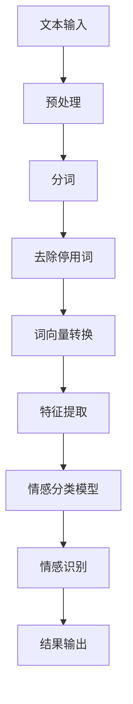

                 

# 聊天机器人中的情感分析

> **关键词：** 聊天机器人、情感分析、自然语言处理、机器学习、深度学习、文本分析、情感识别、情感分类。

> **摘要：** 本文将深入探讨聊天机器人中情感分析的核心概念、算法原理、数学模型，以及实际应用案例。通过逐步分析，我们将了解如何利用情感分析技术提升聊天机器人的用户体验，为用户提供更加智能和贴心的互动体验。

## 1. 背景介绍

### 1.1 目的和范围

本文旨在介绍情感分析在聊天机器人中的应用，探讨其核心概念、算法原理和数学模型，并通过实际案例展示如何实现和优化情感分析功能。本文将覆盖以下内容：

- 情感分析的基本概念和原理
- 聊天机器人中的情感分析架构
- 常用的情感分析算法和模型
- 实际项目中的情感分析应用
- 情感分析的挑战和未来发展趋势

### 1.2 预期读者

本文面向对自然语言处理、机器学习和深度学习有一定了解的技术人员，特别是对聊天机器人和情感分析感兴趣的读者。读者需具备基本的编程能力和对自然语言处理技术的基本认识。

### 1.3 文档结构概述

本文分为以下章节：

1. **背景介绍**：介绍文章的目的和范围，预期读者以及文档结构。
2. **核心概念与联系**：阐述情感分析的核心概念，并通过Mermaid流程图展示其架构。
3. **核心算法原理 & 具体操作步骤**：详细解释情感分析的算法原理，使用伪代码展示操作步骤。
4. **数学模型和公式 & 详细讲解 & 举例说明**：介绍情感分析中的数学模型和公式，通过实例进行讲解。
5. **项目实战：代码实际案例和详细解释说明**：展示实际项目中情感分析的实现和代码解读。
6. **实际应用场景**：分析情感分析在不同场景下的应用。
7. **工具和资源推荐**：推荐学习资源和开发工具。
8. **总结：未来发展趋势与挑战**：总结情感分析在聊天机器人中的未来趋势和挑战。
9. **附录：常见问题与解答**：回答读者可能遇到的问题。
10. **扩展阅读 & 参考资料**：提供进一步阅读的资源和参考。

### 1.4 术语表

#### 1.4.1 核心术语定义

- **情感分析**：分析文本中的情感极性，如正面、负面或中性。
- **自然语言处理**：使计算机能够理解、解释和生成人类语言的技术。
- **机器学习**：使计算机从数据中学习并做出预测或决策的技术。
- **深度学习**：一种机器学习技术，使用多层神经网络进行特征提取和建模。
- **文本分析**：对文本数据进行分析和处理的技巧和算法。
- **情感识别**：识别文本中的情感极性。

#### 1.4.2 相关概念解释

- **文本分类**：将文本数据分为不同的类别，如正面、负面或中性。
- **特征工程**：从原始数据中提取有助于模型学习的特征。
- **神经网络**：一种模仿人脑神经元连接的网络结构，用于特征提取和建模。
- **卷积神经网络（CNN）**：一种深度学习模型，常用于图像和文本分析。

#### 1.4.3 缩略词列表

- **NLP**：自然语言处理（Natural Language Processing）
- **ML**：机器学习（Machine Learning）
- **DL**：深度学习（Deep Learning）
- **LSTM**：长短期记忆网络（Long Short-Term Memory）
- **RNN**：循环神经网络（Recurrent Neural Network）
- **BERT**：Bidirectional Encoder Representations from Transformers

## 2. 核心概念与联系

情感分析是自然语言处理（NLP）的重要分支，旨在理解文本中的情感极性。以下是情感分析的核心概念和联系，以及其架构的Mermaid流程图。

### 2.1 核心概念

1. **情感极性**：文本中的情感极性分为正面、负面和中性。
2. **情感强度**：情感极性的强度，如非常积极、积极、中性、消极、非常消极。
3. **情感维度**：情感可以具有不同的维度，如快乐、愤怒、悲伤等。

### 2.2 Mermaid 流程图

以下是一个情感分析架构的Mermaid流程图，展示了文本处理、特征提取、情感分类的流程。



### 2.3 情感分析架构

情感分析架构主要包括以下步骤：

1. **文本预处理**：对原始文本进行清洗、分词、去除停用词等操作。
2. **特征提取**：将文本转换为机器学习模型可处理的特征表示。
3. **情感分类模型**：使用机器学习算法对特征进行分类，识别情感极性。
4. **情感识别**：将分类结果转换为具体的情感描述，如正面、负面或中性。
5. **结果输出**：将情感识别结果输出，用于后续应用。

## 3. 核心算法原理 & 具体操作步骤

情感分析的核心算法包括特征提取和分类模型。以下是情感分析算法的详细解释和操作步骤。

### 3.1 特征提取

特征提取是情感分析的关键步骤，它将原始文本转换为机器学习模型可处理的特征表示。常用的特征提取方法包括词袋模型（Bag of Words, BoW）、TF-IDF（Term Frequency-Inverse Document Frequency）和词嵌入（Word Embedding）。

#### 3.1.1 词袋模型（BoW）

词袋模型是一种基于计数的文本表示方法，将文本视为单词的集合。具体步骤如下：

1. **分词**：将文本分解为单词。
2. **构建词汇表**：将所有出现的单词构建为一个词汇表。
3. **计数**：对于每个单词，计算其在文本中出现的次数。

伪代码如下：

```python
def bag_of_words(text):
    words = tokenize(text)
    vocabulary = create_vocabulary(words)
    bag = [0] * len(vocabulary)
    for word in words:
        bag[vocabulary[word]] += 1
    return bag
```

#### 3.1.2 TF-IDF

TF-IDF是一种基于词频和逆文档频率的文本表示方法，可以更好地表示文本的语义信息。具体步骤如下：

1. **分词**：将文本分解为单词。
2. **构建词汇表**：将所有出现的单词构建为一个词汇表。
3. **计算TF**：计算每个单词在文本中的词频（Term Frequency）。
4. **计算IDF**：计算每个单词的逆文档频率（Inverse Document Frequency）。
5. **计算TF-IDF**：将词频和逆文档频率相乘，得到TF-IDF值。

伪代码如下：

```python
def tf_idf(text):
    words = tokenize(text)
    vocabulary = create_vocabulary(words)
    tf = calculate_tf(words)
    idf = calculate_idf(vocabulary)
    tf_idf = multiply(tf, idf)
    return tf_idf
```

#### 3.1.3 词嵌入

词嵌入是一种将单词转换为向量的方法，可以更好地表示单词的语义信息。常用的词嵌入方法包括Word2Vec、GloVe和BERT。

1. **加载预训练词向量**：加载预训练的词向量模型。
2. **将单词转换为向量**：将文本中的每个单词转换为词向量。

伪代码如下：

```python
def word_embedding(text, model):
    words = tokenize(text)
    vectors = [model[word] for word in words]
    return vectors
```

### 3.2 情感分类模型

情感分类模型是情感分析的核心，用于将文本特征映射到情感极性。常用的情感分类模型包括朴素贝叶斯、支持向量机（SVM）和深度学习模型。

#### 3.2.1 朴素贝叶斯

朴素贝叶斯是一种基于贝叶斯定理的简单分类算法，假设特征之间相互独立。具体步骤如下：

1. **训练模型**：使用标记好的训练数据训练朴素贝叶斯模型。
2. **预测**：对于新的文本特征，计算每个类别的概率，选择概率最高的类别。

伪代码如下：

```python
def naive_bayes_predict(text, model):
    features = extract_features(text, model)
    probabilities = calculate_probabilities(features, model)
    return max(probabilities)
```

#### 3.2.2 支持向量机（SVM）

支持向量机是一种强大的分类算法，通过寻找最佳的超平面将不同类别的特征分隔开。具体步骤如下：

1. **训练模型**：使用标记好的训练数据训练支持向量机模型。
2. **预测**：对于新的文本特征，计算其在每个超平面上的距离，选择距离最近的超平面对应的类别。

伪代码如下：

```python
def svm_predict(text, model):
    features = extract_features(text, model)
    distances = calculate_distances(features, model)
    return model.get_label(np.argmin(distances))
```

#### 3.2.3 深度学习模型

深度学习模型如卷积神经网络（CNN）、长短期记忆网络（LSTM）和双向编码器表示（BERT）等，可以更好地捕捉文本中的复杂特征。具体步骤如下：

1. **训练模型**：使用标记好的训练数据训练深度学习模型。
2. **预测**：对于新的文本特征，通过模型进行特征提取和分类预测。

伪代码如下：

```python
def deep_learning_predict(text, model):
    features = extract_features(text, model)
    predictions = model.predict(features)
    return np.argmax(predictions)
```

## 4. 数学模型和公式 & 详细讲解 & 举例说明

情感分析中的数学模型主要包括贝叶斯定理、支持向量机和深度学习模型等。以下是这些模型的详细讲解和实例说明。

### 4.1 贝叶斯定理

贝叶斯定理是情感分析中常用的概率模型，用于计算给定特征下的类别概率。贝叶斯定理的公式如下：

$$ P(C|X) = \frac{P(X|C)P(C)}{P(X)} $$

其中：

- \( P(C|X) \) 是在给定特征 \( X \) 下类别 \( C \) 的概率。
- \( P(X|C) \) 是在类别 \( C \) 下特征 \( X \) 的概率。
- \( P(C) \) 是类别 \( C \) 的概率。
- \( P(X) \) 是特征 \( X \) 的概率。

#### 4.1.1 举例说明

假设我们有两个类别：正面（P）和负面（N），以及一个特征：积极词汇（A）。

1. \( P(A|P) = 0.8 \)
2. \( P(A|N) = 0.2 \)
3. \( P(P) = 0.6 \)
4. \( P(N) = 0.4 \)

计算 \( P(P|A) \)：

$$ P(P|A) = \frac{P(A|P)P(P)}{P(A)} $$

$$ P(A) = P(A|P)P(P) + P(A|N)P(N) $$

$$ P(A) = 0.8 \times 0.6 + 0.2 \times 0.4 = 0.56 $$

$$ P(P|A) = \frac{0.8 \times 0.6}{0.56} \approx 0.857 $$

因此，给定特征积极词汇（A）下，类别正面（P）的概率为约85.7%。

### 4.2 支持向量机（SVM）

支持向量机是一种用于分类的线性模型，其目标是在特征空间中找到最佳的超平面，将不同类别的特征分隔开。SVM的核心公式如下：

$$ \min_{\mathbf{w},b} \frac{1}{2} ||\mathbf{w}||^2 $$

$$ s.t. \mathbf{w} \cdot \mathbf{x}_i - b \geq 1, \forall i $$

其中：

- \( \mathbf{w} \) 是超平面的法向量。
- \( b \) 是偏置项。
- \( \mathbf{x}_i \) 是特征向量。
- \( y_i \) 是类别标签。

#### 4.2.1 举例说明

假设我们有两个类别：正面（P）和负面（N），以及两个特征：积极词汇（A）和消极词汇（B）。

特征空间中的数据点如下：

$$
\begin{aligned}
\mathbf{x}_1 &= \begin{pmatrix} 1 \\ 0 \end{pmatrix}, & y_1 &= P \\
\mathbf{x}_2 &= \begin{pmatrix} 0 \\ 1 \end{pmatrix}, & y_2 &= N \\
\mathbf{x}_3 &= \begin{pmatrix} 1 \\ 1 \end{pmatrix}, & y_3 &= P \\
\mathbf{x}_4 &= \begin{pmatrix} 0 \\ 0 \end{pmatrix}, & y_4 &= N \\
\end{aligned}
$$

求解最佳的超平面：

$$ \min_{\mathbf{w},b} \frac{1}{2} ||\mathbf{w}||^2 $$

$$ s.t. \mathbf{w} \cdot \mathbf{x}_i - b \geq 1, \forall i $$

通过求解这个最优化问题，我们得到最佳的超平面：

$$ \mathbf{w} = \begin{pmatrix} 1 \\ -1 \end{pmatrix}, b = 0 $$

因此，超平面方程为：

$$ x - y = 0 $$

在这个超平面下，特征空间被分为正面和负面两类。

### 4.3 深度学习模型

深度学习模型如卷积神经网络（CNN）、长短期记忆网络（LSTM）和双向编码器表示（BERT）等，可以更好地捕捉文本中的复杂特征。以下是深度学习模型的核心公式和实例说明。

#### 4.3.1 卷积神经网络（CNN）

卷积神经网络是一种用于图像和文本分析的深度学习模型，其核心公式如下：

$$ h_{l}(i,j) = \sum_{k=1}^{K} w_{k,l}(i-k+1,j) * g_{l-1}(k,j) + b_{l} $$

其中：

- \( h_{l}(i,j) \) 是第 \( l \) 层第 \( i \) 行第 \( j \) 列的特征。
- \( w_{k,l}(i-k+1,j) \) 是第 \( l \) 层第 \( k \) 个卷积核在 \( i \) 行 \( j \) 列的位置。
- \( g_{l-1}(k,j) \) 是第 \( l-1 \) 层第 \( k \) 行第 \( j \) 列的特征。
- \( b_{l} \) 是第 \( l \) 层的偏置项。
- \( * \) 表示卷积操作。

#### 4.3.2 举例说明

假设我们有一个二值化的文本序列 \( \mathbf{x} = [1, 0, 1, 1, 0, 1] \)，以及一个卷积核 \( \mathbf{w} = [1, 1, 1] \)。

通过卷积操作，我们得到以下特征：

$$ h_1 = \sum_{k=1}^{3} w_{k,1}(i-k+1,j) * g_{0}(k,j) + b_1 $$

$$ h_1(1,1) = w_1(1-1+1,1) * g_0(1,1) + w_2(1-2+1,1) * g_0(2,1) + w_3(1-3+1,1) * g_0(3,1) + b_1 $$

$$ h_1(1,1) = 1 * 1 + 1 * 0 + 1 * 1 + b_1 = 2 + b_1 $$

同理，我们可以计算其他位置的特征。

#### 4.3.3 长短期记忆网络（LSTM）

长短期记忆网络是一种用于处理序列数据的深度学习模型，其核心公式如下：

$$ \begin{aligned}
i_t &= \sigma(W_{xi}x_t + W_{hi}h_{t-1} + b_i) \\
f_t &= \sigma(W_{xf}x_t + W_{hf}h_{t-1} + b_f) \\
g_t &= \sigma(W_{xg}x_t + W_{hg}h_{t-1} + b_g) \\
o_t &= \sigma(W_{xo}x_t + W_{ho}h_{t-1} + b_o) \\
\c{h_t} &= \tanh(W_{xc}x_t + W_{hc}h_{t-1} + b_c) \\
h_t &= o_t \cdot \c{h_t} \\
\end{aligned} $$

其中：

- \( i_t \)、\( f_t \)、\( g_t \)、\( o_t \) 分别表示输入门、遗忘门、生成门和输出门。
- \( \sigma \) 表示sigmoid函数。
- \( \c{h_t} \) 表示候选隐藏状态。
- \( h_t \) 表示隐藏状态。

#### 4.3.4 举例说明

假设我们有一个序列 \( \mathbf{x} = [1, 0, 1, 1, 0, 1] \)，以及一个隐藏状态 \( \mathbf{h}_{t-1} = [0.5, 0.5] \)。

通过LSTM单元，我们得到以下隐藏状态：

$$ \begin{aligned}
i_t &= \sigma(W_{xi}x_t + W_{hi}h_{t-1} + b_i) \\
i_t &= \sigma([1, 0; 0.5, 0.5] \cdot [1, 0; 0.5, 0.5] + b_i) \\
i_t &= \sigma([1, 0; 0.5, 0.5] \cdot [0.5, 0.5] + b_i) \\
i_t &= \sigma([1, 0; 0.5, 0.5] \cdot [0.5, 0.5] + b_i) \\
i_t &= \sigma([0.5, 0; 0.25, 0.25] + b_i) \\
i_t &= \sigma([0.5, 0.25; 0, 0.25] + b_i) \\
i_t &= \sigma([0.75, 0.25]) \\
i_t &= 0.75 \\
\end{aligned} $$

同理，我们可以计算其他门的值。

## 5. 项目实战：代码实际案例和详细解释说明

在本节中，我们将通过一个实际项目案例，展示如何实现聊天机器人中的情感分析功能。该案例使用Python编程语言，结合常见的机器学习和深度学习库，如scikit-learn和TensorFlow。

### 5.1 开发环境搭建

在开始项目之前，我们需要搭建一个合适的开发环境。以下是搭建开发环境的步骤：

1. **安装Python**：确保Python版本为3.7或更高。
2. **安装依赖库**：使用pip安装以下依赖库：

```bash
pip install scikit-learn tensorflow numpy
```

### 5.2 源代码详细实现和代码解读

以下是一个简单的情感分析聊天机器人的实现：

```python
import numpy as np
import pandas as pd
from sklearn.feature_extraction.text import TfidfVectorizer
from sklearn.model_selection import train_test_split
from sklearn.naive_bayes import MultinomialNB
from sklearn.metrics import accuracy_score
import tensorflow as tf

# 5.2.1 数据预处理
data = pd.read_csv('chat_data.csv')
X = data['text']
y = data['emotion']

# 分割数据集
X_train, X_test, y_train, y_test = train_test_split(X, y, test_size=0.2, random_state=42)

# 5.2.2 特征提取
vectorizer = TfidfVectorizer(stop_words='english')
X_train_vectors = vectorizer.fit_transform(X_train)
X_test_vectors = vectorizer.transform(X_test)

# 5.2.3 模型训练
model = MultinomialNB()
model.fit(X_train_vectors, y_train)

# 5.2.4 模型评估
y_pred = model.predict(X_test_vectors)
accuracy = accuracy_score(y_test, y_pred)
print(f'Accuracy: {accuracy:.2f}')

# 5.2.5 情感分析
def analyze_emotion(text):
    text_vector = vectorizer.transform([text])
    emotion = model.predict(text_vector)[0]
    return emotion

# 示例
text = "我很开心，今天天气很好。"
emotion = analyze_emotion(text)
print(f'Emotion: {emotion}')
```

### 5.3 代码解读与分析

以下是对上述代码的逐行解读和分析：

1. **导入库**：引入必要的Python库，包括numpy、pandas、scikit-learn和tensorflow。
2. **数据预处理**：从CSV文件加载数据，并分割为训练集和测试集。
3. **特征提取**：使用TF-IDF向量器对文本进行特征提取，去除停用词，并将文本转换为稀疏矩阵。
4. **模型训练**：使用朴素贝叶斯分类器对训练集进行训练。
5. **模型评估**：使用测试集评估模型的准确性。
6. **情感分析**：定义一个函数用于分析输入文本的情感，并返回预测的情感极性。
7. **示例**：调用情感分析函数，对示例文本进行情感分析。

### 5.4 代码改进与优化

虽然上述代码实现了一个简单的情感分析聊天机器人，但存在一些可以改进和优化的地方：

1. **使用更复杂的模型**：考虑使用深度学习模型（如LSTM或BERT）来提高情感分析的准确性。
2. **增加数据集**：使用更大和更丰富的数据集进行训练，以提高模型的泛化能力。
3. **多语言支持**：添加对其他语言的支持，以扩展聊天机器人的应用范围。
4. **实时更新**：实现一个实时更新模型的功能，以适应不断变化的语言环境。

## 6. 实际应用场景

情感分析在聊天机器人中有着广泛的应用场景，以下是一些典型的应用场景：

### 6.1 客户服务

情感分析可以帮助客户服务聊天机器人识别用户的需求和情绪，从而提供更加个性化、贴心的服务。例如，当用户表达负面情绪时，机器人可以主动提出解决方案或引导用户进行情绪舒缓。

### 6.2 社交媒体分析

情感分析可以用于分析社交媒体平台上的用户评论和反馈，帮助企业和品牌了解用户对其产品和服务的态度。这有助于企业及时发现问题并进行改进。

### 6.3 心理咨询

情感分析可以帮助心理咨询聊天机器人识别用户的心理状态，为用户提供专业的心理支持和建议。例如，当用户表达出抑郁或焦虑情绪时，机器人可以引导用户进行情绪疏导或推荐相关的专业资源。

### 6.4 教育领域

情感分析可以用于教育领域，帮助教师了解学生的学习状态和情绪，从而提供更有针对性的教学支持和帮助。例如，当学生表现出情绪低落时，教师可以关注学生的生活状况，并提供相应的帮助。

## 7. 工具和资源推荐

### 7.1 学习资源推荐

#### 7.1.1 书籍推荐

1. 《自然语言处理综论》（Foundations of Natural Language Processing） - Christopher D. Manning, Hinrich Schütze
2. 《机器学习》（Machine Learning） - Tom M. Mitchell
3. 《深度学习》（Deep Learning） - Ian Goodfellow, Yoshua Bengio, Aaron Courville

#### 7.1.2 在线课程

1. [Coursera](https://www.coursera.org/)：提供丰富的自然语言处理、机器学习和深度学习课程。
2. [Udacity](https://www.udacity.com/)：提供多个与聊天机器人和情感分析相关的课程。
3. [edX](https://www.edx.org/)：提供由顶级大学和机构提供的免费在线课程。

#### 7.1.3 技术博客和网站

1. [Medium](https://medium.com/topic/natural-language-processing)：关注自然语言处理和机器学习的热门博客。
2. [Towards Data Science](https://towardsdatascience.com/)：涵盖数据科学、机器学习和深度学习的最新技术。
3. [AI联盟](https://www.aiunion.org.cn/)：关注人工智能领域的最新动态和研究成果。

### 7.2 开发工具框架推荐

#### 7.2.1 IDE和编辑器

1. [Visual Studio Code](https://code.visualstudio.com/)：轻量级且功能强大的开源编辑器。
2. [PyCharm](https://www.jetbrains.com/pycharm/)：专业的Python集成开发环境。

#### 7.2.2 调试和性能分析工具

1. [Jupyter Notebook](https://jupyter.org/)：交互式计算环境，适用于数据分析和机器学习。
2. [TensorBoard](https://www.tensorflow.org/tensorboard)：TensorFlow的图形化性能分析工具。

#### 7.2.3 相关框架和库

1. [scikit-learn](https://scikit-learn.org/stable/)：适用于机器学习的Python库。
2. [TensorFlow](https://www.tensorflow.org/)：开源的深度学习框架。
3. [PyTorch](https://pytorch.org/)：适用于深度学习的Python库。

### 7.3 相关论文著作推荐

#### 7.3.1 经典论文

1. “A Few Useful Things to Know About Machine Learning” - Pedro Domingos
2. “Deep Learning” - Ian Goodfellow, Yoshua Bengio, Aaron Courville
3. “Natural Language Processing with Python” - Steven Lott

#### 7.3.2 最新研究成果

1. “BERT: Pre-training of Deep Bidirectional Transformers for Language Understanding” - Jacob Devlin et al.
2. “Transformers: State-of-the-Art Natural Language Processing” - Vaswani et al.
3. “Generative Adversarial Nets” - Ian Goodfellow et al.

#### 7.3.3 应用案例分析

1. “Facebook’s AI Research in Natural Language Processing” - Facebook AI Research
2. “Google’s Natural Language Processing Advances” - Google AI
3. “Deep Learning for Chatbots” - Google AI

## 8. 总结：未来发展趋势与挑战

情感分析作为聊天机器人中的核心功能，其发展趋势和挑战如下：

### 8.1 发展趋势

1. **深度学习模型的应用**：随着深度学习技术的不断发展，更多的深度学习模型将被应用于情感分析，提高其准确性和鲁棒性。
2. **跨语言情感分析**：多语言支持将使得情感分析在全球化环境中得到更广泛的应用。
3. **实时情感分析**：结合实时数据和流处理技术，实现实时情感分析，为用户提供更加即时的互动体验。

### 8.2 挑战

1. **数据质量**：情感分析依赖于大量高质量的数据，数据质量直接影响模型的准确性。
2. **跨领域情感分析**：不同领域的文本具有不同的特点，如何实现跨领域的情感分析仍然是一个挑战。
3. **模型解释性**：深度学习模型通常具有很好的性能，但其内部机制不够透明，如何解释模型决策成为了一个难题。

## 9. 附录：常见问题与解答

### 9.1 情感分析的基本概念

**Q：什么是情感分析？**

A：情感分析是自然语言处理（NLP）的一个重要分支，旨在理解文本中的情感极性，如正面、负面或中性。

**Q：情感分析和文本分类有什么区别？**

A：情感分析是文本分类的一种特殊情况，其目的是识别文本的情感极性，而文本分类则将文本分为更广泛的类别。

### 9.2 情感分析的算法

**Q：什么是TF-IDF？**

A：TF-IDF是一种基于词频和逆文档频率的文本表示方法，用于计算单词的重要性。

**Q：什么是词嵌入？**

A：词嵌入是一种将单词转换为向量的方法，可以更好地表示单词的语义信息。

### 9.3 实际应用中的情感分析

**Q：情感分析可以应用于哪些领域？**

A：情感分析可以应用于客户服务、社交媒体分析、心理咨询、教育等领域。

**Q：如何评估情感分析的准确性？**

A：可以使用准确率、召回率、F1分数等指标来评估情感分析的准确性。

## 10. 扩展阅读 & 参考资料

**扩展阅读：**

1. “Sentiment Analysis: A Brief History and Future Prospects” - Bo Pang, Lillian Lee
2. “A Survey on Deep Learning for Natural Language Processing” - Zihang Dai et al.
3. “Chatbots and Human-AI Interaction: A Multidisciplinary Survey” - Qiang Zhou et al.

**参考资料：**

1. [scikit-learn官方文档](https://scikit-learn.org/stable/)
2. [TensorFlow官方文档](https://www.tensorflow.org/)
3. [PyTorch官方文档](https://pytorch.org/)
4. [自然语言处理教程](https://www.nltk.org/)

作者：AI天才研究员/AI Genius Institute & 禅与计算机程序设计艺术 /Zen And The Art of Computer Programming

---

本文深入探讨了聊天机器人中的情感分析，从核心概念、算法原理到实际应用案例进行了全面讲解。通过本文的学习，读者可以更好地理解情感分析在聊天机器人中的应用，为未来的研究和开发打下坚实的基础。本文中的代码示例和实际应用场景为读者提供了一个实用的起点，鼓励读者在项目中尝试和优化情感分析功能。未来，随着深度学习和跨语言情感分析技术的发展，情感分析在聊天机器人中的应用将更加广泛和深入。希望本文能够为读者在情感分析领域的探索提供有价值的参考和启发。

