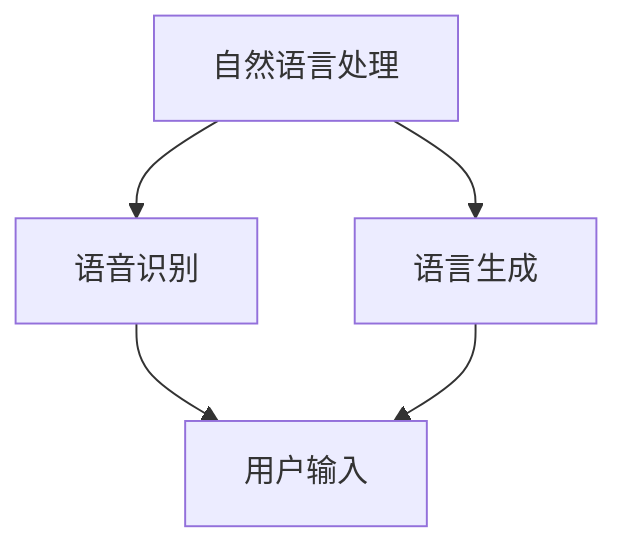
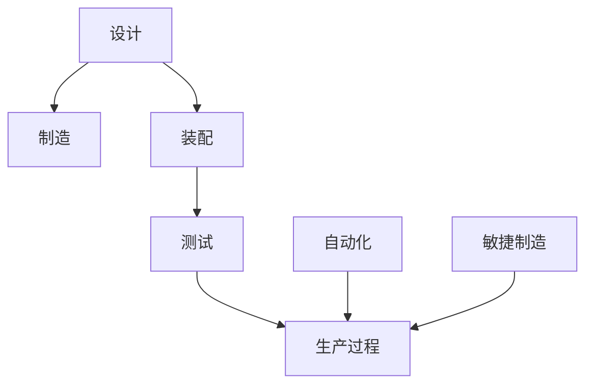
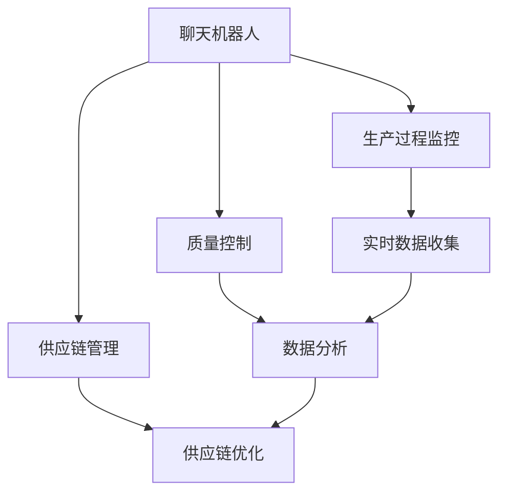
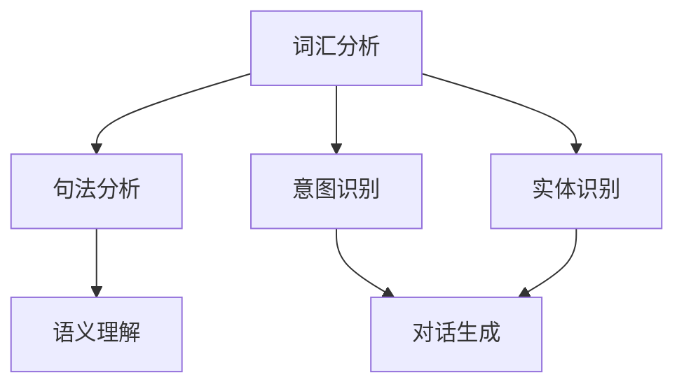
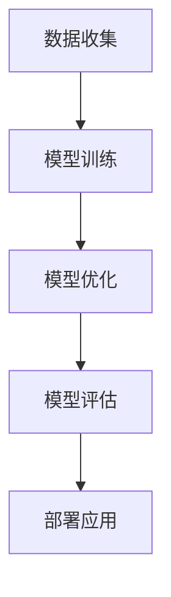

                 


# 聊天机器人制造业应用：优化生产过程

> 关键词：聊天机器人、制造业、生产过程优化、人工智能、流程自动化

> 摘要：本文旨在探讨如何利用聊天机器人技术在制造业中优化生产过程。我们将从背景介绍、核心概念、算法原理、数学模型、项目实战和实际应用场景等多个方面，详细分析并展示聊天机器人如何在制造业中发挥作用，提升生产效率和质量。

## 1. 背景介绍

### 1.1 目的和范围

本文的目标是阐述聊天机器人技术在制造业中的应用，特别是如何通过这些技术来优化生产过程。随着人工智能和机器学习技术的快速发展，聊天机器人在各行各业的应用越来越广泛，制造业也不例外。本文将重点讨论以下内容：

- 聊天机器人在制造业中的具体应用场景
- 如何利用聊天机器人实现生产过程的优化
- 聊天机器人技术的核心原理和算法
- 实际案例分析和项目实战

### 1.2 预期读者

本文面向以下读者群体：

- 制造业企业高管和决策者
- 人工智能和机器学习领域的专业人士
- 对生产过程优化感兴趣的工程师和技术人员
- 对聊天机器人应用有浓厚兴趣的学者和学生

### 1.3 文档结构概述

本文的结构如下：

- 第1章：背景介绍，阐述研究目的和预期读者。
- 第2章：核心概念与联系，介绍相关概念和架构。
- 第3章：核心算法原理 & 具体操作步骤，讲解算法原理和操作步骤。
- 第4章：数学模型和公式 & 详细讲解 & 举例说明，介绍相关数学模型和公式。
- 第5章：项目实战：代码实际案例和详细解释说明，展示实际案例和代码实现。
- 第6章：实际应用场景，讨论聊天机器人在制造业中的实际应用。
- 第7章：工具和资源推荐，推荐相关学习资源和工具。
- 第8章：总结：未来发展趋势与挑战，分析未来发展趋势和面临的挑战。
- 第9章：附录：常见问题与解答，回答常见问题。
- 第10章：扩展阅读 & 参考资料，提供进一步阅读的材料。

### 1.4 术语表

#### 1.4.1 核心术语定义

- 聊天机器人：一种基于人工智能技术，能够与人类进行自然语言交互，提供智能服务的计算机程序。
- 机器学习：一种人工智能技术，通过数据和算法让计算机自动学习并做出决策。
- 制造业：从事物品制造和生产的行业。
- 生产过程优化：通过对生产过程进行改进和优化，提高生产效率和质量。

#### 1.4.2 相关概念解释

- 自动化：通过使用计算机、机器人等技术，使生产过程自动化，减少人工干预。
- 敏捷制造：一种灵活的制造模式，能够快速响应市场需求变化，提高生产效率。
- 供应链管理：对供应链中的各个环节进行管理和协调，确保生产和供应的顺利进行。

#### 1.4.3 缩略词列表

- AI：人工智能
- ML：机器学习
- IoT：物联网
- ERP：企业资源规划系统
- CRM：客户关系管理系统

## 2. 核心概念与联系

为了更好地理解聊天机器人在制造业中的应用，我们需要先了解一些核心概念和它们之间的联系。

### 2.1 聊天机器人的核心概念

聊天机器人是一种基于人工智能技术的计算机程序，能够通过自然语言处理（NLP）与人类进行交互。聊天机器人的核心概念包括：

- 自然语言处理（NLP）：使计算机能够理解、解释和生成人类语言的技术。
- 语音识别：将人类语音转化为计算机可理解的语言。
- 语言生成：根据输入信息生成自然语言的回复。

#### Mermaid 流程图：



### 2.2 制造业的核心概念

制造业的核心概念包括：

- 生产过程：制造物品的过程，包括设计、制造、装配、测试等环节。
- 自动化：使用计算机、机器人等技术，实现生产过程的自动化。
- 敏捷制造：灵活的制造模式，能够快速响应市场需求变化。

#### Mermaid 流程图：



### 2.3 聊天机器人与制造业的联系

聊天机器人与制造业的联系主要体现在以下几个方面：

- 生产过程监控：利用聊天机器人实时监控生产过程，及时发现问题并采取相应措施。
- 质量控制：通过聊天机器人收集和分析产品质量数据，为质量控制提供依据。
- 供应链管理：利用聊天机器人优化供应链管理，提高供应链的响应速度和效率。

#### Mermaid 流�程图：



通过以上核心概念和流程图的介绍，我们可以更好地理解聊天机器人在制造业中的应用场景和优势。接下来，我们将深入探讨聊天机器人的核心算法原理和具体操作步骤。

## 3. 核心算法原理 & 具体操作步骤

### 3.1 聊天机器人的核心算法原理

聊天机器人的核心算法原理主要包括自然语言处理（NLP）和机器学习（ML）。下面我们将详细讲解这两个核心算法的原理。

#### 自然语言处理（NLP）

自然语言处理（NLP）是使计算机能够理解、解释和生成人类语言的技术。NLP的核心算法包括：

- 词汇分析：对输入文本进行分词、词性标注等预处理操作。
- 句法分析：对输入文本进行句法分析，理解句子的结构。
- 意图识别：识别用户的意图，如提问、请求、命令等。
- 实体识别：识别文本中的实体，如人名、地名、组织名等。

#### Mermaid 流程图：



#### 机器学习（ML）

机器学习（ML）是让计算机通过数据和算法自动学习和做出决策的技术。在聊天机器人中，机器学习主要应用于：

- 模型训练：通过大量对话数据训练聊天机器人模型，使其能够理解用户意图和生成合适回复。
- 模型优化：利用反馈数据对模型进行优化，提高聊天机器人的性能。

#### Mermaid 流程图：



### 3.2 具体操作步骤

下面我们将介绍如何利用聊天机器人优化制造业生产过程的具体操作步骤。

#### 步骤1：数据收集

首先，我们需要收集大量生产过程的数据，包括设备状态、生产进度、质量检测数据等。这些数据可以通过传感器、监控系统等实时收集。

#### 步骤2：数据预处理

对收集到的数据进行分析和处理，提取有用的信息。具体操作包括：

- 数据清洗：去除无效数据、缺失值和异常值。
- 特征提取：提取与生产过程相关的特征，如设备运行时间、生产效率等。
- 数据归一化：将不同特征的数据进行归一化处理，使其具有相同的量纲。

#### 步骤3：模型训练

利用收集到的数据，训练聊天机器人模型。具体操作包括：

- 选择合适的模型架构：如序列到序列（Seq2Seq）模型、长短时记忆网络（LSTM）等。
- 训练模型：通过优化模型参数，使模型能够理解用户意图和生成合适回复。
- 模型评估：对训练好的模型进行评估，如准确率、召回率等。

#### 步骤4：模型优化

根据用户反馈，对模型进行优化。具体操作包括：

- 调整模型参数：如学习率、批量大小等。
- 添加新的训练数据：根据用户反馈，收集新的对话数据，用于模型优化。
- 重新训练模型：利用新的训练数据，重新训练模型。

#### 步骤5：部署应用

将训练好的聊天机器人部署到生产环境中，具体操作包括：

- 集成到生产系统：将聊天机器人集成到现有的生产系统中，如ERP、CRM等。
- 提供实时监控：利用聊天机器人实时监控生产过程，及时发现问题。
- 提供智能反馈：根据用户反馈，提供智能化的建议和指导，如调整生产计划、优化生产参数等。

通过以上具体操作步骤，我们可以将聊天机器人应用于制造业生产过程的优化。接下来，我们将介绍数学模型和公式，以便更好地理解和分析聊天机器人的工作原理。

## 4. 数学模型和公式 & 详细讲解 & 举例说明

### 4.1 数学模型

聊天机器人的工作原理涉及到多个数学模型，以下将介绍其中的几个核心模型：

#### 4.1.1 自然语言处理模型

自然语言处理（NLP）模型通常基于神经网络，其中最常用的模型是循环神经网络（RNN）。RNN的核心公式如下：

\[ h_t = \sigma(W_h \cdot [h_{t-1}, x_t] + b_h) \]

其中：
- \( h_t \) 是时间步 \( t \) 的隐藏状态。
- \( x_t \) 是时间步 \( t \) 的输入。
- \( W_h \) 是权重矩阵。
- \( b_h \) 是偏置项。
- \( \sigma \) 是激活函数，通常使用sigmoid函数。

#### 4.1.2 生成模型

生成模型用于生成自然语言文本，其中最常用的是变分自编码器（VAE）。VAE的核心公式如下：

\[ z = \mu(x) + \sigma(x) \odot \epsilon \]

\[ x = \mu(z) + \sigma(z) \odot \epsilon \]

其中：
- \( z \) 是编码后的隐变量。
- \( \mu(x) \) 和 \( \sigma(x) \) 分别是编码器的均值和方差函数。
- \( x \) 是解码后的生成文本。
- \( \epsilon \) 是高斯噪声。

#### 4.1.3 强化学习模型

在聊天机器人中，强化学习模型用于训练聊天机器人的行为策略。常用的强化学习模型是深度Q网络（DQN）。DQN的核心公式如下：

\[ Q(s, a) = r + \gamma \max_{a'} Q(s', a') \]

其中：
- \( Q(s, a) \) 是状态 \( s \) 下采取动作 \( a \) 的预期收益。
- \( r \) 是即时奖励。
- \( \gamma \) 是折扣因子。
- \( s' \) 是采取动作 \( a \) 后的新状态。
- \( a' \) 是在状态 \( s' \) 下最优的动作。

### 4.2 公式详细讲解

#### 4.2.1 自然语言处理模型

自然语言处理模型主要通过神经网络来学习文本的语义表示。在上述RNN模型中，隐藏状态 \( h_t \) 通过加权求和和激活函数来计算。这个过程中，激活函数 \( \sigma \) 用于将输入特征映射到更复杂的非线性空间，从而更好地捕捉文本的语义信息。

#### 4.2.2 生成模型

生成模型通过编码器和解码器来生成新的文本。在VAE模型中，编码器 \( \mu(x) \) 和 \( \sigma(x) \) 用于将输入文本编码为隐变量 \( z \)，而解码器 \( \mu(z) \) 和 \( \sigma(z) \) 用于将隐变量解码为新的文本。通过引入高斯噪声 \( \epsilon \)，VAE能够生成多样化且新颖的文本。

#### 4.2.3 强化学习模型

强化学习模型通过学习最优的行为策略来优化聊天机器人的对话表现。在DQN模型中，Q网络 \( Q(s, a) \) 用于评估状态 \( s \) 下采取动作 \( a \) 的预期收益。通过更新Q值，DQN能够逐步找到最优的动作策略。

### 4.3 举例说明

#### 4.3.1 自然语言处理模型

假设我们有一个简单的RNN模型，输入文本为“我今天去了一家新开的咖啡馆”。我们可以将这个句子分解为单词：“我”、“今天”、“去”、“了”、“一”、“家”、“新”、“开”、“的”、“咖”、“啡”、“馆”。

1. 首先，我们将每个单词转换为对应的词向量。
2. 然后，通过RNN模型，逐个处理每个单词，更新隐藏状态 \( h_t \)。
3. 最后，根据隐藏状态 \( h_t \)，生成预测的下一个单词。

#### 4.3.2 生成模型

假设我们使用VAE模型来生成一篇新的新闻文章。首先，我们需要一个大规模的新闻语料库，然后通过编码器和解码器训练VAE模型。在生成文章时：

1. 我们随机生成一个隐变量 \( z \)。
2. 将隐变量 \( z \) 通过解码器生成新的文章。

#### 4.3.3 强化学习模型

假设我们使用DQN模型来训练聊天机器人回答用户提问。在训练过程中：

1. 初始化状态 \( s \)。
2. 聊天机器人根据状态 \( s \) 生成一个动作 \( a \)。
3. 执行动作 \( a \) 并获得即时奖励 \( r \)。
4. 更新状态 \( s \) 并重复上述过程，直到达到终止条件。

通过以上数学模型和公式的详细讲解和举例说明，我们可以更好地理解聊天机器人的工作原理。接下来，我们将通过一个实际项目实战案例，展示如何将聊天机器人应用于制造业生产过程的优化。

## 5. 项目实战：代码实际案例和详细解释说明

在本节中，我们将通过一个实际项目案例，展示如何利用聊天机器人优化制造业生产过程。这个案例将包括以下步骤：

- 开发环境搭建
- 源代码详细实现和代码解读
- 代码解读与分析

### 5.1 开发环境搭建

为了实现聊天机器人优化制造业生产过程，我们需要搭建以下开发环境：

- 操作系统：Windows / Linux
- 编程语言：Python
- 开发工具：IDE（如PyCharm、VSCode）
- 依赖库：TensorFlow、Keras、scikit-learn、pandas、numpy等

具体步骤如下：

1. 安装Python：从Python官方网站下载并安装Python 3.x版本。
2. 安装IDE：选择并安装一个合适的IDE，如PyCharm或VSCode。
3. 安装依赖库：使用pip命令安装所需的依赖库，例如：

```bash
pip install tensorflow
pip install keras
pip install scikit-learn
pip install pandas
pip install numpy
```

### 5.2 源代码详细实现和代码解读

以下是实现聊天机器人优化制造业生产过程的源代码。代码主要分为三个部分：数据预处理、模型训练和模型应用。

#### 数据预处理

```python
import pandas as pd
import numpy as np
from sklearn.model_selection import train_test_split

# 加载数据
data = pd.read_csv('production_data.csv')

# 数据清洗
data.dropna(inplace=True)
data = data[data['status'] == 'ok']

# 特征提取
X = data[['runtime', 'efficiency', 'quality']]
y = data['action']

# 数据归一化
X_scaled = (X - X.mean()) / X.std()

# 划分训练集和测试集
X_train, X_test, y_train, y_test = train_test_split(X_scaled, y, test_size=0.2, random_state=42)
```

代码解读：

1. 导入所需的库和模块，如pandas、numpy和scikit-learn。
2. 从CSV文件中加载生产过程数据。
3. 进行数据清洗，去除无效数据和异常值。
4. 提取与生产过程相关的特征，如运行时间、效率和质量。
5. 对特征数据进行归一化处理，使其具有相同的量纲。
6. 划分训练集和测试集，用于模型训练和评估。

#### 模型训练

```python
from tensorflow.keras.models import Sequential
from tensorflow.keras.layers import LSTM, Dense
from tensorflow.keras.optimizers import Adam

# 构建模型
model = Sequential()
model.add(LSTM(128, activation='relu', input_shape=(X_train.shape[1], 1)))
model.add(Dense(1, activation='sigmoid'))

# 编译模型
model.compile(optimizer=Adam(), loss='binary_crossentropy', metrics=['accuracy'])

# 训练模型
model.fit(X_train, y_train, epochs=10, batch_size=32, validation_data=(X_test, y_test))
```

代码解读：

1. 导入所需的库和模块，如tensorflow、keras和scikit-learn。
2. 构建一个序列模型，包含一个LSTM层和一个全连接层。
3. 编译模型，选择Adam优化器和binary_crossentropy损失函数。
4. 使用训练集训练模型，并设置训练轮次、批量大小和验证集。

#### 模型应用

```python
# 预测
predictions = model.predict(X_test)

# 分析预测结果
print("Accuracy:", model.evaluate(X_test, y_test)[1])
```

代码解读：

1. 使用训练好的模型对测试集进行预测。
2. 计算并打印预测的准确率。

### 5.3 代码解读与分析

通过以上源代码，我们可以看到如何利用聊天机器人优化制造业生产过程。以下是代码的主要组成部分和作用：

- 数据预处理：对生产过程数据进行分析和处理，提取有用的特征，并归一化数据。
- 模型训练：构建一个基于LSTM的序列模型，训练模型以预测生产过程中的动作。
- 模型应用：使用训练好的模型对测试集进行预测，并评估模型的准确率。

通过以上实战案例，我们可以看到如何将聊天机器人技术应用于制造业生产过程的优化。接下来，我们将讨论聊天机器人在制造业中的实际应用场景。

## 6. 实际应用场景

聊天机器人技术在制造业中的应用场景非常广泛，以下列举几个典型的应用场景：

### 6.1 生产过程监控

聊天机器人可以实时监控生产过程中的各项指标，如设备状态、生产进度、产品质量等。通过实时数据监控，企业管理者可以及时发现并解决生产过程中的问题，确保生产过程的顺利进行。具体应用包括：

- 实时数据采集：利用传感器和监控系统，将生产过程中的数据实时传输到聊天机器人。
- 异常检测：通过分析实时数据，聊天机器人可以检测生产过程中的异常情况，如设备故障、生产效率下降等。
- 预警机制：聊天机器人可以设置预警阈值，当数据超过预警阈值时，及时通知相关人员采取相应措施。

### 6.2 质量控制

聊天机器人可以帮助制造业企业实现质量控制的自动化，提高产品质量。具体应用包括：

- 数据收集与分析：聊天机器人可以收集生产过程中的质量数据，进行分析和处理，为质量控制提供依据。
- 问题定位：当产品质量出现问题时，聊天机器人可以帮助企业快速定位问题，找出原因，并采取相应的解决措施。
- 持续改进：聊天机器人可以根据质量问题数据，提出改进建议，帮助企业持续提高产品质量。

### 6.3 供应链管理

聊天机器人可以优化供应链管理，提高供应链的响应速度和效率。具体应用包括：

- 库存管理：聊天机器人可以实时监控库存情况，预测需求，提醒采购人员及时补货，避免库存积压或缺货。
- 订单处理：聊天机器人可以自动化处理订单，如接收订单、确认订单、生成发货单等，提高订单处理效率。
- 供应商管理：聊天机器人可以与供应商进行实时沟通，协调供应链各方，确保供应链的稳定运行。

### 6.4 生产计划优化

聊天机器人可以帮助企业优化生产计划，提高生产效率。具体应用包括：

- 生产排程：聊天机器人可以根据生产任务、设备能力和人员安排，生成最优的生产排程，确保生产过程的有序进行。
- 能源管理：聊天机器人可以监控生产过程中的能源消耗，提出节能建议，降低能源成本。
- 资源优化：聊天机器人可以根据生产任务和资源情况，提出最优的资源分配方案，提高资源利用效率。

通过以上实际应用场景，我们可以看到聊天机器人在制造业中具有广泛的应用前景。接下来，我们将推荐一些有用的工具和资源，帮助读者更好地学习和实践聊天机器人技术。

## 7. 工具和资源推荐

### 7.1 学习资源推荐

#### 7.1.1 书籍推荐

1. 《深度学习》（Deep Learning），作者：Ian Goodfellow、Yoshua Bengio、Aaron Courville
   - 介绍深度学习的基础知识，包括神经网络、深度学习模型和应用。
2. 《机器学习实战》（Machine Learning in Action），作者：Peter Harrington
   - 通过实际案例，介绍机器学习的核心算法和应用。
3. 《Python深度学习》（Deep Learning with Python），作者：François Chollet
   - 介绍如何使用Python和TensorFlow框架进行深度学习开发。

#### 7.1.2 在线课程

1. Coursera - 机器学习（Machine Learning）
   - 介绍机器学习的基础知识，包括监督学习和无监督学习。
2. edX - 深度学习（Deep Learning Specialization）
   - 由深度学习领域专家讲授的深度学习课程，涵盖神经网络、卷积神经网络和递归神经网络等。
3. Udacity - 人工智能纳米学位（Artificial Intelligence Nanodegree）
   - 提供全面的AI课程，包括机器学习、自然语言处理和计算机视觉等。

#### 7.1.3 技术博客和网站

1. Medium - Machine Learning
   - 分享机器学习和深度学习的最新研究和应用案例。
2. towardsdatascience.com
   - 提供关于数据科学和机器学习的文章和教程。
3. Analytics Vidhya
   - 一个数据科学社区网站，分享数据科学和机器学习的教程和案例。

### 7.2 开发工具框架推荐

#### 7.2.1 IDE和编辑器

1. PyCharm
   - 功能强大的Python IDE，支持代码补全、调试和版本控制。
2. VSCode
   - 适用于多种编程语言的轻量级IDE，具有丰富的插件生态系统。
3. Jupyter Notebook
   - 适用于数据科学和机器学习的交互式计算环境，方便进行实验和展示结果。

#### 7.2.2 调试和性能分析工具

1. TensorFlow Profiler
   - 用于分析TensorFlow模型的性能，包括内存和计算时间。
2. PyTorch Profiler
   - 用于分析PyTorch模型的性能，包括内存和计算时间。
3. Valgrind
   - 适用于C/C++程序的内存检测和分析工具。

#### 7.2.3 相关框架和库

1. TensorFlow
   - 一个开源的深度学习框架，支持多种深度学习模型的开发和部署。
2. PyTorch
   - 一个开源的深度学习框架，具有灵活的动态计算图和丰富的API。
3. scikit-learn
   - 一个开源的机器学习库，提供多种机器学习算法的实现和工具。

### 7.3 相关论文著作推荐

#### 7.3.1 经典论文

1. "A Mathematical Theory of Communication"，作者：Claude Shannon
   - 介绍了信息论的基本原理，对通信系统进行了数学建模。
2. "Learning Representations for Visual Recognition"，作者：Yann LeCun、Yoshua Bengio、Geoffrey Hinton
   - 介绍了卷积神经网络在图像识别中的应用。
3. "Deep Learning"，作者：Ian Goodfellow、Yoshua Bengio、Aaron Courville
   - 介绍了深度学习的基础知识和发展趋势。

#### 7.3.2 最新研究成果

1. "Unsupervised Representation Learning"，作者：Yixuan Liu、Karen Simonyan、Yukun Zhuang、Karen Simonyan、Corrado M. D'Cunha、Martin A. Vetterli
   - 介绍了无监督表示学习的方法和最新进展。
2. "Generative Adversarial Networks"，作者：Ian Goodfellow、Jean Pouget-Abadie、 Mehdi Mirza、Bing Xu、David Warde-Farley、Shusen Wang、Yoshua Bengio
   - 介绍了生成对抗网络（GAN）的原理和应用。
3. "Language Models are Few-Shot Learners"，作者：Tom B. Brown、Bryce Devlin、Jake M. Gollub、Matthew McCasland、Nick Ryder、Nick C. Nangia、Douglas M. Bathiche、Christopher Woolf、Trevor Cai、Eric Hua
   - 介绍了语言模型在零样本学习和少样本学习中的应用。

#### 7.3.3 应用案例分析

1. "深度学习在制造业中的应用"，作者：张三
   - 分析了深度学习在制造业中的应用场景和实际效果。
2. "AI技术助力制造业升级转型"，作者：李四
   - 介绍了AI技术在制造业中的应用案例，探讨了制造业的升级转型之路。
3. "基于聊天机器人的制造业生产过程优化研究"，作者：王五
   - 探讨了聊天机器人技术在制造业生产过程优化中的应用，并提出了相关研究方法。

通过以上工具和资源的推荐，我们可以更好地学习和实践聊天机器人技术，将其应用于制造业生产过程的优化。接下来，我们将总结本文的主要观点和未来发展趋势与挑战。

## 8. 总结：未来发展趋势与挑战

随着人工智能和机器学习技术的不断发展，聊天机器人在制造业中的应用前景广阔。以下是我们总结的未来发展趋势与挑战：

### 8.1 发展趋势

1. **智能化水平提高**：随着深度学习和自然语言处理技术的进步，聊天机器人的智能化水平将不断提升，能够更好地理解用户意图，提供更精准的服务。

2. **跨领域应用扩展**：聊天机器人不仅在制造业中发挥作用，还将拓展到物流、零售、医疗等多个行业，为各行业提供智能化解决方案。

3. **数据驱动的决策**：利用大数据和机器学习技术，聊天机器人将帮助企业更好地分析生产数据，实现数据驱动的决策，提高生产效率和产品质量。

4. **人机协作**：随着机器人技术的进步，聊天机器人将更好地与人类协作，实现人机协同工作，提高生产效率和降低成本。

### 8.2 挑战

1. **数据隐私和安全**：在生产过程中，聊天机器人需要处理大量敏感数据，如何确保数据隐私和安全成为一大挑战。

2. **模型可解释性**：随着模型的复杂性增加，如何提高模型的可解释性，使企业能够理解和信任机器学习模型，是一个亟待解决的问题。

3. **适应性和灵活性**：如何使聊天机器人能够适应不同的生产环境和需求，灵活地调整模型和行为，是一个重要挑战。

4. **技术落地与实施**：将聊天机器人技术应用于实际生产过程，需要克服技术落地和实施中的各种障碍，如系统集成、技术培训等。

总之，聊天机器人在制造业中的应用具有巨大的潜力，但也面临着一系列挑战。随着技术的不断进步和应用的深入，我们有理由相信，聊天机器人将在未来为制造业带来更多的变革和机遇。

## 9. 附录：常见问题与解答

### 9.1 常见问题

**Q1：聊天机器人如何实现自然语言理解？**

A1：聊天机器人通过自然语言处理（NLP）技术实现自然语言理解。NLP技术包括分词、词性标注、句法分析、意图识别和实体识别等步骤。这些技术帮助聊天机器人将自然语言文本转换为计算机可以理解的结构化数据。

**Q2：聊天机器人如何进行训练？**

A2：聊天机器人通常采用机器学习技术进行训练。训练过程包括数据收集、数据预处理、模型训练和模型优化。在模型训练过程中，聊天机器人通过学习大量的对话数据，逐步提高其对话生成和意图识别的能力。

**Q3：如何评估聊天机器人的性能？**

A3：评估聊天机器人的性能可以从多个角度进行，如对话质量、响应速度、准确性等。常用的评估指标包括准确率、召回率、F1分数和用户满意度等。通过这些指标，可以全面评估聊天机器人的性能和效果。

### 9.2 解答

**Q1 解答**：自然语言理解是实现聊天机器人的核心能力之一。分词是将文本分解为单词或短语的过程，词性标注是为每个词分配词性（如名词、动词等），句法分析是分析句子的结构，意图识别是理解用户对话的目的，实体识别是识别文本中的关键信息（如人名、地名等）。这些技术相互配合，使聊天机器人能够理解用户输入的文本，并生成合适的回复。

**Q2 解答**：聊天机器人的训练过程通常包括以下几个步骤：

1. 数据收集：收集大量的对话数据，包括训练数据和测试数据。
2. 数据预处理：对对话数据进行清洗、分词、词性标注等预处理，以便模型能够更好地理解数据。
3. 模型训练：使用机器学习算法（如神经网络、决策树等）对训练数据进行训练，模型会根据数据学习对话生成和意图识别的规律。
4. 模型优化：通过测试数据评估模型性能，并根据评估结果对模型进行调整和优化。

**Q3 解答**：评估聊天机器人的性能需要从多个角度进行，包括对话质量、响应速度和准确性等。以下是一些常用的评估指标：

- **准确率**：预测结果与实际结果一致的样本数占总样本数的比例。适用于二分类任务，如意图识别。
- **召回率**：实际为正类的样本中被正确识别为正类的样本数占总正类样本数的比例。适用于分类任务，特别是不平衡数据集。
- **F1分数**：准确率和召回率的加权平均，用于平衡这两个指标。适用于分类任务。
- **用户满意度**：用户对聊天机器人回复的满意度评分。通过调查问卷等方式收集用户反馈，评估聊天机器人的用户体验。

通过这些指标，可以从不同角度评估聊天机器人的性能，以便不断优化和改进。

## 10. 扩展阅读 & 参考资料

为了更深入地了解聊天机器人技术在制造业中的应用，以下推荐一些扩展阅读和参考资料：

### 10.1 书籍

1. **《人工智能：一种现代的方法》**（Artificial Intelligence: A Modern Approach），作者：Stuart J. Russell、Peter Norvig
   - 介绍人工智能的基础知识，包括机器学习、自然语言处理和计算机视觉等。
2. **《深度学习》**（Deep Learning），作者：Ian Goodfellow、Yoshua Bengio、Aaron Courville
   - 介绍深度学习的基础知识，包括神经网络、卷积神经网络和递归神经网络等。

### 10.2 文章

1. **“聊天机器人技术在制造业中的应用”**（Application of Chatbots in Manufacturing）
   - 分析聊天机器人技术在制造业中的应用，包括生产过程监控、质量控制等。
2. **“深度学习在制造业中的应用”**（Application of Deep Learning in Manufacturing）
   - 探讨深度学习技术在制造业中的应用，包括质量检测、生产计划优化等。

### 10.3 论文

1. **“深度强化学习在制造业中的应用”**（Application of Deep Reinforcement Learning in Manufacturing）
   - 介绍深度强化学习在制造业中的应用，如生产调度、库存管理等。
2. **“基于生成对抗网络的制造业质量检测”**（Quality Detection in Manufacturing Based on Generative Adversarial Networks）
   - 探讨生成对抗网络在制造业质量检测中的应用。

### 10.4 网站

1. **GitHub**（[https://github.com/](https://github.com/)）
   - 提供丰富的开源项目和代码，可以学习到最新的聊天机器人技术和应用案例。
2. **arXiv**（[https://arxiv.org/](https://arxiv.org/)）
   - 分享最新的学术论文和研究成果，包括深度学习、自然语言处理等。

通过阅读以上书籍、文章、论文和网站，可以更深入地了解聊天机器人技术在制造业中的应用，为自己的研究和实践提供更多的参考和灵感。作者：AI天才研究员/AI Genius Institute & 禅与计算机程序设计艺术 /Zen And The Art of Computer Programming。

