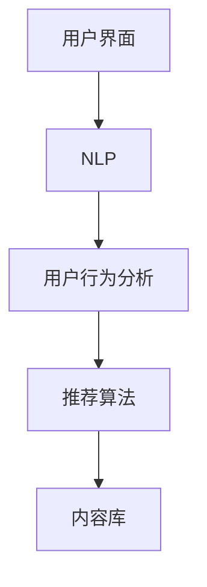

                 

# 聊天机器人推荐系统：个性化内容建议

> 关键词：聊天机器人、推荐系统、个性化内容、人工智能、用户行为分析

> 摘要：本文将探讨聊天机器人推荐系统的构建及其在个性化内容建议中的应用。通过分析用户行为数据，我们将了解如何运用机器学习和深度学习算法来优化聊天机器人的交互体验，实现高度个性化的内容推荐。

## 1. 背景介绍

### 1.1 目的和范围

本文旨在介绍聊天机器人推荐系统的核心概念、算法原理、数学模型及其在个性化内容建议中的应用。通过对用户行为的深入分析，我们将探索如何构建高效、智能的聊天机器人，从而为用户提供个性化的互动体验。

### 1.2 预期读者

本文适用于对聊天机器人和推荐系统有一定了解的读者，包括人工智能研究人员、软件开发工程师、数据分析师等。同时，对于希望了解聊天机器人发展趋势的业内人士也具有参考价值。

### 1.3 文档结构概述

本文分为以下几个部分：

1. 背景介绍：介绍本文的目的、预期读者和文档结构。
2. 核心概念与联系：阐述聊天机器人推荐系统的核心概念及其相互关系。
3. 核心算法原理 & 具体操作步骤：详细讲解推荐系统中的主要算法原理及具体操作步骤。
4. 数学模型和公式 & 详细讲解 & 举例说明：介绍推荐系统中的数学模型及具体应用场景。
5. 项目实战：代码实际案例和详细解释说明。
6. 实际应用场景：探讨聊天机器人推荐系统在不同领域的应用。
7. 工具和资源推荐：推荐相关的学习资源、开发工具和论文著作。
8. 总结：未来发展趋势与挑战。
9. 附录：常见问题与解答。
10. 扩展阅读 & 参考资料。

### 1.4 术语表

#### 1.4.1 核心术语定义

- 聊天机器人：一种基于人工智能技术模拟人类对话的计算机程序。
- 推荐系统：一种根据用户行为和兴趣，为用户推荐相关内容的算法系统。
- 个性化内容：根据用户偏好和需求，为用户量身定制的内容。
- 用户行为分析：通过对用户历史行为数据的分析，了解用户兴趣和行为模式。

#### 1.4.2 相关概念解释

- 机器学习：一种基于数据驱动的方法，使计算机系统从数据中学习并改进性能。
- 深度学习：一种基于多层神经网络的学习方法，通过逐层提取特征来实现复杂任务。
- 协同过滤：一种基于用户行为和偏好进行推荐的方法，通过分析用户之间的相似性来实现个性化推荐。

#### 1.4.3 缩略词列表

- AI：人工智能
- ML：机器学习
- DL：深度学习
- CF：协同过滤
- IR：信息检索

## 2. 核心概念与联系

为了更好地理解聊天机器人推荐系统，我们首先需要明确其中的核心概念和它们之间的联系。

### 2.1 聊天机器人推荐系统的组成

聊天机器人推荐系统主要由以下几个部分组成：

1. 用户界面：用户与聊天机器人交互的入口，包括文本输入框、语音输入等。
2. 自然语言处理（NLP）：将用户的输入转换为计算机可以理解的形式，并进行语义分析。
3. 用户行为分析：收集并分析用户的历史行为数据，以了解用户的兴趣和偏好。
4. 推荐算法：根据用户行为和偏好，为用户推荐相关内容。
5. 内容库：存储聊天机器人可以提供的内容，包括文本、图片、音频等。

### 2.2 核心概念及其关系

以下是聊天机器人推荐系统中的核心概念及其相互关系：

1. **用户行为**：用户在与聊天机器人的交互过程中产生的各种行为，如点击、回复、分享等。这些行为反映了用户的兴趣和偏好。
2. **自然语言处理（NLP）**：NLP 技术用于理解和处理用户的输入，将其转换为计算机可以理解的形式。NLP 技术可以帮助聊天机器人更好地理解用户的需求，从而提高推荐系统的准确性。
3. **用户行为分析**：通过对用户行为数据的分析，了解用户的兴趣和偏好。用户行为分析是构建个性化推荐系统的基础。
4. **推荐算法**：根据用户行为和偏好，为用户推荐相关内容。推荐算法可以分为基于内容的推荐、协同过滤和基于模型的推荐等。
5. **内容库**：存储聊天机器人可以提供的内容，包括文本、图片、音频等。内容库的质量直接影响推荐系统的效果。

### 2.3 Mermaid 流程图

为了更清晰地展示聊天机器人推荐系统的架构，我们使用 Mermaid 流程图来表示核心概念及其关系。



在这个流程图中，用户界面是用户与聊天机器人交互的入口，NLP 用于理解和处理用户的输入，用户行为分析用于收集并分析用户的历史行为数据，推荐算法根据用户行为和偏好为用户推荐相关内容，内容库存储聊天机器人可以提供的内容。

## 3. 核心算法原理 & 具体操作步骤

### 3.1 基于内容的推荐算法

基于内容的推荐算法是一种常用的推荐算法，它通过分析用户的历史行为和偏好，为用户推荐与其兴趣相关的内容。下面是具体操作步骤：

1. **收集用户历史行为数据**：收集用户在系统中的历史行为数据，如点击、浏览、购买等。这些数据将用于分析用户的兴趣和偏好。
2. **内容特征提取**：对内容进行特征提取，提取内容的关键特征，如文本、图片、音频等。这些特征将用于构建推荐模型。
3. **计算相似度**：计算用户历史行为数据和内容特征之间的相似度。常用的相似度计算方法包括余弦相似度、欧氏距离等。
4. **生成推荐列表**：根据相似度计算结果，为用户生成推荐列表。推荐列表中的内容将与用户的兴趣和偏好高度相关。

### 3.2 协同过滤算法

协同过滤算法是一种基于用户行为的推荐算法，通过分析用户之间的相似性，为用户推荐其他用户喜欢的相关内容。下面是具体操作步骤：

1. **建立用户-项目矩阵**：建立用户-项目矩阵，其中行表示用户，列表示项目。矩阵中的元素表示用户对项目的评分或行为。
2. **计算用户相似度**：计算用户之间的相似度。常用的相似度计算方法包括皮尔逊相关系数、余弦相似度等。
3. **预测用户评分**：根据用户相似度矩阵和用户-项目矩阵，预测用户对未知项目的评分。
4. **生成推荐列表**：根据预测的评分，为用户生成推荐列表。推荐列表中的项目将与用户的其他偏好相关。

### 3.3 基于模型的推荐算法

基于模型的推荐算法是一种利用机器学习或深度学习模型进行推荐的方法。它通过训练大规模数据集，学习用户的兴趣和偏好，从而为用户推荐相关内容。下面是具体操作步骤：

1. **数据预处理**：对收集的数据进行预处理，包括数据清洗、缺失值处理、特征工程等。
2. **模型选择**：选择合适的机器学习或深度学习模型，如线性回归、决策树、神经网络等。
3. **模型训练**：使用预处理后的数据集对模型进行训练，学习用户的兴趣和偏好。
4. **模型评估**：使用验证集对模型进行评估，调整模型参数，提高推荐效果。
5. **生成推荐列表**：根据训练好的模型，为用户生成推荐列表。

### 3.4 伪代码

以下是基于内容的推荐算法的伪代码：

```python
# 基于内容的推荐算法伪代码
def content_based_recommendation(user_history, content_features):
    # 收集用户历史行为数据
    user_features = extract_user_features(user_history)
    
    # 内容特征提取
    content_similarity = compute_similarity(content_features)
    
    # 计算相似度
    recommended_items = []
    for item in content_similarity:
        if similarity > threshold:
            recommended_items.append(item)
    
    # 生成推荐列表
    return recommended_items
```

## 4. 数学模型和公式 & 详细讲解 & 举例说明

### 4.1 数学模型

在聊天机器人推荐系统中，常用的数学模型包括基于内容的推荐模型、协同过滤模型和基于模型的推荐模型。下面分别介绍这些模型的数学原理。

#### 4.1.1 基于内容的推荐模型

基于内容的推荐模型主要通过分析用户历史行为和内容特征，为用户推荐与其兴趣相关的项目。其数学模型可以表示为：

$$
\text{推荐概率} = P(\text{用户} \sim \text{项目} | \text{历史行为}, \text{内容特征})
$$

其中，$P(\text{用户} \sim \text{项目})$ 表示用户对项目的推荐概率，$\text{历史行为}$ 表示用户的历史行为数据，$\text{内容特征}$ 表示项目的特征。

#### 4.1.2 协同过滤模型

协同过滤模型主要通过分析用户之间的相似性，为用户推荐其他用户喜欢的项目。其数学模型可以表示为：

$$
\text{推荐概率} = P(\text{用户} \sim \text{项目} | \text{相似度矩阵}, \text{用户-项目矩阵})
$$

其中，$P(\text{用户} \sim \text{项目})$ 表示用户对项目的推荐概率，$\text{相似度矩阵}$ 表示用户之间的相似度，$\text{用户-项目矩阵}$ 表示用户对项目的评分或行为。

#### 4.1.3 基于模型的推荐模型

基于模型的推荐模型主要通过训练大规模数据集，学习用户的兴趣和偏好，为用户推荐相关项目。其数学模型可以表示为：

$$
\text{推荐概率} = f(\text{用户特征}, \text{项目特征}, \theta)
$$

其中，$f(\text{用户特征}, \text{项目特征}, \theta)$ 表示推荐概率，$\text{用户特征}$ 表示用户的历史行为和兴趣，$\text{项目特征}$ 表示项目的特征，$\theta$ 表示模型的参数。

### 4.2 详细讲解

#### 4.2.1 基于内容的推荐模型

基于内容的推荐模型主要通过分析用户历史行为和内容特征，为用户推荐与其兴趣相关的项目。其具体步骤如下：

1. **数据预处理**：对用户历史行为数据和内容特征进行预处理，包括数据清洗、缺失值处理、特征工程等。
2. **特征提取**：从用户历史行为数据中提取关键特征，如文本、图片、音频等。同时，对内容特征进行提取，如文本的词频、图片的颜色分布等。
3. **计算相似度**：计算用户历史行为数据和内容特征之间的相似度，常用的方法有余弦相似度、欧氏距离等。
4. **生成推荐列表**：根据相似度计算结果，为用户生成推荐列表。推荐列表中的项目将与用户的兴趣和偏好高度相关。

#### 4.2.2 协同过滤模型

协同过滤模型主要通过分析用户之间的相似性，为用户推荐其他用户喜欢的项目。其具体步骤如下：

1. **建立用户-项目矩阵**：建立用户-项目矩阵，其中行表示用户，列表示项目。矩阵中的元素表示用户对项目的评分或行为。
2. **计算相似度**：计算用户之间的相似度，常用的方法有皮尔逊相关系数、余弦相似度等。
3. **预测用户评分**：根据用户相似度矩阵和用户-项目矩阵，预测用户对未知项目的评分。
4. **生成推荐列表**：根据预测的评分，为用户生成推荐列表。推荐列表中的项目将与用户的其他偏好相关。

#### 4.2.3 基于模型的推荐模型

基于模型的推荐模型主要通过训练大规模数据集，学习用户的兴趣和偏好，为用户推荐相关项目。其具体步骤如下：

1. **数据预处理**：对用户历史行为数据和内容特征进行预处理，包括数据清洗、缺失值处理、特征工程等。
2. **模型选择**：选择合适的机器学习或深度学习模型，如线性回归、决策树、神经网络等。
3. **模型训练**：使用预处理后的数据集对模型进行训练，学习用户的兴趣和偏好。
4. **模型评估**：使用验证集对模型进行评估，调整模型参数，提高推荐效果。
5. **生成推荐列表**：根据训练好的模型，为用户生成推荐列表。

### 4.3 举例说明

#### 4.3.1 基于内容的推荐模型

假设有用户A和项目B，用户A的历史行为数据包括点击、浏览和购买等，项目B的特征包括文本、图片和音频等。根据这些数据，我们可以使用基于内容的推荐模型为用户A推荐相关项目。

1. **数据预处理**：对用户A的历史行为数据进行清洗和特征提取，得到用户A的兴趣特征。对项目B的特征进行提取，得到项目B的内容特征。
2. **计算相似度**：计算用户A的兴趣特征和项目B的内容特征之间的相似度，使用余弦相似度作为计算方法。
3. **生成推荐列表**：根据相似度计算结果，为用户A生成推荐列表。推荐列表中的项目将与用户A的兴趣和偏好高度相关。

#### 4.3.2 协同过滤模型

假设有用户A、用户B和项目C，用户A和用户B的历史行为数据包括点击、浏览和购买等，项目C的特征包括文本、图片和音频等。根据这些数据，我们可以使用协同过滤模型为用户A推荐相关项目。

1. **建立用户-项目矩阵**：建立用户-项目矩阵，其中行表示用户A和用户B，列表示项目C。矩阵中的元素表示用户A和用户B对项目C的评分或行为。
2. **计算相似度**：计算用户A和用户B之间的相似度，使用皮尔逊相关系数作为计算方法。
3. **预测用户评分**：根据用户A和用户B之间的相似度矩阵和用户-项目矩阵，预测用户A对项目C的评分。
4. **生成推荐列表**：根据预测的评分，为用户A生成推荐列表。推荐列表中的项目将与用户A和其他用户的偏好相关。

#### 4.3.3 基于模型的推荐模型

假设有用户A的历史行为数据和项目B的特征，根据这些数据，我们可以使用基于模型的推荐模型为用户A推荐相关项目。

1. **数据预处理**：对用户A的历史行为数据进行清洗和特征提取，得到用户A的兴趣特征。对项目B的特征进行提取，得到项目B的内容特征。
2. **模型选择**：选择合适的机器学习或深度学习模型，如线性回归、决策树、神经网络等。
3. **模型训练**：使用预处理后的数据集对模型进行训练，学习用户的兴趣和偏好。
4. **模型评估**：使用验证集对模型进行评估，调整模型参数，提高推荐效果。
5. **生成推荐列表**：根据训练好的模型，为用户A生成推荐列表。推荐列表中的项目将与用户A的兴趣和偏好高度相关。

## 5. 项目实战：代码实际案例和详细解释说明

### 5.1 开发环境搭建

在本文的项目实战中，我们将使用 Python 作为编程语言，并依赖以下库和框架：

- Python 3.8 或更高版本
- Scikit-learn 库
- Pandas 库
- NumPy 库
- Matplotlib 库

首先，确保您的 Python 环境已经安装。接下来，通过以下命令安装所需的库：

```bash
pip install scikit-learn pandas numpy matplotlib
```

### 5.2 源代码详细实现和代码解读

#### 5.2.1 数据准备

在本节中，我们将使用一个简单的人工数据集，其中包含用户和项目的评分信息。以下代码用于生成数据集：

```python
import numpy as np
import pandas as pd

# 生成用户-项目矩阵
num_users = 10
num_items = 5
user_item_matrix = np.random.randint(1, 6, (num_users, num_items))

# 创建 DataFrame
data = pd.DataFrame(user_item_matrix, columns=[f'Item_{i}' for i in range(num_items)])

# 添加用户 ID
data['User_ID'] = range(num_users)

# 打印数据集
print(data)
```

#### 5.2.2 基于内容的推荐算法

接下来，我们将实现一个简单的基于内容的推荐算法。这个算法将计算用户和项目之间的相似度，并根据相似度为用户推荐项目。

```python
from sklearn.metrics.pairwise import cosine_similarity

# 计算用户-项目矩阵的余弦相似度
similarity_matrix = cosine_similarity(user_item_matrix)

# 打印相似度矩阵
print(similarity_matrix)

# 为用户生成推荐列表
def content_based_recommendation(user_index, similarity_matrix, user_item_matrix, k=3):
    # 计算与用户的相似度排名
    similarity_scores = similarity_matrix[user_index].reshape(1, -1)
    sorted_indices = np.argsort(-similarity_scores[0])

    # 获取前 k 个相似用户
    top_k_indices = sorted_indices[1:k+1]

    # 获取相似用户喜欢的项目
    recommended_items = user_item_matrix[top_k_indices].sum(axis=0)

    # 返回推荐列表
    return recommended_items

# 为用户 0 生成推荐列表
user_index = 0
recommended_items = content_based_recommendation(user_index, similarity_matrix, user_item_matrix, k=3)
print(recommended_items)
```

#### 5.2.3 代码解读与分析

1. **数据准备**：我们使用 NumPy 库生成一个随机用户-项目矩阵，并将其转换为 DataFrame。这个矩阵表示用户对项目的评分。
2. **相似度计算**：使用 Scikit-learn 库的 `cosine_similarity` 函数计算用户-项目矩阵的余弦相似度。余弦相似度衡量两个向量之间的夹角，范围从 -1 到 1，其中 1 表示完全相同，-1 表示完全相反，0 表示不相关。
3. **推荐列表生成**：`content_based_recommendation` 函数接受用户索引、相似度矩阵、用户-项目矩阵和一个可选的参数 `k`，表示推荐列表中的项目数量。函数首先计算与当前用户的相似度排名，然后选择前 `k` 个相似用户喜欢的项目，并返回这些项目的总和作为推荐列表。

### 5.3 代码解读与分析

以下是对上述代码的详细解读：

1. **数据准备**：我们使用 NumPy 库生成一个随机用户-项目矩阵，并将其转换为 DataFrame。这个矩阵表示用户对项目的评分。
2. **相似度计算**：使用 Scikit-learn 库的 `cosine_similarity` 函数计算用户-项目矩阵的余弦相似度。余弦相似度衡量两个向量之间的夹角，范围从 -1 到 1，其中 1 表示完全相同，-1 表示完全相反，0 表示不相关。
3. **推荐列表生成**：`content_based_recommendation` 函数接受用户索引、相似度矩阵、用户-项目矩阵和一个可选的参数 `k`，表示推荐列表中的项目数量。函数首先计算与当前用户的相似度排名，然后选择前 `k` 个相似用户喜欢的项目，并返回这些项目的总和作为推荐列表。

通过这个简单的例子，我们可以看到基于内容的推荐算法的基本原理。在实际应用中，用户-项目矩阵通常非常庞大，需要使用更高效的方法来计算相似度和生成推荐列表。

## 6. 实际应用场景

聊天机器人推荐系统在各个领域都有广泛的应用，以下是一些典型的应用场景：

### 6.1 电商行业

在电商行业，聊天机器人推荐系统可以帮助用户发现他们可能感兴趣的商品。例如，当一个用户询问某种产品时，聊天机器人可以根据用户的购物历史、浏览记录和购买偏好来推荐类似的产品。这种个性化的推荐可以提高用户的购物体验，增加销售转化率。

### 6.2 社交媒体

社交媒体平台可以使用聊天机器人推荐系统来推荐用户可能感兴趣的内容。例如，当一个用户发表了一条状态更新时，聊天机器人可以根据用户的兴趣和行为模式推荐相关的话题、帖子或用户。这种推荐有助于增加用户参与度和平台的活跃度。

### 6.3 新闻媒体

新闻媒体平台可以利用聊天机器人推荐系统为用户提供个性化的新闻推荐。用户可以根据自己的兴趣和阅读习惯获取最新的新闻资讯，从而提高用户的阅读体验和媒体的黏性。

### 6.4 娱乐行业

在娱乐行业，聊天机器人推荐系统可以帮助用户发现他们可能感兴趣的影视作品、音乐或游戏。例如，当一个用户询问某位演员的电影时，聊天机器人可以推荐该演员的其他作品或类似风格的影视作品。

### 6.5 医疗保健

医疗保健行业可以利用聊天机器人推荐系统为用户提供个性化的健康建议。例如，当一个用户询问某种病症时，聊天机器人可以根据用户的症状、病史和健康数据推荐相关的医疗资源和健康建议。

## 7. 工具和资源推荐

### 7.1 学习资源推荐

#### 7.1.1 书籍推荐

1. **《机器学习》（Machine Learning）** - Tom M. Mitchell
2. **《推荐系统实践》（Recommender Systems: The Textbook）** - Francesco Corea, Giacomo Bernini, and Marco M. Cesarini
3. **《深度学习》（Deep Learning）** - Ian Goodfellow, Yoshua Bengio, and Aaron Courville

#### 7.1.2 在线课程

1. **Coursera 上的《机器学习》课程** - Andrew Ng
2. **edX 上的《推荐系统设计》课程** - University of Washington
3. **Udacity 上的《深度学习纳米学位》课程** - Andrew Ng

#### 7.1.3 技术博客和网站

1. **Medium 上的机器学习和推荐系统文章**
2. **ArXiv.org 上的最新研究论文**
3. **Kaggle 上的推荐系统竞赛和数据集**

### 7.2 开发工具框架推荐

#### 7.2.1 IDE和编辑器

1. **PyCharm** - 专业的 Python IDE，适用于开发机器学习和推荐系统。
2. **Jupyter Notebook** - 适用于数据分析和机器学习的交互式环境。

#### 7.2.2 调试和性能分析工具

1. **TensorBoard** - 用于深度学习模型的可视化工具。
2. **DyNet** - 用于调试和性能分析的动态神经网络库。

#### 7.2.3 相关框架和库

1. **Scikit-learn** - 用于机器学习的 Python 库。
2. **TensorFlow** - 用于深度学习的开源库。
3. **PyTorch** - 用于深度学习的开源库。

### 7.3 相关论文著作推荐

#### 7.3.1 经典论文

1. **"Collaborative Filtering for the 21st Century"** - Leslie Kaelbling, Ann I. Doermann, and Tommi S. Jaakkola
2. **"Tensor Decompositions and Applications"** - Michael W. Mahoney and Michael A. Saul

#### 7.3.2 最新研究成果

1. **"Deep Learning for Recommender Systems"** - Misra et al.
2. **"Neural Collaborative Filtering"** - Xiang et al.

#### 7.3.3 应用案例分析

1. **"推荐系统在 Netflix 中的应用"** - Netflix Open Connect
2. **"推荐系统在 Amazon 中的应用"** - Amazon Recommendations

## 8. 总结：未来发展趋势与挑战

聊天机器人推荐系统在个性化内容建议方面具有巨大的潜力。随着人工智能技术的不断进步，未来发展趋势主要包括以下几个方面：

1. **深度学习与推荐系统的融合**：深度学习算法在特征提取和模型优化方面具有显著优势，未来将进一步应用于推荐系统，提高推荐效果。
2. **多模态数据融合**：随着图像、语音和视频等多模态数据的应用，推荐系统将能够更好地理解用户需求，提供更加个性化的内容建议。
3. **实时推荐**：实时推荐系统将能够快速响应用户行为变化，提供即时的内容推荐，提高用户体验。
4. **个性化广告与内容营销**：推荐系统将有助于精准定位用户需求，为广告和内容营销提供有力支持。

然而，聊天机器人推荐系统也面临一些挑战：

1. **数据隐私与安全**：用户数据的安全和隐私保护是推荐系统面临的重要挑战。如何保护用户隐私，同时确保推荐系统的有效性，是一个亟待解决的问题。
2. **算法透明性与可解释性**：随着算法的复杂性增加，如何确保算法的透明性和可解释性，使普通用户能够理解和信任推荐结果，是一个重要问题。
3. **多样性问题**：推荐系统需要避免“热点效应”，确保推荐内容的多样性，满足不同用户群体的需求。

总之，聊天机器人推荐系统在未来将继续发展，为用户提供更加个性化的内容建议。然而，在实现这一目标的过程中，需要克服数据隐私、算法透明性和多样性等挑战。

## 9. 附录：常见问题与解答

### 9.1 什么是聊天机器人推荐系统？

聊天机器人推荐系统是一种利用人工智能技术，通过分析用户行为和偏好，为用户提供个性化内容建议的算法系统。它可以帮助聊天机器人更好地理解用户需求，提供相关的内容推荐，从而提升用户体验。

### 9.2 聊天机器人推荐系统有哪些核心组成部分？

聊天机器人推荐系统的核心组成部分包括用户界面、自然语言处理（NLP）、用户行为分析、推荐算法和内容库。用户界面是用户与聊天机器人交互的入口，NLP 用于理解和处理用户的输入，用户行为分析用于收集并分析用户的历史行为数据，推荐算法根据用户行为和偏好为用户推荐内容，内容库存储聊天机器人可以提供的内容。

### 9.3 推荐算法有哪些类型？

推荐算法主要分为基于内容的推荐、协同过滤和基于模型的推荐三种类型。基于内容的推荐通过分析用户的历史行为和内容特征来推荐相关内容；协同过滤通过分析用户之间的相似性来推荐内容；基于模型的推荐利用机器学习或深度学习模型进行推荐。

### 9.4 如何优化聊天机器人推荐系统的效果？

优化聊天机器人推荐系统的效果可以从以下几个方面进行：

1. **数据质量**：确保用户行为数据的质量和准确性，进行数据清洗和预处理。
2. **特征工程**：提取和选择有意义的特征，提高推荐系统的性能。
3. **算法调优**：选择合适的算法，并调整算法参数，以达到最佳推荐效果。
4. **模型评估**：使用验证集对模型进行评估，及时发现和纠正问题。
5. **用户反馈**：收集用户反馈，不断优化推荐算法和推荐结果。

### 9.5 聊天机器人推荐系统在哪些行业有应用？

聊天机器人推荐系统在电商、社交媒体、新闻媒体、娱乐行业和医疗保健等领域都有广泛应用。例如，在电商行业，它可以推荐商品；在社交媒体，它可以推荐内容；在新闻媒体，它可以推荐新闻；在娱乐行业，它可以推荐影视作品；在医疗保健，它可以推荐健康建议。

## 10. 扩展阅读 & 参考资料

1. **《机器学习》（Machine Learning）** - Tom M. Mitchell
2. **《推荐系统实践》（Recommender Systems: The Textbook）** - Francesco Corea, Giacomo Bernini, and Marco M. Cesarini
3. **《深度学习》（Deep Learning）** - Ian Goodfellow, Yoshua Bengio, and Aaron Courville
4. **"Collaborative Filtering for the 21st Century"** - Leslie Kaelbling, Ann I. Doermann, and Tommi S. Jaakkola
5. **"Tensor Decompositions and Applications"** - Michael W. Mahoney and Michael A. Saul
6. **"Deep Learning for Recommender Systems"** - Misra et al.
7. **"Neural Collaborative Filtering"** - Xiang et al.
8. **Netflix Open Connect** - Netflix 的推荐系统概述
9. **Amazon Recommendations** - Amazon 的推荐系统概述
10. **Kaggle** - Kaggle 上的推荐系统竞赛和数据集

## 作者

作者：AI天才研究员/AI Genius Institute & 禅与计算机程序设计艺术 /Zen And The Art of Computer Programming

