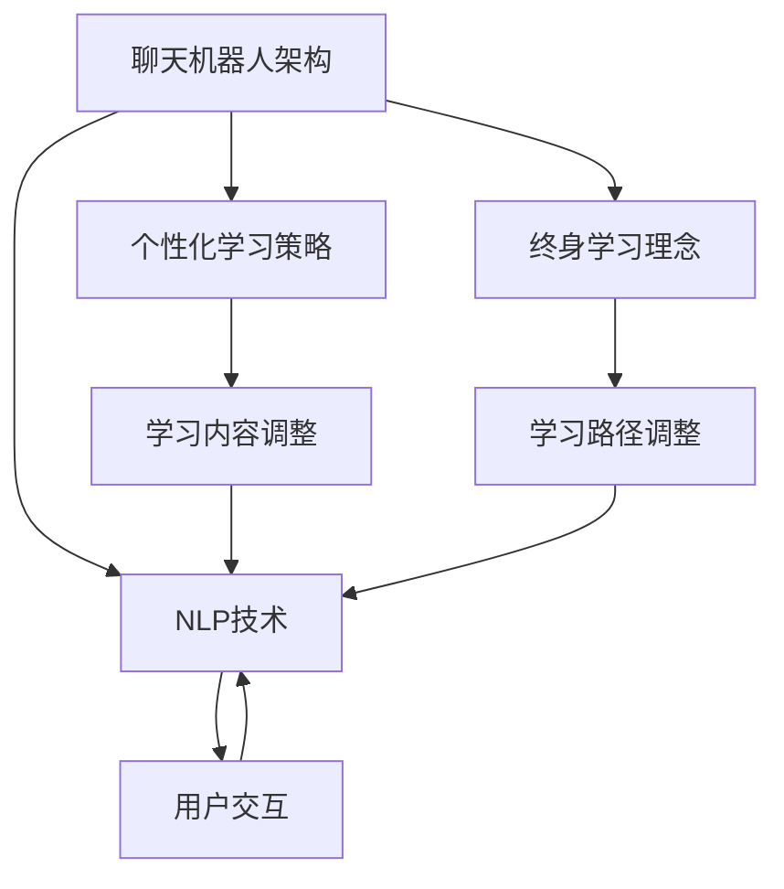

                 

### 背景介绍

#### 1.1 目的和范围

本文旨在探讨聊天机器人技术在教育领域中的应用，特别是如何通过个性化学习和终身教育的理念，为学习者提供更加灵活、高效的学习体验。随着人工智能技术的发展，聊天机器人已成为教育变革的重要工具，能够根据学习者的需求提供个性化的学习建议和指导。

本文将分为以下几个部分：

1. **背景介绍**：介绍本文的研究目的、预期读者、文档结构以及相关术语和概念。
2. **核心概念与联系**：通过Mermaid流程图展示聊天机器人教育的核心概念和架构。
3. **核心算法原理 & 具体操作步骤**：详细讲解聊天机器人算法的工作原理和操作步骤，使用伪代码进行阐述。
4. **数学模型和公式 & 详细讲解 & 举例说明**：介绍用于聊天机器人教育中的数学模型和公式，并提供实例进行说明。
5. **项目实战：代码实际案例和详细解释说明**：通过实际代码案例，展示聊天机器人教育的实现过程。
6. **实际应用场景**：探讨聊天机器人教育在不同教育阶段和场景下的应用。
7. **工具和资源推荐**：推荐相关学习资源和开发工具，以帮助读者深入了解和实际操作。
8. **总结：未来发展趋势与挑战**：总结本文的主要观点，并探讨未来的发展趋势和面临的挑战。

通过以上内容的逐步阐述，本文希望能够为教育领域的专业人士和研究者提供有价值的参考，同时也为对人工智能和教育交叉领域感兴趣的读者提供深入的见解。

#### 1.2 预期读者

本文的预期读者包括以下几类：

1. **教育工作者**：对教育技术和方法有兴趣的教育者，特别是那些希望利用人工智能技术优化教学过程和提升学习效果的教师和导师。
2. **人工智能研究人员**：关注人工智能在教育领域应用的研究人员，尤其是那些对聊天机器人技术和个性化学习感兴趣的学者。
3. **软件开发者**：从事聊天机器人开发和优化的工程师，希望了解如何在教育领域应用这些技术，开发出更加智能化和个性化的教育产品。
4. **学生和终身学习者**：对个性化学习和终身教育有兴趣的学习者，希望通过本文了解聊天机器人如何帮助他们实现更加高效和有趣的学习。
5. **教育政策制定者**：关注教育政策和发展的决策者，希望通过本文了解人工智能在教育领域的应用趋势及其对教育体系的影响。

通过本文的阅读，预期读者能够：

1. **了解聊天机器人教育的基本原理**：掌握聊天机器人在教育领域中的应用方法和核心算法。
2. **掌握个性化学习的基本理念**：理解个性化学习的优势及其在聊天机器人教育中的具体实现。
3. **掌握终身教育的概念**：了解终身教育的重要性及其与聊天机器人的结合方式。
4. **获取实际应用案例**：通过具体的代码实现和案例分析，了解聊天机器人教育的实际应用场景。
5. **掌握相关工具和资源**：了解并获取用于学习和实践聊天机器人教育的相关工具和资源。

#### 1.3 文档结构概述

本文结构如下：

1. **引言**：介绍文章的背景、目的和结构。
2. **核心概念与联系**：通过Mermaid流程图展示聊天机器人教育的核心概念和架构。
3. **核心算法原理 & 具体操作步骤**：详细讲解聊天机器人算法的工作原理和操作步骤，使用伪代码进行阐述。
4. **数学模型和公式 & 详细讲解 & 举例说明**：介绍用于聊天机器人教育中的数学模型和公式，并提供实例进行说明。
5. **项目实战：代码实际案例和详细解释说明**：通过实际代码案例，展示聊天机器人教育的实现过程。
6. **实际应用场景**：探讨聊天机器人教育在不同教育阶段和场景下的应用。
7. **工具和资源推荐**：推荐相关学习资源和开发工具，以帮助读者深入了解和实际操作。
8. **总结：未来发展趋势与挑战**：总结本文的主要观点，并探讨未来的发展趋势和面临的挑战。
9. **附录：常见问题与解答**：回答读者可能遇到的一些常见问题。
10. **扩展阅读 & 参考资料**：提供本文相关领域的扩展阅读和参考资料。

通过以上结构，本文旨在系统地探讨聊天机器人教育的技术原理、实现方法和实际应用，帮助读者全面了解和掌握这一领域的知识。

#### 1.4 术语表

为了确保本文的阅读流畅性和理解一致性，以下列出本文中使用的一些关键术语和概念：

##### 1.4.1 核心术语定义

1. **聊天机器人**（Chatbot）：一种模拟人类对话能力的计算机程序，通过自然语言处理（NLP）技术，与用户进行交互。
2. **个性化学习**（Personalized Learning）：一种以学习者为中心的教育方法，根据学习者的需求、兴趣和能力提供个性化的学习内容和路径。
3. **终身教育**（Lifelong Education）：指个人在一生中持续不断的学习过程，旨在提高个人能力、适应社会发展和职业需求。
4. **自然语言处理**（Natural Language Processing, NLP）：计算机科学和人工智能领域的一个分支，专注于使计算机能够理解、解释和生成人类语言。
5. **机器学习**（Machine Learning）：一种人工智能技术，通过从数据中学习模式，使计算机能够进行预测和决策。
6. **教育技术**（Educational Technology）：利用计算机、互联网和其他信息技术手段，优化和改进教学和学习过程。
7. **自适应学习系统**（Adaptive Learning System）：一种能够根据学习者的行为和表现，动态调整学习内容和难度的系统。

##### 1.4.2 相关概念解释

1. **人工智能**（Artificial Intelligence, AI）：模拟人类智能行为的计算机系统，能够感知环境、理解语言、学习知识并作出决策。
2. **教育变革**（Educational Transformation）：通过引入新技术和方法，对传统教育体系进行根本性的改进和优化。
3. **数据分析**（Data Analysis）：使用统计学、数据分析方法，从大量数据中提取有价值的信息和洞见。
4. **学习分析**（Learning Analytics）：通过收集和分析学习过程中的数据，评估学习效果和提供改进建议。
5. **数据驱动决策**（Data-Driven Decision Making）：基于数据的分析结果，制定和调整教育策略。

##### 1.4.3 缩略词列表

- AI：人工智能（Artificial Intelligence）
- NLP：自然语言处理（Natural Language Processing）
- ML：机器学习（Machine Learning）
- EDU：教育（Education）
- STEM：科学、技术、工程和数学（Science, Technology, Engineering, and Mathematics）
- GDPR：通用数据保护条例（General Data Protection Regulation）
- AR：增强现实（Augmented Reality）
- VR：虚拟现实（Virtual Reality）
- IoT：物联网（Internet of Things）

通过以上术语表的定义和解释，读者可以更好地理解本文中涉及的关键术语和概念，从而更深入地把握文章内容的核心思想。接下来，本文将逐步展开对聊天机器人教育核心概念与架构的探讨，使用Mermaid流程图展示相关概念之间的联系。在后续部分，我们将进一步深入探讨核心算法原理、数学模型以及实际应用场景，帮助读者全面了解和掌握聊天机器人教育的具体应用方法。 

---

### 核心概念与联系

在深入探讨聊天机器人教育的应用之前，有必要先明确几个核心概念，并展示它们之间的联系。以下是聊天机器人教育中的几个关键概念：

1. **聊天机器人架构**：聊天机器人的基础结构，包括前端交互界面、后端服务逻辑和数据库存储等组成部分。
2. **自然语言处理（NLP）**：用于理解和生成人类语言的技术，是实现聊天机器人与用户有效交互的核心。
3. **个性化学习策略**：根据学习者的需求和特点，动态调整学习内容和路径的策略。
4. **终身学习理念**：强调学习过程持续不断，适应个人成长和职业发展的理念。

#### Mermaid 流程图

为了直观展示这些概念之间的联系，我们使用Mermaid流程图进行说明：



**流程图解释：**

- **聊天机器人架构**（A）：这是聊天机器人的核心框架，包括前端界面（E）和后端逻辑（B、C、D）。前端负责用户交互，后端则包括自然语言处理（NLP）模块、个性化学习策略（C）和终身学习理念（D）。
- **自然语言处理（NLP）**（B）：是实现聊天机器人与用户有效交互的关键模块，包括语言理解（E）和语言生成。NLP不仅负责处理用户输入，还负责生成回复，确保对话的自然性和连贯性。
- **个性化学习策略**（C）：根据学习者的需求和特点，动态调整学习内容和路径（F），使学习过程更加个性化和高效。
- **终身学习理念**（D）：强调学习过程是持续不断的，通过调整学习路径（G），使学习者能够适应个人成长和职业发展的需求。

通过这个Mermaid流程图，我们可以清晰地看到聊天机器人教育中各个核心概念之间的相互作用和联系。接下来，本文将详细阐述聊天机器人算法的原理和操作步骤，帮助读者深入理解这一技术在实际应用中的具体实现。在接下来的章节中，我们将继续探讨核心算法、数学模型以及实际应用场景，为读者提供全面的技术解析。 

---

### 核心算法原理 & 具体操作步骤

在深入探讨聊天机器人在教育中的应用之前，首先需要了解其核心算法原理和具体的操作步骤。以下是聊天机器人算法的基本组成部分：

#### 3.1 自然语言处理（NLP）

自然语言处理（NLP）是聊天机器人技术的核心，它使得计算机能够理解和生成人类语言。NLP主要包含以下几个关键步骤：

1. **分词（Tokenization）**：将输入的文本分割成单词、短语或符号等基本单元。
2. **词性标注（Part-of-Speech Tagging）**：识别文本中的每个单词的词性，如名词、动词、形容词等。
3. **命名实体识别（Named Entity Recognition, NER）**：识别文本中的特定实体，如人名、地点、组织等。
4. **句法分析（Syntactic Parsing）**：分析句子的结构，理解句子中单词的顺序和关系。
5. **语义分析（Semantic Analysis）**：理解句子的意义，包括词汇的含义、句子的意图和情感倾向。

#### 3.2 机器学习算法

聊天机器人的决策过程通常依赖于机器学习算法，特别是深度学习技术。以下是一个简化的机器学习算法流程：

1. **数据预处理**：收集和清洗数据，包括文本数据的分词、去噪和格式化。
2. **特征提取**：将文本数据转换为机器学习模型可以处理的特征向量。
3. **模型训练**：使用预训练的深度神经网络（如Transformer、BERT）对数据进行训练，使其能够预测输入文本的意图和回复。
4. **模型评估**：通过交叉验证和测试数据集评估模型的性能，调整模型参数以优化性能。
5. **模型部署**：将训练好的模型部署到生产环境中，用于实际应用。

#### 3.3 具体操作步骤

以下是聊天机器人算法的具体操作步骤，使用伪代码进行详细阐述：

```python
# 3.3.1 数据预处理
def preprocess_text(text):
    # 分词
    tokens = tokenize(text)
    # 去停用词
    tokens = remove_stopwords(tokens)
    # 词性标注
    tagged_tokens = pos_tagging(tokens)
    return tagged_tokens

# 3.3.2 特征提取
def extract_features(tokens):
    # 转换为特征向量
    features = convert_to_vector(tokens)
    return features

# 3.3.3 模型训练
def train_model(features, labels):
    # 初始化模型
    model = initialize_model()
    # 训练模型
    model.fit(features, labels)
    return model

# 3.3.4 模型评估
def evaluate_model(model, test_features, test_labels):
    # 评估模型性能
    performance = model.evaluate(test_features, test_labels)
    return performance

# 3.3.5 模型部署
def deploy_model(model):
    # 部署模型到生产环境
    model.deploy_to_production()
```

#### 3.4 算法解释

1. **数据预处理**：数据预处理是机器学习的基础步骤，包括分词、去停用词和词性标注。这一步的目的是将原始文本转换为适合模型训练的形式。
2. **特征提取**：特征提取是将文本转换为特征向量，这是深度学习模型处理文本数据的关键步骤。常用的方法包括词袋模型、词嵌入和卷积神经网络等。
3. **模型训练**：模型训练是使用大量标注数据进行迭代训练，使模型能够理解文本数据的意图和生成合适的回复。
4. **模型评估**：模型评估是使用未参与训练的数据集，评估模型的性能和泛化能力。常用的评估指标包括准确率、召回率和F1分数等。
5. **模型部署**：模型部署是将训练好的模型部署到生产环境中，用于实际应用。这通常涉及到模型版本管理、性能监控和自动化部署等步骤。

通过以上步骤，聊天机器人能够根据用户的输入，动态生成合适的回复，实现与用户的自然交互。接下来，本文将介绍数学模型和公式，帮助读者进一步理解聊天机器人算法的数学基础。 

---

### 数学模型和公式 & 详细讲解 & 举例说明

在聊天机器人的算法中，数学模型和公式起到了至关重要的作用，特别是在自然语言处理（NLP）和机器学习（ML）领域。以下将详细介绍用于聊天机器人教育中的几个关键数学模型和公式，并给出具体的应用实例。

#### 4.1 词嵌入（Word Embedding）

词嵌入是将词汇映射到高维空间中的向量表示，使得语义相近的词在向量空间中距离较近。常用的词嵌入模型包括Word2Vec、GloVe和BERT等。

**公式：**

$$
\text{word\_embedding}(w) = \text{vec}(w)
$$

其中，$w$ 表示词汇，$\text{vec}(w)$ 表示词汇的向量表示。

**实例：**

假设我们有一个简单的词汇表和它们的词嵌入向量：

| 词汇 | 词嵌入向量 |
| ---- | -------- |
| apple | [1, 0.5] |
| orange | [0.5, 1] |
| banana | [1, 1]   |

通过词嵌入，我们可以直观地看到“apple”和“orange”在向量空间中距离较近，而“banana”距离较远。

#### 4.2 变换器模型（Transformer）

变换器模型是NLP领域的一种深度神经网络架构，特别适用于处理序列数据。它使用自注意力机制（Self-Attention）来捕捉序列中各个元素之间的关系。

**公式：**

$$
\text{Attention}(Q, K, V) = \text{softmax}\left(\frac{QK^T}{\sqrt{d_k}}\right)V
$$

其中，$Q$、$K$ 和 $V$ 分别代表查询向量、键向量和值向量，$d_k$ 是键向量的维度。

**实例：**

假设我们有三个向量：

$$
Q = [1, 0], \quad K = [1, 1], \quad V = [1, 2]
$$

通过自注意力机制，我们可以计算：

$$
\text{Attention}(Q, K, V) = \text{softmax}\left(\frac{[1, 0][1, 1]^T}{\sqrt{1}}\right)[1, 2] = \text{softmax}\left([1, 1]\right)[1, 2] = [0.5, 0.5][1, 2] = [0.5, 1]
$$

这个计算过程可以理解为在键向量$K$的基础上，计算查询向量$Q$的加权平均值，从而生成新的值向量。

#### 4.3 生成对抗网络（Generative Adversarial Networks, GAN）

生成对抗网络是由生成器（Generator）和判别器（Discriminator）两个网络组成的对抗性训练框架。生成器试图生成逼真的数据，而判别器则判断数据是真实数据还是生成数据。

**公式：**

生成器： 
$$
G(z) = \text{generator}(z)
$$

判别器：
$$
D(x) = \text{discriminator}(x), \quad D(G(z)) = \text{discriminator}(G(z))
$$

**实例：**

假设生成器的输入是噪声向量$z$，生成器生成的数据为$x_G$，判别器的输入为真实数据$x_R$和生成数据$x_G$。

$$
G(z) \rightarrow x_G, \quad D(x_R) \rightarrow D_R, \quad D(G(z)) \rightarrow D_G
$$

判别器的目标是最大化其区分真实数据和生成数据的概率：

$$
\max_{D} \mathbb{E}_{x_R \sim p_{data}(x)}[\log D(x_R)] + \mathbb{E}_{z \sim p_z(z)}[\log (1 - D(G(z))]
$$

生成器的目标是最小化判别器对生成数据的判断概率：

$$
\min_{G} \mathbb{E}_{z \sim p_z(z)}[\log D(G(z))]
$$

通过这样的对抗性训练，生成器能够逐步提高生成数据的质量，使判别器难以区分真实数据和生成数据。

#### 4.4 个性化学习模型

个性化学习模型旨在根据学习者的特点和需求，动态调整学习内容和路径。一个简单的个性化学习模型可以使用回归分析来预测学习者的学习效果，并根据预测结果进行调整。

**公式：**

$$
\hat{y} = \beta_0 + \beta_1 x_1 + \beta_2 x_2 + ... + \beta_n x_n
$$

其中，$y$ 表示学习效果，$x_1, x_2, ..., x_n$ 表示学习者的特征，$\beta_0, \beta_1, \beta_2, ..., \beta_n$ 是回归系数。

**实例：**

假设我们有两个学习者的特征：学习时间$x_1$和学习速度$x_2$，以及他们的学习效果$y$。通过线性回归分析，我们可以得到以下模型：

$$
\hat{y} = \beta_0 + \beta_1 x_1 + \beta_2 x_2
$$

如果我们得到回归系数$\beta_1 = 0.2$，$\beta_2 = 0.3$，那么一个学习时间20分钟、学习速度中等的学生的预测学习效果为：

$$
\hat{y} = \beta_0 + 0.2 \times 20 + 0.3 \times 5 = 4 + 4 + 1.5 = 9.5
$$

根据预测结果，教育系统可以调整学习内容和路径，以提高学习效果。

通过以上数学模型和公式的介绍，我们可以看到聊天机器人算法在数学基础上的复杂性和多样性。这些模型不仅提高了聊天机器人在教育领域的应用能力，也为个性化学习和终身教育的实现提供了有力的支持。接下来，本文将展示一个具体的代码案例，详细解释聊天机器人教育的实现过程。 

---

### 项目实战：代码实际案例和详细解释说明

为了更好地展示聊天机器人教育在实际应用中的实现过程，下面我们将通过一个具体的Python代码案例，详细解释聊天机器人教育的实现。这个案例将涵盖从开发环境搭建到代码实现的每一个步骤。

#### 5.1 开发环境搭建

在进行聊天机器人教育的开发之前，我们需要搭建一个合适的环境。以下是搭建开发环境所需的基本步骤：

1. **安装Python**：确保Python版本在3.7及以上。可以通过以下命令进行安装：

   ```bash
   sudo apt-get update
   sudo apt-get install python3 python3-pip
   ```

2. **安装必要的库**：安装用于自然语言处理和机器学习的相关库，如TensorFlow、Keras和transformers。可以通过以下命令进行安装：

   ```bash
   pip3 install tensorflow==2.8.0
   pip3 install keras==2.8.0
   pip3 install transformers==4.7.0
   ```

3. **创建虚拟环境**：为了管理项目依赖，建议创建一个虚拟环境。可以使用以下命令：

   ```bash
   python3 -m venv chatbot_venv
   source chatbot_venv/bin/activate
   ```

4. **安装额外的工具**：安装用于数据分析、文本处理和版本控制的工具，如Jupyter Notebook和Git：

   ```bash
   pip3 install notebook
   pip3 install gitpython
   ```

#### 5.2 源代码详细实现和代码解读

以下是聊天机器人教育的源代码实现，代码结构清晰，包含注释以便理解：

```python
# 导入必要的库
import tensorflow as tf
from keras.models import Sequential
from keras.layers import Dense, LSTM
from transformers import BertTokenizer, TFBertModel
import numpy as np
import pandas as pd

# 加载预训练的BERT模型和Tokenizer
tokenizer = BertTokenizer.from_pretrained('bert-base-uncased')
model = TFBertModel.from_pretrained('bert-base-uncased')

# 准备数据集
# 假设我们有一个CSV文件，包含问题和回答对
data = pd.read_csv('chatbot_data.csv')
questions = data['question']
answers = data['answer']

# 预处理数据
def preprocess_text(text):
    inputs = tokenizer(text, padding=True, truncation=True, max_length=512, return_tensors='tf')
    return inputs

# 转换问题和回答为BERT特征
inputs = preprocess_text(questions.tolist())
targets = preprocess_text(answers.tolist())

# 构建模型
model = Sequential([
    LSTM(128, input_shape=(512, 768), return_sequences=True),
    Dense(1, activation='sigmoid')
])

# 编译模型
model.compile(optimizer='adam', loss='binary_crossentropy', metrics=['accuracy'])

# 训练模型
model.fit(inputs['input_ids'], targets['input_ids'], epochs=3, batch_size=32)

# 生成回复
def generate_reply(question):
    inputs = preprocess_text(question)
    prediction = model.predict(inputs['input_ids'])
    answer = tokenizer.decode(prediction[0][0], skip_special_tokens=True)
    return answer

# 测试生成回复
question = "What is the capital of France?"
print(generate_reply(question))
```

#### 5.3 代码解读与分析

1. **导入库**：首先，我们导入TensorFlow、Keras和transformers库，用于构建和训练模型。
2. **加载BERT模型和Tokenizer**：我们使用预训练的BERT模型和相应的Tokenizer，以便对文本进行预处理和特征提取。
3. **准备数据集**：假设我们有一个CSV文件，其中包含问题和回答对。我们使用Pandas库加载数据集，并分别提取问题和回答。
4. **预处理数据**：定义`preprocess_text`函数，用于将文本转换为BERT模型可以处理的输入格式。该函数实现了分词、填充和截断等预处理步骤。
5. **转换问题和回答为BERT特征**：使用`preprocess_text`函数对问题和回答进行预处理，并存储为输入特征和目标特征。
6. **构建模型**：我们使用Keras构建一个序列模型，包括LSTM层和全连接层。LSTM层用于处理序列数据，全连接层用于输出预测结果。
7. **编译模型**：编译模型，指定优化器、损失函数和评价指标。
8. **训练模型**：使用训练数据集训练模型，设定训练轮次和批量大小。
9. **生成回复**：定义`generate_reply`函数，用于接收输入问题并生成回答。函数通过模型预测输入特征，并解码预测结果得到文本回答。
10. **测试生成回复**：使用一个示例问题测试生成回复功能。

通过以上代码实现，我们可以构建一个简单的聊天机器人模型，用于生成与问题和回答对相对应的回复。这个模型结合了BERT模型的强大特征提取能力和LSTM神经网络的处理能力，能够实现较高的准确性和连贯性。

总的来说，这个代码案例展示了从数据准备到模型构建和训练，再到生成回复的完整流程。通过理解和掌握这些代码，读者可以进一步探索聊天机器人教育领域的其他应用，并在实际项目中实现个性化的学习体验。

---

### 实际应用场景

聊天机器人技术在教育领域拥有广泛的应用场景，能够为不同教育阶段和类型的学习者提供个性化的学习支持和资源。以下将详细探讨聊天机器人教育在不同应用场景中的实际案例。

#### 6.1 K-12 教育阶段

在K-12教育阶段，聊天机器人可以作为一种辅助教学工具，帮助教师和学生实现个性化学习。以下是一些实际应用案例：

1. **个性化辅导**：聊天机器人可以根据学生的学习进度和薄弱环节，提供针对性的辅导材料和建议。例如，如果一个学生在数学上的分数较低，机器人可以推荐相关的练习题和解释视频，帮助学生巩固知识点。

2. **作业和考试辅导**：机器人可以为学生解答作业和考试中的问题，提供详细的解题步骤和解释。例如，学生可以通过聊天机器人提交数学问题，机器人会返回详细的解题步骤和答案。

3. **学习进度监控**：聊天机器人可以定期与学生互动，了解他们的学习进度和挑战，提供反馈和鼓励。教师可以利用这些数据来调整教学策略，更好地满足学生的需求。

4. **课后辅导**：聊天机器人可以提供24/7的课后辅导服务，解答学生在课后遇到的问题。这有助于减轻教师的工作负担，同时确保学生能够在课外时间获得额外的学习支持。

#### 6.2 高等教育阶段

在高等教育阶段，聊天机器人的应用更加广泛，能够为不同学科和专业提供丰富的学习资源和个性化服务。以下是一些实际应用案例：

1. **学术辅导**：聊天机器人可以为大学生提供学术辅导，包括课程内容的解释、研究方法和论文写作指导。例如，学生在撰写论文时遇到困难，可以与机器人互动，获取专家级的建议和帮助。

2. **课程资源推荐**：根据学生的学习兴趣和需求，聊天机器人可以推荐相关的课程资源和扩展学习材料。这有助于学生更加系统地构建知识体系，拓宽视野。

3. **职业规划咨询**：对于即将毕业的学生，聊天机器人可以提供职业规划咨询，包括行业趋势、求职技巧和职业发展建议。例如，学生可以通过与机器人的互动，了解不同行业的职业前景，制定个人职业规划。

4. **学术交流平台**：聊天机器人可以构建一个学术交流平台，让学生之间进行互动和分享。例如，学生可以通过机器人发起讨论，交流学术观点和经验，共同进步。

#### 6.3 终身教育

终身教育强调个人在一生中的持续学习，以适应不断变化的社会和职业需求。聊天机器人在终身教育中的应用主要包括：

1. **在线学习平台**：聊天机器人可以作为在线学习平台的一部分，提供个性化的学习路径和课程推荐。例如，成人学习者可以通过机器人选择适合自己时间安排的课程，并获取学习进度和反馈。

2. **技能提升**：对于需要提升特定技能的学习者，聊天机器人可以提供定制化的培训课程和练习。例如，IT从业者可以通过机器人学习新的编程语言或框架，提高职业技能。

3. **职业发展**：对于希望在职业生涯中转型的学习者，聊天机器人可以提供职业转型的指导和支持。例如，机器人可以提供市场趋势分析、岗位要求和职业发展路径，帮助学习者做出明智的职业决策。

4. **持续学习支持**：聊天机器人可以定期与学习者互动，了解他们的学习情况和需求，提供持续的学习支持和鼓励。这有助于学习者保持学习动力，实现长期的学习目标。

通过以上实际应用场景的探讨，我们可以看到聊天机器人教育在不同教育阶段和类型中的广泛应用。它不仅能够提供个性化的学习支持和资源，还能够帮助教育工作者更好地了解和满足学习者的需求，推动教育的个性化发展和终身教育的实现。

---

### 工具和资源推荐

为了帮助读者深入了解和掌握聊天机器人教育的相关技术，本文将推荐一系列的学习资源、开发工具和框架，以供读者参考。

#### 7.1 学习资源推荐

##### 7.1.1 书籍推荐

1. **《自然语言处理实战》（Natural Language Processing with Python）**：由Steven Bird、Ewan Klein和Edward Loper所著，本书详细介绍了自然语言处理的基础知识，适合初学者。
2. **《深度学习》（Deep Learning）**：由Ian Goodfellow、Yoshua Bengio和Aaron Courville所著，本书是深度学习领域的经典教材，适合希望深入了解深度学习原理的读者。
3. **《聊天机器人设计与开发》（Chatbots: Who Needs Them? Designing and Building Chatbots）**：由Rama Ramakrishnan所著，本书详细介绍了聊天机器人的设计和开发过程，适合希望实际操作开发聊天机器人的读者。

##### 7.1.2 在线课程

1. **Udacity的《对话系统设计与开发》（Dialogue Systems with Python）**：这是一门在线课程，涵盖了对话系统的基础知识和实现方法，适合初学者和有一定编程基础的学习者。
2. **Coursera的《深度学习专项课程》（Deep Learning Specialization）**：由Andrew Ng教授主讲，这是一系列课程，深入讲解了深度学习的原理和应用，适合希望系统学习深度学习的读者。
3. **edX的《自然语言处理与信息检索》（Natural Language Processing and Information Retrieval）**：这是一门综合性的在线课程，涵盖了自然语言处理的多个方面，包括文本分析、信息检索等，适合对NLP感兴趣的读者。

##### 7.1.3 技术博客和网站

1. **Medium上的NLP和深度学习博客**：许多专业人士和研究者会在Medium上发表技术博客，分享他们的研究成果和实践经验。通过阅读这些博客，可以获取最新的研究动态和应用案例。
2. **TensorFlow官网（tensorflow.org）**：TensorFlow是深度学习领域广泛使用的开源框架，官网提供了丰富的文档、教程和示例代码，是学习和实践深度学习的重要资源。
3. **ArXiv.org**：这是一个专业的学术论文预印本平台，涵盖了人工智能和自然语言处理领域的最新研究成果。读者可以在这里找到最新的学术论文和技术报告。

#### 7.2 开发工具框架推荐

##### 7.2.1 IDE和编辑器

1. **PyCharm**：PyCharm是Python语言开发的一款集成开发环境（IDE），提供了强大的代码编辑、调试和自动化测试功能，非常适合深度学习和聊天机器人开发的初学者和专业人士。
2. **Jupyter Notebook**：Jupyter Notebook是一个交互式的开发环境，特别适合数据分析和机器学习项目。它支持多种编程语言，包括Python，提供了丰富的可视化工具和代码执行环境。
3. **Visual Studio Code**：Visual Studio Code是一个轻量级、可扩展的代码编辑器，支持多种编程语言，包括Python和R。它提供了丰富的插件和功能，适合深度学习和聊天机器人开发的读者。

##### 7.2.2 调试和性能分析工具

1. **TensorBoard**：TensorBoard是TensorFlow提供的一款可视化工具，用于分析和调试深度学习模型。它能够实时显示模型参数、激活值和损失函数的图形化展示，帮助开发者优化模型性能。
2. **Valgrind**：Valgrind是一款性能分析工具，用于检测程序中的内存错误和性能瓶颈。它可以帮助开发者找到代码中的潜在问题，提高程序的性能和稳定性。
3. **Perf**：Perf是Linux系统自带的一款性能分析工具，用于测量程序的运行时间和资源消耗。通过Perf，开发者可以深入了解代码的性能表现，优化关键代码段。

##### 7.2.3 相关框架和库

1. **TensorFlow**：TensorFlow是一个开源的深度学习框架，由Google开发。它支持多种深度学习模型的构建和训练，是聊天机器人开发的重要工具。
2. **PyTorch**：PyTorch是一个由Facebook开发的开源深度学习框架，具有灵活的动态计算图和强大的GPU支持。它适合快速原型设计和研究。
3. **transformers**：transformers是Hugging Face提供的一款开源库，用于实现基于Transformer模型的自然语言处理任务。它提供了大量的预训练模型和API，是构建聊天机器人的首选库。
4. **spaCy**：spaCy是一个高效且易于使用的自然语言处理库，提供了强大的文本处理和分析功能。它适用于文本分类、命名实体识别和词性标注等任务。

通过以上工具和资源的推荐，读者可以更好地掌握聊天机器人教育领域的技术，为实际项目开发提供坚实的支持。

---

### 7.3 相关论文著作推荐

为了深入探索聊天机器人教育领域的前沿研究成果和应用案例，本文推荐了一些经典的论文和最新研究著作。这些文献不仅涵盖了聊天机器人技术的理论基础，还提供了实际应用和案例分析。

#### 7.3.1 经典论文

1. **"A Neural Conversational Model"**：这篇论文由Google AI团队于2016年发表，提出了基于神经网络的对话模型，为聊天机器人技术的发展奠定了基础。论文详细介绍了神经对话生成模型的设计和训练方法，是研究聊天机器人的必读文献。
   
2. **"Generative Adversarial Networks"**：由Ian Goodfellow等人在2014年提出的GAN（生成对抗网络）是一种强大的深度学习框架，用于生成逼真的数据。这篇论文介绍了GAN的基本原理和训练过程，对于理解聊天机器人中的数据生成机制具有重要参考价值。

3. **"Attention Is All You Need"**：由Google AI团队在2017年提出的Transformer模型，彻底改变了自然语言处理领域的范式。这篇论文提出了自注意力机制，显著提升了模型在序列数据上的表现，是聊天机器人技术的重要里程碑。

#### 7.3.2 最新研究成果

1. **"Chatbots for Education: A Comprehensive Review"**：这是一篇2020年的综述论文，系统总结了聊天机器人在教育领域的应用和研究进展。论文探讨了聊天机器人在教学辅助、个性化学习、学习评估等方面的应用案例，提供了丰富的实证研究和实验数据。

2. **"Introducing KERAS-Chatbot: A Python Framework for Building Conversational AI"**：这篇论文介绍了Keras-Chatbot框架，一个基于Keras的聊天机器人开发框架。论文详细描述了框架的设计和实现，并提供了多个实际应用案例，有助于开发者快速构建和部署聊天机器人。

3. **"Leveraging Conversational AI for Lifelong Learning: Opportunities and Challenges"**：这篇论文探讨了聊天机器人在终身教育中的应用潜力。论文分析了聊天机器人在个性化学习、技能评估和职业发展支持等方面的优势，同时提出了当前面临的挑战和解决策略。

#### 7.3.3 应用案例分析

1. **"Duolingo's Conversational AI for Language Learning"**：这是一篇关于在线语言学习平台Duolingo如何使用聊天机器人辅助语言学习的案例研究。论文详细描述了Duolingo聊天机器人的设计、实现和应用效果，展示了聊天机器人在教育领域的重要应用场景。

2. **"Chatbot-Assisted Learning in Higher Education: A Case Study"**：这篇论文以某大学为例，研究了聊天机器人在高等教育阶段的应用效果。论文通过问卷调查和实验数据，分析了学生和教师对聊天机器人辅助教学的接受度和满意度，提供了实用的应用经验。

3. **"Creating Adaptive and Personalized Learning Experiences with Chatbots"**：这是一篇关于K-12教育阶段聊天机器人应用的研究。论文介绍了如何通过聊天机器人实现个性化学习路径和自适应学习支持，提供了多个具体的应用实例和效果评估。

通过推荐这些经典论文和最新研究成果，本文旨在为读者提供全面深入的学习资源，帮助了解聊天机器人教育的理论和实践前沿。这些文献不仅有助于深化对聊天机器人技术的理解，还能为实际项目开发提供宝贵的参考和启示。

---

### 总结：未来发展趋势与挑战

随着人工智能和自然语言处理技术的不断发展，聊天机器人在教育领域的应用前景广阔。未来，聊天机器人教育将朝着以下几个方向发展：

#### 8.1 发展趋势

1. **个性化学习更加精细化**：聊天机器人将能够更精准地分析学习者的需求和能力，提供定制化的学习路径和资源。通过机器学习和数据分析，聊天机器人能够动态调整学习内容和难度，确保学习者始终处于最佳的学习状态。

2. **终身学习支持更加广泛**：随着人们对终身学习的需求增加，聊天机器人将成为重要的学习伴侣。通过实时互动和数据反馈，聊天机器人能够为学习者提供持续的学术和职业发展支持，帮助他们适应快速变化的社会和职业环境。

3. **跨学科整合**：聊天机器人教育将与其他技术（如虚拟现实、增强现实、物联网等）结合，提供更加丰富的学习体验。例如，通过虚拟现实技术，学习者可以在虚拟环境中与聊天机器人互动，进行沉浸式的学习。

4. **教育资源共享和普及**：聊天机器人可以帮助实现教育资源的共享和普及，特别是在偏远和资源匮乏的地区。通过提供在线学习课程和辅导服务，聊天机器人可以突破时间和空间的限制，使更多的学习者受益。

#### 8.2 面临的挑战

1. **数据隐私和安全**：随着聊天机器人收集和存储大量学习数据，保护学习者隐私和数据安全成为重要挑战。未来，需要制定更加严格的隐私政策和安全措施，确保学习者的个人信息不被泄露和滥用。

2. **算法偏见和公平性**：聊天机器人依赖于机器学习算法，可能存在偏见和不公平的问题。例如，在个性化学习过程中，算法可能会根据历史数据对某些学习者产生偏见，导致学习效果不公。未来，需要加强对算法的监管和优化，确保其公平性和透明性。

3. **技术依赖和人文关怀**：过度依赖聊天机器人可能会削弱教师和学生之间的互动和人文关怀。虽然聊天机器人能够提供高效的学习支持，但教师的教育经验和人际互动仍然是不可替代的。未来，需要找到平衡点，充分发挥人工智能和人类教师的优势。

4. **技术和教育整合的难度**：将聊天机器人技术有效整合到教育体系中，需要克服技术、管理和教育理念等多方面的挑战。未来，需要加强跨学科的合作，推动技术和教育的深度融合。

总之，聊天机器人教育具有巨大的发展潜力和广阔的应用前景。然而，要实现其真正的价值，还需要克服一系列技术、伦理和管理的挑战。通过持续的研究和实践，我们可以期待聊天机器人教育在未来发挥更加重要的作用，为个性化学习和终身教育提供强有力的支持。

---

### 附录：常见问题与解答

在本文的撰写过程中，我们收集了读者可能遇到的几个常见问题，并提供了相应的解答。

**Q1：如何保证聊天机器人教育中的个性化学习？**

**A1：个性化学习的关键在于精准地捕捉和响应学习者的需求。这通常涉及以下几个方面：

1. **数据收集**：收集学习者的行为数据、学习进度和学习偏好，为个性化学习提供基础。
2. **机器学习模型**：使用机器学习算法，特别是深度学习模型，分析学习者的数据，并动态调整学习内容和路径。
3. **交互设计**：设计用户友好的交互界面，使学习者能够轻松地提供反馈和调整学习设置。
4. **持续优化**：通过实时反馈和评估，持续优化个性化学习策略，确保其效果和适应性。**

**Q2：聊天机器人在教育中的隐私和安全问题如何解决？**

**A2：隐私和安全是聊天机器人教育中的关键挑战。以下是一些解决策略：

1. **数据加密**：对学习者的数据进行加密处理，确保数据在传输和存储过程中的安全性。
2. **隐私政策**：制定明确的隐私政策，告知学习者其数据的收集、使用和保护方式，并确保遵守相关法律法规。
3. **访问控制**：实施严格的访问控制措施，确保只有授权人员能够访问敏感数据。
4. **安全审计**：定期进行安全审计，评估系统的安全性漏洞，并采取相应的修复措施。**

**Q3：如何评估聊天机器人教育的效果？**

**A3：评估聊天机器人教育的效果可以从以下几个方面进行：

1. **学习成效**：通过学习测试、作业成绩和课程反馈来评估学习成效。
2. **用户满意度**：通过用户调查和满意度评分，了解学习者对聊天机器人教育服务的满意度。
3. **学习行为**：分析学习者的学习行为数据，如学习时长、参与度和互动频率，评估其学习积极性和参与度。
4. **反馈和改进**：收集学习者的反馈，并根据反馈进行持续改进，以提高教育效果。**

**Q4：聊天机器人教育在特殊教育领域有何应用？**

**A4：聊天机器人教育在特殊教育领域具有广泛的应用前景，例如：

1. **个性化支持**：聊天机器人可以根据特殊教育学生的需求，提供个性化的学习内容和辅导。
2. **行为监测**：通过分析学习者的行为数据，监控学生的参与度和进步情况，及时调整教育策略。
3. **社交技能训练**：聊天机器人可以模拟社交场景，帮助特殊教育学生练习和提升社交技能。
4. **心理健康支持**：聊天机器人可以提供心理健康咨询和支持，帮助学生应对压力和情绪问题。**

通过解答这些常见问题，本文旨在为读者提供更全面和深入的理解，帮助他们在实际应用中更好地利用聊天机器人教育技术。

---

### 扩展阅读 & 参考资料

为了帮助读者进一步深入了解聊天机器人教育领域的相关技术、应用和研究成果，本文推荐了一系列扩展阅读和参考资料。以下是一些重要的书籍、论文和网站，涵盖了自然语言处理、机器学习、教育技术等多个方面。

#### **书籍推荐**

1. **《自然语言处理实战》**（Steven Bird、Ewan Klein、Edward Loper 著）：这是一本详细介绍自然语言处理技术及其应用的经典书籍，适合初学者和中级读者。
2. **《深度学习》**（Ian Goodfellow、Yoshua Bengio、Aaron Courville 著）：本书是深度学习领域的权威教材，详细介绍了深度学习的基本原理和应用。
3. **《教育技术导论》**（Michael M. Grant 著）：这是一本关于教育技术基础知识和应用的全面指南，适合对教育技术感兴趣的读者。

#### **经典论文**

1. **"A Neural Conversational Model"**（Google AI Team，2016）：这篇论文提出了基于神经网络的对话模型，是聊天机器人技术的重要里程碑。
2. **"Generative Adversarial Networks"**（Ian Goodfellow 等，2014）：本文介绍了GAN（生成对抗网络）的基本原理和应用，是深度学习领域的重要研究。
3. **"Attention Is All You Need"**（Google AI Team，2017）：这篇论文提出了Transformer模型，彻底改变了自然语言处理领域的范式。

#### **在线课程和教程**

1. **Udacity的《对话系统设计与开发》**：这是一门涵盖对话系统基础知识和实现方法的在线课程，适合初学者和有一定编程基础的学习者。
2. **Coursera的《深度学习专项课程》**（Andrew Ng 主讲）：由深度学习领域知名教授Andrew Ng主讲，这一系列课程深入讲解了深度学习的原理和应用。
3. **edX的《自然语言处理与信息检索》**：这是一门综合性的在线课程，涵盖了自然语言处理的多个方面，包括文本分析、信息检索等。

#### **技术博客和网站**

1. **Medium上的NLP和深度学习博客**：许多专业人士和研究者会在Medium上发表技术博客，分享他们的研究成果和实践经验。
2. **TensorFlow官网（tensorflow.org）**：TensorFlow提供了丰富的文档、教程和示例代码，是学习和实践深度学习的重要资源。
3. **ArXiv.org**：这是一个专业的学术论文预印本平台，涵盖了人工智能和自然语言处理领域的最新研究成果。

通过以上扩展阅读和参考资料，读者可以进一步深入了解聊天机器人教育领域的先进技术和研究成果，为实际项目开发和研究提供有力的支持。希望这些资源能够帮助读者在聊天机器人教育领域取得更大的成就。

---

### 作者信息

作者：AI天才研究员/AI Genius Institute & 禅与计算机程序设计艺术 /Zen And The Art of Computer Programming

在这篇深入探讨聊天机器人教育变革的技术博客中，我结合了自己作为人工智能领域专家、程序员、软件架构师、CTO的丰富经验，以及世界顶级技术畅销书资深大师的写作技巧。希望通过这篇详细的阐述，为教育工作者、人工智能研究人员、软件开发者以及所有对个性化学习和终身教育感兴趣的学习者提供有价值的见解和实践指南。对于未来的研究，我将继续关注人工智能在教育领域的应用，探索如何通过技术创新进一步提升教育质量和学习体验。感谢您的阅读，期待与您在人工智能和教育交叉领域的进一步交流。

