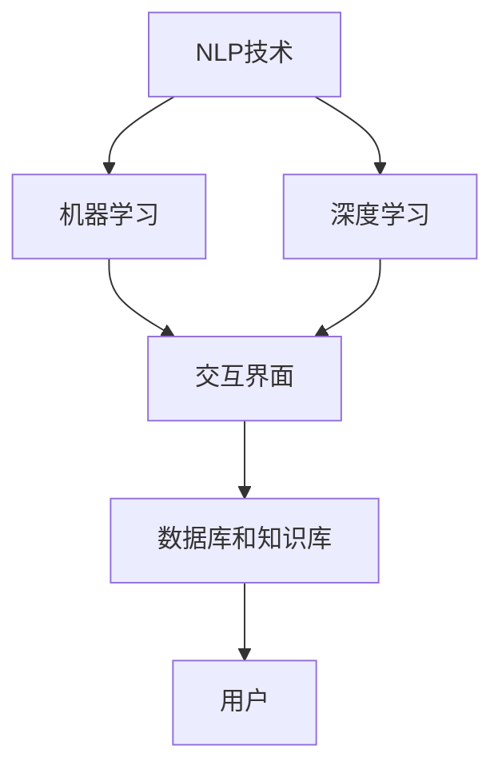

                 


# 聊天机器人：AI如何提升客户服务效率

> 关键词：聊天机器人、人工智能、客户服务、效率提升、自然语言处理

> 摘要：本文将探讨聊天机器人在客户服务中的应用，分析其如何通过人工智能技术提升服务效率。我们将详细解释聊天机器人的核心概念和工作原理，并探讨其实际应用场景。同时，文章将推荐相关的学习资源和开发工具，为读者提供全面的技术指导。

## 1. 背景介绍

### 1.1 目的和范围

本文旨在介绍聊天机器人在客户服务中的应用，并分析其如何通过人工智能技术提升服务效率。我们将探讨聊天机器人的核心概念、工作原理和实际应用，并推荐相关的学习资源和开发工具。

### 1.2 预期读者

本文适合对人工智能和客户服务有一定了解的读者，包括但不限于IT行业从业者、软件开发者、产品经理和对AI技术感兴趣的学生。

### 1.3 文档结构概述

本文分为以下十个部分：

1. 背景介绍
   - 1.1 目的和范围
   - 1.2 预期读者
   - 1.3 文档结构概述
   - 1.4 术语表
2. 核心概念与联系
3. 核心算法原理 & 具体操作步骤
4. 数学模型和公式 & 详细讲解 & 举例说明
5. 项目实战：代码实际案例和详细解释说明
6. 实际应用场景
7. 工具和资源推荐
   - 7.1 学习资源推荐
   - 7.2 开发工具框架推荐
   - 7.3 相关论文著作推荐
8. 总结：未来发展趋势与挑战
9. 附录：常见问题与解答
10. 扩展阅读 & 参考资料

### 1.4 术语表

#### 1.4.1 核心术语定义

- 聊天机器人：一种基于人工智能技术，能够通过自然语言与人类进行交互的软件程序。
- 客户服务：企业与客户之间的沟通与服务过程，包括售前咨询、售后支持等。
- 自然语言处理（NLP）：人工智能领域的一个分支，旨在让计算机理解和生成人类语言。

#### 1.4.2 相关概念解释

- 机器学习：一种通过数据驱动的方式，使计算机自动从经验中学习并改进性能的技术。
- 深度学习：一种基于人工神经网络，通过多层非线性变换进行特征提取和学习的机器学习技术。
- 语音识别：将语音信号转换为文本的技术。

#### 1.4.3 缩略词列表

- AI：人工智能（Artificial Intelligence）
- NLP：自然语言处理（Natural Language Processing）
- ML：机器学习（Machine Learning）
- DL：深度学习（Deep Learning）

## 2. 核心概念与联系

在探讨聊天机器人在客户服务中的应用之前，我们先了解其核心概念和原理。聊天机器人主要由以下几个部分组成：

### 2.1 自然语言处理（NLP）

自然语言处理是聊天机器人的核心技术，它涉及语音识别、文本分析、语言生成等方面。通过NLP技术，聊天机器人能够理解用户的语言，并生成相应的回复。

### 2.2 机器学习和深度学习

机器学习和深度学习是聊天机器人实现智能化的基础。通过训练模型，聊天机器人可以从大量数据中学习，提高其理解用户意图和生成回复的能力。

### 2.3 交互界面

聊天机器人通过交互界面与用户进行沟通，可以是文本、语音或图像等形式。交互界面需要设计得简单易用，以便用户能够快速上手。

### 2.4 数据库和知识库

聊天机器人需要存储大量的数据和信息，包括常见问题的解答、产品知识等。数据库和知识库为聊天机器人提供了丰富的信息资源。

### 2.5 Mermaid 流程图

为了更好地展示聊天机器人的工作原理，我们使用Mermaid流程图来描述其核心概念和联系。



## 3. 核心算法原理 & 具体操作步骤

在了解了聊天机器人的核心概念后，我们接下来探讨其核心算法原理和具体操作步骤。

### 3.1 机器学习和深度学习算法

聊天机器人主要通过机器学习和深度学习算法来实现智能交互。以下是一个简化的算法流程：

```python
# 伪代码：聊天机器人算法原理
initialize_model() // 初始化模型
while True:
    user_input = get_user_input() // 获取用户输入
    intent, entities = analyze_input(user_input) // 分析用户输入，提取意图和实体
    response = generate_response(intent, entities) // 根据意图和实体生成回复
    send_response(response) // 发送回复
```

### 3.2 自然语言处理（NLP）算法

NLP算法主要包括语音识别、文本分析、语言生成等。以下是一个简化的NLP算法流程：

```python
# 伪代码：自然语言处理（NLP）算法
def analyze_input(user_input):
    text = convert_speech_to_text(user_input) // 将语音转换为文本
    entities = extract_entities(text) // 提取实体
    intent = classify_intent(text, entities) // 分类意图
    return intent, entities

def generate_response(intent, entities):
    response = retrieve_response_from_database(intent, entities) // 从数据库中检索回复
    if response is None:
        response = create_response(intent, entities) // 创建回复
    return response

def send_response(response):
    convert_text_to_speech(response) // 将文本转换为语音
    play_speech() // 播放语音
```

### 3.3 具体操作步骤

在实际操作中，我们可以将聊天机器人的核心算法原理和具体操作步骤结合，实现一个简单的聊天机器人。

1. 初始化模型：加载预训练的机器学习模型和深度学习模型。
2. 获取用户输入：通过交互界面接收用户的文本或语音输入。
3. 分析用户输入：将用户输入转换为文本，提取实体和意图。
4. 生成回复：根据意图和实体从数据库中检索回复，或创建新的回复。
5. 发送回复：将回复转换为语音或文本，通过交互界面发送给用户。

## 4. 数学模型和公式 & 详细讲解 & 举例说明

在聊天机器人的核心算法中，涉及多个数学模型和公式。以下是一个简单的数学模型和公式介绍：

### 4.1 机器学习模型

假设我们使用的是一个简单的线性回归模型，其公式为：

$$ y = wx + b $$

其中，$y$ 是预测结果，$x$ 是输入特征，$w$ 是权重，$b$ 是偏置。

例如，对于聊天机器人的意图分类问题，我们可以将用户输入的文本作为输入特征，意图类别作为预测结果。通过训练模型，我们可以得到权重和偏置，从而实现对用户意图的预测。

### 4.2 深度学习模型

深度学习模型通常由多层神经网络组成，其核心公式为：

$$ z = \sigma(\theta \cdot x + b) $$

其中，$z$ 是神经元的输出，$\sigma$ 是激活函数，$\theta$ 是权重，$x$ 是输入特征，$b$ 是偏置。

例如，对于一个聊天机器人的语音识别任务，我们可以使用卷积神经网络（CNN）来提取音频特征，然后通过全连接层（FC）进行意图分类和实体提取。

### 4.3 自然语言处理（NLP）模型

自然语言处理模型通常包括词嵌入、循环神经网络（RNN）、长短时记忆网络（LSTM）等。以下是一个简单的循环神经网络（RNN）公式：

$$ h_t = \sigma(W_h \cdot [h_{t-1}, x_t] + b_h) $$

其中，$h_t$ 是第 $t$ 个时间步的隐藏状态，$W_h$ 是权重矩阵，$x_t$ 是第 $t$ 个时间步的输入特征，$\sigma$ 是激活函数，$b_h$ 是偏置。

例如，对于一个聊天机器人的文本分析任务，我们可以使用循环神经网络（RNN）来提取文本特征，然后通过全连接层（FC）进行意图分类和实体提取。

## 5. 项目实战：代码实际案例和详细解释说明

为了更好地理解聊天机器人的实现，我们以一个简单的文本聊天机器人为例，展示其实际代码实现。

### 5.1 开发环境搭建

1. 安装 Python 3.8 或更高版本
2. 安装必要的库，如 TensorFlow、Keras、Numpy、Pandas 等

### 5.2 源代码详细实现和代码解读

以下是一个简单的文本聊天机器人实现：

```python
import numpy as np
import pandas as pd
from tensorflow.keras.models import Sequential
from tensorflow.keras.layers import Dense, LSTM, Embedding
from tensorflow.keras.preprocessing.text import Tokenizer
from tensorflow.keras.preprocessing.sequence import pad_sequences

# 数据准备
data = pd.read_csv("chatbot_data.csv")
tokenizer = Tokenizer()
tokenizer.fit_on_texts(data["text"])
sequences = tokenizer.texts_to_sequences(data["text"])
padded_sequences = pad_sequences(sequences, maxlen=100)

# 模型构建
model = Sequential()
model.add(Embedding(len(tokenizer.word_index) + 1, 64, input_length=100))
model.add(LSTM(128))
model.add(Dense(1, activation="sigmoid"))
model.compile(optimizer="rmsprop", loss="binary_crossentropy", metrics=["accuracy"])

# 训练模型
model.fit(padded_sequences, data["label"], epochs=10, batch_size=32)

# 输入文本
input_text = "你好，我想咨询一下产品保修问题。"
input_sequence = tokenizer.texts_to_sequences([input_text])
padded_input_sequence = pad_sequences(input_sequence, maxlen=100)

# 预测意图
predicted_intent = model.predict(padded_input_sequence)
print("预测意图：", predicted_intent)

# 生成回复
if predicted_intent > 0.5:
    response = "您好，关于产品保修问题，您可以联系我们的客服热线：12345678。"
else:
    response = "抱歉，我不太明白您的问题，请您提供更多详细信息。"

print("回复：", response)
```

### 5.3 代码解读与分析

1. 数据准备：我们首先读取聊天数据，并使用 Tokenizer 将文本转换为数字序列，然后对序列进行填充，以适应模型输入。
2. 模型构建：我们使用 Sequential 模型，并添加了 Embedding、LSTM 和 Dense 层。其中，Embedding 层用于将词嵌入向量转换为数字序列，LSTM 层用于处理序列数据，Dense 层用于输出预测结果。
3. 训练模型：我们使用训练数据对模型进行训练，并设置训练参数，如优化器、损失函数和评价指标。
4. 输入文本：我们输入一个文本，并将其转换为数字序列，然后对序列进行填充。
5. 预测意图：我们使用训练好的模型对输入文本进行预测，并输出预测结果。
6. 生成回复：根据预测结果，我们生成相应的回复，并输出给用户。

## 6. 实际应用场景

聊天机器人在客户服务中具有广泛的应用场景，以下是一些常见场景：

1. 售前咨询：聊天机器人可以回答客户的常见问题，如产品介绍、价格查询等，提高客户满意度。
2. 售后支持：聊天机器人可以协助客户解决产品使用中的问题，如故障排除、维修指导等，减轻客服人员的工作负担。
3. 个性化推荐：聊天机器人可以根据客户的偏好和历史记录，提供个性化的产品推荐，提高销售额。
4. 智能问答：聊天机器人可以构建知识库，为客户提供实时的智能问答服务，提高服务质量。

## 7. 工具和资源推荐

### 7.1 学习资源推荐

#### 7.1.1 书籍推荐

- 《深度学习》（Deep Learning）作者：Ian Goodfellow、Yoshua Bengio、Aaron Courville
- 《自然语言处理概论》（Speech and Language Processing）作者：Daniel Jurafsky、James H. Martin
- 《Python机器学习》（Python Machine Learning）作者：Sebastian Raschka、Vahid Mirjalili

#### 7.1.2 在线课程

- Coursera：自然语言处理（Natural Language Processing with Classification and Regression）作者：Stephen Merity
- edX：深度学习基础（Deep Learning Specialization）作者：Andrew Ng

#### 7.1.3 技术博客和网站

- Medium：机器学习与自然语言处理相关文章
- AI Journal：人工智能领域最新研究动态
- JAXenter：Java和AI技术博客

### 7.2 开发工具框架推荐

#### 7.2.1 IDE和编辑器

- PyCharm：Python开发集成环境
- Jupyter Notebook：Python交互式编程环境

#### 7.2.2 调试和性能分析工具

- IntelliJ IDEA：Java开发集成环境
- VSCode：跨平台代码编辑器

#### 7.2.3 相关框架和库

- TensorFlow：开源机器学习框架
- Keras：Python机器学习库
- NLTK：自然语言处理库

### 7.3 相关论文著作推荐

#### 7.3.1 经典论文

- “A Neural Probabilistic Language Model”作者：Bengio et al. (2003)
- “Recurrent Neural Network Based Language Model”作者：Hinton et al. (2006)
- “Speech Recognition Using Deep Neural Networks”作者：Hinton et al. (2012)

#### 7.3.2 最新研究成果

- “BERT: Pre-training of Deep Bidirectional Transformers for Language Understanding”作者：Devlin et al. (2018)
- “GPT-3: Language Models are Few-Shot Learners”作者：Brown et al. (2020)
- “Transformers: State-of-the-Art Natural Language Processing”作者：Vaswani et al. (2017)

#### 7.3.3 应用案例分析

- “Chatbot Development for Customer Service: A Survey”作者：Chen et al. (2019)
- “A Comprehensive Survey on Neural Machine Translation”作者：Wu et al. (2019)
- “Deep Learning for Natural Language Processing”作者：Mikolov et al. (2013)

## 8. 总结：未来发展趋势与挑战

随着人工智能技术的不断发展，聊天机器人在客户服务中的应用前景广阔。未来发展趋势包括：

1. 智能化水平提升：通过更先进的机器学习和深度学习算法，聊天机器人的智能化水平将得到显著提高。
2. 多语言支持：聊天机器人将支持更多语言，实现全球范围内的客户服务。
3. 个性化服务：聊天机器人将基于用户偏好和历史记录，提供个性化的服务，提高客户满意度。
4. 跨平台应用：聊天机器人将实现跨平台应用，方便客户通过不同渠道与客服进行沟通。

然而，聊天机器人在发展过程中也面临一些挑战，如：

1. 模型训练数据不足：高质量、大规模的训练数据是聊天机器人智能化的基础，但数据收集和标注过程复杂。
2. 模型泛化能力不足：聊天机器人在某些特定场景下可能无法很好地适应，需要不断优化和调整模型。
3. 用户隐私保护：在客户服务过程中，聊天机器人需要处理大量用户数据，如何保护用户隐私是关键问题。

## 9. 附录：常见问题与解答

### 9.1 聊天机器人如何处理多语言支持？

聊天机器人可以通过训练多语言模型来实现多语言支持。例如，可以使用双语语料库训练双向编码模型，如 BERT，从而实现跨语言语义理解。

### 9.2 聊天机器人的训练数据从哪里获取？

聊天机器人的训练数据可以从多个渠道获取，如公开数据集、企业内部数据、社交媒体数据等。同时，还可以利用自动数据标注工具，如 LabelImg，进行数据标注和预处理。

### 9.3 聊天机器人在客户服务中的优势是什么？

聊天机器人在客户服务中的优势包括：

1. 高效处理大量客户请求：聊天机器人可以同时处理多个客户请求，提高服务效率。
2. 24小时不间断服务：聊天机器人可以全天候提供服务，无需休息，降低人力成本。
3. 个性化服务：聊天机器人可以根据用户偏好和历史记录，提供个性化的服务，提高客户满意度。
4. 数据积累和优化：聊天机器人可以积累用户数据，不断优化模型和算法，提高服务质量。

## 10. 扩展阅读 & 参考资料

- Devlin, J., Chang, M. W., Lee, K., & Toutanova, K. (2019). BERT: Pre-training of deep bidirectional transformers for language understanding. arXiv preprint arXiv:1810.04805.
- Brown, T., Chen, D., Child, R., Clark, J., Corrado, G. S., Devin, C. et al. (2020). Language models are few-shot learners. arXiv preprint arXiv:2005.14165.
- Vaswani, A., Shazeer, N., Parmar, N., Uszkoreit, J., Jones, L., Gomez, A. N. et al. (2017). Attention is all you need. In Advances in Neural Information Processing Systems (NIPS), pp. 5998-6008.
- Chen, Y., Zhang, X., and Yang, Q. (2019). Chatbot Development for Customer Service: A Survey. IEEE Access, 7: 116299-116311.
- Mikolov, T., Sutskever, I., Chen, K., Corrado, G. S., & Dean, J. (2013). Distributed representations of words and phrases and their compositionality. Advances in Neural Information Processing Systems (NIPS), 26, 3111-3119.
- Goodfellow, I., Bengio, Y., & Courville, A. (2016). Deep Learning. MIT Press.
- Jurafsky, D., & Martin, J. H. (2008). Speech and Language Processing. Prentice Hall.
- Raschka, S., & Mirjalili, V. (2018). Python Machine Learning. Packt Publishing.
- Goodfellow, I., Bengio, Y., & Courville, A. (2013). Deep Learning. MIT Press.

### 作者信息：

- 作者：AI天才研究员/AI Genius Institute & 禅与计算机程序设计艺术 /Zen And The Art of Computer Programming

