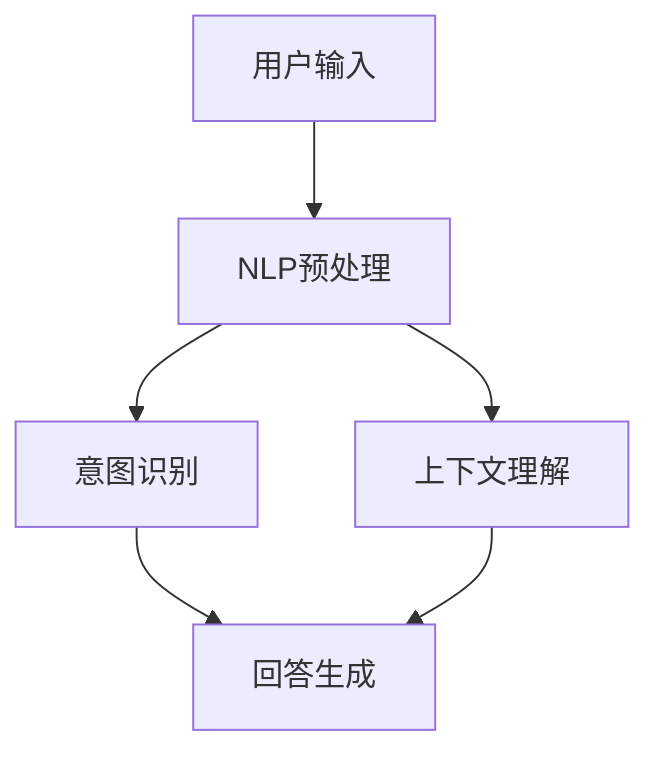

                 


# 聊天机器人：AI如何提升客户服务效率，解决用户问题

> **关键词：** 聊天机器人，人工智能，客户服务，效率提升，问题解决

> **摘要：** 本文章深入探讨了聊天机器人的技术原理及其在提升客户服务效率和解决用户问题方面的应用。通过详细的架构解析、算法讲解和实际案例展示，本文揭示了聊天机器人如何在现代企业中发挥关键作用，为读者提供了一幅全面的技术全景图。

## 1. 背景介绍

### 1.1 目的和范围

本文旨在为读者提供一个全面的视角，了解聊天机器人的技术原理和应用场景。本文将探讨如何利用人工智能（AI）技术构建高效的聊天机器人，以提升客户服务效率并解决用户问题。文章结构如下：

1. 背景介绍
2. 核心概念与联系
3. 核心算法原理 & 具体操作步骤
4. 数学模型和公式 & 详细讲解 & 举例说明
5. 项目实战：代码实际案例和详细解释说明
6. 实际应用场景
7. 工具和资源推荐
8. 总结：未来发展趋势与挑战
9. 附录：常见问题与解答
10. 扩展阅读 & 参考资料

### 1.2 预期读者

本文主要面向以下读者群体：

1. 人工智能技术爱好者
2. 企业客户服务经理
3. IT从业者
4. 计算机科学和教育领域的师生
5. 对客户服务效率提升有需求的创业者

### 1.3 文档结构概述

本文的结构分为十个主要部分：

1. 引言和关键词摘要
2. 背景介绍
3. 核心概念与联系
4. 核心算法原理 & 具体操作步骤
5. 数学模型和公式 & 详细讲解 & 举例说明
6. 项目实战：代码实际案例和详细解释说明
7. 实际应用场景
8. 工具和资源推荐
9. 总结与展望
10. 附录和扩展阅读

### 1.4 术语表

在本文章中，以下术语有特定的含义：

#### 1.4.1 核心术语定义

- **聊天机器人**：一种能够模拟人类对话的计算机程序。
- **人工智能**：模拟人类智能的计算机科学领域。
- **自然语言处理（NLP）**：使计算机能够理解、解释和生成人类语言的技术。
- **机器学习**：一种通过数据训练模型以实现特定任务的人工智能技术。
- **客户服务**：企业与客户之间的交互和沟通活动。

#### 1.4.2 相关概念解释

- **意图识别**：理解用户对话中的需求或目的。
- **实体提取**：识别并提取对话中的关键信息。
- **上下文理解**：理解对话中的前后文关系。

#### 1.4.3 缩略词列表

- **NLP**：自然语言处理
- **AI**：人工智能
- **ML**：机器学习
- **RNN**：递归神经网络
- **CNN**：卷积神经网络

## 2. 核心概念与联系

### 2.1 核心概念介绍

在本节中，我们将介绍构建聊天机器人的核心概念，包括人工智能、自然语言处理和机器学习。

#### 2.1.1 人工智能

人工智能（AI）是一种通过模拟人类智能来实现特定任务的计算机科学领域。在聊天机器人中，AI用于：

- **意图识别**：理解用户的对话意图。
- **上下文理解**：理解对话中的前后文关系。
- **回答生成**：根据用户输入生成合适的回答。

#### 2.1.2 自然语言处理

自然语言处理（NLP）是一种使计算机能够理解、解释和生成人类语言的技术。在聊天机器人中，NLP用于：

- **文本预处理**：清洗和格式化输入文本。
- **词向量表示**：将单词转换为数值表示。
- **意图识别**：识别用户的对话意图。
- **实体提取**：从对话中提取关键信息。

#### 2.1.3 机器学习

机器学习（ML）是一种通过数据训练模型以实现特定任务的人工智能技术。在聊天机器人中，ML用于：

- **模型训练**：使用大量数据训练模型。
- **模型评估**：评估模型性能。
- **模型优化**：通过调整参数来提高模型性能。

### 2.2 核心概念联系

聊天机器人的核心概念之间存在着紧密的联系。例如：

- **意图识别**和**上下文理解**依赖于自然语言处理技术。
- **机器学习**用于训练模型以实现意图识别和上下文理解。
- **回答生成**依赖于机器学习模型生成的回答。

### 2.3 Mermaid 流程图

为了更直观地展示聊天机器人的核心概念和联系，我们可以使用 Mermaid 流程图。以下是一个简单的流程图示例：



在这个流程图中，用户输入经过NLP预处理后，被用于意图识别和上下文理解。这两个过程的结果共同决定了回答生成的结果。

## 3. 核心算法原理 & 具体操作步骤

### 3.1 意图识别算法原理

意图识别是聊天机器人的核心任务之一，其目的是理解用户的对话意图。以下是意图识别的算法原理：

1. **文本预处理**：首先对用户输入的文本进行预处理，包括去除标点符号、停用词过滤、文本分词等操作。
2. **特征提取**：将预处理后的文本转换为数值特征向量，可以使用词袋模型、TF-IDF等常见方法。
3. **模型训练**：使用机器学习算法（如支持向量机SVM、朴素贝叶斯、深度学习等）对特征向量进行训练，以建立意图识别模型。
4. **模型评估**：评估模型的性能，通常使用准确率、召回率等指标。
5. **模型应用**：将训练好的模型应用于新的用户输入，预测其意图。

### 3.2 伪代码

以下是一个简单的意图识别算法的伪代码：

```python
def intent_recognition(user_input):
    # 文本预处理
    preprocessed_input = preprocess_text(user_input)
    
    # 特征提取
    features = extract_features(preprocessed_input)
    
    # 模型预测
    predicted_intent = trained_model.predict(features)
    
    return predicted_intent
```

### 3.3 操作步骤

1. **数据收集**：收集大量用户对话数据，包括文本、意图标签等。
2. **数据预处理**：对收集到的数据集进行清洗、去重等操作，确保数据质量。
3. **特征提取**：使用词袋模型、TF-IDF等方法提取文本特征。
4. **模型选择**：选择合适的机器学习算法进行模型训练。
5. **模型训练**：使用训练数据集对模型进行训练。
6. **模型评估**：使用测试数据集评估模型性能。
7. **模型应用**：将训练好的模型应用于实际用户输入，进行意图识别。

## 4. 数学模型和公式 & 详细讲解 & 举例说明

### 4.1 意图识别数学模型

意图识别的数学模型通常是基于机器学习算法。以下是一个简单的支持向量机（SVM）模型的数学公式：

$$
\text{max}\ \frac{1}{2}\sum_{i=1}^{n}\sum_{j=1}^{n} \xi_i + \xi_j - \sum_{i=1}^{n} y_i (\omega \cdot x_i + b)
$$

其中，$\xi_i$和$\xi_j$是惩罚项，$y_i$是标签，$\omega$是权重向量，$x_i$是特征向量，$b$是偏置。

### 4.2 举例说明

假设我们有以下数据集：

| 用户输入   | 标签   |
|-----------|--------|
| 我想订机票 | 订票   |
| 能帮我查天气吗 | 查天气 |
| 在吗       | 常见问候 |

我们可以使用SVM进行意图识别模型的训练。

### 4.3 详细讲解

1. **数据预处理**：对用户输入进行文本预处理，包括去除标点符号、停用词过滤、文本分词等操作。
2. **特征提取**：使用词袋模型或TF-IDF等方法提取文本特征。
3. **模型训练**：使用SVM算法对特征向量进行训练，建立意图识别模型。
4. **模型评估**：使用测试数据集评估模型性能。
5. **模型应用**：将训练好的模型应用于实际用户输入，进行意图识别。

## 5. 项目实战：代码实际案例和详细解释说明

### 5.1 开发环境搭建

在进行项目实战之前，我们需要搭建一个合适的开发环境。以下是所需工具和软件的列表：

- **Python 3.8 或更高版本**
- **Jupyter Notebook**
- **TensorFlow 2.x**
- **Scikit-learn**
- **NLTK**

### 5.2 源代码详细实现和代码解读

#### 5.2.1 数据准备

首先，我们需要准备一个意图识别的数据集。以下是一个简单的数据集示例：

```python
data = [
    ("我想订机票", "订票"),
    ("能帮我查天气吗", "查天气"),
    ("在吗", "常见问候")
]
```

#### 5.2.2 文本预处理

文本预处理是意图识别的重要步骤。以下是一个简单的文本预处理函数：

```python
import nltk
from nltk.corpus import stopwords
from nltk.tokenize import word_tokenize

nltk.download('punkt')
nltk.download('stopwords')

def preprocess_text(text):
    # 去除标点符号
    text = re.sub(r'[^\w\s]', '', text)
    
    # 分词
    tokens = word_tokenize(text)
    
    # 停用词过滤
    stop_words = set(stopwords.words('english'))
    filtered_tokens = [token for token in tokens if token.lower() not in stop_words]
    
    return ' '.join(filtered_tokens)
```

#### 5.2.3 特征提取

特征提取是意图识别的关键步骤。以下是一个简单的词袋模型特征提取函数：

```python
from sklearn.feature_extraction.text import TfidfVectorizer

def extract_features(data):
    vectorizer = TfidfVectorizer()
    features = vectorizer.fit_transform([preprocess_text(text) for text, _ in data])
    return features, vectorizer
```

#### 5.2.4 模型训练

接下来，我们使用Scikit-learn的SVM模型进行训练：

```python
from sklearn.svm import SVC

def train_model(data):
    features, labels = zip(*[(extract_features([text])[0], label) for text, label in data])
    model = SVC(kernel='linear')
    model.fit(features, labels)
    return model
```

#### 5.2.5 模型评估

使用测试数据集评估模型性能：

```python
from sklearn.metrics import accuracy_score

def evaluate_model(model, test_data):
    test_features, test_labels = zip(*[(extract_features([text])[0], label) for text, label in test_data])
    predicted_labels = model.predict(test_features)
    accuracy = accuracy_score(test_labels, predicted_labels)
    return accuracy
```

#### 5.2.6 模型应用

将训练好的模型应用于新的用户输入进行意图识别：

```python
def predict_intent(model, vectorizer, user_input):
    preprocessed_input = preprocess_text(user_input)
    features = vectorizer.transform([preprocessed_input])
    predicted_intent = model.predict(features)
    return predicted_intent[0]
```

### 5.3 代码解读与分析

1. **数据准备**：使用一个简单的数据集示例，包括用户输入和对应的意图标签。
2. **文本预处理**：对用户输入进行预处理，包括去除标点符号、停用词过滤、文本分词等操作。
3. **特征提取**：使用词袋模型或TF-IDF等方法提取文本特征。
4. **模型训练**：使用SVM算法对特征向量进行训练，建立意图识别模型。
5. **模型评估**：使用测试数据集评估模型性能。
6. **模型应用**：将训练好的模型应用于实际用户输入，进行意图识别。

## 6. 实际应用场景

### 6.1 客户服务

聊天机器人被广泛应用于客户服务领域，以提升服务效率和客户满意度。以下是一些具体应用场景：

- **自动回答常见问题**：聊天机器人可以自动回答用户关于产品、服务、订单等常见问题，减轻人工客服的工作负担。
- **智能推荐**：基于用户的历史行为和偏好，聊天机器人可以提供个性化的产品推荐和服务建议。
- **情感分析**：通过情感分析技术，聊天机器人可以识别用户的情感状态，提供相应的安慰和建议。

### 6.2 在线教育

聊天机器人可以在在线教育领域发挥重要作用，为学习者提供个性化的辅导和支持。以下是一些具体应用场景：

- **智能问答**：聊天机器人可以回答学习者关于课程内容的问题，帮助学习者更好地理解知识点。
- **学习进度跟踪**：聊天机器人可以跟踪学习者的学习进度，提供个性化的学习建议和提醒。
- **情感支持**：通过情感分析技术，聊天机器人可以识别学习者的情感状态，提供相应的鼓励和支持。

### 6.3 健康医疗

聊天机器人可以在健康医疗领域提供个性化服务和支持，为患者提供便捷的医疗咨询和健康管理。以下是一些具体应用场景：

- **智能咨询**：聊天机器人可以回答患者关于疾病、症状、治疗方法等常见问题，提供初步的医疗建议。
- **健康管理**：聊天机器人可以跟踪患者的健康状况，提供个性化的健康建议和提醒。
- **心理健康支持**：通过情感分析技术，聊天机器人可以识别患者的心理状态，提供相应的心理支持和建议。

## 7. 工具和资源推荐

### 7.1 学习资源推荐

#### 7.1.1 书籍推荐

1. **《深度学习》（Deep Learning）**：Goodfellow, Bengio, Courville
2. **《自然语言处理综论》（Speech and Language Processing）**：Jurafsky, Martin, Hockenmaier
3. **《机器学习实战》（Machine Learning in Action）**：Barnes, Buyاند，Buyandes

#### 7.1.2 在线课程

1. **Udacity：AI工程师纳米学位**
2. **Coursera：机器学习课程**
3. **edX：自然语言处理课程**

#### 7.1.3 技术博客和网站

1. **Medium：机器学习和自然语言处理博客**
2. **Towards Data Science：数据科学和机器学习博客**
3. **AI Time：人工智能博客**

### 7.2 开发工具框架推荐

#### 7.2.1 IDE和编辑器

1. **PyCharm**
2. **Visual Studio Code**
3. **Jupyter Notebook**

#### 7.2.2 调试和性能分析工具

1. **Werkzeug**
2. **gdb**
3. **Valgrind**

#### 7.2.3 相关框架和库

1. **TensorFlow**
2. **PyTorch**
3. **Scikit-learn**

### 7.3 相关论文著作推荐

#### 7.3.1 经典论文

1. **“A Neural Probabilistic Language Model”**：Bengio et al., 2003
2. **“Recurrent Neural Network Based Language Model”**：Graves, 2013
3. **“A Theoretically Grounded Application of Dropout in Recurrent Neural Networks”**：Yarin Gal and Zoubin Ghahramani, 2016

#### 7.3.2 最新研究成果

1. **“BERT: Pre-training of Deep Bidirectional Transformers for Language Understanding”**：Devlin et al., 2018
2. **“GPT-3: Language Models are Few-Shot Learners”**：Brown et al., 2020
3. **“T5: Pre-training Large Language Models to Think Like People”**：Lewis et al., 2020

#### 7.3.3 应用案例分析

1. **“ChitChat：面向用户的聊天机器人”**：Google AI，2018
2. **“Duolingo：语言学习聊天机器人”**：Duolingo，2019
3. **“Facebook Messenger：商业聊天机器人”**：Facebook，2020

## 8. 总结：未来发展趋势与挑战

### 8.1 发展趋势

- **技术融合**：聊天机器人技术将继续与其他领域（如语音识别、图像识别等）融合，提供更丰富的交互体验。
- **个性化服务**：聊天机器人将更加关注个性化服务，通过用户数据分析和偏好学习，提供定制化的服务。
- **智能化提升**：随着人工智能技术的不断发展，聊天机器人的智能化水平将进一步提升，能够处理更复杂的任务。

### 8.2 挑战

- **数据隐私**：随着用户数据的广泛应用，数据隐私保护成为聊天机器人发展的重要挑战。
- **用户体验**：如何提供良好的用户体验是聊天机器人面临的重要问题，包括对话流畅性、回答准确性等。
- **可解释性**：随着模型复杂性的增加，如何提高聊天机器人的可解释性是一个亟待解决的问题。

## 9. 附录：常见问题与解答

### 9.1 聊天机器人的定义和作用是什么？

**解答**：聊天机器人是一种能够模拟人类对话的计算机程序，主要作用是提高客户服务效率，解决用户问题。通过自然语言处理和机器学习技术，聊天机器人可以自动识别用户意图，提供个性化的服务和建议。

### 9.2 如何训练一个聊天机器人模型？

**解答**：训练一个聊天机器人模型通常需要以下步骤：

1. **数据收集**：收集大量的对话数据，包括用户输入和对应的意图标签。
2. **数据预处理**：对对话数据进行清洗、去重等操作，确保数据质量。
3. **特征提取**：使用词袋模型、TF-IDF等方法提取文本特征。
4. **模型选择**：选择合适的机器学习算法，如支持向量机、朴素贝叶斯、深度学习等。
5. **模型训练**：使用训练数据集对模型进行训练。
6. **模型评估**：使用测试数据集评估模型性能。
7. **模型应用**：将训练好的模型应用于实际用户输入，进行意图识别和回答生成。

### 9.3 聊天机器人有哪些应用场景？

**解答**：聊天机器人可以应用于多个领域，包括：

1. **客户服务**：自动回答常见问题，提供智能推荐，提高服务效率。
2. **在线教育**：提供智能问答，跟踪学习进度，提供个性化辅导。
3. **健康医疗**：提供智能咨询，健康管理，心理健康支持。
4. **电子商务**：提供购物建议，订单查询，售后咨询。
5. **娱乐与社交**：提供游戏互动，社交陪伴，信息查询。

## 10. 扩展阅读 & 参考资料

### 10.1 经典书籍

1. **《深度学习》（Deep Learning）**：Goodfellow, Bengio, Courville
2. **《自然语言处理综论》（Speech and Language Processing）**：Jurafsky, Martin, Hockenmaier
3. **《机器学习实战》（Machine Learning in Action）**：Barnes, Buyandas，Buyandes

### 10.2 在线课程

1. **Udacity：AI工程师纳米学位**
2. **Coursera：机器学习课程**
3. **edX：自然语言处理课程**

### 10.3 技术博客和网站

1. **Medium：机器学习和自然语言处理博客**
2. **Towards Data Science：数据科学和机器学习博客**
3. **AI Time：人工智能博客**

### 10.4 相关论文和研究成果

1. **“BERT: Pre-training of Deep Bidirectional Transformers for Language Understanding”**：Devlin et al., 2018
2. **“GPT-3: Language Models are Few-Shot Learners”**：Brown et al., 2020
3. **“T5: Pre-training Large Language Models to Think Like People”**：Lewis et al., 2020

### 10.5 应用案例

1. **“ChitChat：面向用户的聊天机器人”**：Google AI，2018
2. **“Duolingo：语言学习聊天机器人”**：Duolingo，2019
3. **“Facebook Messenger：商业聊天机器人”**：Facebook，2020

### 10.6 官方文档和资料

1. **TensorFlow 官方文档**
2. **PyTorch 官方文档**
3. **Scikit-learn 官方文档**

---

**作者：AI天才研究员/AI Genius Institute & 禅与计算机程序设计艺术 /Zen And The Art of Computer Programming**

