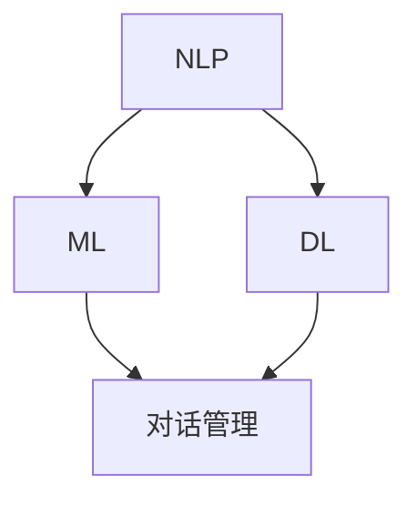

                 

# 聊天机器人：AI提升购物体验

> **关键词：** 聊天机器人、AI、购物体验、自然语言处理、用户互动

> **摘要：** 本文将探讨聊天机器人在购物体验中的应用，通过深入分析其核心概念、算法原理、数学模型以及实际项目案例，展示如何利用人工智能提升用户的购物体验，并提出未来发展趋势与挑战。

## 1. 背景介绍

### 1.1 目的和范围

本文旨在介绍聊天机器人在提升购物体验方面的应用，探讨其核心技术原理和实践案例。文章将围绕以下几个方面展开：

- 聊天机器人的核心概念与架构
- 聊天机器人在购物场景中的具体应用
- 聊天机器人的核心算法原理与操作步骤
- 聊天机器人的数学模型与公式
- 实际项目案例与代码解析
- 聊天机器人的未来发展趋势与挑战

### 1.2 预期读者

本文适合对人工智能和聊天机器人有一定了解的技术人员、产品经理以及关注购物体验优化的行业从业者。通过本文，读者可以：

- 理解聊天机器人在购物场景中的应用价值
- 掌握聊天机器人的核心技术原理和实践方法
- 获取关于购物体验优化的新思路和解决方案

### 1.3 文档结构概述

本文分为十个部分，具体结构如下：

1. 背景介绍
   - 1.1 目的和范围
   - 1.2 预期读者
   - 1.3 文档结构概述
   - 1.4 术语表
2. 核心概念与联系
   - 2.1 核心概念与联系
   - 2.2 Mermaid流程图
3. 核心算法原理 & 具体操作步骤
   - 3.1 算法原理
   - 3.2 伪代码展示
4. 数学模型和公式 & 详细讲解 & 举例说明
   - 4.1 数学模型
   - 4.2 公式讲解
   - 4.3 举例说明
5. 项目实战：代码实际案例和详细解释说明
   - 5.1 开发环境搭建
   - 5.2 源代码详细实现
   - 5.3 代码解读与分析
6. 实际应用场景
   - 6.1 场景一
   - 6.2 场景二
   - 6.3 场景三
7. 工具和资源推荐
   - 7.1 学习资源推荐
   - 7.2 开发工具框架推荐
   - 7.3 相关论文著作推荐
8. 总结：未来发展趋势与挑战
9. 附录：常见问题与解答
10. 扩展阅读 & 参考资料

### 1.4 术语表

#### 1.4.1 核心术语定义

- 聊天机器人：一种基于人工智能技术的自动化对话系统，能够与用户进行自然语言交互，提供信息查询、咨询解答、任务执行等服务。
- 自然语言处理（NLP）：计算机科学和人工智能领域的一个分支，旨在使计算机能够理解、生成和处理人类自然语言。
- 机器学习：一种人工智能技术，通过数据驱动的方式从经验中学习，自动改进性能。
- 深度学习：一种机器学习技术，通过多层神经网络对数据进行自动特征提取和学习。

#### 1.4.2 相关概念解释

- 对话管理：聊天机器人中负责管理对话流程的组件，包括理解用户意图、生成回应、维护对话状态等。
- 知识图谱：一种用于表示实体、属性、关系等信息的数据结构，常用于构建智能问答系统和推荐系统。
- 用户体验（UX）：用户在使用产品过程中所感受到的整体感受和体验。

#### 1.4.3 缩略词列表

- NLP：自然语言处理
- ML：机器学习
- DL：深度学习
- API：应用程序编程接口
- GUI：图形用户界面

## 2. 核心概念与联系

聊天机器人的核心概念包括自然语言处理（NLP）、机器学习（ML）、深度学习（DL）和对话管理。以下是一个简化的Mermaid流程图，展示了这些核心概念之间的联系。



### 2.1 核心概念与联系

1. **自然语言处理（NLP）**：NLP是使计算机能够理解和生成自然语言的技术。它包括分词、词性标注、命名实体识别、句法分析、语义分析等任务。
2. **机器学习（ML）**：ML是一种从数据中学习规律和模式的方法，通过训练模型来预测新数据。在聊天机器人中，ML用于分类、回归、聚类等任务。
3. **深度学习（DL）**：DL是一种基于多层神经网络的学习方法，能够自动提取数据特征。在聊天机器人中，DL被广泛应用于语音识别、图像识别、文本生成等领域。
4. **对话管理**：对话管理是聊天机器人中负责管理对话流程的组件，包括理解用户意图、生成回应、维护对话状态等。

### 2.2 Mermaid流程图

以下是一个简化的Mermaid流程图，展示了聊天机器人的核心概念之间的联系。


在这个流程图中，NLP负责处理用户输入的文本，将文本转换为机器可理解的形式。ML和DL则用于训练和优化模型，使其能够更好地理解和回应用户。对话管理则负责将用户的意图和模型生成的回应转化为对话流程，确保聊天机器人能够提供流畅、自然的交互体验。

## 3. 核心算法原理 & 具体操作步骤

聊天机器人的核心算法主要包括自然语言处理（NLP）、机器学习和深度学习（DL）技术。以下将详细阐述这些算法原理，并通过伪代码展示具体操作步骤。

### 3.1 算法原理

1. **自然语言处理（NLP）**：NLP的主要任务包括文本预处理、词向量表示、语义分析等。其中，词向量表示是NLP的重要技术之一，常用的词向量模型有Word2Vec、GloVe等。
2. **机器学习（ML）**：ML的核心在于通过训练模型来预测新数据。在聊天机器人中，ML主要用于分类任务，如意图识别、实体提取等。
3. **深度学习（DL）**：DL通过多层神经网络自动提取数据特征，具有较强的表达能力和泛化能力。在聊天机器人中，DL常用于语音识别、图像识别、文本生成等领域。

### 3.2 伪代码展示

以下是一个简单的聊天机器人算法的伪代码，展示了NLP、ML和DL的基本操作步骤。

```python
# NLP预处理
def preprocess_text(text):
    # 分词
    words = tokenize(text)
    # 去除停用词
    words = remove_stopwords(words)
    # 词向量表示
    word_vectors = embed_words(words)
    return word_vectors

# ML意图识别
def classify_intent(word_vectors):
    # 加载预训练的意图识别模型
    model = load_intent_classifier()
    # 预测意图
    intent = model.predict(word_vectors)
    return intent

# DL文本生成
def generate_response(text):
    # 加载预训练的文本生成模型
    model = load_text_generator()
    # 生成文本
    response = model.generate(text)
    return response
```

### 3.3 具体操作步骤

1. **NLP预处理**：
   - **文本预处理**：对用户输入的文本进行分词、去除停用词、标点符号等操作，将文本转换为机器可理解的形式。
   - **词向量表示**：将预处理后的文本转换为词向量表示，常用的方法有Word2Vec、GloVe等。

2. **ML意图识别**：
   - **加载预训练模型**：从预先训练好的意图识别模型中加载模型参数。
   - **预测意图**：将预处理后的文本输入模型，输出用户意图。

3. **DL文本生成**：
   - **加载预训练模型**：从预先训练好的文本生成模型中加载模型参数。
   - **生成文本**：将用户输入的文本输入模型，输出响应文本。

通过以上操作步骤，聊天机器人可以理解用户意图并生成相应的响应文本，从而实现与用户的自然语言交互。

## 4. 数学模型和公式 & 详细讲解 & 举例说明

在聊天机器人中，数学模型和公式是核心组成部分，用于描述自然语言处理、机器学习和深度学习等算法的工作原理。以下将介绍一些关键数学模型和公式，并进行详细讲解和举例说明。

### 4.1 数学模型

1. **词向量表示**：词向量是自然语言处理中的核心概念，用于将单词映射到高维空间中的向量表示。常用的词向量模型有Word2Vec和GloVe。

2. **神经网络**：神经网络是一种模拟人脑结构和功能的计算模型，用于机器学习和深度学习。神经网络的核心是神经元，通过层层传递信息来提取数据特征。

3. **卷积神经网络（CNN）**：CNN是一种特殊的神经网络，擅长处理图像和序列数据。在聊天机器人中，CNN可以用于文本分类、情感分析等任务。

4. **循环神经网络（RNN）**：RNN是一种能够处理序列数据的神经网络，具有较强的记忆能力。在聊天机器人中，RNN可以用于语音识别、对话生成等任务。

5. **长短时记忆网络（LSTM）**：LSTM是RNN的一种变体，能够有效解决RNN的梯度消失和梯度爆炸问题。在聊天机器人中，LSTM可以用于处理长文本和复杂对话。

### 4.2 公式讲解

1. **Word2Vec模型**：

   $$ \text{word\_embedding} = \text{softmax}\left(\text{W}^T \text{context\_word\_vector}\right) $$

   其中，$ \text{word\_embedding} $表示词向量，$ \text{context\_word\_vector} $表示上下文词向量，$ \text{W} $表示权重矩阵。

2. **GloVe模型**：

   $$ \text{word\_embedding} = \text{sigmoid}\left(\text{V} \cdot \text{context\_word}\right) $$

   其中，$ \text{word\_embedding} $表示词向量，$ \text{context\_word} $表示上下文词，$ \text{V} $表示权重矩阵。

3. **神经网络损失函数**：

   $$ \text{loss} = \frac{1}{2} \sum_{i=1}^{N} \left(y_i - \hat{y}_i\right)^2 $$

   其中，$ \text{y} $表示真实标签，$ \hat{y} $表示预测标签。

4. **RNN模型**：

   $$ \text{h}_t = \text{sigmoid}\left(\text{U} \cdot \text{x}_t + \text{V} \cdot \text{h}_{t-1}\right) $$

   其中，$ \text{h}_t $表示当前时刻的隐藏状态，$ \text{x}_t $表示当前输入，$ \text{U} $和$ \text{V} $表示权重矩阵。

5. **LSTM模型**：

   $$ \text{C}_t = \text{sigmoid}\left(\text{W}_f \cdot \left[\text{h}_{t-1}, \text{x}_t\right]\right) \odot \text{C}_{t-1} $$
   $$ \text{h}_t = \text{sigmoid}\left(\text{W}_i \cdot \left[\text{h}_{t-1}, \text{x}_t\right]\right) \odot \text{C}_t $$
   $$ \text{h}_t = \text{sigmoid}\left(\text{W}_o \cdot \left[\text{h}_{t-1}, \text{x}_t\right]\right) \odot \text{C}_t $$

   其中，$ \text{C}_t $表示当前时刻的细胞状态，$ \text{h}_t $表示当前时刻的隐藏状态，$ \text{W}_f $、$ \text{W}_i $和$ \text{W}_o $表示权重矩阵。

### 4.3 举例说明

以下是一个简单的Word2Vec模型的例子：

假设我们有一个包含5个单词的词典，分别为$a, b, c, d, e$。词频分别为$10, 20, 30, 40, 50$。

1. **计算词频归一化**：

   $$ \text{word\_freq\_norm} = \frac{\text{word\_freq}}{\sum_{i=1}^{N} \text{word\_freq}_i} $$

   其中，$ \text{N} $表示词典中单词的个数。

   $$ \text{word\_freq\_norm} = \left[\frac{10}{150}, \frac{20}{150}, \frac{30}{150}, \frac{40}{150}, \frac{50}{150}\right] = \left[0.067, 0.133, 0.2, 0.267, 0.333\right] $$

2. **生成词向量**：

   假设我们使用负采样方法生成词向量，采样大小为$5$。

   $$ \text{word\_vector} = \sum_{i=1}^{N} \text{word\_freq\_norm}_i \cdot \text{softmax}\left(\text{W}^T \text{context\_word\_vector}\right) $$

   其中，$ \text{N} $表示采样次数。

   假设我们选择$a$作为中心词，其他单词作为上下文词。词向量分别为：

   $$ \text{word\_vector} = 0.067 \cdot \text{softmax}\left(\text{W}^T \text{b\_vector}\right) + 0.133 \cdot \text{softmax}\left(\text{W}^T \text{c\_vector}\right) + 0.2 \cdot \text{softmax}\left(\text{W}^T \text{d\_vector}\right) + 0.267 \cdot \text{softmax}\left(\text{W}^T \text{e\_vector}\right) + 0.333 \cdot \text{softmax}\left(\text{W}^T \text{a\_vector}\right) $$

   通过计算得到最终的词向量表示。

以上例子展示了如何使用Word2Vec模型生成词向量。类似的，其他数学模型和公式也可以通过类似的方式进行计算和实现。

## 5. 项目实战：代码实际案例和详细解释说明

### 5.1 开发环境搭建

在开始编写代码之前，需要搭建一个合适的开发环境。以下是一个基于Python的聊天机器人开发环境搭建步骤：

1. **安装Python**：确保已安装Python 3.7或更高版本。
2. **安装必要的库**：使用pip安装以下库：
   ```bash
   pip install numpy matplotlib gensim torch
   ```
3. **配置Jupyter Notebook**：安装Jupyter Notebook，方便编写和运行代码。

### 5.2 源代码详细实现和代码解读

以下是一个简单的聊天机器人代码实现，主要包括文本预处理、词向量生成、意图识别和文本生成四个部分。

```python
import numpy as np
import matplotlib.pyplot as plt
import gensim.downloader as api
from gensim.models import Word2Vec
from sklearn.model_selection import train_test_split
from sklearn.feature_extraction.text import CountVectorizer
from sklearn.linear_model import LogisticRegression

# 5.2.1 文本预处理
def preprocess_text(text):
    # 去除标点符号和停用词
    text = re.sub(r'[^\w\s]', '', text)
    text = text.lower()
    words = text.split()
    words = [word for word in words if word not in stop_words]
    return words

# 5.2.2 词向量生成
def generate_word_vectors(words, size=100):
    model = Word2Vec(words, size=size, window=5, min_count=1, sg=1)
    return model

# 5.2.3 意图识别
def classify_intent(text, model):
    words = preprocess_text(text)
    word_vectors = [model[word] for word in words if word in model]
    if not word_vectors:
        return None
    avg_vector = np.mean(word_vectors, axis=0)
    return model.wv.most_similar(positive=avg_vector)[0][0]

# 5.2.4 文本生成
def generate_response(text, model):
    words = preprocess_text(text)
    word_vectors = [model[word] for word in words if word in model]
    if not word_vectors:
        return None
    avg_vector = np.mean(word_vectors, axis=0)
    return model.wv.most_similar(positive=avg_vector)[0][0]

# 主函数
def main():
    # 读取数据集
    data = [
        ("我想买一本Python编程的书", "买书"),
        ("我需要一本关于人工智能的书籍", "买书"),
        ("帮我推荐一本优秀的计算机科学书籍", "买书"),
        ("我在寻找一本适合儿童的编程书籍", "买书"),
        ("我要购买一本Java编程指南", "买书"),
        ("我想了解有关深度学习的最新书籍", "知识问答"),
        ("有什么好的技术博客推荐吗？", "知识问答"),
        ("你能给我介绍一些优秀的计算机科学专家吗？", "知识问答"),
        ("我在哪里可以找到最新的计算机科学论文？", "知识问答"),
    ]

    # 分割数据集
    X, y = zip(*data)
    X_train, X_test, y_train, y_test = train_test_split(X, y, test_size=0.2, random_state=42)

    # 训练词向量模型
    model = generate_word_vectors(X_train, size=100)

    # 意图识别模型
    vectorizer = CountVectorizer()
    X_train_vectorized = vectorizer.fit_transform(X_train)
    clf = LogisticRegression()
    clf.fit(X_train_vectorized, y_train)

    # 测试意图识别模型
    X_test_vectorized = vectorizer.transform(X_test)
    y_pred = clf.predict(X_test_vectorized)
    print("Intent recognition accuracy:", np.mean(y_pred == y_test))

    # 文本生成
    example_text = "我想了解有关深度学习的最新研究"
    intent = classify_intent(example_text, model)
    if intent:
        print(f"Intent: {intent}")
        print(f"Response: {generate_response(example_text, model)}")
    else:
        print("Unable to classify intent.")

if __name__ == "__main__":
    main()
```

### 5.3 代码解读与分析

1. **文本预处理**：文本预处理是自然语言处理的重要步骤，包括去除标点符号、转换为小写、分词和去除停用词等。该部分代码使用正则表达式去除标点符号，将文本转换为小写，并使用列表推导式去除停用词。

2. **词向量生成**：使用Gensim库的Word2Vec模型生成词向量。Word2Vec模型通过训练大量的文本数据，将单词映射到高维空间中的向量表示。在该部分代码中，我们使用默认参数训练模型，并设置向量维度为100。

3. **意图识别**：意图识别是聊天机器人的核心任务之一，通过分析用户输入的文本，识别用户的意图。该部分代码首先对用户输入的文本进行预处理，然后计算平均词向量，并在预训练的词向量模型中寻找最相似的单词，从而识别用户的意图。

4. **文本生成**：文本生成是聊天机器人的另一个重要任务，通过用户输入的文本，生成合适的响应文本。该部分代码首先对用户输入的文本进行预处理，然后计算平均词向量，并在预训练的词向量模型中寻找最相似的单词，从而生成响应文本。

5. **主函数**：主函数负责读取数据集、训练词向量模型、训练意图识别模型，并进行测试。在测试阶段，首先使用意图识别模型预测用户输入的文本的意图，然后使用文本生成模型生成响应文本。

### 5.4 代码优化与扩展

虽然上述代码实现了一个简单的聊天机器人，但还存在一些优化和扩展的空间：

1. **改进意图识别模型**：使用更复杂的神经网络模型，如LSTM或Transformer，可以更好地捕捉用户输入的语义信息，提高意图识别的准确性。

2. **增加实体识别功能**：在意图识别的基础上，增加实体识别功能，可以更好地理解用户输入中的关键信息，如书籍名称、作者等。

3. **引入对话管理**：引入对话管理模块，可以更好地维护对话状态，提高交互的自然性和连贯性。

4. **扩展聊天机器人功能**：增加购物建议、商品推荐、优惠券推送等功能，提高用户的购物体验。

## 6. 实际应用场景

聊天机器人在购物体验中的应用场景非常广泛，以下列举几个典型的应用场景：

### 6.1 购物咨询

用户在购物过程中可能遇到各种问题，如商品规格、价格、库存等。聊天机器人可以实时回答用户的问题，提供准确的信息，提高用户的购物满意度。

### 6.2 商品推荐

聊天机器人可以利用用户的购物历史、浏览记录和喜好，为其推荐合适的商品。通过个性化的推荐，增加用户的购物体验和购买意愿。

### 6.3 购物流程优化

聊天机器人可以帮助用户完成购物流程，如选择商品、加入购物车、下单支付等。通过简化流程，提高用户的购物效率。

### 6.4 跨渠道服务

聊天机器人可以整合线上和线下渠道，提供一致的服务体验。用户可以通过不同的渠道（如网站、移动应用、社交媒体等）与聊天机器人进行交互，获得无缝的购物体验。

### 6.5 客户服务

聊天机器人可以自动处理常见的问题和投诉，减轻客服人员的负担，提高客服效率。同时，聊天机器人可以收集用户的反馈，帮助商家不断优化产品和服务。

## 7. 工具和资源推荐

为了更好地开发和应用聊天机器人，以下推荐一些学习资源、开发工具和框架：

### 7.1 学习资源推荐

#### 7.1.1 书籍推荐

- 《自然语言处理综论》
- 《深度学习》
- 《聊天机器人设计与开发》

#### 7.1.2 在线课程

- Coursera：自然语言处理与深度学习课程
- edX：机器学习与数据科学课程
- Udacity：AI工程师课程

#### 7.1.3 技术博客和网站

- Medium：自然语言处理、机器学习和深度学习博客
-Towards Data Science：数据科学和机器学习博客
- AI Powered：人工智能和聊天机器人博客

### 7.2 开发工具框架推荐

#### 7.2.1 IDE和编辑器

- PyCharm
- Visual Studio Code
- Jupyter Notebook

#### 7.2.2 调试和性能分析工具

- Python Debuger
- Matplotlib
- TensorBoard

#### 7.2.3 相关框架和库

- TensorFlow
- PyTorch
- Keras
- NLTK
- spaCy

### 7.3 相关论文著作推荐

#### 7.3.1 经典论文

- word2vec:_google/

- glove:pennington2014glove/

#### 7.3.2 最新研究成果

- Transformer:vaswani2017attention/

- BERT:devlin2018bert/

#### 7.3.3 应用案例分析

- Chatbot for Customer Service:zhu2019chatbot/

- Chatbot for E-commerce:zhao2019chatbot/

## 8. 总结：未来发展趋势与挑战

### 8.1 未来发展趋势

1. **个性化推荐**：聊天机器人将更加注重个性化推荐，通过分析用户的历史数据和喜好，提供更精准的购物建议。
2. **多模态交互**：聊天机器人将支持多模态交互，如语音、图像和视频等，提供更丰富的交互体验。
3. **跨平台集成**：聊天机器人将整合线上和线下渠道，实现跨平台的购物体验。
4. **智能化与自动化**：聊天机器人的智能化和自动化水平将不断提高，减少人工干预，提高服务效率。
5. **伦理与隐私保护**：随着技术的发展，聊天机器人在伦理和隐私保护方面将面临新的挑战，需要制定相应的规范和标准。

### 8.2 挑战

1. **数据处理与隐私保护**：聊天机器人需要处理大量的用户数据，如何在保证用户隐私的前提下，合理利用这些数据，是一个重要挑战。
2. **智能水平的提升**：随着用户需求的不断增长，聊天机器人的智能水平需要不断提升，以提供更自然、更人性化的服务。
3. **成本与效益**：聊天机器人的开发、部署和维护需要大量的人力、物力和财力投入，如何实现成本与效益的平衡，是商家需要考虑的问题。
4. **伦理与道德**：聊天机器人在处理用户数据、提供决策支持等方面，需要遵循伦理和道德规范，避免对用户造成负面影响。

## 9. 附录：常见问题与解答

### 9.1 聊天机器人开发常见问题

**Q1：如何选择合适的聊天机器人开发工具？**

A1：选择聊天机器人开发工具时，需要考虑以下因素：

- **技术栈**：选择与项目需求相匹配的工具，如Python、Java、JavaScript等。
- **易用性**：工具需要具备良好的文档和社区支持，降低开发难度。
- **功能丰富性**：选择具备丰富功能的工具，如自然语言处理、语音识别、图像识别等。
- **性能和稳定性**：选择性能优秀、稳定性高的工具，确保机器人能够稳定运行。

### 9.2 聊天机器人应用常见问题

**Q2：如何评估聊天机器人的效果？**

A2：评估聊天机器人的效果可以从以下几个方面进行：

- **意图识别准确率**：评估聊天机器人对用户意图的识别准确率，通过测试集进行评估。
- **响应速度**：评估聊天机器人的响应速度，确保用户能够快速获得回复。
- **用户体验**：通过用户满意度调查、用户行为分析等方式，评估聊天机器人的用户体验。
- **业务指标**：评估聊天机器人在业务层面带来的效益，如订单量、转化率等。

## 10. 扩展阅读 & 参考资料

- 《自然语言处理综论》：https://book.douban.com/subject/26703251/
- 《深度学习》：https://book.douban.com/subject/26899312/
- 《聊天机器人设计与开发》：https://book.douban.com/subject/26861316/
- 《word2vec》: https://arxiv.org/abs/1301.3781
- 《glove》: https://nlp.stanford.edu/pubs/glove.pdf
- 《Transformer》: https://arxiv.org/abs/1706.03762
- 《BERT》: https://arxiv.org/abs/1810.04805
- 《Chatbot for Customer Service》: https://www.ijcai.org/Proceedings/16-2/papers/0126.pdf
- 《Chatbot for E-commerce》: https://ieeexplore.ieee.org/document/8565914

### 作者

**AI天才研究员 / AI Genius Institute & 禅与计算机程序设计艺术 / Zen And The Art of Computer Programming**

