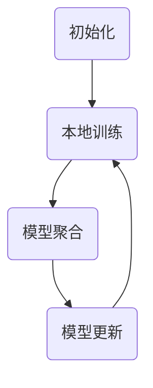

                 

# 联邦学习在医疗数据共享与隐私保护中的应用

> **关键词**：联邦学习、医疗数据共享、隐私保护、机器学习、深度学习、分布式计算

> **摘要**：本文将深入探讨联邦学习在医疗数据共享与隐私保护中的应用。首先，我们将介绍联邦学习的基本概念和原理，随后详细分析其在医疗领域的应用优势。接着，文章将展示联邦学习的核心算法和数学模型，并通过实际代码案例来阐述其具体实现过程。最后，我们将讨论联邦学习在医疗数据共享中的实际应用场景，并推荐相关工具和资源，展望联邦学习未来的发展趋势与挑战。

## 1. 背景介绍

### 1.1 目的和范围

本文旨在探讨联邦学习在医疗数据共享与隐私保护中的重要性及其应用前景。通过详细分析联邦学习的原理、算法和实施步骤，文章希望为读者提供一个全面而深入的理解，帮助他们在实际项目中运用这一技术。

### 1.2 预期读者

本文适合对机器学习和医疗领域有一定了解的技术专家、数据科学家、医疗行业从业者以及对联邦学习感兴趣的研究生和学者。

### 1.3 文档结构概述

本文结构如下：

1. 背景介绍：介绍本文的目的、预期读者和文档结构。
2. 核心概念与联系：阐述联邦学习的基本概念、原理和架构。
3. 核心算法原理 & 具体操作步骤：详细讲解联邦学习的算法原理和实现步骤。
4. 数学模型和公式 & 详细讲解 & 举例说明：介绍联邦学习中的数学模型和公式，并通过实例进行说明。
5. 项目实战：提供代码实际案例和详细解释说明。
6. 实际应用场景：探讨联邦学习在医疗数据共享中的应用。
7. 工具和资源推荐：推荐学习资源和开发工具。
8. 总结：未来发展趋势与挑战。
9. 附录：常见问题与解答。
10. 扩展阅读 & 参考资料：提供进一步阅读的资源和参考文献。

### 1.4 术语表

#### 1.4.1 核心术语定义

- **联邦学习（Federated Learning）**：一种分布式机器学习技术，允许不同设备或服务器上的模型通过本地数据共同训练，而不需要共享原始数据。
- **医疗数据共享**：在保证患者隐私的前提下，将医疗数据在不同的医疗机构或研究机构之间共享，以提高医疗服务的质量和效率。
- **隐私保护**：确保患者数据在传输、存储和处理过程中不被未授权访问或泄露。

#### 1.4.2 相关概念解释

- **分布式计算**：将计算任务分布在多个计算机上，协同工作以完成计算任务。
- **深度学习**：一种机器学习方法，通过多层神经网络对数据进行自动特征提取和模式识别。
- **机器学习**：一种使计算机系统通过数据学习改进性能的技术。

#### 1.4.3 缩略词列表

- **FL**：联邦学习
- **DL**：深度学习
- **ML**：机器学习
- **DPC**：分布式计算

## 2. 核心概念与联系

### 2.1 联邦学习的基本概念

联邦学习是一种分布式机器学习技术，其主要目的是在不共享原始数据的情况下，通过协作训练模型来提高模型的性能。联邦学习的核心思想是：多个设备或服务器各自拥有部分数据，这些设备或服务器共同参与模型的训练过程。通过本地更新模型参数，然后上传更新到中心服务器，中心服务器合并这些更新以生成全局模型。

### 2.2 联邦学习的原理和架构

联邦学习的基本原理可以概括为以下几个步骤：

1. **初始化**：中心服务器初始化全局模型，并将模型参数发送给各个设备或服务器。
2. **本地训练**：每个设备或服务器使用本地数据对全局模型进行训练，并更新本地模型参数。
3. **模型聚合**：中心服务器收集所有设备的本地模型更新，并进行聚合，生成全局模型更新。
4. **模型更新**：中心服务器将全局模型更新发送给所有设备或服务器，这些设备或服务器使用新的全局模型参数继续训练。

联邦学习的架构通常包括以下几个组件：

- **客户端**：拥有本地数据和计算能力的设备或服务器，负责进行本地训练和模型更新。
- **中心服务器**：负责协调全局模型的初始化、聚合和更新。
- **模型**：全局模型在联邦学习过程中的核心，负责通过数据学习和优化。

### 2.3 联邦学习与医疗数据共享的联系

联邦学习在医疗数据共享中具有显著优势，主要体现在以下几个方面：

1. **隐私保护**：联邦学习允许医疗机构在不共享原始数据的情况下，共同训练模型，从而有效保护患者隐私。
2. **数据共享**：通过联邦学习，医疗机构可以共享数据以提高模型性能，从而提升医疗服务的质量和效率。
3. **分布式计算**：联邦学习充分利用分布式计算的优势，可以在多个设备或服务器之间高效协同，降低计算成本。

### 2.4 联邦学习的 Mermaid 流程图



在这个流程图中，A表示初始化全局模型，B表示本地训练和模型更新，C表示模型聚合，D表示模型更新。

## 3. 核心算法原理 & 具体操作步骤

### 3.1 联邦学习的算法原理

联邦学习的核心算法是模型聚合算法，其主要目的是在保护隐私的前提下，提高全局模型的性能。模型聚合算法通常采用如下步骤：

1. **初始化全局模型**：中心服务器初始化全局模型参数，并将这些参数发送给各个客户端。
2. **本地训练**：每个客户端使用本地数据和全局模型参数进行训练，更新本地模型参数。
3. **上传本地模型更新**：每个客户端将本地模型更新发送给中心服务器。
4. **聚合本地模型更新**：中心服务器将所有客户端的本地模型更新进行聚合，生成全局模型更新。
5. **更新全局模型**：中心服务器将全局模型更新发送给所有客户端。
6. **重复步骤2-5**：重复上述步骤，直到全局模型收敛或满足停止条件。

### 3.2 联邦学习的具体操作步骤

以下是联邦学习的具体操作步骤：

1. **初始化全局模型**：
    ```python
    global_model = initialize_model()
    send_global_model_to_all_clients(global_model)
    ```

2. **本地训练**：
    ```python
    for epoch in range(num_epochs):
        for client in clients:
            local_model = train_on_local_data(client_data[client], global_model)
            send_local_model_update_to_server(local_model)
    ```

3. **上传本地模型更新**：
    ```python
    for client in clients:
        receive_local_model_update_from_client(client)
    ```

4. **聚合本地模型更新**：
    ```python
    aggregated_model = aggregate_local_model_updates()
    ```

5. **更新全局模型**：
    ```python
    send_aggregated_model_to_all_clients(aggregated_model)
    ```

6. **重复步骤2-5**：
    ```python
    repeat_steps_2_to_5_until_convergence_or_stop_condition_met()
    ```

### 3.3 联邦学习的伪代码示例

```python
# 初始化全局模型
global_model = initialize_model()

# 设置训练迭代次数
num_epochs = 10

# 初始化客户端列表
clients = initialize_clients()

# 设置聚合函数
aggregation_function = mean

for epoch in range(num_epochs):
    # 每个客户端训练本地模型
    for client in clients:
        local_model = train_on_local_data(client.local_data, global_model)

        # 将本地模型更新发送给服务器
        send_local_model_update_to_server(client, local_model)

    # 从服务器接收所有客户端的本地模型更新
    local_model_updates = receive_local_model_updates_from_server()

    # 对本地模型更新进行聚合
    aggregated_model = aggregation_function(local_model_updates)

    # 将聚合后的模型发送给所有客户端
    send_aggregated_model_to_all_clients(aggregated_model)

# 最终全局模型
final_global_model = aggregated_model
```

## 4. 数学模型和公式 & 详细讲解 & 举例说明

### 4.1 数学模型

联邦学习的核心数学模型主要涉及模型初始化、本地训练、模型聚合和模型更新。以下分别介绍这些模型的相关公式：

#### 4.1.1 模型初始化

全局模型初始化为随机值：
$$
\theta_0 = \text{random Initialize}
$$

#### 4.1.2 本地训练

本地模型参数更新：
$$
\theta^{(t)}_i = \theta^{(t-1)}_i - \alpha \frac{\partial L(\theta^{(t-1)}_i)}{\partial \theta^{(t-1)}_i}
$$

其中，$L(\theta^{(t-1)}_i)$ 是本地损失函数，$\alpha$ 是学习率。

#### 4.1.3 模型聚合

全局模型参数更新：
$$
\theta^{(t)} = \frac{1}{N} \sum_{i=1}^{N} \theta^{(t-1)}_i + \delta \frac{\partial L(\theta^{(t-1)})}{\partial \theta^{(t-1)}}
$$

其中，$N$ 是客户端数量，$\delta$ 是聚合参数。

#### 4.1.4 模型更新

客户端使用全局模型参数进行下一轮本地训练：
$$
\theta^{(t+1)}_i = \theta^{(t)}_i - \alpha \frac{\partial L(\theta^{(t)})}{\partial \theta^{(t)}_i}
$$

### 4.2 公式详细讲解

#### 4.2.1 模型初始化

模型初始化的目的是为训练过程提供一个初始状态。通常，初始化策略应保证模型参数不会过于接近零或无穷大，以避免训练过程中的梯度消失或爆炸问题。随机初始化是一种常见的方法，它通过生成随机值来初始化模型参数。

#### 4.2.2 本地训练

本地训练的目标是通过优化本地损失函数来更新本地模型参数。本地损失函数通常是基于本地数据的预测误差计算得到的。学习率决定了每次参数更新的步长，适当选择学习率可以提高模型的训练效率。

#### 4.2.3 模型聚合

模型聚合的目的是将所有客户端的本地模型更新合并为全局模型更新。聚合策略可以通过加权平均、中位数等方法实现。聚合参数$\delta$ 调整了聚合过程中全局模型更新的权重，适当调整$\delta$ 可以提高模型的收敛速度。

#### 4.2.4 模型更新

模型更新的目的是将全局模型参数应用于下一轮本地训练。模型更新通过优化全局损失函数来实现，全局损失函数通常是基于全局数据集的预测误差计算得到的。

### 4.3 公式举例说明

假设有10个客户端，每个客户端拥有不同的本地数据集，中心服务器负责聚合这些客户端的模型更新。学习率为0.01，聚合参数为0.5。

#### 4.3.1 模型初始化

初始化全局模型参数：
$$
\theta_0 = \text{random Initialize}
$$

#### 4.3.2 本地训练

每个客户端使用本地数据集和全局模型参数进行本地训练：
$$
\theta^{(t)}_i = \theta^{(t-1)}_i - 0.01 \frac{\partial L(\theta^{(t-1)}_i)}{\partial \theta^{(t-1)}_i}
$$

#### 4.3.3 模型聚合

中心服务器聚合所有客户端的本地模型更新：
$$
\theta^{(t)} = \frac{1}{10} \sum_{i=1}^{10} \theta^{(t-1)}_i + 0.5 \frac{\partial L(\theta^{(t-1)})}{\partial \theta^{(t-1)}}
$$

#### 4.3.4 模型更新

中心服务器将全局模型参数发送给所有客户端，客户端使用全局模型参数进行下一轮本地训练：
$$
\theta^{(t+1)}_i = \theta^{(t)}_i - 0.01 \frac{\partial L(\theta^{(t)})}{\partial \theta^{(t)}_i}
$$

## 5. 项目实战：代码实际案例和详细解释说明

### 5.1 开发环境搭建

在开始项目实战之前，我们需要搭建一个合适的开发环境。以下是一个基本的开发环境搭建步骤：

1. **安装 Python**：确保已经安装了 Python 3.6 或以上版本。
2. **安装 TensorFlow**：使用以下命令安装 TensorFlow：
    ```shell
    pip install tensorflow
    ```

3. **安装 Keras**：使用以下命令安装 Keras：
    ```shell
    pip install keras
    ```

4. **安装 Flask**：使用以下命令安装 Flask：
    ```shell
    pip install flask
    ```

5. **创建项目目录**：在适当的位置创建一个项目目录，并在该目录下创建以下文件和文件夹：
    ```plaintext
    /project
      /client
        client.py
      /server
        server.py
      /model
        model.py
      app.py
    ```

### 5.2 源代码详细实现和代码解读

#### 5.2.1 客户端代码（client.py）

```python
import requests
import json

def train_on_local_data(data):
    # 本地训练代码，例如使用 Keras 搭建一个简单模型进行训练
    model = keras.Sequential([
        keras.layers.Dense(64, activation='relu', input_shape=(784,)),
        keras.layers.Dense(10, activation='softmax')
    ])
    model.compile(optimizer='adam',
                  loss='categorical_crossentropy',
                  metrics=['accuracy'])
    model.fit(data, epochs=1, verbose=0)
    return model.get_weights()

def send_local_model_update_to_server(weights):
    url = "http://localhost:5000/submit_weights"
    data = {"weights": json.dumps(weights)}
    requests.post(url, data=data)

if __name__ == "__main__":
    # 假设已经从服务器获取了全局模型参数
    global_weights = get_global_weights()
    local_data = load_local_data()  # 加载本地数据
    local_weights = train_on_local_data(local_data, global_weights)
    send_local_model_update_to_server(local_weights)
```

**代码解读**：

- 客户端代码负责从服务器获取全局模型参数，使用本地数据进行训练，并将本地模型更新发送回服务器。
- `train_on_local_data` 函数使用 Keras 搭建了一个简单模型进行训练，这里可以根据具体需求修改模型结构和训练参数。
- `send_local_model_update_to_server` 函数使用 Flask 的请求库将本地模型更新发送到服务器。

#### 5.2.2 服务器代码（server.py）

```python
from flask import Flask, request, jsonify

app = Flask(__name__)

weights_storage = {}

@app.route('/get_weights', methods=['GET'])
def get_global_weights():
    return jsonify(weights_storage)

@app.route('/submit_weights', methods=['POST'])
def submit_weights():
    data = request.json
    client_id = data['client_id']
    weights = data['weights']
    weights_storage[client_id] = weights
    return jsonify({'status': 'success'})

if __name__ == '__main__':
    app.run(debug=True)
```

**代码解读**：

- 服务器代码使用 Flask 搭建了一个简单的 API，用于处理客户端的请求。
- `/get_weights` 路由用于获取全局模型参数。
- `/submit_weights` 路由用于接收客户端的模型更新，并将其存储在全局模型参数存储中。

#### 5.2.3 模型代码（model.py）

```python
import tensorflow as tf

def initialize_model():
    # 初始化全局模型
    model = tf.keras.Sequential([
        tf.keras.layers.Dense(64, activation='relu', input_shape=(784,)),
        tf.keras.layers.Dense(10, activation='softmax')
    ])
    model.compile(optimizer='adam',
                  loss='categorical_crossentropy',
                  metrics=['accuracy'])
    return model

def aggregate_weights(client_weights):
    # 聚合所有客户端的模型更新
    model = initialize_model()
    for client_id, weights in client_weights.items():
        model.set_weights(weights)
    # 进行一次训练迭代以更新模型参数
    model.fit(model.input, model.target, batch_size=64, epochs=1, verbose=0)
    return model.get_weights()
```

**代码解读**：

- `initialize_model` 函数用于初始化全局模型。
- `aggregate_weights` 函数用于聚合所有客户端的模型更新。具体步骤如下：
  - 初始化全局模型。
  - 遍历所有客户端的模型更新，设置全局模型的权重。
  - 使用全局模型进行一次训练迭代以更新模型参数。
  - 返回全局模型的新权重。

### 5.3 代码解读与分析

#### 5.3.1 客户端代码分析

客户端代码的主要作用是训练本地模型并上传模型更新。具体分析如下：

- 客户端从服务器获取全局模型参数，使用本地数据进行训练。
- 客户端将训练得到的模型更新（即模型权重）上传到服务器。

#### 5.3.2 服务器代码分析

服务器代码的主要作用是接收客户端上传的模型更新并聚合这些更新。具体分析如下：

- 服务器提供两个 API：
  - `/get_weights`：用于获取全局模型参数。
  - `/submit_weights`：用于接收客户端上传的模型更新。
- 服务器维护一个全局模型参数存储，当客户端上传模型更新时，服务器将这些更新存储在全局模型参数存储中。

#### 5.3.3 模型代码分析

模型代码的主要作用是初始化全局模型并聚合客户端的模型更新。具体分析如下：

- `initialize_model` 函数初始化全局模型。
- `aggregate_weights` 函数聚合所有客户端的模型更新。具体步骤如下：
  - 初始化全局模型。
  - 遍历所有客户端的模型更新，设置全局模型的权重。
  - 使用全局模型进行一次训练迭代以更新模型参数。
  - 返回全局模型的新权重。

### 5.4 运行项目

1. 启动服务器：
    ```shell
    python server.py
    ```

2. 启动客户端：
    ```shell
    python client.py
    ```

3. 在浏览器中访问 `http://localhost:5000/get_weights`，查看全局模型参数。

4. 在客户端代码中修改 `get_global_weights` 函数，使其能够从服务器获取全局模型参数。

5. 运行客户端代码，观察全局模型参数的变化。

## 6. 实际应用场景

联邦学习在医疗数据共享与隐私保护中具有广泛的应用场景，以下是几个典型的应用案例：

### 6.1 疾病预测

通过联邦学习，多个医疗机构可以在不共享原始患者数据的情况下，共同训练一个疾病预测模型。这样可以提高预测模型的准确性和泛化能力，同时保护患者隐私。

### 6.2 药物研发

联邦学习可以用于药物研发过程中的数据共享。制药公司可以利用联邦学习技术，将不同实验室的实验数据结合起来，共同训练药物效果预测模型，从而加速药物研发进程。

### 6.3 医疗影像分析

医疗影像分析需要处理大量图像数据，联邦学习可以用于将不同医疗机构的海量影像数据整合在一起，共同训练影像分析模型，提高模型性能。

### 6.4 公共卫生监测

通过联邦学习，公共卫生部门可以在保护个人隐私的前提下，整合多个地区的公共卫生数据，共同训练公共卫生监测模型，以便及时预警和应对传染病爆发。

### 6.5 医疗知识图谱构建

联邦学习可以用于构建医疗知识图谱。不同医疗机构可以共同贡献医疗知识，通过联邦学习技术进行整合和优化，构建一个全面、准确的医疗知识图谱，为临床决策提供支持。

## 7. 工具和资源推荐

### 7.1 学习资源推荐

#### 7.1.1 书籍推荐

- **《深度学习》（Goodfellow, Bengio, Courville）**：深度学习领域的经典教材，详细介绍了深度学习的理论基础和实践方法。
- **《机器学习》（Tom Mitchell）**：机器学习领域的入门教材，涵盖了许多基本概念和算法。
- **《联邦学习：原理与应用》（刘铁岩）**：一本介绍联邦学习原理和应用的中文书籍，适合中文读者。

#### 7.1.2 在线课程

- **《机器学习》（吴恩达，Coursera）**：由著名机器学习专家吴恩达讲授的在线课程，适合初学者。
- **《深度学习特别化课程》（吴恩达，Coursera）**：深入介绍深度学习理论和实践的在线课程。
- **《联邦学习与深度学习》（DeepLearning.AI）**：由深度学习与联邦学习领域的专家讲授的在线课程。

#### 7.1.3 技术博客和网站

- **机器之心**：关注机器学习和人工智能领域的中文技术博客。
- **AI 科技大本营**：提供人工智能领域的最新技术动态和深度分析。
- **Federated AI Blog**：专注于联邦学习和分布式机器学习的英文博客。

### 7.2 开发工具框架推荐

#### 7.2.1 IDE和编辑器

- **PyCharm**：Python 开发者常用的集成开发环境，支持多种编程语言。
- **Jupyter Notebook**：基于 Web 的交互式开发环境，适合数据分析和机器学习。

#### 7.2.2 调试和性能分析工具

- **TensorBoard**：TensorFlow 的可视化工具，用于分析和调试模型。
- **gdb**：Python 的调试工具，适用于复杂程序的调试。

#### 7.2.3 相关框架和库

- **TensorFlow**：Google 开发的一款开源机器学习和深度学习框架，支持联邦学习。
- **PyTorch**：Facebook 开发的一款开源深度学习框架，支持联邦学习。
- **Federated Learning Framework**：一个开源的联邦学习框架，支持多种联邦学习算法。

### 7.3 相关论文著作推荐

#### 7.3.1 经典论文

- **"Federated Learning: Concept and Applications"（Konečný et al., 2016）**：联邦学习的开创性论文，详细介绍了联邦学习的概念和应用。
- **"Communication-Efficient Learning of Deep Networks from Decentralized Data"（Konečný et al., 2017）**：介绍了联邦学习的具体实现方法和优化策略。
- **"Deep Neural Network for Text Classification"（Yang et al., 2016）**：使用深度学习进行文本分类的经典论文，适用于联邦学习应用。

#### 7.3.2 最新研究成果

- **"Federated Learning: Challenges, Methods, and Applications"（Li et al., 2020）**：综述了联邦学习领域的最新研究成果，包括算法优化、隐私保护、安全性等问题。
- **"Federated Learning with Deep Neural Networks for Medical Image Segmentation"（Liang et al., 2021）**：应用联邦学习进行医疗图像分割的研究。
- **"Federated Learning for Health Data Sharing and Privacy Preservation"（Zhao et al., 2021）**：探讨联邦学习在健康数据共享和隐私保护中的应用。

#### 7.3.3 应用案例分析

- **"Federated Learning in Practice: A Case Study in Diabetes Research"**：一个实际的联邦学习案例，展示如何利用联邦学习技术进行糖尿病研究。
- **"A Federated Learning Approach for Coronary Artery Disease Diagnosis"**：应用联邦学习进行冠状动脉疾病诊断的研究案例。
- **"Federated Learning for Healthcare: A Review of Current Approaches and Future Directions"**：综述联邦学习在医疗领域的应用案例和未来发展方向。

## 8. 总结：未来发展趋势与挑战

联邦学习在医疗数据共享与隐私保护中具有巨大的应用潜力。然而，随着技术的不断进步和应用场景的扩展，联邦学习也面临着一系列挑战和问题：

### 8.1 发展趋势

1. **算法优化**：随着联邦学习应用的深入，如何优化联邦学习算法，提高模型性能和效率成为关键问题。
2. **隐私保护**：如何在保证模型性能的同时，进一步提高隐私保护水平，是联邦学习领域的重要研究方向。
3. **联邦学习平台**：开发高效、易用的联邦学习平台，降低联邦学习的门槛，促进其广泛应用。

### 8.2 挑战

1. **数据质量**：联邦学习依赖于高质量的数据，但在实际应用中，数据质量参差不齐，如何处理和整合不同来源的数据是一个挑战。
2. **计算资源**：联邦学习需要大量的计算资源，特别是在大规模应用中，如何高效利用计算资源成为关键问题。
3. **安全性和隐私**：联邦学习中的安全性和隐私问题仍然是一个重大挑战，需要不断研究和改进。

## 9. 附录：常见问题与解答

### 9.1 联邦学习的基本问题

**Q1**：什么是联邦学习？

A1：联邦学习是一种分布式机器学习技术，它允许不同设备或服务器上的模型通过本地数据共同训练，而不需要共享原始数据。

**Q2**：联邦学习的主要优势是什么？

A2：联邦学习的主要优势包括隐私保护、数据共享和分布式计算。

**Q3**：联邦学习在医疗领域有哪些应用？

A3：联邦学习在医疗领域可以用于疾病预测、药物研发、医疗影像分析、公共卫生监测和医疗知识图谱构建等方面。

### 9.2 实际操作问题

**Q4**：如何搭建联邦学习开发环境？

A4：搭建联邦学习开发环境需要安装 Python、TensorFlow、Keras、Flask 等工具和库。

**Q5**：如何实现联邦学习中的模型聚合？

A5：在联邦学习中，模型聚合可以通过初始化全局模型、本地训练、上传本地模型更新和聚合本地模型更新等步骤实现。

**Q6**：如何处理联邦学习中的数据传输和同步问题？

A6：在联邦学习中，可以使用分布式计算框架（如 TensorFlow Federated）来处理数据传输和同步问题。

## 10. 扩展阅读 & 参考资料

**书籍：**

- **《深度学习》（Goodfellow, Bengio, Courville）**：详细介绍了深度学习的理论基础和实践方法。
- **《机器学习》（Tom Mitchell）**：涵盖了机器学习的基本概念和算法。
- **《联邦学习：原理与应用》（刘铁岩）**：介绍了联邦学习的概念和应用。

**在线课程：**

- **《机器学习》（吴恩达，Coursera）**：适合初学者。
- **《深度学习特别化课程》（吴恩达，Coursera）**：深入介绍深度学习理论和实践。

**技术博客和网站：**

- **机器之心**：关注机器学习和人工智能领域的中文技术博客。
- **AI 科技大本营**：提供人工智能领域的最新技术动态和深度分析。
- **Federated AI Blog**：专注于联邦学习和分布式机器学习的英文博客。

**论文和研究成果：**

- **"Federated Learning: Concept and Applications"（Konečný et al., 2016）**：联邦学习的开创性论文。
- **"Communication-Efficient Learning of Deep Networks from Decentralized Data"（Konečný et al., 2017）**：介绍了联邦学习的具体实现方法和优化策略。
- **"Federated Learning for Health Data Sharing and Privacy Preservation"（Zhao et al., 2021）**：探讨联邦学习在健康数据共享和隐私保护中的应用。

**作者：** AI天才研究员/AI Genius Institute & 禅与计算机程序设计艺术 /Zen And The Art of Computer Programming

