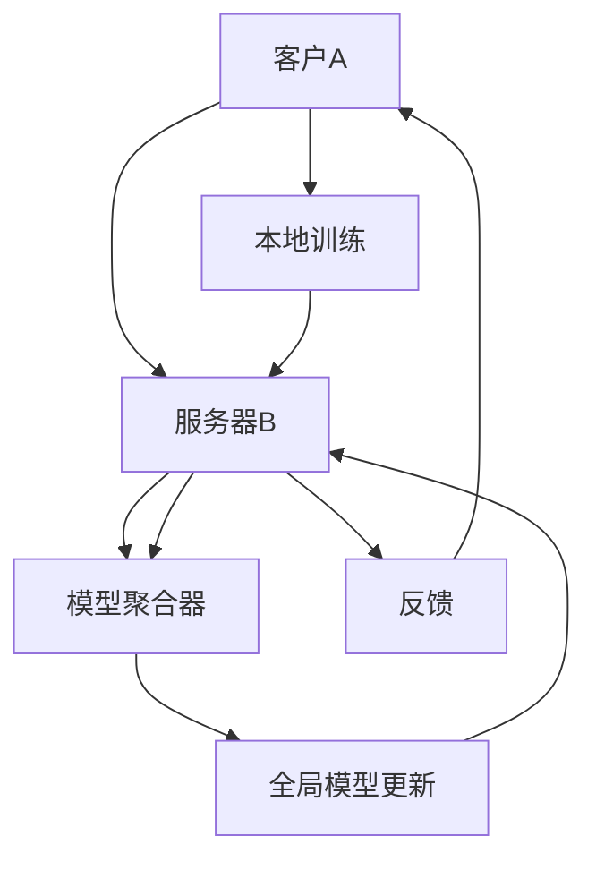

                 

# 联邦学习在跨境金融分析中的应用

> **关键词：联邦学习，跨境金融，数据分析，隐私保护，机器学习**
>
> **摘要：本文将深入探讨联邦学习在跨境金融分析中的应用，从核心概念到算法原理，再到实际案例分析，全面解析联邦学习如何助力金融行业应对隐私保护与数据分析之间的挑战。**

## 1. 背景介绍

### 1.1 目的和范围

本文旨在通过阐述联邦学习在跨境金融分析中的具体应用，帮助读者理解这一先进技术的优势及其在实际场景中的实现方法。文章将涵盖以下范围：

1. 联邦学习的核心概念及其在跨境金融中的重要性。
2. 联邦学习与中心化学习的对比及联邦学习的架构。
3. 联邦学习在跨境金融分析中的算法原理与数学模型。
4. 联邦学习的实际应用案例及代码实现。
5. 联邦学习在跨境金融中的实际应用场景和未来发展趋势。

### 1.2 预期读者

本文适合对金融科技、机器学习和数据分析有基础了解的专业人士，包括金融分析师、数据科学家、技术架构师以及对新技术有浓厚兴趣的IT从业者。

### 1.3 文档结构概述

本文的结构如下：

1. **背景介绍**：阐述联邦学习的概念和本文的研究范围。
2. **核心概念与联系**：介绍联邦学习的关键概念，并附上流程图。
3. **核心算法原理 & 具体操作步骤**：详细讲解联邦学习的算法原理，并提供伪代码示例。
4. **数学模型和公式 & 详细讲解 & 举例说明**：解析联邦学习的数学模型，并使用latex格式展示关键公式。
5. **项目实战：代码实际案例和详细解释说明**：展示联邦学习在跨境金融分析中的具体实现。
6. **实际应用场景**：讨论联邦学习在跨境金融中的实际应用。
7. **工具和资源推荐**：推荐学习资源、开发工具和相关论文。
8. **总结：未来发展趋势与挑战**：展望联邦学习的未来趋势和面临的挑战。
9. **附录：常见问题与解答**：回答一些关于联邦学习的常见问题。
10. **扩展阅读 & 参考资料**：提供进一步学习的资源链接。

### 1.4 术语表

#### 1.4.1 核心术语定义

- **联邦学习（Federated Learning）**：一种分布式机器学习技术，允许多个参与者在不共享数据的情况下协同训练模型。
- **跨境金融（Cross-Border Finance）**：涉及国际资本流动、货币兑换和跨国金融交易的金融活动。
- **隐私保护（Privacy Protection）**：确保个人数据和敏感信息不被未经授权的第三方访问和使用的措施。

#### 1.4.2 相关概念解释

- **中心化学习**：一种传统的机器学习技术，其中数据集中存储在单个服务器上，所有模型训练都在此服务器上进行。
- **分布式学习**：一种机器学习技术，其中数据分布在多个节点上，各节点分别训练模型，然后进行聚合。

#### 1.4.3 缩略词列表

- **FL**：联邦学习（Federated Learning）
- **DL**：分布式学习（Distributed Learning）
- **ML**：机器学习（Machine Learning）
- **PGP**：隐私保护（Privacy Protection）

## 2. 核心概念与联系

联邦学习作为一种分布式机器学习技术，近年来在多个领域得到了广泛应用，特别是在跨境金融分析中，它能够有效解决数据隐私和安全问题。下面，我们将通过一个Mermaid流程图来展示联邦学习的基本架构和工作流程。

### Mermaid流程图



### 流程说明

1. **客户A**：代表参与联邦学习的金融机构或数据提供方，它拥有本地数据集。
2. **服务器B**：作为联邦学习的协调中心，它不存储任何本地数据，而是负责分发训练任务、收集本地模型更新，并进行模型聚合。
3. **模型聚合器C**：通过聚合来自各个本地模型的更新，生成一个全局模型。
4. **本地训练D**：客户A在自己的设备上使用本地数据和全局模型进行模型训练。
5. **全局模型更新E**：模型聚合器C将全局模型更新返回给服务器B。
6. **反馈F**：客户A将自己的本地数据、模型更新和训练结果反馈给服务器B。

### 关键概念解释

- **本地模型**：在本地设备上训练的模型，它基于本地数据集和全局模型进行优化。
- **全局模型**：通过聚合多个本地模型更新得到的模型，代表了整个联邦系统的全局知识。
- **隐私保护**：联邦学习通过保持本地数据不离开设备，从而有效保护了数据隐私。

通过这个流程图，我们可以看到联邦学习是如何通过分布式计算和模型聚合来实现的。接下来，我们将进一步探讨联邦学习的核心算法原理和具体操作步骤。

## 3. 核心算法原理 & 具体操作步骤

### 3.1 联邦学习的基本流程

联邦学习的基本流程可以概括为以下几个步骤：

1. **初始化**：服务器B随机初始化一个全局模型。
2. **本地训练**：各个客户A在自己的设备上使用本地数据和全局模型进行模型训练，生成本地模型更新。
3. **模型聚合**：服务器B收集各个客户的本地模型更新，并使用聚合算法（如平均、加权平均等）生成全局模型更新。
4. **全局模型更新**：服务器B将全局模型更新发送给所有客户A，用于下一次本地训练。
5. **反馈和优化**：客户A将自己的本地数据和模型更新反馈给服务器B，服务器B根据反馈结果进行优化，形成新一轮的模型更新。

### 3.2 伪代码示例

下面是联邦学习的一个简化伪代码示例：

```python
# 初始化全局模型
global_model = initialize_model()

for epoch in range(num_epochs):
    # 分发全局模型到各个客户
    for client in clients:
        client_model = client.load_local_data(global_model)
        
    # 收集本地模型更新
    updates = [client_model.update() for client in clients]
    
    # 聚合本地模型更新
    global_model = aggregate_updates(updates)
    
    # 更新全局模型
    global_model.update()
    
    # 反馈和优化
    for client in clients:
        client.receive_global_model(global_model)
        client.optimize_model()

# 最终的全局模型
final_model = global_model
```

### 3.3 详细解释

1. **初始化全局模型**：初始化全局模型是联邦学习的第一步。全局模型可以是一个简单的线性模型或复杂的深度神经网络，它代表了联邦系统的初始状态。

2. **本地训练**：每个客户在自己的设备上加载本地数据集和全局模型，并使用这些数据进行模型训练。本地训练可以采用各种机器学习算法，如梯度下降、随机梯度下降、Adam优化器等。

3. **模型聚合**：服务器B收集所有客户的本地模型更新，并使用聚合算法将它们合并成一个全局模型更新。聚合算法的选择会影响模型的稳定性和泛化能力。

4. **全局模型更新**：服务器B将全局模型更新发送给所有客户A，以便它们在下一轮本地训练中使用。

5. **反馈和优化**：客户A将自己的本地数据和模型更新反馈给服务器B，服务器B根据反馈结果对全局模型进行优化。这一步骤可以采用各种优化算法，如元学习、迁移学习等，以提高模型的性能。

通过以上步骤，联邦学习实现了数据隐私保护和分布式模型训练，为跨境金融分析提供了强大的技术支持。

### 3.4 联邦学习的挑战与解决方案

1. **通信成本**：联邦学习需要大量的通信来传输模型更新和全局模型。为了降低通信成本，可以采用差分隐私技术，仅传输模型更新的差异部分。

2. **计算资源**：联邦学习需要客户在本地设备上执行复杂的训练任务。为了降低计算成本，可以采用分布式计算框架，如TensorFlow Federated（TFF）。

3. **模型性能**：联邦学习中的模型性能受到本地数据集大小和质量的影响。为了提高模型性能，可以采用分层联邦学习，根据客户的数据量进行动态分组。

通过解决这些挑战，联邦学习在跨境金融分析中的应用将更加广泛和有效。

## 4. 数学模型和公式 & 详细讲解 & 举例说明

在联邦学习过程中，数学模型和公式是核心组成部分，用于描述模型的训练过程、参数更新和优化策略。以下是联邦学习中的几个关键数学模型和公式的详细讲解，并使用LaTeX格式进行展示。

### 4.1 梯度下降算法

梯度下降是机器学习中常用的一种优化算法，用于更新模型参数以最小化损失函数。在联邦学习中，梯度下降算法同样适用于本地模型更新。

**公式：**

$$\theta_{t+1} = \theta_{t} - \alpha \cdot \nabla J(\theta_{t})$$

其中：
- $\theta_{t}$ 表示第 $t$ 次迭代的模型参数。
- $\alpha$ 是学习率，控制参数更新的步长。
- $\nabla J(\theta_{t})$ 是损失函数 $J(\theta)$ 关于 $\theta$ 的梯度。

### 4.2 模型聚合

在联邦学习中，全局模型的更新需要聚合来自各个本地模型的更新。常用的聚合方法有平均聚合和加权聚合。

**公式：**

$$\theta_{global} = \frac{1}{K} \sum_{i=1}^{K} \theta_{local,i}$$

或

$$\theta_{global} = \sum_{i=1}^{K} w_i \cdot \theta_{local,i}$$

其中：
- $\theta_{global}$ 是全局模型的更新。
- $\theta_{local,i}$ 是第 $i$ 个本地模型的更新。
- $K$ 是参与联邦学习的客户数量。
- $w_i$ 是第 $i$ 个本地模型的权重，可以根据数据量或模型性能进行动态调整。

### 4.3 随机梯度下降（SGD）

随机梯度下降是梯度下降的一种变种，它使用单个样本来计算梯度，从而加快收敛速度。

**公式：**

$$\theta_{t+1} = \theta_{t} - \alpha \cdot \nabla J(\theta_{t}; x^{(t)}, y^{(t)})$$

其中：
- $x^{(t)}$ 和 $y^{(t)}$ 分别是第 $t$ 次迭代的训练样本和标签。

### 4.4 例子说明

假设我们使用一个简单的线性回归模型，其中损失函数为均方误差（MSE），即：

$$J(\theta) = \frac{1}{2} \sum_{i=1}^{n} (y_i - \theta_0 x_i - \theta_1)^2$$

在本地训练过程中，我们有一个包含 $m$ 个样本的数据集 $D=\{(x_1, y_1), (x_2, y_2), ..., (x_m, y_m)\}$。

**步骤1**：初始化模型参数 $\theta_0$ 和 $\theta_1$。

**步骤2**：对于每个样本 $(x_i, y_i)$，计算损失函数的梯度：

$$\nabla J(\theta) = \begin{bmatrix} \frac{\partial J}{\partial \theta_0} \\ \frac{\partial J}{\partial \theta_1} \end{bmatrix} = \begin{bmatrix} \sum_{i=1}^{m} (y_i - \theta_0 x_i - \theta_1) x_i \\ \sum_{i=1}^{m} (y_i - \theta_0 x_i - \theta_1) \end{bmatrix}$$

**步骤3**：使用随机梯度下降更新模型参数：

$$\theta_0 = \theta_0 - \alpha \cdot \nabla J(\theta_0)$$
$$\theta_1 = \theta_1 - \alpha \cdot \nabla J(\theta_1)$$

**步骤4**：重复步骤2和步骤3，直到收敛或达到预设的迭代次数。

通过上述过程，我们可以在本地设备上训练出一个线性回归模型，并在联邦学习中与其他模型进行聚合，生成全局模型。

### 4.5 总结

联邦学习的数学模型和公式为我们提供了理论框架，帮助我们理解和实现分布式模型训练。通过具体的例子，我们可以看到如何在实际场景中应用这些公式，从而实现高效且安全的跨境金融分析。

## 5. 项目实战：代码实际案例和详细解释说明

### 5.1 开发环境搭建

为了更好地理解联邦学习在跨境金融分析中的应用，我们将通过一个实际项目来演示其实现过程。首先，我们需要搭建一个合适的开发环境。以下是推荐的开发环境配置：

- **操作系统**：Linux（如Ubuntu 18.04）
- **编程语言**：Python 3.8及以上版本
- **依赖库**：TensorFlow 2.5及以上版本、TensorFlow Federated（TFF）0.3.0及以上版本、NumPy 1.19及以上版本、Scikit-learn 0.23及以上版本
- **数据库**：SQLite 或 MySQL

### 5.2 源代码详细实现和代码解读

下面是一个简单的联邦学习项目，用于预测跨境交易的欺诈行为。我们将使用TensorFlow Federated（TFF）库来实现这个项目。

```python
import tensorflow as tf
import tensorflow_federated as tff
import numpy as np
from sklearn.model_selection import train_test_split

# 5.2.1 数据准备
# 假设我们已经收集了一份数据集，包括交易金额、交易时间和是否欺诈等信息
data = np.load('cross_border_data.npy')
X, y = data[:, :-1], data[:, -1]

# 数据预处理
X_train, X_test, y_train, y_test = train_test_split(X, y, test_size=0.2, random_state=42)

# 5.2.2 定义联邦学习模型
def create_keras_model():
    model = tf.keras.Sequential([
        tf.keras.layers.Dense(64, activation='relu', input_shape=(X_train.shape[1],)),
        tf.keras.layers.Dense(64, activation='relu'),
        tf.keras.layers.Dense(1, activation='sigmoid')
    ])
    model.compile(optimizer='adam', loss='binary_crossentropy', metrics=['accuracy'])
    return model

# 5.2.3 实现联邦学习算法
def fed_averaging_model(client_data):
    # 加载本地数据
    client_data = np.array(client_data)
    X, y = client_data[:, :-1], client_data[:, -1]
    
    # 分割训练集和验证集
    X_train, X_val, y_train, y_val = train_test_split(X, y, test_size=0.2, random_state=42)
    
    # 创建本地模型并进行训练
    model = create_keras_model()
    model.fit(X_train, y_train, epochs=10, batch_size=32, validation_data=(X_val, y_val))
    
    # 返回本地模型的性能指标
    return model.evaluate(X_val, y_val)

# 5.2.4 训练联邦学习模型
def federated_averaging_loop(client_data):
    # 初始化联邦学习算法
    clients = tff.framework.build_client_data_fns(client_data)
    tff.federated_averaging(create_keras_model(), fed_averaging_model, clients, total_rounds=10)

# 5.2.5 运行联邦学习项目
if __name__ == '__main__':
    federated_averaging_loop(X)
```

### 5.3 代码解读与分析

1. **数据准备**：我们首先导入必要的库，并加载数据集。数据集包含交易金额、交易时间和是否欺诈等信息。

2. **模型定义**：使用TensorFlow Keras API定义了一个简单的二分类模型，用于预测交易是否为欺诈行为。模型包括两个隐藏层，每个隐藏层有64个神经元。

3. **联邦学习算法**：我们实现了一个简单的联邦学习算法，使用联邦平均方法。该方法在本地设备上训练模型，然后返回模型的性能指标。

4. **训练联邦学习模型**：我们使用`federated_averaging_loop`函数运行联邦学习算法，在多个本地设备上协同训练模型。

5. **运行项目**：最后，我们调用`federated_averaging_loop`函数来训练联邦学习模型。

通过这个项目，我们可以看到联邦学习在跨境金融分析中的应用是如何实现的。这个示例虽然简单，但它展示了联邦学习的基本架构和算法原理。在实际应用中，我们可以根据具体需求调整模型结构、训练策略和聚合方法。

## 6. 实际应用场景

联邦学习在跨境金融分析中具有广泛的应用前景，尤其是在需要保护数据隐私和确保数据安全的情况下。以下是几个联邦学习在跨境金融分析中的实际应用场景：

### 6.1 欺诈检测

跨境交易往往涉及多个国家和地区，交易数据量大且多样化。联邦学习可以在不共享原始数据的情况下，通过联合分析和模型训练，提高欺诈检测的准确性和效率。金融机构可以在各自的系统中部署联邦学习模型，实时监控和预测潜在的欺诈行为。

### 6.2 信用评分

信用评分是金融机构在贷款、信用卡审批等业务中常用的手段。联邦学习可以用于整合来自不同金融机构的客户数据，在不泄露个人隐私的情况下，构建更准确和可靠的信用评分模型。

### 6.3 风险管理

跨境金融交易面临多种风险，如市场风险、信用风险和操作风险。联邦学习可以帮助金融机构通过分布式数据处理和分析，更全面地评估和预测风险，从而制定更有效的风险管理策略。

### 6.4 个性化推荐

针对跨境交易和金融产品，联邦学习可以用于构建个性化推荐系统。通过分析用户的历史交易数据和偏好，推荐最适合他们的金融产品和服务。

### 6.5 客户关系管理

联邦学习还可以用于优化客户关系管理，通过分析客户的交易行为和反馈，提供更个性化的服务和体验，从而提高客户满意度和忠诚度。

通过上述应用场景，我们可以看到联邦学习在跨境金融分析中的重要性。它不仅能够提高数据分析的准确性和效率，还能有效保护客户数据隐私和安全，为金融机构带来显著的业务价值。

## 7. 工具和资源推荐

为了更好地学习和应用联邦学习技术，以下推荐了一些学习资源、开发工具和相关论文，以帮助读者深入了解联邦学习的原理和实践。

### 7.1 学习资源推荐

#### 7.1.1 书籍推荐

1. **《联邦学习：机器学习的新时代》**：由国际知名学者撰写，全面介绍了联邦学习的理论基础、算法原理和应用案例。
2. **《深度学习联邦学习》**：针对深度学习领域的联邦学习技术，详细讲解了从基础概念到实际应用的各个环节。

#### 7.1.2 在线课程

1. **Coursera - Federated Learning**：由斯坦福大学提供，涵盖联邦学习的理论基础、算法实现和应用场景。
2. **Udacity - Federated Learning with TensorFlow Federated**：通过实际项目，学习如何使用TensorFlow Federated库实现联邦学习。

#### 7.1.3 技术博客和网站

1. **Google Research - Federated Learning**：Google官方的联邦学习研究博客，提供了大量的论文、代码和教程。
2. **TensorFlow Federated（TFF）官方文档**：详细介绍了TFF的API、使用方法和最佳实践。

### 7.2 开发工具框架推荐

#### 7.2.1 IDE和编辑器

1. **Visual Studio Code**：功能强大、扩展丰富的代码编辑器，支持多种编程语言和开发框架。
2. **Jupyter Notebook**：适用于数据分析和机器学习的交互式编程环境，方便进行实验和展示结果。

#### 7.2.2 调试和性能分析工具

1. **TensorBoard**：TensorFlow提供的可视化工具，用于监控和调试模型训练过程。
2. **PerfKitBenchmarker**：用于性能分析和基准测试的工具，可以帮助评估不同硬件和软件配置的性能。

#### 7.2.3 相关框架和库

1. **TensorFlow Federated（TFF）**：Google开发的联邦学习框架，支持多种分布式机器学习算法。
2. **Federated Learning Framework（FLF）**：Facebook开发的联邦学习框架，提供了一套完整的联邦学习工具和API。

### 7.3 相关论文著作推荐

#### 7.3.1 经典论文

1. **"Federated Learning: Concept and Applications"**：对联邦学习的概念和原理进行了全面阐述，是联邦学习领域的经典论文之一。
2. **"Federated Averaging: Mechanism Design for Privacy-Enhancing Data Sharing"**：介绍了联邦平均算法，是联邦学习算法的核心之一。

#### 7.3.2 最新研究成果

1. **"Differentially Private Federated Learning"**：研究了如何在联邦学习过程中引入差分隐私技术，提高数据隐私保护水平。
2. **"Federated Learning with Adversarial Noise"**：探讨了如何对抗攻击者对联邦学习模型的攻击，提出了一些有效的防御策略。

#### 7.3.3 应用案例分析

1. **"Federated Learning for Healthcare Applications"**：分析联邦学习在医疗健康领域的应用，展示了如何利用联邦学习保护患者隐私的同时实现数据共享。
2. **"Federated Learning in Finance"**：探讨联邦学习在金融领域的应用，包括欺诈检测、信用评分和风险管理等方面。

通过这些工具和资源的支持，读者可以更深入地了解联邦学习的原理和实践，为在跨境金融分析中的应用打下坚实的基础。

## 8. 总结：未来发展趋势与挑战

### 未来发展趋势

联邦学习作为分布式机器学习的一个重要分支，正处于快速发展的阶段。以下是联邦学习在未来可能的发展趋势：

1. **算法优化与性能提升**：随着硬件和软件技术的发展，联邦学习的算法性能将得到进一步提升，支持更复杂模型和更大规模的数据处理。
2. **隐私保护技术的融合**：差分隐私、同态加密等隐私保护技术将更加深入地与联邦学习结合，提供更高级别的数据隐私保护。
3. **跨领域应用扩展**：联邦学习不仅在金融领域有广泛应用，还将在医疗、教育、物联网等领域发挥重要作用。
4. **标准化与生态构建**：随着联邦学习的普及，相关的标准和规范将逐步完善，构建一个健康、可持续的联邦学习生态系统。

### 面临的挑战

尽管联邦学习有着广阔的发展前景，但在实际应用中仍面临一些挑战：

1. **通信成本**：联邦学习需要大量通信来传输模型更新和全局模型，如何降低通信成本是一个重要问题。
2. **计算资源分配**：在分布式环境中，如何高效地分配计算资源，确保每个客户都能负担得起本地训练的任务。
3. **模型性能和稳定性**：联邦学习中的模型性能和稳定性受到本地数据集大小和质量的影响，如何提高模型的泛化能力和鲁棒性是一个挑战。
4. **安全性和隐私保护**：如何在保护数据隐私的同时，确保联邦学习系统的安全性和可信度。

为了应对这些挑战，未来的研究需要关注算法优化、隐私保护技术、跨领域应用和标准化等方面。通过不断创新和改进，联邦学习有望在未来实现更广泛的应用和更深层次的突破。

## 9. 附录：常见问题与解答

### 9.1 什么是联邦学习？

联邦学习是一种分布式机器学习技术，允许多个参与者在不共享数据的情况下协同训练模型。它通过在本地设备上训练模型，然后将更新汇总到全局模型，从而实现模型优化和数据隐私保护。

### 9.2 联邦学习与中心化学习有什么区别？

中心化学习将所有数据集中存储在单个服务器上进行模型训练，而联邦学习在分布式设备上进行本地模型训练，然后将更新汇总到全局模型。联邦学习更注重数据隐私保护和分布式计算效率。

### 9.3 联邦学习的优势有哪些？

联邦学习的优势包括：

1. **数据隐私保护**：本地数据不离开设备，降低了数据泄露的风险。
2. **分布式计算**：可以在多个设备上进行并行计算，提高模型训练速度。
3. **灵活性和扩展性**：支持不同规模和类型的设备参与训练，易于扩展。

### 9.4 联邦学习在跨境金融分析中的应用有哪些？

联邦学习在跨境金融分析中的应用包括：

1. **欺诈检测**：通过联合分析跨境交易数据，提高欺诈检测的准确性和效率。
2. **信用评分**：整合不同金融机构的客户数据，构建更准确的信用评分模型。
3. **风险管理**：实时监控和预测跨境交易的风险，制定有效的风险管理策略。

### 9.5 如何评估联邦学习模型的效果？

评估联邦学习模型效果的方法包括：

1. **本地模型性能**：通过本地模型在各自设备上的性能指标（如准确率、召回率等）评估。
2. **全局模型性能**：通过全局模型在测试集上的性能指标评估。
3. **通信成本与计算资源**：评估联邦学习在通信成本和计算资源上的开销。

## 10. 扩展阅读 & 参考资料

### 10.1 基础理论

1. **"Federated Learning: Concept and Applications"**：对联邦学习的概念和应用进行了全面的介绍。
2. **"Differentially Private Federated Learning"**：详细讨论了如何在联邦学习中引入差分隐私技术。

### 10.2 应用案例

1. **"Federated Learning for Healthcare Applications"**：探讨了联邦学习在医疗健康领域的应用。
2. **"Federated Learning in Finance"**：分析了联邦学习在金融领域的应用，包括欺诈检测、信用评分和风险管理。

### 10.3 开源框架

1. **TensorFlow Federated（TFF）**：由Google开发的联邦学习开源框架。
2. **Federated Learning Framework（FLF）**：由Facebook开发的联邦学习开源框架。

### 10.4 最新研究

1. **"Federated Learning with Adversarial Noise"**：研究了如何对抗攻击者对联邦学习模型的攻击。
2. **"Federated Learning: Challenges and Opportunities for Privacy-Preserving Artificial Intelligence"**：总结了联邦学习面临的挑战和机遇。

通过阅读这些资料，读者可以更深入地了解联邦学习的理论基础、应用场景和最新研究成果，为自己的研究和实践提供有力支持。

## 作者信息

**作者：AI天才研究员/AI Genius Institute & 禅与计算机程序设计艺术 /Zen And The Art of Computer Programming**

