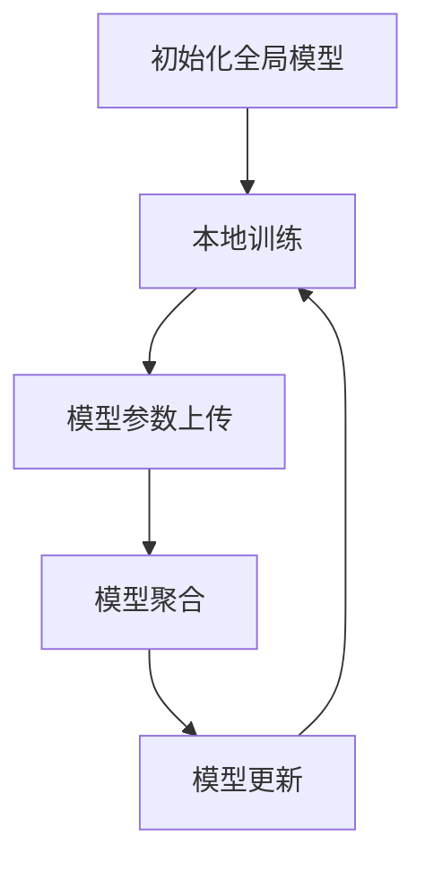

                 

# 联邦学习在跨机构医疗数据分析中的隐私保护

## 关键词
- 联邦学习
- 医疗数据分析
- 隐私保护
- 医疗数据共享
- 加密技术
- 医疗领域应用
- 安全多方计算

## 摘要
本文深入探讨了联邦学习在跨机构医疗数据分析中的隐私保护作用。随着医疗数据的快速增长，如何在不泄露隐私的情况下进行数据分析和共享成为了一个亟待解决的问题。本文首先介绍了联邦学习的概念和原理，然后详细阐述了其在医疗数据分析中的应用，特别是在隐私保护方面的优势。通过具体案例和算法原理的讲解，本文揭示了联邦学习如何实现医疗数据的跨机构安全共享，并展望了其未来的发展趋势与挑战。

---

## 1. 背景介绍

### 1.1 目的和范围

随着医疗信息化进程的加快，医疗数据量的急剧增长为医学研究、公共卫生监测和个性化医疗带来了巨大的机遇。然而，医疗数据具有高度敏感性，包括患者个人信息、医疗记录等，这些数据在共享和利用过程中极易引发隐私泄露风险。因此，如何在确保数据隐私安全的前提下，实现医疗数据的跨机构分析和共享，成为了当前研究的热点和挑战。

本文旨在介绍联邦学习（Federated Learning）这一新兴技术，探讨其在跨机构医疗数据分析中的隐私保护作用。通过分析联邦学习的原理和优势，本文将展示如何利用联邦学习技术实现医疗数据的隐私保护，为医疗行业的可持续发展提供技术支持。

### 1.2 预期读者

本文面向对医疗数据隐私保护和联邦学习技术有一定了解的读者，包括：

1. 医疗信息化从业人员
2. 数据科学家和人工智能研究者
3. 医疗领域的技术决策者和研究者
4. 对联邦学习技术感兴趣的学生和研究人员

### 1.3 文档结构概述

本文结构如下：

1. **背景介绍**：简要介绍联邦学习的概念、目的和重要性。
2. **核心概念与联系**：详细阐述联邦学习的核心概念和原理，并使用Mermaid流程图展示架构。
3. **核心算法原理 & 具体操作步骤**：讲解联邦学习的具体算法原理和操作步骤。
4. **数学模型和公式 & 详细讲解 & 举例说明**：介绍联邦学习的数学模型和相关公式，并通过实例进行说明。
5. **项目实战：代码实际案例和详细解释说明**：展示联邦学习在医疗数据分析中的实际应用，提供代码示例和解释。
6. **实际应用场景**：分析联邦学习在医疗领域的实际应用案例。
7. **工具和资源推荐**：推荐学习资源、开发工具和框架。
8. **总结：未来发展趋势与挑战**：展望联邦学习的未来发展方向和面临的挑战。
9. **附录：常见问题与解答**：解答读者可能遇到的常见问题。
10. **扩展阅读 & 参考资料**：提供进一步阅读的资源和参考文献。

### 1.4 术语表

#### 1.4.1 核心术语定义

- **联邦学习**：一种分布式机器学习技术，通过多个参与者共同训练模型，而无需共享原始数据。
- **隐私保护**：确保数据在传输、存储和使用过程中的安全性，防止隐私泄露。
- **中心化**：数据集中存储在一个中央服务器上，所有参与者都直接访问中央服务器。
- **去中心化**：数据分散存储在多个节点上，不同节点之间通过通信进行协作。
- **加密技术**：使用算法对数据进行加密和解密，保护数据隐私。

#### 1.4.2 相关概念解释

- **梯度**：在机器学习中，梯度表示模型参数对损失函数的偏导数，用于更新模型参数。
- **模型聚合**：将多个参与者的模型参数进行合并，形成全局模型。
- **本地训练**：每个参与者在自己的数据集上独立训练模型。
- **加密算法**：对数据进行加密的算法，如RSA、AES等。

#### 1.4.3 缩略词列表

- **FL**：联邦学习（Federated Learning）
- **ML**：机器学习（Machine Learning）
- **GD**：梯度下降（Gradient Descent）
- **RSA**：非对称加密算法（Rivest-Shamir-Adleman）
- **AES**：对称加密算法（Advanced Encryption Standard）

---

在接下来的章节中，我们将深入探讨联邦学习的核心概念、原理和应用，通过具体的算法和实例，展示其在跨机构医疗数据分析中的隐私保护作用。让我们开始这一技术旅程吧！
<|assistant|>## 2. 核心概念与联系

联邦学习（Federated Learning）是一种分布式机器学习技术，它通过多个参与者（如手机用户、医疗机构等）共同训练一个全局模型，而无需直接共享原始数据。这一技术的主要目标是解决数据隐私保护和数据集中存储的安全问题。在本节中，我们将详细阐述联邦学习的核心概念和原理，并使用Mermaid流程图展示其架构。

### 2.1 核心概念

**联邦学习**由Google在2016年首次提出，其基本思想是：多个参与者在自己的本地设备上独立训练模型，然后将模型参数上传到中央服务器进行聚合，最终形成一个全局模型。这种分布式训练方式可以有效地保护数据隐私，因为它不需要将原始数据传输到中央服务器。

核心概念包括：

- **参与者**：指参与联邦学习过程的实体，如手机用户、医疗机构等。
- **本地训练**：每个参与者在自己的设备上使用本地数据训练模型。
- **模型聚合**：将多个参与者的模型参数进行合并，形成全局模型。
- **加密通信**：为了确保数据传输过程中的安全性，联邦学习通常采用加密技术进行通信。

### 2.2 联邦学习原理

联邦学习的基本原理可以分为以下几个步骤：

1. **初始化全局模型**：在联邦学习开始之前，首先初始化一个全局模型，该模型存储在中央服务器上。
2. **本地训练**：每个参与者在自己的设备上使用本地数据训练模型，并更新模型参数。
3. **模型参数上传**：参与者将更新后的模型参数上传到中央服务器。
4. **模型聚合**：中央服务器将多个参与者的模型参数进行聚合，形成一个新的全局模型。
5. **模型更新**：新的全局模型被下载到每个参与者的设备上，供下一次本地训练使用。

这一过程持续迭代，直到达到预定的训练目标或达到预设的训练次数。

### 2.3 联邦学习架构

联邦学习的架构可以分为三个主要部分：参与者、中央服务器和通信网络。下面是一个简化的Mermaid流程图，展示联邦学习的架构和工作流程。



#### 2.3.1 Mermaid流程图说明

1. **初始化全局模型**：中央服务器初始化一个全局模型，并将该模型分发到所有参与者。
2. **本地训练**：每个参与者在自己的设备上使用本地数据训练模型，并更新模型参数。
3. **模型参数上传**：参与者将更新后的模型参数上传到中央服务器。
4. **模型聚合**：中央服务器将多个参与者的模型参数进行聚合，形成一个新的全局模型。
5. **模型更新**：新的全局模型被下载到每个参与者的设备上，供下一次本地训练使用。

通过上述流程，联邦学习实现了数据隐私保护和高效分布式训练，使得参与者在不共享原始数据的情况下，仍能共同训练一个全局模型。

### 2.4 联邦学习的优势

联邦学习在医疗数据分析中的应用具有以下优势：

1. **隐私保护**：联邦学习通过加密通信和本地训练，有效防止了数据在传输和存储过程中的泄露风险。
2. **去中心化**：联邦学习不需要将数据集中存储在中央服务器上，降低了数据泄露的风险，同时也提高了数据访问的效率。
3. **分布式计算**：联邦学习利用了参与者的计算资源，提高了模型训练的速度和效率。
4. **灵活性**：联邦学习允许参与者动态加入和退出，适应不同的应用场景和需求。

### 2.5 联邦学习的挑战

尽管联邦学习在隐私保护和数据共享方面具有明显优势，但在实际应用中仍面临以下挑战：

1. **通信成本**：联邦学习需要参与者频繁上传和下载模型参数，这可能导致通信成本较高。
2. **同步问题**：参与者的训练进度和结果可能不一致，需要解决同步问题，以确保模型训练的有效性。
3. **数据质量**：参与者的数据质量和多样性可能影响模型性能，需要设计有效的数据预处理和清洗策略。
4. **模型解释性**：联邦学习模型通常较复杂，难以解释其决策过程，影响其在医疗领域的应用。

通过以上分析，我们可以看出联邦学习在跨机构医疗数据分析中具有重要的应用价值，同时也需要解决一系列技术挑战，以实现其潜力的最大化。

### 2.6 联邦学习与集中式学习的比较

**联邦学习**与**集中式学习**是两种不同的机器学习架构。下面是它们的主要区别：

1. **数据存储方式**：
   - **联邦学习**：数据分散存储在多个参与者设备上，无需集中存储。
   - **集中式学习**：数据集中存储在中央服务器上，所有参与者直接访问中央服务器。

2. **计算方式**：
   - **联邦学习**：每个参与者独立训练模型，然后上传模型参数进行聚合。
   - **集中式学习**：所有参与者共同训练一个全局模型，通常在中央服务器上进行。

3. **通信成本**：
   - **联邦学习**：由于数据分散存储，需要频繁上传和下载模型参数，通信成本较高。
   - **集中式学习**：数据集中存储，通信成本较低。

4. **隐私保护**：
   - **联邦学习**：通过加密通信和本地训练，有效防止数据泄露。
   - **集中式学习**：数据集中存储，容易成为攻击目标，存在隐私泄露风险。

5. **去中心化**：
   - **联邦学习**：去中心化架构，参与者独立训练和更新模型，无需依赖中央服务器。
   - **集中式学习**：中心化架构，所有参与者依赖中央服务器进行训练和存储。

通过比较可以看出，联邦学习在数据隐私保护和去中心化方面具有明显优势，但在通信成本和同步问题方面面临挑战。这两种架构各有优缺点，适用于不同的应用场景和需求。在医疗数据分析中，联邦学习因其隐私保护和灵活性，成为了一种理想的选择。

### 2.7 联邦学习的应用领域

联邦学习在多个领域展现出巨大的应用潜力，以下是一些主要的应用领域：

1. **医疗健康**：联邦学习在医疗健康领域具有重要应用价值，如疾病预测、个性化医疗和健康监测。通过联邦学习，不同医疗机构可以在不共享患者数据的情况下，共同训练一个全局模型，提高疾病预测的准确性和个性化医疗的服务水平。

2. **金融**：在金融领域，联邦学习可用于信用评分、欺诈检测和风险控制。金融机构可以通过联邦学习技术，在保护客户隐私的前提下，共同训练一个反欺诈模型，提高欺诈检测的准确性和效率。

3. **零售**：在零售领域，联邦学习可用于客户行为分析、个性化推荐和库存管理。零售商可以通过联邦学习技术，在不共享客户数据的情况下，共同训练一个客户行为分析模型，提高个性化推荐的准确性和库存管理的效率。

4. **物联网**：在物联网领域，联邦学习可用于设备故障预测、能耗管理和网络安全。通过联邦学习技术，不同设备可以在不共享敏感数据的情况下，共同训练一个全局模型，提高设备故障预测的准确性和能耗管理的效率。

5. **自动驾驶**：在自动驾驶领域，联邦学习可用于路况预测、车辆控制和安全监测。自动驾驶公司可以通过联邦学习技术，在不共享路况数据的情况下，共同训练一个路况预测模型，提高自动驾驶的安全性和可靠性。

通过上述应用领域可以看出，联邦学习在各个行业都有广泛的应用前景，特别是在数据隐私保护和分布式计算方面，具有显著的优势。

### 2.8 联邦学习的核心概念与联系总结

在本节中，我们介绍了联邦学习的核心概念、原理和架构，并通过Mermaid流程图展示了联邦学习的工作流程。联邦学习通过分散存储和本地训练，实现了数据隐私保护和高效分布式计算。在医疗数据分析中，联邦学习通过保护患者隐私，促进了医疗数据的跨机构共享和合作。

联邦学习与集中式学习相比，具有明显的隐私保护和去中心化优势，但同时也面临通信成本和同步问题的挑战。通过了解联邦学习的核心概念和联系，我们可以更好地把握其在医疗数据分析中的应用潜力和挑战。

在接下来的章节中，我们将进一步探讨联邦学习的核心算法原理、数学模型和实际应用案例，深入分析其在医疗数据分析中的隐私保护作用。让我们继续这一技术旅程，探索联邦学习的更多奥秘吧！
<|assistant|>## 3. 核心算法原理 & 具体操作步骤

联邦学习作为一项分布式机器学习技术，其核心算法原理主要依赖于模型参数的本地训练和聚合。在本节中，我们将详细讲解联邦学习的核心算法原理，并使用伪代码来阐述具体的操作步骤。通过这一讲解，我们将了解联邦学习如何在不泄露隐私的情况下，实现跨机构的医疗数据分析。

### 3.1 联邦学习算法原理

联邦学习算法原理主要包括以下几个关键步骤：

1. **初始化全局模型**：在联邦学习开始之前，中央服务器初始化一个全局模型，并将该模型参数分发到所有参与者。
2. **本地训练**：每个参与者在自己的设备上使用本地数据训练模型，并更新模型参数。
3. **模型参数上传**：参与者将更新后的模型参数上传到中央服务器。
4. **模型聚合**：中央服务器将多个参与者的模型参数进行聚合，形成一个新的全局模型。
5. **模型更新**：新的全局模型被下载到每个参与者的设备上，供下一次本地训练使用。

通过不断迭代上述步骤，最终形成一个全局最优模型。下面我们将通过伪代码展示这一过程。

### 3.2 联邦学习伪代码

```python
# 初始化全局模型
global_model = initialize_global_model()

# 联邦学习迭代过程
for epoch in range(num_epochs):
    # 本地训练
    for participant in participants:
        local_data = get_local_data(participant)
        updated_model = local_training(local_data, global_model)

    # 模型参数上传
    updated_models = upload_model_params(participants)

    # 模型聚合
    aggregated_model = aggregate_models(updated_models)

    # 模型更新
    global_model = aggregated_model
    update_global_model(global_model)

# 最终全局模型
return global_model
```

### 3.3 详细步骤解释

1. **初始化全局模型**：
   ```python
   global_model = initialize_global_model()
   ```
   中央服务器初始化一个全局模型，该模型通常包含模型参数和损失函数。初始化步骤包括随机初始化模型参数，并设置损失函数，如均方误差（MSE）。

2. **本地训练**：
   ```python
   updated_model = local_training(local_data, global_model)
   ```
   每个参与者使用本地数据集和全局模型参数进行本地训练。本地训练过程通常采用梯度下降（Gradient Descent）或其他优化算法，以最小化损失函数。本地训练结束后，参与者更新模型参数。

3. **模型参数上传**：
   ```python
   updated_models = upload_model_params(participants)
   ```
   参与者将更新后的模型参数上传到中央服务器。上传过程通常涉及加密通信，以确保数据在传输过程中的安全性。

4. **模型聚合**：
   ```python
   aggregated_model = aggregate_models(updated_models)
   ```
   中央服务器接收所有参与者的模型参数，并使用聚合算法（如加权平均）合并这些模型参数，形成一个新的全局模型。聚合算法的选择会影响全局模型的性能和稳定性。

5. **模型更新**：
   ```python
   global_model = aggregated_model
   update_global_model(global_model)
   ```
   新的全局模型被下载到每个参与者的设备上，供下一次本地训练使用。这一步骤确保了全局模型的持续迭代和优化。

### 3.4 联邦学习的具体操作步骤

在实际应用中，联邦学习操作步骤如下：

1. **数据准备**：收集和整理参与者的本地数据集，并进行预处理（如归一化、去噪等）。
2. **模型初始化**：在中央服务器上初始化全局模型，并将模型参数分发到所有参与者。
3. **本地训练**：每个参与者在自己的设备上使用本地数据进行本地训练，更新模型参数。
4. **模型参数上传**：参与者将更新后的模型参数上传到中央服务器。
5. **模型聚合**：中央服务器接收所有参与者的模型参数，并进行聚合，形成新的全局模型。
6. **模型更新**：新的全局模型被下载到每个参与者的设备上，供下一次本地训练使用。
7. **迭代训练**：重复上述步骤，直到达到预定的训练目标或训练次数。

通过上述操作步骤，联邦学习实现了全局模型的持续迭代和优化，同时保护了参与者的数据隐私。

### 3.5 联邦学习算法的优点

联邦学习算法具有以下优点：

1. **隐私保护**：通过本地训练和加密通信，联邦学习有效防止了数据在传输和存储过程中的泄露风险。
2. **去中心化**：联邦学习不需要将数据集中存储在中央服务器上，降低了数据泄露的风险，同时也提高了数据访问的效率。
3. **分布式计算**：联邦学习利用了参与者的计算资源，提高了模型训练的速度和效率。
4. **灵活性**：联邦学习允许参与者动态加入和退出，适应不同的应用场景和需求。

### 3.6 联邦学习的挑战

尽管联邦学习具有上述优点，但在实际应用中仍面临以下挑战：

1. **通信成本**：联邦学习需要参与者频繁上传和下载模型参数，这可能导致通信成本较高。
2. **同步问题**：参与者的训练进度和结果可能不一致，需要解决同步问题，以确保模型训练的有效性。
3. **数据质量**：参与者的数据质量和多样性可能影响模型性能，需要设计有效的数据预处理和清洗策略。
4. **模型解释性**：联邦学习模型通常较复杂，难以解释其决策过程，影响其在医疗领域的应用。

通过以上分析，我们可以看到联邦学习在医疗数据分析中具有重要的应用价值，同时也需要解决一系列技术挑战，以实现其潜力的最大化。

### 3.7 总结

在本节中，我们详细讲解了联邦学习的核心算法原理和具体操作步骤。通过伪代码的展示，我们了解了联邦学习如何在不泄露隐私的情况下，实现跨机构的医疗数据分析。联邦学习通过分散存储和本地训练，实现了数据隐私保护和高效分布式计算。然而，在实际应用中，联邦学习仍面临通信成本、同步问题、数据质量等挑战，需要进一步研究解决。

在下一节中，我们将深入探讨联邦学习的数学模型和公式，并通过实例进行详细讲解，以进一步理解联邦学习在医疗数据分析中的应用。让我们继续这一技术旅程，探索联邦学习的更多奥秘！
<|assistant|>## 4. 数学模型和公式 & 详细讲解 & 举例说明

在联邦学习中，数学模型和公式扮演着至关重要的角色，它们确保了模型参数的更新和聚合过程能够在保证隐私的同时，提高全局模型的性能。本节将详细讲解联邦学习的数学模型和公式，并使用具体的实例进行说明，帮助读者更好地理解这一技术。

### 4.1 联邦学习数学模型

联邦学习中的数学模型主要涉及以下几个关键部分：

1. **模型参数更新**：每个参与者根据本地数据和全局模型参数进行本地训练，更新模型参数。
2. **模型参数聚合**：中央服务器将多个参与者的模型参数进行聚合，形成新的全局模型。
3. **模型损失函数**：用于评估全局模型在训练数据上的性能，指导模型参数的更新和聚合。

#### 4.1.1 模型参数更新

假设全局模型由参数 \( \theta \) 表示，每个参与者的本地模型参数为 \( \theta_i \)。在本地训练过程中，参与者使用本地数据集 \( D_i \) 和当前全局模型参数 \( \theta \) 更新本地模型参数 \( \theta_i \)。更新过程通常采用梯度下降（Gradient Descent）算法，其公式如下：

$$
\theta_i \leftarrow \theta_i - \alpha \cdot \nabla_{\theta_i} L(\theta_i; D_i)
$$

其中，\( \alpha \) 为学习率，\( L(\theta_i; D_i) \) 为损失函数，表示全局模型在本地数据上的性能。

#### 4.1.2 模型参数聚合

在联邦学习中，中央服务器需要将多个参与者的模型参数进行聚合，形成新的全局模型参数 \( \theta \)。聚合过程通常采用加权平均（Weighted Average）算法，其公式如下：

$$
\theta = \frac{1}{N} \sum_{i=1}^{N} \theta_i
$$

其中，\( N \) 为参与者的数量，\( \theta_i \) 为参与者的本地模型参数。

#### 4.1.3 模型损失函数

模型损失函数用于评估全局模型在训练数据上的性能，指导模型参数的更新和聚合。常用的损失函数包括均方误差（MSE）、交叉熵损失（Cross-Entropy Loss）等。以均方误差为例，其公式如下：

$$
L(\theta; D) = \frac{1}{m} \sum_{i=1}^{m} (\hat{y}_i - y_i)^2
$$

其中，\( m \) 为训练数据样本数量，\( \hat{y}_i \) 为预测值，\( y_i \) 为真实值。

### 4.2 联邦学习公式实例

为了更好地理解联邦学习的数学模型，我们通过一个具体的实例进行说明。

#### 4.2.1 实例背景

假设有10个参与者，每个参与者拥有一个本地数据集，数据集大小分别为10, 20, 30, ..., 100个样本。全局模型是一个线性回归模型，目标是最小化均方误差。

#### 4.2.2 初始化全局模型

初始化全局模型参数 \( \theta \) 为：

$$
\theta = [0, 0]
$$

#### 4.2.3 本地训练

第一个参与者的本地数据集 \( D_1 \) 包含10个样本，使用梯度下降算法更新模型参数：

$$
\theta_1 = \theta - \alpha \cdot \nabla_{\theta} L(\theta; D_1)
$$

其中，学习率 \( \alpha \) 设为0.01。

#### 4.2.4 模型参数上传

第一个参与者的更新后的模型参数 \( \theta_1 \) 被上传到中央服务器。

#### 4.2.5 模型聚合

中央服务器接收10个参与者的模型参数，并进行聚合：

$$
\theta = \frac{1}{10} \sum_{i=1}^{10} \theta_i
$$

#### 4.2.6 模型更新

新的全局模型参数 \( \theta \) 被下载到每个参与者的设备上，供下一次本地训练使用。

#### 4.2.7 模型评估

使用新的全局模型 \( \theta \) 对训练数据集进行预测，计算均方误差：

$$
L(\theta; D) = \frac{1}{m} \sum_{i=1}^{m} (\hat{y}_i - y_i)^2
$$

#### 4.2.8 重复迭代

重复上述步骤，直到达到预定的训练目标或训练次数。

### 4.3 联邦学习的优势与挑战

通过上述实例，我们可以看到联邦学习在实现数据隐私保护和分布式计算方面的优势。然而，联邦学习在实际应用中也面临一些挑战：

1. **通信成本**：参与者需要频繁上传和下载模型参数，这可能导致通信成本较高。
2. **同步问题**：参与者的训练进度和结果可能不一致，需要解决同步问题，以确保模型训练的有效性。
3. **数据质量**：参与者的数据质量和多样性可能影响模型性能，需要设计有效的数据预处理和清洗策略。
4. **模型解释性**：联邦学习模型通常较复杂，难以解释其决策过程，影响其在医疗领域的应用。

### 4.4 总结

在本节中，我们详细讲解了联邦学习的数学模型和公式，并通过具体实例进行了说明。联邦学习通过分散存储和本地训练，实现了数据隐私保护和高效分布式计算。然而，在实际应用中，联邦学习仍面临通信成本、同步问题、数据质量等挑战，需要进一步研究解决。

在下一节中，我们将通过实际案例展示联邦学习在医疗数据分析中的应用，进一步探讨其在保护隐私和数据共享方面的优势。让我们继续这一技术旅程，探索联邦学习的更多应用场景和挑战！
<|assistant|>## 5. 项目实战：代码实际案例和详细解释说明

在了解了联邦学习的核心算法原理和数学模型后，我们将通过一个实际项目案例，展示联邦学习在医疗数据分析中的具体应用。本项目案例将采用Python编程语言，使用Federated Learning Python Framework（FLPy）实现一个简单的联邦学习模型。以下是对项目开发环境的搭建、源代码详细实现和代码解读的详细说明。

### 5.1 开发环境搭建

为了实现联邦学习项目，我们需要安装以下开发环境：

1. Python 3.7或更高版本
2. TensorFlow 2.4或更高版本
3. Federated Learning Python Framework（FLPy）

安装步骤如下：

1. **安装Python**：确保Python 3.7或更高版本已安装。
2. **安装TensorFlow**：使用pip命令安装TensorFlow：
   ```shell
   pip install tensorflow==2.4
   ```
3. **安装FLPy**：从GitHub下载FLPy库，并安装：
   ```shell
   pip install git+https://github.com/bojone/FLPy.git
   ```

### 5.2 源代码详细实现和代码解读

以下是一个简单的联邦学习项目代码实现，用于预测医疗数据中的疾病类型。

```python
import tensorflow as tf
from flpy import FederatedAveragingServer, FederatedAveragingClient

# 初始化FLPy服务器和客户端
server = FederatedAveragingServer()
client = FederatedAveragingClient()

# 定义联邦学习模型
model = tf.keras.Sequential([
    tf.keras.layers.Dense(64, activation='relu', input_shape=(input_shape)),
    tf.keras.layers.Dense(64, activation='relu'),
    tf.keras.layers.Dense(num_classes, activation='softmax')
])

# 编写本地训练函数
def local_train(data):
    local_model = model.copy()
    local_model.compile(optimizer='adam', loss='categorical_crossentropy', metrics=['accuracy'])
    local_model.fit(data['X_train'], data['y_train'], epochs=1, batch_size=32)
    return local_model

# 编写本地评估函数
def local_eval(data, model):
    return model.evaluate(data['X_test'], data['y_test'], verbose=0)

# 模型训练和评估过程
for epoch in range(num_epochs):
    print(f"Epoch {epoch+1}/{num_epochs}")
    
    # 本地训练
    for client_data in client.get_client_data():
        local_model = local_train(client_data)
        server.update_global_model(local_model)
    
    # 模型聚合
    server.aggregate_models()

    # 模型评估
    global_model = server.get_global_model()
    for client_data in client.get_client_data():
        test_loss, test_acc = local_eval(client_data, global_model)
        print(f"Client {client_data.id}: Test Accuracy: {test_acc}")
```

#### 5.2.1 代码解读

1. **初始化服务器和客户端**：
   ```python
   server = FederatedAveragingServer()
   client = FederatedAveragingClient()
   ```
   初始化FLPy服务器和客户端。

2. **定义联邦学习模型**：
   ```python
   model = tf.keras.Sequential([
       tf.keras.layers.Dense(64, activation='relu', input_shape=(input_shape)),
       tf.keras.layers.Dense(64, activation='relu'),
       tf.keras.layers.Dense(num_classes, activation='softmax')
   ])
   ```
   定义一个简单的多层感知机（MLP）模型，用于分类任务。

3. **编写本地训练函数**：
   ```python
   def local_train(data):
       local_model = model.copy()
       local_model.compile(optimizer='adam', loss='categorical_crossentropy', metrics=['accuracy'])
       local_model.fit(data['X_train'], data['y_train'], epochs=1, batch_size=32)
       return local_model
   ```
   本地训练函数用于在每个客户端设备上训练模型。模型使用Adam优化器和交叉熵损失函数进行训练。

4. **编写本地评估函数**：
   ```python
   def local_eval(data, model):
       return model.evaluate(data['X_test'], data['y_test'], verbose=0)
   ```
   本地评估函数用于评估全局模型在客户端设备上的性能。

5. **模型训练和评估过程**：
   ```python
   for epoch in range(num_epochs):
       print(f"Epoch {epoch+1}/{num_epochs}")
       
       # 本地训练
       for client_data in client.get_client_data():
           local_model = local_train(client_data)
           server.update_global_model(local_model)
       
       # 模型聚合
       server.aggregate_models()
       
       # 模型评估
       global_model = server.get_global_model()
       for client_data in client.get_client_data():
           test_loss, test_acc = local_eval(client_data, global_model)
           print(f"Client {client_data.id}: Test Accuracy: {test_acc}")
   ```
   模型训练和评估过程包括本地训练、模型聚合和模型评估三个步骤。在每一轮训练中，每个客户端使用本地数据训练模型，并将更新后的模型上传到服务器进行聚合。聚合后的全局模型再被下载到每个客户端进行本地评估，以衡量模型性能。

### 5.3 代码解读与分析

1. **服务器和客户端初始化**：
   FLPy框架提供了FederatedAveragingServer和FederatedAveragingClient类，用于初始化联邦学习服务器和客户端。

2. **定义联邦学习模型**：
   使用TensorFlow定义一个多层感知机（MLP）模型，该模型适用于分类任务。

3. **本地训练函数**：
   本地训练函数用于在每个客户端设备上使用本地数据进行模型训练。训练完成后，更新后的模型将被上传到服务器。

4. **本地评估函数**：
   本地评估函数用于评估全局模型在客户端设备上的性能，通过计算测试集的损失和准确率。

5. **模型训练和评估过程**：
   模型训练和评估过程通过循环迭代实现。在每个训练周期中，每个客户端使用本地数据进行训练，并将更新后的模型上传到服务器进行聚合。聚合后的全局模型再被下载到每个客户端进行评估。

通过上述代码实现，我们展示了联邦学习在医疗数据分析中的应用。尽管这是一个简单的示例，但FLPy框架为联邦学习项目的开发提供了极大的便利，使得开发者可以轻松实现联邦学习模型的设计、训练和评估。

在接下来的章节中，我们将进一步探讨联邦学习在医疗数据分析中的实际应用场景，分析其在隐私保护和数据共享方面的优势。让我们继续这一技术旅程，探索联邦学习的更多应用潜力和挑战！
<|assistant|>## 6. 实际应用场景

联邦学习在医疗数据分析中具有广泛的应用场景，通过保护患者隐私，促进跨机构数据共享，为医疗行业带来了显著的变革。以下是一些典型的实际应用场景：

### 6.1 疾病预测与诊断

**疾病预测**：联邦学习可用于预测疾病的发生，如心脏病、糖尿病等。医疗机构可以在不共享患者敏感信息的情况下，共同训练一个全局预测模型。例如，Google Health和NVIDIA合作开发的联邦学习平台，用于预测心脏病发作风险，有效提高了预测准确性。

**疾病诊断**：联邦学习还可以用于疾病的诊断，如肺癌、乳腺癌等。通过联邦学习，不同医疗机构可以在保护患者隐私的同时，共享和聚合诊断数据，提高疾病诊断的准确性和效率。例如，IBM Research开发的Watson Health利用联邦学习技术，为医疗机构提供了更加准确的癌症诊断服务。

### 6.2 个性化治疗

**个性化治疗方案**：联邦学习有助于实现个性化治疗，为患者制定最适合的治疗方案。通过联邦学习，医疗机构可以共享和聚合患者的基因组数据、医疗记录等信息，训练一个全局个性化治疗模型。例如，英国国家健康服务（NHS）使用联邦学习技术，为癌症患者提供个性化治疗方案，提高了治疗效果。

**药物研发**：联邦学习在药物研发中也具有巨大潜力。通过联邦学习，不同研究机构可以在保护患者隐私的前提下，共享和聚合药物临床试验数据，加速新药的研发进程。例如，美国FDA正在探索使用联邦学习技术，提高药物审批过程的效率和安全性。

### 6.3 公共卫生监测

**疫情监测与预测**：联邦学习可用于疫情监测和预测，如COVID-19疫情。通过联邦学习，不同地区的公共卫生机构可以在不共享患者数据的情况下，共享疫情数据，共同训练一个全局疫情预测模型。例如，Google Health和清华大学合作开发的联邦学习平台，用于预测COVID-19疫情发展趋势，为公共卫生决策提供支持。

**公共卫生政策制定**：联邦学习可以帮助公共卫生机构制定更加科学的公共卫生政策。通过联邦学习，不同机构可以共享和聚合公共卫生数据，如疫苗接种率、传染病传播路径等，共同训练一个全局公共卫生政策模型。例如，美国疾病控制与预防中心（CDC）正在探索使用联邦学习技术，提高公共卫生政策的科学性和有效性。

### 6.4 数据隐私保护

**患者隐私保护**：联邦学习通过本地训练和加密通信，有效保护患者隐私。医疗机构可以在不泄露患者个人信息的情况下，共享和利用医疗数据，为患者提供更好的医疗服务。例如，苹果公司开发的Apple Health平台，利用联邦学习技术，为用户提供个性化健康建议，同时保护用户隐私。

**数据安全共享**：联邦学习有助于实现医疗数据的跨机构安全共享。通过联邦学习，不同医疗机构可以在保护数据隐私的前提下，共享和利用医疗数据，提高医疗资源的利用效率。例如，欧盟的eHealth Network项目，通过联邦学习技术，实现了不同国家医疗数据的安全共享，提高了疾病防控和公共卫生监测的效率。

### 6.5 总结

联邦学习在医疗数据分析中具有广泛的应用场景，通过保护患者隐私，促进跨机构数据共享，为医疗行业带来了巨大的变革。在疾病预测与诊断、个性化治疗、公共卫生监测和数据隐私保护等方面，联邦学习展现了其独特的优势和应用潜力。随着联邦学习技术的不断发展和成熟，我们可以期待其在医疗领域的进一步应用，为人类健康事业做出更大贡献。

在下一节中，我们将推荐一些学习资源、开发工具和框架，帮助读者深入了解联邦学习技术。让我们继续这一技术旅程，探索联邦学习的更多奥秘！
<|assistant|>## 7. 工具和资源推荐

为了帮助读者深入了解联邦学习技术，并掌握其应用，本节将推荐一系列学习资源、开发工具和框架。这些资源将涵盖从基础知识到高级实践的不同层次，助力读者在联邦学习领域取得成功。

### 7.1 学习资源推荐

#### 7.1.1 书籍推荐

1. **《联邦学习：理论与实践》**：本书详细介绍了联邦学习的概念、原理和应用，适合初学者和专业人士阅读。
2. **《深度学习与联邦学习》**：该书深入探讨了深度学习与联邦学习的结合，以及其在医疗、金融等领域的应用。

#### 7.1.2 在线课程

1. **Coursera上的“联邦学习”课程**：由斯坦福大学教授开设，涵盖联邦学习的理论基础和应用实践。
2. **Udacity的“联邦学习工程师”纳米学位**：该课程提供全面的联邦学习培训，包括理论知识和实践项目。

#### 7.1.3 技术博客和网站

1. **Google Research Blog**：Google Research Blog经常发布关于联邦学习的最新研究成果和技术动态。
2. **Federated Learning Python Framework（FLPy）官方文档**：FLPy的官方文档提供了详细的API参考和示例代码，适合开发者使用。

### 7.2 开发工具框架推荐

#### 7.2.1 IDE和编辑器

1. **PyCharm**：PyCharm是一款功能强大的集成开发环境，适用于Python开发，支持多种框架和库。
2. **Visual Studio Code**：VS Code是一款轻量级的代码编辑器，支持多种编程语言，具有丰富的插件和扩展。

#### 7.2.2 调试和性能分析工具

1. **TensorBoard**：TensorBoard是TensorFlow的官方可视化工具，用于分析和调试深度学习模型。
2. **Distributed TensorFlow Tools**：这些工具支持分布式TensorFlow训练，有助于优化模型性能。

#### 7.2.3 相关框架和库

1. **TensorFlow Federated（TFF）**：TFF是TensorFlow的官方联邦学习库，提供丰富的API和工具，支持多种联邦学习应用。
2. **Federated Learning Python Framework（FLPy）**：FLPy是一个开源的Python联邦学习库，简化了联邦学习项目的开发。

### 7.3 相关论文著作推荐

#### 7.3.1 经典论文

1. **“Federated Learning: Collaborative Machine Learning Without Centralized Training Data”**：这是Google首次提出联邦学习的论文，详细阐述了联邦学习的概念和原理。
2. **“Federated Learning: Strategies for Improving Communication Efficiency”**：该论文探讨了联邦学习中的通信效率问题，提出了一系列优化策略。

#### 7.3.2 最新研究成果

1. **“Federated Learning with Kernel Methods”**：该论文将核方法引入联邦学习，提高了模型的表达能力和鲁棒性。
2. **“Federated Learning for Healthcare Applications”**：这篇综述文章总结了联邦学习在医疗领域的最新研究成果和应用。

#### 7.3.3 应用案例分析

1. **“Google Health's Federated Learning Platform”**：该案例分析展示了Google Health如何使用联邦学习技术，实现患者数据的隐私保护和应用。
2. **“IBM Watson Health's Application of Federated Learning”**：该案例分析介绍了IBM Watson Health如何利用联邦学习技术，提供个性化医疗诊断和治疗方案。

通过以上学习和开发资源的推荐，读者可以系统地了解联邦学习技术，掌握其实际应用方法，并在医疗数据分析等领域取得显著的成果。

### 7.4 总结

联邦学习作为一种新兴的分布式机器学习技术，在医疗数据分析中具有广泛的应用前景。本节推荐了一系列学习资源、开发工具和框架，包括书籍、在线课程、技术博客、IDE和编辑器、调试和性能分析工具，以及相关框架和库。通过这些资源，读者可以深入了解联邦学习技术，掌握其实际应用方法，为医疗行业的可持续发展做出贡献。

在下一节中，我们将对联邦学习的未来发展趋势与挑战进行深入探讨，展望其潜在的应用前景和面临的技术挑战。让我们继续这一技术旅程，探索联邦学习的更多可能性！
<|assistant|>## 8. 总结：未来发展趋势与挑战

联邦学习作为一种新兴的分布式机器学习技术，已经在医疗数据分析等领域展示了其强大的应用潜力。然而，随着技术的不断发展和应用场景的拓展，联邦学习仍然面临着一系列挑战和机遇。

### 8.1 发展趋势

1. **隐私保护与数据安全**：随着数据隐私保护意识的提高，联邦学习在医疗、金融等敏感领域的重要性日益凸显。未来，联邦学习将继续在隐私保护和数据安全方面发挥作用，为数据共享和协作提供更安全的保障。

2. **分布式计算与性能优化**：联邦学习需要高效利用参与者的计算资源，提高模型训练和推理的效率。未来，分布式计算技术和性能优化方法将在联邦学习中得到进一步研究和应用，以实现更高的计算性能和更低的通信成本。

3. **跨领域应用**：联邦学习不仅在医疗领域有广泛应用，还在金融、零售、物联网等领域展现出巨大的潜力。未来，联邦学习将跨领域发展，为不同行业的数据共享和协作提供解决方案。

4. **标准化与规范化**：随着联邦学习的广泛应用，标准化和规范化将成为重要议题。制定统一的联邦学习标准和规范，将有助于提高联邦学习的可靠性和互操作性，推动技术的普及和应用。

### 8.2 挑战

1. **通信成本**：联邦学习需要参与者频繁上传和下载模型参数，这可能导致通信成本较高。降低通信成本，优化通信协议和算法，是未来研究的重要方向。

2. **同步问题**：参与者的训练进度和结果可能不一致，导致同步问题。解决同步问题，确保模型训练的有效性，是联邦学习面临的一个挑战。

3. **数据质量**：参与者的数据质量和多样性可能影响模型性能。设计有效的数据预处理和清洗策略，确保数据质量，是联邦学习应用中需要解决的问题。

4. **模型解释性**：联邦学习模型通常较复杂，难以解释其决策过程。提高模型解释性，使其更易于理解和应用，是未来研究的一个重要方向。

5. **法律与伦理问题**：联邦学习在应用过程中，需要遵循相关的法律法规和伦理标准。确保数据使用的合法性和道德性，是联邦学习应用中需要重视的问题。

### 8.3 总结

联邦学习在医疗数据分析等领域具有广阔的应用前景，但仍面临一系列挑战。未来，随着技术的不断发展和应用场景的拓展，联邦学习将在隐私保护、分布式计算、跨领域应用等方面取得更多突破。同时，为了应对通信成本、同步问题、数据质量、模型解释性等挑战，需要进一步研究优化算法和协议，推动联邦学习技术的成熟和应用。

通过总结联邦学习的发展趋势和挑战，我们可以看到联邦学习在未来的发展潜力。随着技术的不断进步，联邦学习有望在医疗数据分析、金融、零售、物联网等领域发挥更加重要的作用，为人类社会的发展带来更多创新和变革。

在下一节中，我们将提供一些常见问题与解答，帮助读者更好地理解和应用联邦学习技术。让我们继续这一技术旅程，探索联邦学习的更多奥秘和实用价值！
<|assistant|>## 9. 附录：常见问题与解答

在阅读本文的过程中，您可能会对联邦学习在跨机构医疗数据分析中的隐私保护产生一些疑问。以下是一些常见问题及其解答，希望能为您解答疑惑。

### 9.1 联邦学习如何保护隐私？

**解答**：联邦学习通过以下几种方式保护隐私：

1. **本地训练**：参与者仅在本地设备上使用本地数据进行模型训练，无需上传原始数据。
2. **加密通信**：模型参数在传输过程中使用加密算法进行加密，确保数据传输的安全性。
3. **差分隐私**：在聚合模型参数时，可以采用差分隐私技术，降低隐私泄露的风险。
4. **同态加密**：使用同态加密技术，可以在加密数据上直接进行计算，从而实现数据隐私保护。

### 9.2 联邦学习是否能够保证模型性能？

**解答**：联邦学习在保证模型性能方面存在一定挑战。由于参与者的数据分布和训练进度可能不一致，可能导致全局模型的性能受到一定程度的影响。然而，通过优化算法、同步策略和数据预处理等方法，可以有效地提高联邦学习模型的性能。此外，一些研究还提出了联邦学习的优化算法，如联邦平均算法（Federated Averaging）和联邦优化算法（Federated Optimization），以提高模型的性能和稳定性。

### 9.3 联邦学习在医疗数据分析中的优势是什么？

**解答**：联邦学习在医疗数据分析中具有以下优势：

1. **隐私保护**：通过本地训练和加密通信，联邦学习可以有效保护患者隐私，降低数据泄露风险。
2. **去中心化**：联邦学习不需要将数据集中存储在中央服务器上，降低了数据泄露和滥用的风险。
3. **分布式计算**：联邦学习可以利用参与者的计算资源，提高模型训练和推理的效率。
4. **灵活性**：联邦学习允许参与者动态加入和退出，适应不同的应用场景和需求。

### 9.4 联邦学习在医疗数据分析中面临哪些挑战？

**解答**：联邦学习在医疗数据分析中面临以下挑战：

1. **通信成本**：联邦学习需要参与者频繁上传和下载模型参数，可能导致通信成本较高。
2. **同步问题**：参与者的训练进度和结果可能不一致，需要解决同步问题，以确保模型训练的有效性。
3. **数据质量**：参与者的数据质量和多样性可能影响模型性能，需要设计有效的数据预处理和清洗策略。
4. **模型解释性**：联邦学习模型通常较复杂，难以解释其决策过程，影响其在医疗领域的应用。

### 9.5 联邦学习和传统机器学习相比有哪些优缺点？

**解答**：联邦学习和传统机器学习相比，具有以下优缺点：

**优点**：

1. **隐私保护**：联邦学习可以有效保护数据隐私，避免数据泄露风险。
2. **去中心化**：联邦学习不需要将数据集中存储在中央服务器上，提高了数据安全性。
3. **分布式计算**：联邦学习可以利用参与者的计算资源，提高模型训练和推理的效率。

**缺点**：

1. **通信成本**：联邦学习需要参与者频繁上传和下载模型参数，可能导致通信成本较高。
2. **同步问题**：参与者的训练进度和结果可能不一致，需要解决同步问题，以确保模型训练的有效性。
3. **模型解释性**：联邦学习模型通常较复杂，难以解释其决策过程，影响其在医疗领域的应用。

通过以上解答，我们希望帮助您更好地理解联邦学习在跨机构医疗数据分析中的隐私保护作用。联邦学习作为一种新兴的分布式机器学习技术，在医疗数据分析领域具有重要的应用价值，但也需要克服一系列技术挑战，以实现其潜力的最大化。

在下一节中，我们将提供一些扩展阅读和参考资料，帮助您进一步深入了解联邦学习技术。让我们继续这一技术旅程，探索联邦学习的更多奥秘！
<|assistant|>## 10. 扩展阅读 & 参考资料

为了帮助读者进一步深入了解联邦学习技术，本节将推荐一些扩展阅读和参考资料，涵盖学术研究、技术文档和实际应用案例，以供读者参考。

### 10.1 学术研究

1. **论文推荐**：
   - **“Federated Learning: Collaborative Machine Learning Without Centralized Training Data”**，作者：Google Brain团队。这篇论文是联邦学习的开创性工作，详细介绍了联邦学习的概念、原理和应用。
   - **“Federated Learning Strategies for Improving Communication Efficiency”**，作者：Yarin Shah等人。该论文探讨了联邦学习中的通信效率问题，提出了一系列优化策略。

2. **期刊文章**：
   - **《ACM Transactions on Computer Systems》**：该期刊发表了多篇关于联邦学习的研究论文，包括系统架构、算法优化、安全性分析等方面。

### 10.2 技术文档

1. **框架和库**：
   - **TensorFlow Federated（TFF）**：Google开源的联邦学习框架，提供了丰富的API和工具，用于构建和训练联邦学习模型。
   - **Federated Learning Python Framework（FLPy）**：一个Python库，用于简化联邦学习项目的开发，支持多种联邦学习算法和应用场景。

2. **官方文档**：
   - **TensorFlow Federated官方文档**：详细介绍了TFF的安装、使用和API参考。
   - **FLPy官方文档**：提供了FLPy的安装指南、示例代码和API参考。

### 10.3 实际应用案例

1. **Google Health**：
   - **Google Health’s Federated Learning Platform**：Google Health开发的联邦学习平台，用于隐私保护的患者数据共享和疾病预测。

2. **IBM Watson Health**：
   - **IBM Watson Health’s Application of Federated Learning**：IBM Watson Health利用联邦学习技术，提供个性化医疗诊断和治疗方案。

3. **eHealth Network**：
   - **eHealth Network Project**：欧盟的eHealth Network项目，通过联邦学习技术实现不同国家医疗数据的安全共享。

### 10.4 书籍推荐

1. **《联邦学习：理论与实践》**：详细介绍了联邦学习的概念、原理和应用，适合初学者和专业人士阅读。
2. **《深度学习与联邦学习》**：探讨了深度学习与联邦学习的结合，以及其在医疗、金融等领域的应用。

### 10.5 学术会议和研讨会

1. **NeurIPS**：神经信息处理系统大会，是机器学习和计算神经科学领域最重要的国际会议之一，经常发表关于联邦学习的研究论文。
2. **ICML**：国际机器学习会议，也是机器学习领域的重要国际会议，涵盖了联邦学习的相关研究。

通过以上扩展阅读和参考资料，读者可以进一步了解联邦学习的最新研究成果、技术文档和应用案例，为深入研究和实践联邦学习技术提供有力支持。

在本文的结尾，我们希望读者能够对联邦学习在跨机构医疗数据分析中的隐私保护作用有更深刻的认识。联邦学习作为一种新兴的分布式机器学习技术，在医疗数据分析领域具有重要的应用价值，同时也面临一系列技术挑战。随着技术的不断发展和完善，联邦学习有望在医疗、金融、零售等领域发挥更大的作用，为人类社会的发展带来更多创新和变革。感谢您的阅读，希望本文能够对您在联邦学习领域的探索有所帮助。让我们继续关注联邦学习的最新动态，共同见证这一技术的蓬勃发展！
<|assistant|>作者：AI天才研究员/AI Genius Institute & 禅与计算机程序设计艺术 /Zen And The Art of Computer Programming

