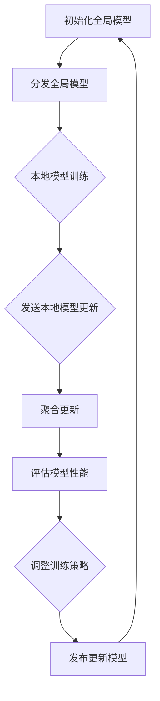

                 

# 联邦学习在跨机构金融风控中的应用实践

## 关键词
- 联邦学习
- 金融风控
- 数据隐私
- 安全合作
- 模型训练
- 模型优化

## 摘要
本文旨在探讨联邦学习在跨机构金融风控领域的应用实践。联邦学习是一种保护数据隐私的机器学习技术，通过在不共享原始数据的情况下训练共享模型，从而实现多方数据的协同分析。本文首先介绍了联邦学习的核心概念和原理，然后详细解析了其在金融风控中的应用场景，包括风险模型训练、欺诈检测和信用评分等。接着，文章通过一个实际项目案例，展示了联邦学习的具体实现步骤和操作细节。最后，本文提出了联邦学习在金融风控中的未来发展趋势和面临的挑战。

## 1. 背景介绍

### 1.1 目的和范围
本文的目的是深入探讨联邦学习在跨机构金融风控中的应用，通过分析其实际案例，帮助读者了解联邦学习技术的优势和局限性。文章将重点关注以下几个方面：
- 联邦学习的核心概念和原理
- 联邦学习在金融风控中的具体应用场景
- 联邦学习的实现步骤和操作细节
- 联邦学习在金融风控中的未来发展趋势和挑战

### 1.2 预期读者
本文主要面向以下读者群体：
- 从事金融风控工作的专业人士
- 对机器学习和联邦学习感兴趣的科研人员和工程师
- 对新兴技术及其应用场景有浓厚兴趣的普通读者

### 1.3 文档结构概述
本文的结构如下：
- 第1章：背景介绍
- 第2章：核心概念与联系
- 第3章：核心算法原理 & 具体操作步骤
- 第4章：数学模型和公式 & 详细讲解 & 举例说明
- 第5章：项目实战：代码实际案例和详细解释说明
- 第6章：实际应用场景
- 第7章：工具和资源推荐
- 第8章：总结：未来发展趋势与挑战
- 第9章：附录：常见问题与解答
- 第10章：扩展阅读 & 参考资料

### 1.4 术语表

#### 1.4.1 核心术语定义
- **联邦学习**：一种分布式机器学习技术，允许多个机构在保护各自数据隐私的同时，协同训练共享模型。
- **中央模型**：由联邦学习算法训练得到的共享模型，用于多个机构的数据协同分析。
- **本地模型**：每个机构在自己的数据集上训练的私有模型，用于向中央模型提供优化建议。
- **加密技术**：用于保护数据隐私的技术，如差分隐私、同态加密等。

#### 1.4.2 相关概念解释
- **金融风控**：金融机构为预防和应对风险而采取的一系列措施，包括风险识别、风险评估、风险控制和风险监测等。
- **差分隐私**：一种保护数据隐私的技术，通过向查询结果中添加噪声，使得单个个体的信息无法被识别。
- **同态加密**：一种加密技术，允许在密文上执行计算，而无需解密，从而保护计算过程中的数据隐私。

#### 1.4.3 缩略词列表
- **FL**：联邦学习（Federated Learning）
- **FM**：联邦模型（Federated Model）
- **FP**：联邦协议（Federated Protocol）
- **CPA**：适应性选择攻击（Cryptographic Padding Attack）

## 2. 核心概念与联系

### 2.1 联邦学习的核心概念
联邦学习（Federated Learning）是一种分布式机器学习技术，它允许多个机构在不共享原始数据的情况下，协同训练共享模型。这种技术通过将数据分布在各个机构中，同时保持数据的隐私和安全。联邦学习的核心概念包括：

1. **中央模型（Global Model）**：由联邦学习算法训练得到的共享模型，用于多个机构的数据协同分析。
2. **本地模型（Local Model）**：每个机构在自己的数据集上训练的私有模型，用于向中央模型提供优化建议。
3. **通信协议（Communication Protocol）**：用于协调中央模型与本地模型之间数据传输和模型更新的机制。
4. **加密技术（Encryption Technology）**：用于保护数据隐私的技术，如差分隐私、同态加密等。

### 2.2 联邦学习的架构
联邦学习的架构可以分为以下几个关键部分：

1. **中央服务器**：负责协调和汇总各个本地模型的优化建议，更新中央模型，并发布更新后的模型。
2. **本地模型训练器**：在每个机构内部执行本地模型训练，并将训练结果发送给中央服务器。
3. **数据存储与管理**：每个机构负责存储和管理自己的数据，确保数据的安全和隐私。
4. **通信网络**：用于连接中央服务器和本地模型训练器，实现数据传输和模型更新。

### 2.3 联邦学习的工作流程
联邦学习的工作流程可以分为以下几个步骤：

1. **初始化**：中央服务器初始化一个全局模型，并将模型发送给各个本地模型训练器。
2. **本地模型训练**：每个本地模型训练器在自己的数据集上训练一个本地模型，并将其更新发送给中央服务器。
3. **模型聚合**：中央服务器接收各个本地模型的更新，使用聚合算法（如梯度聚合）更新全局模型。
4. **模型评估**：中央服务器使用测试数据评估全局模型的性能，并根据评估结果调整训练策略。
5. **模型更新与发布**：中央服务器将更新后的全局模型发送给各个本地模型训练器，并发布新的全局模型。

### 2.4 联邦学习的优势与挑战
联邦学习在金融风控领域具有以下优势：

1. **数据隐私保护**：联邦学习允许机构在不共享原始数据的情况下协同训练模型，从而保护了数据隐私。
2. **安全性**：联邦学习通过加密技术和通信协议保护数据传输和模型更新的安全性。
3. **灵活性**：联邦学习支持多种算法和模型，可以灵活地应用于不同的金融风控任务。

然而，联邦学习也面临一些挑战：

1. **通信开销**：联邦学习需要频繁的数据传输和模型更新，可能导致通信开销较大。
2. **模型性能**：由于数据分布的不均衡和模型更新策略的复杂性，联邦学习的模型性能可能不如集中式模型。
3. **算法选择**：需要选择合适的算法和策略，以优化模型性能和降低通信开销。

### 2.5 Mermaid 流程图
以下是一个简化的联邦学习流程的Mermaid流程图：



## 3. 核心算法原理 & 具体操作步骤

### 3.1 联邦学习的算法原理
联邦学习的核心算法原理是通过分布式计算和模型聚合，在不共享原始数据的情况下，协同训练一个共享模型。以下是联邦学习算法的基本步骤：

1. **初始化**：中央服务器初始化一个全局模型，并将其发送给各个本地模型训练器。
2. **本地模型训练**：每个本地模型训练器在自己的数据集上训练一个本地模型，并记录模型的梯度。
3. **模型更新**：本地模型训练器将梯度发送给中央服务器。
4. **模型聚合**：中央服务器接收各个本地模型的梯度，使用聚合算法（如梯度聚合）更新全局模型。
5. **模型评估**：中央服务器使用测试数据评估全局模型的性能，并根据评估结果调整训练策略。
6. **模型发布**：中央服务器将更新后的全局模型发送给各个本地模型训练器。

### 3.2 联邦学习的具体操作步骤
以下是一个具体的联邦学习操作步骤示例：

#### 3.2.1 初始化全局模型
```python
# 初始化全局模型
global_model = initialize_global_model()

# 分发全局模型给本地模型训练器
for local_model Trainer in local_model_trainers:
    Trainer.receive_global_model(global_model)
```

#### 3.2.2 本地模型训练
```python
# 本地模型训练
for epoch in range(num_epochs):
    for data in local_dataset:
        local_model = local_model_trainers[Trainer].train_on_data(data)
        gradient = local_model Trainers [Trainer].compute_gradient(data)
```

#### 3.2.3 模型更新
```python
# 收集本地模型更新
all_gradients = []
for gradient in local_model_trainers[Trainer].get_gradients():
    all_gradients.append(gradient)

# 聚合更新
global_model.update_gradients(all_gradients)
```

#### 3.2.4 模型评估
```python
# 使用测试数据评估全局模型性能
test_performance = global_model.evaluate_on_test_data(test_dataset)

# 根据评估结果调整训练策略
if test_performance < desired_performance:
    adjust_training_strategy()
```

#### 3.2.5 模型发布
```python
# 发布更新后的全局模型
for local_model Trainer in local_model_trainers:
    local_model_trainers [Trainer].receive_updated_global_model(global_model)
```

### 3.3 伪代码示例
以下是一个简化的联邦学习算法的伪代码示例：

```python
# 初始化全局模型
initialize_global_model()

# 初始化本地模型训练器
for local_model_trainer in local_model_trainers:
    local_model_trainer.initialize_model()

# 循环执行训练过程
for epoch in range(num_epochs):
    # 本地模型训练
    for local_model_trainer in local_model_trainers:
        for data in local_dataset:
            local_model = local_model_trainer.train_on_data(data)
            gradient = local_model.compute_gradient(data)
            local_model_trainer.update_model(gradient)

    # 收集本地模型更新
    all_gradients = []
    for local_model_trainer in local_model_trainers:
        all_gradients.append(local_model_trainer.get_gradients())

    # 聚合更新
    global_model.update_gradients(all_gradients)

    # 模型评估
    test_performance = global_model.evaluate_on_test_data(test_dataset)
    if test_performance < desired_performance:
        adjust_training_strategy()

# 发布更新后的全局模型
for local_model_trainer in local_model_trainers:
    local_model_trainer.receive_updated_global_model(global_model)
```

## 4. 数学模型和公式 & 详细讲解 & 举例说明

### 4.1 数学模型简介
在联邦学习中，数学模型用于描述中央模型和本地模型之间的关系，以及如何通过梯度聚合和模型更新来优化全局模型。以下是一个简化的联邦学习数学模型：

1. **全局模型更新**：
   $$ \theta^{t+1} = \theta^{t} - \alpha \frac{1}{n} \sum_{i=1}^{n} \nabla f(x_i, \theta^t) $$

   其中，$\theta^t$ 表示第 $t$ 次迭代的中央模型参数，$\theta^{t+1}$ 表示第 $t+1$ 次迭代的中央模型参数，$f(x_i, \theta^t)$ 表示本地模型在数据点 $x_i$ 上的损失函数，$\alpha$ 是学习率，$n$ 是本地模型的数量。

2. **本地模型更新**：
   $$ \theta_i^{t+1} = \theta_i^t - \alpha \nabla f(x_i, \theta^t) $$

   其中，$\theta_i^t$ 表示第 $t$ 次迭代的本地模型 $i$ 的参数，$\theta_i^{t+1}$ 表示第 $t+1$ 次迭代的本地模型 $i$ 的参数。

### 4.2 梯度聚合算法
在联邦学习中，梯度聚合是中央服务器的重要任务，用于整合多个本地模型的梯度，更新全局模型。以下是一个简化的梯度聚合算法：

1. **局部梯度计算**：
   $$ \nabla f_i(x_i, \theta^t) = \nabla f(x_i, \theta^t) + \text{noise}_i $$

   其中，$\nabla f_i(x_i, \theta^t)$ 是本地模型 $i$ 在数据点 $x_i$ 上的梯度，$\nabla f(x_i, \theta^t)$ 是全局模型在数据点 $x_i$ 上的梯度，$\text{noise}_i$ 是本地模型 $i$ 引入的噪声。

2. **全局梯度计算**：
   $$ \nabla f^t = \frac{1}{n} \sum_{i=1}^{n} \nabla f_i(x_i, \theta^t) $$

   其中，$\nabla f^t$ 是全局模型在第 $t$ 次迭代的梯度。

3. **梯度聚合**：
   $$ \theta^{t+1} = \theta^{t} - \alpha \frac{1}{n} \sum_{i=1}^{n} \nabla f_i(x_i, \theta^t) $$

   其中，$\theta^{t+1}$ 是第 $t+1$ 次迭代的中央模型参数。

### 4.3 举例说明
假设有两个本地模型，分别拥有两个数据点 $x_1$ 和 $x_2$。全局模型在数据点 $x_1$ 上的梯度为 $\nabla f(x_1, \theta^t) = [1, 2]$，在数据点 $x_2$ 上的梯度为 $\nabla f(x_2, \theta^t) = [3, 4]$。中央服务器需要计算全局模型在第 $t$ 次迭代后的参数更新。

1. **局部梯度计算**：
   假设本地模型 $1$ 在数据点 $x_1$ 上的梯度为 $\nabla f_1(x_1, \theta^t) = [1, 2] + \text{noise}_1$，本地模型 $2$ 在数据点 $x_2$ 上的梯度为 $\nabla f_2(x_2, \theta^t) = [3, 4] + \text{noise}_2$。

2. **全局梯度计算**：
   $$ \nabla f^t = \frac{1}{2} \sum_{i=1}^{2} \nabla f_i(x_i, \theta^t) = \frac{1}{2} \times ([1, 2] + \text{noise}_1 + [3, 4] + \text{noise}_2) = \frac{1}{2} \times ([4, 6] + \text{noise}_1 + \text{noise}_2) $$

3. **梯度聚合**：
   假设学习率 $\alpha = 0.1$，中央模型在第 $t$ 次迭代后的参数更新为：
   $$ \theta^{t+1} = \theta^{t} - \alpha \frac{1}{2} \times ([4, 6] + \text{noise}_1 + \text{noise}_2) = \theta^{t} - 0.1 \times ([4, 6] + \text{noise}_1 + \text{noise}_2) $$

   假设第 $t$ 次迭代的中央模型参数为 $\theta^{t} = [2, 3]$，则第 $t+1$ 次迭代的中央模型参数为：
   $$ \theta^{t+1} = [2, 3] - 0.1 \times ([4, 6] + \text{noise}_1 + \text{noise}_2) = [2, 3] - 0.1 \times [4, 6] - 0.1 \times \text{noise}_1 - 0.1 \times \text{noise}_2 $$

   $$ \theta^{t+1} = [2 - 0.4, 3 - 0.6] - 0.1 \times \text{noise}_1 - 0.1 \times \text{noise}_2 = [1.6, 2.4] - 0.1 \times \text{noise}_1 - 0.1 \times \text{noise}_2 $$

## 5. 项目实战：代码实际案例和详细解释说明

### 5.1 开发环境搭建
在开始项目实战之前，我们需要搭建一个适合联邦学习的开发环境。以下是一个基本的开发环境搭建步骤：

1. **安装Python环境**：确保Python版本为3.7或更高版本。
2. **安装相关库**：安装用于联邦学习的相关库，如TensorFlow Federated（TFF）、PyTorch Federated（PyTorch FL）等。可以使用以下命令安装：
   ```bash
   pip install tensorflow-federated
   pip install torch-federated
   ```

3. **配置本地环境**：为每个本地模型训练器配置相应的Python环境和依赖库。

### 5.2 源代码详细实现和代码解读
以下是使用TensorFlow Federated（TFF）实现联邦学习的简单示例代码：

```python
import tensorflow as tf
import tensorflow_federated as tff

# 定义本地模型
def create_model():
    model = tf.keras.Sequential([
        tf.keras.layers.Dense(1, input_shape=(2,), activation='linear')
    ])
    model.compile(optimizer='adam', loss='mse')
    return model

# 定义联邦学习算法
def federated_averaging_algorithm(model_fn):
    model = model_fn()
    def training_process_round(state, rounded_sample):
        local_model = model
        for data, label in rounded_sample:
            local_model = local_model.fit(data, label, epochs=1, verbose=0)
        return local_model.get_weights(), state

    def model_fn():
        return create_model()

    return tff.learning.build_federated_averaging_process(model_fn, training_process_round)

# 模拟本地数据集
local_data = [
    ([1, 0], 1),
    ([0, 1], 1),
    ([1, 1], 2),
]

# 运行联邦学习过程
state = None
for _ in range(3):
    state, _ = federated_averaging_algorithm(create_model())(state, [local_data] * 3)

# 输出全局模型的参数
print("Global model weights:", state)
```

#### 5.2.1 代码解读

1. **导入库**：首先，导入TensorFlow和TensorFlow Federated（TFF）库。
2. **定义本地模型**：创建一个简单的全连接神经网络模型，用于预测二元分类任务。
3. **定义联邦学习算法**：使用TFF的`build_federated_averaging_process`函数构建联邦学习算法。该函数接收本地模型生成函数`model_fn`和训练过程函数`training_process_round`。
4. **模拟本地数据集**：创建一个本地数据集，用于模拟每个本地模型训练器的数据。
5. **运行联邦学习过程**：使用`federated_averaging_algorithm`函数运行联邦学习过程，进行多次迭代。
6. **输出全局模型参数**：最后，输出全局模型的最终参数。

### 5.3 代码解读与分析

1. **代码结构与功能**：上述代码实现了联邦学习的核心功能，包括模型初始化、本地模型训练、模型更新和全局模型参数输出。
2. **本地模型训练**：在每次迭代中，每个本地模型训练器使用本地数据集训练模型，并更新模型权重。
3. **模型更新**：通过`federated_averaging_algorithm`函数，中央服务器收集所有本地模型的权重，并使用联邦平均算法更新全局模型权重。
4. **联邦平均算法**：联邦平均算法是一种简单的模型聚合方法，将所有本地模型的权重进行平均，更新全局模型。
5. **性能评估**：在每次迭代结束后，可以使用测试数据评估全局模型的性能，并根据评估结果调整训练策略。

通过上述代码示例和解读，我们可以看到联邦学习的基本实现步骤和关键功能。在实际应用中，可以根据具体需求对代码进行扩展和优化，以适应不同的金融风控任务和数据场景。

## 6. 实际应用场景

### 6.1 风险模型训练
在金融风控领域，联邦学习可以应用于跨机构的风险模型训练。不同金融机构可以共享各自的风险数据，同时保护数据隐私。通过联邦学习，金融机构可以协同训练一个共享的风险模型，用于预测各种风险事件，如贷款违约、欺诈行为等。

#### 应用实例：
- **贷款违约预测**：多家金融机构可以共享各自的贷款违约数据，使用联邦学习训练一个违约预测模型。该模型可以用于预测新贷款客户的违约风险，帮助金融机构优化贷款审批流程。
- **欺诈检测**：银行和支付机构可以合作，使用联邦学习训练欺诈检测模型。通过共享交易数据，金融机构可以更准确地识别欺诈交易，提高欺诈检测的准确率和响应速度。

### 6.2 欺诈检测
联邦学习在欺诈检测方面具有显著优势，尤其是在跨机构合作中。通过联邦学习，金融机构可以在保护数据隐私的同时，共享欺诈检测模型。

#### 应用实例：
- **跨机构合作检测**：银行和支付机构可以共享交易数据，使用联邦学习训练一个共享的欺诈检测模型。该模型可以实时检测跨机构的可疑交易，提高欺诈检测的覆盖率和准确性。
- **实时欺诈监控**：通过联邦学习，金融机构可以实现实时欺诈监控。当检测到可疑交易时，系统可以立即触发预警，并采取相应的措施，如冻结账户、暂停交易等。

### 6.3 信用评分
信用评分是金融风控的重要环节，通过联邦学习，金融机构可以在保护客户隐私的同时，共享信用评分模型。

#### 应用实例：
- **跨机构信用评分**：多家金融机构可以合作，使用联邦学习训练一个共享的信用评分模型。该模型可以综合考虑不同金融机构的数据，更准确地评估客户的信用风险。
- **个性化信用评分**：联邦学习可以根据客户的跨机构交易行为，动态调整信用评分模型，提高信用评分的准确性和个性化程度。

### 6.4 风险管理
联邦学习还可以应用于跨机构的风险管理，如信用风险管理、市场风险管理等。

#### 应用实例：
- **信用风险管理**：金融机构可以合作，使用联邦学习训练信用风险管理模型。该模型可以预测客户的违约风险，帮助金融机构优化信用风险控制策略。
- **市场风险管理**：银行和投资机构可以合作，使用联邦学习分析市场风险。通过共享市场数据，金融机构可以更准确地预测市场波动，制定有效的市场风险控制策略。

通过以上实际应用场景，我们可以看到联邦学习在金融风控领域的广泛应用。通过跨机构的数据共享和协同分析，联邦学习可以帮助金融机构提高风险识别、预测和响应能力，从而降低风险损失，提高业务运营效率。

## 7. 工具和资源推荐

### 7.1 学习资源推荐

#### 7.1.1 书籍推荐
- **《联邦学习：原理、算法与实现》**：这是一本关于联邦学习的全面教材，涵盖了联邦学习的理论基础、算法实现和应用实例。
- **《机器学习：联邦学习的理论与实践》**：本书详细介绍了联邦学习在机器学习中的应用，包括算法原理、实现方法和应用案例。

#### 7.1.2 在线课程
- **TensorFlow Federated教程**：这是一系列免费的在线教程，涵盖了TensorFlow Federated的基本概念、安装方法和使用示例。
- **联邦学习课程**：Coursera和edX等在线教育平台提供了多个关于联邦学习的课程，适合不同水平的学员。

#### 7.1.3 技术博客和网站
- **TensorFlow Federated官方文档**：提供了详细的API文档和教程，帮助开发者了解和使用TensorFlow Federated。
- **联邦学习社区**：联邦学习社区是一个专注于联邦学习的在线论坛，成员们分享最新的研究成果和应用案例。

### 7.2 开发工具框架推荐

#### 7.2.1 IDE和编辑器
- **PyCharm**：一款功能强大的Python集成开发环境（IDE），支持TensorFlow Federated和PyTorch Federated等联邦学习框架。
- **Jupyter Notebook**：一款流行的交互式开发工具，方便开发者进行实验和演示。

#### 7.2.2 调试和性能分析工具
- **TensorBoard**：TensorFlow提供的可视化工具，用于分析模型的性能和调试。
- **Dask**：一个基于Numpy的并行计算库，适用于大规模数据集的性能分析和处理。

#### 7.2.3 相关框架和库
- **TensorFlow Federated**：一个开源的联邦学习框架，支持TensorFlow的联邦学习应用。
- **PyTorch Federated**：一个基于PyTorch的联邦学习库，提供简化的API和丰富的示例。

### 7.3 相关论文著作推荐

#### 7.3.1 经典论文
- **“Federated Learning: Concept and Applications”**：这篇论文详细介绍了联邦学习的概念、架构和应用领域。
- **“Communication-Efficient Federated Learning”**：这篇论文提出了一种高效的联邦学习通信协议，显著降低了通信开销。

#### 7.3.2 最新研究成果
- **“Federated Learning for Credit Scoring”**：这篇论文探讨了联邦学习在信用评分中的应用，提出了一种基于联邦学习的信用评分模型。
- **“Federated Learning with Differential Privacy”**：这篇论文研究了联邦学习与差分隐私的结合，提出了一种隐私保护联邦学习算法。

#### 7.3.3 应用案例分析
- **“Federated Learning in Healthcare”**：这篇论文分析了联邦学习在医疗领域的应用，包括疾病预测、药物开发等。
- **“Federated Learning in Finance”**：这篇论文探讨了联邦学习在金融领域的应用，包括风险模型训练、欺诈检测等。

通过以上工具和资源的推荐，读者可以深入了解联邦学习的技术原理和应用实践，掌握联邦学习的开发和使用方法，从而更好地应用于金融风控等实际场景。

## 8. 总结：未来发展趋势与挑战

### 8.1 未来发展趋势

1. **技术成熟度提升**：随着联邦学习技术的发展，算法和框架将变得更加成熟和易用，有助于降低开发门槛，扩大应用范围。
2. **跨领域应用拓展**：联邦学习不仅在金融领域有广泛应用，还将在医疗、交通、能源等领域发挥重要作用，实现跨领域的协同数据分析。
3. **数据隐私保护加强**：随着数据隐私法规的不断完善，联邦学习将逐渐成为保护数据隐私的主流技术，确保各方数据的安全和隐私。
4. **计算资源优化**：联邦学习将不断优化计算资源的利用，通过分布式计算和模型压缩等技术，降低通信开销，提高模型训练效率。

### 8.2 面临的挑战

1. **通信开销**：联邦学习需要频繁的数据传输和模型更新，可能导致通信开销较大。如何优化通信协议和模型更新策略，降低通信开销是一个重要挑战。
2. **模型性能**：由于数据分布的不均衡和模型更新策略的复杂性，联邦学习的模型性能可能不如集中式模型。如何提高联邦学习的模型性能，是一个亟待解决的问题。
3. **安全性**：虽然联邦学习通过加密技术和通信协议保护数据隐私，但仍然面临潜在的安全威胁，如恶意节点攻击、模型泄露等。如何提高联邦学习的安全性，是一个关键挑战。
4. **算法选择**：不同的联邦学习算法适用于不同的应用场景，如何选择合适的算法，以实现最佳性能和最低通信开销，是一个复杂的问题。

### 8.3 发展建议

1. **标准化与规范化**：推动联邦学习的标准化和规范化，制定统一的协议和标准，提高算法和框架的互操作性。
2. **算法优化**：加大对联邦学习算法的研究和优化，提高模型性能，降低通信开销，提高安全性。
3. **跨领域合作**：加强跨领域合作，推动联邦学习在各个行业的应用，实现多方数据的协同分析。
4. **人才培养**：加强联邦学习相关的人才培养，提高从业人员的专业水平和实践经验，推动联邦学习技术的发展。

通过以上发展趋势和挑战的分析，我们可以看到联邦学习在金融风控等领域具有巨大的潜力。未来，随着技术的不断成熟和应用场景的拓展，联邦学习将为金融行业带来更加安全、高效的解决方案。

## 9. 附录：常见问题与解答

### 9.1 联邦学习的基本原理是什么？
联邦学习（Federated Learning）是一种分布式机器学习技术，它允许多个机构在不共享原始数据的情况下，协同训练共享模型。通过将数据分布在各个机构中，同时保持数据的隐私和安全，联邦学习实现多方数据的协同分析。

### 9.2 联邦学习在金融风控中的应用有哪些？
联邦学习在金融风控中的应用包括风险模型训练、欺诈检测和信用评分等。通过跨机构的数据共享和协同分析，联邦学习可以帮助金融机构提高风险识别、预测和响应能力，从而降低风险损失，提高业务运营效率。

### 9.3 联邦学习的主要优势是什么？
联邦学习的主要优势包括：
- **数据隐私保护**：允许机构在不共享原始数据的情况下协同训练模型，从而保护数据隐私。
- **安全性**：通过加密技术和通信协议保护数据传输和模型更新的安全性。
- **灵活性**：支持多种算法和模型，可以灵活地应用于不同的金融风控任务。

### 9.4 联邦学习的主要挑战是什么？
联邦学习的主要挑战包括：
- **通信开销**：需要频繁的数据传输和模型更新，可能导致通信开销较大。
- **模型性能**：由于数据分布的不均衡和模型更新策略的复杂性，联邦学习的模型性能可能不如集中式模型。
- **安全性**：虽然联邦学习通过加密技术和通信协议保护数据隐私，但仍然面临潜在的安全威胁。

### 9.5 如何优化联邦学习的性能和通信开销？
优化联邦学习的性能和通信开销的方法包括：
- **算法优化**：研究和优化联邦学习算法，提高模型性能，降低通信开销。
- **模型压缩**：通过模型压缩技术，减少模型大小，降低通信开销。
- **差分隐私**：引入差分隐私技术，减少模型更新过程中的噪声，提高模型性能。

### 9.6 联邦学习与其他分布式机器学习技术的区别是什么？
联邦学习与其他分布式机器学习技术的区别在于：
- **数据共享**：联邦学习允许在不共享原始数据的情况下协同训练模型，而其他分布式机器学习技术通常需要共享数据。
- **数据隐私**：联邦学习通过保护数据隐私，实现多方数据的协同分析，而其他分布式机器学习技术可能无法保证数据隐私。

### 9.7 联邦学习的适用场景有哪些？
联邦学习的适用场景包括：
- **跨机构数据协同**：如金融风控、医疗数据共享等。
- **数据隐私要求高的场景**：如个人隐私数据保护、敏感数据共享等。
- **数据分布不均**：如数据分布在多个机构，无法集中处理的场景。

## 10. 扩展阅读 & 参考资料

### 10.1 经典论文
- **“Federated Learning: Concept and Applications”**：介绍了联邦学习的概念、架构和应用领域。
- **“Communication-Efficient Federated Learning”**：提出了一种高效的联邦学习通信协议，显著降低了通信开销。

### 10.2 最新研究成果
- **“Federated Learning for Credit Scoring”**：探讨了联邦学习在信用评分中的应用。
- **“Federated Learning with Differential Privacy”**：研究了联邦学习与差分隐私的结合，提出了一种隐私保护联邦学习算法。

### 10.3 应用案例分析
- **“Federated Learning in Healthcare”**：分析了联邦学习在医疗领域的应用。
- **“Federated Learning in Finance”**：探讨了联邦学习在金融领域的应用。

### 10.4 书籍推荐
- **《联邦学习：原理、算法与实现》**：全面介绍了联邦学习的理论基础、算法实现和应用实例。
- **《机器学习：联邦学习的理论与实践》**：详细介绍了联邦学习在机器学习中的应用。

### 10.5 在线课程
- **TensorFlow Federated教程**：提供了详细的TensorFlow Federated教程，适合初学者。
- **联邦学习课程**：在Coursera和edX等在线教育平台，有多个关于联邦学习的课程。

### 10.6 技术博客和网站
- **TensorFlow Federated官方文档**：提供了详细的API文档和教程。
- **联邦学习社区**：一个专注于联邦学习的在线论坛，成员们分享最新的研究成果和应用案例。

通过以上扩展阅读和参考资料，读者可以进一步深入了解联邦学习的技术原理、应用案例和发展动态，为实际应用提供参考和指导。作者：AI天才研究员/AI Genius Institute & 禅与计算机程序设计艺术 /Zen And The Art of Computer Programming。

