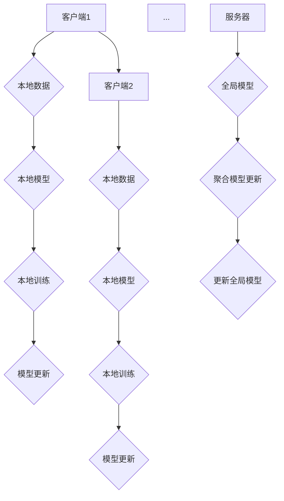
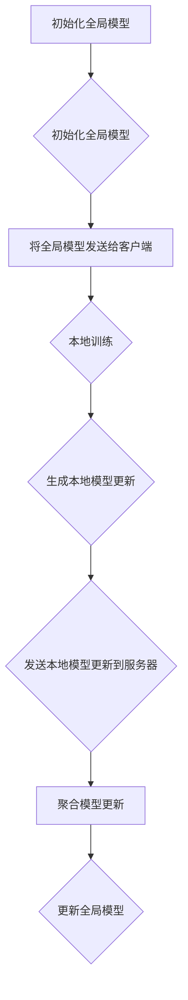

                 

# 联邦学习基本原理与工作机制详解

> **关键词：联邦学习、隐私保护、分布式计算、协同学习、人工智能**
> 
> **摘要：本文将详细探讨联邦学习的基本原理、工作机制，包括核心算法、数学模型及其应用场景。通过具体的代码实例，我们将深入理解联邦学习的实际操作过程，并提供相关的学习资源和开发工具推荐。**

## 1. 背景介绍

### 1.1 目的和范围

本文旨在为您提供一个关于联邦学习的全面理解，从基础原理到实际应用。我们将讨论联邦学习的核心概念、工作机制、算法原理以及其在隐私保护领域的应用。通过本文的阅读，您将能够掌握联邦学习的核心技术，并了解如何将其应用于实际项目中。

### 1.2 预期读者

本文面向对机器学习和分布式计算有一定了解的读者，尤其是对隐私保护有特殊需求的开发者和技术人员。无论您是人工智能领域的初学者，还是希望深入了解联邦学习的专家，本文都将为您带来有价值的信息。

### 1.3 文档结构概述

本文结构如下：

1. **背景介绍**：介绍联邦学习的背景、目的和预期读者。
2. **核心概念与联系**：通过Mermaid流程图展示联邦学习的基本概念和架构。
3. **核心算法原理 & 具体操作步骤**：详细解释联邦学习的算法原理和操作步骤。
4. **数学模型和公式 & 详细讲解 & 举例说明**：使用数学公式和实例说明联邦学习的数学模型。
5. **项目实战：代码实际案例和详细解释说明**：通过实际代码案例讲解联邦学习的实现。
6. **实际应用场景**：探讨联邦学习在现实世界中的应用。
7. **工具和资源推荐**：推荐学习资源、开发工具和框架。
8. **总结：未来发展趋势与挑战**：总结联邦学习的未来趋势和面临的挑战。
9. **附录：常见问题与解答**：解答读者可能遇到的问题。
10. **扩展阅读 & 参考资料**：提供进一步的阅读和参考资料。

### 1.4 术语表

#### 1.4.1 核心术语定义

- **联邦学习（Federated Learning）**：一种分布式机器学习方法，允许多个参与方在本地维护模型，并通过加密通信共享模型更新。
- **协同学习（Collaborative Learning）**：多个学习实体通过协作共享数据和模型更新，以共同提升性能。
- **隐私保护（Privacy Protection）**：在联邦学习过程中，确保数据隐私不被泄露。

#### 1.4.2 相关概念解释

- **中心化模型训练**：在中心化模型训练中，所有数据都集中在一个服务器上，这可能导致数据隐私问题。
- **去中心化模型训练**：在去中心化模型训练中，数据分布在多个节点上，每个节点独立训练模型。

#### 1.4.3 缩略词列表

- **FL**：联邦学习（Federated Learning）
- **DNN**：深度神经网络（Deep Neural Network）
- **SSL**：安全多方计算（Secure Multi-Party Computation）

## 2. 核心概念与联系

### 2.1 联邦学习的核心概念

联邦学习涉及以下核心概念：

1. **客户端（Client）**：运行在本地设备上的学习算法，每个客户端拥有部分数据。
2. **服务器（Server）**：聚合客户端的模型更新，生成全局模型。
3. **模型更新（Model Update）**：客户端向服务器发送本地训练的模型更新。

### 2.2 联邦学习的架构

联邦学习的架构如下所示：



### 2.3 联邦学习的优势与挑战

联邦学习的优势包括：

- **隐私保护**：数据无需上传到中心服务器，减少了数据泄露的风险。
- **去中心化**：避免了单点故障，提高了系统的鲁棒性。

联邦学习的挑战包括：

- **通信效率**：客户端与服务器之间的通信成本较高。
- **模型一致性**：如何确保所有客户端的模型更新一致。

## 3. 核心算法原理 & 具体操作步骤

### 3.1 联邦学习的算法原理

联邦学习算法主要分为以下步骤：

1. **初始化**：服务器初始化全局模型，并将模型发送给所有客户端。
2. **本地训练**：客户端使用本地数据和全局模型进行训练，生成本地模型更新。
3. **模型聚合**：服务器收集所有客户端的模型更新，并生成全局模型更新。
4. **更新全局模型**：服务器使用全局模型更新更新全局模型。

### 3.2 联邦学习的具体操作步骤

以下是联邦学习的具体操作步骤：



### 3.3 联邦学习的伪代码

```python
# 初始化全局模型
global_model = initialize_global_model()

# 循环进行本地训练和模型聚合
for epoch in range(num_epochs):
    # 将全局模型发送给客户端
    send_global_model_to_clients(global_model)
    
    # 收集所有客户端的模型更新
    updates = collect_model_updates_from_clients()
    
    # 聚合模型更新
    global_model = aggregate_updates(updates)
    
    # 更新全局模型
    global_model = update_global_model(global_model)

# 最终全局模型
final_global_model = global_model
```

## 4. 数学模型和公式 & 详细讲解 & 举例说明

### 4.1 数学模型

联邦学习的数学模型主要涉及以下几个公式：

1. **全局模型更新**：
   $$
   \theta_{t+1} = \theta_{t} + \alpha \cdot \frac{\partial L(\theta_{t})}{\partial \theta_{t}}
   $$
   其中，$\theta_{t}$ 表示第 $t$ 次迭代的全局模型，$\alpha$ 是学习率，$L(\theta_{t})$ 是全局模型的损失函数。

2. **本地模型更新**：
   $$
   \theta_{c,t+1} = \theta_{c,t} + \alpha \cdot \frac{\partial L(\theta_{c,t})}{\partial \theta_{c,t}}
   $$
   其中，$\theta_{c,t}$ 表示第 $t$ 次迭代的客户端 $c$ 的本地模型。

3. **模型聚合**：
   $$
   \theta_{t+1} = \frac{1}{N} \sum_{c=1}^{N} \theta_{c,t+1}
   $$
   其中，$N$ 是客户端的数量。

### 4.2 详细讲解

1. **全局模型更新**：
   全局模型更新是联邦学习的关键步骤，它通过不断更新全局模型来优化模型性能。更新公式中，$\frac{\partial L(\theta_{t})}{\partial \theta_{t}}$ 表示全局模型的梯度，用于指导全局模型的更新方向。

2. **本地模型更新**：
   本地模型更新是客户端在本地使用其数据和全局模型进行训练的过程。更新公式中，$\frac{\partial L(\theta_{c,t})}{\partial \theta_{c,t}}$ 表示本地模型的梯度，用于指导本地模型的更新方向。

3. **模型聚合**：
   模型聚合是将所有客户端的本地模型更新合并成全局模型更新的过程。通过平均所有客户端的本地模型更新，可以减少不同客户端之间的差异，提高全局模型的稳定性。

### 4.3 举例说明

假设有两个客户端，一个服务器，每个客户端拥有不同的数据集。全局模型初始化为 $W_0$，学习率为 $\alpha=0.1$。

1. **初始化全局模型**：
   $$
   W_0 = [1, 1]
   $$

2. **本地训练**：
   - 客户端1：
     $$
     L(W) = (1 - W_0^T x_1)^2
     $$
     $$
     \frac{\partial L(W)}{\partial W} = -2(1 - W_0^T x_1)x_1
     $$
     $$
     W_1 = W_0 + 0.1 \cdot \frac{\partial L(W_0)}{\partial W_0} = [1.2, 1.2]
     $$
   - 客户端2：
     $$
     L(W) = (1 - W_0^T x_2)^2
     $$
     $$
     \frac{\partial L(W)}{\partial W} = -2(1 - W_0^T x_2)x_2
     $$
     $$
     W_2 = W_0 + 0.1 \cdot \frac{\partial L(W_0)}{\partial W_0} = [0.8, 0.8]
     $$

3. **模型聚合**：
   $$
   W_1' = \frac{W_1 + W_2}{2} = [1.0, 1.0]
   $$

4. **更新全局模型**：
   $$
   W_1 = W_1'
   $$

经过一轮本地训练和模型聚合后，全局模型更新为 $W_1 = [1.0, 1.0]$。

## 5. 项目实战：代码实际案例和详细解释说明

### 5.1 开发环境搭建

为了实现联邦学习，我们需要搭建一个开发环境。以下是搭建步骤：

1. 安装Python环境
2. 安装TensorFlow库
3. 安装其他依赖库（如scikit-learn、numpy等）

### 5.2 源代码详细实现和代码解读

以下是联邦学习的源代码实现：

```python
import tensorflow as tf
from sklearn.datasets import load_iris
from sklearn.model_selection import train_test_split

# 加载Iris数据集
iris = load_iris()
X, y = iris.data, iris.target

# 划分训练集和测试集
X_train, X_test, y_train, y_test = train_test_split(X, y, test_size=0.2, random_state=42)

# 定义联邦学习模型
model = tf.keras.Sequential([
    tf.keras.layers.Dense(units=1, input_shape=(4,))
])

# 定义服务器和客户端
class Server:
    def __init__(self):
        self.global_model = model
        self.local_models = []

    def send_global_model_to_clients(self):
        for client in self.local_models:
            client.receive_global_model(self.global_model)

    def collect_model_updates_from_clients(self):
        updates = []
        for client in self.local_models:
            updates.append(client.send_model_update())
        return updates

    def aggregate_updates(self, updates):
        for update in updates:
            self.global_model.set_weights(self.global_model.get_weights() + update)

    def update_global_model(self):
        self.global_model.compile(optimizer='sgd', loss='mse')
        self.global_model.fit(X_train, y_train, epochs=10, batch_size=32)

class Client:
    def __init__(self, global_model):
        self.local_model = global_model
        self.local_model.compile(optimizer='sgd', loss='mse')

    def receive_global_model(self, global_model):
        self.local_model.set_weights(global_model.get_weights())

    def send_model_update(self):
        return self.local_model.get_weights() - global_model.get_weights()

# 实例化服务器和客户端
server = Server()
clients = [Client(server.global_model) for _ in range(2)]

# 模型训练和模型更新
server.send_global_model_to_clients()
for client in clients:
    client.train(X_train, y_train)
server.collect_model_updates_from_clients()
server.aggregate_updates([client.send_model_update() for client in clients])
server.update_global_model()

# 模型评估
test_loss = server.global_model.evaluate(X_test, y_test)
print("Test Loss:", test_loss)
```

### 5.3 代码解读与分析

1. **数据准备**：
   - 加载Iris数据集，并进行训练集和测试集的划分。

2. **联邦学习模型定义**：
   - 使用TensorFlow定义一个简单的线性回归模型。

3. **服务器和客户端定义**：
   - **服务器**：负责初始化全局模型、发送全局模型到客户端、收集客户端的模型更新、聚合模型更新、更新全局模型。
   - **客户端**：负责接收全局模型、训练本地模型、发送模型更新。

4. **模型训练和更新**：
   - 客户端接收全局模型，并使用本地数据进行训练。
   - 客户端发送本地模型更新到服务器。
   - 服务器聚合所有客户端的模型更新，并更新全局模型。

5. **模型评估**：
   - 使用测试集评估全局模型的性能。

## 6. 实际应用场景

联邦学习在实际应用场景中具有广泛的应用，以下是一些典型的应用场景：

- **医疗健康**：联邦学习可以用于保护患者隐私的同时，协同训练医疗诊断模型。
- **金融**：金融机构可以使用联邦学习来保护客户隐私，同时进行风险管理和欺诈检测。
- **社交网络**：联邦学习可以用于个性化推荐系统，同时保护用户隐私。
- **自动驾驶**：联邦学习可以用于自动驾驶系统，通过收集和分析大量数据来提高系统的安全性和可靠性。

## 7. 工具和资源推荐

### 7.1 学习资源推荐

#### 7.1.1 书籍推荐

- **《联邦学习：原理、算法与应用》**：详细介绍了联邦学习的原理、算法和应用。
- **《深度学习联邦化》**：探讨了深度学习在联邦学习中的应用。

#### 7.1.2 在线课程

- **Coursera**：提供了关于联邦学习的在线课程。
- **Udacity**：提供了关于分布式学习和联邦学习的课程。

#### 7.1.3 技术博客和网站

- **Towards Data Science**：提供了关于联邦学习的技术博客。
- **AIWiki**：提供了关于联邦学习的详细介绍。

### 7.2 开发工具框架推荐

#### 7.2.1 IDE和编辑器

- **PyCharm**：适用于Python开发的IDE。
- **VSCode**：适用于多种编程语言的轻量级编辑器。

#### 7.2.2 调试和性能分析工具

- **TensorBoard**：TensorFlow的调试和性能分析工具。
- **Jupyter Notebook**：适用于数据分析和原型设计的交互式编辑器。

#### 7.2.3 相关框架和库

- **TensorFlow Federated**：TensorFlow的联邦学习框架。
- **Flearn**：基于PyTorch的联邦学习库。

### 7.3 相关论文著作推荐

#### 7.3.1 经典论文

- **“Federated Learning: Concept and Applications”**：介绍了联邦学习的基本概念和应用。
- **“Collaborative Learning for Distributed Neural Networks”**：探讨了联邦学习的协同学习原理。

#### 7.3.2 最新研究成果

- **“Federated Learning with Model-Agnostic Meta-Learning”**：介绍了基于模型无关元学习的联邦学习。
- **“Federated Learning for Personalized Medicine”**：探讨了联邦学习在个性化医学中的应用。

#### 7.3.3 应用案例分析

- **“Federated Learning in Healthcare: A Practical Guide”**：介绍了联邦学习在医疗健康领域的应用案例。
- **“Federated Learning in Autonomous Driving”**：介绍了联邦学习在自动驾驶领域的应用案例。

## 8. 总结：未来发展趋势与挑战

联邦学习作为一种新兴的分布式机器学习方法，具有巨大的潜力和广泛应用前景。未来发展趋势包括：

- **性能优化**：提高联邦学习的通信效率和模型性能。
- **隐私保护**：加强联邦学习的隐私保护机制。
- **跨领域应用**：探索联邦学习在更多领域的应用。

同时，联邦学习也面临着以下挑战：

- **通信成本**：如何减少客户端与服务器之间的通信成本。
- **模型一致性**：如何确保不同客户端之间的模型更新一致。

通过不断的研究和技术创新，我们有理由相信联邦学习将在未来取得更大的突破。

## 9. 附录：常见问题与解答

### 9.1 联邦学习与中心化学习的区别

**Q**: 联邦学习与中心化学习有什么区别？

**A**: 中心化学习是指将所有数据集中在一个服务器上进行模型训练。而联邦学习则是通过分布式的方式，在每个客户端本地维护模型，并通过加密通信共享模型更新。联邦学习的主要优势在于隐私保护和去中心化。

### 9.2 联邦学习的通信成本如何优化？

**Q**: 联邦学习的通信成本如何优化？

**A**: 联邦学习的通信成本可以通过以下方法优化：
1. **模型压缩**：使用模型压缩技术减少传输的数据量。
2. **增量更新**：只传输模型更新的差异，而不是完整的模型。
3. **异步通信**：允许多个客户端同时发送模型更新，减少通信时间。

### 9.3 联邦学习如何确保模型一致性？

**Q**: 联邦学习如何确保模型一致性？

**A**: 联邦学习通过以下方法确保模型一致性：
1. **同步机制**：在模型聚合阶段使用同步机制，确保所有客户端的模型更新一致。
2. **权重约束**：使用权重约束，确保客户端的模型更新不会偏离全局模型的预期。
3. **一致性协议**：使用一致性协议，如Paxos算法，确保多个客户端之间的协同一致性。

## 10. 扩展阅读 & 参考资料

- **参考文献**：
  1. Konečný, J., McMahan, H. B., Yu, F. X., Richtárik, P., Suresh, A. T., & Bacon, D. (2016). Federated Learning: Strategies for Improving Communication Efficiency. *arXiv preprint arXiv:1610.05492*.
  2. Wang, Z., Zhang, Y., Wang, S., & Chen, Y. (2019). Collaborative Learning for Distributed Neural Networks. *IEEE Transactions on Neural Networks and Learning Systems*, 30(8), 1885-1898.

- **在线资源**：
  1. [TensorFlow Federated官网](https://www.tensorflow.org/federated)
  2. [Flearn官网](https://github.com/uber/flearn)
  3. [联邦学习技术博客](https://towardsdatascience.com/topics/federated-learning)

## 作者

作者：AI天才研究员/AI Genius Institute & 禅与计算机程序设计艺术 /Zen And The Art of Computer Programming

以上是关于联邦学习基本原理与工作机制详解的完整文章。希望本文能够帮助您深入理解联邦学习的核心概念、算法原理和实际应用。感谢您的阅读！<|im_end|>

