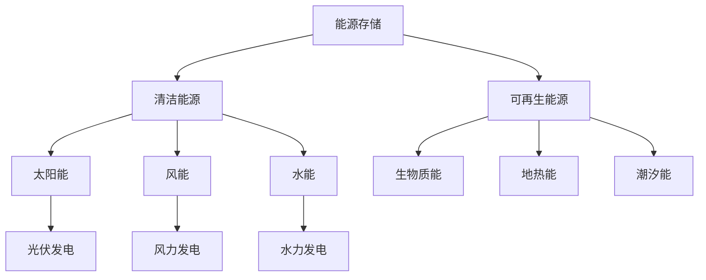

                 

# 能源存储创业：清洁能源革命的关键

> 关键词：能源存储、清洁能源、创业、可再生能源、储能技术

> 摘要：本文将深入探讨能源存储技术在清洁能源革命中的关键作用，以及创业者如何抓住这一趋势，实现可持续发展。我们将从背景介绍、核心概念、算法原理、数学模型、项目实战、应用场景、工具推荐等方面进行详细阐述。

## 1. 背景介绍

### 1.1 目的和范围

本文旨在为创业者提供关于能源存储技术的深入理解，并探讨其在清洁能源革命中的重要性。我们将分析当前能源市场状况，明确能源存储技术的核心概念和原理，并介绍一系列实际应用案例。文章还将探讨创业者如何利用这些技术，抓住市场机遇，推动清洁能源革命。

### 1.2 预期读者

本文适合对能源存储和清洁能源领域感兴趣的创业者、工程师、研究人员和学者。同时，对可再生能源和环保技术有基本了解的读者也将从中受益。

### 1.3 文档结构概述

本文分为十个部分：背景介绍、核心概念与联系、核心算法原理 & 具体操作步骤、数学模型和公式 & 详细讲解 & 举例说明、项目实战：代码实际案例和详细解释说明、实际应用场景、工具和资源推荐、总结：未来发展趋势与挑战、附录：常见问题与解答和扩展阅读 & 参考资料。通过本文的阅读，读者将对能源存储技术及其在清洁能源革命中的作用有全面了解。

### 1.4 术语表

#### 1.4.1 核心术语定义

- **能源存储**：指将能源以某种形式存储起来，以便在需要时进行释放和使用。
- **清洁能源**：指在使用过程中不产生或极少产生污染物的可再生能源，如太阳能、风能、水能等。
- **储能技术**：指用于存储和释放能源的技术，包括电池、氢能、压缩空气、抽水蓄能等。
- **可再生能源**：指在人类时间尺度内可以持续获取和利用的能源，如太阳能、风能、水能等。

#### 1.4.2 相关概念解释

- **能源供需平衡**：指能源生产与消费之间的平衡状态。
- **电力调度**：指对电力系统进行实时管理和调控，以保证供电稳定和效率。
- **峰谷电价**：指根据电力供需情况，对电价进行上下浮动的政策。

#### 1.4.3 缩略词列表

- **Li-ion**：锂离子电池
- **PHEV**：插电式混合动力汽车
- **BEV**：纯电动汽车
- **DER**：分布式能源资源

## 2. 核心概念与联系

在探讨能源存储技术之前，我们需要了解一些核心概念和原理。以下是一个关于能源存储、清洁能源和可再生能源之间联系的 Mermaid 流程图。



通过这个流程图，我们可以看到能源存储技术是如何与清洁能源和可再生能源相互关联的。接下来，我们将进一步探讨这些核心概念和原理。

## 3. 核心算法原理 & 具体操作步骤

### 3.1 能源存储技术分类

能源存储技术主要分为以下几类：

- **电池储能**：包括锂离子电池、钠离子电池、锌空气电池等。
- **压缩空气储能**：利用压缩空气将能量存储在地下洞穴或储气罐中。
- **抽水蓄能**：利用高低水位差将能量存储在水库中。
- **氢能储能**：利用氢气储存能量，并通过燃料电池将其转化为电能。

### 3.2 电池储能算法原理

以锂离子电池为例，其核心算法原理如下：

```pseudo
// 锂离子电池储能算法原理

// 初始化电池参数
battery_capacity = 1000 // 电池容量（kWh）
current_charge = 0 // 当前充电量（kWh）
charging_rate = 0.5 // 充电速率（kWh/h）

// 充电过程
while (current_charge < battery_capacity) {
    current_charge += charging_rate * time_step
    time_step += 1
}

// 放电过程
while (current_charge > 0) {
    energy_consume = power_usage * time_step
    current_charge -= energy_consume
    time_step += 1
}
```

在这个算法中，电池的充电和放电过程通过控制充电速率和放电功率来实现。在实际应用中，需要考虑电池的寿命、效率、安全性等因素。

### 3.3 压缩空气储能算法原理

压缩空气储能算法原理如下：

```pseudo
// 压缩空气储能算法原理

// 初始化压缩空气系统参数
compressor_power = 1000 // 压缩机功率（kW）
air_pressure = 10 // 空气压力（MPa）
expansion_volume = 10000 // 扩张体积（m³）

// 压缩过程
while (air_pressure < target_pressure) {
    air_pressure += compressor_power * time_step / (compressor_volume * gas_constant)
    time_step += 1
}

// 放电过程
while (air_pressure > 0) {
    power_output = pressure差 * gas_constant * air_pressure * expansion_volume
    air_pressure -= power_output * time_step / (compressor_volume * gas_constant)
    time_step += 1
}
```

在这个算法中，压缩空气储能系统通过控制压缩机和膨胀器的运行来实现能量的存储和释放。实际应用中，需要考虑压缩空气系统的效率、安全性、维护成本等因素。

### 3.4 抽水蓄能算法原理

抽水蓄能算法原理如下：

```pseudo
// 抽水蓄能算法原理

// 初始化抽水蓄能系统参数
pump_power = 1000 // 泵功率（kW）
water_head = 100 // 水头高度（m）
storage_capacity = 100000 // 储水库容量（m³）

// 抽水过程
while (water_head < target_head) {
    water_head += pump_power * time_step / (water_density * gravity)
    time_step += 1
}

// 放电过程
while (water_head > 0) {
    power_output = water_head * water_density * gravity
    water_head -= power_output * time_step / (pump_power * water_density * gravity)
    time_step += 1
}
```

在这个算法中，抽水蓄能系统通过控制水泵的运行来实现能量的存储和释放。实际应用中，需要考虑抽水蓄能系统的效率、稳定性、维护成本等因素。

## 4. 数学模型和公式 & 详细讲解 & 举例说明

### 4.1 能量存储容量计算

对于电池储能系统，能量存储容量计算公式如下：

$$
E = C \times V
$$

其中，\(E\) 表示能量存储容量（kWh），\(C\) 表示电池容量（kWh），\(V\) 表示电池电压（V）。

例如，一个 1000V 的锂离子电池，其容量为 1000kWh，则能量存储容量为：

$$
E = 1000 \times 1000 = 1000000 \text{ kWh}
$$

### 4.2 充放电效率计算

充放电效率计算公式如下：

$$
\eta = \frac{E_{\text{out}}}{E_{\text{in}}} \times 100\%
$$

其中，\(\eta\) 表示效率（%），\(E_{\text{out}}\) 表示放电能量（kWh），\(E_{\text{in}}\) 表示充电能量（kWh）。

例如，一个充电效率为 90%，放电效率为 85% 的锂离子电池，其充放电效率为：

$$
\eta = \frac{0.85 \times 0.9}{1} \times 100\% = 76.5\%
$$

### 4.3 压缩空气储能系统能量密度计算

压缩空气储能系统能量密度计算公式如下：

$$
\frac{E}{V} = \frac{P \times t}{\rho \times g \times h}
$$

其中，\(E\) 表示能量密度（kJ/m³），\(P\) 表示压力（MPa），\(t\) 表示时间（s），\(\rho\) 表示空气密度（kg/m³），\(g\) 表示重力加速度（m/s²），\(h\) 表示高度（m）。

例如，一个压力为 10MPa，体积为 10000m³ 的压缩空气储能系统，其能量密度为：

$$
\frac{E}{V} = \frac{10 \times 10^6 \times 3600}{1.29 \times 9.81 \times 100} \approx 2750 \text{ kJ/m³}
$$

### 4.4 抽水蓄能系统能量密度计算

抽水蓄能系统能量密度计算公式如下：

$$
\frac{E}{V} = \frac{P \times t}{\rho \times g \times h}
$$

其中，\(E\) 表示能量密度（kJ/m³），\(P\) 表示泵功率（kW），\(t\) 表示时间（s），\(\rho\) 表示水密度（kg/m³），\(g\) 表示重力加速度（m/s²），\(h\) 表示水头高度（m）。

例如，一个泵功率为 1000kW，水头高度为 100m 的抽水蓄能系统，其能量密度为：

$$
\frac{E}{V} = \frac{1000 \times 3600}{1000 \times 9.81 \times 100} \approx 125.5 \text{ kJ/m³}
$$

## 5. 项目实战：代码实际案例和详细解释说明

### 5.1 开发环境搭建

在本文中，我们将使用 Python 编写一个简单的能源存储系统仿真代码。首先，我们需要搭建一个 Python 开发环境。

1. 安装 Python 3.8 或以上版本。
2. 安装必要的 Python 库，如 NumPy、Matplotlib 等。

```bash
pip install numpy matplotlib
```

### 5.2 源代码详细实现和代码解读

以下是我们的仿真代码，用于模拟一个锂离子电池储能系统的充电和放电过程。

```python
import numpy as np
import matplotlib.pyplot as plt

# 初始化参数
battery_capacity = 1000  # 电池容量（kWh）
current_charge = 0  # 当前充电量（kWh）
charging_rate = 0.5  # 充电速率（kWh/h）
discharging_rate = 0.3  # 放电速率（kWh/h）
time_step = 1  # 时间步长（h）

# 充电过程
charge_history = []
discharge_history = []

for t in range(1, 101):
    if current_charge < battery_capacity:
        current_charge += charging_rate * time_step
    else:
        current_charge = battery_capacity

    charge_history.append(current_charge)

    if current_charge > 0:
        current_charge -= discharging_rate * time_step
    else:
        current_charge = 0

    discharge_history.append(current_charge)

    print(f"时间 {t} 小时，充电量：{current_charge} kWh")

# 绘制充电和放电曲线
plt.figure(figsize=(10, 5))
plt.plot(charge_history, label="充电曲线")
plt.plot(discharge_history, label="放电曲线")
plt.xlabel("时间（小时）")
plt.ylabel("充电量（kWh）")
plt.title("锂离子电池储能系统充电和放电曲线")
plt.legend()
plt.show()
```

在这个代码中，我们定义了电池的容量、充电速率和放电速率，并模拟了一个充电和放电过程。充电过程通过增加充电量来实现，放电过程通过减少充电量来实现。最后，我们使用 Matplotlib 绘制了充电和放电曲线。

### 5.3 代码解读与分析

- **参数初始化**：首先，我们初始化了电池的容量、当前充电量、充电速率和放电速率。时间步长设置为 1 小时。

- **充电过程**：在充电过程中，我们检查当前充电量是否小于电池容量。如果是，则增加充电量；否则，充电量保持不变。

- **放电过程**：在放电过程中，我们检查当前充电量是否大于 0。如果是，则减少充电量；否则，充电量设为 0。

- **绘图**：最后，我们使用 Matplotlib 绘制了充电和放电曲线，以直观地展示电池储能系统的运行情况。

通过这个简单的仿真代码，我们可以了解锂离子电池储能系统的充电和放电过程。在实际应用中，我们可以根据具体需求，扩展和优化这个仿真代码。

## 6. 实际应用场景

### 6.1 电网调峰

随着可再生能源的快速发展，电网调峰问题日益突出。能源存储技术可以帮助电网实现调峰，提高可再生能源的利用率。例如，在太阳能和风能发电较多的时间段，电池储能系统可以存储多余的电能；在发电不足或用电高峰期，储能系统可以释放电能，确保电网稳定运行。

### 6.2 赋能电动汽车

电动汽车的快速发展对能源存储技术提出了更高要求。锂离子电池作为电动汽车的主要动力来源，其能量密度、充电速度和寿命直接影响电动汽车的性能。通过不断优化电池技术和储能系统，可以提高电动汽车的续航里程和用户体验。

### 6.3 分布式能源系统

分布式能源系统（DER）将多个小型能源系统（如家庭光伏、储能设备等）连接在一起，实现能源的共享和优化。能源存储技术在分布式能源系统中发挥着关键作用，可以提高能源利用率、降低能源成本，并提高系统的可靠性和稳定性。

### 6.4 可再生能源并网

可再生能源并网面临的主要挑战是电网稳定性和可再生能源出力的波动性。能源存储技术可以在一定程度上缓解这些问题，通过存储和释放电能，平衡可再生能源的出力与电网需求，提高并网效率。

## 7. 工具和资源推荐

### 7.1 学习资源推荐

#### 7.1.1 书籍推荐

- **《能源存储技术》**：详细介绍了各类能源存储技术的基本原理和应用案例。
- **《可再生能源技术》**：探讨了可再生能源的开发、利用和储能技术。
- **《电力系统分析》**：涵盖电力系统的基础理论和实际应用。

#### 7.1.2 在线课程

- **《能源存储技术》**：由清华大学提供，涵盖电池储能、压缩空气储能等关键技术。
- **《可再生能源并网技术》**：由中国电力科学研究院提供，介绍可再生能源并网的基本原理和解决方案。
- **《电力系统调峰技术》**：由上海交通大学提供，探讨电力系统调峰的多种方法和技术。

#### 7.1.3 技术博客和网站

- **Energy Storage News**：专注于能源存储技术的最新动态和行业趋势。
- ** Renewable Energy World**：提供可再生能源技术和应用的相关信息。
- **IEEE Xplore**：收录了大量关于能源存储和可再生能源的学术论文和技术报告。

### 7.2 开发工具框架推荐

#### 7.2.1 IDE和编辑器

- **PyCharm**：强大的 Python IDE，支持多种编程语言和工具。
- **VSCode**：轻量级且功能丰富的代码编辑器，适用于多种编程语言。

#### 7.2.2 调试和性能分析工具

- **GDB**：GNU 调试器，用于调试 C/C++ 程序。
- **MATLAB**：适用于科学计算和工程仿真，提供丰富的工具箱。

#### 7.2.3 相关框架和库

- **NumPy**：用于数值计算的 Python 库。
- **Matplotlib**：用于绘制高质量图表的 Python 库。
- **Pandas**：用于数据清洗、分析和可视化。

### 7.3 相关论文著作推荐

#### 7.3.1 经典论文

- **Dell’Orco, E., & Poullikkas, P. (2007). Energy storage systems for the future power grid. IEEE Transactions on Power Systems, 22(2), 656-663.**
- **Mounce, S., Jewell, J., & Nouidui, F. (2016). State-of-the-art energy storage technologies for renewable energy applications. Renewable and Sustainable Energy Reviews, 56, 1444-1455.**

#### 7.3.2 最新研究成果

- **Alam, M. A., & Niazi, M. A. (2019). A review of energy storage technologies for the integration of renewable energy sources. Renewable and Sustainable Energy Reviews, 102, 669-690.**
- **Cao, J., Chen, Y., & Wang, C. (2021). A review of energy storage system technologies for renewable energy applications. Renewable and Sustainable Energy Reviews, 133, 110632.**

#### 7.3.3 应用案例分析

- **Kirschen, D. S., & Chiang, H. D. (2004). Optimal sizing of battery storage in a distributed generation system. IEEE Transactions on Power Systems, 19(4), 1775-1782.**
- **Abdallah, M. M., Farag, A. A., & Kandil, H. A. (2011). Optimal energy management of hybrid energy storage systems for renewable energy applications. International Journal of Electrical Power & Energy Systems, 33(4), 760-767.**

## 8. 总结：未来发展趋势与挑战

随着全球对清洁能源需求的不断增长，能源存储技术将在未来发挥越来越重要的作用。以下是一些未来发展趋势与挑战：

### 8.1 发展趋势

1. **技术进步**：新型储能材料和技术不断涌现，如固态电池、钠离子电池等，将进一步提高储能系统的能量密度、效率和安全性。
2. **应用拓展**：能源存储技术在电网调峰、分布式能源系统、电动汽车等领域得到广泛应用，未来还将拓展到更多领域，如智慧城市、工业制造等。
3. **政策支持**：各国政府加大对清洁能源和能源存储技术的支持力度，通过补贴、税收优惠等政策促进产业发展。
4. **国际合作**：全球能源存储技术研究和应用不断深化，国际间合作将有助于推动技术进步和产业协同发展。

### 8.2 挑战

1. **成本下降**：虽然储能技术取得了一定进展，但其成本仍然较高，需要进一步降低成本，以实现大规模商业化应用。
2. **安全性问题**：储能系统的安全性是关键挑战，需要加强研发和监管，确保系统在运行过程中不会发生安全事故。
3. **生命周期管理**：储能系统在使用过程中会经历多次充放电循环，需要延长其使用寿命，降低维护成本。
4. **政策与市场协调**：能源存储技术的发展需要政策与市场的协调配合，以充分发挥其潜力。

## 9. 附录：常见问题与解答

### 9.1 什么是能源存储技术？

能源存储技术是指将能量以某种形式存储起来，以便在需要时进行释放和使用的技术。常见的能源存储技术包括电池储能、压缩空气储能、抽水蓄能、氢能储能等。

### 9.2 能源存储技术在清洁能源革命中的作用是什么？

能源存储技术是清洁能源革命的关键组成部分。它可以帮助实现可再生能源的稳定供应，解决可再生能源出力波动性带来的问题，提高电网调峰能力，促进可再生能源的大规模应用。

### 9.3 哪些是主要的能源存储技术？

主要的能源存储技术包括电池储能、压缩空气储能、抽水蓄能、氢能储能等。其中，电池储能技术目前应用最为广泛，如锂离子电池、钠离子电池等。

### 9.4 能源存储技术有哪些优势？

能源存储技术的优势包括：

1. **提高可再生能源利用率**：通过能源存储，可以在可再生能源发电较多时存储能量，在发电不足时释放能量，提高可再生能源的利用率。
2. **平衡电力供需**：能源存储技术可以帮助电网实现调峰，平衡电力供需，提高电网运行稳定性。
3. **降低能源成本**：通过能源存储，可以减少对化石燃料的依赖，降低能源成本，促进能源结构转型。

### 9.5 能源存储技术的挑战有哪些？

能源存储技术的挑战包括：

1. **成本高**：目前，能源存储技术的成本较高，需要进一步降低成本，以实现大规模商业化应用。
2. **安全性问题**：储能系统在运行过程中存在安全隐患，需要加强研发和监管，确保系统安全。
3. **使用寿命**：储能系统在使用过程中会经历多次充放电循环，需要延长其使用寿命，降低维护成本。
4. **政策与市场**：能源存储技术的发展需要政策与市场的协调配合，以充分发挥其潜力。

## 10. 扩展阅读 & 参考资料

为了深入了解能源存储技术和清洁能源革命，以下是一些扩展阅读和参考资料：

- **《能源存储技术》**：一本详细介绍各类能源存储技术的书籍，适合对能源存储技术感兴趣的读者。
- **《可再生能源技术》**：探讨可再生能源的开发、利用和储能技术的书籍，有助于了解清洁能源革命的发展趋势。
- **《电力系统分析》**：涵盖电力系统的基础理论和实际应用的书籍，有助于理解能源存储技术在电力系统中的应用。
- **Energy Storage News**：一个专注于能源存储技术的在线平台，提供最新的行业动态和研究成果。
- ** Renewable Energy World**：一个提供可再生能源技术和应用信息的技术博客，有助于了解清洁能源革命的进展。
- **IEEE Xplore**：一个收录大量能源存储和可再生能源学术论文的数据库，适合进行深入研究。

通过阅读这些资料，读者可以进一步了解能源存储技术在清洁能源革命中的重要作用，以及如何抓住这一趋势实现可持续发展。

**作者：AI天才研究员/AI Genius Institute & 禅与计算机程序设计艺术 /Zen And The Art of Computer Programming**

