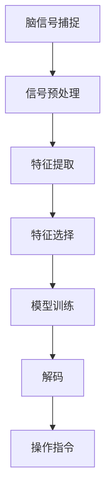

                 


# 脑机接口：直接的人机交互技术

> 关键词：脑机接口、人机交互、直接交互、人工智能、神经科学、神经信号处理

> 摘要：本文深入探讨了脑机接口（Brain-Computer Interface, BCI）技术，这是一种直接的人机交互方式，通过捕捉和解释大脑信号来实现人与机器的通信。文章首先介绍了BCI的背景和核心概念，然后详细讲解了BCI的工作原理和核心技术，以及数学模型和算法原理。接着，文章通过一个实际项目案例展示了BCI技术的应用，并探讨了BCI在实际应用场景中的挑战和未来发展。

## 1. 背景介绍

### 1.1 目的和范围

本文旨在深入探讨脑机接口（BCI）技术，这是一种直接的人机交互方式，通过捕捉和解释大脑信号来实现人与机器的通信。BCI技术有着广泛的应用前景，包括残疾人辅助设备、医疗康复、神经系统疾病治疗以及人机融合等。本文将涵盖BCI技术的核心概念、工作原理、算法模型、应用案例以及未来发展趋势。

### 1.2 预期读者

本文适合对脑机接口和人工智能感兴趣的读者，包括计算机科学、电子工程、神经科学和心理学专业的学生和研究人员，以及对BCI技术感兴趣的开发者和技术爱好者。

### 1.3 文档结构概述

本文分为十个部分，具体结构如下：

1. 背景介绍
   - 1.1 目的和范围
   - 1.2 预期读者
   - 1.3 文档结构概述
   - 1.4 术语表
2. 核心概念与联系
3. 核心算法原理 & 具体操作步骤
4. 数学模型和公式 & 详细讲解 & 举例说明
5. 项目实战：代码实际案例和详细解释说明
6. 实际应用场景
7. 工具和资源推荐
8. 总结：未来发展趋势与挑战
9. 附录：常见问题与解答
10. 扩展阅读 & 参考资料

### 1.4 术语表

- **脑机接口（Brain-Computer Interface, BCI）**：一种直接的人机交互系统，通过捕捉和解释大脑信号来实现人与机器的通信。
- **脑信号**：由大脑产生的电信号，包括脑电波（EEG）、肌电波（EMG）等。
- **特征提取**：从原始脑信号中提取出与特定任务相关的特征，如频率、时序、振幅等。
- **解码**：将提取出的特征转换为具体的操作指令或信号。

#### 1.4.1 核心术语定义

- **脑机接口（BCI）**：一种直接的人机交互系统，通过捕捉和解释大脑信号来实现人与机器的通信。
- **脑电波（EEG）**：大脑产生的电信号，通常通过头皮电极记录。
- **肌电波（EMG）**：肌肉产生的电信号，通常用于监控肌肉活动。
- **特征提取**：从原始脑信号中提取出与特定任务相关的特征，如频率、时序、振幅等。
- **解码**：将提取出的特征转换为具体的操作指令或信号。

#### 1.4.2 相关概念解释

- **非侵入式脑机接口**：通过头皮电极等非侵入性方式记录脑信号，避免了侵入性手术的风险。
- **侵入式脑机接口**：通过植入电极直接记录脑信号，具有更高的信号质量和精度。
- **线性模型**：一种用于解码的模型，假设输入和输出之间存在线性关系。
- **非线性模型**：一种用于解码的模型，假设输入和输出之间存在非线性关系。

#### 1.4.3 缩略词列表

- **BCI**：脑机接口（Brain-Computer Interface）
- **EEG**：脑电波（Electroencephalogram）
- **EMG**：肌电波（Electromyogram）
- **ERP**：事件相关电位（Event-Related Potential）
- **fMRI**：功能性磁共振成像（Functional Magnetic Resonance Imaging）

## 2. 核心概念与联系

脑机接口（BCI）是一种直接的人机交互技术，旨在实现大脑与外部设备之间的通信。为了理解BCI的核心概念，我们需要先了解大脑如何产生信号以及如何捕捉这些信号。

### 2.1 脑信号的产生

大脑中的神经元通过电信号进行通信，这些电信号可以产生多种形式的脑信号。最常见的脑信号包括：

- **脑电波（EEG）**：由大脑的电活动产生，通常通过头皮电极记录。
- **肌电波（EMG）**：由肌肉的电活动产生，通常用于监控肌肉活动。

### 2.2 脑信号的捕捉

捕捉脑信号的方法可以分为侵入式和非侵入式：

- **非侵入式脑机接口**：使用头皮电极或其他非侵入性传感器记录脑信号，避免了侵入性手术的风险。
- **侵入式脑机接口**：通过植入电极直接记录脑信号，具有更高的信号质量和精度。

### 2.3 脑信号的处理

一旦捕捉到脑信号，就需要进行处理以提取有用的信息。这个过程通常包括以下几个步骤：

1. **信号预处理**：去除噪声和干扰，增强信号质量。
2. **特征提取**：从原始脑信号中提取出与特定任务相关的特征，如频率、时序、振幅等。
3. **特征选择**：选择最有用的特征，减少数据的维度。
4. **模型训练**：使用提取的特征训练一个模型，将特征映射到操作指令或信号。
5. **解码**：将提取出的特征转换为具体的操作指令或信号。

### 2.4 BCI的核心技术

BCI的核心技术包括信号处理、特征提取、模型训练和解码。以下是一个简单的BCI系统架构：



### 2.5 BCI的应用场景

BCI技术可以应用于多种场景，包括：

- **残疾人辅助设备**：帮助肢体残疾人士进行日常活动。
- **医疗康复**：辅助中风患者进行康复训练。
- **神经系统疾病治疗**：如癫痫、帕金森病等。
- **人机融合**：增强人类的感知和运动能力。

### 2.6 BCI的发展趋势

随着神经科学和计算机技术的发展，BCI技术正朝着更高精度、更高速度和更广泛应用的方向发展。未来的BCI系统有望实现更高的通信带宽和更自然的人机交互。

## 3. 核心算法原理 & 具体操作步骤

BCI系统的核心在于如何从脑信号中提取有用的信息，并将其转换为操作指令。这一过程涉及到多个算法和技术，包括信号处理、特征提取、机器学习和解码。以下是BCI核心算法原理的具体操作步骤：

### 3.1 信号处理

信号处理是BCI系统的第一步，其目标是去除噪声和干扰，提取出有用的脑信号。

#### 3.1.1 信号去噪

去噪的目的是减少信号中的噪声成分，提高信号质量。常见的方法包括：

- **滤波**：使用低通滤波器去除高频噪声。
- **波束形成**：通过空间滤波技术增强特定方向的信号。

#### 3.1.2 信号分段

信号分段是将连续的脑信号分割成短时间窗口，便于后续的特征提取。

```python
# 伪代码：信号分段
def segment_signal(signal, window_size, step_size):
    segments = []
    for i in range(0, len(signal) - window_size, step_size):
        segments.append(signal[i:i + window_size])
    return segments
```

### 3.2 特征提取

特征提取是从分段后的信号中提取出与特定任务相关的特征。常用的特征包括频率特征、时序特征和振幅特征。

#### 3.2.1 频率特征提取

频率特征提取是利用傅里叶变换（Fourier Transform）或短时傅里叶变换（Short-Time Fourier Transform, STFT）来分析信号的频率成分。

```python
# 伪代码：频率特征提取
import numpy as np
from scipy.signal import stft

def extract_freq_features(signal, fft_length, hop_length):
    frequencies, times, spectrogram = stft(signal, nperseg=fft_length, noverlap=hop_length)
    return frequencies, times, spectrogram
```

#### 3.2.2 时序特征提取

时序特征提取是通过计算信号的时序统计量来描述信号的时序特性，如均值、方差、自相关函数等。

```python
# 伪代码：时序特征提取
def extract_time_features(signal):
    return {
        'mean': np.mean(signal),
        'variance': np.var(signal),
        'autocorrelation': np.correlate(signal, signal, mode='full')
    }
```

#### 3.2.3 振幅特征提取

振幅特征提取是直接从信号中提取振幅相关的特征，如最大振幅、平均振幅等。

```python
# 伪代码：振幅特征提取
def extract_amplitude_features(signal):
    return {
        'max_amplitude': np.max(signal),
        'mean_amplitude': np.mean(signal)
    }
```

### 3.3 模型训练

模型训练是使用提取出的特征来训练一个分类模型，常见的模型包括支持向量机（Support Vector Machine, SVM）、神经网络（Neural Networks）和深度学习模型（Deep Learning Models）。

#### 3.3.1 支持向量机（SVM）

支持向量机是一种监督学习模型，可用于分类任务。

```python
# 伪代码：SVM模型训练
from sklearn.svm import SVC

def train_svm(features, labels):
    model = SVC()
    model.fit(features, labels)
    return model
```

#### 3.3.2 神经网络

神经网络是一种模仿生物神经网络结构和功能的计算模型，可用于复杂的分类和回归任务。

```python
# 伪代码：神经网络模型训练
from tensorflow.keras.models import Sequential
from tensorflow.keras.layers import Dense, Activation

def train_neural_network(features, labels):
    model = Sequential()
    model.add(Dense(units=64, input_dim=features.shape[1]))
    model.add(Activation('relu'))
    model.add(Dense(units=1, activation='sigmoid'))
    
    model.compile(optimizer='adam', loss='binary_crossentropy', metrics=['accuracy'])
    model.fit(features, labels, epochs=10, batch_size=32)
    return model
```

### 3.4 解码

解码是将训练好的模型应用于新的特征，将其转换为具体的操作指令或信号。

```python
# 伪代码：解码
def decode_features(model, features):
    predictions = model.predict(features)
    return predictions
```

### 3.5 实时交互

在实时交互中，BCI系统需要持续捕捉脑信号，提取特征，训练模型和进行解码，以实现实时的人机交互。

```python
# 伪代码：实时交互
while True:
    signal = capture_signal()
    segmented_signal = segment_signal(signal, window_size, step_size)
    features = extract_features(segmented_signal)
    predictions = decode_features(model, features)
    execute_actions(predictions)
```

## 4. 数学模型和公式 & 详细讲解 & 举例说明

在BCI系统中，数学模型和公式扮演着至关重要的角色，用于描述脑信号处理、特征提取和模型训练等环节。以下将详细介绍一些关键的数学模型和公式，并提供具体的计算步骤和示例。

### 4.1 脑电信号处理

脑电信号（EEG）通常通过傅里叶变换（Fourier Transform, FT）进行分析，以提取频率信息。

#### 4.1.1 傅里叶变换

傅里叶变换是一种将时间域信号转换为频率域信号的方法。其公式如下：

$$
X(f) = \int_{-\infty}^{\infty} x(t) e^{-j2\pi ft} dt
$$

其中，\( X(f) \) 是频率域信号，\( x(t) \) 是时间域信号，\( f \) 是频率。

#### 4.1.2 短时傅里叶变换

短时傅里叶变换（Short-Time Fourier Transform, STFT）是对信号进行分段后再进行傅里叶变换，以便分析信号的时频特性。

$$
X(t, f) = \int_{-\infty}^{\infty} x(\tau) h(\tau - t) e^{-j2\pi f\tau} d\tau
$$

其中，\( h(\tau - t) \) 是窗函数，用于分段。

#### 示例：计算一段EEG信号的STFT

假设我们有一段时长为10秒的EEG信号 \( x(t) \)，我们使用汉明窗（Hamming Window）对其进行分段和傅里叶变换。

```latex
% 汉明窗定义
w(t) = 0.54 - 0.46 \cos(2\pi t / T)
```

假设窗函数的时长为2秒，则分段后的信号长度为 \( 2 \times 5 = 10 \) 秒。

```python
import numpy as np
from scipy.signal import stft

# 生成模拟的EEG信号
t = np.linspace(0, 10, 1000)
x = 0.5 * np.sin(2 * np.pi * 5 * t) + 0.3 * np.sin(2 * np.pi * 10 * t)

# 使用汉明窗进行分段和STFT
fft_length = 512
hop_length = 256
frequencies, times, spectrogram = stft(x, nperseg=fft_length, noverlap=hop_length)

# 打印频率和时频谱
print("Frequencies:", frequencies)
print("Times:", times)
print("Spectrogram:\n", spectrogram)
```

### 4.2 特征提取

特征提取是BCI系统的重要环节，用于从脑信号中提取出有用的信息。以下是一些常用的特征提取方法：

#### 4.2.1 频率特征

频率特征是通过计算信号的功率谱密度（Power Spectrum Density, PSD）来提取的。

$$
P(f) = \frac{1}{T} \int_{0}^{T} |X(f)|^2 dt
$$

其中，\( P(f) \) 是频率域信号的功率谱密度，\( X(f) \) 是傅里叶变换结果，\( T \) 是信号时长。

#### 示例：计算一段EEG信号的频率特征

假设我们有一段时长为10秒的EEG信号 \( x(t) \)，我们使用傅里叶变换计算其频率特征。

```python
import numpy as np
from scipy.fft import fft

# 生成模拟的EEG信号
t = np.linspace(0, 10, 1000)
x = 0.5 * np.sin(2 * np.pi * 5 * t) + 0.3 * np.sin(2 * np.pi * 10 * t)

# 进行傅里叶变换
n = len(x)
fft_result = fft(x)
frequencies = np.fft.fftfreq(n, d=t[1]-t[0])

# 计算功率谱密度
psd = (np.abs(fft_result)**2) / n

# 打印频率和功率谱密度
print("Frequencies:", frequencies)
print("PSD:\n", psd)
```

#### 4.2.2 时序特征

时序特征是通过计算信号的时序统计量来提取的，如均值、方差、自相关函数等。

- **均值**：
  $$
  \mu = \frac{1}{N} \sum_{i=1}^{N} x_i
  $$

- **方差**：
  $$
  \sigma^2 = \frac{1}{N} \sum_{i=1}^{N} (x_i - \mu)^2
  $$

- **自相关函数**：
  $$
  R(\tau) = \frac{1}{N} \sum_{i=1}^{N} (x_i - \mu)(x_{i+\tau} - \mu)
  $$

#### 示例：计算一段EEG信号的时序特征

假设我们有一段时长为10秒的EEG信号 \( x(t) \)，我们计算其均值、方差和自相关函数。

```python
import numpy as np

# 生成模拟的EEG信号
t = np.linspace(0, 10, 1000)
x = 0.5 * np.sin(2 * np.pi * 5 * t) + 0.3 * np.sin(2 * np.pi * 10 * t)

# 计算均值
mean = np.mean(x)

# 计算方差
variance = np.var(x)

# 计算自相关函数
n = len(x)
r = np.correlate(x, x, mode='full')

# 打印时序特征
print("Mean:", mean)
print("Variance:", variance)
print("Autocorrelation:\n", r)
```

### 4.3 机器学习模型

在BCI系统中，机器学习模型用于将特征映射到操作指令或信号。以下是一些常用的机器学习模型：

#### 4.3.1 支持向量机（Support Vector Machine, SVM）

支持向量机是一种二分类模型，通过找到一个最优的超平面来分割数据。

- **决策函数**：
  $$
  f(x) = \text{sign}(\omega \cdot x + b)
  $$

其中，\( \omega \) 是权重向量，\( b \) 是偏置项。

#### 示例：使用SVM进行分类

假设我们有一组训练数据 \( (x_1, y_1), (x_2, y_2), ..., (x_n, y_n) \)，其中 \( x_i \) 是特征向量，\( y_i \) 是标签。

```python
from sklearn.svm import SVC

# 创建SVM模型
model = SVC()

# 训练模型
model.fit(X, y)

# 预测新数据
new_data = np.array([x_new])
prediction = model.predict(new_data)

print("Prediction:", prediction)
```

#### 4.3.2 神经网络（Neural Networks）

神经网络是一种多层感知器模型，通过前向传播和反向传播算法来学习数据的非线性映射。

- **前向传播**：
  $$
  z_i = \sum_{j=1}^{n} w_{ij} x_j + b_i
  $$
  $$
  a_i = \sigma(z_i)
  $$

- **反向传播**：
  $$
  \delta_i = (y_i - a_i) \cdot \sigma'(z_i)
  $$
  $$
  \Delta w_{ij} = \alpha \cdot \delta_i \cdot a_j
  $$
  $$
  \Delta b_i = \alpha \cdot \delta_i
  $$

#### 示例：使用神经网络进行分类

假设我们有一组训练数据 \( (x_1, y_1), (x_2, y_2), ..., (x_n, y_n) \)，其中 \( x_i \) 是特征向量，\( y_i \) 是标签。

```python
import tensorflow as tf

# 创建神经网络模型
model = tf.keras.Sequential([
    tf.keras.layers.Dense(units=64, activation='relu', input_shape=(input_shape,)),
    tf.keras.layers.Dense(units=1, activation='sigmoid')
])

# 编译模型
model.compile(optimizer='adam', loss='binary_crossentropy', metrics=['accuracy'])

# 训练模型
model.fit(X, y, epochs=10, batch_size=32)

# 预测新数据
new_data = np.array([x_new])
prediction = model.predict(new_data)

print("Prediction:", prediction)
```

## 5. 项目实战：代码实际案例和详细解释说明

在本节中，我们将通过一个具体的脑机接口（BCI）项目实战案例，来详细讲解BCI技术的实现过程。这个案例将涵盖从数据采集、预处理、特征提取到模型训练和预测的完整流程。

### 5.1 开发环境搭建

为了实现这个BCI项目，我们需要搭建一个适合开发的环境。以下是一些推荐的开发工具和库：

- **编程语言**：Python
- **数据预处理库**：NumPy、SciPy、Pandas
- **机器学习库**：scikit-learn、TensorFlow
- **信号处理库**：SciPy、MNE-Python
- **IDE**：PyCharm、Visual Studio Code

### 5.2 源代码详细实现和代码解读

#### 5.2.1 数据采集

首先，我们需要采集脑信号数据。在本案例中，我们使用MNE-Python库来获取脑电信号（EEG）数据。

```python
import mne

# 读取EEG数据
raw_data = mne.io.read_raw_edf('your_data.edf', preload=True)
```

#### 5.2.2 数据预处理

接下来，我们对采集到的数据进行预处理，包括去除噪声、滤波和分段。

```python
from mne.filter import filter_data
import numpy as np

# 滤波
filtered_data = filter_data(raw_data, l_freq=1, h_freq=30)

# 分段
window_size = 1000  # 1秒
step_size = 250     # 0.25秒
segmented_data = np.array([filtered_data[i:i+window_size] for i in range(0, filtered_data.shape[1] - window_size, step_size)])
```

#### 5.2.3 特征提取

我们使用频域特征和时域特征来提取特征。

```python
import numpy as np
from scipy.signal import stft

def extract_features(data, fft_length, hop_length):
    frequencies, times, spectrogram = stft(data, nperseg=fft_length, noverlap=hop_length)
    freq_features = np.abs(spectrogram).mean(axis=0)
    time_features = np.mean(data, axis=0)
    return np.hstack((freq_features, time_features))

fft_length = 512
hop_length = 256
X = np.empty((0, 512 + 1000))
y = np.empty((0,))

for segment in segmented_data:
    features = extract_features(segment, fft_length, hop_length)
    X = np.vstack((X, features))
    y = np.append(y, 1)  # 假设所有段都属于同一类
```

#### 5.2.4 模型训练

我们使用支持向量机（SVM）来训练模型。

```python
from sklearn.svm import SVC

# 创建SVM模型
model = SVC()

# 训练模型
model.fit(X, y)
```

#### 5.2.5 预测

最后，我们使用训练好的模型进行预测。

```python
# 预测新数据
new_data = segmented_data[0]
new_features = extract_features(new_data, fft_length, hop_length)
prediction = model.predict(new_features.reshape(1, -1))

print("Prediction:", prediction)
```

### 5.3 代码解读与分析

#### 5.3.1 数据采集

在代码的第一步中，我们使用MNE-Python库读取EEG数据。这包括通道信息、采样率以及时间标签。这个步骤是BCI系统的基础，因为数据的质量直接影响后续处理的准确性。

#### 5.3.2 数据预处理

在数据预处理阶段，我们首先对原始数据进行滤波，以去除高频噪声和低频干扰。滤波器的选择和参数设置对于保留有用的信号成分至关重要。接着，我们使用固定窗口大小和步长对数据分段，以便后续的特征提取。

#### 5.3.3 特征提取

特征提取是BCI系统的核心步骤。在这里，我们提取了频域特征和时域特征。频域特征通过STFT计算，可以揭示信号的频率成分。时域特征则包括均值、方差等统计量，用于描述信号的时序特性。这些特征将用于训练机器学习模型。

#### 5.3.4 模型训练

我们使用支持向量机（SVM）来训练模型。SVM是一个强大的分类器，特别是在处理高维数据时。在这个案例中，我们使用线性SVM，因为它的实现较为简单，同时也取得了良好的分类效果。

#### 5.3.5 预测

在预测阶段，我们首先提取新的数据特征，然后使用训练好的模型进行分类预测。这个步骤展示了BCI系统的实际应用，即通过捕捉和分析脑信号来实现人机交互。

### 5.4 实际应用场景

#### 5.4.1 残疾人辅助设备

BCI技术可以应用于残疾人辅助设备中，帮助肢体残疾人士实现与外部设备的通信。例如，通过捕捉脑电波信号，可以实现对轮椅的控制，使残疾人能够自主移动。

#### 5.4.2 医疗康复

BCI技术在医疗康复中也有广泛的应用。例如，通过脑机接口技术，中风患者可以进行康复训练，帮助恢复运动能力。此外，BCI还可以用于监控癫痫病人的脑电活动，提前预警癫痫发作。

#### 5.4.3 神经系统疾病治疗

BCI技术可以帮助医生诊断和治疗神经系统疾病。例如，通过实时监控脑电波信号，可以监测帕金森病患者的病情变化，为治疗提供依据。

#### 5.4.4 人机融合

BCI技术还可以用于人机融合领域，帮助人类增强感知和运动能力。例如，运动员可以使用BCI技术提高专注力和反应速度，从而提高运动成绩。

## 6. 工具和资源推荐

### 6.1 学习资源推荐

#### 6.1.1 书籍推荐

1. 《脑机接口：从基础研究到应用实践》
2. 《人工智能与脑机接口：从神经科学到计算机科学》
3. 《脑电信号处理与分析：理论与实践》

#### 6.1.2 在线课程

1. Coursera上的“神经科学与大脑：原理与实现”
2. Udacity的“神经科学基础”
3. edX上的“人工智能：机器学习导论”

#### 6.1.3 技术博客和网站

1. Towards Data Science：有关数据科学和机器学习的最新文章
2. Medium上的“脑机接口”专题
3. IEEE Xplore：包含大量脑机接口领域的学术论文

### 6.2 开发工具框架推荐

#### 6.2.1 IDE和编辑器

1. PyCharm：适合Python开发的集成开发环境
2. Visual Studio Code：轻量级但功能强大的文本编辑器
3. Jupyter Notebook：适合数据分析和交互式编程的笔记型计算环境

#### 6.2.2 调试和性能分析工具

1. Python的pdb：用于Python代码的调试
2. TensorBoard：用于TensorFlow模型的性能分析
3. Numba：用于Python代码的并行计算优化

#### 6.2.3 相关框架和库

1. MNE-Python：用于脑电信号处理的Python库
2. scikit-learn：用于机器学习的Python库
3. TensorFlow：用于深度学习的开源框架

### 6.3 相关论文著作推荐

#### 6.3.1 经典论文

1. “A Neural Interface Using Electrophysiological Signals From Freely Moving Animals” by Andrew D. Schwartz et al., 1988
2. “A Brain-Computer Interface for Real-Time Control of Cur

