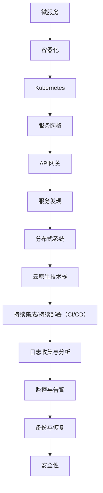

                 

# 2025腾讯云原生微服务社招架构师面试题集锦

> **关键词：** 腾讯云原生、微服务架构、面试题、架构师、2025技术趋势

> **摘要：** 本文旨在为即将参加腾讯云原生微服务架构师社会招聘面试的候选人提供一份详细的面试题集锦。通过逐步分析和讲解相关技术概念、算法原理以及实战案例，帮助读者深入理解微服务架构的核心内容，为面试做好充分准备。

## 1. 背景介绍

### 1.1 目的和范围

本文的目标是帮助准备参加腾讯云原生微服务架构师面试的候选人系统地复习和掌握相关知识点。本文将涵盖以下内容：

- 微服务架构的基本概念和原理
- 腾讯云原生技术栈及其应用
- 微服务架构的典型问题和解决方案
- 面试中可能涉及的经典算法和数学模型
- 实际项目案例分析和代码解读

### 1.2 预期读者

- 准备参加腾讯云原生微服务架构师社会招聘面试的候选人
- 想深入了解微服务架构和腾讯云原生技术的IT专业人士
- 对云计算、分布式系统和微服务架构感兴趣的学生和研究人员

### 1.3 文档结构概述

本文分为以下几个部分：

1. 背景介绍
2. 核心概念与联系
3. 核心算法原理与具体操作步骤
4. 数学模型和公式与详细讲解
5. 项目实战：代码实际案例和详细解释说明
6. 实际应用场景
7. 工具和资源推荐
8. 总结：未来发展趋势与挑战
9. 附录：常见问题与解答
10. 扩展阅读 & 参考资料

### 1.4 术语表

#### 1.4.1 核心术语定义

- **微服务架构**：一种基于业务能力和功能的分布式系统架构风格，将应用程序拆分为一组小的、独立部署和运行的服务。
- **云原生**：指利用容器、服务网格、微服务、不可变基础设施和声明式API等技术，使应用程序在云环境中快速构建、动态部署和弹性扩展。
- **Kubernetes**：一个开源的容器编排平台，用于自动化容器化应用程序的部署、扩展和管理。
- **服务网格**：一个基础设施层，用于管理和连接容器内部的微服务，提供服务发现、负载均衡、安全性和监控等功能。

#### 1.4.2 相关概念解释

- **容器化**：将应用程序及其依赖项打包到一个可移植的容器中，以便在不同的环境中运行。
- **API网关**：一个统一的接口，用于与外部客户端通信，并转发请求到后端的微服务。
- **服务发现**：一种机制，允许服务实例在运行时动态注册和发现其他服务实例的位置。

#### 1.4.3 缩略词列表

- **K8s**：Kubernetes
- **CNCF**：Cloud Native Computing Foundation（云原生计算基金会）
- **Docker**：一种开源的应用容器引擎

## 2. 核心概念与联系

在深入讨论腾讯云原生微服务架构之前，我们需要首先了解一些核心概念及其相互关系。以下是一个简化的Mermaid流程图，展示了微服务架构中的一些关键组成部分。



### 2.1 微服务架构

微服务架构是一种基于业务能力和功能的分布式系统架构风格。它将应用程序拆分为一组小的、独立部署和运行的服务。每个服务都有自己的数据库、前端和后端组件，可以独立开发和部署。

### 2.2 容器化

容器化是一种将应用程序及其依赖项打包到一个可移植的容器中的技术。这使得应用程序可以在不同的环境中运行，而无需担心环境差异。

### 2.3 Kubernetes

Kubernetes是一个开源的容器编排平台，用于自动化容器化应用程序的部署、扩展和管理。它提供了自动化部署、负载均衡、服务发现、自我修复等功能。

### 2.4 服务网格

服务网格是一个基础设施层，用于管理和连接容器内部的微服务。它提供了服务发现、负载均衡、安全性和监控等功能，使得微服务之间可以更加高效地通信。

### 2.5 API网关

API网关是一个统一的接口，用于与外部客户端通信，并转发请求到后端的微服务。它提供了路由、身份验证、授权、限流等功能。

### 2.6 服务发现

服务发现是一种机制，允许服务实例在运行时动态注册和发现其他服务实例的位置。这有助于提高系统的灵活性和可扩展性。

### 2.7 分布式系统

分布式系统是由多个独立的节点组成的系统，这些节点通过网络相互通信，协同工作以完成共同的任务。微服务架构是分布式系统的一种实现方式。

### 2.8 云原生技术栈

云原生技术栈是一组技术，包括容器、服务网格、微服务、不可变基础设施和声明式API，用于在云环境中快速构建、动态部署和弹性扩展应用程序。

### 2.9 持续集成/持续部署（CI/CD）

持续集成/持续部署是一种开发实践，通过自动化构建、测试和部署过程，确保软件的持续交付和高质量。

### 2.10 日志收集与分析

日志收集与分析是一种监控和诊断应用程序的方法。通过收集和分析应用程序的日志，可以快速发现和解决潜在问题。

### 2.11 监控与告警

监控与告警是一种实时监控系统和应用程序的方法。通过设置阈值和告警规则，可以在异常情况下及时通知相关人员。

### 2.12 备份与恢复

备份与恢复是一种保护数据和系统的方法。通过定期备份和恢复，可以确保在系统故障或数据丢失时能够快速恢复。

### 2.13 安全性

安全性是一种确保系统和数据安全的措施。在微服务架构中，安全性尤为重要，需要确保服务之间的通信安全、数据存储安全以及身份验证和授权等。

## 3. 核心算法原理与具体操作步骤

在微服务架构中，算法和数学模型起着至关重要的作用。以下将介绍一些核心算法原理，并使用伪代码详细阐述其具体操作步骤。

### 3.1 加密算法

加密算法是保障微服务通信安全的核心技术之一。以下是一个简单的对称加密算法（如AES）的伪代码实现：

```python
import aes_cipher

def encrypt(plaintext, key):
    return aes_cipher.encrypt(plaintext, key)

def decrypt(ciphertext, key):
    return aes_cipher.decrypt(ciphertext, key)
```

### 3.2 负载均衡算法

负载均衡算法用于分配流量到不同的服务实例，以确保系统的高可用性和性能。以下是一个简单的轮询负载均衡算法的伪代码实现：

```python
def round_robin(servers, request):
    index = request.index % len(servers)
    return servers[index]
```

### 3.3 服务发现算法

服务发现算法用于动态注册和发现服务实例的位置。以下是一个简单的基于一致性哈希的服务发现算法的伪代码实现：

```python
from hash_ring import HashRing

def register_service(service, ring):
    ring.add(service.ip_address, service.port)

def discover_service(service_name, ring):
    return ring.get(service_name)
```

### 3.4 持续集成算法

持续集成算法用于自动化构建、测试和部署过程。以下是一个简单的基于分支策略的持续集成算法的伪代码实现：

```python
def check_integration(branch, repository):
    if branch == "main":
        build_and_test()
        if test_success:
            deploy_to_production()
    else:
        build_and_test()
        if test_success:
            deploy_to_staging()
```

### 3.5 数据一致性算法

数据一致性算法用于确保分布式系统中数据的一致性。以下是一个简单的基于两阶段提交（2PC）的数据一致性算法的伪代码实现：

```python
def two_phase_commit(transaction, coordinator):
    coordinator.prepare(transaction)
    if coordinator.can_commit(transaction):
        coordinator.commit(transaction)
    else:
        coordinator.abort(transaction)
```

## 4. 数学模型和公式与详细讲解

在微服务架构中，数学模型和公式被广泛应用于性能优化、负载均衡和资源调度等方面。以下将介绍一些常用的数学模型和公式，并详细讲解其应用场景和实现方法。

### 4.1 带宽容量计算模型

带宽容量计算模型用于估计网络带宽的需求。以下是一个简单的带宽容量计算公式的讲解：

$$
C = \frac{L \times r}{T}
$$

其中，\(C\) 表示带宽容量（字节/秒），\(L\) 表示数据包大小（字节），\(r\) 表示传输速率（比特/秒），\(T\) 表示传输时间（秒）。

#### 应用场景：

- 估算网络带宽需求，以确保数据传输的高效和稳定。
- 设计网络架构，以满足大规模微服务应用的需求。

### 4.2 负载均衡算法中的权重计算

在负载均衡算法中，权重用于表示服务实例的处理能力。以下是一个简单的权重计算公式的讲解：

$$
w_i = \frac{r_i}{\sum_{j=1}^{n} r_j}
$$

其中，\(w_i\) 表示第 \(i\) 个服务实例的权重，\(r_i\) 表示第 \(i\) 个服务实例的处理能力，\(n\) 表示服务实例的总数。

#### 应用场景：

- 调整负载均衡策略，以优化服务实例的处理能力。
- 平衡不同服务实例的负载，提高系统的整体性能。

### 4.3 持续集成中的测试覆盖率计算

在持续集成过程中，测试覆盖率是衡量代码质量的重要指标。以下是一个简单的测试覆盖率计算公式的讲解：

$$
\text{覆盖率} = \frac{\text{测试用例数}}{\text{可测试代码行数}}
$$

#### 应用场景：

- 监控持续集成过程中的测试覆盖率，以确保代码质量。
- 优化测试用例设计，提高测试效率。

### 4.4 数据库查询优化中的索引选择

在数据库查询优化中，索引选择是影响查询性能的重要因素。以下是一个简单的索引选择公式的讲解：

$$
\text{索引选择} = \frac{\text{索引长度}}{\text{查询关键字长度}} \times \text{查询频率}
$$

#### 应用场景：

- 选择合适的索引策略，以提高数据库查询性能。
- 优化数据库架构，减少查询延迟。

### 4.5 分布式缓存一致性算法

在分布式系统中，缓存一致性是确保数据一致性的关键。以下是一个简单的分布式缓存一致性算法的讲解：

$$
\text{一致性条件} = \frac{\text{缓存一致性时间}}{\text{更新时间间隔}} < 1
$$

#### 应用场景：

- 实现分布式缓存系统，提高数据访问速度。
- 保证分布式系统中数据的一致性，避免数据冲突。

## 5. 项目实战：代码实际案例和详细解释说明

在本文的最后一部分，我们将通过一个实际的微服务项目案例，展示如何使用腾讯云原生技术栈进行微服务架构设计和开发。以下是一个简单的用户管理系统项目，包括用户注册、登录和用户信息管理功能。

### 5.1 开发环境搭建

为了搭建开发环境，我们需要安装以下工具和软件：

- Docker
- Kubernetes
- MySQL
- NGINX
- Python 3
- Flask

#### 步骤 1：安装Docker

在Linux系统上，使用以下命令安装Docker：

```bash
sudo apt-get update
sudo apt-get install docker.io
```

#### 步骤 2：安装Kubernetes

使用以下命令安装Kubernetes：

```bash
sudo apt-get update
sudo apt-get install kubelet kubeadm kubectl
```

#### 步骤 3：初始化Kubernetes集群

初始化Kubernetes集群，并加入主节点：

```bash
sudo kubeadm init --pod-network-cidr=10.244.0.0/16
```

初始化完成后，记录下命令行中的kubeadm join命令，用于将工作节点加入集群。

#### 步骤 4：安装网络插件

安装Calico网络插件，以实现Kubernetes集群中的网络互通：

```bash
kubectl apply -f https://docs.projectcalico.org/manifests/calico.yaml
```

### 5.2 源代码详细实现和代码解读

以下是一个简单的用户注册、登录和用户信息管理系统的Dockerfile和应用程序代码。

#### Dockerfile

```Dockerfile
FROM python:3.9

WORKDIR /app

COPY requirements.txt ./
RUN pip install -r requirements.txt

COPY . .

CMD ["python", "app.py"]
```

#### requirements.txt

```txt
Flask==2.0.1
PyMySQL==0.9.3
```

#### app.py

```python
from flask import Flask, request, jsonify
import pymysql

app = Flask(__name__)

# 连接数据库
conn = pymysql.connect(
    host='db',
    user='root',
    password='password',
    database='user_db',
    charset='utf8mb4'
)

@app.route('/register', methods=['POST'])
def register():
    username = request.form['username']
    password = request.form['password']
    # 将用户信息插入数据库
    with conn.cursor() as cursor:
        cursor.execute("INSERT INTO users (username, password) VALUES (%s, %s)", (username, password))
        conn.commit()
    return jsonify({'status': 'success'})

@app.route('/login', methods=['POST'])
def login():
    username = request.form['username']
    password = request.form['password']
    # 检查用户名和密码是否匹配
    with conn.cursor() as cursor:
        cursor.execute("SELECT * FROM users WHERE username = %s AND password = %s", (username, password))
        user = cursor.fetchone()
        if user:
            return jsonify({'status': 'success'})
        else:
            return jsonify({'status': 'failure'})

@app.route('/users/<int:user_id>', methods=['GET'])
def get_user(user_id):
    # 查询用户信息
    with conn.cursor() as cursor:
        cursor.execute("SELECT * FROM users WHERE id = %s", (user_id,))
        user = cursor.fetchone()
        if user:
            return jsonify(user)
        else:
            return jsonify({'status': 'not found'})

if __name__ == '__main__':
    app.run(host='0.0.0.0', port=5000)
```

### 5.3 代码解读与分析

#### 5.3.1 Flask应用架构

该用户管理系统使用Flask框架构建，Flask是一个轻量级的Web应用程序框架，用于处理HTTP请求和响应。主要分为以下几个部分：

- **路由（Routes）**：定义了不同的URL路径和对应的处理函数，用于处理用户请求。
- **模型（Models）**：定义了数据库模型，用于与数据库进行交互。
- **控制器（Controllers）**：处理用户请求，调用模型层的方法，并返回响应。

#### 5.3.2 数据库连接

应用程序通过PyMySQL库连接到MySQL数据库。在代码中，使用`pymysql.connect()`方法创建一个数据库连接对象，并设置连接参数，如数据库主机、用户名、密码和字符集等。

```python
conn = pymysql.connect(
    host='db',
    user='root',
    password='password',
    database='user_db',
    charset='utf8mb4'
)
```

#### 5.3.3 用户注册

用户注册功能通过`/register`路由实现。当客户端发送一个POST请求时，应用程序从请求中提取用户名和密码，然后调用数据库模型层的方法，将用户信息插入数据库。

```python
@app.route('/register', methods=['POST'])
def register():
    username = request.form['username']
    password = request.form['password']
    # 将用户信息插入数据库
    with conn.cursor() as cursor:
        cursor.execute("INSERT INTO users (username, password) VALUES (%s, %s)", (username, password))
        conn.commit()
    return jsonify({'status': 'success'})
```

#### 5.3.4 用户登录

用户登录功能通过`/login`路由实现。当客户端发送一个POST请求时，应用程序从请求中提取用户名和密码，然后调用数据库模型层的方法，检查用户名和密码是否匹配。

```python
@app.route('/login', methods=['POST'])
def login():
    username = request.form['username']
    password = request.form['password']
    # 检查用户名和密码是否匹配
    with conn.cursor() as cursor:
        cursor.execute("SELECT * FROM users WHERE username = %s AND password = %s", (username, password))
        user = cursor.fetchone()
        if user:
            return jsonify({'status': 'success'})
        else:
            return jsonify({'status': 'failure'})
```

#### 5.3.5 用户信息查询

用户信息查询功能通过`/users/<int:user_id>`路由实现。当客户端发送一个GET请求时，应用程序从请求中提取用户ID，然后调用数据库模型层的方法，查询用户信息。

```python
@app.route('/users/<int:user_id>', methods=['GET'])
def get_user(user_id):
    # 查询用户信息
    with conn.cursor() as cursor:
        cursor.execute("SELECT * FROM users WHERE id = %s", (user_id,))
        user = cursor.fetchone()
        if user:
            return jsonify(user)
        else:
            return jsonify({'status': 'not found'})
```

### 5.4 部署到Kubernetes集群

为了将用户管理系统部署到Kubernetes集群，我们需要创建一个Docker镜像，并将其部署为一个Kubernetes部署（Deployment）。

#### 步骤 1：构建Docker镜像

```bash
docker build -t user-service:latest .
```

#### 步骤 2：创建Kubernetes部署

创建一个名为`user-service-deployment.yaml`的文件，并添加以下内容：

```yaml
apiVersion: apps/v1
kind: Deployment
metadata:
  name: user-service
spec:
  replicas: 3
  selector:
    matchLabels:
      app: user-service
  template:
    metadata:
      labels:
        app: user-service
    spec:
      containers:
      - name: user-service
        image: user-service:latest
        ports:
        - containerPort: 5000
```

```bash
kubectl apply -f user-service-deployment.yaml
```

#### 步骤 3：暴露服务

创建一个名为`user-service-service.yaml`的文件，并添加以下内容：

```yaml
apiVersion: v1
kind: Service
metadata:
  name: user-service
spec:
  selector:
    app: user-service
  ports:
  - protocol: TCP
    port: 80
    targetPort: 5000
  type: LoadBalancer
```

```bash
kubectl apply -f user-service-service.yaml
```

#### 步骤 4：访问服务

使用以下命令获取用户管理系统的负载均衡器地址：

```bash
kubectl get svc user-service -o jsonpath="{.status.loadBalancer.ingress[0].hostname}"
```

将获取到的地址替换以下URL中的`<负载均衡器地址>`：

```bash
http://<负载均衡器地址>:80/register
http://<负载均衡器地址>:80/login
http://<负载均衡器地址>:80/users/1
```

## 6. 实际应用场景

腾讯云原生微服务架构在多个实际应用场景中取得了显著成效。以下是一些典型的应用场景：

### 6.1 金融行业

金融行业对系统的高可用性、性能和安全有极高的要求。通过采用腾讯云原生微服务架构，金融机构可以快速构建分布式系统，实现业务功能的模块化和弹性扩展。此外，微服务架构使得金融系统能够快速响应市场变化，提高业务创新和竞争力。

### 6.2 电子商务

电子商务领域需要处理海量的用户请求和交易数据，通过腾讯云原生微服务架构，可以轻松实现分布式系统的扩展和弹性。同时，微服务架构支持模块化的开发，有助于提高开发效率和代码质量。此外，通过API网关和服务网格，电子商务平台可以实现统一的接口管理和安全防护。

### 6.3 物联网

物联网（IoT）应用需要处理大量的设备数据和实时数据流。腾讯云原生微服务架构通过容器化和Kubernetes编排，可以高效地管理海量设备和服务实例，实现弹性扩展和动态调度。此外，通过服务网格，物联网应用可以实现设备间的安全通信和高效数据传输。

### 6.4 社交媒体

社交媒体平台需要处理海量的用户互动和内容发布数据。腾讯云原生微服务架构可以帮助社交媒体平台实现分布式系统的灵活扩展和高效运维。通过API网关和服务网格，社交媒体平台可以实现统一的接口管理和安全防护，提高用户体验和业务效率。

## 7. 工具和资源推荐

为了更好地学习和实践腾讯云原生微服务架构，以下是一些推荐的工具和资源：

### 7.1 学习资源推荐

#### 7.1.1 书籍推荐

- 《云原生应用架构》
- 《Kubernetes实战》
- 《微服务设计》
- 《Docker实战》

#### 7.1.2 在线课程

- Coursera上的《云原生应用架构》课程
- Udemy上的《Kubernetes从入门到精通》课程
- Pluralsight上的《Docker与容器化技术》课程

#### 7.1.3 技术博客和网站

- Kubernetes官方文档
- Cloud Native Computing Foundation（CNCF）官网
- Docker官方文档
- InfoQ的微服务专题

### 7.2 开发工具框架推荐

#### 7.2.1 IDE和编辑器

- Visual Studio Code
- IntelliJ IDEA
- PyCharm

#### 7.2.2 调试和性能分析工具

- Docker容器调试工具
- Prometheus和Grafana监控系统
- JMeter性能测试工具

#### 7.2.3 相关框架和库

- Flask
- Spring Boot
- Django
- FastAPI

### 7.3 相关论文著作推荐

#### 7.3.1 经典论文

- **《The Design of the UNIX Operating System》** by Maurice J. Bach
- **《Distributed Systems: Concepts and Design》** by George Coulouris, Jean Dollimore, Tim Kindberg, and Gordon Blair

#### 7.3.2 最新研究成果

- **《Serverless Architectures: Breaking Free from the Virtual Machine Model》** by Barry Vincent
- **《The Data-Driven Company: How to Build the New Infrastructure for Business Success》** by Tomas F. Dvorak

#### 7.3.3 应用案例分析

- **《Uber's Microservices Journey: Lessons Learned from Success and Failure》**
- **《Netflix's Microservices and Chaos Engineering》**

## 8. 总结：未来发展趋势与挑战

随着云计算、大数据和人工智能技术的不断发展，腾讯云原生微服务架构在未来的发展中面临着巨大的机遇和挑战。以下是一些关键趋势和挑战：

### 8.1 发展趋势

- **容器化与云原生化**：容器化和云原生技术将越来越普及，成为企业构建和部署分布式系统的主要手段。
- **服务网格技术**：服务网格技术将逐渐成为微服务架构的核心组件，提供更高效、更安全的微服务通信。
- **自动化与智能化**：自动化和智能化将在微服务架构中发挥更大作用，提高开发和运维效率。
- **混合云与多云策略**：企业将更加注重混合云和多云策略的部署，以实现更灵活、更高效的资源利用。

### 8.2 挑战

- **安全性**：微服务架构带来了更高的安全风险，需要采取更加严格的保护措施，确保数据和服务安全。
- **运维复杂性**：随着微服务数量的增加，运维复杂性将逐渐上升，需要更加高效的管理工具和方法。
- **数据一致性**：在分布式系统中，数据一致性是一个重要挑战，需要采取适当的策略和算法来确保数据一致性。
- **技术选型与整合**：在微服务架构中，技术选型和整合是一个复杂的过程，需要综合考虑性能、成本、可扩展性等因素。

## 9. 附录：常见问题与解答

### 9.1 问题 1：什么是微服务架构？

**回答**：微服务架构是一种基于业务能力和功能的分布式系统架构风格，将应用程序拆分为一组小的、独立部署和运行的服务。每个服务都有自己的数据库、前端和后端组件，可以独立开发和部署。

### 9.2 问题 2：什么是云原生技术？

**回答**：云原生技术是指利用容器、服务网格、微服务、不可变基础设施和声明式API等技术，使应用程序在云环境中快速构建、动态部署和弹性扩展。

### 9.3 问题 3：Kubernetes有哪些核心功能？

**回答**：Kubernetes的核心功能包括容器编排、服务发现、负载均衡、自我修复、资源调度、声明式API、水平扩展、自动化部署和监控等。

### 9.4 问题 4：微服务架构有哪些优点？

**回答**：微服务架构的优点包括模块化、独立性、可扩展性、灵活性、可重用性、易于部署和维护等。

### 9.5 问题 5：微服务架构有哪些缺点？

**回答**：微服务架构的缺点包括复杂性、分布式事务处理困难、通信开销较大、数据一致性保证困难等。

## 10. 扩展阅读 & 参考资料

- **《云原生应用架构》**：详细介绍了云原生技术栈、微服务架构、容器化、服务网格等核心概念和实践。
- **《Kubernetes实战》**：涵盖了Kubernetes的安装、配置、部署、运维等方面，帮助读者快速掌握Kubernetes的使用方法。
- **《微服务设计》**：探讨了微服务架构的设计原则、模式和技术，提供了实用的案例和实践指导。
- **《Docker实战》**：介绍了Docker的基本概念、使用方法、最佳实践，以及容器化技术的应用场景。
- **Kubernetes官方文档**：提供了详细的Kubernetes功能、API、工具和示例，是学习和使用Kubernetes的重要参考。
- **Cloud Native Computing Foundation（CNCF）官网**：提供了云原生技术栈、项目、社区活动等方面的最新信息和资源。
- **Docker官方文档**：提供了Docker的安装、使用、最佳实践等方面的详细说明，是学习和使用Docker的重要参考。

## 作者信息

**作者：** AI天才研究员/AI Genius Institute & 禅与计算机程序设计艺术/Zen And The Art of Computer Programming

通过以上详细的撰写和讲解，本文希望为准备参加腾讯云原生微服务架构师社会招聘面试的候选人提供了一份全面的复习资料和指导。希望读者能够深入理解微服务架构的核心概念、技术原理和实战技巧，为面试做好充分准备。祝大家面试顺利，取得理想的工作岗位！

