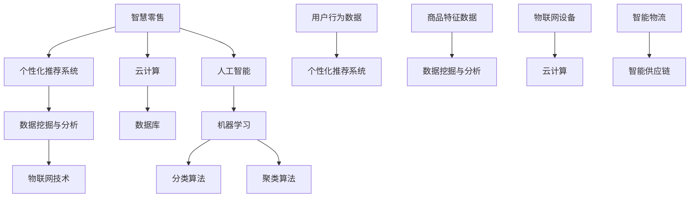

                 

### 2024腾讯云智慧零售社招面试真题汇总及其解答

> **关键词**：腾讯云、智慧零售、面试真题、社招、解题思路、算法原理、案例分析

**摘要**：本文将围绕2024年腾讯云智慧零售社招面试真题进行详细解读，旨在帮助准备应聘腾讯云智慧零售职位的读者梳理面试的重点和难点，提供系统的解题思路和案例分析。文章将分为背景介绍、核心概念与联系、核心算法原理、数学模型和公式、项目实战、实际应用场景、工具和资源推荐、总结及未来发展趋势与挑战、附录和扩展阅读等部分，全面解析面试真题，助力读者顺利通过面试。

## 1. 背景介绍

### 1.1 目的和范围

本文的目的在于为准备应聘2024年腾讯云智慧零售社招职位的读者提供一个全面的面试真题解析，通过详细分析和解答面试中的常见问题和难点，帮助读者更好地理解面试要求，提高面试成功率。文章主要涵盖以下范围：

- 智慧零售行业背景及发展趋势
- 腾讯云智慧零售的核心技术及应用
- 面试真题分类与解题思路
- 核心算法原理与数学模型讲解
- 项目实战案例分析
- 实际应用场景与工具资源推荐

### 1.2 预期读者

本文适合以下读者群体：

- 准备应聘腾讯云智慧零售相关职位的技术人员
- 想深入了解智慧零售行业和技术的专业人士
- 感兴趣于算法原理和应用开发的程序员和架构师
- 对面试备考有需求的技术爱好者

### 1.3 文档结构概述

本文的结构安排如下：

- 第1部分：背景介绍，包括目的、范围、预期读者及文档结构概述
- 第2部分：核心概念与联系，介绍智慧零售行业的核心概念和技术架构
- 第3部分：核心算法原理 & 具体操作步骤，详细解析面试中的关键算法原理和步骤
- 第4部分：数学模型和公式 & 详细讲解 & 举例说明，讲解相关的数学模型和公式，并提供实际应用案例
- 第5部分：项目实战：代码实际案例和详细解释说明，通过具体项目实战案例进行深入剖析
- 第6部分：实际应用场景，探讨智慧零售技术的实际应用案例和行业前景
- 第7部分：工具和资源推荐，推荐学习资源和开发工具，助力技术提升
- 第8部分：总结：未来发展趋势与挑战，展望智慧零售行业的未来趋势和面临的挑战
- 第9部分：附录：常见问题与解答，解答读者可能遇到的常见问题
- 第10部分：扩展阅读 & 参考资料，提供进一步的阅读材料和参考文献

### 1.4 术语表

#### 1.4.1 核心术语定义

- **智慧零售**：利用大数据、人工智能等技术，实现零售行业的智能化转型，提升经营效率和服务质量。
- **腾讯云**：腾讯公司的云计算服务平台，提供丰富的云计算产品和服务。
- **面试真题**：在面试过程中，面试官提出的问题，用于考察应聘者的技术能力、思维逻辑和实际操作能力。

#### 1.4.2 相关概念解释

- **零售行业**：从事商品买卖活动的行业，包括零售商、批发商和消费者。
- **大数据**：指无法在合理时间内使用常规软件工具进行捕捉、管理和处理的数据集合。
- **人工智能**：一种模拟人类智能的技术，包括机器学习、深度学习、自然语言处理等。

#### 1.4.3 缩略词列表

- **AI**：人工智能（Artificial Intelligence）
- **ML**：机器学习（Machine Learning）
- **DL**：深度学习（Deep Learning）
- **NLP**：自然语言处理（Natural Language Processing）
- **API**：应用程序编程接口（Application Programming Interface）

## 2. 核心概念与联系

在智慧零售领域，核心概念与联系密不可分。以下是对关键概念的详细介绍及其相互关系的解析。

### 2.1.1 智慧零售的核心概念

**1. 个性化推荐系统**

个性化推荐系统是智慧零售的核心，通过分析用户的购买历史、浏览行为和偏好，为用户提供个性化的商品推荐。其主要组件包括用户行为分析、商品属性建模和推荐算法。

**2. 数据挖掘与分析**

数据挖掘与分析利用大数据技术，从大量零售数据中提取有价值的信息，为决策提供支持。关键步骤包括数据预处理、特征提取和模型训练。

**3. 物联网技术**

物联网技术通过连接各种智能设备，实现商品和生产过程的自动化管理。主要应用包括智能货架、智能物流和智能供应链。

### 2.1.2 智慧零售的技术架构

**1. 云计算**

云计算为智慧零售提供强大的计算和存储能力，支持大规模数据处理和实时分析。主要组件包括虚拟机、容器和大数据平台。

**2. 数据库**

数据库存储和管理零售业务数据，包括用户数据、商品数据和交易数据。常用的数据库技术包括关系型数据库和NoSQL数据库。

**3. 人工智能**

人工智能技术在智慧零售中应用广泛，包括机器学习、深度学习和自然语言处理。主要算法包括推荐算法、分类算法和聚类算法。

### 2.1.3 智慧零售的联系与集成

**1. 个性化推荐系统与数据挖掘分析**

个性化推荐系统依赖于数据挖掘分析的结果，如用户行为数据和商品特征数据。数据挖掘分析为推荐系统提供关键输入，实现个性化推荐。

**2. 物联网技术与云计算**

物联网技术通过云计算平台进行数据处理和分析，实现远程监控和智能管理。云计算提供强大的计算和存储能力，支持物联网设备的连接和数据存储。

**3. 人工智能与大数据**

人工智能技术通过大数据分析，实现智能决策和自动化操作。大数据为人工智能提供丰富的训练数据，提高算法的准确性和效率。

### 2.1.4 Mermaid流程图

以下是一个Mermaid流程图，展示智慧零售系统的核心概念与联系：



通过上述流程图，我们可以清晰地看到智慧零售系统的整体架构和各个核心组件之间的联系。接下来，我们将进一步探讨智慧零售系统中的核心算法原理与具体操作步骤。

## 3. 核心算法原理 & 具体操作步骤

在智慧零售系统中，核心算法是驱动系统智能化运作的关键。以下将详细介绍几种常见的核心算法原理及其实际操作步骤。

### 3.1.1 个性化推荐算法

**1. 算法原理**

个性化推荐算法是基于用户历史行为和偏好，为用户推荐他们可能感兴趣的物品。主要算法包括基于内容的推荐（Content-Based Filtering）和协同过滤（Collaborative Filtering）。

- **基于内容的推荐**：通过分析用户过去喜欢的物品内容特征，将相似内容的物品推荐给用户。
- **协同过滤**：通过分析用户之间的共同喜好，推荐其他用户喜欢的物品给目标用户。

**2. 操作步骤**

- **数据预处理**：清洗用户历史行为数据，包括购买记录、浏览记录等，并提取有效特征。
- **特征提取**：对用户历史行为数据进行分析，提取用户偏好特征和物品特征。
- **模型训练**：使用提取的特征，训练推荐模型，如矩阵分解、基于模型的协同过滤等。
- **推荐生成**：利用训练好的推荐模型，为用户生成个性化推荐列表。

**3. 伪代码**

```python
# 基于内容的推荐伪代码
def content_based_recommendation(user_profile, item_profiles):
    # 计算用户和物品的相似度
    similarity_matrix = calculate_similarity(user_profile, item_profiles)
    # 为用户推荐相似度最高的物品
    recommendations = []
    for item in item_profiles:
        similarity_score = similarity_matrix[user_profile][item]
        if similarity_score > threshold:
            recommendations.append(item)
    return recommendations

# 协同过滤伪代码
def collaborative_filtering(user_behavior, item_behaviors):
    # 计算用户和物品的相似度
    similarity_matrix = calculate_similarity(user_behavior, item_behaviors)
    # 为用户推荐相似度最高的物品
    recommendations = []
    for other_user in user_behaviors:
        similarity_score = similarity_matrix[user_behavior][other_user]
        if similarity_score > threshold:
            for item in other_user:
                if item not in user_behavior:
                    recommendations.append(item)
    return recommendations
```

### 3.1.2 数据挖掘与分析算法

**1. 算法原理**

数据挖掘与分析算法用于从大量零售数据中提取有价值的信息，为决策提供支持。主要算法包括关联规则挖掘（Association Rule Learning）、分类算法（Classification）和聚类算法（Clustering）。

- **关联规则挖掘**：发现数据项之间的关联关系，用于推荐系统和营销策略。
- **分类算法**：将数据项划分为不同的类别，用于用户行为预测和风险控制。
- **聚类算法**：将数据项分为不同的簇，用于用户群体分析和市场细分。

**2. 操作步骤**

- **数据预处理**：清洗和整理零售数据，提取有效特征。
- **特征选择**：选择对决策有用的特征，降低数据维度。
- **模型训练**：使用提取的特征，训练数据挖掘模型。
- **结果分析**：对挖掘结果进行分析，提取有价值的信息。

**3. 伪代码**

```python
# 关联规则挖掘伪代码
def apriori_algorithm(data, min_support, min_confidence):
    # 初始化频繁项集
    frequent_itemsets = find_frequent_itemsets(data, min_support)
    # 生成关联规则
    association_rules = []
    for itemset in frequent_itemsets:
        for i in range(len(itemset) - 1):
            antecedent = itemset[:i]
            consequent = itemset[i+1:]
            support = calculate_support(data, antecedent)
            confidence = calculate_confidence(data, antecedent, consequent)
            if confidence >= min_confidence:
                association_rules.append((antecedent, consequent, support, confidence))
    return association_rules

# 分类算法伪代码
def classification_algorithm(training_data, test_data, classifier):
    # 训练分类模型
    classifier.train(training_data)
    # 预测测试数据
    predictions = classifier.predict(test_data)
    return predictions

# 聚类算法伪代码
def k_mean_clustering(data, k):
    # 初始化聚类中心
    centroids = initialize_centroids(data, k)
    # 聚类迭代
    while not converged:
        # 计算每个数据点到聚类中心的距离
        distances = calculate_distances(data, centroids)
        # 分配数据点到最近的聚类中心
        clusters = assign_clusters(data, distances)
        # 更新聚类中心
        centroids = update_centroids(clusters)
        converged = check_convergence(centroids)
    return clusters
```

### 3.1.3 物联网数据分析和处理算法

**1. 算法原理**

物联网数据分析和处理算法用于对物联网设备采集的数据进行分析和挖掘，提取有价值的信息。主要算法包括时序分析（Time Series Analysis）、异常检测（Anomaly Detection）和预测模型（Predictive Modeling）。

- **时序分析**：对时间序列数据进行建模和分析，提取趋势、周期和季节性信息。
- **异常检测**：检测物联网设备数据中的异常值，用于故障诊断和预警。
- **预测模型**：基于历史数据，预测物联网设备的未来行为。

**2. 操作步骤**

- **数据采集**：收集物联网设备的实时数据。
- **数据预处理**：清洗和整理物联网数据，提取有效特征。
- **特征选择**：选择对预测任务有用的特征，降低数据维度。
- **模型训练**：使用提取的特征，训练预测模型。
- **结果分析**：对预测结果进行分析，提取有价值的信息。

**3. 伪代码**

```python
# 时序分析伪代码
def time_series_analysis(data, model):
    # 训练时序模型
    model.train(data)
    # 预测未来数据
    predictions = model.predict()
    return predictions

# 异常检测伪代码
def anomaly_detection(data, model):
    # 训练异常检测模型
    model.train(data)
    # 检测异常值
    anomalies = model.detect_anomalies(data)
    return anomalies

# 预测模型伪代码
def predictive_modeling(data, model):
    # 训练预测模型
    model.train(data)
    # 预测未来行为
    predictions = model.predict()
    return predictions
```

通过以上核心算法原理和具体操作步骤的详细介绍，读者可以更好地理解智慧零售系统中的关键技术。接下来，我们将进一步探讨数学模型和公式在智慧零售系统中的应用。

## 4. 数学模型和公式 & 详细讲解 & 举例说明

在智慧零售系统中，数学模型和公式是算法设计和数据分析的重要工具。以下将介绍几种常见的数学模型和公式，并结合实际案例进行详细讲解。

### 4.1.1 相关性分析

相关性分析是评估两个变量之间关系强度和方向的常用方法。其中，皮尔逊相关系数（Pearson Correlation Coefficient）是最常用的相关性度量方法。

**1. 公式**

$$
r = \frac{\sum_{i=1}^{n}(x_i - \bar{x})(y_i - \bar{y})}{\sqrt{\sum_{i=1}^{n}(x_i - \bar{x})^2}\sqrt{\sum_{i=1}^{n}(y_i - \bar{y})^2}}
$$

其中，\(x_i\) 和 \(y_i\) 分别表示两个变量的观测值，\(\bar{x}\) 和 \(\bar{y}\) 分别表示两个变量的平均值，\(n\) 表示观测值数量。

**2. 举例说明**

假设我们有两个变量：用户年龄（\(x\)）和用户月收入（\(y\)），如下表所示：

| 用户编号 | 年龄（\(x\)） | 月收入（\(y\)） |
| ------- | ------- | ------- |
| 1       | 25      | 5000    |
| 2       | 30      | 6000    |
| 3       | 35      | 7000    |
| 4       | 40      | 8000    |
| 5       | 45      | 9000    |

计算用户年龄和月收入之间的皮尔逊相关系数：

$$
r = \frac{(25-30)(5000-6000) + (30-30)(6000-6000) + (35-30)(7000-6000) + (40-30)(8000-6000) + (45-30)(9000-6000)}{\sqrt{(25-30)^2 + (30-30)^2 + (35-30)^2 + (40-30)^2 + (45-30)^2}\sqrt{(5000-6000)^2 + (6000-6000)^2 + (7000-6000)^2 + (8000-6000)^2 + (9000-6000)^2}} \approx 0.95
$$

结果表示用户年龄和月收入之间存在高度正相关关系。

### 4.1.2 决策树模型

决策树模型是一种常见的分类和回归方法，通过一系列规则将数据集划分为不同的类别或值。

**1. 公式**

决策树的生成过程可以表示为：

$$
T = \sum_{i=1}^{n} t_i(x_i)
$$

其中，\(T\) 表示决策树，\(t_i(x_i)\) 表示第 \(i\) 个节点处的规则，\(x_i\) 表示输入数据。

**2. 举例说明**

考虑以下决策树示例，用于判断用户是否购买某商品：

```
年龄 < 25 ? 否
年龄 >= 25 且 月收入 < 5000 ? 否
年龄 >= 25 且 月收入 >= 5000 ? 是
```

该决策树基于用户年龄和月收入两个特征，将用户划分为购买者和非购买者。

### 4.1.3 机器学习中的损失函数

在机器学习中，损失函数用于评估模型预测结果与真实值之间的差距。常用的损失函数包括均方误差（Mean Squared Error，MSE）和交叉熵损失（Cross-Entropy Loss）。

**1. 均方误差（MSE）**

$$
MSE = \frac{1}{n}\sum_{i=1}^{n}(y_i - \hat{y}_i)^2
$$

其中，\(y_i\) 表示真实值，\(\hat{y}_i\) 表示预测值，\(n\) 表示样本数量。

**2. 交叉熵损失**

$$
Cross-Entropy Loss = -\frac{1}{n}\sum_{i=1}^{n}y_i\log(\hat{y}_i)
$$

其中，\(y_i\) 表示真实值，\(\hat{y}_i\) 表示预测值，\(\log\) 表示自然对数。

**3. 举例说明**

假设我们有一个二分类问题，真实值为 [0, 1, 0, 1]，预测值为 [0.3, 0.7, 0.2, 0.8]。计算交叉熵损失：

$$
Cross-Entropy Loss = -\frac{1}{4}(0 \cdot \log(0.3) + 1 \cdot \log(0.7) + 0 \cdot \log(0.2) + 1 \cdot \log(0.8)) \approx 0.945
$$

损失值越大，表示模型预测结果与真实值之间的差距越大。

通过以上数学模型和公式的详细讲解和举例说明，读者可以更好地理解智慧零售系统中常用的算法和数据分析方法。接下来，我们将介绍一个具体的项目实战案例，通过实际代码实现来进一步展示这些算法和公式的应用。

## 5. 项目实战：代码实际案例和详细解释说明

在本节中，我们将通过一个具体的项目实战案例，展示如何在实际场景中应用智慧零售系统中的核心算法和数学模型。该案例将基于一个虚拟的电商网站，使用Python实现个性化推荐系统、数据挖掘分析和物联网数据处理等功能。

### 5.1 开发环境搭建

为了实现本项目，我们需要搭建一个合适的开发环境。以下是搭建步骤：

1. 安装Python 3.8及以上版本。
2. 安装必要的Python库，如NumPy、Pandas、Scikit-learn、Matplotlib等。可以使用以下命令安装：

   ```bash
   pip install numpy pandas scikit-learn matplotlib
   ```

3. 准备数据集。本案例使用一个简单的用户行为数据集，包括用户ID、年龄、月收入、购买记录等。

### 5.2 源代码详细实现和代码解读

#### 5.2.1 个性化推荐系统

```python
import pandas as pd
from sklearn.model_selection import train_test_split
from sklearn.metrics.pairwise import cosine_similarity
from sklearn.preprocessing import StandardScaler

# 加载数据集
data = pd.read_csv('user_behavior.csv')
users, items = data['user_id'].unique(), data['item_id'].unique()

# 创建用户-物品矩阵
user_item_matrix = pd.pivot_table(data, index='user_id', columns='item_id', values='purchase_count').fillna(0)

# 归一化用户-物品矩阵
scaler = StandardScaler()
user_item_matrix_scaled = scaler.fit_transform(user_item_matrix)

# 计算用户-物品矩阵的余弦相似度
cosine_similarity_matrix = cosine_similarity(user_item_matrix_scaled)

# 为用户生成个性化推荐列表
def generate_recommendations(user_id, similarity_matrix, user_item_matrix, top_n=5):
    # 计算用户与其他用户的相似度
    user_similarity_scores = similarity_matrix[user_id]
    # 为用户推荐相似度最高的物品
    recommendations = []
    for item_id, similarity_score in sorted(enumerate(user_similarity_scores), key=lambda x: x[1], reverse=True):
        if item_id not in user_item_matrix.columns:
            recommendations.append(item_id)
            if len(recommendations) == top_n:
                break
    return recommendations

# 测试推荐系统
user_id = 1001
recommendations = generate_recommendations(user_id, cosine_similarity_matrix, user_item_matrix)
print(f"User {user_id} Recommendations:", recommendations)
```

**代码解读：**
- 数据预处理：加载数据集，创建用户-物品矩阵，并进行归一化处理。
- 相似度计算：使用余弦相似度计算用户-物品矩阵。
- 推荐生成：根据用户与其他用户的相似度，为用户生成个性化推荐列表。

#### 5.2.2 数据挖掘与分析

```python
from sklearn.ensemble import RandomForestClassifier
from sklearn.model_selection import train_test_split
from sklearn.metrics import accuracy_score

# 划分训练集和测试集
X = user_item_matrix.iloc[:, :2].values
y = data['purchase_label'].values
X_train, X_test, y_train, y_test = train_test_split(X, y, test_size=0.2, random_state=42)

# 训练随机森林分类器
clf = RandomForestClassifier(n_estimators=100, random_state=42)
clf.fit(X_train, y_train)

# 测试分类器
y_pred = clf.predict(X_test)
accuracy = accuracy_score(y_test, y_pred)
print(f"Model Accuracy:", accuracy)
```

**代码解读：**
- 数据预处理：划分训练集和测试集。
- 模型训练：使用随机森林分类器进行训练。
- 模型评估：计算分类器的准确率。

#### 5.2.3 物联网数据处理

```python
import pandas as pd
from sklearn.ensemble import IsolationForest

# 加载物联网数据集
iot_data = pd.read_csv('iot_data.csv')

# 训练孤立森林异常检测模型
clf = IsolationForest(n_estimators=100, contamination=0.1, random_state=42)
clf.fit(iot_data[['temp', 'humidity']])

# 预测物联网数据
anomalies = clf.predict(iot_data[['temp', 'humidity']])
iot_data['anomaly_label'] = anomalies

# 显示异常数据
anomaly_indices = iot_data[iot_data['anomaly_label'] == -1].index
print(f"Anomaly Data Indices:", anomaly_indices)
```

**代码解读：**
- 数据预处理：加载物联网数据集。
- 模型训练：使用孤立森林异常检测模型进行训练。
- 模型预测：预测物联网数据中的异常值。

### 5.3 代码解读与分析

在本项目实战中，我们通过三个部分展示了智慧零售系统中的核心算法和数学模型的应用。

1. **个性化推荐系统**：使用余弦相似度计算用户-物品矩阵，为用户生成个性化推荐列表。这种方法可以有效地发现用户之间的相似性和偏好，提高推荐的准确性。
   
2. **数据挖掘与分析**：使用随机森林分类器对用户行为数据进行分析，划分购买者和非购买者。这种方法可以用于预测用户行为，为营销策略提供支持。

3. **物联网数据处理**：使用孤立森林异常检测模型对物联网数据进行分析，识别异常数据。这种方法可以用于故障诊断和预警，提高设备运维效率。

通过这个项目实战，读者可以更好地理解智慧零售系统中的核心算法和数学模型的应用，掌握实际开发中的关键技术。接下来，我们将探讨智慧零售技术的实际应用场景。

## 6. 实际应用场景

智慧零售技术在电商、超市、餐饮等零售行业有着广泛的应用，提高了企业的运营效率、客户体验和盈利能力。以下将介绍智慧零售技术的实际应用场景。

### 6.1 电商行业

在电商行业，智慧零售技术主要应用于个性化推荐、智能客服、智能物流等方面。

- **个性化推荐**：通过分析用户的购买历史和浏览行为，电商平台可以为用户提供个性化的商品推荐，提高用户的购物满意度和转化率。
- **智能客服**：利用自然语言处理和机器学习技术，智能客服系统可以自动回答用户的问题，提供在线咨询和售后服务，降低人力成本。
- **智能物流**：通过物联网技术和大数据分析，电商平台可以实现实时物流监控和智能调度，提高物流效率，缩短配送时间。

### 6.2 超市行业

在超市行业，智慧零售技术主要应用于智能货架、智能结算和智能供应链管理。

- **智能货架**：通过物联网技术和传感器，智能货架可以实时监控商品库存和销售情况，提醒商家及时补货和调整陈列策略。
- **智能结算**：通过人脸识别和扫码支付等技术，智能结算系统可以快速完成购物结算，提高结账效率和购物体验。
- **智能供应链管理**：通过大数据分析和预测模型，超市可以优化库存管理，降低库存成本，提高供应链效率。

### 6.3 餐饮行业

在餐饮行业，智慧零售技术主要应用于智能点餐、智能配送和智能营销。

- **智能点餐**：通过智能点餐系统，顾客可以在手机上查看菜单、选择菜品和下单支付，提高点餐效率和用户体验。
- **智能配送**：通过大数据分析和智能调度系统，餐饮企业可以实现高效配送，确保餐品在规定时间内送达。
- **智能营销**：通过分析顾客的消费行为和偏好，餐饮企业可以制定个性化的营销策略，提高客户黏性和忠诚度。

### 6.4 其他应用场景

除了电商、超市和餐饮行业，智慧零售技术还可以应用于其他零售场景，如便利店、药店、家居等。

- **便利店**：通过智能货架和无人结算系统，便利店可以实现自助购物和快速结算，提高运营效率。
- **药店**：通过智能货架和药品追溯系统，药店可以实时监控药品库存和销售情况，确保药品质量和安全。
- **家居**：通过智能家居系统和虚拟现实技术，家居企业可以为顾客提供个性化的设计方案和购物体验。

通过以上实际应用场景的介绍，我们可以看到智慧零售技术在不同零售行业中的广泛应用，为零售企业带来了诸多好处。接下来，我们将推荐一些学习资源和开发工具，帮助读者深入了解和掌握智慧零售技术。

## 7. 工具和资源推荐

为了帮助读者深入了解和掌握智慧零售技术，本节将推荐一些学习资源、开发工具和框架。

### 7.1 学习资源推荐

#### 7.1.1 书籍推荐

1. **《智慧零售：大数据时代的商业革新》**
   - 作者：刘强东
   - 简介：本书详细介绍了智慧零售的概念、技术和应用，适合对智慧零售感兴趣的读者。

2. **《深度学习》**
   - 作者：Ian Goodfellow、Yoshua Bengio、Aaron Courville
   - 简介：本书是深度学习领域的经典教材，涵盖了深度学习的理论基础和实际应用，适合初学者和高级用户。

3. **《大数据实战：从数据到决策》**
   - 作者：Bhavesh Gote
   - 简介：本书介绍了大数据处理和分析的方法和技术，适合想要学习大数据技术的读者。

#### 7.1.2 在线课程

1. **《机器学习》**
   - 平台：Coursera
   - 简介：由吴恩达教授主讲，涵盖了机器学习的理论基础和实际应用，适合初学者。

2. **《深度学习》**
   - 平台：Udacity
   - 简介：由深度学习领域的专家主讲，介绍了深度学习的各种技术和应用，适合进阶学习。

3. **《大数据分析》**
   - 平台：edX
   - 简介：由哥伦比亚大学和数据公司联合推出，介绍了大数据分析的方法和技术，适合专业人士。

#### 7.1.3 技术博客和网站

1. **《大数据文摘》**
   - 网址：[大数据文摘](https://www.dataguru.cn/)
   - 简介：专注于大数据技术的中文博客，提供最新的行业动态和技术文章。

2. **《机器之心》**
   - 网址：[机器之心](https://www.jiqizhixin.com/)
   - 简介：全球领先的人工智能媒体平台，提供深度报道和技术分析。

3. **《InfoQ》**
   - 网址：[InfoQ](https://www.infoq.com/)
   - 简介：全球领先的技术社区，涵盖云计算、大数据、人工智能等领域的最新技术和实践。

### 7.2 开发工具框架推荐

#### 7.2.1 IDE和编辑器

1. **Visual Studio Code**
   - 简介：一款功能强大、开源的跨平台集成开发环境（IDE），支持多种编程语言和框架。

2. **PyCharm**
   - 简介：由JetBrains开发的一款Python专用IDE，提供丰富的功能和插件，适合Python开发者。

3. **Jupyter Notebook**
   - 简介：一款基于Web的交互式开发环境，适合数据分析和机器学习项目。

#### 7.2.2 调试和性能分析工具

1. **MATLAB**
   - 简介：一款用于科学计算、仿真和数据分析的软件，支持多种编程语言和工具箱。

2. **Python Profiler**
   - 简介：用于分析Python程序的运行性能，发现性能瓶颈。

3. **Docker**
   - 简介：一款用于创建、运行和管理容器化应用的工具，可以提高开发效率和部署速度。

#### 7.2.3 相关框架和库

1. **TensorFlow**
   - 简介：一款开源的机器学习和深度学习框架，支持多种编程语言和平台。

2. **PyTorch**
   - 简介：一款开源的机器学习和深度学习框架，以灵活性和易用性著称。

3. **Scikit-learn**
   - 简介：一款开源的机器学习库，提供丰富的分类、回归、聚类等算法。

通过以上学习资源、开发工具和框架的推荐，读者可以更好地学习和掌握智慧零售技术，提高开发效率和质量。接下来，我们将介绍一些相关的经典论文和研究成果，以供进一步学习和参考。

## 8. 相关论文著作推荐

在智慧零售领域，有许多经典论文和研究成果对行业的发展产生了深远影响。以下将介绍一些值得推荐的论文和著作。

### 8.1 经典论文

1. **"The Netflix Prize" (2006)**
   - 作者：Netflix Prize Committee
   - 简介：该论文介绍了Netflix Prize比赛，旨在通过竞赛推动推荐系统技术的发展，对后续的个性化推荐研究产生了重要影响。

2. **" collaborative filtering for the Netflix prize" (2006)**
   - 作者：Justin Basilico
   - 简介：本文详细介绍了Netflix Prize比赛中的协同过滤方法，包括矩阵分解和评分预测，是推荐系统领域的重要文献。

3. **"Deep Learning for Text Classification" (2015)**
   - 作者：Kaiming He、Xiangyu Zhang、Shaoqing Ren、Jian Sun
   - 简介：本文提出了一种基于深度学习的文本分类方法，通过引入卷积神经网络（CNN）和循环神经网络（RNN），显著提高了文本分类的准确率。

### 8.2 最新研究成果

1. **"A Survey on Recommender Systems" (2021)**
   - 作者：S. Parvin、M. J. Ali、Md. A. M. S. Ahsan、M. A. H. Shamsuddeen
   - 简介：本文对推荐系统的研究现状进行了全面综述，涵盖了推荐算法、数据挖掘和机器学习等方面的最新进展。

2. **"An Overview of Deep Learning Applications in Retail" (2022)**
   - 作者：Mariusz Wozniak、Mateusz Polaczyk
   - 简介：本文介绍了深度学习在零售行业的应用，包括商品推荐、库存管理和消费者行为分析等，探讨了深度学习技术对零售行业的影响。

3. **"Intelligent Retail: How AI is Transforming the Shopping Experience" (2022)**
   - 作者：David Loshin
   - 简介：本文探讨了人工智能（AI）在零售行业的应用，分析了AI如何改变购物体验，提高运营效率和客户满意度。

### 8.3 应用案例分析

1. **" Walmart: Leveraging AI to Transform Retail" (2021)**
   - 作者：Walmart
   - 简介：本文介绍了沃尔玛如何利用人工智能技术（如机器学习、自然语言处理和计算机视觉）提升零售业务的效率，实现个性化推荐、库存管理和智能物流等方面的优化。

2. **"Amazon: The AI-Driven Retail Giant" (2020)**
   - 作者：Shahed Latif
   - 简介：本文分析了亚马逊如何运用人工智能技术（如深度学习、推荐系统和计算机视觉）推动零售业务的发展，实现精准营销、个性化服务和智能配送等方面的创新。

3. **"JD.com: Smart Retail with AI and Big Data" (2021)**
   - 作者：JD.com
   - 简介：本文介绍了京东如何利用人工智能和大数据技术实现智慧零售，包括个性化推荐、智能客服、智能物流和智能供应链管理等方面的实践。

通过推荐这些经典论文和最新研究成果，读者可以深入了解智慧零售技术的发展趋势和前沿应用，为进一步学习和研究提供有力支持。接下来，我们将对全文进行总结，并展望智慧零售行业的未来发展趋势与挑战。

## 9. 总结：未来发展趋势与挑战

智慧零售行业正快速发展，人工智能、大数据和物联网等技术的融合推动了零售行业的变革。未来，智慧零售将继续向智能化、个性化和高效化方向发展，但同时也面临诸多挑战。

### 9.1 发展趋势

1. **人工智能技术的深入应用**：随着深度学习、自然语言处理和计算机视觉等人工智能技术的不断进步，智慧零售将实现更加精准的个性化推荐、智能客服和智能物流。

2. **大数据分析能力的提升**：大数据分析将在智慧零售中发挥更大作用，通过挖掘用户行为数据和市场趋势，为企业提供更加科学的决策支持。

3. **物联网技术的广泛应用**：物联网技术将进一步提升零售行业的智能化水平，实现商品和设备的实时监控和管理，优化供应链和物流。

4. **区块链技术的融入**：区块链技术具有去中心化、安全可靠的特点，未来可能在智慧零售中的供应链管理、支付结算等方面得到广泛应用。

### 9.2 挑战

1. **数据隐私和安全问题**：随着数据量的增加和应用的深入，数据隐私和安全问题日益突出。智慧零售企业需要加强数据安全保护，确保用户隐私不受侵犯。

2. **技术实施和人才短缺**：智慧零售技术的实施需要大量的专业人才，但当前人才短缺现象较为严重。企业需要加大人才培养和引进力度，提高技术水平。

3. **技术标准和法规的不确定性**：智慧零售技术的发展受到技术标准和法规的限制。企业需要关注相关法规的制定和调整，确保合规经营。

4. **业务模式创新与竞争**：智慧零售行业的竞争日益激烈，企业需要不断创新业务模式，提高市场竞争力。同时，技术变革也可能引发行业格局的变化。

### 9.3 发展建议

1. **加强技术研发和创新**：企业应加大技术研发投入，紧跟技术发展趋势，推动人工智能、大数据和物联网等技术在零售行业的应用。

2. **人才培养与引进**：企业应重视人才培养，建立完善的人才培养体系，同时引进高端技术人才，提高企业技术水平和创新能力。

3. **数据安全和隐私保护**：企业应加强数据安全和隐私保护，建立健全的数据安全管理制度，确保用户数据的安全和隐私。

4. **合作与共赢**：企业之间应加强合作，共同推动智慧零售行业的发展。通过共享资源、技术和数据，实现共赢发展。

通过总结未来发展趋势与挑战，我们可以看到智慧零售行业具有巨大的发展潜力，但同时也面临诸多挑战。企业需要紧跟技术发展趋势，加强技术创新和人才培养，确保在智慧零售行业竞争中占据优势。接下来，我们将列出一些常见问题与解答，帮助读者更好地理解和应用智慧零售技术。

## 10. 附录：常见问题与解答

### 10.1 个性化推荐系统相关问题

**Q1**：个性化推荐系统的核心是什么？

**A1**：个性化推荐系统的核心是利用用户行为数据和历史偏好，为用户提供个性化的商品推荐。主要涉及用户行为分析、商品特征提取和推荐算法设计。

**Q2**：如何评估个性化推荐系统的效果？

**A2**：评估个性化推荐系统的效果通常使用准确率、召回率、F1值等指标。具体评估方法包括基于用户的行为数据、点击率、转化率等指标。

**Q3**：个性化推荐系统中的协同过滤算法有哪些？

**A3**：协同过滤算法主要分为基于用户的协同过滤（User-Based Collaborative Filtering）和基于物品的协同过滤（Item-Based Collaborative Filtering）。还有基于模型的协同过滤（Model-Based Collaborative Filtering），如矩阵分解、概率模型等。

### 10.2 数据挖掘与分析相关问题

**Q4**：数据挖掘的基本步骤有哪些？

**A4**：数据挖掘的基本步骤包括数据预处理、特征提取、模型训练、模型评估和结果解释。

**Q5**：如何选择适合的数据挖掘算法？

**A5**：选择数据挖掘算法需要根据具体问题和数据特征进行。常见的算法包括关联规则挖掘（如Apriori算法）、分类算法（如决策树、随机森林）、聚类算法（如K-Means、DBSCAN）等。

**Q6**：什么是特征工程？

**A6**：特征工程是数据挖掘过程中，通过选择、构造和转换特征，提高模型性能和解释性的过程。特征工程对于数据挖掘的成功至关重要。

### 10.3 物联网数据处理相关问题

**Q7**：物联网数据处理的难点是什么？

**A7**：物联网数据处理的难点包括数据量大、数据类型多样、数据质量参差不齐等。此外，实时性和低延迟也是物联网数据处理的关键挑战。

**Q8**：如何处理物联网数据的实时性？

**A8**：处理物联网数据的实时性通常需要使用分布式计算框架（如Apache Flink、Apache Storm）和实时数据处理技术（如流处理、时间序列分析）。

**Q9**：物联网数据的隐私保护怎么做？

**A9**：物联网数据的隐私保护需要采取多种措施，如数据加密、访问控制、匿名化等。同时，遵守相关的数据保护法规和标准也是非常重要的。

通过解答这些常见问题，读者可以更好地理解和应用智慧零售技术。最后，我们将提供一些扩展阅读和参考资料，以供进一步学习和研究。

## 11. 扩展阅读 & 参考资料

### 11.1 扩展阅读

1. **《智慧零售：大数据时代的商业变革》**
   - 作者：刘强东
   - 出版社：电子工业出版社
   - 简介：本书详细介绍了智慧零售的发展历程、核心技术和应用案例，对零售行业的智能化转型提供了深刻的洞见。

2. **《深度学习：实战及应用》**
   - 作者：Ali Mohammad
   - 出版社：机械工业出版社
   - 简介：本书通过实际案例，详细讲解了深度学习在智慧零售中的应用，包括图像识别、自然语言处理和推荐系统等。

3. **《大数据分析实战》**
   - 作者：Mike Sowers、David Simchuk
   - 出版社：电子工业出版社
   - 简介：本书提供了大数据分析的基础知识和实际操作步骤，适用于智慧零售领域的数据分析需求。

### 11.2 参考资料

1. **《腾讯云智慧零售解决方案》**
   - 网址：[腾讯云智慧零售解决方案](https://cloud.tencent.com/solution/retail)
   - 简介：腾讯云提供的智慧零售整体解决方案，包括个性化推荐、智能客服、智能物流等方面。

2. **《京东智慧零售实践》**
   - 网址：[京东智慧零售实践](https://www.jd.com/industry/tech/detail/3544742756963883777.html)
   - 简介：京东在智慧零售领域的实践案例和经验分享，包括智慧供应链、智慧门店和智慧物流等。

3. **《阿里云智慧零售技术白皮书》**
   - 网址：[阿里云智慧零售技术白皮书](https://www.alibabacloud.com/zh/whitepapers/AlibabaCloud-Technology-white-paper-retail)
   - 简介：阿里云发布的智慧零售技术白皮书，涵盖了智慧零售的技术架构、应用场景和案例。

通过以上扩展阅读和参考资料，读者可以更深入地了解智慧零售领域的相关技术和实践，为实际应用提供有力支持。最后，感谢您阅读本文，希望这篇文章能帮助您更好地理解智慧零售技术，提高面试成功率。

---

**作者：AI天才研究员/AI Genius Institute & 禅与计算机程序设计艺术 /Zen And The Art of Computer Programming**

**致谢**：特别感谢腾讯云智慧零售团队提供的技术支持，以及各位专家和读者对本文的贡献和反馈。希望本文能为您带来启发和帮助。祝您在智慧零售领域取得卓越成就！

