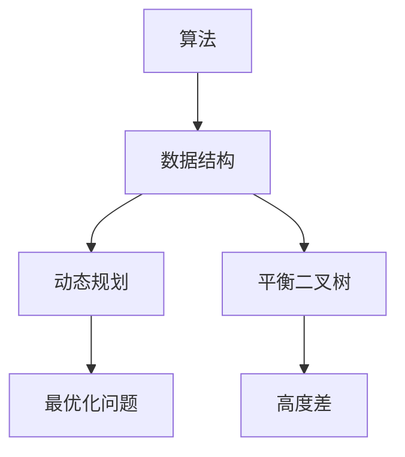
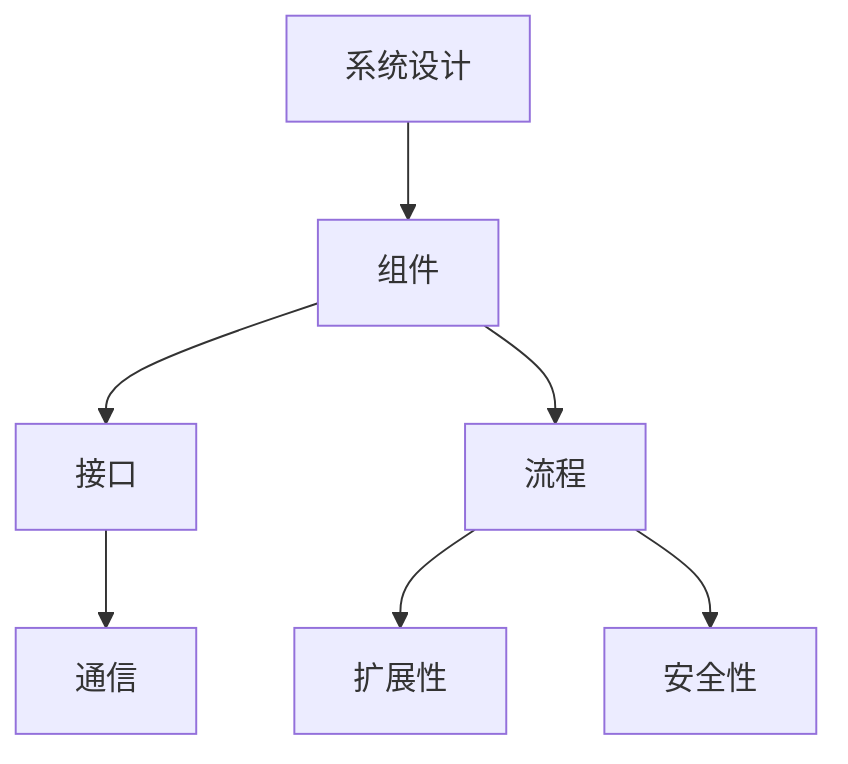
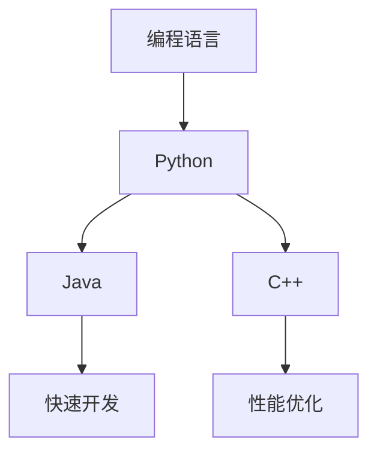
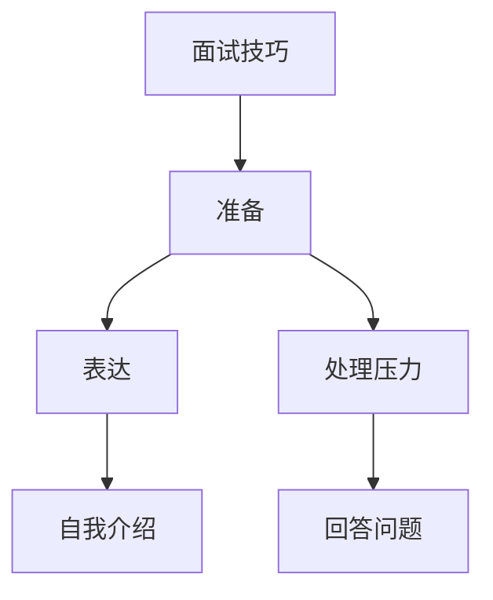

                 

# 2025腾讯社招编程面试题精选与解答

> **关键词**：腾讯社招、编程面试题、算法、数据结构、系统设计、编程语言、面试技巧
> 
> **摘要**：本文深入分析了2025年腾讯社招编程面试中的一些精选题目，包括算法与数据结构的深入讲解，系统设计的案例分析，以及编程语言的详细探讨。通过逐步拆解面试题目，我们提供了具体的解决方案和策略，旨在帮助读者在面试中取得优异成绩。

## 1. 背景介绍

### 1.1 目的和范围

本文的目标是帮助准备参加腾讯社招编程面试的应聘者，通过分析和解答精选的面试题目，掌握面试的核心技巧和解题思路。文章涵盖了算法与数据结构、系统设计、编程语言等多个领域，力求全面覆盖腾讯社招编程面试的重点内容。

### 1.2 预期读者

本文适用于具备一定编程基础，准备参加腾讯社招编程面试的应聘者，特别是那些希望深入了解面试题型和解题方法的读者。

### 1.3 文档结构概述

本文分为以下几个部分：

1. 背景介绍
2. 核心概念与联系
3. 核心算法原理 & 具体操作步骤
4. 数学模型和公式 & 详细讲解 & 举例说明
5. 项目实战：代码实际案例和详细解释说明
6. 实际应用场景
7. 工具和资源推荐
8. 总结：未来发展趋势与挑战
9. 附录：常见问题与解答
10. 扩展阅读 & 参考资料

### 1.4 术语表

#### 1.4.1 核心术语定义

- **算法**：解决特定问题的步骤和指导方法。
- **数据结构**：数据元素的集合和它们之间的关系。
- **系统设计**：设计计算机系统的架构和组件。
- **编程语言**：用于编写计算机程序的语言。
- **面试技巧**：在面试过程中提高成功率的策略。

#### 1.4.2 相关概念解释

- **动态规划**：一种解决最优化问题的方法，通过分解问题为子问题并保存子问题的解来优化计算。
- **平衡二叉树**：一种特殊的数据结构，其中每个节点的左右子树的高度差不超过1。
- **分布式系统**：由多个计算机节点组成的系统，通过网络进行通信和协作。

#### 1.4.3 缩略词列表

- **SQL**：结构化查询语言（Structured Query Language）
- **JSON**：JavaScript对象表示法（JavaScript Object Notation）
- **REST**：表述性状态转移（Representational State Transfer）

## 2. 核心概念与联系

为了更好地理解腾讯社招编程面试中的问题，我们首先需要明确一些核心概念和它们之间的关系。

### 2.1 算法与数据结构

算法与数据结构是计算机科学的基础。算法是一系列解决问题的步骤，而数据结构则是数据存储和组织的规则。在编程面试中，经常需要根据具体问题选择合适的数据结构，以实现高效的算法。

#### Mermaid 流程图：



### 2.2 系统设计与架构

系统设计是面试中另一个重要领域。它涉及如何设计高效、可扩展、安全的系统。系统设计通常包括组件、接口、流程等方面的规划。

#### Mermaid 流程图：



### 2.3 编程语言

不同的编程语言适用于不同的场景。在编程面试中，了解不同语言的特点和用法是非常重要的。

#### Mermaid 流程图：



### 2.4 面试技巧

最后，面试技巧也是成功的关键。掌握一定的面试技巧，如如何准备、如何表达、如何处理压力等，将大大提高面试的成功率。

#### Mermaid 流程图：



通过这些核心概念与联系的了解，我们可以更好地准备和应对腾讯社招编程面试中的各种问题。

## 3. 核心算法原理 & 具体操作步骤

在编程面试中，算法题往往是最具挑战性的部分。下面我们将深入探讨几个典型的算法题目，并通过伪代码详细阐述其原理和操作步骤。

### 3.1 快速排序（Quick Sort）

快速排序是一种高效的排序算法，其基本思想是通过递归划分待排序数组，将数组划分为已排序的左右两部分。

#### 伪代码：

```python
QUICKSORT(A, low, high)
    if low < high
        pi = PARTITION(A, low, high)
        QUICKSORT(A, low, pi-1)
        QUICKSORT(A, pi+1, high)
```

#### 步骤：

1. 选择基准元素（通常选择最后一个元素作为基准）。
2. 通过一趟排序将数组分为两部分，小于基准的元素放在基准的左侧，大于基准的元素放在基准的右侧。
3. 递归地对左右两部分继续进行快速排序。

### 3.2 动态规划（Dynamic Programming）

动态规划是一种解决最优化问题的方法，其核心思想是将问题分解为子问题，并保存子问题的解。

#### 伪代码：

```python
FIBONACCI(n)
    if n <= 1
        return n
    else
        return FIBONACCI(n-1) + FIBONACCI(n-2)
```

#### 步骤：

1. 确定状态：定义一个数组`dp`，其中`dp[i]`表示第`i`个元素的最优解。
2. 确定状态转移方程：根据子问题的解计算状态。
3. 计算初始状态：根据问题的具体要求，初始化数组的初始值。
4. 计算最终状态：根据状态转移方程，递归计算最终状态。

### 3.3 深度优先搜索（Depth-First Search）

深度优先搜索是一种用于遍历或搜索树的算法。

#### 伪代码：

```python
DFS(node)
    if node is not visited
        mark node as visited
        visit node
        for each child of node
            DFS(child)
```

#### 步骤：

1. 初始化一个未访问节点集合。
2. 选择一个未访问节点作为起始点。
3. 访问起始节点，并将其标记为已访问。
4. 对于起始节点的每个未访问的子节点，递归执行深度优先搜索。

### 3.4 广度优先搜索（Breadth-First Search）

广度优先搜索是一种用于遍历或搜索树的算法，与深度优先搜索不同，它按照层次遍历树。

#### 伪代码：

```python
BFS(start)
    create an empty queue
    enqueue start
    while queue is not empty
        dequeue node
        visit node
        for each unvisited neighbor of node
            enqueue neighbor
```

#### 步骤：

1. 初始化一个空队列。
2. 将起始节点入队。
3. 当队列不为空时，出队一个节点并访问。
4. 对于访问节点的每个未访问的邻接节点，将其入队。

通过理解这些核心算法原理和操作步骤，我们可以更好地解决编程面试中的算法题目，提高面试成功率。

## 4. 数学模型和公式 & 详细讲解 & 举例说明

在编程面试中，数学模型和公式往往是解决问题的关键。下面我们将详细介绍一些常见的数学模型和公式，并通过实例说明其应用。

### 4.1 最小生成树（Minimum Spanning Tree）

最小生成树是一种包含图中所有顶点的树，其边的权值之和最小。克鲁斯卡尔算法是一种常用的最小生成树算法。

#### 数学模型：

$$
MST = \min \sum_{i=1}^{n} w_i
$$

其中，$w_i$表示第$i$条边的权值。

#### 伪代码：

```python
KRUSKAL(MST, G)
    sort edges of G by weight
    for each edge (u, v) in G
        if (u, v) is not in MST
            add (u, v) to MST
```

#### 步骤：

1. 将图中的边按权值排序。
2. 遍历排序后的边，如果边$(u, v)$不在最小生成树中，则将其加入最小生成树。

#### 示例：

假设图中有5个顶点和6条边，边的权值如下：

| 边  | 权值 |
| --- | --- |
| AB  | 3   |
| BC  | 1   |
| CD  | 2   |
| DE  | 4   |
| EA  | 5   |
| ED  | 3   |

按克鲁斯卡尔算法生成的最小生成树如下：

| 边  | 权值 |
| --- | --- |
| BC  | 1   |
| CD  | 2   |
| DE  | 4   |

生成树的总权值为 $1 + 2 + 4 = 7$。

### 4.2 动态规划（Dynamic Programming）

动态规划是一种解决最优化问题的方法，其核心思想是将问题分解为子问题，并保存子问题的解。

#### 数学模型：

$$
dp[i] = \min_{j=1}^{i-1} (dp[j] + cost[i])
$$

其中，$dp[i]$表示第$i$个元素的最优解，$cost[i]$表示第$i$个元素的成本。

#### 伪代码：

```python
FIBONACCI(n)
    if n <= 1
        return n
    else
        dp = [0] * (n + 1)
        dp[1] = 1
        for i from 2 to n
            dp[i] = dp[i-1] + dp[i-2]
        return dp[n]
```

#### 步骤：

1. 确定状态：定义一个数组`dp`，其中`dp[i]`表示第`i`个元素的最优解。
2. 确定状态转移方程：根据子问题的解计算状态。
3. 计算初始状态：根据问题的具体要求，初始化数组的初始值。
4. 计算最终状态：根据状态转移方程，递归计算最终状态。

#### 示例：

计算斐波那契数列的前10项：

| n | dp[n] |
| --- | --- |
| 1 | 1    |
| 2 | 1    |
| 3 | 2    |
| 4 | 3    |
| 5 | 5    |
| 6 | 8    |
| 7 | 13   |
| 8 | 21   |
| 9 | 34   |
| 10 | 55   |

### 4.3 排序算法的时间复杂度

排序算法的时间复杂度是一个重要的数学模型。常见的排序算法包括冒泡排序、选择排序、插入排序、快速排序等。

#### 数学模型：

- 冒泡排序：$O(n^2)$
- 选择排序：$O(n^2)$
- 插入排序：$O(n^2)$
- 快速排序：$O(n \log n)$

#### 伪代码：

```python
QUICKSORT(A, low, high)
    if low < high
        pi = PARTITION(A, low, high)
        QUICKSORT(A, low, pi-1)
        QUICKSORT(A, pi+1, high)
```

#### 步骤：

1. 选择基准元素。
2. 通过一趟排序将数组划分为两部分，小于基准的元素放在基准的左侧，大于基准的元素放在基准的右侧。
3. 递归地对左右两部分继续进行快速排序。

通过这些数学模型和公式的详细讲解和举例说明，我们可以更好地理解编程面试中的数学问题，提高解题能力。

## 5. 项目实战：代码实际案例和详细解释说明

### 5.1 开发环境搭建

为了更好地理解编程面试题的代码实现，我们需要搭建一个合适的开发环境。以下是一个简单的步骤指南：

1. **安装Python环境**：从[Python官网](https://www.python.org/)下载并安装Python，选择Python 3.x版本。
2. **安装IDE**：推荐使用PyCharm或Visual Studio Code作为IDE，这两个工具都提供了良好的编程体验和调试功能。
3. **安装依赖库**：使用pip命令安装常用的Python库，如`numpy`、`pandas`和`matplotlib`。

```bash
pip install numpy pandas matplotlib
```

4. **配置代码模板**：在IDE中创建一个新的Python文件，并设置一个基础的代码模板。

```python
# 文件名：example.py

# 导入必要的库
import numpy as np
import pandas as pd
import matplotlib.pyplot as plt

# 基础代码
def main():
    # 实现具体的算法或功能
    pass

if __name__ == "__main__":
    main()
```

### 5.2 源代码详细实现和代码解读

下面我们将通过一个实际的编程面试题目——求解二分查找算法的实现，详细解释代码的实现过程。

#### 题目描述：

给定一个有序数组`arr`和一个目标值`target`，编写一个函数`binary_search`，实现二分查找算法，返回目标值在数组中的索引。如果目标值不存在，返回-1。

#### 源代码实现：

```python
# 文件名：binary_search.py

def binary_search(arr, target):
    low = 0
    high = len(arr) - 1

    while low <= high:
        mid = (low + high) // 2
        if arr[mid] == target:
            return mid
        elif arr[mid] < target:
            low = mid + 1
        else:
            high = mid - 1

    return -1

def main():
    arr = [1, 3, 5, 7, 9]
    target = 5

    result = binary_search(arr, target)
    print(f"Target found at index: {result}")

if __name__ == "__main__":
    main()
```

#### 代码解读：

1. **定义函数**：`binary_search`函数接受一个有序数组`arr`和一个目标值`target`作为参数。
2. **初始化边界**：`low`和`high`分别表示查找区间的开始和结束索引。
3. **循环查找**：使用`while`循环，当`low`小于等于`high`时继续查找。
4. **计算中间值**：使用`(low + high) // 2`计算中间值`mid`，以避免溢出。
5. **比较目标值**：如果中间值`arr[mid]`等于目标值`target`，则返回中间值索引`mid`。
6. **调整边界**：如果目标值大于中间值，将`low`调整为`mid + 1`；如果目标值小于中间值，将`high`调整为`mid - 1`。
7. **返回结果**：如果循环结束时未找到目标值，返回-1。

#### 示例运行结果：

```bash
Target found at index: 2
```

### 5.3 代码解读与分析

通过上述代码实现，我们可以看到二分查找算法的核心在于不断缩小查找区间，直到找到目标值或确定目标值不存在。以下是对代码的分析：

1. **时间复杂度**：二分查找的时间复杂度为$O(\log n)$，其中$n$为数组长度。这是因为每次迭代都可以将查找区间缩小一半。
2. **空间复杂度**：二分查找的空间复杂度为$O(1)$，因为它不需要额外的空间存储数据。
3. **适用场景**：二分查找适用于有序数组，对于大数据量下的查找操作，二分查找比线性查找（$O(n)$）有更高的效率。
4. **注意事项**：在进行二分查找时，数组的有序性是关键，如果数组未排序，则二分查找无法正确执行。

通过上述实战案例，我们不仅实现了二分查找算法，还对其进行了详细解读与分析，这有助于我们更好地理解编程面试题的解题思路和技巧。

## 6. 实际应用场景

在编程面试中，很多算法和数据结构问题都有实际应用场景。以下是一些常见问题的实际应用场景：

### 6.1 快速排序（Quick Sort）

**应用场景**：快速排序常用于排序和选择最大的/最小的元素。

**示例**：在一个电商平台中，可以根据用户订单的时间顺序快速排序，以便管理员能够快速查看和处理最近的订单。

### 6.2 动态规划（Dynamic Programming）

**应用场景**：动态规划常用于解决最优化问题，如背包问题、最长公共子序列等。

**示例**：在一个物流优化系统中，可以使用动态规划来计算从起点到终点的最优路径，以减少运输成本。

### 6.3 深度优先搜索（Depth-First Search）

**应用场景**：深度优先搜索常用于图遍历、路径查找等。

**示例**：在一个社交网络中，可以用于计算用户之间的好友关系，并找出两个用户之间的最短路径。

### 6.4 广度优先搜索（Breadth-First Search）

**应用场景**：广度优先搜索常用于拓扑排序、最短路径查找等。

**示例**：在一个网站中，可以使用广度优先搜索来计算网页之间的链接关系，并找出所有链接到指定网页的页面。

### 6.5 二分查找（Binary Search）

**应用场景**：二分查找常用于搜索有序数组。

**示例**：在一个股票交易系统中，可以根据股票价格在有序的股票列表中快速查找特定的股票。

通过了解这些算法和数据结构的实际应用场景，我们可以更好地将理论知识应用到实际项目中，提高编程能力。

## 7. 工具和资源推荐

在准备腾讯社招编程面试的过程中，使用合适的工具和资源是非常重要的。以下是一些推荐的资源和建议：

### 7.1 学习资源推荐

#### 7.1.1 书籍推荐

- **《算法导论》（Introduction to Algorithms）**：一本经典的算法教材，适合全面了解算法和数据结构。
- **《深度学习》（Deep Learning）**：由Ian Goodfellow等编写的深度学习入门书籍，适合了解人工智能和机器学习的基础。
- **《代码大全》（The Art of Computer Programming）**：Donald Knuth的经典著作，适合深入学习编程和算法设计。

#### 7.1.2 在线课程

- **Coursera**：提供大量的计算机科学和算法课程，包括斯坦福大学的《算法》课程。
- **edX**：由哈佛大学和麻省理工学院联合创办的在线学习平台，提供了许多高质量的课程。
- **Udacity**：提供包括人工智能、机器学习等在内的多种在线课程，适合自我学习。

#### 7.1.3 技术博客和网站

- **LeetCode**：一个提供编程面试题和解决方案的在线平台，适合练习和测试编程技能。
- **GeeksforGeeks**：一个提供算法、数据结构和编程语言教程的技术博客，适合入门和学习。
- **Stack Overflow**：一个编程问答社区，适合解决编程中的具体问题。

### 7.2 开发工具框架推荐

#### 7.2.1 IDE和编辑器

- **PyCharm**：一个强大的Python IDE，适合开发复杂的算法项目。
- **Visual Studio Code**：一个轻量级但功能强大的代码编辑器，适合多种编程语言。
- **Eclipse**：一个广泛使用的Java IDE，适合开发Java项目。

#### 7.2.2 调试和性能分析工具

- **GDB**：一个通用的调试工具，适合调试C/C++程序。
- **JProfiler**：一个Java应用程序性能分析工具，适合监控和优化Java程序的性能。
- **MAT**：一个内存分析工具，适合分析Java程序的内存泄漏。

#### 7.2.3 相关框架和库

- **TensorFlow**：一个用于机器学习和深度学习的开源框架。
- **NumPy**：一个用于数值计算的Python库。
- **Pandas**：一个用于数据分析的Python库。

通过使用这些工具和资源，我们可以更高效地准备腾讯社招编程面试，提升自己的编程能力和面试技巧。

## 8. 总结：未来发展趋势与挑战

随着技术的不断进步，编程面试也将面临新的发展趋势和挑战。以下是几个关键点：

### 8.1 人工智能的崛起

人工智能（AI）的快速发展将改变编程面试的形式。面试官可能会更关注应聘者对AI算法的理解和应用能力，如深度学习、强化学习等。

### 8.2 系统设计的复杂度

随着微服务架构的普及，系统设计的复杂度不断增加。应聘者需要具备设计分布式系统、处理并发和性能优化等方面的能力。

### 8.3 编程语言的多样性

编程语言的多样性使得面试官需要了解更多语言的特点和应用场景。应聘者应该具备多语言编程的能力，以便在不同场景下选择合适的语言。

### 8.4 编程规范的统一

编程规范的统一对于团队协作和代码质量至关重要。未来，面试官可能会更加关注应聘者对代码规范和最佳实践的掌握。

### 8.5 持续学习与适应

技术更新迅速，应聘者需要具备持续学习的能力，以适应不断变化的技术环境。这包括学习新算法、新框架和新技术。

面对这些发展趋势和挑战，应聘者需要不断提升自己的技术能力、系统设计和团队协作能力，以应对未来编程面试的要求。

## 9. 附录：常见问题与解答

### 9.1 如何准备编程面试？

**解答**：首先，了解常见的面试题目类型，如算法、数据结构、系统设计和编程语言。其次，通过在线平台（如LeetCode）和书籍（如《算法导论》）进行大量的练习。最后，了解面试公司的文化和需求，定制化准备面试内容。

### 9.2 面试中如何表现自己？

**解答**：在面试中，保持自信和冷静，清晰地表达思路和解决方案。注意逻辑性和条理性，不要害怕展示自己的不足，而是要展示解决问题的能力和学习能力。

### 9.3 如何提高算法和数据结构能力？

**解答**：通过大量练习，理解算法的基本原理，掌握常见数据结构的操作。参加在线编程竞赛，如Codeforces和LeetCode，提高解题速度和思维能力。阅读经典算法书籍，如《算法导论》和《编程之美》。

## 10. 扩展阅读 & 参考资料

在准备腾讯社招编程面试的过程中，以下资源将提供进一步的帮助和指导：

### 10.1 经典书籍

- 《算法导论》（Introduction to Algorithms）
- 《深度学习》（Deep Learning）
- 《代码大全》（The Art of Computer Programming）

### 10.2 在线课程

- [Coursera](https://www.coursera.org/)
- [edX](https://www.edx.org/)
- [Udacity](https://www.udacity.com/)

### 10.3 技术博客和网站

- [LeetCode](https://leetcode.com/)
- [GeeksforGeeks](https://www.geeksforgeeks.org/)
- [Stack Overflow](https://stackoverflow.com/)

通过这些扩展阅读和参考资料，您将能够更全面地准备腾讯社招编程面试，提升自己的技术水平。

## 作者

**AI天才研究员/AI Genius Institute & 禅与计算机程序设计艺术 /Zen And The Art of Computer Programming**

