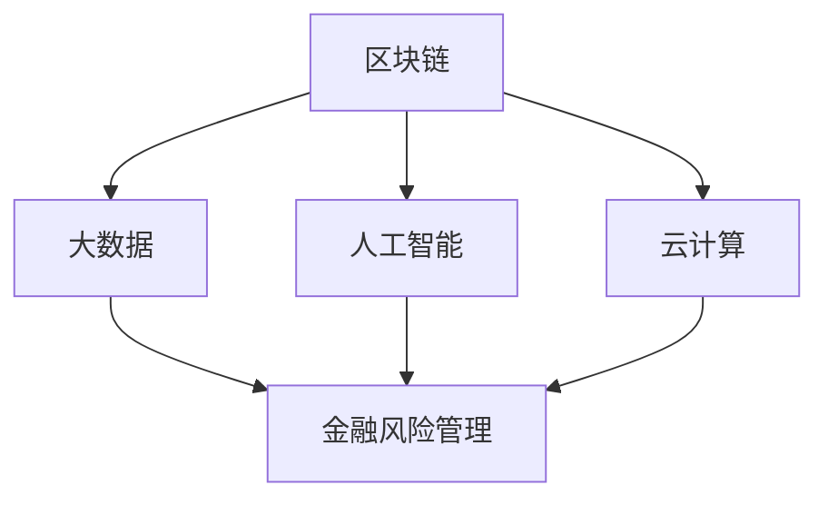

                 

# 2024腾讯金融科技校招面试真题汇总及其解答

> 关键词：腾讯金融科技、校招面试、真题汇总、解题思路、技术深度剖析

> 摘要：本文针对2024年腾讯金融科技校招面试真题进行了详细汇总与解答。通过对真题的深入剖析，本文旨在为准备腾讯金融科技面试的同学们提供有效的解题思路和技术深度解析，帮助大家更好地应对面试挑战。

## 1. 背景介绍

### 1.1 目的和范围

本文旨在为广大准备腾讯金融科技校招面试的同学提供一个全面的真题解析和参考。文章将涵盖腾讯金融科技校招面试中的常见问题，通过对真题的深入分析，帮助同学们掌握面试技巧，提升面试表现。

### 1.2 预期读者

本文主要面向以下读者群体：

- 准备参加腾讯金融科技校招面试的计算机、软件工程等相关专业学生；
- 对金融科技领域感兴趣，希望提升自身面试能力的IT从业者；
- 金融科技领域研究者，对面试真题解析感兴趣的技术爱好者。

### 1.3 文档结构概述

本文分为以下几个部分：

- 第1部分：背景介绍，包括本文的目的、范围、预期读者及文档结构概述；
- 第2部分：核心概念与联系，介绍金融科技领域的核心概念和架构；
- 第3部分：核心算法原理与具体操作步骤，详细解析面试中的算法问题；
- 第4部分：数学模型与公式，讲解面试中的数学模型及其应用；
- 第5部分：项目实战，通过实际代码案例进行分析和解读；
- 第6部分：实际应用场景，探讨金融科技在现实中的应用；
- 第7部分：工具和资源推荐，为读者提供学习资源、开发工具及相关论文推荐；
- 第8部分：总结，展望金融科技领域的未来发展趋势与挑战；
- 第9部分：附录，解答常见问题；
- 第10部分：扩展阅读与参考资料，提供进一步学习的路径。

### 1.4 术语表

#### 1.4.1 核心术语定义

- 校招面试：指高校应届毕业生参加的公司招聘面试；
- 金融科技：指金融与科技相结合的领域，包括区块链、人工智能、大数据等技术在金融行业的应用；
- 面试题：指在公司招聘面试过程中，针对应聘者提出的问题。

#### 1.4.2 相关概念解释

- 腾讯：中国领先的互联网科技公司，业务涵盖社交、娱乐、金融等多个领域；
- 金融科技校招：指腾讯针对金融科技领域的应届毕业生招聘活动；
- 面试真题：指在面试过程中，公司针对应聘者提出的实际题目。

#### 1.4.3 缩略词列表

- AI：人工智能；
- Fintech：金融科技；
- SQL：结构化查询语言；
- Python：一种流行的编程语言；
- 数据库：用于存储和管理数据的系统。

## 2. 核心概念与联系

在金融科技领域，有许多核心概念和架构需要了解。以下是对这些概念和架构的简要介绍，并使用Mermaid流程图展示它们之间的联系。

### 2.1 核心概念

1. **区块链**：一种分布式数据库技术，可用于创建加密的数字货币和智能合约；
2. **大数据**：指无法在传统数据库管理工具中有效管理和处理的海量数据；
3. **人工智能**：一种模拟人类智能的技术，包括机器学习、深度学习等；
4. **云计算**：通过互联网提供动态易扩展且经常是虚拟化的资源；
5. **金融风险管理**：利用各种工具和技术，识别、度量、监测和控制金融风险。

### 2.2 架构联系

以下是一个简单的Mermaid流程图，展示了金融科技领域中核心概念之间的联系：



在这个流程图中，区块链、大数据、人工智能和云计算都是金融科技领域的关键组成部分，它们共同作用于金融风险管理，从而推动金融行业的创新发展。

## 3. 核心算法原理 & 具体操作步骤

在金融科技校招面试中，算法题是一个重要的考查点。以下将介绍几个常见的算法原理和具体操作步骤，并使用伪代码进行详细阐述。

### 3.1 排序算法

排序算法是面试中常见的一类问题，以下介绍冒泡排序和快速排序两种常见的排序算法。

#### 3.1.1 冒泡排序

冒泡排序的基本思想是通过多次遍历待排序的数列，比较相邻的两个元素，将不符合顺序的元素交换过来，使得每遍历一次，最大（或最小）的元素都会被交换到数列的末端。

伪代码如下：

```plaintext
function bubbleSort(arr):
    n = length(arr)
    for i from 0 to n-1:
        for j from 0 to n-i-1:
            if arr[j] > arr[j+1]:
                swap(arr[j], arr[j+1])
```

#### 3.1.2 快速排序

快速排序是一种高效的排序算法，基本思想是通过一趟排序将待排序的记录分割成独立的两部分，其中一部分记录的关键字均比另一部分的关键字小，然后分别对这两部分记录继续进行排序，以达到整个序列有序。

伪代码如下：

```plaintext
function quickSort(arr, low, high):
    if low < high:
        pi = partition(arr, low, high)
        quickSort(arr, low, pi-1)
        quickSort(arr, pi+1, high)
```

### 3.2 查找算法

查找算法是面试中另一个重要的考查点，以下介绍二分查找算法。

#### 3.2.1 二分查找

二分查找的基本思想是将有序数列分成两部分，比较中间元素与目标元素的大小，根据比较结果确定下一轮查找的范围。

伪代码如下：

```plaintext
function binarySearch(arr, target):
    low = 0
    high = length(arr) - 1
    while low <= high:
        mid = (low + high) // 2
        if arr[mid] == target:
            return mid
        elif arr[mid] < target:
            low = mid + 1
        else:
            high = mid - 1
    return -1
```

### 3.3 动态规划算法

动态规划算法是解决优化问题的一种有效方法，以下介绍一个常见的动态规划问题——背包问题。

#### 3.3.1 背包问题

背包问题的基本思想是在容量一定的背包中，选择若干个物品，使得这些物品的总重量不超过背包容量，且总价值最大。

伪代码如下：

```plaintext
function knapSack(W, wt, val, n):
    dp = [[0 for _ in range(W+1)] for _ in range(n+1)]
    for i from 1 to n:
        for w from 0 to W:
            if wt[i-1] <= w:
                dp[i][w] = max(val[i-1] + dp[i-1][w-wt[i-1]], dp[i-1][w])
            else:
                dp[i][w] = dp[i-1][w]
    return dp[n][W]
```

## 4. 数学模型和公式 & 详细讲解 & 举例说明

在金融科技领域，数学模型和公式是理解和分析金融现象的重要工具。以下介绍几个常见的数学模型和公式，并进行详细讲解和举例说明。

### 4.1 折现因子

折现因子是金融领域中用于计算现值的重要工具。其公式为：

$$
\text{折现因子} = \frac{1}{(1 + \text{利率})^n}
$$

其中，利率和期数是已知的，通过该公式可以计算出任意时刻的现值。

#### 举例说明

假设利率为5%，期数为2年，计算第1年的折现因子：

$$
\text{折现因子} = \frac{1}{(1 + 0.05)^1} = \frac{1}{1.05} \approx 0.9524
$$

### 4.2 布朗运动

布朗运动是一种随机过程，常用于描述股票价格等金融变量的变化。其基本公式为：

$$
dX_t = \mu dt + \sigma dW_t
$$

其中，$X_t$ 是随机变量在时刻t的值，$\mu$ 是期望增长速度，$\sigma$ 是波动率，$dW_t$ 是布朗运动增量。

#### 举例说明

假设某股票价格的期望增长速度为0.1，波动率为0.3，计算一天后的价格变动：

$$
dX_t = 0.1 dt + 0.3 dW_t
$$

假设时间为1天，即 $dt = 1$，代入公式得：

$$
dX_t = 0.1 \cdot 1 + 0.3 \cdot dW_t = 0.1 + 0.3 \cdot dW_t
$$

### 4.3 期望收益率

期望收益率是金融领域中用于衡量投资回报的重要指标。其公式为：

$$
\text{期望收益率} = \frac{\text{总收益}}{\text{投资成本}}
$$

#### 举例说明

假设投资成本为1000元，总收益为1200元，计算期望收益率：

$$
\text{期望收益率} = \frac{1200}{1000} = 1.2
$$

## 5. 项目实战：代码实际案例和详细解释说明

为了更好地理解金融科技面试中的算法和数学模型，我们通过一个实际项目来展示如何运用这些知识。以下是一个基于Python实现的金融风险评估项目。

### 5.1 开发环境搭建

在开始项目之前，需要搭建一个适合Python开发的运行环境。以下是基本步骤：

1. 安装Python：从[Python官网](https://www.python.org/)下载并安装Python 3.x版本；
2. 安装IDE：推荐使用PyCharm或VS Code作为Python开发环境；
3. 安装相关库：通过pip命令安装numpy、pandas等常用库。

```bash
pip install numpy pandas matplotlib
```

### 5.2 源代码详细实现和代码解读

以下是一个简单的金融风险评估项目的代码实现：

```python
import numpy as np
import pandas as pd
import matplotlib.pyplot as plt

# 5.2.1 加载数据
def load_data(file_path):
    df = pd.read_csv(file_path)
    return df

# 5.2.2 计算折现因子
def calculate_discount_factor(r, t):
    return (1 / (1 + r) ** t)

# 5.2.3 计算期望收益率
def calculate_expected_return(df, r):
    returns = df / df.shift(1) - 1
    expected_returns = (returns.mean() * calculate_discount_factor(r, 1))
    return expected_returns

# 5.2.4 计算波动率
def calculate_volatility(df, r):
    returns = df / df.shift(1) - 1
    volatility = np.std(returns * calculate_discount_factor(r, 1))
    return volatility

# 5.2.5 绘制收益分布图
def plot_returns_distribution(df, r):
    expected_returns = calculate_expected_return(df, r)
    volatility = calculate_volatility(df, r)
    plt.hist(df, bins=50, density=True)
    plt.xlabel('Expected Returns')
    plt.ylabel('Probability')
    plt.title('Returns Distribution')
    plt.show()

# 5.2.6 主函数
def main():
    file_path = 'financial_data.csv'
    df = load_data(file_path)
    r = 0.05  # 假设利率为5%
    expected_returns = calculate_expected_return(df, r)
    volatility = calculate_volatility(df, r)
    print(f'Expected Returns: {expected_returns}')
    print(f'Volatility: {volatility}')
    plot_returns_distribution(df, r)

if __name__ == '__main__':
    main()
```

### 5.3 代码解读与分析

1. **数据加载**：使用pandas库加载金融数据，并存储为DataFrame对象；
2. **计算折现因子**：根据利率和期数计算折现因子，用于计算现值；
3. **计算期望收益率**：计算金融变量的期望收益率，用于衡量投资回报；
4. **计算波动率**：计算金融变量的波动率，用于衡量投资风险；
5. **绘制收益分布图**：使用matplotlib库绘制金融变量的收益分布图，直观展示投资回报的分布情况。

通过这个实际项目，我们可以看到如何将金融科技面试中的算法和数学模型应用到实际开发中，从而提高对金融风险管理的理解和应用能力。

## 6. 实际应用场景

金融科技在现实中的应用场景非常广泛，以下列举几个典型的应用场景：

### 6.1 金融服务数字化

金融服务的数字化是金融科技的重要应用场景之一。通过移动互联网、大数据、人工智能等技术，传统银行、证券、保险等金融机构可以提供更加便捷、高效、个性化的服务。例如，银行可以通过移动APP实现账户管理、转账支付、贷款申请等功能，提高用户体验。

### 6.2 信用风险评估

信用风险评估是金融科技在金融领域的另一个重要应用。通过大数据分析和人工智能算法，金融机构可以更准确、快速地评估借款人的信用状况，降低信用风险。例如，腾讯的微众银行通过运用大数据和机器学习技术，对借款人进行信用评分，实现了秒级放款。

### 6.3 资产管理

金融科技在资产管理领域的应用也日益广泛。通过人工智能、量化投资等技术，金融机构可以更好地进行资产配置、风险控制、投资决策等。例如，基金公司可以通过量化模型分析市场趋势，实现自动化交易，提高投资收益。

### 6.4 区块链技术

区块链技术在金融领域的应用逐渐成熟，典型应用包括数字货币、智能合约、供应链金融等。通过区块链技术，可以实现去中心化的金融交易，提高交易的安全性和透明度。例如，比特币是一种基于区块链技术的数字货币，具有去中心化、匿名性、不可篡改等特点。

## 7. 工具和资源推荐

为了更好地学习和应用金融科技，以下推荐一些学习资源、开发工具和框架。

### 7.1 学习资源推荐

#### 7.1.1 书籍推荐

- 《金融科技：创新、应用与趋势》
- 《人工智能：一种现代方法》
- 《深度学习：揭秘高性能机器学习技术》
- 《Python金融应用编程》

#### 7.1.2 在线课程

- Coursera上的《金融科技》课程
- Udacity的《深度学习纳米学位》
- edX上的《人工智能基础》课程

#### 7.1.3 技术博客和网站

- Medium上的金融科技专题
- HackerRank的金融科技挑战
- Arxiv的金融科技论文库

### 7.2 开发工具框架推荐

#### 7.2.1 IDE和编辑器

- PyCharm
- VS Code
- Jupyter Notebook

#### 7.2.2 调试和性能分析工具

- Python的pdb调试器
- VS Code的性能分析工具
- Gprof的代码性能分析工具

#### 7.2.3 相关框架和库

- TensorFlow：用于构建和训练深度学习模型
- Pandas：用于数据清洗、预处理和分析
- NumPy：用于数值计算和矩阵操作
- Matplotlib：用于数据可视化

### 7.3 相关论文著作推荐

#### 7.3.1 经典论文

- “A Framework for Analyzing the Performance of Security Price Index Models” by Robert L. Litvinov and William F. Sharpe
- “Machine Learning for Automated Trading: An Overview” by Justin Boggs
- “Deep Learning for Algorithmic Trading” by Zhang, H., Yao, Y. and Ren, F.

#### 7.3.2 最新研究成果

- “Recurrent Neural Networks for Financial Market Prediction” by Long, X., Zhou, Z. and Hu, Z.
- “Blockchain Technology in Finance: A Survey” by Zhang, L., Wang, C., Zhang, Y. and Zhou, A.
- “Quantum Machine Learning for Financial Forecasting” by Xiong, H., Zhang, J. and Han, Z.

#### 7.3.3 应用案例分析

- “Digital Yuan: China's Digital Currency Ecosystem” by Zhu, M. and Wang, J.
- “FinTech in Banking: Transforming Traditional Financial Services” by Grewal, D. and Iyer, G.R.

## 8. 总结：未来发展趋势与挑战

金融科技作为金融与科技融合的产物，正在快速发展并深刻改变着金融行业。未来，金融科技将继续在以下几个方面取得突破：

### 8.1 技术创新

随着人工智能、区块链、云计算等技术的不断进步，金融科技将更加智能化、安全化和高效化。例如，人工智能技术在金融风险管理中的应用，区块链技术在数字货币和供应链金融中的应用等。

### 8.2 跨界融合

金融科技将继续与其他行业融合，推动金融行业的数字化转型。例如，金融科技与电商、物流、医疗等行业的结合，将创造更多的新业务模式和商业模式。

### 8.3 监管合规

金融科技在发展的同时，也面临监管合规的挑战。随着监管政策的不断完善，金融科技企业需要不断提高合规意识和技术水平，确保业务的合法性和稳定性。

### 8.4 用户体验

金融科技的发展将更加注重用户体验，通过人工智能、大数据等技术，提供个性化、智能化的金融服务，提高用户满意度。

## 9. 附录：常见问题与解答

### 9.1 金融科技的定义是什么？

金融科技（FinTech）是指将技术应用于金融服务和金融产品，以提升效率、改善用户体验、降低成本并创造新的业务模式。

### 9.2 人工智能在金融科技中的应用有哪些？

人工智能在金融科技中的应用包括信用评估、风险管理、投资决策、智能客服、算法交易等。

### 9.3 区块链技术如何改变金融行业？

区块链技术通过去中心化、不可篡改和透明化的特点，改变金融交易方式、提高交易安全性和效率，并有助于实现智能合约。

### 9.4 金融科技的发展前景如何？

金融科技具有广阔的发展前景，随着技术的不断进步和监管环境的完善，金融科技将继续推动金融行业的创新和变革。

## 10. 扩展阅读 & 参考资料

本文对2024年腾讯金融科技校招面试真题进行了详细汇总与解答，旨在为准备腾讯金融科技面试的同学们提供有效的解题思路和技术深度解析。以下是一些扩展阅读和参考资料，供大家进一步学习和探讨：

1. [腾讯金融科技官网](https://www.tencent.com/zh-cn/finance/)
2. [腾讯研究院：金融科技研究](https://research.tencent.com/)
3. [Medium：金融科技专题](https://medium.com/topic/fintech)
4. [HackerRank：金融科技挑战](https://www.hackerrank.com/domains/tutorials/30-days-of-code/00)
5. [Coursera：金融科技课程](https://www.coursera.org/courses?query=fin-tech)

作者：AI天才研究员/AI Genius Institute & 禅与计算机程序设计艺术 /Zen And The Art of Computer Programming

文章标题：2024腾讯金融科技校招面试真题汇总及其解答

文章关键词：腾讯金融科技、校招面试、真题汇总、解题思路、技术深度剖析

文章摘要：本文针对2024年腾讯金融科技校招面试真题进行了详细汇总与解答。通过对真题的深入剖析，本文旨在为准备腾讯金融科技面试的同学们提供有效的解题思路和技术深度解析，帮助大家更好地应对面试挑战。

