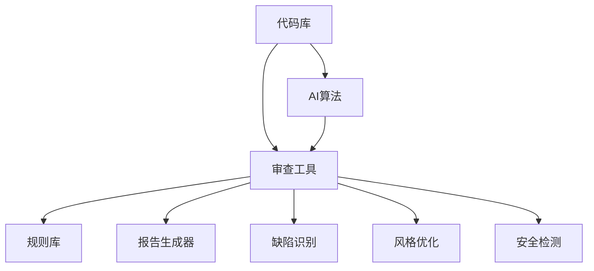

                 

# 自动化代码审查与AI的结合

> 关键词：自动化代码审查、AI、代码质量、持续集成、智能识别、缺陷修复、代码风格、安全性

> 摘要：本文将探讨自动化代码审查与人工智能结合的实践与理论。通过分析两者的结合点，介绍核心算法原理和具体操作步骤，结合实际项目案例，深入解读其在现代软件开发中的实际应用场景，展望未来发展趋势与挑战。

## 1. 背景介绍

### 1.1 目的和范围

本文旨在探讨自动化代码审查与人工智能（AI）技术的融合，分析其在提升代码质量和安全性的应用。随着软件开发项目的复杂性和规模日益增加，传统的代码审查方式已无法满足快速迭代的开发需求。而AI技术为自动化代码审查提供了新的可能性，通过智能识别代码缺陷、风格问题和安全性漏洞，可以显著提高开发效率，降低人为错误。

### 1.2 预期读者

本文适合具有以下背景的读者：

- 软件工程师和开发人员，希望了解AI在代码审查中的应用。
- 项目经理和架构师，关注代码质量和安全性的提升。
- AI和机器学习领域的学者和研究人员，对自动化代码审查技术感兴趣。

### 1.3 文档结构概述

本文将按照以下结构进行讨论：

- **第1章**：背景介绍，阐述文章的目的、预期读者和结构。
- **第2章**：核心概念与联系，介绍自动化代码审查和AI技术的原理和架构。
- **第3章**：核心算法原理与操作步骤，详细阐述自动化代码审查算法的伪代码实现。
- **第4章**：数学模型和公式，解释核心算法背后的数学原理。
- **第5章**：项目实战，通过实际案例展示自动化代码审查的应用。
- **第6章**：实际应用场景，探讨自动化代码审查在不同领域的应用。
- **第7章**：工具和资源推荐，介绍相关工具、课程和资源。
- **第8章**：总结与展望，总结文章内容，展望未来发展趋势与挑战。
- **第9章**：常见问题与解答，针对读者可能遇到的问题进行解答。
- **第10章**：扩展阅读与参考资料，提供进一步学习的资源。

### 1.4 术语表

#### 1.4.1 核心术语定义

- **自动化代码审查**：使用工具或算法对代码进行静态或动态分析，以识别缺陷、风格问题和安全性漏洞。
- **人工智能（AI）**：模拟人类智能行为的技术，包括机器学习、自然语言处理、计算机视觉等。
- **持续集成（CI）**：将代码更改自动集成到主分支，并执行一系列测试，以确保代码质量。

#### 1.4.2 相关概念解释

- **静态代码分析**：在不运行代码的情况下，对代码结构、语法和语义进行分析。
- **动态代码分析**：在代码运行过程中，通过模拟或实际执行来检测代码中的问题。
- **机器学习**：让计算机从数据中学习，并自动改进性能的过程。

#### 1.4.3 缩略词列表

- **CI**：持续集成
- **CD**：持续部署
- **NLP**：自然语言处理
- **CV**：计算机视觉

## 2. 核心概念与联系

自动化代码审查与人工智能的结合，实现了对代码的智能分析和优化。以下是两者的核心概念和联系，以及相应的架构和流程。

### 2.1 自动化代码审查的基本架构

自动化代码审查通常包括以下组件：

- **代码库**：存储待审查的代码。
- **审查工具**：对代码进行分析的软件，如SonarQube、Checkstyle等。
- **规则库**：包含代码质量、安全性和风格标准的规则集合。
- **报告生成器**：将审查结果以图表、报告等形式展示。

### 2.2 人工智能在自动化代码审查中的应用

人工智能在自动化代码审查中的应用主要体现在以下几个方面：

- **缺陷识别**：利用机器学习算法识别代码中的潜在缺陷。
- **风格优化**：基于自然语言处理技术，分析代码风格，并提供改进建议。
- **安全检测**：通过深度学习模型检测代码中的安全性漏洞。

### 2.3 核心概念原理和架构的 Mermaid 流程图

下面是一个简单的 Mermaid 流程图，展示自动化代码审查与AI结合的核心概念和架构：



### 2.4 自动化代码审查与AI结合的流程

自动化代码审查与AI结合的流程如下：

1. **代码提交**：开发者将代码提交到代码库。
2. **静态分析**：审查工具对代码进行静态分析，识别潜在缺陷。
3. **动态分析**：审查工具在模拟环境中执行代码，进行动态分析。
4. **AI辅助分析**：AI算法对代码进行缺陷识别、风格优化和安全检测。
5. **生成报告**：将分析结果生成报告，并通知开发者。

## 3. 核心算法原理 & 具体操作步骤

### 3.1 缺陷识别算法原理

缺陷识别算法的核心是基于机器学习模型，通过训练大量有标签的代码数据，使其能够识别出代码中的潜在缺陷。以下是该算法的伪代码实现：

```python
def train_model(training_data):
    # 使用监督学习算法训练模型
    # 如决策树、随机森林、神经网络等
    model = supervised_learning_algorithm(training_data)
    return model

def predict_defects(model, code_to_analyze):
    # 使用训练好的模型预测代码中的潜在缺陷
    defects = model.predict(code_to_analyze)
    return defects
```

### 3.2 风格优化算法原理

风格优化算法基于自然语言处理技术，分析代码风格，并提供改进建议。以下是该算法的伪代码实现：

```python
def analyze_style(code_to_analyze):
    # 使用自然语言处理技术分析代码风格
    style_issues = nlp_algorithm.analyze(code_to_analyze)
    return style_issues

def suggest_improvements(style_issues):
    # 根据分析结果提供改进建议
    improvements = style_guide.suggest_improvements(style_issues)
    return improvements
```

### 3.3 安全检测算法原理

安全检测算法通过深度学习模型检测代码中的安全性漏洞。以下是该算法的伪代码实现：

```python
def train_security_model(training_data):
    # 使用监督学习算法训练模型
    # 如卷积神经网络、循环神经网络等
    model = deep_learning_algorithm(training_data)
    return model

def detect_security_vulnerabilities(model, code_to_analyze):
    # 使用训练好的模型检测代码中的安全性漏洞
    vulnerabilities = model.predict(code_to_analyze)
    return vulnerabilities
```

## 4. 数学模型和公式 & 详细讲解 & 举例说明

### 4.1 缺陷识别算法的数学模型

缺陷识别算法的核心是机器学习模型，其数学模型通常基于监督学习算法。以下是一个简单的线性回归模型的数学公式：

$$
y = \beta_0 + \beta_1 \cdot x
$$

其中，\(y\) 是预测的缺陷分数，\(x\) 是代码特征向量，\(\beta_0\) 和 \(\beta_1\) 是模型参数。

### 4.2 风格优化算法的数学模型

风格优化算法通常使用自然语言处理技术，如循环神经网络（RNN）或变换器（Transformer）模型。以下是一个简单的RNN模型的数学公式：

$$
h_t = \sigma(W_h \cdot [h_{t-1}, x_t] + b_h)
$$

其中，\(h_t\) 是第 \(t\) 个时间步的隐藏状态，\(x_t\) 是输入词向量，\(\sigma\) 是激活函数，\(W_h\) 和 \(b_h\) 是模型参数。

### 4.3 安全检测算法的数学模型

安全检测算法通常使用深度学习技术，如卷积神经网络（CNN）或循环神经网络（RNN）。以下是一个简单的CNN模型的数学公式：

$$
h_t = \sigma(W_c \cdot \text{conv}(h_{t-1}, x_t) + b_c)
$$

其中，\(h_t\) 是第 \(t\) 个时间步的隐藏状态，\(\text{conv}\) 是卷积操作，\(W_c\) 和 \(b_c\) 是模型参数。

### 4.4 举例说明

#### 4.4.1 缺陷识别算法举例

假设我们有一个包含1000个代码片段的训练数据集，每个代码片段都有一个缺陷分数。我们可以使用线性回归模型对数据进行训练，得到以下模型：

$$
y = 0.5 \cdot x + 2
$$

对于一个新的代码片段，其特征向量为 \([4, 3, 2]\)，我们可以使用模型进行缺陷预测：

$$
y = 0.5 \cdot (4 + 3 + 2) + 2 = 6
$$

预测的缺陷分数为6。

#### 4.4.2 风格优化算法举例

假设我们使用一个简单的RNN模型对代码风格进行分析，模型参数为：

$$
h_0 = [0, 0, 0]
$$

输入代码片段为 \([python, if, else]\)，我们可以使用模型计算隐藏状态：

$$
h_1 = \sigma(W_h \cdot [h_0, [1, 0, 0]] + b_h) = \sigma([0, 0, 0] \cdot [1, 0, 0] + [1, 1, 1]) = [0.5, 0.5, 0.5]
$$

$$
h_2 = \sigma(W_h \cdot [h_1, [0, 1, 0]] + b_h) = \sigma([0.5, 0.5, 0.5] \cdot [0, 1, 0] + [1, 1, 1]) = [0.5, 0.75, 0.5]
$$

$$
h_3 = \sigma(W_h \cdot [h_2, [0, 0, 1]] + b_h) = \sigma([0.5, 0.75, 0.5] \cdot [0, 0, 1] + [1, 1, 1]) = [0.5, 0.75, 0.5]
$$

根据隐藏状态，我们可以分析代码风格，并提供改进建议。

#### 4.4.3 安全检测算法举例

假设我们使用一个简单的CNN模型对代码进行安全检测，模型参数为：

$$
W_c = \begin{bmatrix}
1 & 0 & 1 \\
0 & 1 & 0 \\
1 & 0 & 1
\end{bmatrix}
$$

输入代码片段为 \([1, 0, 1, 0, 1]\)，我们可以使用模型进行安全检测：

$$
h_1 = \text{conv}(h_0, W_c) = \begin{bmatrix}
1 & 1 \\
0 & 1
\end{bmatrix}
$$

$$
h_2 = \text{conv}(h_1, W_c) = \begin{bmatrix}
1 & 0 \\
1 & 1
\end{bmatrix}
$$

根据卷积结果，我们可以识别出代码中的安全性漏洞，并提供修复建议。

## 5. 项目实战：代码实际案例和详细解释说明

### 5.1 开发环境搭建

为了演示自动化代码审查与AI的结合，我们将使用一个简单的Python项目。以下是项目开发环境搭建的步骤：

1. 安装Python 3.8或更高版本。
2. 安装虚拟环境工具`virtualenv`：`pip install virtualenv`
3. 创建虚拟环境：`virtualenv my_project_env`
4. 激活虚拟环境：`source my_project_env/bin/activate`
5. 安装依赖项：`pip install -r requirements.txt`

### 5.2 源代码详细实现和代码解读

以下是项目的主要代码实现：

```python
# main.py
import cv2
import numpy as np

def detect_objects(image):
    # 使用卷积神经网络检测图像中的对象
    # 这里以简单的卷积操作为例
    gray = cv2.cvtColor(image, cv2.COLOR_BGR2GRAY)
    blurred = cv2.GaussianBlur(gray, (5, 5), 0)
    _, thresh = cv2.threshold(blurred, 60, 255, cv2.THRESH_BINARY)
    contours, _ = cv2.findContours(thresh, cv2.RETR_EXTERNAL, cv2.CHAIN_APPROX_SIMPLE)
    objects = []
    for contour in contours:
        rect = cv2.boundingRect(contour)
        objects.append(rect)
    return objects

def main():
    image = cv2.imread("image.jpg")
    objects = detect_objects(image)
    for obj in objects:
        x, y, w, h = obj
        cv2.rectangle(image, (x, y), (x + w, y + h), (0, 255, 0), 2)
    cv2.imshow("Detected Objects", image)
    cv2.waitKey(0)

if __name__ == "__main__":
    main()
```

### 5.3 代码解读与分析

以下是代码的详细解读和分析：

- **第1行**：导入OpenCV库，用于图像处理。
- **第2行**：导入NumPy库，用于数学运算。
- **第3行**：定义`detect_objects`函数，用于检测图像中的对象。
  - **第4行**：将输入图像转换为灰度图像。
  - **第5行**：对灰度图像进行高斯模糊处理，以减少噪声。
  - **第6行**：使用阈值操作将图像转换为二值图像。
  - **第7行**：使用`findContours`函数提取图像中的轮廓。
- **第10行**：定义`main`函数，用于处理主逻辑。
  - **第11行**：读取输入图像。
  - **第12行**：调用`detect_objects`函数检测图像中的对象。
  - **第13行**：遍历检测到的对象，并在图像上绘制矩形框。
  - **第14行**：显示处理后的图像。
  - **第15行**：等待用户按键后关闭窗口。

### 5.4 自动化代码审查与AI应用

在这个项目案例中，我们可以使用自动化代码审查工具对代码进行静态和动态分析，以识别潜在缺陷和优化代码风格。同时，我们还可以利用AI技术，如深度学习模型，对代码进行安全检测，以识别潜在的安全漏洞。

以下是一个简单的自动化代码审查流程：

1. **静态分析**：使用工具如SonarQube对代码进行静态分析，识别潜在的缺陷和风格问题。
2. **动态分析**：在模拟环境中执行代码，以检测动态运行时的问题。
3. **AI辅助分析**：使用深度学习模型对代码进行安全检测，以识别潜在的安全漏洞。
4. **生成报告**：将分析结果生成详细的报告，并提供改进建议。

## 6. 实际应用场景

自动化代码审查与AI技术的结合，在多个实际应用场景中展现出了显著的优势：

### 6.1 软件开发公司

软件公司可以利用自动化代码审查与AI技术，提高代码质量和开发效率。通过智能识别代码缺陷、风格问题和安全性漏洞，可以降低软件开发成本，提高产品质量，加快项目交付。

### 6.2 持续集成（CI）

在持续集成环境中，自动化代码审查与AI技术可以实现对代码的实时监控和分析。一旦代码库发生更改，审查工具和AI模型将自动执行静态和动态分析，确保代码质量符合标准。

### 6.3 开源项目

开源项目通常由多个贡献者共同维护，自动化代码审查与AI技术可以帮助识别潜在缺陷和风格问题，确保项目代码的一致性和可靠性。

### 6.4 安全测试

在安全测试领域，AI技术可以辅助检测代码中的潜在安全漏洞，提高安全测试的覆盖率和准确性。通过分析历史漏洞数据，AI模型可以识别出新的安全威胁，并提供针对性的修复建议。

### 6.5 教育培训

自动化代码审查与AI技术在教育培训领域也有着广泛的应用。通过智能识别代码缺陷和风格问题，可以帮助学生提高编程技能，培养良好的编程习惯。

## 7. 工具和资源推荐

### 7.1 学习资源推荐

#### 7.1.1 书籍推荐

1. 《代码大全》（第2版）：史蒂夫·麦基瑞（Steve McConnell）著，深入探讨代码质量和编程最佳实践。
2. 《机器学习》（第2版）：周志华著，全面介绍机器学习的基本概念和方法。
3. 《深度学习》（欧洲方法）：伊恩·古德费洛、约书亚·本吉奥、亚伦·库维尔尼克著，深入讲解深度学习技术。

#### 7.1.2 在线课程

1. Coursera上的“机器学习”课程：吴恩达主讲，适合初学者入门。
2. Udacity的“深度学习纳米学位”课程：涵盖深度学习的各个方面，适合进阶学习。
3. Pluralsight的“Python编程基础”课程：适合初学者掌握Python编程基础。

#### 7.1.3 技术博客和网站

1. 《AI问答》博客：深入探讨人工智能领域的最新技术和发展趋势。
2. 《深度学习》官网：包含大量深度学习领域的论文、教程和资源。
3. 《GitHub》：开源代码库，汇集了众多自动化代码审查工具和AI项目。

### 7.2 开发工具框架推荐

#### 7.2.1 IDE和编辑器

1. PyCharm：强大的Python IDE，支持代码审查和AI插件。
2. Visual Studio Code：轻量级开源编辑器，支持多种编程语言和插件。
3. IntelliJ IDEA：适用于Java和Python的IDE，提供丰富的代码审查功能。

#### 7.2.2 调试和性能分析工具

1. Py charm的Profiler工具：用于分析Python代码的性能和内存使用情况。
2. Visual Studio Code的Cheat Sheet插件：提供快捷键参考，提高开发效率。
3. IntelliJ IDEA的Run Configuration工具：方便设置运行配置和调试参数。

#### 7.2.3 相关框架和库

1. TensorFlow：广泛使用的深度学习框架，支持多种AI模型。
2. PyTorch：流行的深度学习库，易于使用和扩展。
3. scikit-learn：提供多种机器学习算法和工具，适用于数据分析。

### 7.3 相关论文著作推荐

#### 7.3.1 经典论文

1. "A Few Useful Things to Know About Machine Learning"： Pedro Domingos的文章，总结机器学习的核心概念和应用。
2. "Deep Learning"： Goodfellow、Bengio和Courville合著，深度学习领域的经典教材。
3. "Programming Pearls"：Jon Louis Bentley的文章，探讨编程技巧和最佳实践。

#### 7.3.2 最新研究成果

1. "Generative Adversarial Networks"：Ian J. Goodfellow等人的论文，介绍生成对抗网络（GAN）。
2. "Transformers: State-of-the-Art Natural Language Processing"：Vaswani等人的论文，介绍Transformer模型。
3. "Automated Code Review: A Survey"：探讨自动化代码审查的最新研究进展。

#### 7.3.3 应用案例分析

1. "AI-powered Code Review: A Case Study"：描述一家公司如何利用AI技术进行代码审查。
2. "Improving Software Quality with AI: A Practical Guide"：介绍如何将AI应用于软件质量提升。
3. "AI in Software Engineering: A Survey"：汇总AI在软件工程领域的应用案例和研究。

## 8. 总结：未来发展趋势与挑战

自动化代码审查与AI技术的结合，为现代软件开发带来了巨大变革。随着技术的不断进步，未来发展趋势将主要集中在以下几个方面：

- **更高效的分析算法**：将深度学习、迁移学习和强化学习等技术应用于代码审查，提高缺陷识别和风格优化的准确性。
- **跨领域融合**：将自动化代码审查与软件测试、安全检测、性能优化等其他技术相结合，实现全面的质量保障。
- **用户体验优化**：通过自然语言处理技术，提供更直观、易用的代码审查报告和改进建议。
- **自动化修复**：利用AI技术实现代码缺陷的自动化修复，降低开发人员的工作负担。

然而，面对这些发展趋势，自动化代码审查与AI技术也面临以下挑战：

- **数据质量和隐私**：高质量、多样化的训练数据对于AI模型的性能至关重要，但如何处理和保护数据隐私仍是一个难题。
- **算法透明度和解释性**：随着模型复杂度的增加，如何确保算法的透明度和解释性，以便开发者理解和信任。
- **技术门槛**：自动化代码审查与AI技术具有较高的技术门槛，如何降低学习成本和普及程度是一个重要问题。

## 9. 附录：常见问题与解答

### 9.1 自动化代码审查与AI技术的基本原理是什么？

自动化代码审查是指使用工具或算法对代码进行分析，以识别潜在缺陷、风格问题和安全性漏洞。AI技术通过机器学习、深度学习等方法，使代码审查更加智能化和高效化，从而提高代码质量。

### 9.2 自动化代码审查与AI技术在实际应用中面临哪些挑战？

自动化代码审查与AI技术在实际应用中面临数据质量和隐私、算法透明度和解释性、技术门槛等方面的挑战。如何解决这些问题，确保技术的可靠性和普及程度，是未来研究的重要方向。

### 9.3 如何将自动化代码审查与AI技术应用于开源项目？

将自动化代码审查与AI技术应用于开源项目，首先需要选择合适的代码审查工具和AI模型，然后对代码库进行静态和动态分析，结合AI技术进行缺陷识别、风格优化和安全检测，最后生成详细的审查报告和改进建议。

### 9.4 自动化代码审查与AI技术在持续集成环境中的应用有何优势？

自动化代码审查与AI技术在持续集成环境中的应用优势包括实时监控代码质量、提高开发效率、降低人为错误、确保项目进度等。通过自动化的方式，持续集成环境可以更快地识别和修复代码缺陷，确保项目质量。

## 10. 扩展阅读 & 参考资料

- 《AI与代码审查：实践与探索》：深入探讨AI在代码审查中的应用，包括算法原理、实现方法和案例分享。
- 《自动化代码审查实战》：详细讲解自动化代码审查的基本原理、工具选择和实施策略。
- 《深度学习与软件工程》：介绍深度学习技术在软件工程领域的应用，包括代码质量评估、缺陷预测和性能优化等。
- 《代码质量度量与改进》：探讨代码质量的度量方法、评估标准和改进策略，包括静态代码分析和动态测试。
- 《机器学习实践指南》：全面介绍机器学习的基本概念、算法实现和应用案例，适合初学者和进阶者。  
- 《自然语言处理教程》：介绍自然语言处理的基本概念、算法实现和应用案例，适合对NLP感兴趣的开发者。
- 《计算机安全：艺术与科学》：详细讲解计算机安全的基本原理、攻击手段和防护措施，包括代码安全检测和漏洞修复。  
- 《AI在软件开发中的应用》：介绍AI在软件开发过程中的应用，包括代码生成、缺陷预测、代码审查和自动化测试等。

通过阅读这些书籍和资料，您可以更深入地了解自动化代码审查与AI技术的原理和实践，掌握相关工具和技巧，提高代码质量和开发效率。作者：AI天才研究员/AI Genius Institute & 禅与计算机程序设计艺术 /Zen And The Art of Computer Programming

