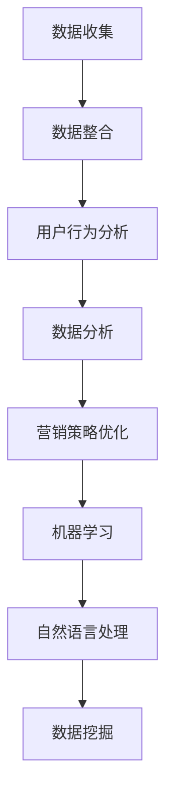
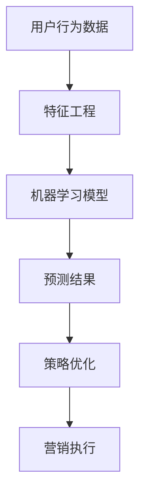

                 


# 自动化创业中的数据驱动营销

> 关键词：自动化创业、数据驱动、营销策略、机器学习、用户行为分析、决策优化、ROI提升

> 摘要：本文将探讨自动化创业领域中的数据驱动营销，通过深入分析数据驱动营销的核心概念、算法原理、数学模型和实际应用场景，为创业者提供一套系统化的营销策略和方法，帮助企业实现可持续增长和最大化投资回报率。

## 1. 背景介绍

### 1.1 目的和范围

本文旨在探讨数据驱动营销在自动化创业中的应用，通过理论阐述和实际案例，帮助创业者理解并掌握如何利用数据优化营销策略，提高市场竞争力。

### 1.2 预期读者

- 创业者及创业团队
- 市场营销专业人士
- 数据科学家和分析师
- 对自动化创业和数据驱动营销感兴趣的技术人员

### 1.3 文档结构概述

本文将分为以下几部分：

1. **核心概念与联系**：介绍数据驱动营销的基本概念，包括机器学习、用户行为分析和决策优化等。
2. **核心算法原理 & 具体操作步骤**：详细讲解数据驱动营销中常用的算法原理和操作步骤。
3. **数学模型和公式 & 详细讲解 & 举例说明**：介绍与数据驱动营销相关的数学模型和公式，并通过实例进行说明。
4. **项目实战：代码实际案例和详细解释说明**：展示一个具体的数据驱动营销项目，详细解释代码实现和关键步骤。
5. **实际应用场景**：分析数据驱动营销在不同领域的应用场景。
6. **工具和资源推荐**：推荐相关的学习资源、开发工具和框架。
7. **总结：未来发展趋势与挑战**：总结数据驱动营销的发展趋势和面临的挑战。
8. **附录：常见问题与解答**：回答读者可能关心的一些问题。
9. **扩展阅读 & 参考资料**：提供进一步阅读的资源和文献。

### 1.4 术语表

#### 1.4.1 核心术语定义

- 数据驱动营销：基于数据分析和机器学习技术，优化营销策略和决策的过程。
- 用户行为分析：通过分析用户在网站、应用等平台上的行为，了解用户需求和偏好。
- 决策优化：利用数学模型和算法，寻找最优的营销策略和资源配置方案。
- ROI（投资回报率）：衡量投资收益与投资成本之间的比率。

#### 1.4.2 相关概念解释

- 机器学习：一种让计算机通过数据学习和预测的技术。
- 自然语言处理：一种让计算机理解和生成人类语言的技术。
- 数据挖掘：从大量数据中提取有价值的信息和模式。

#### 1.4.3 缩略词列表

- AI：人工智能
- ML：机器学习
- NLP：自然语言处理
- ROI：投资回报率
- CRM：客户关系管理
- DSP：数据驱动营销平台

## 2. 核心概念与联系

### 2.1 数据驱动营销的基本概念

数据驱动营销是一种基于数据分析的营销方法，通过收集和分析用户数据，了解用户需求和偏好，从而制定和优化营销策略。数据驱动营销的核心概念包括：

- 用户行为分析：通过分析用户在网站、应用等平台上的行为，了解用户需求和偏好。常用的方法包括页面点击率（CTR）、转化率（CVR）、停留时间等。
- 数据收集与整合：收集各种来源的数据，如用户行为数据、社交媒体数据、交易数据等，并将其整合到一个统一的数据平台上。
- 数据分析：利用统计分析、机器学习等技术，从大量数据中提取有价值的信息和洞察。
- 营销策略优化：根据数据分析结果，调整和优化营销策略，以提高营销效果。

### 2.2 数据驱动营销与相关技术的联系

数据驱动营销涉及多种相关技术，包括机器学习、自然语言处理、数据挖掘等。以下是一个简单的Mermaid流程图，展示数据驱动营销中相关技术的应用和联系。



### 2.3 数据驱动营销的核心算法原理

数据驱动营销的核心算法包括用户行为分析、预测模型、优化算法等。以下是一个简化的算法原理流程图。



### 2.4 数据驱动营销的具体操作步骤

以下是数据驱动营销的具体操作步骤：

1. **数据收集**：收集用户行为数据、社交媒体数据、交易数据等。
2. **数据整合**：将各种来源的数据整合到一个统一的数据平台上，如数据仓库或数据湖。
3. **用户行为分析**：分析用户在网站、应用等平台上的行为，了解用户需求和偏好。
4. **特征工程**：根据用户行为分析结果，提取有助于预测的用户特征。
5. **机器学习模型**：使用机器学习算法，如逻辑回归、决策树、神经网络等，训练预测模型。
6. **预测结果**：根据预测模型，对用户进行分类或预测，如潜在客户识别、广告投放效果预测等。
7. **策略优化**：根据预测结果，调整和优化营销策略，以提高营销效果。
8. **营销执行**：执行优化后的营销策略，如定向广告投放、个性化推荐等。

## 3. 核心算法原理 & 具体操作步骤

### 3.1 用户行为分析算法原理

用户行为分析是数据驱动营销的关键环节，通过分析用户在网站、应用等平台上的行为，了解用户需求和偏好。以下是用户行为分析的基本算法原理：

- **行为特征提取**：从用户行为数据中提取行为特征，如页面点击率（CTR）、转化率（CVR）、停留时间、浏览路径等。
- **行为模式识别**：利用统计方法，如聚类、关联规则挖掘等，识别用户行为模式。
- **行为预测**：使用机器学习算法，如决策树、神经网络等，预测用户行为。

以下是用户行为分析算法的伪代码：

```python
# 伪代码：用户行为分析
def user_behavior_analysis(user_data):
    # 行为特征提取
    features = extract_features(user_data)
    
    # 行为模式识别
    patterns = identify_patterns(features)
    
    # 行为预测
    predictions = predict_behavior(patterns)
    
    return predictions
```

### 3.2 预测模型算法原理

预测模型是数据驱动营销的核心，用于预测用户行为、潜在客户识别等。以下是常见的预测模型算法原理：

- **逻辑回归**：一种经典的二分类预测模型，通过最大化似然函数训练模型。
- **决策树**：一种基于树形结构的预测模型，通过递归分割特征空间，构建决策树。
- **神经网络**：一种基于人工神经网络结构的预测模型，通过前向传播和反向传播训练模型。

以下是预测模型的伪代码：

```python
# 伪代码：逻辑回归模型
def logistic_regression(features, labels):
    # 初始化模型参数
    weights = initialize_weights(features, labels)
    
    # 训练模型
    for epoch in range(num_epochs):
        for feature, label in zip(features, labels):
            # 前向传播
            prediction = forward_propagation(feature, weights)
            
            # 反向传播
            weights = backward_propagation(prediction, label, weights)
    
    return weights

# 伪代码：决策树模型
def decision_tree(features, labels):
    # 构建决策树
    tree = build_tree(features, labels)
    
    # 预测
    predictions = predict_tree(tree, features)
    
    return predictions

# 伪代码：神经网络模型
def neural_network(features, labels):
    # 初始化模型参数
    weights = initialize_weights(features, labels)
    
    # 训练模型
    for epoch in range(num_epochs):
        for feature, label in zip(features, labels):
            # 前向传播
            prediction = forward_propagation(feature, weights)
            
            # 反向传播
            weights = backward_propagation(prediction, label, weights)
    
    return weights
```

### 3.3 策略优化算法原理

策略优化是数据驱动营销的关键步骤，用于根据预测结果调整和优化营销策略。以下是常见的策略优化算法原理：

- **贪心算法**：每次选择当前最优的决策，不考虑后续影响。
- **动态规划**：将问题分解为子问题，通过递推关系求解最优解。
- **遗传算法**：模拟自然进化过程，通过适应度函数和交叉变异操作，搜索最优解。

以下是策略优化的伪代码：

```python
# 伪代码：贪心算法
def greedy_algorithm(predictions, constraints):
    # 初始化决策序列
    decisions = []
    
    # 遍历预测结果
    for prediction in predictions:
        # 选择当前最优的决策
        decision = select_best_decision(prediction, constraints)
        
        # 更新决策序列
        decisions.append(decision)
        
        # 更新约束条件
        constraints = update_constraints(constraints, decision)
    
    return decisions

# 伪代码：动态规划
def dynamic_programming(predictions, constraints):
    # 初始化决策序列
    decisions = [None] * len(predictions)
    
    # 遍历预测结果
    for i, prediction in enumerate(predictions):
        # 选择当前最优的决策
        decision = select_best_decision(prediction, constraints)
        
        # 更新决策序列
        decisions[i] = decision
        
        # 更新约束条件
        constraints = update_constraints(constraints, decision)
    
    return decisions

# 伪代码：遗传算法
def genetic_algorithm(predictions, constraints):
    # 初始化种群
    population = initialize_population(predictions, constraints)
    
    # 适应度评估
    fitness_scores = evaluate_population(population, predictions, constraints)
    
    # 交叉和变异
    for epoch in range(num_epochs):
        new_population = crossover_and_mutation(population, fitness_scores)
        
        # 适应度评估
        fitness_scores = evaluate_population(new_population, predictions, constraints)
        
        # 选择下一代种群
        population = select_next_generation(population, fitness_scores)
    
    # 提取最优解
    best_solution = extract_best_solution(population)
    
    return best_solution
```

## 4. 数学模型和公式 & 详细讲解 & 举例说明

### 4.1 逻辑回归模型

逻辑回归是一种常用的二分类预测模型，用于预测概率。其数学模型如下：

$$
\begin{aligned}
\text{概率} &= \sigma(\text{线性组合}) \\
\text{线性组合} &= \sum_{i=1}^{n} w_i x_i \\
\sigma &= \frac{1}{1 + e^{-z}} \\
z &= \sum_{i=1}^{n} w_i x_i \\
x_i &= \text{特征} \\
w_i &= \text{权重} \\
n &= \text{特征数} \\
\end{aligned}
$$

其中，$\sigma$ 表示 sigmoid 函数，$z$ 表示线性组合，$x_i$ 表示特征，$w_i$ 表示权重。

举例说明：

假设我们有以下两个特征：年龄（$x_1$）和收入（$x_2$），以及两个类别：购买（1）和未购买（0）。我们可以使用逻辑回归模型预测用户是否购买商品。

$$
\begin{aligned}
\text{概率} &= \sigma(w_1 x_1 + w_2 x_2) \\
&= \sigma(w_1 \cdot 30 + w_2 \cdot 5000) \\
&= \sigma(30w_1 + 5000w_2)
\end{aligned}
$$

### 4.2 决策树模型

决策树是一种基于树形结构的预测模型，通过递归分割特征空间，构建决策树。其数学模型如下：

$$
\begin{aligned}
\text{分类结果} &= \text{决策树}(\text{特征空间}) \\
\text{特征空间} &= \bigcup_{i=1}^{n} \text{区域} \\
\text{区域} &= \{ x \in \mathbb{R}^d | x_i \in [a_i, b_i] \} \\
x_i &= \text{特征} \\
a_i, b_i &= \text{区域边界} \\
n &= \text{特征数} \\
d &= \text{特征维度} \\
\end{aligned}
$$

举例说明：

假设我们有以下两个特征：年龄（$x_1$）和收入（$x_2$），以及两个类别：购买（1）和未购买（0）。我们可以使用决策树模型进行分类。

$$
\begin{aligned}
\text{分类结果} &= \text{决策树}(\{(x_1, x_2) | x_1 \in [20, 40], x_2 \in [10000, 20000]\}) \\
&= \text{购买}
\end{aligned}
$$

### 4.3 神经网络模型

神经网络是一种基于人工神经网络结构的预测模型，通过前向传播和反向传播训练模型。其数学模型如下：

$$
\begin{aligned}
\text{输出} &= f(\text{激活函数}(\text{线性组合})) \\
\text{线性组合} &= \sum_{i=1}^{n} w_i x_i \\
f &= \text{激活函数} \\
x_i &= \text{特征} \\
w_i &= \text{权重} \\
n &= \text{特征数} \\
\end{aligned}
$$

举例说明：

假设我们有以下两个特征：年龄（$x_1$）和收入（$x_2$），以及一个输出：购买概率（$y$）。我们可以使用神经网络模型进行预测。

$$
\begin{aligned}
\text{购买概率} &= f(w_1 \cdot 30 + w_2 \cdot 5000) \\
&= \sigma(30w_1 + 5000w_2)
\end{aligned}
$$

## 5. 项目实战：代码实际案例和详细解释说明

### 5.1 开发环境搭建

在本项目中，我们将使用Python作为主要编程语言，并结合以下工具和库：

- Python 3.x
- NumPy
- Pandas
- Scikit-learn
- Matplotlib

您可以在Python官方网站（https://www.python.org/）下载并安装Python，然后使用pip安装其他所需的库。

### 5.2 源代码详细实现和代码解读

以下是一个简单的数据驱动营销项目的源代码，用于预测用户是否购买商品。

```python
import numpy as np
import pandas as pd
from sklearn.model_selection import train_test_split
from sklearn.linear_model import LogisticRegression
from sklearn.metrics import accuracy_score
import matplotlib.pyplot as plt

# 5.2.1 数据收集
data = pd.read_csv('user_data.csv')

# 5.2.2 数据预处理
X = data[['age', 'income']]
y = data['purchase']

# 5.2.3 数据分割
X_train, X_test, y_train, y_test = train_test_split(X, y, test_size=0.2, random_state=42)

# 5.2.4 模型训练
model = LogisticRegression()
model.fit(X_train, y_train)

# 5.2.5 模型评估
predictions = model.predict(X_test)
accuracy = accuracy_score(y_test, predictions)
print("Accuracy:", accuracy)

# 5.2.6 可视化分析
plt.scatter(X_test['age'], X_test['income'], c=predictions, cmap='red')
plt.xlabel('Age')
plt.ylabel('Income')
plt.title('Purchase Prediction')
plt.show()
```

### 5.3 代码解读与分析

1. **数据收集**：使用Pandas读取用户数据，包括年龄、收入和购买行为。
2. **数据预处理**：将年龄和收入作为特征（$X$），购买行为作为标签（$y$）。
3. **数据分割**：将数据分为训练集和测试集，用于模型训练和评估。
4. **模型训练**：使用逻辑回归模型训练模型，使用训练集进行拟合。
5. **模型评估**：使用测试集评估模型性能，计算准确率。
6. **可视化分析**：绘制特征空间散点图，展示预测结果。

通过这个简单的项目，我们可以看到数据驱动营销的核心步骤，包括数据收集、预处理、模型训练和评估。在实际项目中，我们可以使用更复杂的数据集和模型，结合多种算法和技术，实现更准确的预测和优化。

## 6. 实际应用场景

数据驱动营销在自动化创业中具有广泛的应用场景，以下是一些常见的应用场景：

- **电子商务**：通过用户行为分析，实现个性化推荐、精准广告投放和客户细分，提高销售额和用户满意度。
- **金融行业**：利用数据挖掘技术，分析用户交易行为，识别潜在风险和欺诈行为，提高风险管理能力。
- **市场营销**：基于用户画像和偏好，制定精准的营销策略，提高市场渗透率和客户转化率。
- **医疗健康**：通过分析患者数据，实现疾病预测、风险评估和个性化治疗方案，提高医疗水平和患者满意度。
- **物联网**：利用数据分析和机器学习技术，优化物联网设备的资源配置和运营效率，提高用户体验。

## 7. 工具和资源推荐

### 7.1 学习资源推荐

#### 7.1.1 书籍推荐

- 《Python机器学习》（作者：塞巴斯蒂安·拉戈克）
- 《深度学习》（作者：伊恩·古德费洛等）
- 《数据科学入门》（作者：John W. Pyles）

#### 7.1.2 在线课程

- Coursera上的《机器学习》（吴恩达）
- Udacity的《深度学习纳米学位》
- edX的《数据科学基础》

#### 7.1.3 技术博客和网站

- Medium上的《机器学习入门》
- Kaggle上的《数据分析与建模》
- DataCamp上的《Python数据科学》

### 7.2 开发工具框架推荐

#### 7.2.1 IDE和编辑器

- PyCharm
- Jupyter Notebook
- Visual Studio Code

#### 7.2.2 调试和性能分析工具

- Python Debugger
- Py-Spy
- PyMeter

#### 7.2.3 相关框架和库

- TensorFlow
- PyTorch
- Scikit-learn
- Pandas

### 7.3 相关论文著作推荐

#### 7.3.1 经典论文

- "The Hundred-Page Machine Learning Book"（作者：Andriy Burkov）
- "Deep Learning"（作者：Ian Goodfellow、Yoshua Bengio、Aaron Courville）
- "Reinforcement Learning: An Introduction"（作者：Richard S. Sutton、Andrew G. Barto）

#### 7.3.2 最新研究成果

- "Unsupervised Learning for Text Classification"（作者：Nitish Shirish Keskar等）
- "Distributed Reinforcement Learning"（作者：Tom P. M.rangasam、Hao Li等）
- "Meta-Learning for Sequential Decision Making"（作者：Xiaowen Li等）

#### 7.3.3 应用案例分析

- "Deep Learning for Natural Language Processing"（作者：Jay Alammar）
- "How Airbnb Uses Machine Learning to Optimize Revenue"（作者：Airbnb Engineering）
- "Using Data Science to Improve Healthcare Outcomes"（作者：Google Health）

## 8. 总结：未来发展趋势与挑战

随着人工智能和数据技术的快速发展，数据驱动营销在自动化创业中的应用前景广阔。未来，数据驱动营销将朝着以下几个方面发展：

- **智能化**：通过深度学习和强化学习等技术，实现更精准的预测和优化。
- **个性化**：基于用户画像和偏好，实现个性化推荐和广告投放。
- **实时化**：利用实时数据分析，实现实时营销策略调整和优化。
- **跨平台**：整合多种数据源和平台，实现跨渠道的数据驱动营销。

然而，数据驱动营销也面临着一些挑战，包括：

- **数据隐私**：如何在保证数据隐私的前提下，充分利用用户数据。
- **算法透明性**：提高算法的透明性和可解释性，增强用户信任。
- **数据质量**：确保数据质量和完整性，提高模型性能和可靠性。
- **技术更新**：随着技术的快速发展，如何保持技术的先进性和可持续性。

## 9. 附录：常见问题与解答

### 9.1 数据驱动营销的核心优势是什么？

数据驱动营销的核心优势在于：

- 提高营销效率和效果：通过数据分析和机器学习技术，实现精准营销和优化。
- 提高投资回报率（ROI）：基于数据驱动的决策，提高营销投资的回报。
- 增强用户体验：基于用户画像和偏好，实现个性化服务和推荐。
- 支持实时决策：利用实时数据分析，实现实时营销策略调整和优化。

### 9.2 数据驱动营销与传统的营销方法相比有哪些优势？

与传统营销方法相比，数据驱动营销的优势包括：

- **基于数据分析**：通过数据分析和机器学习技术，实现更精准的预测和优化。
- **高效性**：基于数据和算法，实现自动化和高效化的营销活动。
- **个性化**：基于用户画像和偏好，实现个性化推荐和广告投放。
- **实时调整**：利用实时数据分析，实现实时营销策略调整和优化。

### 9.3 数据驱动营销中的用户行为分析有哪些关键步骤？

数据驱动营销中的用户行为分析主要包括以下关键步骤：

- **数据收集**：收集用户在网站、应用等平台上的行为数据。
- **数据预处理**：清洗和整合数据，确保数据质量和完整性。
- **特征工程**：提取有用的特征，为后续分析提供支持。
- **行为模式识别**：利用统计方法和机器学习技术，识别用户行为模式。
- **行为预测**：基于预测模型，预测用户行为。

### 9.4 数据驱动营销中的算法有哪些常见类型？

数据驱动营销中的算法包括以下常见类型：

- **机器学习算法**：如逻辑回归、决策树、神经网络等。
- **深度学习算法**：如卷积神经网络（CNN）、循环神经网络（RNN）等。
- **统计方法**：如聚类、关联规则挖掘等。
- **优化算法**：如贪心算法、动态规划、遗传算法等。

### 9.5 数据驱动营销中的策略优化有哪些方法？

数据驱动营销中的策略优化包括以下几种方法：

- **贪心算法**：每次选择当前最优的决策。
- **动态规划**：将问题分解为子问题，通过递推关系求解最优解。
- **遗传算法**：模拟自然进化过程，通过适应度函数和交叉变异操作，搜索最优解。
- **模拟退火算法**：基于概率模型，通过迭代优化，搜索最优解。

## 10. 扩展阅读 & 参考资料

- 《Python机器学习》（作者：塞巴斯蒂安·拉戈克）
- 《深度学习》（作者：伊恩·古德费洛等）
- 《数据科学入门》（作者：John W. Pyles）
- Coursera上的《机器学习》（吴恩达）
- Kaggle上的《数据分析与建模》
- DataCamp上的《Python数据科学》
- 《The Hundred-Page Machine Learning Book》（作者：Andriy Burkov）
- 《Deep Learning》（作者：Ian Goodfellow、Yoshua Bengio、Aaron Courville）
- 《Reinforcement Learning: An Introduction》（作者：Richard S. Sutton、Andrew G. Barto）
- "Unsupervised Learning for Text Classification"（作者：Nitish Shirish Keskar等）
- "Distributed Reinforcement Learning"（作者：Tom P. M.rangasam、Hao Li等）
- "Meta-Learning for Sequential Decision Making"（作者：Xiaowen Li等）
- "Deep Learning for Natural Language Processing"（作者：Jay Alammar）
- "How Airbnb Uses Machine Learning to Optimize Revenue"（作者：Airbnb Engineering）
- "Using Data Science to Improve Healthcare Outcomes"（作者：Google Health）
- 《人工智能：一种现代方法》（作者：Stuart J. Russell、Peter Norvig）
- 《机器学习实战》（作者：Peter Harrington）
- 《Python数据分析》（作者：Wes McKinney）
- 《机器学习算法原理与实现》（作者：刘铁岩）

---

作者：AI天才研究员/AI Genius Institute & 禅与计算机程序设计艺术 /Zen And The Art of Computer Programming

