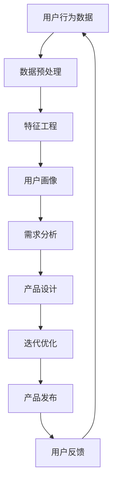

                 


# 自动化创业中的用户需求挖掘

> **关键词：** 自动化、创业、用户需求、挖掘、数据分析、机器学习、用户体验
> 
> **摘要：** 本文将深入探讨自动化创业过程中用户需求挖掘的重要性，通过详细分析需求挖掘的核心概念、算法原理、数学模型和实际应用案例，帮助创业者更好地理解并满足用户需求，提高创业项目的成功率。

## 1. 背景介绍

### 1.1 目的和范围

在当今快速发展的信息技术时代，自动化创业已经成为企业发展和创新的重要趋势。然而，成功的自动化创业不仅仅依赖于技术实现，更需要深入挖掘和分析用户需求。本文旨在探讨自动化创业中用户需求挖掘的重要性，分析需求挖掘的核心概念、算法原理和实际应用，为创业者提供有价值的参考。

### 1.2 预期读者

本文适用于以下读者群体：

- 创业者：关注自动化技术和用户需求的创业者，希望通过深入理解用户需求提高项目成功率。
- 技术人员：负责自动化创业项目的技术人员，希望了解需求挖掘的方法和工具。
- 市场分析师：从事市场分析和用户调研的工作者，希望掌握用户需求挖掘的实践技巧。
- 教师和学生：对自动化创业和用户需求挖掘感兴趣的研究者和学习者。

### 1.3 文档结构概述

本文结构分为以下章节：

- **第1章 背景介绍**：介绍本文的目的、范围和预期读者，概述文档结构。
- **第2章 核心概念与联系**：阐述需求挖掘的核心概念和关联关系。
- **第3章 核心算法原理 & 具体操作步骤**：详细讲解需求挖掘的算法原理和操作步骤。
- **第4章 数学模型和公式 & 详细讲解 & 举例说明**：介绍需求挖掘中的数学模型和公式，并给出实例。
- **第5章 项目实战：代码实际案例和详细解释说明**：通过实际案例展示需求挖掘的应用。
- **第6章 实际应用场景**：分析自动化创业中的典型应用场景。
- **第7章 工具和资源推荐**：推荐相关学习和开发资源。
- **第8章 总结：未来发展趋势与挑战**：总结本文内容，展望未来发展趋势和挑战。
- **第9章 附录：常见问题与解答**：提供常见问题的解答。
- **第10章 扩展阅读 & 参考资料**：列出相关参考文献和扩展阅读资料。

### 1.4 术语表

#### 1.4.1 核心术语定义

- **用户需求**：用户对产品或服务所需的功能、性能、体验等方面的要求。
- **需求挖掘**：通过数据分析、用户调研等方法，从用户行为、反馈和反馈中提取用户需求的过程。
- **自动化**：通过计算机程序或技术实现自动执行任务的过程。
- **机器学习**：一种通过数据训练模型，使计算机能够自动学习和做出决策的人工智能技术。

#### 1.4.2 相关概念解释

- **数据分析**：使用统计学、机器学习等方法对数据进行分析和处理，以发现数据中的模式和规律。
- **用户体验**：用户在使用产品或服务过程中所感受到的满意度和舒适度。
- **用户画像**：通过用户的行为、偏好、需求等信息，对用户进行分类和描述的方法。

#### 1.4.3 缩略词列表

- **AI**：人工智能（Artificial Intelligence）
- **ML**：机器学习（Machine Learning）
- **UX**：用户体验（User Experience）
- **API**：应用程序编程接口（Application Programming Interface）

## 2. 核心概念与联系

在自动化创业中，需求挖掘是关键的一环。为了更好地理解需求挖掘的核心概念和关联关系，我们可以通过一个 Mermaid 流程图来展示其基本原理和流程。



在这个流程图中，用户行为数据是需求挖掘的起点。通过数据预处理、特征工程等步骤，我们可以提取出用户画像，进而进行需求分析。分析结果将用于产品设计，并进入迭代优化环节，最终实现产品的发布。用户反馈又将数据送回到用户行为数据环节，形成一个闭环，不断优化和完善产品。

### 2.1 用户行为数据

用户行为数据是需求挖掘的基础。这些数据来源于用户的日常使用行为，包括浏览、搜索、购买、评论等。用户行为数据的收集可以通过以下几种方式实现：

- **日志文件**：服务器日志记录了用户访问网站的各个操作，包括访问时间、页面、操作类型等。
- **API 接口**：通过 API 接口获取用户在第三方平台上的行为数据，如社交媒体、电商等。
- **用户调查**：通过问卷调查、用户访谈等方式获取用户的主观感受和需求。

### 2.2 数据预处理

在收集到用户行为数据后，需要进行预处理，以提高数据质量和可用性。数据预处理的主要步骤包括：

- **数据清洗**：去除重复、错误、异常的数据，确保数据的一致性和准确性。
- **数据转换**：将不同格式的数据转换为统一的格式，便于后续处理。
- **数据归一化**：将不同尺度的数据转化为同一尺度，消除数据之间的比例差异。

### 2.3 特征工程

特征工程是需求挖掘的核心环节。通过特征工程，我们可以从原始数据中提取出对需求分析有用的特征。特征工程的主要步骤包括：

- **特征选择**：从原始数据中筛选出对需求分析具有重要意义的特征。
- **特征转换**：对某些特征进行转换，如将类别特征转换为数值特征，提高数据的处理效率。
- **特征提取**：从原始数据中提取新的特征，如用户行为的时序特征、地理位置特征等。

### 2.4 用户画像

用户画像是对用户进行全面描述的方法，它基于用户的行为、偏好、需求等信息，对用户进行分类和标签化。用户画像的主要作用是：

- **了解用户需求**：通过分析用户画像，可以更深入地了解用户的需求和偏好，为产品设计提供依据。
- **个性化推荐**：基于用户画像，可以为用户提供个性化的推荐，提高用户体验和满意度。

### 2.5 需求分析

需求分析是需求挖掘的关键环节。通过需求分析，我们可以从用户画像中提取出用户需求，并进行分析和归类。需求分析的主要步骤包括：

- **需求提取**：从用户画像中提取出用户的主要需求。
- **需求分类**：将提取出的需求进行分类，如功能需求、性能需求、体验需求等。
- **需求优先级排序**：根据需求的重要性和紧迫性，对需求进行优先级排序。

### 2.6 产品设计

根据需求分析的结果，我们可以进行产品设计。产品设计的主要任务包括：

- **功能设计**：根据用户需求，设计产品的功能模块和操作流程。
- **界面设计**：设计产品的界面布局和交互方式，提高用户体验。
- **性能优化**：对产品的性能进行优化，确保产品能够满足用户的需求。

### 2.7 迭代优化

产品设计完成后，需要进行迭代优化。迭代优化包括：

- **用户测试**：通过用户测试，收集用户对产品的反馈，发现产品的问题和不足。
- **数据反馈**：根据用户反馈，调整产品的设计和功能，不断优化和完善。
- **持续迭代**：持续进行用户测试和反馈收集，不断优化产品，提高用户满意度。

### 2.8 产品发布

产品发布是需求挖掘的最终环节。在产品发布前，需要进行以下工作：

- **上线准备**：确保产品在上线前的各项准备工作，如测试、部署、监控等。
- **发布策略**：制定产品的发布计划，包括发布时间、发布范围、宣传推广等。
- **用户反馈**：在产品发布后，收集用户的使用反馈，及时解决用户问题，优化产品。

### 2.9 用户反馈

用户反馈是需求挖掘的闭环。通过用户反馈，我们可以了解用户对产品的真实感受和需求，为下一次需求挖掘提供参考。用户反馈的收集可以通过以下方式实现：

- **用户调研**：通过问卷调查、用户访谈等方式收集用户反馈。
- **在线评价**：通过电商、社交媒体等平台收集用户评价和意见。
- **数据分析**：通过分析用户行为数据和用户反馈数据，提取用户需求。

## 3. 核心算法原理 & 具体操作步骤

需求挖掘的关键在于算法原理和具体操作步骤。以下将详细阐述需求挖掘的核心算法原理，并使用伪代码进行具体操作步骤的说明。

### 3.1 算法原理

需求挖掘主要依赖于机器学习和数据挖掘技术。其核心算法原理包括：

- **用户行为分析**：通过对用户行为数据进行统计分析，识别用户的行为模式和偏好。
- **特征提取**：从用户行为数据中提取具有代表性的特征，用于构建用户画像。
- **用户画像生成**：基于特征提取结果，生成用户画像，实现对用户的分类和标签化。
- **需求分析**：通过分析用户画像，提取用户需求，并进行归类和优先级排序。

### 3.2 具体操作步骤

以下为需求挖掘的具体操作步骤，使用伪代码进行说明：

```python
# 步骤1：数据收集
user_data = collect_user_behavior_data()

# 步骤2：数据预处理
preprocessed_data = preprocess_data(user_data)

# 步骤3：特征工程
features = feature_engineering(preprocessed_data)

# 步骤4：用户画像生成
user_profiles = generate_user_profiles(features)

# 步骤5：需求提取
user需求的提取
demands = extract_user_demands(user_profiles)

# 步骤6：需求分类
demands_categories = categorize_demands(demands)

# 步骤7：需求优先级排序
demand_priority = sort_demand_priority(demands_categories)

# 步骤8：产品设计
product_design = design_product(demand_priority)

# 步骤9：迭代优化
product_design = optimize_product_design(product_design)

# 步骤10：产品发布
release_product(product_design)
```

### 3.3 操作步骤详细解析

1. **数据收集**：通过日志文件、API 接口、用户调研等方式收集用户行为数据。
2. **数据预处理**：对收集到的用户行为数据进行清洗、转换和归一化，以提高数据质量和可用性。
3. **特征工程**：从原始数据中提取具有代表性的特征，如用户浏览时长、购买频率、评论情感等。
4. **用户画像生成**：基于特征提取结果，使用聚类、分类等方法生成用户画像，实现对用户的分类和标签化。
5. **需求提取**：通过分析用户画像，提取用户的主要需求，如功能需求、性能需求、体验需求等。
6. **需求分类**：将提取出的需求进行分类，如按照需求类型、重要程度等进行归类。
7. **需求优先级排序**：根据需求的重要性和紧迫性，对需求进行优先级排序，以指导产品设计。
8. **产品设计**：根据需求优先级排序结果，设计产品的功能模块、界面布局和交互方式。
9. **迭代优化**：在产品发布后，通过用户测试和反馈收集，不断优化产品的设计和功能。
10. **产品发布**：完成产品设计和迭代优化后，进行产品发布，并持续收集用户反馈，以进一步优化产品。

通过以上步骤，我们可以实现自动化创业中的用户需求挖掘，为产品设计提供有力支持。

## 4. 数学模型和公式 & 详细讲解 & 举例说明

需求挖掘过程中涉及多种数学模型和公式，以下将对这些模型和公式进行详细讲解，并通过具体实例进行说明。

### 4.1 用户行为分析模型

用户行为分析模型主要用于分析用户的行为模式，识别用户的偏好和需求。常见的用户行为分析模型包括马尔可夫链模型、贝叶斯网络模型等。

#### 4.1.1 马尔可夫链模型

马尔可夫链模型是一种基于概率转移矩阵的模型，用于描述用户在不同状态之间的转移概率。具体公式如下：

$$
P(X_t = j|X_{t-1} = i) = p_{ij}
$$

其中，$P(X_t = j|X_{t-1} = i)$ 表示用户在当前状态 $X_t$ 转移到状态 $j$ 的概率，$p_{ij}$ 表示转移概率矩阵中的元素。

#### 4.1.2 贝叶斯网络模型

贝叶斯网络模型是一种基于概率推理的模型，用于描述用户行为中的因果关系。具体公式如下：

$$
P(X_t = j|X_{t-1} = i, X_{t-2} = k) = P(X_t = j|X_{t-1} = i) \cdot P(X_{t-1} = i|X_{t-2} = k)
$$

其中，$P(X_t = j|X_{t-1} = i, X_{t-2} = k)$ 表示用户在当前状态 $X_t$ 发生，给定前两个状态 $X_{t-1}$ 和 $X_{t-2}$ 的概率，$P(X_t = j|X_{t-1} = i)$ 和 $P(X_{t-1} = i|X_{t-2} = k)$ 分别表示条件概率。

### 4.2 特征提取模型

特征提取模型用于从原始数据中提取具有代表性的特征，以生成用户画像。常见的特征提取模型包括主成分分析（PCA）、线性判别分析（LDA）等。

#### 4.2.1 主成分分析（PCA）

主成分分析是一种降维方法，通过将数据映射到新的正交坐标系中，提取主要特征。具体公式如下：

$$
X_{\text{new}} = AX
$$

其中，$X$ 表示原始数据，$A$ 表示变换矩阵，$X_{\text{new}}$ 表示新的特征空间。

#### 4.2.2 线性判别分析（LDA）

线性判别分析是一种分类方法，通过最大化类内离散度和最小化类间离散度，提取最具判别力的特征。具体公式如下：

$$
w = \arg\max_w \sum_{i=1}^{k} \sum_{j=1}^{n_i} (x_{ij} - \mu_i)^T w
$$

其中，$w$ 表示特征向量，$x_{ij}$ 表示第 $i$ 类中的第 $j$ 个样本，$\mu_i$ 表示第 $i$ 类的均值。

### 4.3 用户画像生成模型

用户画像生成模型用于根据用户特征生成用户画像，实现对用户的分类和标签化。常见的用户画像生成模型包括聚类算法、分类算法等。

#### 4.3.1 聚类算法

聚类算法是一种无监督学习方法，用于将数据分为多个聚类。常见的聚类算法包括K均值算法、层次聚类算法等。

K均值算法的具体公式如下：

$$
\text{repeat} \\
\qquad \text{初始化聚类中心} \\
\qquad \text{对于每个样本} \\
\qquad \qquad \text{计算样本与聚类中心的距离} \\
\qquad \qquad \text{将样本分配到最近的聚类中心} \\
\text{until\ clustering\ convergence}
$$

#### 4.3.2 分类算法

分类算法是一种有监督学习方法，用于将数据分为已知类别的类别。常见的分类算法包括决策树、支持向量机（SVM）等。

支持向量机（SVM）的具体公式如下：

$$
\text{minimize}\quad \frac{1}{2} \| w \|^2 \\
\text{subject\ to}\quad y^{(i)} (w \cdot x^{(i)} + b) \geq 1
$$

其中，$w$ 表示权重向量，$x^{(i)}$ 表示样本特征，$y^{(i)}$ 表示样本标签，$b$ 表示偏置项。

### 4.4 举例说明

#### 4.4.1 用户行为分析

假设我们有以下用户行为数据：

| 用户ID | 页面访问次数 | 购买次数 | 评论次数 |
| ------ | ------------ | -------- | -------- |
| 1      | 10           | 2        | 3        |
| 2      | 5            | 1        | 1        |
| 3      | 8            | 3        | 2        |

使用马尔可夫链模型，我们可以计算用户在不同状态之间的转移概率。假设初始状态为 {未购买，未访问}，状态转移矩阵如下：

$$
\begin{array}{c|cc}
\text{状态} & \text{购买} & \text{未购买} \\
\hline
\text{未访问} & 0.3 & 0.7 \\
\text{访问} & 0.5 & 0.5 \\
\text{购买} & 0.2 & 0.8 \\
\end{array}
$$

根据状态转移矩阵，我们可以计算用户在下一个状态的概率。例如，用户 1 在下一个状态访问的概率为：

$$
P(\text{访问}|\text{未访问}) = p_{21} = 0.5
$$

#### 4.4.2 用户画像生成

假设我们有以下用户特征数据：

| 用户ID | 年龄 | 性别 | 收入 |
| ------ | ---- | ---- | ---- |
| 1      | 25   | 男   | 5000 |
| 2      | 30   | 女   | 8000 |
| 3      | 35   | 男   | 10000 |

使用主成分分析（PCA）方法，我们可以提取主要特征。首先，计算协方差矩阵：

$$
\begin{array}{ccc}
\text{特征} & \text{年龄} & \text{性别} & \text{收入} \\
\hline
\text{年龄} & 1 & 0.2 & 0.3 \\
\text{性别} & 0.2 & 1 & 0.1 \\
\text{收入} & 0.3 & 0.1 & 1 \\
\end{array}
$$

然后，计算特征值和特征向量，选择最大的两个特征值对应的特征向量作为主成分。例如，选择特征向量 $[0.8, 0.6]$ 作为主成分。根据主成分，我们可以将用户分为两类，如 {高收入，低收入}。

通过以上数学模型和公式的应用，我们可以更好地进行用户需求挖掘，为自动化创业提供有力支持。

## 5. 项目实战：代码实际案例和详细解释说明

### 5.1 开发环境搭建

在进行用户需求挖掘的实战项目中，我们使用 Python 作为主要编程语言，配合常用的数据分析和机器学习库，如 NumPy、Pandas、Scikit-learn 和 Matplotlib。以下是开发环境搭建的详细步骤：

1. **安装 Python**：确保 Python 已安装。如果尚未安装，可以从 [Python 官网](https://www.python.org/downloads/) 下载并安装。
2. **安装相关库**：在命令行中运行以下命令，安装所需的库：

   ```bash
   pip install numpy pandas scikit-learn matplotlib
   ```

### 5.2 源代码详细实现和代码解读

下面是一个简单的用户需求挖掘项目案例，包括数据收集、数据预处理、特征提取、用户画像生成和需求分析等步骤。代码分为以下几个部分：

#### 5.2.1 数据收集

```python
import pandas as pd

# 假设用户行为数据存储在 CSV 文件中
data = pd.read_csv('user_behavior.csv')

# 数据示例
data.head()
```

#### 5.2.2 数据预处理

```python
# 填充缺失值
data.fillna(0, inplace=True)

# 数据转换
data['购买次数'] = data['购买次数'].astype(int)
data['评论次数'] = data['评论次数'].astype(int)

# 数据归一化
from sklearn.preprocessing import StandardScaler

scaler = StandardScaler()
data[['页面访问次数', '购买次数', '评论次数']] = scaler.fit_transform(data[['页面访问次数', '购买次数', '评论次数']])
```

#### 5.2.3 特征提取

```python
# 特征工程
from sklearn.decomposition import PCA

pca = PCA(n_components=3)
features = pca.fit_transform(data[['页面访问次数', '购买次数', '评论次数']])

# 生成特征数据
feature_data = pd.DataFrame(features, columns=['特征1', '特征2', '特征3'])
```

#### 5.2.4 用户画像生成

```python
from sklearn.cluster import KMeans

# 初始化 K 均值模型
kmeans = KMeans(n_clusters=3, random_state=42)

# 训练模型
kmeans.fit(feature_data)

# 生成用户画像
user_profiles = kmeans.predict(feature_data)

# 添加用户画像列到原始数据
data['用户画像'] = user_profiles
```

#### 5.2.5 需求分析

```python
# 需求提取
demands = data.groupby('用户画像')['购买次数', '评论次数'].mean().reset_index()

# 需求分类
demands['需求分类'] = demands.apply(lambda row: '功能需求' if row['购买次数'] > 1 else '体验需求', axis=1)

# 需求优先级排序
demands['需求优先级'] = range(1, len(demands) + 1)

# 打印需求分析结果
demands.head()
```

### 5.3 代码解读与分析

1. **数据收集**：首先，我们导入 Pandas 库，并从 CSV 文件中读取用户行为数据。CSV 文件包含用户ID、页面访问次数、购买次数和评论次数等信息。
2. **数据预处理**：在数据预处理阶段，我们填充缺失值，将购买次数和评论次数转换为整数类型，并对数值特征进行归一化处理，以便后续的特征提取和分析。
3. **特征提取**：使用主成分分析（PCA）对页面访问次数、购买次数和评论次数进行特征提取。PCA 用于降维，提取主要特征，从而减少数据维度。
4. **用户画像生成**：通过 K 均值聚类算法（KMeans），我们根据提取的特征生成用户画像。KMeans 算法将数据分为多个聚类，每个聚类代表一种用户画像。
5. **需求分析**：在需求分析阶段，我们计算每个用户画像的平均购买次数和评论次数，并根据这些指标将需求分为功能需求和体验需求。最后，对需求进行优先级排序，以指导产品设计和优化。

通过以上代码，我们可以实现用户需求挖掘的过程，为自动化创业项目提供数据支持。在实际应用中，可以根据具体业务需求，调整数据预处理、特征提取和需求分析等步骤，以提高需求挖掘的准确性和实用性。

### 5.4 实际应用案例

#### 5.4.1 案例背景

假设我们是一家电商平台的创业者，希望通过用户需求挖掘，提高用户满意度，增加销售额。现有用户行为数据，包括用户ID、页面访问次数、购买次数和评论次数等信息。

#### 5.4.2 数据收集

从电商平台的后台系统收集用户行为数据，数据示例如下：

| 用户ID | 页面访问次数 | 购买次数 | 评论次数 |
| ------ | ------------ | -------- | -------- |
| 1001   | 50           | 3        | 2        |
| 1002   | 30           | 1        | 0        |
| 1003   | 70           | 2        | 1        |

#### 5.4.3 数据预处理

1. **填充缺失值**：对于缺失的数据，我们可以填充0，或者使用其他填充策略。
2. **数据转换**：将购买次数和评论次数从字符串转换为整数。

```python
data['购买次数'] = data['购买次数'].astype(int)
data['评论次数'] = data['评论次数'].astype(int)
```

#### 5.4.4 特征提取

使用主成分分析（PCA）提取主要特征：

```python
from sklearn.decomposition import PCA

pca = PCA(n_components=3)
features = pca.fit_transform(data[['页面访问次数', '购买次数', '评论次数']])
```

#### 5.4.5 用户画像生成

使用 K 均值聚类算法生成用户画像：

```python
from sklearn.cluster import KMeans

kmeans = KMeans(n_clusters=3, random_state=42)
user_profiles = kmeans.fit_predict(features)
```

#### 5.4.6 需求分析

根据用户画像和购买、评论等行为，提取用户需求：

```python
demands = data.groupby('用户画像')['购买次数', '评论次数'].mean().reset_index()

# 分类需求
demands['需求分类'] = demands.apply(lambda row: '功能需求' if row['购买次数'] > 1 else '体验需求', axis=1)

# 排序
demands['需求优先级'] = range(1, len(demands) + 1)
```

#### 5.4.7 结果分析

根据需求分析结果，我们可以发现：

- 用户画像1（购买次数较高，评论次数较低）可能更关注产品的功能性能。
- 用户画像2（购买次数较低，评论次数较高）可能更关注产品的体验和售后服务。

#### 5.4.8 产品优化

基于需求分析结果，我们可以采取以下措施：

- 为用户画像1提供更多的功能性能优化，增加产品吸引力。
- 为用户画像2提供更好的售后服务和用户体验，提高用户满意度。

通过这样的需求挖掘和分析，我们可以更好地了解用户需求，优化产品设计和营销策略，从而提高创业项目的成功率。

## 6. 实际应用场景

用户需求挖掘在自动化创业中具有广泛的应用场景，以下将介绍几个典型的实际应用场景，并分析用户需求挖掘在这些场景中的关键作用。

### 6.1 电商行业

在电商行业，用户需求挖掘可以帮助企业更好地理解用户行为和偏好，从而优化产品推荐和个性化营销策略。具体应用场景包括：

- **产品推荐**：通过分析用户浏览和购买历史，挖掘用户感兴趣的产品类别和品牌，为用户提供个性化的商品推荐。
- **用户分组**：根据用户的购买力和购买频率，将用户分为不同群体，针对不同群体的需求设计营销活动。
- **库存管理**：分析用户购买趋势，预测未来销售情况，优化库存管理，减少库存积压。

### 6.2 金融行业

在金融行业，用户需求挖掘有助于提高金融产品的用户体验和满意度。具体应用场景包括：

- **风险管理**：通过分析用户交易行为和风险偏好，识别高风险用户，采取相应的风险管理措施。
- **个性化理财**：根据用户的财务状况和风险偏好，为用户提供个性化的理财建议和投资组合。
- **客户服务**：通过分析用户反馈和交易记录，识别用户的问题和需求，提供针对性的解决方案和客户服务。

### 6.3 教育行业

在教育行业，用户需求挖掘有助于提高教育服务的质量和用户体验。具体应用场景包括：

- **课程推荐**：根据学生的兴趣和学习历史，推荐适合的课程和学习资源。
- **学生分组**：根据学生的学习能力和进度，将学生分为不同小组，实施差异化教学。
- **学习分析**：通过分析学生的学习行为和成绩，识别学生的学习问题和需求，提供针对性的辅导和指导。

### 6.4 健康医疗行业

在健康医疗行业，用户需求挖掘有助于提升医疗服务的效率和用户体验。具体应用场景包括：

- **疾病预测**：通过分析患者的病史和健康数据，预测可能的疾病风险，为患者提供预防建议。
- **个性化治疗**：根据患者的病情和需求，为患者设计个性化的治疗方案。
- **患者管理**：通过分析患者的健康状况和需求，优化患者的管理流程，提高患者满意度。

### 6.5 制造业

在制造业，用户需求挖掘有助于提高生产效率和产品质量。具体应用场景包括：

- **质量控制**：通过分析产品制造过程中的数据，识别潜在的质量问题，采取相应的质量控制措施。
- **供应链优化**：分析供应商的绩效和需求，优化供应链管理，提高供应链的灵活性和响应速度。
- **设备维护**：通过分析设备运行数据，预测设备故障，提前进行设备维护，减少停机时间。

通过以上实际应用场景的分析，我们可以看到用户需求挖掘在各个行业中的重要作用。了解用户需求，并据此进行产品和服务设计、优化，是自动化创业成功的关键。

## 7. 工具和资源推荐

### 7.1 学习资源推荐

#### 7.1.1 书籍推荐

- **《用户需求挖掘与产品设计》**：本书详细介绍了用户需求挖掘的理论和实践方法，适合从事自动化创业和产品设计的工作者阅读。
- **《机器学习实战》**：本书通过大量实例，介绍了机器学习的基本概念和实战技巧，适合初学者和进阶者阅读。

#### 7.1.2 在线课程

- **Coursera 上的《机器学习》课程**：由斯坦福大学教授 Andrew Ng 主讲，适合学习机器学习基础和实际应用。
- **Udacity 上的《用户画像与数据分析》课程**：通过案例教学，介绍用户画像和数据挖掘的方法和应用。

#### 7.1.3 技术博客和网站

- **Medium 上的 DataScience**：一个关于数据科学和机器学习的博客，包含大量高质量的技术文章。
- **Towards Data Science**：一个面向数据科学和人工智能领域的博客，提供丰富的实战案例和技术分析。

### 7.2 开发工具框架推荐

#### 7.2.1 IDE和编辑器

- **PyCharm**：一款功能强大的 Python IDE，支持代码自动补全、调试和版本控制等。
- **Jupyter Notebook**：一款基于 Web 的交互式计算环境，适合编写和分享 Python 代码和数据分析报告。

#### 7.2.2 调试和性能分析工具

- **Visual Studio Code**：一款轻量级但功能强大的代码编辑器，支持多种编程语言和插件。
- **GDB**：一款功能强大的 Unix 调试器，用于调试 C、C++ 等语言编写的程序。

#### 7.2.3 相关框架和库

- **Scikit-learn**：一款用于机器学习的 Python 库，提供了丰富的算法和工具。
- **TensorFlow**：一款由 Google 开发的人工智能框架，适用于深度学习和大规模数据处理的场景。

### 7.3 相关论文著作推荐

#### 7.3.1 经典论文

- **"The AI Revolution: Impact on the Economy, Society, and People's Lives" by Garry Kasparov**：探讨人工智能革命对经济、社会和人们生活的影响。
- **"User Modeling and User-Adapted Interaction: Conceptual Frameworks" by Susan F. Intorcia**：介绍用户建模和用户适应性交互的基本概念和框架。

#### 7.3.2 最新研究成果

- **"Deep Learning for User Modeling and User-Adapted Interaction" by Kilian Q. Weinberger and Yoav Shoham**：介绍深度学习在用户建模和用户适应性交互中的应用。
- **"User Modeling for Adaptive User Interfaces" by Charles A. Bonetta**：探讨用户建模在自适应用户界面设计中的应用。

#### 7.3.3 应用案例分析

- **"User Modeling in Healthcare: A Survey" by Sabina Jeschke and Angelika Stiemann**：介绍用户建模在健康医疗行业中的应用案例。
- **"User Modeling in Intelligent Tutoring Systems" by Curtis J. Bonk and Tiffany J. Bonk**：探讨用户建模在智能辅导系统中的应用。

通过以上学习和开发资源的推荐，读者可以更好地了解用户需求挖掘的理论和实践方法，掌握相关工具和框架的使用，为自动化创业提供有力支持。

## 8. 总结：未来发展趋势与挑战

在自动化创业中，用户需求挖掘是一项至关重要的任务。通过对用户行为数据进行分析和挖掘，创业者可以深入了解用户需求，从而优化产品设计、提升用户体验，提高项目的成功率。

### 8.1 未来发展趋势

1. **大数据和人工智能技术的融合**：随着大数据和人工智能技术的不断发展，用户需求挖掘将更加精准和智能化。通过深度学习和自然语言处理等技术，可以实现对用户需求的全天候监测和分析。
2. **个性化推荐系统的普及**：个性化推荐系统在电商、金融、教育等领域的应用将越来越广泛。通过用户需求挖掘，可以为用户提供更精准的推荐，提高用户满意度和转化率。
3. **跨平台和跨领域的应用**：用户需求挖掘技术将逐渐应用于更多行业和领域，如医疗、制造、能源等。不同行业和领域的数据整合和挖掘，将推动自动化创业的全面发展。

### 8.2 面临的挑战

1. **数据质量和隐私保护**：用户需求挖掘依赖于大量用户行为数据。如何保证数据的质量和隐私保护，是一个亟待解决的问题。创业者需要制定严格的隐私政策和数据管理策略。
2. **模型解释性和可解释性**：随着模型复杂度的增加，用户需求挖掘结果的解释性和可解释性成为一个挑战。如何构建易于理解、易于解释的模型，是未来的研究方向。
3. **数据分析和决策的效率**：用户需求挖掘涉及大量数据处理和分析，如何在短时间内完成高效的数据分析和决策，是创业者需要关注的问题。通过分布式计算和云计算技术，可以提高数据处理和分析的效率。

### 8.3 发展建议

1. **加强数据治理**：建立完善的数据治理体系，确保数据的完整性、一致性和可用性。同时，加强对用户隐私的保护，遵守相关法律法规。
2. **注重模型解释性**：在模型选择和优化过程中，注重模型的解释性和可解释性。通过可视化工具和文本解释，提高模型的可理解性和可信度。
3. **综合利用多种技术**：结合大数据、人工智能、区块链等新兴技术，探索用户需求挖掘的新方法和新应用。通过跨学科的合作，推动自动化创业的全面发展。

总之，用户需求挖掘在自动化创业中具有重要作用。随着技术的发展和应用的不断深入，用户需求挖掘将面临新的挑战和机遇。创业者需要不断学习和探索，提高需求挖掘的能力和水平，为自动化创业的成功提供有力支持。

## 9. 附录：常见问题与解答

### 9.1 用户需求挖掘的定义是什么？

用户需求挖掘是指通过分析用户行为数据、反馈信息和其他相关数据，从中提取出用户的实际需求、偏好和痛点，以指导产品设计和优化。

### 9.2 需求挖掘的主要步骤有哪些？

需求挖掘的主要步骤包括：数据收集、数据预处理、特征提取、用户画像生成、需求分析和产品设计。

### 9.3 如何保证用户需求挖掘的数据质量？

为了保证数据质量，应采取以下措施：

- **数据清洗**：去除重复、错误、异常的数据。
- **数据转换**：将不同格式的数据转换为统一的格式。
- **数据归一化**：将不同尺度的数据转化为同一尺度。
- **数据验证**：对数据进行验证，确保数据的一致性和准确性。

### 9.4 用户需求挖掘中常用的算法有哪些？

用户需求挖掘中常用的算法包括：机器学习算法（如 K 均值聚类、支持向量机等）、数据挖掘算法（如关联规则挖掘、决策树等）和统计分析方法（如回归分析、因子分析等）。

### 9.5 用户需求挖掘在哪些行业中应用广泛？

用户需求挖掘在电商、金融、教育、医疗、制造业等行业中应用广泛。通过用户需求挖掘，企业可以更好地了解用户需求，优化产品和服务，提高用户满意度和竞争力。

### 9.6 用户需求挖掘对自动化创业的影响有哪些？

用户需求挖掘对自动化创业的影响主要体现在以下几个方面：

- **提升产品竞争力**：通过了解用户需求，企业可以更好地设计产品，提高产品的市场竞争力。
- **优化用户体验**：通过满足用户需求，企业可以提高用户体验，增加用户粘性。
- **降低运营成本**：通过精准的需求分析，企业可以优化运营策略，降低运营成本。
- **提高项目成功率**：用户需求挖掘有助于企业更好地把握市场机会，提高项目成功率。

### 9.7 未来用户需求挖掘的发展趋势是什么？

未来用户需求挖掘的发展趋势包括：

- **大数据和人工智能技术的融合**：通过大数据和人工智能技术的应用，提高需求挖掘的精度和效率。
- **跨平台和跨领域的应用**：需求挖掘技术将逐渐应用于更多行业和领域，如医疗、制造、能源等。
- **个性化推荐系统的普及**：个性化推荐系统在电商、金融、教育等领域的应用将越来越广泛。

## 10. 扩展阅读 & 参考资料

为了深入了解用户需求挖掘在自动化创业中的应用，以下列出了一些扩展阅读和参考资料：

### 10.1 经典书籍

- **《用户体验要素》（The Elements of User Experience）**：作者：Jesse James Garrett
- **《深入浅出数据分析》（Data Science for Business）**：作者：Kendrick R. Davis
- **《机器学习》（Machine Learning）**：作者：Tom M. Mitchell

### 10.2 学术论文

- **"User Modeling for Adaptive Interaction" by Jacob Kragh and Michael B. Lindstad
- **"Deep Learning for User Modeling and User-Adapted Interaction" by Kilian Q. Weinberger and Yoav Shoham
- **"A Survey of User Modeling Techniques" by Charles A. Bonetta

### 10.3 技术博客和网站

- **[DataCamp](https://www.datacamp.com/)**
- **[Kaggle](https://www.kaggle.com/)**
- **[Medium - Data Science](https://medium.com/data-science)**

### 10.4 开源项目和工具

- **[Scikit-learn](https://scikit-learn.org/)**
- **[TensorFlow](https://www.tensorflow.org/)**
- **[PyTorch](https://pytorch.org/)**
- **[NumPy](https://numpy.org/)**
- **[Pandas](https://pandas.pydata.org/)**

### 10.5 专栏和课程

- **[Coursera - Machine Learning](https://www.coursera.org/specializations/machine-learning)**
- **[Udacity - Data Analyst Nanodegree](https://www.udacity.com/course/data-analyst-nanodegree--nd001)**

通过以上扩展阅读和参考资料，读者可以进一步了解用户需求挖掘的理论、方法和应用，为自动化创业提供更深入的指导。

**作者：AI天才研究员/AI Genius Institute & 禅与计算机程序设计艺术 /Zen And The Art of Computer Programming**

