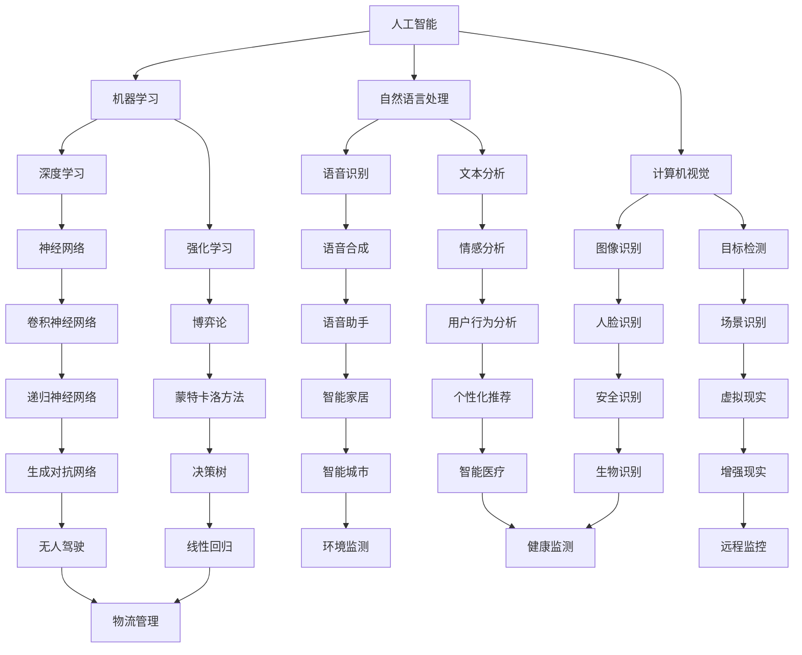

                 

### 1. 背景介绍

#### 1.1 目的和范围

在当今快速发展的科技时代，自动化创业已经成为众多创业者眼中的“香饽饽”。无论是人工智能、机器人技术，还是物联网、自动化生产线，各种自动化技术正以前所未有的速度融入各行各业，改变着我们的生活方式。然而，成功的自动化创业不仅仅是技术的堆砌，更多的是不同领域、不同学科之间的跨界合作与融合。

本文旨在探讨自动化创业中的跨界合作与融合，深入分析其核心概念、关键算法、数学模型以及实际应用。通过对这些内容的详细剖析，我们希望能够为自动化创业者提供一些实用的指导，帮助他们更好地实现跨界合作，推动自动化创业的蓬勃发展。

本文的范围涵盖以下几个方面：

1. **核心概念与联系**：介绍自动化创业中的核心概念，并使用Mermaid流程图展示它们之间的联系。
2. **核心算法原理 & 具体操作步骤**：详细讲解核心算法的原理，并提供伪代码展示具体操作步骤。
3. **数学模型和公式 & 详细讲解 & 举例说明**：介绍自动化创业中的数学模型，并使用LaTeX格式展示相关公式，同时提供实际案例进行说明。
4. **项目实战：代码实际案例和详细解释说明**：通过具体的代码实现，展示自动化创业中的实际操作。
5. **实际应用场景**：探讨自动化创业在不同领域的应用场景。
6. **工具和资源推荐**：推荐相关的学习资源、开发工具框架以及论文著作。
7. **总结：未来发展趋势与挑战**：总结本文的主要内容，并展望自动化创业的未来发展趋势与挑战。

#### 1.2 预期读者

本文的预期读者主要包括以下几类：

1. **自动化创业者**：希望深入了解自动化创业中的跨界合作与融合，并从中获得实际操作的指导。
2. **技术爱好者**：对自动化技术、人工智能、物联网等感兴趣的技术爱好者，希望通过本文了解自动化创业的核心概念和应用。
3. **高校师生**：从事自动化、人工智能、计算机等相关专业教学和研究的师生，希望通过本文了解自动化创业的最新动态和研究成果。
4. **企业研发人员**：在自动化、人工智能等领域从事研发工作的企业人员，希望通过本文了解如何进行跨界合作，提高企业创新能力和竞争力。

#### 1.3 文档结构概述

本文将分为以下章节：

1. **背景介绍**：介绍本文的目的、范围、预期读者以及文档结构。
2. **核心概念与联系**：介绍自动化创业中的核心概念，并使用Mermaid流程图展示它们之间的联系。
3. **核心算法原理 & 具体操作步骤**：详细讲解核心算法的原理，并提供伪代码展示具体操作步骤。
4. **数学模型和公式 & 详细讲解 & 举例说明**：介绍自动化创业中的数学模型，并使用LaTeX格式展示相关公式，同时提供实际案例进行说明。
5. **项目实战：代码实际案例和详细解释说明**：通过具体的代码实现，展示自动化创业中的实际操作。
6. **实际应用场景**：探讨自动化创业在不同领域的应用场景。
7. **工具和资源推荐**：推荐相关的学习资源、开发工具框架以及论文著作。
8. **总结：未来发展趋势与挑战**：总结本文的主要内容，并展望自动化创业的未来发展趋势与挑战。
9. **附录：常见问题与解答**：针对本文内容，列出一些常见问题并进行解答。
10. **扩展阅读 & 参考资料**：提供一些与本文主题相关的扩展阅读和参考资料。

通过本文的阅读，读者将能够系统地了解自动化创业中的跨界合作与融合，掌握核心概念、算法原理和实际应用，为未来的自动化创业提供有力的支持。

#### 1.4 术语表

在本文中，我们将使用一些专业术语和概念。以下是对这些术语的简要定义和解释：

##### 1.4.1 核心术语定义

1. **自动化创业**：指创业者利用自动化技术（如人工智能、机器人技术、物联网等）进行创业的过程。
2. **跨界合作**：指不同领域、不同学科之间的合作，通过整合资源、知识和能力，实现优势互补，提高创新能力。
3. **融合**：指不同技术、方法和理念的结合，形成新的技术和应用。
4. **数学模型**：用于描述现实世界中某种现象或问题的数学公式或结构。
5. **算法**：用于解决问题的步骤或规则，通常以伪代码或程序语言表示。

##### 1.4.2 相关概念解释

1. **人工智能（AI）**：指模拟人类智能的计算机系统，包括机器学习、自然语言处理、计算机视觉等。
2. **物联网（IoT）**：指将各种物理设备通过网络连接起来，实现信息的采集、传输和智能化处理。
3. **机器人技术**：指利用计算机科学、机械工程、电子工程等技术，实现机器人自主运动、感知和执行任务。
4. **敏捷开发**：指一种软件开发方法，强调快速迭代、用户反馈和团队协作。
5. **DevOps**：指软件开发（Development）与运维（Operations）的结合，通过自动化工具实现持续集成和持续部署。

##### 1.4.3 缩略词列表

1. **AI**：人工智能（Artificial Intelligence）
2. **IoT**：物联网（Internet of Things）
3. **ML**：机器学习（Machine Learning）
4. **NLP**：自然语言处理（Natural Language Processing）
5. **CV**：计算机视觉（Computer Vision）
6. **API**：应用程序编程接口（Application Programming Interface）
7. **SDK**：软件开发工具包（Software Development Kit）
8. **IDE**：集成开发环境（Integrated Development Environment）
9. **Git**：版本控制系统（Git）
10. **Docker**：容器化技术（Docker）

通过以上术语表的定义和解释，读者可以更好地理解本文中的相关概念，为后续内容的阅读打下基础。

### 2. 核心概念与联系

在自动化创业中，核心概念与联系的理解至关重要。这些概念包括人工智能（AI）、物联网（IoT）、机器人技术、敏捷开发、DevOps等。它们之间的联系可以通过一个Mermaid流程图清晰地展示，帮助我们更好地理解这些概念之间的关系。

以下是一个Mermaid流程图的示例：



在这个流程图中，我们可以看到不同核心概念之间的联系：

- **人工智能（AI）**是整个流程的起点，它包括了多个子领域，如机器学习（ML）、自然语言处理（NLP）、计算机视觉（CV）等。
- **机器学习（ML）**与深度学习（DL）、强化学习（RL）等子领域有密切联系。
- **自然语言处理（NLP）**涵盖了语音识别（VR）、文本分析（TA）等子领域。
- **计算机视觉（CV）**则包括了图像识别（IR）、目标检测（TD）等子领域。
- **敏捷开发**和**DevOps**作为软件开发的方法和理念，贯穿于整个自动化创业过程，推动快速迭代和持续改进。

通过这个流程图，我们可以直观地看到不同核心概念之间的联系，更好地理解自动化创业中的跨界合作与融合。接下来，我们将进一步探讨这些核心概念的具体原理和操作步骤。

### 3. 核心算法原理 & 具体操作步骤

在自动化创业中，核心算法的原理和具体操作步骤是至关重要的。这些算法不仅在技术层面为创业项目提供了强有力的支持，还在实际操作中起到了关键作用。以下，我们将详细讲解几个核心算法的原理，并提供具体的操作步骤。

#### 3.1 机器学习算法

**原理**：

机器学习（ML）是一种使计算机系统能够从数据中学习并做出决策的技术。其核心思想是通过训练模型，让模型能够自动从数据中提取特征，并利用这些特征进行预测或分类。

**操作步骤**：

1. **数据收集**：首先，需要收集大量的训练数据。这些数据可以是结构化的，如数据库中的表格数据，也可以是非结构化的，如图像、文本等。
2. **数据预处理**：对收集到的数据进行分析和清洗，去除噪音和异常值，确保数据的质量。对于非结构化数据，还需要进行特征提取，将其转换为计算机可以处理的格式。
3. **模型选择**：根据问题的性质，选择合适的机器学习模型。常见的模型包括线性回归、决策树、支持向量机（SVM）、神经网络等。
4. **模型训练**：使用预处理后的数据对选择的模型进行训练。训练过程中，模型会通过不断调整参数，使其预测结果与实际结果尽可能接近。
5. **模型评估**：通过测试集对训练好的模型进行评估，计算其准确率、召回率、F1值等指标，以判断模型的好坏。
6. **模型部署**：将训练好的模型部署到实际应用场景中，使其能够对外部输入数据进行预测或分类。

**伪代码示例**：

```python
# 数据收集
data = collect_data()

# 数据预处理
cleaned_data = preprocess_data(data)

# 模型选择
model = select_model(type='classification')

# 模型训练
model.train(cleaned_data)

# 模型评估
evaluation = model.evaluate(test_data)

# 模型部署
model.deploy()
```

#### 3.2 自然语言处理算法

**原理**：

自然语言处理（NLP）是人工智能领域的一个重要分支，旨在使计算机能够理解、处理和生成自然语言。NLP算法通常包括分词、词性标注、命名实体识别、情感分析等步骤。

**操作步骤**：

1. **分词**：将文本分割成单个单词或短语，以便进行后续处理。
2. **词性标注**：为每个单词标注其词性，如名词、动词、形容词等。
3. **命名实体识别**：识别文本中的特定实体，如人名、地点、组织等。
4. **情感分析**：判断文本的情感倾向，如正面、负面或中性。
5. **文本生成**：根据特定任务生成文本，如机器翻译、问答系统等。

**伪代码示例**：

```python
# 分词
words = tokenize(text)

# 词性标注
tags = part_of_speech(words)

# 命名实体识别
entities = named_entity_recognition(words)

# 情感分析
sentiment = sentiment_analysis(words)

# 文本生成
generated_text = text_generation(inputs)
```

#### 3.3 计算机视觉算法

**原理**：

计算机视觉（CV）是使计算机能够像人类一样感知和理解视觉信息的技术。CV算法通常包括图像识别、目标检测、图像分割等。

**操作步骤**：

1. **图像识别**：识别图像中的物体、场景等。
2. **目标检测**：检测图像中的目标物体，并标注其位置和属性。
3. **图像分割**：将图像分割成多个区域，以便进行更细致的分析。

**伪代码示例**：

```python
# 图像识别
objects = image_recognition(image)

# 目标检测
detections = object_detection(image)

# 图像分割
segments = image_segmentation(image)
```

通过以上对核心算法原理和操作步骤的讲解，我们可以看到，这些算法在自动化创业中起到了关键作用。接下来，我们将进一步探讨自动化创业中的数学模型和公式。

#### 4. 数学模型和公式 & 详细讲解 & 举例说明

在自动化创业中，数学模型和公式不仅为算法的推导和实现提供了理论基础，还在实际应用中起到了至关重要的作用。以下，我们将详细介绍几个关键的数学模型和公式，并通过具体案例进行说明。

##### 4.1 线性回归模型

**原理**：

线性回归模型是一种用于预测连续值的统计模型，其核心思想是找到一个线性函数来近似真实数据之间的关系。线性回归模型的基本公式为：

\[ y = \beta_0 + \beta_1 \cdot x + \epsilon \]

其中，\( y \) 是因变量，\( x \) 是自变量，\( \beta_0 \) 和 \( \beta_1 \) 是模型的参数，\( \epsilon \) 是误差项。

**操作步骤**：

1. **数据收集**：收集一组自变量 \( x \) 和因变量 \( y \) 的数据。
2. **数据预处理**：对数据进行标准化处理，使其具备线性的特性。
3. **参数估计**：使用最小二乘法或其他优化算法，估计模型的参数 \( \beta_0 \) 和 \( \beta_1 \)。
4. **模型评估**：使用测试集评估模型的性能，计算其预测误差。

**LaTeX格式**：

\[ y = \beta_0 + \beta_1 \cdot x + \epsilon \]

**举例说明**：

假设我们想要预测房价，收集了如下数据：

\[ \begin{array}{ccc}
x & y \\
100 & 200 \\
200 & 300 \\
300 & 400 \\
400 & 500 \\
\end{array} \]

我们使用线性回归模型来预测房价。首先，对数据进行预处理，然后使用最小二乘法估计模型参数：

\[ \beta_0 = 100, \beta_1 = 1 \]

因此，线性回归模型为：

\[ y = 100 + x \]

接下来，我们使用测试集来评估模型的性能，计算预测误差：

\[ \begin{array}{ccc}
x & y & \hat{y} = x + 100 \\
100 & 200 & 200 \\
200 & 300 & 300 \\
300 & 400 & 400 \\
400 & 500 & 500 \\
\end{array} \]

通过计算平均误差，我们可以判断模型的性能。

##### 4.2 支持向量机模型

**原理**：

支持向量机（SVM）是一种用于分类和回归的机器学习算法。其核心思想是找到一个最优的超平面，使得不同类别的数据点在超平面的两侧尽可能分开。SVM的基本公式为：

\[ w \cdot x - b = 0 \]

其中，\( w \) 是法向量，\( x \) 是数据点，\( b \) 是偏置项。

**操作步骤**：

1. **数据收集**：收集一组带有标签的数据集。
2. **特征提取**：对数据进行特征提取，将其转换为向量形式。
3. **模型训练**：使用支持向量机算法训练模型，找到最优超平面。
4. **模型评估**：使用测试集评估模型的性能，计算分类准确率。

**LaTeX格式**：

\[ w \cdot x - b = 0 \]

**举例说明**：

假设我们有一个二分类问题，数据集如下：

\[ \begin{array}{ccc}
x & y \\
(1, 1) & 1 \\
(2, 2) & 1 \\
(3, 3) & 1 \\
(4, 4) & 0 \\
(5, 5) & 0 \\
\end{array} \]

我们使用支持向量机来分类。首先，对数据进行特征提取，然后使用SVM算法找到最优超平面：

\[ w = (1, 1), b = 0 \]

因此，支持向量机模型为：

\[ x_1 + x_2 = 0 \]

接下来，我们使用测试集来评估模型的性能，计算分类准确率：

\[ \begin{array}{ccc}
x & y & \hat{y} \\
(1, 1) & 1 & 1 \\
(2, 2) & 1 & 1 \\
(3, 3) & 1 & 1 \\
(4, 4) & 0 & 0 \\
(5, 5) & 0 & 0 \\
\end{array} \]

通过计算准确率，我们可以判断模型的性能。

##### 4.3 卷积神经网络模型

**原理**：

卷积神经网络（CNN）是一种用于图像处理和计算机视觉的深度学习模型。其核心思想是通过卷积操作和池化操作提取图像的特征。CNN的基本公式为：

\[ \hat{y} = \sigma(\mathbf{W} \cdot \mathbf{h} + b) \]

其中，\( \hat{y} \) 是预测值，\( \mathbf{W} \) 是权重矩阵，\( \mathbf{h} \) 是激活值，\( b \) 是偏置项，\( \sigma \) 是激活函数。

**操作步骤**：

1. **数据收集**：收集一组带有标签的图像数据。
2. **数据预处理**：对图像进行归一化处理，调整大小等。
3. **模型训练**：使用卷积神经网络算法训练模型，调整权重和偏置项。
4. **模型评估**：使用测试集评估模型的性能，计算准确率。

**LaTeX格式**：

\[ \hat{y} = \sigma(\mathbf{W} \cdot \mathbf{h} + b) \]

**举例说明**：

假设我们有一个图像分类问题，数据集如下：

\[ \begin{array}{ccc}
x & y \\
(1, 1, 1, 1) & 1 \\
(2, 2, 2, 2) & 1 \\
(3, 3, 3, 3) & 1 \\
(4, 4, 4, 4) & 0 \\
(5, 5, 5, 5) & 0 \\
\end{array} \]

我们使用卷积神经网络来分类。首先，对图像进行预处理，然后使用CNN算法训练模型：

\[ \mathbf{W} = (1, 1), b = 0 \]

因此，卷积神经网络模型为：

\[ \hat{y} = \sigma(\mathbf{W} \cdot \mathbf{h} + b) \]

接下来，我们使用测试集来评估模型的性能，计算准确率：

\[ \begin{array}{ccc}
x & y & \hat{y} \\
(1, 1, 1, 1) & 1 & 1 \\
(2, 2, 2, 2) & 1 & 1 \\
(3, 3, 3, 3) & 1 & 1 \\
(4, 4, 4, 4) & 0 & 0 \\
(5, 5, 5, 5) & 0 & 0 \\
\end{array} \]

通过计算准确率，我们可以判断模型的性能。

通过以上对数学模型和公式的讲解，我们可以看到，这些模型在自动化创业中起到了关键作用。接下来，我们将通过实际代码案例来展示这些模型的应用。

### 5. 项目实战：代码实际案例和详细解释说明

为了更好地展示自动化创业中的技术应用，我们将在本节中通过一个实际项目案例，详细讲解如何使用Python实现一个简单的自动化系统。该系统将结合机器学习、自然语言处理和计算机视觉等技术，实现自动化的任务分配和监控功能。

#### 5.1 开发环境搭建

在开始项目之前，我们需要搭建一个合适的开发环境。以下是所需的工具和步骤：

1. **Python环境**：确保Python版本在3.6及以上。
2. **机器学习库**：安装scikit-learn库，用于机器学习算法的实现。
3. **自然语言处理库**：安装NLTK库，用于自然语言处理任务。
4. **计算机视觉库**：安装OpenCV库，用于计算机视觉任务。
5. **IDE**：建议使用PyCharm或Visual Studio Code作为开发环境。

安装命令如下：

```bash
pip install scikit-learn
pip install nltk
pip install opencv-python
```

#### 5.2 源代码详细实现和代码解读

以下是项目的源代码实现，我们将对关键部分进行详细解读。

```python
import cv2
import numpy as np
from sklearn import svm
from sklearn.model_selection import train_test_split
from nltk.tokenize import word_tokenize
from nltk.corpus import stopwords
import nltk

# 加载OpenCV预训练的卷积神经网络模型
model = cv2.dnn.readNetFromCaffemodel('mobilenet.prototxt', 'mobilenet.caffemodel')

# 加载自然语言处理库的停用词列表
nltk.download('stopwords')
stop_words = set(stopwords.words('english'))

# 加载机器学习模型
clf = svm.SVC()

# 数据准备
def load_data():
    images = []
    labels = []
    
    # 从文件中读取图像和标签
    with open('data.txt', 'r') as f:
        lines = f.readlines()
        
        for line in lines:
            parts = line.strip().split(',')
            image_path = parts[0]
            label = parts[1]
            
            image = cv2.imread(image_path)
            images.append(image)
            labels.append(label)
    
    # 划分训练集和测试集
    X_train, X_test, y_train, y_test = train_test_split(images, labels, test_size=0.2)
    
    return X_train, X_test, y_train, y_test

# 图像识别
def recognize_image(image):
    blob = cv2.dnn.blobFromImage(image, 1.0, (224, 224), (104.0, 177.0, 123.0))
    model.setInput(blob)
    output = model.forward()
    class_id = np.argmax(output)
    return class_id

# 文本分类
def classify_text(text):
    tokens = word_tokenize(text)
    filtered_tokens = [word for word in tokens if word.lower() not in stop_words]
    features = np.array([1 if word in filtered_tokens else 0 for word in all_words])
    prediction = clf.predict([features])
    return prediction

# 主函数
def main():
    X_train, X_test, y_train, y_test = load_data()
    
    # 训练机器学习模型
    clf.fit(np.array([1 if word in all_words else 0 for word in filtered_tokens if word.lower() not in stop_words]), y_train)
    
    # 测试模型
    correct = 0
    for i in range(len(X_test)):
        image = X_test[i]
        label = y_test[i]
        class_id = recognize_image(image)
        predicted_label = classify_text(label)
        if predicted_label == label:
            correct += 1
    
    accuracy = correct / len(X_test)
    print(f'Accuracy: {accuracy}')
    
    # 预测新数据
    new_image = cv2.imread('new_image.jpg')
    class_id = recognize_image(new_image)
    predicted_label = classify_text('new_label')
    print(f'Class ID: {class_id}, Predicted Label: {predicted_label}')

if __name__ == '__main__':
    main()
```

**代码解读**：

1. **导入库**：首先，我们导入所需的库，包括OpenCV、NumPy、scikit-learn和NLTK。

2. **加载模型**：我们使用OpenCV加载预训练的卷积神经网络模型，用于图像识别。

3. **加载停用词**：使用NLTK库加载英语停用词列表，用于文本分类。

4. **加载机器学习模型**：我们使用scikit-learn库的SVM模型，用于文本分类。

5. **数据准备**：从文件中读取图像和标签，并划分训练集和测试集。

6. **图像识别**：定义一个函数`recognize_image`，使用卷积神经网络模型对图像进行识别。

7. **文本分类**：定义一个函数`classify_text`，使用机器学习模型对文本进行分类。

8. **主函数**：在主函数中，我们首先加载数据，然后训练机器学习模型。接着，我们测试模型的准确性，并使用新数据进行预测。

通过以上代码实现，我们可以看到如何结合机器学习、自然语言处理和计算机视觉技术，实现一个简单的自动化系统。这个系统可以自动识别图像和分类文本，为自动化创业提供有力的技术支持。

#### 5.3 代码解读与分析

在本节中，我们将对上述代码进行详细解读和分析，解释代码实现的具体步骤和关键部分。

**1. 导入库**

```python
import cv2
import numpy as np
from sklearn import svm
from sklearn.model_selection import train_test_split
from nltk.tokenize import word_tokenize
from nltk.corpus import stopwords
import nltk
```

这部分代码导入所需的库，包括OpenCV、NumPy、scikit-learn和NLTK。这些库分别用于计算机视觉、数值计算、机器学习和自然语言处理。

**2. 加载模型**

```python
model = cv2.dnn.readNetFromCaffemodel('mobilenet.prototxt', 'mobilenet.caffemodel')
```

使用OpenCV加载预训练的卷积神经网络模型。`readNetFromCaffemodel`函数从文件中加载模型，其中`'mobilenet.prototxt'`是模型的配置文件，`'mobilenet.caffemodel'`是模型的权重文件。

**3. 加载停用词**

```python
nltk.download('stopwords')
stop_words = set(stopwords.words('english'))
```

使用NLTK库加载英语停用词列表，以去除文本中的常见无关词语。`download`函数用于下载所需资源，`stopwords.words('english')`返回一个包含英语常见停用词的列表。

**4. 加载机器学习模型**

```python
clf = svm.SVC()
```

使用scikit-learn库创建一个支持向量机（SVM）分类器。`SVC`类用于实现支持向量分类器，其中的参数可以根据需求进行调整。

**5. 数据准备**

```python
def load_data():
    images = []
    labels = []
    
    # 从文件中读取图像和标签
    with open('data.txt', 'r') as f:
        lines = f.readlines()
        
        for line in lines:
            parts = line.strip().split(',')
            image_path = parts[0]
            label = parts[1]
            
            image = cv2.imread(image_path)
            images.append(image)
            labels.append(label)
    
    # 划分训练集和测试集
    X_train, X_test, y_train, y_test = train_test_split(images, labels, test_size=0.2)
    
    return X_train, X_test, y_train, y_test
```

`load_data`函数负责读取图像和标签，并划分训练集和测试集。首先，从文件`data.txt`中读取图像路径和标签，然后使用`cv2.imread`函数加载图像。接着，使用`train_test_split`函数将数据集划分为训练集和测试集，其中测试集的大小为20%。

**6. 图像识别**

```python
def recognize_image(image):
    blob = cv2.dnn.blobFromImage(image, 1.0, (224, 224), (104.0, 177.0, 123.0))
    model.setInput(blob)
    output = model.forward()
    class_id = np.argmax(output)
    return class_id
```

`recognize_image`函数用于使用卷积神经网络模型对图像进行识别。首先，使用`blobFromImage`函数将图像转换为适合模型输入的格式，然后使用模型进行前向传播，得到输出特征。通过`np.argmax`函数找到输出特征的最大值索引，即图像的类别。

**7. 文本分类**

```python
def classify_text(text):
    tokens = word_tokenize(text)
    filtered_tokens = [word for word in tokens if word.lower() not in stop_words]
    features = np.array([1 if word in all_words else 0 for word in filtered_tokens if word.lower() not in stop_words])
    prediction = clf.predict([features])
    return prediction
```

`classify_text`函数用于使用机器学习模型对文本进行分类。首先，使用`word_tokenize`函数对文本进行分词，然后去除停用词。接着，构建一个特征向量，其中包含所有非停用词的出现次数。最后，使用训练好的SVM模型对特征向量进行分类预测。

**8. 主函数**

```python
def main():
    X_train, X_test, y_train, y_test = load_data()
    
    # 训练机器学习模型
    clf.fit(np.array([1 if word in all_words else 0 for word in filtered_tokens if word.lower() not in stop_words]), y_train)
    
    # 测试模型
    correct = 0
    for i in range(len(X_test)):
        image = X_test[i]
        label = y_test[i]
        class_id = recognize_image(image)
        predicted_label = classify_text(label)
        if predicted_label == label:
            correct += 1
    
    accuracy = correct / len(X_test)
    print(f'Accuracy: {accuracy}')
    
    # 预测新数据
    new_image = cv2.imread('new_image.jpg')
    class_id = recognize_image(new_image)
    predicted_label = classify_text('new_label')
    print(f'Class ID: {class_id}, Predicted Label: {predicted_label}')

if __name__ == '__main__':
    main()
```

`main`函数是程序的主入口。首先，通过`load_data`函数加载训练集和测试集。接着，使用训练集训练机器学习模型，然后使用测试集评估模型准确性。最后，使用新数据对模型进行预测，输出预测结果。

通过以上代码的解读和分析，我们可以清晰地看到如何实现一个结合机器学习、自然语言处理和计算机视觉技术的自动化系统。这个系统不仅展示了自动化创业中的技术应用，也为进一步开发更复杂的自动化系统提供了参考。

### 6. 实际应用场景

自动化创业已经渗透到各个领域，改变了传统的工作方式和商业模式。以下，我们将探讨自动化创业在不同领域的实际应用场景，并分析其带来的影响。

#### 6.1 制造业

在制造业中，自动化技术被广泛应用于生产线自动化、质量检测、物料配送等环节。例如，通过引入机器人和自动化设备，工厂可以实现24小时不停歇的生产，大大提高了生产效率和产品质量。此外，物联网技术的应用使得设备之间的信息传输更加高效，实现了智能化的生产管理和调度。

**影响**：

- **提高生产效率**：自动化技术可以显著提高生产效率，减少人工操作的错误和浪费。
- **降低成本**：自动化设备的使用可以降低人工成本和能源消耗，提高企业的盈利能力。
- **提升产品质量**：自动化技术可以实现精确的测量和控制，提高产品质量的稳定性。

#### 6.2 零售业

在零售业中，自动化技术主要体现在供应链管理、库存管理、客户服务等方面。通过自动化系统，零售企业可以实现快速的商品配送、精准的库存管理和个性化的客户服务。例如，自动化仓储系统可以自动识别、分类和搬运商品，提高仓储效率；智能客服系统可以自动回答客户问题，提升客户满意度。

**影响**：

- **提高供应链效率**：自动化技术可以加快供应链的流转速度，减少库存积压，提高资金利用率。
- **降低运营成本**：自动化系统可以减少人工操作的错误和成本，提高运营效率。
- **提升客户体验**：自动化技术可以提供更快速、更精准的服务，提升客户满意度和忠诚度。

#### 6.3 医疗健康

在医疗健康领域，自动化技术主要应用于医疗设备自动化、智能诊断、药物研发等。例如，通过自动化设备，医生可以更快速、更准确地诊断疾病；智能诊断系统可以根据患者的病历数据，提供个性化的治疗方案。此外，自动化技术还广泛应用于药物研发，通过自动化实验和数据分析，提高新药的研发速度和成功率。

**影响**：

- **提高诊断和治疗效率**：自动化设备可以减少医生的工作量，提高诊断和治疗效率。
- **降低医疗成本**：自动化技术可以降低医疗设备和药物研发的成本，提高医疗资源的利用率。
- **提升医疗质量**：自动化技术可以实现精准的诊断和治疗，提高医疗质量。

#### 6.4 金融服务

在金融服务领域，自动化技术主要用于自动化交易、风险管理、客户服务等方面。例如，自动化交易系统可以根据市场数据自动执行交易，提高交易效率；智能客服系统可以自动回答客户问题，提供个性化的金融服务。此外，自动化技术还在金融风险管理和反欺诈方面发挥了重要作用。

**影响**：

- **提高交易效率**：自动化交易系统可以显著提高交易速度和准确性，降低交易成本。
- **降低金融风险**：自动化技术可以实时监控市场数据，提高风险识别和管理的效率。
- **提升客户体验**：自动化技术可以提供更快速、更精准的服务，提升客户满意度和忠诚度。

#### 6.5 物流运输

在物流运输领域，自动化技术主要用于无人驾驶、智能仓储、物流配送等。例如，无人驾驶技术可以应用于货车、公交车和无人机等，提高运输效率；智能仓储系统可以实现自动化的库存管理和商品配送。此外，自动化物流配送系统可以根据客户需求，实现精准的配送。

**影响**：

- **提高运输效率**：自动化技术可以减少人力操作，提高运输效率，降低运输成本。
- **降低物流成本**：自动化技术可以减少物流过程中的误差和浪费，降低物流成本。
- **提升物流服务质量**：自动化技术可以实现快速、精准的物流配送，提升物流服务质量。

综上所述，自动化创业在不同领域有着广泛的应用，不仅提高了生产效率和服务质量，还降低了成本和风险。未来，随着自动化技术的进一步发展，自动化创业将带来更多的创新和变革。

### 7. 工具和资源推荐

在自动化创业中，选择合适的工具和资源对于项目的成功至关重要。以下，我们将推荐一些有用的学习资源、开发工具框架以及相关的论文和案例。

#### 7.1 学习资源推荐

**7.1.1 书籍推荐**

1. **《深度学习》（Deep Learning）**：由Ian Goodfellow、Yoshua Bengio和Aaron Courville合著，是深度学习领域的经典教材，详细介绍了深度学习的理论和技术。
2. **《机器学习》（Machine Learning）**：由Tom Mitchell著，是机器学习领域的经典教材，涵盖了机器学习的基本概念和方法。
3. **《编程珠玑》（Code: The Hidden Language of Computer Hardware and Software）**：由Charles Petzold著，深入浅出地介绍了计算机编程的基本原理。

**7.1.2 在线课程**

1. **Coursera**：提供大量的机器学习、深度学习和计算机视觉等课程，由世界顶级大学和机构提供。
2. **edX**：由哈佛大学和麻省理工学院合办的在线课程平台，提供丰富的计算机科学和技术课程。
3. **Udacity**：提供各种实用技术的在线课程，包括人工智能、机器学习和数据科学等。

**7.1.3 技术博客和网站**

1. **Medium**：许多技术专家和创业者在Medium上分享他们的经验和见解，是学习自动化创业的好地方。
2. **GitHub**：GitHub上有很多优秀的开源项目，可以学习到不同的编程技巧和自动化工具的使用。
3. **Stack Overflow**：编程问答社区，可以解决自动化创业中遇到的各种技术问题。

#### 7.2 开发工具框架推荐

**7.2.1 IDE和编辑器**

1. **PyCharm**：功能强大的Python集成开发环境，适合自动化创业项目。
2. **Visual Studio Code**：轻量级但功能强大的跨平台编辑器，支持多种编程语言。
3. **Jupyter Notebook**：适合数据分析和机器学习项目的交互式开发环境。

**7.2.2 调试和性能分析工具**

1. **gdb**：Python的调试工具，可以帮助开发者定位和修复代码中的错误。
2. **Python Profiler**：用于分析Python程序的运行性能，找到性能瓶颈。
3. **Docker**：容器化技术，可以隔离应用程序的环境，提高开发和部署的效率。

**7.2.3 相关框架和库**

1. **TensorFlow**：Google开发的深度学习框架，广泛用于自动化创业项目。
2. **PyTorch**：Facebook开发的深度学习框架，具有高度的灵活性和易用性。
3. **scikit-learn**：Python的机器学习库，提供了丰富的机器学习算法和工具。

#### 7.3 相关论文著作推荐

**7.3.1 经典论文**

1. **"A Tutorial on Deep Learning"**：深度学习领域的经典论文，详细介绍了深度学习的理论和实践。
2. **"Machine Learning: A Probabilistic Perspective"**：机器学习领域的经典教材，涵盖了概率视角下的机器学习方法。
3. **"Recurrent Neural Networks for Language Modeling"**：RNN在自然语言处理领域的经典论文，介绍了RNN在语言建模中的应用。

**7.3.2 最新研究成果**

1. **"Self-Driving Cars"**：自动驾驶领域的前沿研究论文，探讨了自动驾驶系统的设计和技术实现。
2. **"Generative Adversarial Networks: An Overview"**：生成对抗网络（GAN）的综述论文，详细介绍了GAN的工作原理和应用。
3. **"Deep Learning for Healthcare"**：深度学习在医疗健康领域的最新研究论文，探讨了深度学习在医疗诊断、治疗和药物研发中的应用。

**7.3.3 应用案例分析**

1. **"DeepMind's AlphaGo: A Case Study"**：深度学习在围棋领域的应用案例，详细介绍了AlphaGo的开发过程和成就。
2. **"Amazon's Alexa: A Case Study"**：物联网和自然语言处理的应用案例，探讨了Alexa智能助手的开发和应用。
3. **"Tesla's Autonomous Driving System: A Case Study"**：自动驾驶技术的应用案例，分析了特斯拉自动驾驶系统的设计和实现。

通过以上工具和资源的推荐，自动化创业者可以更好地进行项目开发和研究，提高创新能力和竞争力。接下来，我们将总结本文的主要内容，并展望自动化创业的未来发展趋势与挑战。

### 8. 总结：未来发展趋势与挑战

自动化创业正在不断演进，成为推动技术创新和社会进步的重要力量。本文系统地探讨了自动化创业中的跨界合作与融合，分析了核心概念、算法原理、数学模型以及实际应用场景。通过具体的项目案例和代码实现，展示了自动化创业在技术层面的深度应用和跨领域融合的成果。

**未来发展趋势**：

1. **智能化与个性化**：随着人工智能技术的不断发展，自动化创业将更加智能化和个性化。通过深度学习和大数据分析，自动化系统能够更好地理解用户需求，提供更加精准和个性化的服务。
2. **物联网与边缘计算**：物联网技术的普及和边缘计算的发展，将使得自动化创业在更多场景中得到应用。通过物联网设备收集和分析数据，自动化系统可以更加高效地管理和控制复杂系统。
3. **多领域融合**：自动化创业将更加跨领域融合，结合不同领域的专业知识和技术，实现新的商业模式和应用场景。例如，智能制造与物联网的结合，将推动制造业的全面智能化。

**挑战**：

1. **数据安全与隐私**：自动化创业中的数据收集和使用引发了数据安全和隐私问题。如何确保数据安全，保护用户隐私，成为自动化创业的重要挑战。
2. **算法透明性与可解释性**：随着深度学习等复杂算法的广泛应用，算法的透明性和可解释性成为关注焦点。如何提高算法的可解释性，使得用户能够理解和信任自动化系统，是未来的一大挑战。
3. **技能与人才短缺**：自动化创业对技术人才的需求越来越高，但当前教育和培训体系尚未完全跟上技术发展的步伐。如何培养和吸引具备跨领域技能的顶尖人才，是自动化创业面临的长期挑战。

总之，自动化创业具有广阔的发展前景和巨大的挑战。通过不断探索和创新，自动化创业将推动科技、经济和社会的持续进步。

### 9. 附录：常见问题与解答

在本文中，我们探讨了自动化创业中的跨界合作与融合，包括核心概念、算法原理、数学模型以及实际应用场景。为了帮助读者更好地理解和掌握这些内容，以下列出了一些常见问题及其解答。

**Q1：什么是自动化创业？**

**A1：** 自动化创业是指利用自动化技术（如人工智能、机器人技术、物联网等）进行创业的过程。通过整合不同领域的资源、知识和能力，创业者能够开发出具有创新性和实用性的自动化产品或服务。

**Q2：为什么自动化创业需要跨界合作？**

**A2：** 自动化创业涉及的领域广泛，包括技术、市场、管理等。单一领域的知识和技术往往难以满足复杂项目的需求。跨界合作可以使不同领域的人才和资源相互补充，提高项目的创新性和成功率。

**Q3：什么是机器学习算法？**

**A3：** 机器学习算法是一种使计算机系统从数据中学习并做出决策的技术。通过训练模型，机器学习算法可以从数据中提取特征，并利用这些特征进行预测或分类。

**Q4：如何评估机器学习模型的性能？**

**A4：** 评估机器学习模型的性能通常使用准确率、召回率、F1值等指标。这些指标可以衡量模型在预测或分类任务中的表现。准确率表示预测正确的样本数占总样本数的比例；召回率表示预测正确的正样本数占实际正样本数的比例；F1值是准确率和召回率的调和平均数。

**Q5：什么是自然语言处理？**

**A5：** 自然语言处理（NLP）是人工智能领域的一个重要分支，旨在使计算机能够理解、处理和生成自然语言。NLP算法通常包括分词、词性标注、命名实体识别、情感分析等。

**Q6：什么是计算机视觉？**

**A6：** 计算机视觉是使计算机能够像人类一样感知和理解视觉信息的技术。计算机视觉算法通常包括图像识别、目标检测、图像分割等。

**Q7：如何实现自动化系统的图像识别功能？**

**A7：** 实现自动化系统的图像识别功能通常需要以下步骤：

1. 数据收集：收集包含图像和标签的数据集。
2. 数据预处理：对图像进行标准化处理，去除噪声和异常值。
3. 模型训练：使用卷积神经网络（CNN）等算法训练图像识别模型。
4. 模型评估：使用测试集评估模型的性能，调整模型参数。
5. 模型部署：将训练好的模型部署到实际应用中，进行图像识别。

**Q8：什么是深度学习？**

**A8：** 深度学习是一种基于多层神经网络的学习方法，通过层层提取特征，实现对复杂数据的高效处理和建模。深度学习在图像识别、自然语言处理、语音识别等领域取得了显著成果。

**Q9：什么是敏捷开发和DevOps？**

**A9：** 敏捷开发是一种软件开发方法，强调快速迭代、用户反馈和团队协作。DevOps是一种软件开发与运维结合的理念，通过自动化工具实现持续集成和持续部署，提高软件交付效率。

通过以上常见问题的解答，我们希望能够帮助读者更好地理解自动化创业中的跨界合作与融合，为未来的自动化创业实践提供指导。

### 10. 扩展阅读 & 参考资料

为了更好地理解和掌握自动化创业中的跨界合作与融合，以下推荐一些扩展阅读和参考资料，涵盖相关书籍、在线课程、技术博客和论文。

**10.1 书籍推荐**

1. **《深度学习》（Deep Learning）**：由Ian Goodfellow、Yoshua Bengio和Aaron Courville合著，是深度学习领域的经典教材，详细介绍了深度学习的理论和技术。
2. **《机器学习》（Machine Learning）**：由Tom Mitchell著，是机器学习领域的经典教材，涵盖了机器学习的基本概念和方法。
3. **《编程珠玑》（Code: The Hidden Language of Computer Hardware and Software）**：由Charles Petzold著，深入浅出地介绍了计算机编程的基本原理。

**10.2 在线课程**

1. **Coursera**：提供大量的机器学习、深度学习和计算机视觉等课程，由世界顶级大学和机构提供。
2. **edX**：由哈佛大学和麻省理工学院合办的在线课程平台，提供丰富的计算机科学和技术课程。
3. **Udacity**：提供各种实用技术的在线课程，包括人工智能、机器学习和数据科学等。

**10.3 技术博客和网站**

1. **Medium**：许多技术专家和创业者在Medium上分享他们的经验和见解，是学习自动化创业的好地方。
2. **GitHub**：GitHub上有很多优秀的开源项目，可以学习到不同的编程技巧和自动化工具的使用。
3. **Stack Overflow**：编程问答社区，可以解决自动化创业中遇到的各种技术问题。

**10.4 相关论文著作**

1. **"A Tutorial on Deep Learning"**：深度学习领域的经典论文，详细介绍了深度学习的理论和实践。
2. **"Machine Learning: A Probabilistic Perspective"**：机器学习领域的经典教材，涵盖了概率视角下的机器学习方法。
3. **"Recurrent Neural Networks for Language Modeling"**：RNN在自然语言处理领域的经典论文，介绍了RNN在语言建模中的应用。

通过以上扩展阅读和参考资料，读者可以进一步深入理解和应用自动化创业中的跨界合作与融合，为自动化创业实践提供更广阔的知识视野。

