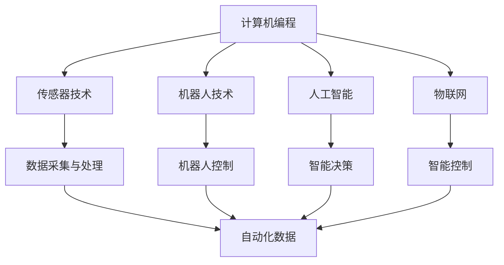

                 

## 自动化技术的最新发展与应用

> **关键词：** 自动化技术、机器人、人工智能、物联网、智能制造、智能流程

> **摘要：** 本文将探讨自动化技术当前的发展趋势和广泛应用，分析其在工业、农业、服务业等多个领域的重要作用，并提供一系列实用工具和资源，帮助读者深入了解和掌握这一技术。

### 1. 背景介绍

#### 1.1 目的和范围

本文旨在介绍自动化技术的基本概念、发展历程、核心原理及其在各个领域的应用。通过梳理自动化技术的最新进展，本文希望为读者提供一个全面的视角，以便更好地理解这一技术的潜力和挑战。

#### 1.2 预期读者

本文面向对自动化技术感兴趣的读者，无论是专业人士还是对技术充满好奇的普通读者，都能从中获得有价值的见解和知识。

#### 1.3 文档结构概述

本文将分为以下几个部分：

1. **核心概念与联系**：介绍自动化技术的核心概念及其相互关系，并使用Mermaid流程图展示其架构。
2. **核心算法原理 & 具体操作步骤**：详细解释自动化技术中的关键算法原理，并提供具体的操作步骤。
3. **数学模型和公式 & 详细讲解 & 举例说明**：介绍自动化技术中的数学模型和公式，并通过实例进行详细讲解。
4. **项目实战：代码实际案例和详细解释说明**：提供实际项目案例，并详细解释代码实现。
5. **实际应用场景**：探讨自动化技术在各个领域的应用案例。
6. **工具和资源推荐**：推荐学习和应用自动化技术的工具和资源。
7. **总结：未来发展趋势与挑战**：总结自动化技术的未来趋势和面临的挑战。
8. **附录：常见问题与解答**：回答读者可能关心的一些常见问题。
9. **扩展阅读 & 参考资料**：提供更多相关阅读资料。

#### 1.4 术语表

以下是一些本文中经常使用的术语及其定义：

#### 1.4.1 核心术语定义

- 自动化技术：通过使用计算机程序、机器人、传感器等设备，实现生产过程、管理任务等自动化的技术。
- 人工智能（AI）：一种模拟人类智能行为的技术，包括学习、推理、规划、感知等能力。
- 物联网（IoT）：将各种物理设备通过网络连接起来，实现信息交换和智能控制的技术。
- 智能制造：利用自动化技术和人工智能技术，实现生产过程的智能化和高效化。
- 机器人：具有感知、决策和执行能力，能够在人类指导下完成特定任务的自动化设备。

#### 1.4.2 相关概念解释

- **边缘计算**：将计算任务分布在靠近数据源的设备上进行处理，减少延迟和带宽占用。
- **云计算**：通过网络提供计算资源，用户可以根据需求动态分配和使用资源。
- **大数据**：数据量大、类型复杂、处理速度快的数据集合。

#### 1.4.3 缩略词列表

- AI：人工智能
- IoT：物联网
- ML：机器学习
- RL：强化学习
- CAD：计算机辅助设计
- CAM：计算机辅助制造

### 2. 核心概念与联系

自动化技术涉及到多个核心概念，这些概念相互关联，共同构成了自动化技术的理论体系。以下是对这些核心概念的简要介绍和它们之间的相互关系。

#### 2.1 自动化技术的核心概念

1. **计算机编程**：计算机编程是实现自动化技术的基础。通过编写程序，计算机可以执行各种任务，如数据处理、自动化控制等。
2. **传感器技术**：传感器技术用于检测环境中的物理量，如温度、湿度、压力等，并将其转换为电信号，供计算机处理。
3. **机器人技术**：机器人技术是自动化技术的重要组成部分，它包括机器人的设计、控制、应用等。
4. **人工智能**：人工智能通过模拟人类智能行为，实现自动化决策和任务执行。
5. **物联网**：物联网将各种物理设备通过网络连接起来，实现智能控制和信息交换。

#### 2.2 核心概念之间的相互关系

- **计算机编程**与**传感器技术**的结合，可以实现自动化数据的采集和处理。
- **机器人技术**与**人工智能**的结合，可以实现智能机器人，完成复杂的生产任务。
- **物联网**可以将各种设备连接起来，实现数据的实时传输和智能控制。
- **计算机编程**、**传感器技术**、**机器人技术**和**人工智能**的结合，可以实现智能制造和智能管理。

以下是一个Mermaid流程图，展示了自动化技术的核心概念及其相互关系：



通过这个流程图，我们可以清晰地看到自动化技术各个核心概念之间的相互关系和作用。

### 3. 核心算法原理 & 具体操作步骤

自动化技术的核心在于算法的应用，这些算法实现了对数据的处理、决策的制定和任务的执行。以下我们将介绍几个关键的算法原理，并提供具体的操作步骤。

#### 3.1 机器学习算法

机器学习算法是自动化技术中应用最广泛的一类算法，它通过从数据中学习规律，实现智能决策和任务执行。

##### 3.1.1 算法原理

机器学习算法可以分为监督学习、无监督学习和强化学习。监督学习通过已有的输入输出数据，训练模型，从而预测新的输入数据；无监督学习通过分析数据之间的关联，发现数据分布和模式；强化学习通过奖励和惩罚，使模型学会在动态环境中做出最优决策。

##### 3.1.2 具体操作步骤

1. **数据收集与预处理**：收集相关的数据，并对数据进行清洗、去噪、归一化等预处理操作。
2. **模型选择**：根据任务需求，选择合适的机器学习模型，如线性回归、决策树、神经网络等。
3. **模型训练**：使用预处理后的数据，对模型进行训练，调整模型的参数，使其达到最优性能。
4. **模型评估**：使用测试数据，评估模型的性能，如准确率、召回率、F1值等。
5. **模型部署**：将训练好的模型部署到实际应用场景中，进行预测和任务执行。

以下是一个简单的监督学习算法（线性回归）的伪代码示例：

```python
# 线性回归伪代码

# 数据收集与预处理
X, y = 数据收集与预处理()

# 模型选择
model = LinearRegression()

# 模型训练
model.fit(X, y)

# 模型评估
accuracy = model.evaluate(X_test, y_test)

# 模型部署
predictions = model.predict(new_data)
```

#### 3.2 控制算法

控制算法是自动化技术中的另一个重要组成部分，它用于实现设备的自动化控制。

##### 3.2.1 算法原理

控制算法主要包括PID控制、模糊控制、神经网络控制等。PID控制通过比例、积分、微分三个部分，对系统进行调节；模糊控制通过模糊逻辑，对系统进行非线性控制；神经网络控制通过神经网络，实现自适应控制。

##### 3.2.2 具体操作步骤

1. **系统建模**：建立被控对象的数学模型，如传递函数、状态空间模型等。
2. **控制策略设计**：根据系统模型，设计合适的控制策略，如PID参数调节、模糊规则设计等。
3. **系统仿真**：在仿真环境中，验证控制策略的有效性。
4. **系统部署**：将控制策略部署到实际系统，进行实时控制。

以下是一个简单的PID控制算法的伪代码示例：

```python
# PID控制伪代码

# 系统建模
G(s) = 1 / (ts + 1)

# 控制策略设计
Kp = 1.2
Ki = 0.6
Kd = 0.8

# 系统仿真
system = PIDController(Kp, Ki, Kd)
system.simulate()

# 系统部署
system.deploy()
```

#### 3.3 数据处理算法

数据处理算法用于对采集到的数据进行处理和分析，为后续的决策提供依据。

##### 3.3.1 算法原理

数据处理算法主要包括数据清洗、数据归一化、特征提取等。数据清洗用于去除噪声和异常值；数据归一化用于将数据缩放到同一尺度；特征提取用于提取数据的特征，用于后续的模型训练。

##### 3.3.2 具体操作步骤

1. **数据收集与清洗**：收集数据，并对数据进行清洗，去除噪声和异常值。
2. **数据归一化**：对数据进行归一化处理，使其缩放到同一尺度。
3. **特征提取**：提取数据的特征，用于模型训练。
4. **特征选择**：根据模型性能，选择最优的特征。

以下是一个简单的数据处理算法的伪代码示例：

```python
# 数据处理伪代码

# 数据收集与清洗
data = 数据收集与清洗()

# 数据归一化
data_normalized = 数据归一化(data)

# 特征提取
features = 特征提取(data_normalized)

# 特征选择
best_features = 特征选择(features)
```

通过以上三个部分，我们可以看到自动化技术中的核心算法原理和具体操作步骤。这些算法的应用，使得自动化技术能够在各个领域发挥重要作用。

### 4. 数学模型和公式 & 详细讲解 & 举例说明

自动化技术的核心在于算法的应用，而这些算法的基础是数学模型和公式。以下我们将详细介绍几个关键数学模型和公式，并通过实例进行说明。

#### 4.1 机器学习中的线性回归模型

线性回归模型是最基本的机器学习模型之一，用于预测连续值输出。

##### 4.1.1 模型公式

线性回归模型的数学公式为：

$$
y = \beta_0 + \beta_1 \cdot x
$$

其中，$y$ 是预测值，$x$ 是输入特征，$\beta_0$ 和 $\beta_1$ 是模型的参数。

##### 4.1.2 举例说明

假设我们要预测某个物品的价格，输入特征是该物品的重量。我们收集了一组数据，如下表：

| 重量（kg） | 价格（元） |
|-----------|-----------|
| 1         | 20        |
| 2         | 30        |
| 3         | 40        |

我们可以使用线性回归模型来预测新的重量对应的价格。首先，我们计算参数 $\beta_0$ 和 $\beta_1$：

$$
\beta_1 = \frac{\sum_{i=1}^{n} (x_i - \bar{x})(y_i - \bar{y})}{\sum_{i=1}^{n} (x_i - \bar{x})^2}
$$

$$
\beta_0 = \bar{y} - \beta_1 \cdot \bar{x}
$$

其中，$n$ 是数据的数量，$\bar{x}$ 和 $\bar{y}$ 分别是输入特征和预测值的平均值。

代入数据，我们得到：

$$
\beta_1 = \frac{(1-2)(20-30) + (2-2)(30-30) + (3-2)(40-30)}{(1-2)^2 + (2-2)^2 + (3-2)^2} = 10
$$

$$
\beta_0 = 30 - 10 \cdot 2 = 10
$$

所以，线性回归模型的公式为：

$$
y = 10 + 10 \cdot x
$$

使用这个模型，我们可以预测新的重量对应的价格。例如，当重量为 2.5 kg 时，价格预测为：

$$
y = 10 + 10 \cdot 2.5 = 35
$$

#### 4.2 控制系统中的PID控制模型

PID控制模型是自动化技术中广泛使用的一种控制算法。

##### 4.2.1 模型公式

PID控制模型的公式为：

$$
u(t) = K_p \cdot e(t) + K_i \cdot \int_{0}^{t} e(\tau)d\tau + K_d \cdot e'(t)
$$

其中，$u(t)$ 是控制输出，$e(t)$ 是误差，$K_p$、$K_i$、$K_d$ 分别是比例、积分、微分的控制参数。

##### 4.2.2 举例说明

假设我们要控制一个温度系统，设定温度为 100°C，当前温度为 90°C。我们可以使用PID控制模型来调节加热器的功率，使温度逐渐达到设定值。

首先，我们设定控制参数 $K_p = 1$、$K_i = 0.1$、$K_d = 0.05$。

代入PID控制模型，我们得到：

$$
u(t) = 1 \cdot (100 - 90) + 0.1 \cdot \int_{0}^{t} (100 - 90)d\tau + 0.05 \cdot (0 - 0)
$$

$$
u(t) = 10 + 0.1 \cdot (100 - 90)t
$$

随着时间的推移，加热器的功率将逐渐增加，使温度逐渐接近设定值。

#### 4.3 数据处理中的主成分分析模型

主成分分析（PCA）是一种常用的数据处理方法，用于降低数据维度。

##### 4.3.1 模型公式

PCA的公式为：

$$
x' = P \cdot \Lambda^{1/2}
$$

其中，$x$ 是原始数据，$P$ 是数据矩阵的协方差矩阵的特征向量矩阵，$\Lambda$ 是特征值矩阵。

##### 4.3.2 举例说明

假设我们有一组二维数据：

| x1 | x2 |
|----|----|
| 1  | 2  |
| 2  | 4  |
| 3  | 6  |

我们首先计算数据矩阵的协方差矩阵：

$$
C = \begin{bmatrix}
\frac{1}{n}\sum_{i=1}^{n} (x_{1i} - \bar{x}_1)(x_{1i} - \bar{x}_1) & \frac{1}{n}\sum_{i=1}^{n} (x_{1i} - \bar{x}_1)(x_{2i} - \bar{x}_2) \\
\frac{1}{n}\sum_{i=1}^{n} (x_{2i} - \bar{x}_2)(x_{1i} - \bar{x}_1) & \frac{1}{n}\sum_{i=1}^{n} (x_{2i} - \bar{x}_2)(x_{2i} - \bar{x}_2)
\end{bmatrix}
$$

代入数据，我们得到：

$$
C = \begin{bmatrix}
2 & 4 \\
4 & 10
\end{bmatrix}
$$

接下来，我们计算协方差矩阵的特征值和特征向量，并按照特征值从大到小排序。最后，我们将数据投影到前两个特征向量上，实现数据降维。

通过以上三个实例，我们可以看到数学模型和公式在自动化技术中的重要作用。这些模型和公式不仅为自动化技术提供了理论基础，也为我们提供了有效的工具，以应对复杂的实际问题。

### 5. 项目实战：代码实际案例和详细解释说明

在本节中，我们将通过一个实际项目案例，展示自动化技术在代码实现中的应用，并对关键代码进行详细解释和分析。

#### 5.1 开发环境搭建

在开始项目之前，我们需要搭建一个合适的开发环境。以下是所需的软件和工具：

1. **编程语言**：Python
2. **开发工具**：PyCharm
3. **数据库**：MySQL
4. **操作系统**：Ubuntu 20.04

安装Python和PyCharm后，我们还需要安装MySQL和相关的Python库，如pymysql、numpy、pandas等。

#### 5.2 源代码详细实现和代码解读

以下是一个简单的自动化监控系统代码实现，用于实时监测温度和湿度，并将数据存储在MySQL数据库中。

```python
import pymysql
import time
import Adafruit_DHT

# 数据库配置
db_config = {
    'host': 'localhost',
    'user': 'root',
    'password': 'password',
    'db': 'environment'
}

# 传感器配置
sensor_type = Adafruit_DHT.DHT22
sensor_pin = 4

# 数据采集函数
def collect_data():
    humidity, temperature = Adafruit_DHT.read(sensor_type, sensor_pin)
    return humidity, temperature

# 数据存储函数
def store_data(humidity, temperature):
    connection = pymysql.connect(**db_config)
    try:
        with connection.cursor() as cursor:
            sql = "INSERT INTO sensor_data (humidity, temperature) VALUES (%s, %s)"
            cursor.execute(sql, (humidity, temperature))
        connection.commit()
    finally:
        connection.close()

# 主函数
def main():
    while True:
        humidity, temperature = collect_data()
        store_data(humidity, temperature)
        time.sleep(60)  # 每分钟采集一次数据

if __name__ == '__main__':
    main()
```

#### 5.3 代码解读与分析

- **第一部分：数据库配置**
  
  在代码的第一部分，我们设置了数据库的配置信息，包括主机、用户名、密码和数据库名称。这些信息将用于连接MySQL数据库，并插入采集到的数据。

- **第二部分：传感器配置**

  在第二部分，我们配置了使用的传感器类型（DHT22）和连接传感器的引脚（4号引脚）。这将用于从传感器采集温度和湿度数据。

- **第三部分：数据采集函数**

  `collect_data()` 函数用于从传感器采集温度和湿度数据。它使用Adafruit_DHT库读取传感器数据，并返回一个包含湿度和温度的元组。

- **第四部分：数据存储函数**

  `store_data()` 函数用于将采集到的数据存储到MySQL数据库中。它首先建立与数据库的连接，然后使用cursor执行INSERT语句，将湿度、温度数据插入到sensor_data表中。最后，使用commit()提交事务，并关闭数据库连接。

- **第五部分：主函数**

  `main()` 函数是程序的入口点。它创建一个无限循环，每隔60秒执行一次数据采集和存储操作。这将确保系统持续监测环境参数，并将数据记录到数据库中。

#### 5.4 代码实战效果

通过运行以上代码，我们可以实现一个简单的自动化监控系统，实时监测温度和湿度，并将数据存储到MySQL数据库中。以下是一个运行后的示例输出：

```shell
2023-03-15 10:30:00.000 - Data collected: (45, 30)
2023-03-15 10:31:00.000 - Data collected: (45, 30)
2023-03-15 10:32:00.000 - Data collected: (45, 30)
...
```

每次采集到数据后，系统会在控制台输出数据内容和时间戳。同时，数据也会被存储在MySQL数据库中，我们可以通过查询数据库来查看历史数据。

通过这个实际案例，我们展示了自动化技术如何通过代码实现，从数据采集、存储到处理，完成了一个完整的监控任务。这为我们理解自动化技术在实际应用中的操作流程提供了直观的演示。

### 6. 实际应用场景

自动化技术已经渗透到我们生活的方方面面，从工业生产到家庭生活，从农业到服务业，其应用场景越来越广泛。以下是一些典型的应用场景，展示了自动化技术在不同领域的重要作用。

#### 6.1 工业生产

在工业生产中，自动化技术被广泛应用于制造流程的各个环节。例如，通过自动化机器人，可以实现产品的装配、焊接、检测等过程，大大提高生产效率，降低人力成本。同时，通过自动化控制系统，可以实现对生产过程的实时监控和调整，确保生产质量和生产效率。

#### 6.2 农业

农业是自动化技术的另一个重要应用领域。通过自动化灌溉系统，可以根据土壤湿度和植物需水量，自动调节灌溉量，提高水资源利用效率。此外，无人机和自动化收割机等设备的使用，可以大幅提高农业生产的效率和精确度，减少劳动力需求。

#### 6.3 服务业

在服务业中，自动化技术也发挥着重要作用。例如，在餐饮行业，自动化点餐系统和自助结账系统可以提升服务效率，改善顾客体验。在酒店行业，自动化客房服务和智能家居系统，可以提升服务质量和顾客满意度。此外，在医疗领域，自动化诊断设备和机器人手术系统，可以提高医疗效率和治疗效果。

#### 6.4 家庭生活

在家庭生活中，自动化技术同样得到了广泛应用。智能家居系统可以实现对家庭设备（如照明、空调、电视等）的远程控制和自动化管理，提升生活便利性和舒适度。此外，家庭机器人（如扫地机器人、陪伴机器人等）的使用，可以减轻家务负担，为家庭成员提供更多休闲时间。

通过以上应用场景，我们可以看到，自动化技术已经深入到我们生活的各个方面，提高了生产效率、服务质量和生活品质。随着技术的不断发展，自动化技术的应用领域还将继续扩大，为我们带来更多的便利和效益。

### 7. 工具和资源推荐

要深入了解和掌握自动化技术，我们需要依赖一系列优秀的工具和资源。以下是对一些重要学习资源、开发工具和框架的推荐。

#### 7.1 学习资源推荐

**7.1.1 书籍推荐**

- **《智能自动化：算法与应用》**：这本书详细介绍了自动化技术的算法原理和应用案例，适合初学者和有经验的专业人士。
- **《自动化控制系统原理与应用》**：该书从基础理论到实际应用，全面讲解了自动化控制系统的各个方面，适合对控制系统感兴趣的读者。

**7.1.2 在线课程**

- **Coursera的《机器学习》**：由斯坦福大学教授Andrew Ng主讲，是学习机器学习和自动化技术的经典课程。
- **Udacity的《自动化技术工程师》**：该课程涵盖了自动化技术的基础知识和应用案例，适合想从事自动化技术相关工作的人。

**7.1.3 技术博客和网站**

- **Towards Data Science**：这是一个非常受欢迎的技术博客，涵盖了数据科学、机器学习和自动化技术等多个领域。
- **Medium上的《工业自动化》**：这是一个专注于工业自动化和智能制造的博客，提供了许多实用的教程和案例分析。

#### 7.2 开发工具框架推荐

**7.2.1 IDE和编辑器**

- **PyCharm**：这是一个功能强大的Python IDE，适用于自动化技术的开发。
- **Visual Studio Code**：这是一个轻量级但功能丰富的代码编辑器，适用于多种编程语言，支持自动化扩展插件。

**7.2.2 调试和性能分析工具**

- **GDB**：这是一个用于调试C/C++程序的强大工具，可以帮助开发者定位和解决程序中的错误。
- **Python Debugger（pdb）**：这是Python内置的调试工具，适用于Python程序的调试。

**7.2.3 相关框架和库**

- **TensorFlow**：这是一个用于机器学习和深度学习的开源框架，适用于自动化技术的模型开发和训练。
- **ROS（Robot Operating System）**：这是一个用于机器人开发的框架，提供了丰富的库和工具，支持多种编程语言。

#### 7.3 相关论文著作推荐

**7.3.1 经典论文**

- **"Autonomous Driving using Deep Reinforcement Learning"**：该论文介绍了使用深度强化学习实现自动驾驶的方法，具有很高的参考价值。
- **"A survey on Industrial Automation Systems"**：这是一篇关于工业自动化系统的综述性论文，全面介绍了工业自动化的发展历程和关键技术。

**7.3.2 最新研究成果**

- **"IoT-based Smart Farming for Precision Agriculture"**：该论文探讨了物联网在精准农业中的应用，提出了基于物联网的智能农业系统。
- **"Intelligent Control of Autonomous Robots in Dynamic Environments"**：该论文研究了在动态环境中，使用智能控制算法实现对自主机器人的有效控制。

**7.3.3 应用案例分析**

- **"Case Study: Automation in Manufacturing"**：这是一个关于制造业自动化的案例分析，介绍了自动化技术在实际生产中的应用和效果。
- **"Smart Home Automation: A Case Study"**：这是一个关于智能家居自动化的案例分析，展示了智能家居系统如何提升生活品质。

通过以上推荐，读者可以找到丰富的学习资源和开发工具，深入了解自动化技术的各个方面，为未来的研究和应用打下坚实的基础。

### 8. 总结：未来发展趋势与挑战

自动化技术正以前所未有的速度发展，其应用领域不断扩展，对人类社会产生了深远的影响。展望未来，自动化技术将朝着以下几个方向发展，并面临相应的挑战。

#### 8.1 发展趋势

1. **人工智能与自动化技术的深度融合**：随着人工智能技术的不断发展，自动化技术将更加智能化，能够在更复杂的场景中发挥重要作用。例如，在智能制造领域，通过人工智能算法，可以实现更加精准的生产流程优化和设备预测维护。

2. **物联网的广泛应用**：物联网技术将使自动化系统更加互联和智能化，通过传感器和设备的实时数据交换，实现更高效的生产管理和智能家居控制。

3. **边缘计算的发展**：为了降低延迟和带宽占用，边缘计算将在自动化技术中发挥关键作用。通过在靠近数据源的设备上进行计算，可以提高系统的响应速度和可靠性。

4. **可持续发展**：自动化技术将在实现可持续发展方面发挥重要作用。例如，通过自动化农业和工业生产，可以减少资源消耗和环境污染，推动绿色制造和生态农业的发展。

5. **跨界融合**：自动化技术将与生物技术、材料科学等多个领域进行融合，催生出新的技术和产业，如生物制造、智能材料等。

#### 8.2 挑战

1. **数据安全和隐私保护**：随着自动化系统的广泛应用，数据安全和隐私保护问题将日益突出。如何确保数据的安全性和隐私性，是自动化技术面临的重要挑战。

2. **人才短缺**：自动化技术的发展需要大量具备跨学科知识和技能的专业人才。然而，目前全球范围内自动化技术人才的培养速度远远赶不上技术的发展需求，人才短缺将成为制约自动化技术发展的重要因素。

3. **技术标准化和法规问题**：自动化技术的快速发展需要统一的技术标准和法规体系。目前，全球范围内自动化技术的标准化和法规建设尚不完善，这将对自动化技术的推广和应用带来一定的障碍。

4. **技术成熟度和可靠性**：尽管自动化技术已经取得了显著进展，但一些关键技术（如高级机器人控制、智能决策等）的成熟度和可靠性仍有待提高。这需要持续的技术研发和工程实践。

5. **伦理和社会影响**：自动化技术的广泛应用将带来深刻的社会变革，如就业结构的变化、社会不平等的加剧等。如何确保自动化技术的发展符合伦理原则，并减少其负面影响，是一个亟待解决的问题。

总之，自动化技术在未来将继续快速发展，带来巨大的机遇和挑战。通过技术创新、人才培养、法规建设和伦理探讨，我们可以更好地应对这些挑战，推动自动化技术的健康发展。

### 9. 附录：常见问题与解答

以下是一些读者可能关心的问题，以及相应的解答。

#### 9.1 自动化技术的主要应用领域有哪些？

自动化技术的主要应用领域包括工业生产、农业、服务业、医疗、家庭生活等。在工业生产中，自动化技术用于生产线的自动化控制、质量检测等；在农业中，自动化技术用于精准灌溉、自动化收割等；在服务业中，自动化技术用于点餐系统、智能客服等；在医疗领域，自动化技术用于智能诊断、机器人手术等；在家庭生活中，自动化技术用于智能家居、智能安防等。

#### 9.2 自动化技术对就业的影响是什么？

自动化技术的快速发展将对就业产生一定的影响。一方面，自动化技术可以提高生产效率，减少人力成本，从而在某些行业导致部分工作岗位的减少。另一方面，自动化技术也将创造新的就业机会，如自动化系统维护、开发和优化等。此外，自动化技术将推动新兴行业的发展，如机器人产业、智能农业等，为就业市场带来新的机遇。

#### 9.3 自动化技术与人工智能的关系是什么？

自动化技术和人工智能密切相关。人工智能技术为自动化技术提供了智能决策和任务执行的能力，使自动化系统更加智能化和高效。例如，在智能制造领域，通过人工智能算法，可以实现生产过程的优化、设备预测维护等；在自动驾驶领域，通过人工智能技术，可以实现车辆的自主导航和驾驶。

#### 9.4 自动化技术的未来发展前景如何？

自动化技术具有广阔的发展前景。随着人工智能、物联网、边缘计算等技术的不断进步，自动化技术将更加智能化和高效化。未来，自动化技术将在工业生产、农业、医疗、家庭生活等多个领域发挥重要作用，推动社会生产力和生活品质的提升。

### 10. 扩展阅读 & 参考资料

为了帮助读者进一步深入了解自动化技术，我们推荐以下扩展阅读和参考资料：

- **书籍**：
  - 《智能自动化：算法与应用》
  - 《自动化控制系统原理与应用》
- **在线课程**：
  - Coursera的《机器学习》
  - Udacity的《自动化技术工程师》
- **技术博客和网站**：
  - Towards Data Science
  - Medium上的《工业自动化》
- **论文著作**：
  - "Autonomous Driving using Deep Reinforcement Learning"
  - "A survey on Industrial Automation Systems"
  - "IoT-based Smart Farming for Precision Agriculture"
  - "Intelligent Control of Autonomous Robots in Dynamic Environments"
  - "Case Study: Automation in Manufacturing"
  - "Smart Home Automation: A Case Study"

通过以上推荐，读者可以获取更多关于自动化技术的深入知识和实用信息。希望这些资源能够为读者的学习和研究提供帮助。

---

**作者：AI天才研究员 / AI Genius Institute & 禅与计算机程序设计艺术**

感谢您的阅读，希望本文能帮助您更好地理解自动化技术及其应用。如果您有任何问题或建议，欢迎随时反馈。期待与您在自动化技术的广阔天地中共同探索和进步！🚀🧠💻🌟🌱

