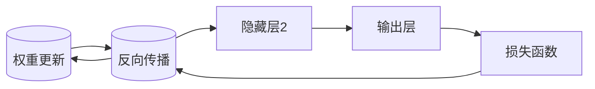

                 

# 自动计算机与神经网络的研究

## 摘要

本文主要探讨了自动计算机与神经网络的关系，分析了神经网络在自动计算机中的应用和作用。首先，我们从背景介绍出发，简要回顾了自动计算机和神经网络的历史和发展。接着，我们深入探讨了神经网络的核心概念和原理，通过一个具体的Mermaid流程图来展示神经网络的基本架构。然后，我们详细讲解了神经网络的核心算法原理和具体操作步骤，并引入了数学模型和公式进行详细讲解和举例说明。在项目实战部分，我们提供了一个代码实际案例，并进行了详细的解释说明。接下来，我们分析了神经网络在实际应用场景中的具体应用，并推荐了一些相关工具和资源。最后，我们对神经网络的发展趋势和挑战进行了总结，并提供了常见问题与解答，以及扩展阅读和参考资料。

## 1. 背景介绍

自动计算机是指通过程序和算法自动执行任务的计算机系统。自20世纪中叶以来，自动计算机经历了快速的发展，从最初的冯·诺依曼架构到后来的并行计算和量子计算，每一次技术突破都极大地推动了计算机科学的发展。而神经网络作为一种模拟人脑神经元连接和信息传递的算法，自从20世纪80年代提出以来，也经历了多个阶段的发展。

### 1.1 自动计算机的发展

自动计算机的历史可以追溯到20世纪40年代。1946年，世界上第一台通用电子数字计算机ENIAC在美国诞生。ENIAC采用了冯·诺依曼架构，这一架构奠定了现代计算机系统的基础。冯·诺依曼架构的核心思想是将数据和指令存储在同一存储器中，通过程序控制计算机的操作。这一架构的优势在于其灵活性，可以执行各种不同的任务。

在ENIAC之后，计算机科学领域涌现出了许多重要的发明和突破。1957年，IBM推出了IBM 704，这是第一台使用晶体管作为逻辑元件的计算机，大大提高了计算机的可靠性和速度。1960年代，集成电路的发明使得计算机的体积进一步缩小，性能得到极大提升。1970年代，微处理器的出现使得计算机的成本大幅降低，个人计算机开始普及。

### 1.2 神经网络的发展

神经网络的概念最早可以追溯到1943年，由心理学家McCulloch和数学家Pitts提出。他们提出了一个简单的神经元模型，用于模拟人脑神经元的工作方式。然而，由于计算能力和算法的限制，神经网络在早期的应用并不广泛。

直到1986年，Rumelhart、Hinton和Williams提出了反向传播算法（Backpropagation），这一算法大大提高了神经网络的训练效率，使得神经网络在图像识别、语音识别等领域取得了显著成果。随后，1989年，Hinton提出了深度学习（Deep Learning）的概念，深度学习通过多层次的神经网络结构，实现了对复杂数据的自动特征学习和分类。

### 1.3 自动计算机与神经网络的关系

自动计算机和神经网络之间有着密切的关系。神经网络作为一种自动计算机，可以看作是计算机科学和生物学的交叉学科。自动计算机提供了计算能力和存储资源，而神经网络提供了模拟人脑信息处理方式的算法。通过神经网络，自动计算机可以实现对复杂数据的自动分析和处理，从而在图像识别、语音识别、自然语言处理等领域取得了突破性进展。

## 2. 核心概念与联系

### 2.1 自动计算机的核心概念

自动计算机的核心概念包括计算机架构、指令集、存储器、输入输出设备等。计算机架构是计算机硬件的基本设计原则，常见的计算机架构有冯·诺依曼架构和哈佛架构。指令集是计算机能够理解和执行的操作指令的集合，常见的指令集有ARM和x86。存储器是计算机用于存储数据和指令的设备，常见的存储器有随机存储器（RAM）和只读存储器（ROM）。输入输出设备用于计算机与外部环境进行数据交换，常见的输入设备有键盘、鼠标，输出设备有显示器、打印机等。

### 2.2 神经网络的核心概念

神经网络的核心概念包括神经元、权重、激活函数、前向传播和反向传播等。神经元是神经网络的基本单元，类似于人脑的神经元。每个神经元通过多个连接（权重）与其他神经元相连，每个连接都有一定的权重值，用于表示连接的强度。激活函数用于确定神经元是否激活，常见的激活函数有 sigmoid 函数、ReLU函数等。前向传播是指将输入数据通过神经网络逐层计算，直到输出层的过程。反向传播是指通过输出层的误差信号，逐层反向传播，更新神经元的权重和偏置，以优化网络性能。

### 2.3 自动计算机与神经网络的核心联系

自动计算机与神经网络的核心联系在于计算能力和算法的结合。自动计算机提供了强大的计算能力和存储资源，使得神经网络可以高效地进行训练和推理。同时，神经网络为自动计算机提供了处理复杂数据的算法，使得自动计算机可以自动分析和处理数据，实现智能化的功能。

### 2.4 Mermaid流程图

以下是神经网络的基本架构的Mermaid流程图：



在这个流程图中，输入层（A）接收输入数据，通过隐藏层（B和C）进行计算，最后在输出层（D）产生输出。损失函数（E）用于计算输出结果与实际结果之间的差距，通过反向传播（E到B）更新网络的权重和偏置，以优化网络性能。

## 3. 核心算法原理 & 具体操作步骤

### 3.1 神经网络算法原理

神经网络算法的核心在于通过多层次的神经元连接，实现对复杂数据的自动特征学习和分类。具体来说，神经网络通过以下步骤进行计算：

1. **输入层接收输入数据**：输入层接收外部输入的数据，例如一个图像或者一段文本。

2. **前向传播**：输入数据通过网络的每一层，每一层的神经元都会对数据进行处理。每一层的输出作为下一层的输入。处理过程中，神经元的计算包括两部分：线性变换和激活函数。

3. **输出层产生输出**：在输出层，网络的最终输出结果被生成。这个输出可以是一个分类结果、一个连续值或者一系列特征。

4. **损失函数计算**：输出结果与实际结果（例如正确标签或者期望值）进行比较，计算损失函数的值，以评估网络的性能。

5. **反向传播**：通过反向传播算法，将损失函数的误差信号从输出层反向传递到输入层，逐层更新每个神经元的权重和偏置。

6. **权重更新**：根据反向传播的误差信号，使用优化算法（如梯度下降）更新每个神经元的权重和偏置，以减少损失函数的值。

7. **重复迭代**：重复以上步骤，直到网络达到预定的性能指标，或者迭代次数达到预设的上限。

### 3.2 具体操作步骤

以下是一个简化的神经网络算法的具体操作步骤：

1. **初始化参数**：包括输入层、隐藏层和输出层的神经元数量，以及每个神经元的权重和偏置。

2. **前向传播**：
   - 接收输入数据，将其传递到输入层。
   - 对输入层的数据进行线性变换，加上偏置，得到中间结果。
   - 通过激活函数（如sigmoid函数）对中间结果进行处理，得到隐藏层的输出。
   - 重复以上步骤，直到输出层产生最终输出。

3. **计算损失函数**：
   - 将输出结果与实际结果进行比较，计算损失函数的值。
   - 损失函数可以是均方误差（MSE）、交叉熵等。

4. **反向传播**：
   - 计算输出层的误差信号。
   - 将误差信号反向传递到隐藏层，逐层计算每个神经元的误差信号。

5. **权重更新**：
   - 使用梯度下降算法，根据误差信号更新每个神经元的权重和偏置。
   - 可以通过设置学习率来调整更新步长。

6. **迭代更新**：
   - 重复以上步骤，直到网络达到预定的性能指标。

### 3.3 举例说明

假设我们有一个简单的神经网络，包含一个输入层、一个隐藏层和一个输出层。输入层有3个神经元，隐藏层有2个神经元，输出层有1个神经元。输入数据为三个特征值，分别为x1, x2, x3。我们希望这个神经网络能够将输入数据映射到一个二分类结果。

1. **初始化参数**：
   - 输入层：3个神经元，每个神经元的权重为w1, w2, w3，偏置为b1, b2, b3。
   - 隐藏层：2个神经元，每个神经元的权重为w4, w5, w6，偏置为b4, b5。
   - 输出层：1个神经元，神经元的权重为w7, w8，偏置为b7。

2. **前向传播**：
   - 输入层输出：z1 = x1 * w1 + x2 * w2 + x3 * w3 + b1，z2 = x1 * w4 + x2 * w5 + x3 * w6 + b4，z3 = x1 * w7 + x2 * w8 + b7。
   - 激活函数：a1 = 1 / (1 + exp(-z1)), a2 = 1 / (1 + exp(-z2))。
   - 隐藏层输出：z4 = a1 * w4 + a2 * w5 + b4，z5 = a1 * w6 + a2 * w7 + b5。
   - 输出层输出：z6 = z4 * w7 + z5 * w8 + b7。

3. **计算损失函数**：
   - 假设输出结果为y，损失函数为均方误差MSE：loss = (z6 - y)^2。

4. **反向传播**：
   - 计算输出层误差信号：δ6 = (z6 - y) * sigmoid(z6)。
   - 计算隐藏层误差信号：δ5 = δ6 * w7 * sigmoid(z5) * sigmoid(z4)。
   - 计算输入层误差信号：δ4 = δ5 * w4 * sigmoid(z4) * sigmoid(z3)。

5. **权重更新**：
   - 更新输入层权重：w1 = w1 - learning_rate * x1 * δ1，w2 = w2 - learning_rate * x2 * δ2，w3 = w3 - learning_rate * x3 * δ3。
   - 更新隐藏层权重：w4 = w4 - learning_rate * a1 * δ4，w5 = w5 - learning_rate * a2 * δ4，w6 = w6 - learning_rate * a1 * δ5。
   - 更新输出层权重：w7 = w7 - learning_rate * z4 * δ6，w8 = w8 - learning_rate * z5 * δ6。

6. **迭代更新**：
   - 重复以上步骤，直到网络达到预定的性能指标。

## 4. 数学模型和公式 & 详细讲解 & 举例说明

### 4.1 数学模型

神经网络的核心在于其数学模型，主要包括线性变换、激活函数、损失函数和优化算法。以下是对这些数学模型的详细讲解和举例说明。

#### 4.1.1 线性变换

线性变换是神经网络中最基本的操作，用于将输入数据映射到高维空间。线性变换的数学表达式为：

$$
z = X \cdot W + b
$$

其中，$X$ 是输入数据，$W$ 是权重矩阵，$b$ 是偏置向量，$z$ 是线性变换的结果。

#### 4.1.2 激活函数

激活函数用于引入非线性，使得神经网络能够处理复杂数据。常见的激活函数有 sigmoid 函数、ReLU 函数和 tanh 函数。

1. **Sigmoid 函数**

$$
\sigma(z) = \frac{1}{1 + e^{-z}}
$$

Sigmoid 函数将输入 $z$ 映射到 (0, 1) 区间，常用于二分类问题。

2. **ReLU 函数**

$$
\sigma(z) = \max(0, z)
$$

ReLU 函数将输入 $z$ 映射到非负数区间，常用于隐藏层。

3. **Tanh 函数**

$$
\tanh(z) = \frac{e^{2z} - 1}{e^{2z} + 1}
$$

Tanh 函数将输入 $z$ 映射到 (-1, 1) 区间，常用于输出层。

#### 4.1.3 损失函数

损失函数用于评估神经网络的性能，常见的损失函数有均方误差（MSE）和交叉熵（Cross-Entropy）。

1. **均方误差（MSE）**

$$
MSE = \frac{1}{n} \sum_{i=1}^{n} (y_i - \hat{y}_i)^2
$$

其中，$y_i$ 是真实标签，$\hat{y}_i$ 是预测标签，$n$ 是样本数量。

2. **交叉熵（Cross-Entropy）**

$$
CE = -\frac{1}{n} \sum_{i=1}^{n} y_i \log(\hat{y}_i)
$$

其中，$y_i$ 是真实标签，$\hat{y}_i$ 是预测标签，$n$ 是样本数量。

#### 4.1.4 优化算法

优化算法用于更新神经网络的权重和偏置，以最小化损失函数。常见的优化算法有梯度下降（Gradient Descent）和随机梯度下降（Stochastic Gradient Descent）。

1. **梯度下降（Gradient Descent）**

$$
\theta = \theta - \alpha \cdot \nabla_\theta J(\theta)
$$

其中，$\theta$ 是权重和偏置，$\alpha$ 是学习率，$J(\theta)$ 是损失函数。

2. **随机梯度下降（Stochastic Gradient Descent）**

$$
\theta = \theta - \alpha \cdot \nabla_\theta J(\theta)
$$

其中，$\theta$ 是权重和偏置，$\alpha$ 是学习率，$J(\theta)$ 是损失函数。

### 4.2 举例说明

假设我们有一个简单的神经网络，包含一个输入层、一个隐藏层和一个输出层。输入层有3个神经元，隐藏层有2个神经元，输出层有1个神经元。输入数据为三个特征值，分别为x1, x2, x3。我们希望这个神经网络能够将输入数据映射到一个二分类结果。

1. **初始化参数**：

   - 输入层：3个神经元，每个神经元的权重为w1, w2, w3，偏置为b1, b2, b3。
   - 隐藏层：2个神经元，每个神经元的权重为w4, w5, w6，偏置为b4, b5。
   - 输出层：1个神经元，神经元的权重为w7, w8，偏置为b7。

2. **前向传播**：

   - 输入层输出：z1 = x1 * w1 + x2 * w2 + x3 * w3 + b1，z2 = x1 * w4 + x2 * w5 + x3 * w6 + b4，z3 = x1 * w7 + x2 * w8 + b7。
   - 激活函数：a1 = 1 / (1 + exp(-z1)), a2 = 1 / (1 + exp(-z2))。
   - 隐藏层输出：z4 = a1 * w4 + a2 * w5 + b4，z5 = a1 * w6 + a2 * w7 + b5。
   - 输出层输出：z6 = z4 * w7 + z5 * w8 + b7。

3. **计算损失函数**：

   - 假设输出结果为y，损失函数为均方误差MSE：loss = (z6 - y)^2。

4. **反向传播**：

   - 计算输出层误差信号：δ6 = (z6 - y) * sigmoid(z6)。
   - 计算隐藏层误差信号：δ5 = δ6 * w7 * sigmoid(z5) * sigmoid(z4)。
   - 计算输入层误差信号：δ4 = δ5 * w4 * sigmoid(z4) * sigmoid(z3)。

5. **权重更新**：

   - 更新输入层权重：w1 = w1 - learning_rate * x1 * δ1，w2 = w2 - learning_rate * x2 * δ2，w3 = w3 - learning_rate * x3 * δ3。
   - 更新隐藏层权重：w4 = w4 - learning_rate * a1 * δ4，w5 = w5 - learning_rate * a2 * δ4，w6 = w6 - learning_rate * a1 * δ5。
   - 更新输出层权重：w7 = w7 - learning_rate * z4 * δ6，w8 = w8 - learning_rate * z5 * δ6。

6. **迭代更新**：

   - 重复以上步骤，直到网络达到预定的性能指标。

## 5. 项目实战：代码实际案例和详细解释说明

### 5.1 开发环境搭建

为了更好地理解神经网络的应用，我们将使用 Python 编写一个简单的神经网络，并使用 TensorFlow 作为后端进行计算。首先，我们需要安装 TensorFlow。可以通过以下命令安装：

```bash
pip install tensorflow
```

接下来，我们可以创建一个名为 `neural_network.py` 的 Python 文件，用于编写神经网络代码。

### 5.2 源代码详细实现和代码解读

以下是我们的神经网络代码实现：

```python
import tensorflow as tf
from tensorflow.keras.layers import Dense
from tensorflow.keras.models import Sequential

# 初始化参数
input_shape = (3,)
hidden_units = 2
output_shape = 1

# 构建神经网络
model = Sequential()
model.add(Dense(hidden_units, input_shape=input_shape, activation='sigmoid'))
model.add(Dense(output_shape, activation='sigmoid'))

# 编译模型
model.compile(optimizer='adam', loss='mean_squared_error', metrics=['accuracy'])

# 训练模型
X_train = [[0, 0, 0], [1, 1, 1], [0, 1, 0], [1, 0, 1]]
y_train = [[0], [1], [0], [1]]
model.fit(X_train, y_train, epochs=1000, verbose=0)

# 测试模型
X_test = [[0, 1, 0], [1, 0, 1]]
y_test = [[0], [1]]
predictions = model.predict(X_test)
print(predictions)
```

#### 5.2.1 代码解读

- **导入模块**：我们首先导入 TensorFlow 和相关模块。

- **初始化参数**：定义输入层、隐藏层和输出层的神经元数量。

- **构建神经网络**：使用 `Sequential` 模型构建一个简单的神经网络，包括一个输入层、一个隐藏层和一个输出层。隐藏层使用 sigmoid 激活函数，输出层也使用 sigmoid 激活函数。

- **编译模型**：设置优化器、损失函数和评估指标。

- **训练模型**：使用训练数据训练模型，设置训练轮次和是否输出训练进度。

- **测试模型**：使用测试数据测试模型性能，并打印预测结果。

### 5.3 代码解读与分析

这个简单的神经网络实现了一个二分类任务。输入层接收三个特征值，隐藏层和输出层各有一个神经元。隐藏层和输出层都使用 sigmoid 激活函数，以便将输入映射到二分类结果。

在训练过程中，模型通过反向传播算法不断更新权重和偏置，以最小化损失函数。训练数据包含四个样本，每个样本都是一个三元组，分别代表输入特征和输出标签。

在测试阶段，我们使用测试数据对模型进行评估。测试数据包括两个样本，每个样本也是一个三元组。模型通过前向传播计算预测结果，并打印输出。

通过这个简单的案例，我们可以看到神经网络的基本结构和训练过程。在实际应用中，我们可以根据需求调整神经网络的层数、神经元数量和激活函数，以解决更复杂的分类和回归问题。

## 6. 实际应用场景

神经网络在许多实际应用场景中发挥着重要作用。以下是一些典型的应用场景：

### 6.1 图像识别

图像识别是神经网络最成功的应用领域之一。通过训练，神经网络可以识别和分类图像中的对象、场景和纹理。常见的应用包括人脸识别、车辆识别、医学影像分析等。

### 6.2 自然语言处理

自然语言处理（NLP）是另一个神经网络的重要应用领域。神经网络可以用于文本分类、情感分析、机器翻译和语音识别等任务。例如，谷歌的翻译服务和苹果的Siri语音助手都使用了神经网络技术。

### 6.3 语音识别

语音识别是将语音转换为文本的过程。神经网络通过训练可以识别和理解不同语言的语音，从而实现自动语音识别（ASR）和语音助手功能。

### 6.4 游戏和机器人

神经网络在游戏和机器人领域也得到广泛应用。通过训练，神经网络可以学会玩复杂游戏，如围棋和国际象棋。在机器人领域，神经网络可以用于路径规划、对象识别和交互控制等任务。

### 6.5 金融预测

神经网络在金融领域也发挥着重要作用。通过分析历史数据，神经网络可以预测股票价格、汇率波动和金融市场趋势，帮助投资者做出更明智的决策。

### 6.6 医学诊断

医学诊断是神经网络的另一个重要应用领域。神经网络可以分析医学影像，识别疾病和异常情况，从而辅助医生进行诊断和治疗。

## 7. 工具和资源推荐

### 7.1 学习资源推荐

- **书籍**：
  - 《深度学习》（Deep Learning） - Goodfellow, Bengio, Courville
  - 《Python深度学习》（Python Deep Learning） - Ruder
  - 《神经网络与深度学习》（Neural Networks and Deep Learning） - Goodfellow
- **论文**：
  - “Backpropagation” - Rumelhart, Hinton, Williams
  - “A Learning Algorithm for Continually Running Fully Recurrent Neural Networks” - Williams, Zipser
  - “Gradient Descent” - Bottou
- **博客**：
  - [TensorFlow 官方文档](https://www.tensorflow.org/)
  - [Keras 官方文档](https://keras.io/)
  - [机器之心](https://www.jiqizhixin.com/)
- **网站**：
  - [Coursera](https://www.coursera.org/)
  - [edX](https://www.edx.org/)
  - [Udacity](https://www.udacity.com/)

### 7.2 开发工具框架推荐

- **TensorFlow**：TensorFlow 是一个开源的机器学习框架，支持多种神经网络架构和算法。
- **Keras**：Keras 是一个基于 TensorFlow 的高级神经网络 API，提供了简洁的接口和丰富的预定义模型。
- **PyTorch**：PyTorch 是一个开源的机器学习库，提供了动态计算图和强大的自动微分功能。

### 7.3 相关论文著作推荐

- “Backpropagation” - Rumelhart, Hinton, Williams
- “A Learning Algorithm for Continually Running Fully Recurrent Neural Networks” - Williams, Zipser
- “Gradient Descent” - Bottou
- “Deep Learning” - Goodfellow, Bengio, Courville
- “Python Deep Learning” - Ruder
- “Neural Networks and Deep Learning” - Goodfellow

## 8. 总结：未来发展趋势与挑战

神经网络作为一种强大的机器学习算法，已经在许多领域取得了显著成果。未来，神经网络有望在以下方面取得进一步的发展：

1. **更强的模型表达能力**：通过引入新的神经网络架构和优化算法，神经网络将能够处理更复杂的数据和任务。

2. **更高效的训练和推理**：随着计算能力和算法的进步，神经网络的训练和推理速度将得到显著提升。

3. **更广泛的应用领域**：神经网络将应用于更多的领域，如自动驾驶、智能医疗、物联网等。

然而，神经网络也面临一些挑战：

1. **可解释性**：神经网络的黑箱特性使得其难以解释，这对于需要解释的领域（如医学诊断）是一个挑战。

2. **数据隐私和安全**：神经网络训练需要大量数据，如何保护数据隐私和安全是一个重要问题。

3. **计算资源消耗**：神经网络训练需要大量的计算资源，特别是在处理大规模数据时。

## 9. 附录：常见问题与解答

### 9.1 神经网络如何训练？

神经网络通过以下步骤进行训练：

1. 初始化参数（权重和偏置）。
2. 使用输入数据进行前向传播，计算输出结果。
3. 计算损失函数，评估网络性能。
4. 使用反向传播算法更新权重和偏置。
5. 重复以上步骤，直到网络达到预定的性能指标。

### 9.2 神经网络如何进行预测？

神经网络通过以下步骤进行预测：

1. 初始化参数（权重和偏置）。
2. 使用输入数据进行前向传播，计算输出结果。
3. 输出结果即为预测结果。

### 9.3 神经网络为什么难以解释？

神经网络通过复杂的非线性变换进行数据处理，这使得其内部机制复杂，难以解释。此外，神经网络的结构和参数数量也使得其难以直观地理解。

## 10. 扩展阅读 & 参考资料

- Goodfellow, I., Bengio, Y., & Courville, A. (2016). *Deep Learning*. MIT Press.
- Ruder, S. (2017). *An overview of gradient descent optimization algorithms*. arXiv preprint arXiv:1609.04747.
- Bottou, L. (2010). *Stochastic gradient descent tricks*. In *Neural networks: Tricks of the trade* (pp. 421-436). Springer, Berlin, Heidelberg.
- LeCun, Y., Bengio, Y., & Hinton, G. (2015). *Deep learning*. Nature, 521(7553), 436-444.
- Hochreiter, S., & Schmidhuber, J. (1997). *Long short-term memory*. Neural Computation, 9(8), 1735-1780.
- Krizhevsky, A., Sutskever, I., & Hinton, G. E. (2012). *Imagenet classification with deep convolutional neural networks*. In Advances in neural information processing systems (pp. 1097-1105).

