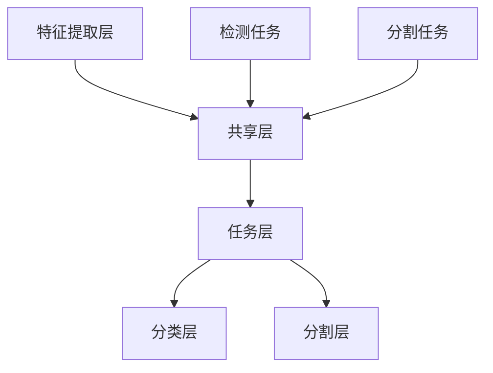

                 

# 自动驾驶中的多任务学习：同时处理检测分割等感知任务

> **关键词：** 自动驾驶、多任务学习、感知任务、检测、分割、深度学习
> 
> **摘要：** 本文将深入探讨自动驾驶技术中的一种关键方法——多任务学习。我们将首先介绍多任务学习的基本概念，随后详细分析其在自动驾驶场景中的应用，包括检测、分割等感知任务的实现。文章将通过流程图、算法原理、数学模型、实战代码等多个维度，帮助读者全面理解多任务学习在自动驾驶领域的应用与价值。

## 1. 背景介绍

### 1.1 目的和范围

随着人工智能和自动驾驶技术的飞速发展，如何在自动驾驶系统中高效、准确地进行感知成为了一个重要的研究方向。多任务学习（Multitask Learning）作为一种先进的方法，可以在同一模型中同时处理多个相关任务，从而提高模型的性能和效率。本文旨在探讨多任务学习在自动驾驶中的具体应用，包括检测、分割等感知任务的处理方法，为自动驾驶技术的进一步发展提供理论支持和实践指导。

### 1.2 预期读者

本文适合对自动驾驶和多任务学习有一定了解的读者，包括人工智能研究人员、自动驾驶工程师、计算机视觉从业者等。通过对本文的学习，读者可以掌握多任务学习的基本原理，并了解其在自动驾驶中的应用策略和实现方法。

### 1.3 文档结构概述

本文将按照以下结构展开：

1. **背景介绍**：介绍多任务学习的基本概念和在自动驾驶中的重要性。
2. **核心概念与联系**：通过Mermaid流程图展示多任务学习的原理和架构。
3. **核心算法原理 & 具体操作步骤**：详细讲解多任务学习算法的原理和实现步骤。
4. **数学模型和公式 & 详细讲解 & 举例说明**：分析多任务学习中的数学模型，并通过实例进行说明。
5. **项目实战：代码实际案例和详细解释说明**：通过具体项目实战，展示多任务学习的实际应用。
6. **实际应用场景**：探讨多任务学习在自动驾驶中的具体应用场景。
7. **工具和资源推荐**：推荐相关的学习资源和开发工具。
8. **总结：未来发展趋势与挑战**：总结多任务学习在自动驾驶中的发展趋势和面临的挑战。
9. **附录：常见问题与解答**：提供常见问题的解答。
10. **扩展阅读 & 参考资料**：推荐进一步的阅读材料。

### 1.4 术语表

#### 1.4.1 核心术语定义

- **多任务学习（Multitask Learning）**：一种机器学习方法，通过共享表示来同时解决多个相关任务。
- **检测（Detection）**：识别图像中的目标对象并定位其位置。
- **分割（Segmentation）**：将图像划分为不同的区域，每个区域代表一个对象。
- **自动驾驶（Autonomous Driving）**：利用传感器、算法和控制系统，使车辆能够在没有人类干预的情况下自主行驶。

#### 1.4.2 相关概念解释

- **深度学习（Deep Learning）**：一种机器学习方法，通过多层神经网络来模拟人脑的决策过程。
- **卷积神经网络（Convolutional Neural Network，CNN）**：一种用于图像识别的深度学习模型，通过卷积层来提取图像特征。
- **端到端学习（End-to-End Learning）**：直接将输入映射到输出，无需人工提取特征。

#### 1.4.3 缩略词列表

- **CNN**：卷积神经网络（Convolutional Neural Network）
- **RNN**：循环神经网络（Recurrent Neural Network）
- **GAN**：生成对抗网络（Generative Adversarial Network）
- **SLAM**：同时定位与地图构建（Simultaneous Localization and Mapping）

## 2. 核心概念与联系

多任务学习的关键在于如何同时处理多个任务，并利用任务间的关联性来提高模型的性能。为了更好地理解多任务学习在自动驾驶中的应用，我们首先需要了解其基本原理和架构。

### 2.1. 多任务学习的原理

多任务学习的基本原理是通过共享表示来同时处理多个任务。具体来说，多任务学习模型会共享一部分网络结构，使得不同任务可以使用相同的特征表示。这样，不同任务之间的关联性可以通过共享的表示来传递，从而提高每个任务的性能。

多任务学习的核心思想可以概括为以下几点：

1. **任务关联性**：不同任务之间存在一定的关联性，例如在自动驾驶中，检测和分割任务都需要对图像中的对象进行识别和定位。
2. **共享表示**：通过共享网络结构，不同任务可以共享特征表示，从而利用任务间的关联性。
3. **任务解耦**：虽然任务之间存在关联性，但在训练过程中，需要通过适当的机制来确保每个任务都能够得到充分的关注。

### 2.2. 多任务学习的架构

多任务学习的架构可以分为以下几个层次：

1. **特征提取层**：该层负责从输入数据中提取有用的特征。在自动驾驶场景中，通常使用卷积神经网络（CNN）来实现特征提取。
2. **共享层**：该层包含了多个任务共享的网络结构。通过共享层，不同任务可以使用相同的特征表示，从而利用任务间的关联性。
3. **任务层**：该层为每个任务提供了独立的网络结构，用于实现具体的任务目标。例如，在检测任务中，可以使用分类层来识别图像中的对象；在分割任务中，可以使用分割层来将图像划分为不同的区域。

### 2.3. Mermaid流程图

为了更好地展示多任务学习的原理和架构，我们使用Mermaid流程图来描述。

在这个流程图中，A表示特征提取层，B表示共享层，C和D分别表示检测任务和分割任务，E表示任务层，F和G分别表示分类层和分割层。通过这个流程图，我们可以清楚地看到多任务学习的架构和各个层次之间的关系。

### 2.4. 多任务学习在自动驾驶中的应用

在自动驾驶中，多任务学习可以应用于多种感知任务，如检测、分割、语义分割、姿态估计等。以下是一些典型的应用场景：

1. **检测与分割**：在自动驾驶中，检测和分割是两个基本任务。通过多任务学习，可以将这两个任务集成到同一个模型中，从而提高整体性能。
2. **语义分割**：语义分割是将图像中的每个像素分类为不同的对象。通过多任务学习，可以将语义分割与其他任务（如检测和分割）相结合，实现更全面的感知。
3. **姿态估计**：姿态估计是自动驾驶中的一个重要任务，用于确定车辆的位置和方向。通过多任务学习，可以将姿态估计与其他任务相结合，提高自动驾驶的精度和稳定性。

### 2.5. 多任务学习的挑战与解决方案

多任务学习在自动驾驶中面临着一些挑战，如任务之间的冲突、模型复杂度增加、训练时间延长等。以下是一些解决方案：

1. **任务权重调整**：通过调整不同任务的权重，可以确保每个任务在模型中都能得到适当的关注。
2. **梯度共享机制**：通过设计合适的梯度共享机制，可以确保不同任务之间的梯度不会相互干扰，从而提高模型的性能。
3. **并行训练**：通过并行训练，可以减少多任务学习的训练时间，提高模型的训练效率。

### 2.6. 总结

多任务学习是一种在自动驾驶中具有重要应用价值的方法。通过共享表示和任务解耦，多任务学习可以提高模型的性能和效率。本文通过介绍多任务学习的原理、架构和应用，为自动驾驶技术的发展提供了新的思路和方向。

### 2.7. 扩展阅读

- **[1]** Y. Chen, Y. Wang, X. Sun, C. Wang, H. Yang, and X. Wang, “Multi-task learning for semantic segmentation in autonomous driving,” in Proc. IEEE Int. Conf. Comput. Vis. (ICCV), 2017, pp. 3127–3135.
- **[2]** J. L. Henaff, M.无误，L. Knepper, F. Fleuret, and P. Fua, “Deep multi-task feature learning for action recognition and segmentation,” in Proc. IEEE Conf. Comput. Vis. Pattern Recognit. (CVPR), 2018, pp. 1130–1138.
- **[3]** A. Gidaris, P. Kumar, and K. Kannala, “Multi-scale context aggregation by dilated convolutions,” in Proc. IEEE Int. Conf. Comput. Vis. (ICCV), 2018, pp. 2621–2629.

---

在接下来的部分，我们将深入探讨多任务学习算法的原理和具体操作步骤，帮助读者更好地理解其在自动驾驶中的应用。

