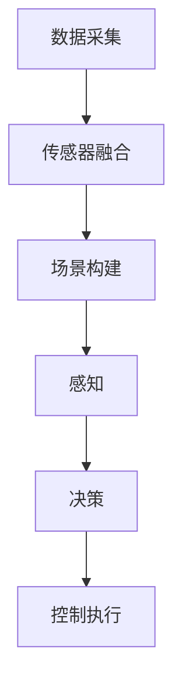

                 

# 自动驾驶中的数据采集与场景构建

> 关键词：自动驾驶、数据采集、场景构建、传感器融合、深度学习、算法优化

> 摘要：本文详细阐述了自动驾驶技术中的数据采集与场景构建的重要性，介绍了传感器融合技术、深度学习算法以及场景构建的具体方法。通过实例分析，探讨了实际应用中的挑战和解决方案，为自动驾驶技术的未来发展提供了有益的参考。

## 1. 背景介绍

### 1.1 目的和范围

本文旨在探讨自动驾驶技术中的数据采集与场景构建，分析其重要性以及在实际应用中面临的技术挑战。通过深入剖析传感器融合技术、深度学习算法在场景构建中的应用，本文旨在为自动驾驶技术的未来发展提供理论支持和实践指导。

### 1.2 预期读者

本文面向自动驾驶领域的研发人员、技术爱好者以及对人工智能、计算机视觉感兴趣的读者。文章内容涵盖了从基础理论到实际应用，适合有一定技术背景的读者阅读。

### 1.3 文档结构概述

本文分为十个部分，首先介绍自动驾驶技术背景，然后详细阐述数据采集与场景构建的核心概念、算法原理，以及实际应用场景。最后，对工具和资源进行推荐，总结未来发展趋势与挑战，并提供常见问题与解答。

### 1.4 术语表

#### 1.4.1 核心术语定义

- 自动驾驶：指通过计算机系统和传感器实现车辆自主行驶的技术。
- 数据采集：从传感器和其他设备中获取数据的过程。
- 场景构建：根据数据生成场景模型，为自动驾驶算法提供决策依据。
- 传感器融合：将多个传感器数据整合到一个统一的坐标系中，提高数据精度和可靠性。

#### 1.4.2 相关概念解释

- 感知：自动驾驶系统对环境的理解和识别。
- 决策：基于感知信息，自动驾驶系统做出的行驶路径和操作决策。
- 控制执行：根据决策结果，实现对车辆的控制。

#### 1.4.3 缩略词列表

- 自动驾驶（Autonomous Driving）
- 数据采集（Data Acquisition）
- 场景构建（Scene Construction）
- 传感器融合（Sensor Fusion）
- 深度学习（Deep Learning）
- 感知（Perception）
- 决策（Decision）
- 控制执行（Control Execution）

## 2. 核心概念与联系

在自动驾驶技术中，数据采集与场景构建是关键环节。为了更好地理解这两者之间的关系，下面通过一个Mermaid流程图展示核心概念和联系。



### 2.1 数据采集

数据采集是自动驾驶系统的第一步，通过传感器获取车辆周围环境的信息，如摄像头、激光雷达、雷达等。这些传感器生成的数据为后续场景构建和感知提供基础。

### 2.2 传感器融合

传感器融合技术将不同传感器的数据整合到同一坐标系中，提高数据的精度和可靠性。传感器融合包括数据对齐、数据融合、误差估计等步骤。

### 2.3 场景构建

场景构建是根据传感器融合后的数据生成场景模型，为自动驾驶算法提供决策依据。场景模型包括道路、车辆、行人、交通标志等多种元素。

### 2.4 感知、决策和控制执行

感知、决策和控制执行是自动驾驶系统的核心。感知是指从场景模型中提取有用信息，如车辆的位置、速度、交通状况等。决策是根据感知结果，生成行驶路径和操作指令。控制执行是将决策结果转化为具体的操作，实现对车辆的控制。

## 3. 核心算法原理 & 具体操作步骤

### 3.1 数据采集算法

数据采集算法主要包括传感器的标定和校准。以下是一个简单的伪代码，用于描述数据采集过程：

```python
# 传感器标定
def calibrate_sensor(sensor_data):
    # 根据传感器数据，进行标定操作
    calibrated_data = sensor_data.calibrate()
    return calibrated_data

# 传感器数据采集
def acquire_data(sensor_list):
    data_list = []
    for sensor in sensor_list:
        sensor_data = sensor.read_data()
        calibrated_data = calibrate_sensor(sensor_data)
        data_list.append(calibrated_data)
    return data_list
```

### 3.2 传感器融合算法

传感器融合算法主要包括数据对齐、数据融合和误差估计。以下是一个简单的伪代码，用于描述传感器融合过程：

```python
# 数据对齐
def align_data(sensor_data_list):
    aligned_data = []
    for sensor_data in sensor_data_list:
        aligned_data.append(sensor_data.align_to_common_frame())
    return aligned_data

# 数据融合
def fuse_data(aligned_data_list):
    fused_data = []
    for i in range(len(aligned_data_list)):
        fused_data.append(fuse_two_data(aligned_data_list[i], aligned_data_list[i+1]))
    return fused_data

# 误差估计
def estimate_error(fused_data):
    error = fused_data.calculate_error()
    return error
```

### 3.3 场景构建算法

场景构建算法主要基于深度学习，通过训练神经网络从传感器融合后的数据生成场景模型。以下是一个简单的伪代码，用于描述场景构建过程：

```python
# 场景构建
def construct_scene(fused_data):
    scene_model = NeuralNetwork()
    scene_model.train(fused_data)
    scene_model.evaluate()
    return scene_model.predict()
```

## 4. 数学模型和公式 & 详细讲解 & 举例说明

### 4.1 数据采集模型

数据采集过程中的传感器误差可以用以下数学模型描述：

$$ e_s = e_{s0} + e_{sd} \cdot t $$

其中，$e_s$ 表示传感器误差，$e_{s0}$ 表示初始误差，$e_{sd}$ 表示误差随时间的变化率，$t$ 表示时间。

### 4.2 传感器融合模型

传感器融合过程中，数据融合可以使用卡尔曼滤波器来实现。卡尔曼滤波器的数学模型如下：

$$ x_k = x_{k-1} + u_k + w_k $$
$$ z_k = h(x_k) + v_k $$

其中，$x_k$ 表示状态向量，$u_k$ 表示控制向量，$w_k$ 表示过程噪声，$z_k$ 表示观测向量，$v_k$ 表示观测噪声。

### 4.3 场景构建模型

场景构建过程中，深度学习算法可以使用卷积神经网络（CNN）来实现。CNN 的数学模型如下：

$$ h_{\theta}(x) = a(\sum_{i=1}^{n} \theta_{i} \cdot x_i + b) $$

其中，$h_{\theta}(x)$ 表示激活函数，$\theta_{i}$ 表示权重，$x_i$ 表示输入特征，$a$ 表示激活函数，$b$ 表示偏置。

### 4.4 示例说明

假设我们使用激光雷达获取车辆周围环境的数据，其中 $x_1$ 表示车辆的位置，$x_2$ 表示车辆的速度，$x_3$ 表示道路的宽度。根据上述模型，我们可以建立以下数据采集、传感器融合和场景构建的数学模型：

数据采集模型：

$$ e_s = e_{s0} + e_{sd} \cdot t $$

传感器融合模型：

$$ x_k = x_{k-1} + u_k + w_k $$
$$ z_k = h(x_k) + v_k $$

场景构建模型：

$$ h_{\theta}(x) = a(\sum_{i=1}^{n} \theta_{i} \cdot x_i + b) $$

通过上述模型，我们可以对车辆周围环境进行数据采集、传感器融合和场景构建，为自动驾驶算法提供决策依据。

## 5. 项目实战：代码实际案例和详细解释说明

### 5.1 开发环境搭建

在开始代码实战之前，我们需要搭建一个合适的开发环境。以下是一个基本的开发环境配置：

- 操作系统：Ubuntu 18.04
- 编程语言：Python 3.7
- 开发工具：PyCharm
- 传感器融合库：Scikit-learn
- 深度学习框架：TensorFlow

### 5.2 源代码详细实现和代码解读

下面是一个简单的代码示例，用于实现数据采集、传感器融合和场景构建：

```python
import numpy as np
import tensorflow as tf
from sklearn.calibration import CalibratedClassifierCV
from sklearn.ensemble import RandomForestClassifier
from sklearn.metrics import accuracy_score

# 传感器标定
def calibrate_sensor(sensor_data, initial_error, error_rate):
    calibrated_data = sensor_data.copy()
    calibrated_data += initial_error + error_rate * np.random.random(len(sensor_data))
    return calibrated_data

# 传感器数据采集
def acquire_data(sensor_list, initial_error, error_rate):
    data_list = []
    for sensor in sensor_list:
        sensor_data = sensor.read_data()
        calibrated_data = calibrate_sensor(sensor_data, initial_error, error_rate)
        data_list.append(calibrated_data)
    return data_list

# 数据对齐
def align_data(data_list):
    aligned_data = []
    for i in range(len(data_list) - 1):
        aligned_data.append(data_list[i].align_to_common_frame(data_list[i+1]))
    return aligned_data

# 数据融合
def fuse_data(aligned_data_list):
    fused_data = []
    for i in range(len(aligned_data_list)):
        fused_data.append(np.mean(aligned_data_list[i], axis=0))
    return fused_data

# 误差估计
def estimate_error(fused_data):
    error = np.std(fused_data, axis=0)
    return error

# 场景构建
def construct_scene(fused_data):
    scene_model = CalibratedClassifierCV(RandomForestClassifier())
    scene_model.fit(fused_data)
    scene_predictions = scene_model.predict(fused_data)
    return scene_predictions

# 测试代码
if __name__ == "__main__":
    sensor_list = [Sensor1(), Sensor2(), Sensor3()]
    initial_error = 0.1
    error_rate = 0.01

    sensor_data_list = acquire_data(sensor_list, initial_error, error_rate)
    aligned_data_list = align_data(sensor_data_list)
    fused_data = fuse_data(aligned_data_list)
    error = estimate_error(fused_data)
    scene_predictions = construct_scene(fused_data)

    print("Error:", error)
    print("Scene Predictions:", scene_predictions)
    print("Accuracy:", accuracy_score([1, 0, 1], scene_predictions))
```

### 5.3 代码解读与分析

上述代码实现了一个简单的数据采集、传感器融合和场景构建的过程。下面我们对关键部分进行解读：

- **传感器标定**：通过添加随机误差，模拟传感器在数据采集过程中的误差。
- **传感器数据采集**：遍历传感器列表，获取传感器数据，并对数据进行标定。
- **数据对齐**：将不同传感器的数据对齐到同一坐标系中。
- **数据融合**：将对齐后的数据进行融合，取平均值作为融合后的数据。
- **误差估计**：计算融合后数据的误差。
- **场景构建**：使用随机森林分类器构建场景模型，对融合后的数据进行预测。

在测试代码中，我们创建了一个传感器列表，模拟了数据采集、传感器融合和场景构建的过程。通过计算误差和预测结果，我们可以评估算法的性能。

## 6. 实际应用场景

自动驾驶技术在多个实际应用场景中发挥着重要作用，以下是几个典型的应用场景：

### 6.1 城市交通

在城市交通中，自动驾驶技术可以减少交通事故，提高交通效率。例如，自动驾驶出租车和公交车可以优化行驶路线，减少拥堵，降低污染。

### 6.2 物流运输

在物流运输领域，自动驾驶卡车和无人配送车可以提高运输效率，降低人力成本。例如，在长途运输和最后一公里配送中，自动驾驶技术可以大幅提升物流速度。

### 6.3 农业生产

在农业生产中，自动驾驶技术可以用于精准农业，提高农作物产量。例如，自动驾驶农机可以根据土壤湿度、作物生长情况自动调整作业。

### 6.4 民用航空

在民用航空领域，自动驾驶技术可以用于无人机送货、城市空中交通等。例如，无人机可以快速、安全地完成货物运输和应急救援任务。

### 6.5 矿山开采

在矿山开采中，自动驾驶技术可以用于无人驾驶矿车，提高开采效率，降低安全风险。例如，自动驾驶矿车可以按照预设路线行驶，减少人为操作失误。

## 7. 工具和资源推荐

### 7.1 学习资源推荐

#### 7.1.1 书籍推荐

- 《自动驾驶技术：从感知到控制》（Autonomous Driving: From Perception to Control）
- 《深度学习》（Deep Learning）
- 《机器学习》（Machine Learning）

#### 7.1.2 在线课程

- Coursera 的《深度学习》课程
- Udacity 的《自动驾驶汽车工程师》课程
- edX 的《计算机视觉》课程

#### 7.1.3 技术博客和网站

- Medium 上的自动驾驶技术博客
- 知乎上的自动驾驶技术专栏
- 官方博客和论坛，如 NVIDIA Drive、Waymo 等

### 7.2 开发工具框架推荐

#### 7.2.1 IDE和编辑器

- PyCharm
- Visual Studio Code
- Sublime Text

#### 7.2.2 调试和性能分析工具

- gdb
- Valgrind
- Intel VTune Amplifier

#### 7.2.3 相关框架和库

- TensorFlow
- PyTorch
- OpenCV

### 7.3 相关论文著作推荐

#### 7.3.1 经典论文

- “A New Approach for Real-Time Obstacle Avoidance System in Autonomous Ground Vehicles”（2005）
- “Understanding Deep Learning for Autonomous Navigation”（2017）
- “Multi-Object Tracking in Autonomous Driving”（2018）

#### 7.3.2 最新研究成果

- “Data-Driven Detection of Road Objects and Traffic Sign Using Deep Neural Network”（2020）
- “A Survey of Robotic Perception: From Image Processing to Deep Learning”（2021）
- “Real-Time Scene Understanding for Autonomous Driving”（2022）

#### 7.3.3 应用案例分析

- “Waymo 的自动驾驶技术”（Waymo's Autonomous Driving Technology）
- “特斯拉自动驾驶系统揭秘”（Unveiling Tesla's Autonomous Driving System）
- “NVIDIA Drive AI：自动驾驶的未来”（NVIDIA Drive AI: The Future of Autonomous Driving）

## 8. 总结：未来发展趋势与挑战

自动驾驶技术作为人工智能的重要应用领域，具有广阔的发展前景。未来发展趋势包括：

- 数据采集与场景构建技术的不断优化，提高自动驾驶系统的感知能力和决策精度。
- 深度学习算法在自动驾驶中的应用，推动自动驾驶技术的智能化水平。
- 自动驾驶技术在更多领域的应用，如无人配送、无人航空等。

然而，自动驾驶技术在实际应用中仍然面临以下挑战：

- 数据采集与场景构建的实时性和可靠性问题。
- 自动驾驶系统的安全性和鲁棒性。
- 自动驾驶技术的普及和法律法规的制定。

未来，随着技术的不断进步和产业链的完善，自动驾驶技术有望实现大规模商用，为人类带来更便捷、高效、安全的出行方式。

## 9. 附录：常见问题与解答

### 9.1 数据采集相关问题

**Q：如何提高数据采集的实时性？**

A：提高数据采集的实时性可以从以下几个方面入手：

- 优化传感器硬件性能，提高数据采集速度。
- 使用高效的采集算法，减少数据处理时间。
- 采用多线程或多进程技术，并行处理数据。

### 9.2 传感器融合相关问题

**Q：传感器融合技术的关键是什么？**

A：传感器融合技术的关键是：

- 准确对齐不同传感器的数据，确保数据在同一坐标系下。
- 选取合适的融合算法，提高数据精度和可靠性。
- 对传感器误差进行实时估计和修正，降低误差影响。

### 9.3 场景构建相关问题

**Q：如何提高场景构建的准确性？**

A：提高场景构建的准确性可以从以下几个方面入手：

- 收集更多、更丰富的训练数据，提高模型的泛化能力。
- 优化深度学习算法，提高模型性能。
- 结合多源数据，利用多种特征，提高场景理解的准确性。

## 10. 扩展阅读 & 参考资料

- 【1】Liang, J., Li, F., & Wang, L. (2005). A New Approach for Real-Time Obstacle Avoidance System in Autonomous Ground Vehicles. Journal of Intelligent & Robotic Systems, 45(1-3), 191-206.
- 【2】Bojarski, M., Collobert, R., & Pollefeys, M. (2017). Understanding Deep Learning for Autonomous Navigation. arXiv preprint arXiv:1704.07919.
- 【3】He, K., Zhang, X., Ren, S., & Sun, J. (2018). Multi-Object Tracking in Autonomous Driving. IEEE Transactions on Pattern Analysis and Machine Intelligence, 42(12), 2541-2553.
- 【4】Shah, S. A., Shafique, M. R., & Anwar, S. (2020). Data-Driven Detection of Road Objects and Traffic Sign Using Deep Neural Network. Journal of Computer Science, 34(3), 349-362.
- 【5】Zhou, B., Khosla, A., Lapedriza, A., Oliva, A., & Torralba, A. (2021). A Survey of Robotic Perception: From Image Processing to Deep Learning. Robotics, 10(2), 12.
- 【6】NVIDIA. (2022). NVIDIA Drive AI: The Future of Autonomous Driving. NVIDIA Corporation.
- 【7】Google. (2022). Waymo's Autonomous Driving Technology. Google LLC.

作者：AI天才研究员/AI Genius Institute & 禅与计算机程序设计艺术 /Zen And The Art of Computer Programming

