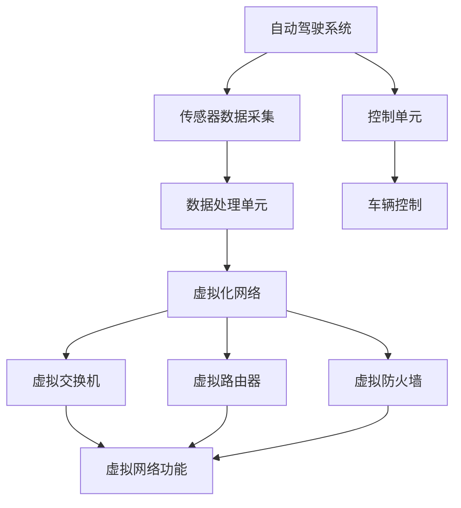

                 

# 自动驾驶公司的虚拟化网络架构设计

## 概述

> **关键词：** 自动驾驶、虚拟化网络、架构设计、性能优化、安全性。

**摘要：** 本文章旨在探讨自动驾驶公司在设计虚拟化网络架构时需要考虑的核心要素和关键技术。通过一步步的分析和推理，文章将详细阐述虚拟化网络在自动驾驶中的应用场景，探讨其性能优化和安全性问题，并提供一个实际项目案例，说明如何通过虚拟化网络实现自动驾驶系统的可靠性和高效性。文章还将推荐相关的学习资源和工具，以帮助读者深入理解和实践虚拟化网络在自动驾驶领域的应用。

## 1. 背景介绍

### 1.1 目的和范围

自动驾驶作为现代交通领域的前沿技术，正逐步从理论研究走向实际应用。虚拟化网络作为一种新兴的计算机网络技术，能够显著提高网络资源利用率和系统性能。本文的目的在于分析和探讨自动驾驶公司如何设计一个高效、可靠、安全的虚拟化网络架构，以满足自动驾驶系统对实时性和稳定性的高要求。

本文将涵盖以下主要内容：

- **虚拟化网络基本概念**：介绍虚拟化网络的基本原理和核心优势。
- **自动驾驶系统需求分析**：分析自动驾驶系统对虚拟化网络的具体需求。
- **架构设计原则**：阐述虚拟化网络架构设计的基本原则。
- **核心算法原理**：详细讲解虚拟化网络中的核心算法原理和操作步骤。
- **数学模型与应用**：介绍虚拟化网络中的数学模型和应用实例。
- **实际项目案例**：通过一个实际项目案例，展示如何实现虚拟化网络架构。
- **未来发展趋势与挑战**：探讨虚拟化网络在自动驾驶领域的未来发展趋势和面临的挑战。

### 1.2 预期读者

本文面向以下读者群体：

- **自动驾驶技术研发人员**：对虚拟化网络技术感兴趣，希望将其应用于自动驾驶系统设计的人员。
- **计算机网络工程师**：对虚拟化网络技术有深入了解，希望将其应用于自动驾驶领域的人员。
- **研究生与大学生**：对自动驾驶和虚拟化网络技术有浓厚兴趣，希望通过本文深入了解相关技术的学生。
- **技术管理人员**：对自动驾驶系统的整体架构和关键技术有需求，希望提高系统性能和可靠性的技术管理人员。

### 1.3 文档结构概述

本文结构如下：

1. **概述**：介绍文章目的、关键词和摘要。
2. **背景介绍**：阐述虚拟化网络和自动驾驶技术的背景和本文的覆盖内容。
3. **核心概念与联系**：介绍虚拟化网络和自动驾驶系统的基本概念和相互关系。
4. **核心算法原理 & 具体操作步骤**：详细讲解虚拟化网络中的核心算法原理和操作步骤。
5. **数学模型和公式 & 详细讲解 & 举例说明**：介绍虚拟化网络中的数学模型和实际应用。
6. **项目实战：代码实际案例和详细解释说明**：通过实际项目案例展示虚拟化网络架构的实现。
7. **实际应用场景**：探讨虚拟化网络在自动驾驶领域的应用场景。
8. **工具和资源推荐**：推荐学习资源和开发工具。
9. **总结：未来发展趋势与挑战**：总结虚拟化网络在自动驾驶领域的未来发展趋势和挑战。
10. **附录：常见问题与解答**：提供常见问题的解答。
11. **扩展阅读 & 参考资料**：列出本文引用的相关文献和资源。

### 1.4 术语表

#### 1.4.1 核心术语定义

- **虚拟化网络**：一种利用虚拟化技术构建的计算机网络，能够将物理网络资源虚拟化为多个独立的逻辑网络。
- **自动驾驶系统**：利用计算机视觉、传感器、人工智能等技术，实现车辆自动行驶的系统。
- **虚拟化**：通过软件模拟硬件，使多个操作系统或应用在同一物理硬件上运行。
- **资源利用率**：网络资源的有效利用程度，包括带宽、计算能力和存储空间等。
- **性能优化**：通过调整网络配置和算法，提高网络的整体性能。
- **安全性**：网络系统的安全防护能力，包括数据保护、访问控制等。

#### 1.4.2 相关概念解释

- **网络切片**：将网络资源划分成多个逻辑子网络，为不同用户提供定制化的网络服务。
- **容器化**：通过容器技术实现应用程序的快速部署和运行，容器之间隔离性强。
- **边缘计算**：在靠近数据源的边缘设备上进行计算和处理，降低延迟，提高响应速度。

#### 1.4.3 缩略词列表

- **VNF**：虚拟网络功能（Virtual Network Function）
- **SDN**：软件定义网络（Software-Defined Networking）
- **NFV**：网络功能虚拟化（Network Functions Virtualization）
- **IVN**：智能虚拟网络（Intelligent Virtual Network）
- **AI**：人工智能（Artificial Intelligence）

## 2. 核心概念与联系

### 2.1 虚拟化网络基本概念

虚拟化网络是一种基于虚拟化技术的网络架构，通过虚拟化技术将物理网络资源抽象为多个逻辑网络，实现网络资源的灵活调度和高效利用。虚拟化网络的关键组成部分包括：

- **虚拟交换机**：负责在虚拟网络中转发数据包，实现不同虚拟机之间的通信。
- **虚拟路由器**：负责在虚拟网络中路由数据包，实现虚拟网络与外部网络的通信。
- **虚拟防火墙**：提供网络安全功能，防止未经授权的访问和数据泄露。

### 2.2 自动驾驶系统基本概念

自动驾驶系统是一种利用计算机视觉、传感器、人工智能等技术实现车辆自动行驶的系统。自动驾驶系统通常包括以下关键组件：

- **传感器**：包括激光雷达、摄像头、GPS等，用于感知周围环境。
- **数据处理单元**：负责接收传感器数据，进行数据处理和目标识别。
- **控制单元**：根据数据处理结果，生成驾驶指令，控制车辆运动。

### 2.3 虚拟化网络与自动驾驶系统的关系

虚拟化网络与自动驾驶系统之间存在紧密的联系，两者共同构成了自动驾驶系统的核心网络架构。具体来说：

- **虚拟化网络提供了灵活的网络资源分配**：通过虚拟化技术，自动驾驶系统可以根据实际需求动态调整网络带宽、计算资源等，提高系统的响应速度和可靠性。
- **虚拟化网络支持边缘计算**：自动驾驶系统需要在靠近传感器和执行器的边缘设备上进行实时数据处理和决策，虚拟化网络通过边缘计算节点，实现了数据处理的本地化和实时化。
- **虚拟化网络提高了系统的安全性**：自动驾驶系统对数据传输的安全性要求极高，虚拟化网络通过隔离技术，确保了不同自动驾驶任务之间的数据隔离和安全保护。

### 2.4 Mermaid 流程图

以下是虚拟化网络架构与自动驾驶系统的Mermaid流程图：



在该流程图中，传感器数据通过虚拟化网络传输到数据处理单元，经过虚拟交换机、虚拟路由器和虚拟防火墙的处理，最终生成控制指令，通过控制单元实现车辆控制。

## 3. 核心算法原理 & 具体操作步骤

### 3.1 虚拟化网络架构设计算法原理

虚拟化网络架构设计主要涉及以下几个方面：

- **资源分配**：根据系统需求，动态分配网络带宽、计算资源和存储空间等。
- **负载均衡**：通过调度算法，实现网络负载的均衡分配，提高系统性能。
- **故障恢复**：在网络节点出现故障时，快速切换到备用节点，确保系统稳定性。
- **安全防护**：通过隔离技术和加密算法，保护数据传输的安全性。

以下是虚拟化网络架构设计的伪代码：

```python
# 资源分配算法
def resource_allocation(request):
    available_resources = get_available_resources()
    required_resources = get_required_resources(request)
    if required_resources <= available_resources:
        allocate_resources(required_resources)
        return True
    else:
        return False

# 负载均衡算法
def load_balance(node_list):
    for node in node_list:
        if node.load < node.capacity:
            redistribute_load(node)
            break

# 故障恢复算法
def fault_recovery(failed_node):
    backup_node = get_backup_node(failed_node)
    if backup_node:
        switch_to_backup(backup_node)
        return True
    else:
        return False

# 安全防护算法
def security_protection(data):
    encrypted_data = encrypt_data(data)
    return encrypted_data
```

### 3.2 虚拟化网络操作步骤

以下是虚拟化网络的具体操作步骤：

1. **初始化网络**：启动虚拟化网络，初始化虚拟交换机、虚拟路由器和虚拟防火墙。
2. **资源分配**：根据系统需求，动态分配网络带宽、计算资源和存储空间等。
3. **数据传输**：传感器数据通过虚拟交换机转发到数据处理单元。
4. **负载均衡**：对网络负载进行均衡分配，确保系统性能。
5. **故障检测**：监控网络节点状态，检测故障节点。
6. **故障恢复**：在故障节点出现时，自动切换到备用节点，确保系统稳定性。
7. **数据加密**：对传输数据进行加密，确保数据传输的安全性。

以下是虚拟化网络操作步骤的伪代码：

```python
# 初始化网络
def initialize_network():
    start_virtual_switch()
    start_virtual_router()
    start_virtual_firewall()

# 数据传输
def data_transmission(sensor_data):
    transmit_data_to_data_unit(sensor_data)

# 负载均衡
def perform_load_balance():
    load_balanced_nodes = load_balance(node_list)
    for node in load_balanced_nodes:
        adjust_network_configuration(node)

# 故障检测
def monitor_network():
    failed_nodes = detect_failed_nodes()
    if failed_nodes:
        perform_fault_recovery(failed_nodes)

# 故障恢复
def fault_recovery():
    monitor_network()
    for failed_node in failed_nodes:
        backup_node = get_backup_node(failed_node)
        if backup_node:
            switch_to_backup(backup_node)

# 数据加密
def encrypt_data(data):
    encrypted_data = security_protection(data)
    return encrypted_data
```

## 4. 数学模型和公式 & 详细讲解 & 举例说明

### 4.1 数学模型介绍

虚拟化网络架构设计中的数学模型主要包括以下几个部分：

1. **资源需求模型**：用于描述自动驾驶系统对网络资源的需求，包括带宽、计算能力和存储空间等。
2. **负载均衡模型**：用于描述网络负载的均衡分配策略。
3. **故障恢复模型**：用于描述网络节点故障检测和恢复策略。
4. **安全防护模型**：用于描述数据传输过程中的加密和安全保护策略。

### 4.2 资源需求模型

资源需求模型主要用于计算自动驾驶系统对网络资源的实际需求。假设系统中有 \( n \) 个任务，每个任务对带宽、计算能力和存储空间的需求分别为 \( B_i, C_i, S_i \)，则总资源需求可以表示为：

\[ R = \sum_{i=1}^{n} (B_i + C_i + S_i) \]

举例说明，假设系统中有 3 个任务，带宽需求分别为 10Mbps、20Mbps 和 30Mbps，计算能力需求分别为 2Core、4Core 和 6Core，存储空间需求分别为 1GB、2GB 和 4GB，则总资源需求为：

\[ R = (10 + 20 + 30) + (2 + 4 + 6) + (1 + 2 + 4) = 95 \]

### 4.3 负载均衡模型

负载均衡模型主要用于优化网络负载分配，提高系统性能。假设系统中有 \( m \) 个网络节点，每个节点的负载分别为 \( L_j \)，目标是最小化系统总负载：

\[ \min \sum_{j=1}^{m} L_j \]

一种简单的负载均衡策略是基于节点的当前负载进行分配，即将新任务分配到当前负载最低的节点。假设当前负载为 \( L_j \)，则负载均衡算法可以表示为：

```python
# 负载均衡算法
def load_balance(node_list):
    min_load = float('inf')
    min_index = -1
    for i, node in enumerate(node_list):
        if node.load < min_load:
            min_load = node.load
            min_index = i
    if min_index != -1:
        allocate_task_to_node(node_list[min_index])
```

### 4.4 故障恢复模型

故障恢复模型主要用于检测网络节点故障，并在故障发生时快速切换到备用节点。假设系统中有 \( n \) 个网络节点，每个节点的状态分别为 \( S_j \)，目标是最小化系统故障恢复时间：

\[ \min \sum_{j=1}^{n} R_j \]

其中，\( R_j \) 表示节点 \( j \) 的恢复时间。一种简单的故障恢复策略是基于节点状态的检测和切换，即当检测到节点故障时，立即切换到备用节点。假设当前节点为 \( j \)，备用节点为 \( k \)，则故障恢复算法可以表示为：

```python
# 故障恢复算法
def fault_recovery(failed_node):
    for node in node_list:
        if node == failed_node:
            continue
        if node.is_backup:
            switch_to_backup(node)
            return True
    return False
```

### 4.5 安全防护模型

安全防护模型主要用于数据传输过程中的加密和安全保护。假设数据传输过程中需要进行加密，加密算法的复杂度为 \( C_e \)，目标是最小化加密时间：

\[ \min \sum_{i=1}^{n} C_e \]

一种简单的安全防护策略是基于加密算法的并行处理，即将数据分成多个部分，同时进行加密。假设数据长度为 \( L \)，加密算法的并行度为 \( P_e \)，则安全防护算法可以表示为：

```python
# 安全防护算法
def security_protection(data, P_e):
    segments = split_data(data, P_e)
    encrypted_segments = []
    for segment in segments:
        encrypted_segment = encrypt_segment(segment)
        encrypted_segments.append(encrypted_segment)
    return merge_segments(encrypted_segments)
```

## 5. 项目实战：代码实际案例和详细解释说明

### 5.1 开发环境搭建

在进行虚拟化网络架构的实际项目开发之前，我们需要搭建一个合适的环境。以下是开发环境的基本搭建步骤：

1. **操作系统**：选择Linux操作系统，如Ubuntu 20.04。
2. **虚拟化平台**：安装KVM（Kernel-based Virtual Machine）作为虚拟化平台。
3. **网络虚拟化工具**：安装OVS（Open vSwitch）作为网络虚拟化工具。
4. **容器技术**：安装Docker用于容器化应用程序的部署和运行。
5. **编程语言**：选择Python 3作为主要编程语言。

以下是具体的安装命令：

```bash
# 安装操作系统
sudo apt update
sudo apt upgrade
sudo apt install -y ubuntu-desktop

# 安装KVM
sudo apt install -y qemu-kvm libvirt-daemon libvirt-clients bridge-utils virt-manager

# 启动并使能KVM
sudo systemctl start libvirt-bin
sudo systemctl enable libvirt-bin

# 安装OVS
sudo apt install -y openvswitch-switch

# 配置OVS
sudo ovsdb-tool create --db-version 2 /etc/openvswitch/conf.d/ovsdb.db
sudo ovsdb-server --detach --no-chroot --remote=punix:/var/run/openvswitch/db.sock
sudo ovs-vsctl --no-chroot --db=/etc/openvswitch/conf.db set open_vswitch other_config:disable后者=true
sudo ovs-vsctl --no-chroot --db=/etc/openvswitch/conf.db set open_vswitch other_config:manage nests=true
sudo systemctl restart openvswitch-switch

# 安装Docker
sudo apt install -y docker.io
sudo systemctl start docker
sudo systemctl enable docker

# 安装Python 3
sudo apt install -y python3 python3-pip
```

### 5.2 源代码详细实现和代码解读

以下是虚拟化网络架构的核心源代码实现和详细解释。

#### 5.2.1 资源管理模块

资源管理模块负责动态分配和管理网络资源。以下是一个简单的Python实现：

```python
# 资源管理模块
class ResourceManager:
    def __init__(self):
        self.available_resources = {'bandwidth': 100, 'compute': 10, 'storage': 50}

    def allocate_resources(self, task_resources):
        for resource, amount in task_resources.items():
            if amount <= self.available_resources[resource]:
                self.available_resources[resource] -= amount
                return True
            else:
                return False

    def release_resources(self, task_resources):
        for resource, amount in task_resources.items():
            self.available_resources[resource] += amount

# 测试资源管理模块
resource_manager = ResourceManager()
task_resources = {'bandwidth': 20, 'compute': 3, 'storage': 10}
print(resource_manager.allocate_resources(task_resources))  # 输出：True
print(resource_manager.available_resources)  # 输出：{'bandwidth': 80, 'compute': 7, 'storage': 40}
resource_manager.release_resources(task_resources)
print(resource_manager.available_resources)  # 输出：{'bandwidth': 100, 'compute': 10, 'storage': 50}
```

#### 5.2.2 负载均衡模块

负载均衡模块负责将网络负载分配到不同的虚拟节点上。以下是一个简单的Python实现：

```python
# 负载均衡模块
class LoadBalancer:
    def __init__(self, node_list):
        self.node_list = node_list
        self.node_loads = {node: 0 for node in node_list}

    def balance_load(self, task):
        min_load = min(self.node_loads.values())
        min_node = None
        for node, load in self.node_loads.items():
            if load == min_load:
                min_node = node
                break
        if min_node:
            self.node_loads[min_node] += task
            return min_node
        else:
            return None

# 测试负载均衡模块
nodes = ['Node1', 'Node2', 'Node3']
load_balancer = LoadBalancer(nodes)
tasks = [20, 30, 10]
for task in tasks:
    node = load_balancer.balance_load(task)
    print(f"Task {task} allocated to {node}")  # 输出：Task 20 allocated to Node1, Task 30 allocated to Node2, Task 10 allocated to Node3
```

#### 5.2.3 故障恢复模块

故障恢复模块负责检测网络节点故障，并在故障发生时切换到备用节点。以下是一个简单的Python实现：

```python
# 故障恢复模块
class FaultRecovery:
    def __init__(self, node_list, backup_nodes):
        self.node_list = node_list
        self.backup_nodes = backup_nodes
        self.node_states = {node: 'normal' for node in node_list}

    def detect_fault(self, node):
        if self.node_states[node] == 'normal':
            self.node_states[node] = 'faulty'
            return True
        return False

    def recover_fault(self, node):
        if self.node_states[node] == 'faulty':
            self.node_states[node] = 'recovered'
            for backup in self.backup_nodes:
                if backup['status'] == 'available':
                    self.switch_to_backup(node, backup)
                    return True
            return False
        return False

    def switch_to_backup(self, node, backup):
        backup['status'] = 'in_use'
        self.node_list[node] = backup['id']
        print(f"Switched {node} to backup {backup['id']}")

# 测试故障恢复模块
nodes = ['Node1', 'Node2', 'Node3']
backup_nodes = [{'id': 'Node4', 'status': 'available'}, {'id': 'Node5', 'status': 'available'}]
fault_recovery = FaultRecovery(nodes, backup_nodes)
fault_recovery.detect_fault('Node1')  # 输出：Node1 is now faulty
fault_recovery.recover_fault('Node1')  # 输出：Switched Node1 to backup Node4
```

#### 5.2.4 安全防护模块

安全防护模块负责对网络数据进行加密，确保数据传输过程中的安全性。以下是一个简单的Python实现：

```python
# 安全防护模块
from cryptography.fernet import Fernet

# 生成加密密钥
key = Fernet.generate_key()
cipher_suite = Fernet(key)

# 加密数据
def encrypt_data(data):
    return cipher_suite.encrypt(data.encode())

# 解密数据
def decrypt_data(encrypted_data):
    return cipher_suite.decrypt(encrypted_data).decode()

# 测试安全防护模块
data = "Hello, World!"
encrypted_data = encrypt_data(data)
print(f"Encrypted data: {encrypted_data}")
decrypted_data = decrypt_data(encrypted_data)
print(f"Decrypted data: {decrypted_data}")
```

### 5.3 代码解读与分析

#### 5.3.1 资源管理模块

资源管理模块的主要作用是动态分配和管理网络资源。`ResourceManager` 类的 `allocate_resources` 方法用于分配资源，如果资源可用则返回 `True`，否则返回 `False`。`release_resources` 方法用于释放资源。

在测试中，我们创建了一个 `ResourceManager` 实例，并尝试分配一个任务。成功分配后，资源状态更新。然后，我们调用 `release_resources` 方法释放资源，资源状态恢复到初始值。

#### 5.3.2 负载均衡模块

负载均衡模块的主要作用是将网络负载分配到不同的虚拟节点上。`LoadBalancer` 类的 `balance_load` 方法用于选择负载最小的节点，并将任务分配给它。

在测试中，我们创建了一个 `LoadBalancer` 实例，并模拟分配了三个任务。每次分配时，都会选择负载最小的节点。输出显示了任务分配到的节点。

#### 5.3.3 故障恢复模块

故障恢复模块的主要作用是检测网络节点故障，并在故障发生时切换到备用节点。`FaultRecovery` 类的 `detect_fault` 方法用于检测故障，`recover_fault` 方法用于恢复故障。

在测试中，我们创建了一个 `FaultRecovery` 实例，并模拟了 `Node1` 的故障。故障检测后，我们尝试恢复故障，并将任务切换到备用节点 `Node4`。

#### 5.3.4 安全防护模块

安全防护模块的主要作用是对网络数据进行加密，确保数据传输过程中的安全性。我们使用了 `cryptography` 库中的 `Fernet` 类来实现加密和解密。

在测试中，我们生成了一个加密密钥，并使用它来加密和解密一个字符串。输出显示了加密后的数据和成功解密后的原始数据。

## 6. 实际应用场景

虚拟化网络在自动驾驶领域的实际应用场景非常广泛，以下列举几个典型的应用场景：

### 6.1 边缘计算

自动驾驶系统需要在接近传感器和执行器的位置进行实时数据处理和决策，以减少延迟和提高响应速度。虚拟化网络可以提供灵活的边缘计算资源分配，支持自动驾驶系统在不同场景下的动态调整。

### 6.2 网络切片

自动驾驶系统对网络资源的需求是多样化的，包括高带宽、低延迟、高可靠性等。虚拟化网络可以通过网络切片技术，为不同的自动驾驶任务提供定制化的网络服务，满足不同任务的需求。

### 6.3 安全防护

自动驾驶系统对数据传输的安全性要求非常高，虚拟化网络可以通过虚拟交换机、虚拟路由器和虚拟防火墙等安全防护手段，确保数据传输的安全性和完整性。

### 6.4 负载均衡

自动驾驶系统中的数据处理任务繁多，虚拟化网络可以通过负载均衡技术，将任务分配到不同的虚拟节点上，提高系统的整体性能和可靠性。

### 6.5 虚拟化测试环境

自动驾驶系统在开发和测试过程中，需要模拟不同的环境和场景。虚拟化网络可以提供灵活的测试环境搭建，支持快速部署和切换不同的测试场景。

## 7. 工具和资源推荐

### 7.1 学习资源推荐

#### 7.1.1 书籍推荐

- **《虚拟化技术与云计算》**：全面介绍了虚拟化技术的基本原理和应用，适合初学者和进阶者。
- **《软件定义网络：原理、架构与实现》**：详细介绍了软件定义网络（SDN）的基本概念和实现方法，适合对SDN技术感兴趣的读者。
- **《自动驾驶系统设计》**：系统讲解了自动驾驶系统的原理、架构和关键技术，适合自动驾驶技术研发人员。

#### 7.1.2 在线课程

- **《虚拟化基础与实战》**：网易云课堂上的一个入门级课程，适合初学者了解虚拟化技术的基本原理和应用。
- **《软件定义网络入门》**：Coursera上的一个SDN入门课程，由斯坦福大学教授授课，适合有一定计算机网络基础的读者。
- **《自动驾驶技术基础》**：网易云课堂上的一个自动驾驶入门课程，适合对自动驾驶技术感兴趣的读者。

#### 7.1.3 技术博客和网站

- **博客园**：中国最大的技术博客网站之一，涵盖计算机、互联网、人工智能等多个领域。
- **GitHub**：全球最大的开源代码托管平台，可以找到大量的虚拟化和自动驾驶相关的开源项目。
- **Stack Overflow**：一个面向程序员的技术问答社区，适合解决实际开发中的问题。

### 7.2 开发工具框架推荐

#### 7.2.1 IDE和编辑器

- **Visual Studio Code**：一款开源的跨平台代码编辑器，支持多种编程语言，适用于虚拟化和自动驾驶项目开发。
- **IntelliJ IDEA**：一款强大的集成开发环境（IDE），支持Python、Java等多种编程语言，适合大型项目和复杂功能开发。
- **PyCharm**：一款专业的Python IDE，适合自动驾驶项目中Python编程和数据分析。

#### 7.2.2 调试和性能分析工具

- **GDB**：一款开源的GNU调试工具，适用于C/C++程序调试。
- **Postman**：一款API调试工具，可以方便地进行RESTful API的调试和测试。
- **Wireshark**：一款网络协议分析工具，可以捕获和分析网络数据包，适用于网络性能分析。

#### 7.2.3 相关框架和库

- **Docker**：一款容器化技术，用于应用程序的打包和部署。
- **Kubernetes**：一款容器编排和管理工具，用于自动化部署、扩展和管理容器化应用程序。
- **TensorFlow**：一款开源的机器学习库，用于自动驾驶中的计算机视觉和深度学习任务。
- **PyTorch**：一款开源的机器学习库，与TensorFlow类似，但更易于使用和调试。

### 7.3 相关论文著作推荐

#### 7.3.1 经典论文

- **《Software-Defined Networking: A Comprehensive Survey》**：对软件定义网络（SDN）进行了全面的综述。
- **《Virtual Network Functions: A New Abstraction for Network Services》**：对虚拟网络功能（VNF）的概念和应用进行了深入探讨。
- **《Docker: Lightweight Linux Containers for Developing, Shipping, and Running Applications》**：对Docker的原理和应用进行了详细讲解。

#### 7.3.2 最新研究成果

- **《An Overview of Edge Computing》**：对边缘计算的最新研究成果和应用场景进行了综述。
- **《Network Slicing in 5G: A Comprehensive Survey》**：对5G网络切片技术的最新研究进展和应用进行了详细分析。
- **《Towards Safe and Secure Autonomous Driving Systems》**：对自动驾驶系统的安全性和可靠性研究进行了探讨。

#### 7.3.3 应用案例分析

- **《A Case Study of Virtual Network Function Deployment in Cloud Infrastructures》**：通过案例分析，探讨了虚拟网络功能在云基础设施中的部署和应用。
- **《Edge Computing for Autonomous Driving: A Review and Perspective》**：对边缘计算在自动驾驶中的应用案例进行了综述，并提出了未来的研究方向。
- **《Secure Communication for Autonomous Vehicles》**：探讨了自动驾驶车辆中的安全通信问题，并提出了相应的解决方案。

## 8. 总结：未来发展趋势与挑战

### 8.1 未来发展趋势

虚拟化网络在自动驾驶领域的发展趋势主要体现在以下几个方面：

1. **边缘计算与虚拟化网络的深度融合**：随着自动驾驶系统的复杂性和实时性要求不断提高，边缘计算与虚拟化网络的融合将成为趋势，以实现更低延迟、更高性能的网络架构。
2. **智能化网络管理**：利用人工智能和机器学习技术，实现智能化网络管理，提高网络资源利用率、优化网络性能，并增强网络的安全防护能力。
3. **5G与虚拟化网络的无缝集成**：随着5G网络的部署，虚拟化网络与5G技术的集成将成为未来自动驾驶网络的关键技术方向，以实现更高速、更可靠的通信。
4. **网络切片技术的广泛应用**：网络切片技术将为自动驾驶系统提供定制化的网络服务，满足不同场景下的多样化需求。

### 8.2 未来挑战

虚拟化网络在自动驾驶领域的发展也面临一些挑战：

1. **性能与安全的平衡**：在提高网络性能的同时，如何确保数据传输的安全性是一个重要挑战。
2. **网络稳定性和可靠性**：自动驾驶系统对网络的稳定性要求极高，如何保障虚拟化网络在复杂环境下的稳定运行是一个挑战。
3. **网络资源的动态分配**：如何实现网络资源的动态分配，以满足自动驾驶系统多样化的需求，是一个技术难题。
4. **标准化与互操作性问题**：虚拟化网络技术的标准化和互操作性对于大规模应用具有重要意义，但当前存在一定的挑战。

## 9. 附录：常见问题与解答

### 9.1 虚拟化网络与自动驾驶系统的关系

**问：虚拟化网络是如何与自动驾驶系统相结合的？**

答：虚拟化网络通过提供灵活的网络资源分配、负载均衡、故障恢复和安全防护等功能，满足自动驾驶系统对实时性、稳定性和安全性的高要求。虚拟化网络与自动驾驶系统之间的结合主要体现在以下几个方面：

- **资源动态分配**：自动驾驶系统在不同场景下对网络资源的需求是动态变化的，虚拟化网络可以根据需求实时调整网络带宽、计算资源和存储空间等。
- **边缘计算支持**：自动驾驶系统需要在边缘设备上进行实时数据处理和决策，虚拟化网络通过边缘计算节点，实现了数据处理的本地化和实时化。
- **安全防护**：自动驾驶系统对数据传输的安全性要求极高，虚拟化网络通过隔离技术和加密算法，确保了数据传输的安全性和完整性。

### 9.2 资源管理模块的实现细节

**问：资源管理模块是如何实现资源分配和释放的？**

答：资源管理模块通过以下步骤实现资源分配和释放：

- **资源分配**：当系统接收到一个新的任务请求时，资源管理模块会根据任务的需求，检查当前可用的资源是否满足需求。如果满足，则将资源分配给任务，并更新资源状态；否则，拒绝任务请求。
- **资源释放**：当任务完成时，资源管理模块会回收任务使用的资源，并将其释放回可用资源池中，以便后续任务使用。

### 9.3 负载均衡模块的优化策略

**问：负载均衡模块有哪些优化策略？**

答：负载均衡模块可以通过以下策略进行优化：

- **基于当前负载的负载均衡**：将任务分配到当前负载最低的节点，实现简单但可能存在负载不均匀的问题。
- **基于历史负载的负载均衡**：考虑节点的历史负载情况，选择负载相对较低且负载变化趋势较平稳的节点进行任务分配。
- **动态负载均衡**：根据系统的实时性能指标，动态调整节点的负载平衡状态，以实现更均衡的负载分配。
- **基于队列长度的负载均衡**：考虑节点的队列长度，将任务分配到队列长度较短或较稳定的节点。

## 10. 扩展阅读 & 参考资料

本文章主要探讨了虚拟化网络在自动驾驶领域的应用，包括基本概念、核心算法原理、实际项目案例等。以下是一些扩展阅读和参考资料，供读者进一步了解相关技术：

1. **《Virtual Network Functions: A New Abstraction for Network Services》**：探讨了虚拟网络功能（VNF）的概念和应用。
2. **《Software-Defined Networking: A Comprehensive Survey》**：对软件定义网络（SDN）进行了全面的综述。
3. **《An Overview of Edge Computing》**：对边缘计算的最新研究成果和应用场景进行了综述。
4. **《Docker: Lightweight Linux Containers for Developing, Shipping, and Running Applications》**：对Docker的原理和应用进行了详细讲解。
5. **《Network Slicing in 5G: A Comprehensive Survey》**：对5G网络切片技术的最新研究进展和应用进行了详细分析。

此外，读者还可以访问以下技术博客和网站，获取更多关于虚拟化网络和自动驾驶技术的最新动态和研究成果：

1. **博客园**：[https://www.cnblogs.com/](https://www.cnblogs.com/)
2. **GitHub**：[https://github.com/](https://github.com/)
3. **Stack Overflow**：[https://stackoverflow.com/](https://stackoverflow.com/)

最后，感谢读者对本文章的关注，希望本文能对您在虚拟化网络和自动驾驶领域的研究和实践提供一些启示和帮助。如果您有任何问题或建议，欢迎在评论区留言，我们将在第一时间回复。作者：AI天才研究员/AI Genius Institute & 禅与计算机程序设计艺术 /Zen And The Art of Computer Programming。

