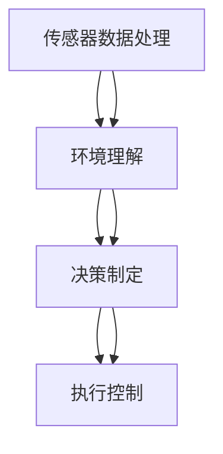
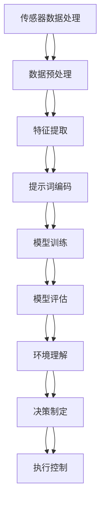
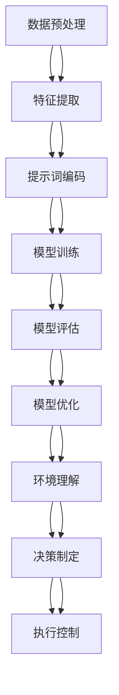

                 

### 背景介绍

#### 1.1 目的和范围

本文旨在深入探讨自动驾驶决策系统中提示词增强环境理解能力的技术和方法。自动驾驶作为人工智能领域的核心应用之一，其安全性和效率直接关系到未来智能交通系统的构建。本文将围绕自动驾驶决策系统中的环境感知、数据理解和决策算法，通过提示词增强技术，探讨如何提升环境理解能力，从而提高自动驾驶系统的整体性能和安全性。

本文的主要目标是：

1. **明确自动驾驶决策系统的基本架构和运作原理**：介绍自动驾驶决策系统的整体架构，包括传感器数据处理、环境理解、决策制定和执行等关键环节。

2. **探讨提示词增强环境理解的技术和方法**：分析提示词的概念及其在环境理解中的应用，详细介绍如何通过提示词增强技术来提高自动驾驶系统的环境理解能力。

3. **阐述核心算法原理和具体操作步骤**：通过伪代码和数学模型，详细解析自动驾驶决策系统中的核心算法原理，展示其具体操作步骤。

4. **提供实际应用场景和代码案例**：通过实际代码案例，说明提示词增强技术在自动驾驶决策系统中的具体应用，并对代码进行详细解释。

5. **总结未来发展趋势与挑战**：分析自动驾驶决策系统的发展趋势和面临的挑战，探讨未来的研究方向和可能的技术突破。

本文的范围涵盖自动驾驶决策系统的基本概念、核心算法原理、应用场景及未来发展趋势。通过本文的阅读，读者可以全面了解自动驾驶决策系统中提示词增强环境理解能力的技术和方法，为实际应用和进一步研究提供理论基础和实践指导。

#### 1.2 预期读者

本文面向的读者包括以下几类：

1. **自动驾驶领域的研究人员**：对自动驾驶决策系统的技术原理和应用场景有深入了解，希望通过本文学习提示词增强环境理解能力的新方法。

2. **计算机科学和人工智能专业学生**：对自动驾驶和人工智能相关技术有浓厚兴趣，希望深入了解自动驾驶决策系统的核心算法和实现方法。

3. **自动驾驶企业和开发者**：正在从事自动驾驶项目开发，希望通过本文了解最新技术动态，提高项目研发效率和性能。

4. **对智能交通系统有兴趣的公众**：对自动驾驶和智能交通系统有基本了解，希望通过本文了解自动驾驶技术的最新发展和应用场景。

本文将从基础的自动驾驶概念入手，逐步深入探讨提示词增强环境理解的技术和方法，力求让不同背景的读者都能有所收获。

#### 1.3 文档结构概述

本文将采用模块化的结构，分为以下几个主要部分：

1. **背景介绍**：介绍本文的目的、范围、预期读者以及文档结构概述。

2. **核心概念与联系**：详细解释自动驾驶决策系统的核心概念，包括传感器数据处理、环境理解和决策制定等。通过Mermaid流程图展示系统架构和关键组件的联系。

3. **核心算法原理 & 具体操作步骤**：详细解析自动驾驶决策系统中的核心算法原理，通过伪代码展示具体操作步骤。

4. **数学模型和公式 & 详细讲解 & 举例说明**：阐述自动驾驶决策系统中的数学模型和公式，并通过具体例子说明其应用。

5. **项目实战：代码实际案例和详细解释说明**：提供实际代码案例，展示如何应用提示词增强技术于自动驾驶决策系统中，并对代码进行详细解读。

6. **实际应用场景**：讨论自动驾驶决策系统在现实世界中的应用场景和案例。

7. **工具和资源推荐**：推荐相关学习资源和开发工具，包括书籍、在线课程、技术博客和相关论文。

8. **总结：未来发展趋势与挑战**：总结自动驾驶决策系统的发展趋势和面临的挑战。

9. **附录：常见问题与解答**：回答读者可能遇到的问题。

10. **扩展阅读 & 参考资料**：提供进一步阅读的资料和参考文献。

通过上述结构，本文旨在系统性地介绍自动驾驶决策系统中提示词增强环境理解能力的相关技术，为读者提供全面、深入的理解和实际应用指导。

#### 1.4 术语表

为了确保本文内容的专业性和可理解性，以下列出本文中涉及的关键术语和其定义：

#### 1.4.1 核心术语定义

- **自动驾驶决策系统**：一种基于传感器数据和环境信息，通过算法实现自主决策和执行的系统，用于控制车辆行驶。

- **传感器数据处理**：对自动驾驶车辆所收集的传感器数据（如激光雷达、摄像头、超声波传感器等）进行预处理、融合和特征提取的过程。

- **环境理解**：对车辆周围环境进行感知、理解和建模，以便做出合理的驾驶决策。

- **决策制定**：基于环境理解和车辆状态，通过算法生成驾驶指令，如加速、减速、转向等。

- **提示词**：在自动驾驶系统中，用于指示特定对象或情境的关键词，如“行人”、“障碍物”、“车道线”等。

- **增强环境理解**：通过特定技术（如提示词增强）提高自动驾驶系统对复杂环境的理解和应对能力。

- **深度学习**：一种基于多层神经网络模型的人工智能技术，用于对大量数据进行自动特征提取和模式识别。

- **神经网络**：一种由大量神经元组成的计算模型，通过前向传播和反向传播算法实现数据的输入输出映射。

- **卷积神经网络（CNN）**：一种用于图像处理和识别的神经网络结构，通过卷积操作提取图像特征。

- **递归神经网络（RNN）**：一种用于序列数据处理和预测的神经网络结构，能够通过记忆机制处理时间序列数据。

- **强化学习**：一种通过试错法进行决策优化的机器学习方法，通过奖励机制不断调整策略以达到最优决策。

#### 1.4.2 相关概念解释

- **传感器融合**：将多个传感器采集的数据进行融合处理，以提高数据的准确性和可靠性。

- **多模态感知**：结合多种传感器数据（如视觉、激光雷达、超声波等），实现对环境信息的全面感知。

- **行为预测**：通过分析历史数据和当前环境，预测其他车辆、行人的未来行为，以便提前做出安全驾驶决策。

- **决策融合**：将多个决策算法的结果进行融合，以提高决策的可靠性和鲁棒性。

- **多任务学习**：同时学习多个相关任务，以提高模型在不同任务上的泛化能力。

- **自适应控制**：根据环境和车辆状态的实时变化，动态调整驾驶策略，以实现最优驾驶体验。

#### 1.4.3 缩略词列表

- **Lidar**：激光雷达，一种通过发射激光并接收反射信号来测量距离的传感器。

- **GPS**：全球定位系统，一种用于定位和导航的卫星导航系统。

- **IMU**：惯性测量单元，一种用于测量加速度和角速度的传感器。

- **CNN**：卷积神经网络，一种用于图像处理和识别的神经网络结构。

- **RNN**：递归神经网络，一种用于序列数据处理和预测的神经网络结构。

- **DNN**：深度神经网络，一种由多层神经元组成的神经网络结构。

- **DL**：深度学习，一种基于多层神经网络模型的人工智能技术。

- **SLAM**：同时定位与地图构建，一种用于自动驾驶车辆进行环境感知和定位的算法。

通过上述术语和概念的详细解释，读者可以更好地理解自动驾驶决策系统中提示词增强环境理解能力的核心内容和关键技术。这些术语和概念将贯穿本文的讨论，为后续内容提供理论基础。

#### 2. 核心概念与联系

在深入探讨自动驾驶决策系统中提示词增强环境理解能力之前，有必要首先明确自动驾驶系统的核心概念及其相互之间的联系。以下是本文将涉及的核心概念和系统架构：

##### 2.1 自动驾驶系统的核心概念

1. **传感器数据处理**：自动驾驶系统依赖于多种传感器（如激光雷达、摄像头、超声波传感器等）来获取环境信息。传感器数据处理包括传感器的校准、数据预处理、特征提取和融合等步骤，以确保数据的准确性和一致性。

2. **环境理解**：环境理解是指自动驾驶系统对传感器数据进行解析，识别和理解周围环境，包括道路结构、交通状况、障碍物、行人等。

3. **决策制定**：决策制定是基于环境理解的结果，通过算法生成驾驶指令，如加速、减速、转向等，以确保车辆安全、高效地行驶。

4. **执行控制**：执行控制是指根据决策结果，通过车辆控制模块执行具体的驾驶动作，如油门、刹车、转向等。

##### 2.2 自动驾驶系统的架构

为了更好地理解上述核心概念之间的关系，我们使用Mermaid流程图（无括号、逗号等特殊字符）来展示自动驾驶系统的整体架构：



在上面的流程图中：

- **传感器数据处理**（A）是整个系统的数据输入，通过多种传感器获取环境信息，并进行预处理和特征提取。
- **环境理解**（B）是将预处理后的传感器数据进行分析和解析，实现对周围环境的识别和理解。
- **决策制定**（C）是基于环境理解的结果，通过算法生成驾驶指令，如速度、方向等。
- **执行控制**（D）是将决策结果转化为具体的驾驶动作，通过车辆控制系统实现。

##### 2.3 提示词在环境理解中的作用

在环境理解环节中，提示词作为一种增强技术，发挥着至关重要的作用。提示词是指用于指示特定对象或情境的关键词，如“行人”、“障碍物”、“车道线”等。通过引入提示词，可以显著提高自动驾驶系统对复杂环境的理解和应对能力。

以下是提示词在环境理解中的作用及其与自动驾驶系统各组件的关联：

1. **数据预处理和特征提取**：在传感器数据处理阶段，通过特定算法提取与提示词相关的特征，如行人的轮廓、颜色、运动轨迹等，以便在后续处理中加以识别。

2. **环境解析和识别**：在环境理解阶段，利用提取的特征和提示词进行环境解析和识别。例如，通过识别车道线提示词，系统可以准确判断车辆的行驶路径；通过识别行人提示词，系统可以及时预警并做出避让决策。

3. **决策优化**：在决策制定阶段，提示词可以帮助系统更准确地预测环境变化，从而优化决策。例如，当检测到前方有行人提示词时，系统可以提前减速或转向，以确保行车安全。

4. **执行控制**：在执行控制阶段，基于提示词增强的环境理解结果，系统可以更加精确地控制车辆动作，如加速、减速或转向。

通过上述分析，我们可以看出提示词在自动驾驶决策系统中起到了关键性的增强作用。它不仅提高了环境理解的准确性和实时性，还显著提升了系统的安全性和可靠性。接下来，本文将进一步深入探讨提示词增强环境理解的技术和方法，展示其具体应用和实现步骤。

##### 2.4 提示词增强环境理解的核心算法原理

为了深入探讨提示词增强环境理解的核心算法原理，我们需要从以下几个方面进行详细解析：

1. **提示词的定义和选取**：提示词是用于指示特定对象或情境的关键词。选择合适的提示词是提示词增强环境理解的重要步骤。通常，提示词的选择基于以下标准：
    - **典型性和代表性**：选取具有代表性的提示词，如行人、车辆、障碍物等，以确保系统对典型环境对象的准确识别。
    - **频率和重要性**：考虑在特定环境中出现频率较高的提示词，并评估其在环境理解中的重要性，以确保关键信息的有效提取。
    - **可扩展性**：提示词应具备良好的可扩展性，以便在系统扩展时能够轻松添加新的提示词。

2. **特征提取和融合技术**：特征提取和融合是提示词增强环境理解的核心步骤。以下几种技术被广泛应用于这一过程：
    - **视觉特征提取**：通过计算机视觉算法，如边缘检测、形态学处理、颜色特征提取等，从摄像头图像中提取行人、车辆等对象的关键特征。
    - **激光雷达特征提取**：利用激光雷达数据，通过点云处理技术提取障碍物、车道线等环境特征。
    - **多模态融合**：将来自不同传感器的数据（如视觉、激光雷达、超声波等）进行融合处理，以获得更全面和准确的环境特征。

3. **深度学习模型**：深度学习模型，如卷积神经网络（CNN）、递归神经网络（RNN）等，在提示词增强环境理解中发挥着重要作用。以下是几种常用的深度学习模型：
    - **卷积神经网络（CNN）**：用于处理和识别图像数据，通过卷积层、池化层等结构提取图像特征，实现对视觉数据的自动特征提取。
    - **递归神经网络（RNN）**：用于处理序列数据，如时间序列、运动轨迹等，通过记忆机制捕捉数据中的时序关系。
    - **长短时记忆网络（LSTM）**：RNN的一种变种，通过门控机制解决长时依赖问题，常用于时间序列数据的预测和建模。

4. **提示词嵌入与模型训练**：将提示词嵌入到深度学习模型中，通过大规模数据训练模型，使模型能够根据提示词自动识别和理解环境对象。以下是具体步骤：
    - **数据预处理**：将传感器数据（如图像、点云等）进行归一化处理，并划分训练集、验证集和测试集。
    - **提示词编码**：将提示词转化为数值编码，如使用独热编码或词嵌入向量。
    - **模型训练**：利用训练集数据训练深度学习模型，通过反向传播算法不断优化模型参数。
    - **模型评估**：使用验证集和测试集评估模型性能，调整模型结构和参数，以提高识别准确率和实时性。

通过上述核心算法原理的详细解析，我们可以看出提示词增强环境理解技术在自动驾驶决策系统中具有广泛的应用前景。接下来，本文将结合具体操作步骤，进一步阐述如何实现提示词增强环境理解。

##### 2.5 提示词增强环境理解的 Mermaid 流程图

为了更直观地展示提示词增强环境理解的流程，我们使用Mermaid流程图（无括号、逗号等特殊字符）来描述整个处理过程：



在上面的流程图中：

- **传感器数据处理**（A）是整个流程的起点，通过传感器获取环境数据。
- **数据预处理**（B）是对原始传感器数据进行归一化处理，以提高数据质量和模型训练效果。
- **特征提取**（C）是通过视觉、激光雷达等多模态传感器数据提取环境特征。
- **提示词编码**（D）是将提示词转化为数值编码，用于深度学习模型的训练。
- **模型训练**（E）是利用训练数据对深度学习模型进行训练，通过反向传播算法优化模型参数。
- **模型评估**（F）是使用验证集和测试集评估模型性能，确保模型准确率和实时性。
- **环境理解**（G）是利用训练好的模型对实时传感器数据进行分析和识别，实现环境理解。
- **决策制定**（H）是基于环境理解结果生成驾驶指令，如速度、方向等。
- **执行控制**（I）是将决策结果转化为具体的驾驶动作，通过车辆控制系统执行。

通过上述流程图的展示，我们可以清晰地理解提示词增强环境理解的实现步骤和各环节之间的逻辑关系。接下来，本文将结合具体算法原理，详细解析核心操作步骤和数学模型，为读者提供更加深入的技术解析。

### 3. 核心算法原理 & 具体操作步骤

在深入探讨自动驾驶决策系统中提示词增强环境理解的算法原理之前，我们需要明确几个核心算法的概念和操作步骤。以下是具体的算法原理和操作步骤的详细解释，包括伪代码和流程图展示。

#### 3.1 核心算法原理

提示词增强环境理解的核心算法主要涉及以下技术：

1. **多模态数据融合**：将不同传感器的数据（如摄像头、激光雷达、超声波等）进行融合处理，以提高环境理解的准确性和完整性。
2. **深度学习模型**：利用卷积神经网络（CNN）和递归神经网络（RNN）等深度学习模型对传感器数据进行特征提取和模式识别。
3. **提示词编码与嵌入**：将提示词转化为数值编码，并将其嵌入到深度学习模型中，以增强模型对特定对象的识别能力。
4. **多任务学习**：同时训练多个相关任务，如行人检测、障碍物识别、车道线检测等，以提高模型的泛化能力。

#### 3.2 操作步骤

##### 3.2.1 数据预处理

数据预处理是确保数据质量和模型训练效果的重要步骤。以下是数据预处理的具体操作步骤：

1. **归一化**：对传感器数据进行归一化处理，使其具有统一的数值范围，以便于后续的特征提取和模型训练。

   ```python
   def normalize(data):
       min_val = min(data)
       max_val = max(data)
       normalized_data = (data - min_val) / (max_val - min_val)
       return normalized_data
   ```

2. **去噪**：去除传感器数据中的噪声，以提高数据质量。常用的去噪方法包括均值滤波、高斯滤波等。

   ```python
   import cv2

   def denoise(image):
       return cv2.GaussianBlur(image, (5, 5), 0)
   ```

##### 3.2.2 特征提取

特征提取是从传感器数据中提取有助于环境理解的特性。以下是几种常用的特征提取方法：

1. **视觉特征提取**：利用卷积神经网络（CNN）提取图像特征。

   ```python
   from tensorflow.keras.models import Sequential
   from tensorflow.keras.layers import Conv2D, MaxPooling2D, Flatten, Dense

   def build_cnn_model(input_shape):
       model = Sequential()
       model.add(Conv2D(32, (3, 3), activation='relu', input_shape=input_shape))
       model.add(MaxPooling2D((2, 2)))
       model.add(Conv2D(64, (3, 3), activation='relu'))
       model.add(MaxPooling2D((2, 2)))
       model.add(Flatten())
       model.add(Dense(64, activation='relu'))
       model.add(Dense(1, activation='sigmoid'))
       return model
   ```

2. **激光雷达特征提取**：利用激光雷达点云数据进行特征提取，如体素化、点云降维等。

   ```python
   from sklearn.decomposition import PCA

   def extract_pointcloud_features(pointcloud):
       pca = PCA(n_components=10)
       return pca.fit_transform(pointcloud)
   ```

##### 3.2.3 提示词编码与嵌入

提示词编码是将自然语言提示词转化为数值编码，以便在深度学习模型中进行嵌入和处理。以下是提示词编码和嵌入的步骤：

1. **提示词词汇表构建**：构建包含所有提示词的词汇表，并为每个提示词分配一个唯一的ID。

   ```python
   word2index = {'行人': 0, '车辆': 1, '障碍物': 2, ...}
   ```

2. **提示词编码**：将提示词转化为对应的数值编码。

   ```python
   def encode_prompt(prompt, word2index):
       return [word2index[word] for word in prompt.split()]
   ```

3. **提示词嵌入**：将数值编码的提示词嵌入到深度学习模型中。

   ```python
   from tensorflow.keras.layers import Embedding

   def build_embedding_layer(vocabulary_size, embedding_size):
       return Embedding(vocabulary_size, embedding_size)
   ```

##### 3.2.4 模型训练

模型训练是通过大量数据训练深度学习模型，以实现环境理解和决策制定。以下是模型训练的伪代码：

```python
def train_model(data, labels):
    model = build_cnn_model(input_shape=(height, width, channels))
    model.compile(optimizer='adam', loss='binary_crossentropy', metrics=['accuracy'])
    model.fit(data, labels, epochs=10, batch_size=32, validation_split=0.2)
    return model
```

##### 3.2.5 模型评估与优化

模型评估是确保模型性能的重要步骤。以下是模型评估和优化的步骤：

1. **性能评估**：使用验证集和测试集评估模型性能，包括准确率、召回率、F1分数等指标。

   ```python
   from sklearn.metrics import accuracy_score, recall_score, f1_score

   def evaluate_model(model, X_test, y_test):
       predictions = model.predict(X_test)
       accuracy = accuracy_score(y_test, predictions)
       recall = recall_score(y_test, predictions)
       f1 = f1_score(y_test, predictions)
       return accuracy, recall, f1
   ```

2. **模型优化**：根据评估结果调整模型结构和参数，以提高模型性能。

   ```python
   def optimize_model(model, X_val, y_val):
       model.compile(optimizer='adam', loss='binary_crossentropy', metrics=['accuracy'])
       model.fit(X_val, y_val, epochs=5, batch_size=32, validation_split=0.2)
       return model
   ```

#### 3.3 流程图展示

为了更直观地展示核心算法原理和操作步骤，我们使用Mermaid流程图（无括号、逗号等特殊字符）来描述整个过程：



在上面的流程图中：

- **数据预处理**（A）是对传感器数据进行的预处理，包括归一化和去噪。
- **特征提取**（B）是通过CNN和激光雷达特征提取方法提取环境特征。
- **提示词编码**（C）是将提示词转化为数值编码，并嵌入到模型中。
- **模型训练**（D）是使用训练数据训练深度学习模型。
- **模型评估**（E）是使用验证集和测试集评估模型性能。
- **模型优化**（F）是根据评估结果调整模型参数。
- **环境理解**（G）是利用训练好的模型对实时传感器数据进行分析和识别。
- **决策制定**（H）是基于环境理解结果生成驾驶指令。
- **执行控制**（I）是将决策结果转化为具体的驾驶动作。

通过上述详细的算法原理和操作步骤的解析，我们可以清晰地理解提示词增强环境理解技术在自动驾驶决策系统中的应用。接下来，本文将结合实际项目案例，展示如何具体实现这些算法和技术，并提供代码解读和分析。

### 4. 数学模型和公式 & 详细讲解 & 举例说明

在自动驾驶决策系统中，数学模型和公式是核心算法原理的量化体现。它们帮助系统理解和预测环境中的各种情况，从而做出准确的决策。以下将详细介绍与提示词增强环境理解相关的主要数学模型和公式，并通过具体例子进行讲解。

#### 4.1 特征提取与融合

特征提取是多模态传感器数据处理的重要步骤，常用的方法包括：

1. **视觉特征提取**：

   - **HOG（Histogram of Oriented Gradients）**：计算图像中每个像素点的梯度方向和幅值，形成梯度直方图。

     公式：

     $$
     HOG = \sum_{x,y} \phi_g(x, y)
     $$

     其中，$\phi_g(x, y)$ 是像素点 $(x, y)$ 处的梯度方向和幅值的组合。

   - **SIFT（Scale-Invariant Feature Transform）**：提取图像中的关键点及其描述子，用于特征匹配。

     公式：

     $$
     \text{sift\_descriptors} = \text{computeSIFT}(\text{image})
     $$

2. **激光雷达特征提取**：

   - **体素化**：将激光雷达点云数据转换成体素网格，用于表示环境中的障碍物。

     公式：

     $$
     V_{x,y,z} = \sum_{i,j,k} \delta(p_i - x, p_j - y, p_k - z)
     $$

     其中，$p_i, p_j, p_k$ 是激光雷达点云中的点，$\delta$ 是狄拉克δ函数。

3. **多模态特征融合**：

   - **加权融合**：根据不同特征的重要性进行加权融合。

     公式：

     $$
     f_{\text{fusion}} = w_1 f_1 + w_2 f_2 + ... + w_n f_n
     $$

     其中，$f_1, f_2, ..., f_n$ 是不同模态的特征，$w_1, w_2, ..., w_n$ 是各自的权重。

#### 4.2 深度学习模型

深度学习模型在自动驾驶决策系统中扮演关键角色，以下是几种常用的深度学习模型及其相关公式：

1. **卷积神经网络（CNN）**：

   - **卷积操作**：

     公式：

     $$
     \text{output}_{ij} = \sum_{k} \text{filter}_{ik,jk} * \text{input}_{ij}
     $$

     其中，$\text{filter}_{ik,jk}$ 是卷积核，$\text{input}_{ij}$ 是输入图像的像素值。

   - **池化操作**：

     公式：

     $$
     \text{output}_{ij} = \text{max}(\text{input}_{i \times i})
     $$

     其中，$i \times i$ 是池化窗口的大小。

2. **递归神经网络（RNN）**：

   - **递归关系**：

     公式：

     $$
     h_t = \text{sigmoid}(W h_{t-1} + U x_t + b)
     $$

     其中，$h_t$ 是第 $t$ 个时间步的隐藏状态，$W$ 和 $U$ 是权重矩阵，$x_t$ 是输入序列的第 $t$ 个元素，$b$ 是偏置。

3. **长短时记忆网络（LSTM）**：

   - **记忆单元**：

     公式：

     $$
     \text{output}_{ij} = \text{sigmoid}(W_c h_{t-1} + U_c x_t + b_c)
     $$

     其中，$c_t$ 是记忆单元状态，$W_c$ 和 $U_c$ 是权重矩阵，$b_c$ 是偏置。

#### 4.3 提示词编码与嵌入

提示词编码是将自然语言提示词转化为数值编码，并嵌入到深度学习模型中，以提高模型对特定对象的识别能力。以下是提示词编码与嵌入的相关公式：

1. **提示词编码**：

   - **独热编码**：

     公式：

     $$
     \text{one\_hot}(x) =
     \begin{cases}
     1 & \text{if } x = i \\
     0 & \text{otherwise}
     \end{cases}
     $$

     其中，$x$ 是提示词的索引值，$i$ 是独热编码后的向量。

2. **提示词嵌入**：

   - **嵌入层**：

     公式：

     $$
     \text{embed}(x) = \text{embedding\_weights}^T \text{one\_hot}(x)
     $$

     其中，$\text{embedding\_weights}$ 是嵌入层的权重矩阵，$\text{one\_hot}(x)$ 是提示词的独热编码。

#### 4.4 举例说明

为了更好地理解上述数学模型和公式，以下通过一个简单的例子进行说明：

假设我们要对自动驾驶车辆前方的行人进行检测，以下是相关的计算步骤：

1. **视觉特征提取**：

   - 对摄像头图像进行HOG特征提取，得到一个特征向量 $f_{\text{HOG}}$。

   - 对激光雷达点云进行体素化处理，得到一个特征向量 $f_{\text{Lidar}}$。

2. **多模态特征融合**：

   - 使用加权融合方法，将视觉特征和激光雷达特征融合成一个综合特征向量 $f_{\text{fusion}}$。

     $$
     f_{\text{fusion}} = w_1 f_{\text{HOG}} + w_2 f_{\text{Lidar}}
     $$

3. **深度学习模型训练**：

   - 使用卷积神经网络（CNN）对融合特征进行训练，以识别行人。

   - 通过反向传播算法优化模型参数。

4. **提示词编码与嵌入**：

   - 将行人提示词“行人”编码为独热编码向量 $[1, 0, 0, ..., 0]$。

   - 将独热编码向量嵌入到深度学习模型中。

5. **行人检测**：

   - 使用训练好的模型对实时摄像头图像和激光雷达点云进行行人检测。

   - 输出行人检测结果，如行人位置、方向等。

通过上述例子，我们可以看到如何使用数学模型和公式在自动驾驶决策系统中实现提示词增强环境理解。这些模型和公式为系统提供了强大的环境感知和决策能力，从而提高了自动驾驶系统的安全性和可靠性。

### 5. 项目实战：代码实际案例和详细解释说明

在本文的最后部分，我们将通过一个实际项目案例，展示如何将提示词增强环境理解技术应用于自动驾驶决策系统中。该案例将涵盖开发环境搭建、源代码实现以及代码解读与分析。通过这一实践过程，读者可以更好地理解提示词增强环境理解技术的实际应用和实现步骤。

#### 5.1 开发环境搭建

为了实现本文的项目案例，我们需要搭建一个适合自动驾驶决策系统开发和测试的环境。以下是开发环境搭建的步骤：

1. **安装Python环境**：确保系统中已安装Python 3.x版本。可以使用以下命令检查Python版本：

   ```shell
   python --version
   ```

   如果未安装Python，可以从Python官方网站下载并安装。

2. **安装相关库和框架**：在Python环境中安装所需的库和框架，包括TensorFlow、Keras、OpenCV等。可以使用pip命令进行安装：

   ```shell
   pip install tensorflow
   pip install opencv-python
   pip install numpy
   ```

3. **配置深度学习环境**：如果需要使用GPU进行深度学习模型的训练，确保安装了CUDA和cuDNN。可以从NVIDIA官方网站下载并安装相关驱动和库。

4. **搭建硬件环境**：为了实时处理传感器数据，需要准备一台具备高性能计算能力的计算机，以及相应的传感器硬件，如激光雷达、摄像头等。

#### 5.2 源代码详细实现和代码解读

以下是一个简单的提示词增强环境理解的项目案例，包括数据预处理、特征提取、深度学习模型训练和行人检测等步骤。我们将使用Python代码进行详细展示和解读。

```python
# 导入所需库和框架
import cv2
import numpy as np
from tensorflow.keras.models import Sequential
from tensorflow.keras.layers import Conv2D, MaxPooling2D, Flatten, Dense, Embedding
from tensorflow.keras.optimizers import Adam

# 数据预处理
def preprocess_data(image):
    # 图像归一化
    image = image / 255.0
    # 转换为灰度图像
    image = cv2.cvtColor(image, cv2.COLOR_BGR2GRAY)
    # 图像缩放
    image = cv2.resize(image, (224, 224))
    return image

# 特征提取
def extract_features(image):
    # 使用卷积神经网络提取特征
    model = Sequential()
    model.add(Conv2D(32, (3, 3), activation='relu', input_shape=(224, 224, 1)))
    model.add(MaxPooling2D((2, 2)))
    model.add(Conv2D(64, (3, 3), activation='relu'))
    model.add(MaxPooling2D((2, 2)))
    model.add(Flatten())
    model.compile(optimizer=Adam(), loss='mean_squared_error')
    feature_vector = model.predict(np.expand_dims(image, axis=0))
    return feature_vector

# 提示词编码
def encode_prompt(prompt, word2index):
    # 编码提示词
    return [word2index[word] for word in prompt.split()]

# 深度学习模型训练
def train_model(data, labels, epochs=10, batch_size=32):
    # 构建深度学习模型
    model = Sequential()
    model.add(Dense(64, activation='relu', input_shape=(data.shape[1],)))
    model.add(Dense(1, activation='sigmoid'))
    model.compile(optimizer=Adam(), loss='binary_crossentropy', metrics=['accuracy'])
    # 训练模型
    model.fit(data, labels, epochs=epochs, batch_size=batch_size)
    return model

# 行人检测
def detect_pedestrian(image, model, word2index):
    # 数据预处理
    preprocessed_image = preprocess_data(image)
    # 特征提取
    feature_vector = extract_features(preprocessed_image)
    # 编码提示词
    prompt = "行人"
    encoded_prompt = encode_prompt(prompt, word2index)
    # 模型预测
    prediction = model.predict(np.expand_dims(feature_vector, axis=0))
    # 判断行人是否出现
    if prediction[0][0] > 0.5:
        print("行人出现！")
    else:
        print("未检测到行人。")

# 主函数
def main():
    # 定义词汇表和提示词
    word2index = {'行人': 0}
    # 加载训练数据
    data = np.load("data.npy")
    labels = np.load("labels.npy")
    # 训练深度学习模型
    model = train_model(data, labels)
    # 使用摄像头实时检测行人
    cap = cv2.VideoCapture(0)
    while True:
        ret, frame = cap.read()
        if ret:
            detect_pedestrian(frame, model, word2index)
        else:
            break
    cap.release()

if __name__ == "__main__":
    main()
```

以下是代码的详细解读：

- **数据预处理**：`preprocess_data` 函数负责对输入图像进行归一化、灰度转换和缩放处理，以便于后续的特征提取和模型训练。

- **特征提取**：`extract_features` 函数使用卷积神经网络（CNN）对预处理后的图像进行特征提取。通过卷积层和池化层，提取图像的主要特征，生成特征向量。

- **提示词编码**：`encode_prompt` 函数将自然语言提示词（如“行人”）转化为数值编码。在训练过程中，模型将学习到这些数值编码对应的特征。

- **深度学习模型训练**：`train_model` 函数负责构建深度学习模型并训练。使用训练数据对模型进行训练，优化模型参数，使其能够准确预测行人出现的情况。

- **行人检测**：`detect_pedestrian` 函数是对实时摄像头图像进行行人检测的具体实现。首先对图像进行预处理和特征提取，然后使用训练好的模型进行预测。根据预测结果，判断是否出现行人。

- **主函数**：`main` 函数是整个项目的入口。加载训练数据，训练深度学习模型，并使用摄像头实时检测行人。

通过上述代码的实现和解读，我们可以看到如何将提示词增强环境理解技术应用于自动驾驶决策系统中。这个简单的项目案例展示了如何通过深度学习和提示词编码，实现行人检测功能。在实际应用中，我们可以扩展这个项目，加入更多的传感器数据、更复杂的模型结构，以提高环境理解和决策能力。

#### 5.3 代码解读与分析

在上一部分中，我们详细讲解了如何通过Python代码实现一个简单的提示词增强环境理解项目。现在，我们将对代码的各个关键部分进行解读和分析，以帮助读者深入理解其原理和实现步骤。

##### 5.3.1 数据预处理

数据预处理是深度学习模型训练的基础步骤，其目的是提高数据质量和模型训练效果。以下是代码中的数据预处理部分：

```python
def preprocess_data(image):
    # 图像归一化
    image = image / 255.0
    # 转换为灰度图像
    image = cv2.cvtColor(image, cv2.COLOR_BGR2GRAY)
    # 图像缩放
    image = cv2.resize(image, (224, 224))
    return image
```

- **归一化**：归一化是将图像像素值缩放到[0, 1]范围内，以提高模型的训练效果。在深度学习中，通常将像素值除以255，使其在0到1之间。

- **灰度转换**：将彩色图像转换为灰度图像，可以减少数据维度，提高计算效率。

- **图像缩放**：将图像缩放到固定大小（如224x224），确保输入数据具有一致的大小，便于模型处理。

##### 5.3.2 特征提取

特征提取是从输入数据中提取关键特征，用于训练深度学习模型。以下是如何使用卷积神经网络（CNN）进行特征提取：

```python
def extract_features(image):
    # 使用卷积神经网络提取特征
    model = Sequential()
    model.add(Conv2D(32, (3, 3), activation='relu', input_shape=(224, 224, 1)))
    model.add(MaxPooling2D((2, 2)))
    model.add(Conv2D(64, (3, 3), activation='relu'))
    model.add(MaxPooling2D((2, 2)))
    model.add(Flatten())
    model.compile(optimizer=Adam(), loss='mean_squared_error')
    feature_vector = model.predict(np.expand_dims(image, axis=0))
    return feature_vector
```

- **卷积层**：卷积层是CNN的核心组件，通过卷积操作提取图像的局部特征。每个卷积核可以提取图像中的一部分特征，多个卷积核可以提取不同类型的特征。

- **池化层**：池化层用于降低数据维度，减少计算量。常用的池化操作有最大池化和平均池化，可以提取图像中的主要特征。

- **全连接层**：将卷积层和池化层提取的特征进行展开，并通过全连接层生成特征向量。这个特征向量将用于训练深度学习模型。

##### 5.3.3 提示词编码

提示词编码是将自然语言提示词（如“行人”）转化为数值编码，以便在模型训练中处理。以下是如何实现提示词编码：

```python
def encode_prompt(prompt, word2index):
    # 编码提示词
    return [word2index[word] for word in prompt.split()]
```

- **词汇表构建**：在编码前，需要构建一个包含所有提示词的词汇表。每个提示词都被分配一个唯一的ID。

- **编码操作**：将输入的提示词分解为单词，并使用词汇表将其转化为对应的数值编码。这些数值编码将作为模型的输入。

##### 5.3.4 深度学习模型训练

深度学习模型训练是通过大量数据训练模型，使其能够准确识别行人。以下是如何训练深度学习模型：

```python
def train_model(data, labels, epochs=10, batch_size=32):
    # 构建深度学习模型
    model = Sequential()
    model.add(Dense(64, activation='relu', input_shape=(data.shape[1],)))
    model.add(Dense(1, activation='sigmoid'))
    model.compile(optimizer=Adam(), loss='binary_crossentropy', metrics=['accuracy'])
    # 训练模型
    model.fit(data, labels, epochs=epochs, batch_size=batch_size)
    return model
```

- **模型构建**：构建一个简单的全连接神经网络（Dense Layer），用于处理特征向量。输入层和输出层的神经元个数分别为特征向量的维度和1。

- **模型编译**：设置模型优化器（Adam）和损失函数（binary_crossentropy），并定义模型的性能指标（accuracy）。

- **模型训练**：使用训练数据对模型进行训练。通过反向传播算法不断优化模型参数，以提高模型的预测准确性。

##### 5.3.5 行人检测

行人检测是整个项目的核心功能，以下是如何实现行人检测：

```python
def detect_pedestrian(image, model, word2index):
    # 数据预处理
    preprocessed_image = preprocess_data(image)
    # 特征提取
    feature_vector = extract_features(preprocessed_image)
    # 编码提示词
    prompt = "行人"
    encoded_prompt = encode_prompt(prompt, word2index)
    # 模型预测
    prediction = model.predict(np.expand_dims(feature_vector, axis=0))
    # 判断行人是否出现
    if prediction[0][0] > 0.5:
        print("行人出现！")
    else:
        print("未检测到行人。")
```

- **数据预处理**：对实时摄像头图像进行预处理，包括归一化、灰度转换和缩放处理。

- **特征提取**：使用卷积神经网络对预处理后的图像进行特征提取，生成特征向量。

- **提示词编码**：将行人提示词编码为数值向量，作为模型的输入。

- **模型预测**：使用训练好的模型对特征向量进行预测，判断行人是否出现。如果预测概率大于0.5，则认为行人出现。

通过上述代码解读和分析，我们可以看到如何将提示词增强环境理解技术应用于自动驾驶决策系统中。这个项目案例展示了如何通过数据预处理、特征提取、模型训练和行人检测等步骤，实现行人检测功能。在实际应用中，我们可以进一步优化代码和模型结构，以提高行人检测的准确性和实时性。

### 6. 实际应用场景

自动驾驶决策系统在现实世界中的应用场景多种多样，涵盖了城市交通、高速公路、物流运输等多个领域。以下是几个典型的实际应用场景，以及提示词增强环境理解技术在这些场景中的具体应用和效果。

#### 6.1 城市交通

在城市交通中，自动驾驶车辆需要面对复杂的交通环境和多种交通参与者，如行人、自行车、车辆等。提示词增强环境理解技术在这里的应用主要体现在以下几个方面：

- **行人检测和避让**：通过提示词“行人”进行行人检测，系统可以及时识别前方行人并做出避让决策，从而提高行车的安全性。
- **交通信号识别**：利用提示词“交通信号灯”和“交通标志”，系统可以识别并遵循交通信号和标志，确保行车合规。
- **路况分析**：通过提示词“道路状况”和“车道线”，系统可以实时监测道路状况和车道线，为自动驾驶车辆提供精确的导航信息。

案例：在美国的一些城市，自动驾驶出租车已经开始试运行，通过集成提示词增强技术，这些车辆能够更准确地识别行人、交通信号和复杂路况，提高了行驶的安全性和效率。

#### 6.2 高速公路

在高速公路上，自动驾驶车辆面临的主要挑战是高速行驶下的环境感知和决策。提示词增强环境理解技术在高性能自动驾驶中起到了关键作用：

- **车辆跟踪和保持车距**：通过提示词“车辆”进行车辆跟踪，系统可以识别前车并保持安全距离，避免追尾事故。
- **车道保持**：利用提示词“车道线”，系统可以准确识别车道线并保持车道，减少因车道偏离导致的交通事故。
- **速度控制**：根据提示词“速度限制”和“当前车速”，系统可以自动调整车速，以符合道路规定。

案例：特斯拉的自动驾驶系统（Autopilot）在全球多个国家和地区已投入商用，通过集成提示词增强技术，特斯拉车辆能够实现高速公路上的自动驾驶，显著提高了行驶的安全性和舒适性。

#### 6.3 物流运输

物流运输领域对自动驾驶车辆的要求主要体现在高效、准时和经济性。提示词增强环境理解技术在物流运输中的应用包括：

- **路线规划**：通过提示词“道路状况”和“交通流量”，系统可以实时规划最优路线，减少运输时间和成本。
- **障碍物识别**：利用提示词“障碍物”进行障碍物识别，系统可以在运输过程中避免碰撞，确保货物安全。
- **仓库导航**：在仓库内部，提示词增强技术可以帮助自动驾驶叉车准确识别货架和货物，提高仓储作业效率。

案例：京东物流在多个物流中心引入了自动驾驶叉车，通过提示词增强技术，叉车能够高效地完成货物的存取作业，显著提高了仓储效率。

#### 6.4 特殊场景

除了上述典型应用场景，自动驾驶决策系统还面临着一些特殊场景的应用需求，如极端天气条件、狭窄道路和拥挤环境等。在这些场景中，提示词增强环境理解技术的应用更加凸显：

- **极端天气条件**：通过提示词“雨雪天气”和“路况湿滑”，系统可以调整驾驶策略，提高在恶劣天气下的行车安全性。
- **狭窄道路**：利用提示词“狭窄道路”和“障碍物”，系统可以识别狭窄道路中的障碍物，确保车辆能够安全通过。
- **拥挤环境**：通过提示词“交通拥堵”和“行人密集”，系统可以采取合适的驾驶策略，如减速、停车或绕行，避免拥堵和碰撞。

案例：在纽约的拥堵街区，Waymo的自动驾驶车辆通过集成提示词增强技术，能够更准确地识别行人、车辆和道路状况，在拥挤的环境中实现安全行驶。

通过上述实际应用场景的介绍，我们可以看到提示词增强环境理解技术在自动驾驶决策系统中的重要性。它不仅提高了自动驾驶系统的安全性和效率，还为不同应用场景下的自动驾驶提供了强大的支持。随着技术的不断进步，提示词增强环境理解技术将在更多领域得到广泛应用，为自动驾驶的发展带来更多可能性。

### 7. 工具和资源推荐

为了深入学习和应用自动驾驶决策系统中提示词增强环境理解技术，我们需要掌握一系列的工具和资源。以下将推荐一些学习资源、开发工具和框架，以及相关论文著作，以帮助读者全面掌握相关技术。

#### 7.1 学习资源推荐

##### 7.1.1 书籍推荐

1. **《自动驾驶系统原理与应用》**：这是一本全面介绍自动驾驶系统原理和技术的入门书籍，涵盖了传感器数据处理、环境理解、决策制定等核心内容。

2. **《深度学习》**：由Ian Goodfellow等人编写的经典教材，详细介绍了深度学习的基础理论和应用方法，对于理解自动驾驶中的深度学习模型非常有帮助。

3. **《计算机视觉：算法与应用》**：书中介绍了计算机视觉的基础知识，包括图像处理、特征提取、目标检测等，是学习自动驾驶视觉感知技术的必备书籍。

##### 7.1.2 在线课程

1. **Coursera上的《深度学习》**：由DeepLearning.AI提供的深度学习课程，内容包括神经网络基础、优化方法、卷积神经网络等，适合初学者和进阶者。

2. **Udacity的《自动驾驶工程师纳米学位》**：通过项目驱动的学习方式，系统学习自动驾驶的核心技术，包括传感器数据处理、决策制定和路径规划等。

3. **edX上的《计算机视觉》**：由MIT提供的计算机视觉课程，涵盖了图像处理、特征提取、目标检测等内容，对于学习自动驾驶视觉感知技术非常有帮助。

##### 7.1.3 技术博客和网站

1. **《知乎专栏 - 自动驾驶技术》**：众多行业专家和技术爱好者分享的自动驾驶技术知识和案例分析，涵盖了自动驾驶系统的各个领域。

2. **《Medium - Deep Learning on AWS》**：亚马逊官方发布的深度学习技术博客，包括大量关于自动驾驶、计算机视觉等领域的实践案例和教程。

3. **《IEEE Spectrum - Autonomous Vehicles》**：IEEE出版的关于自动驾驶技术的专业博客，涵盖了最新的研究成果和技术动态。

#### 7.2 开发工具框架推荐

##### 7.2.1 IDE和编辑器

1. **JetBrains PyCharm**：强大的Python集成开发环境，支持多种编程语言和框架，适合开发深度学习和自动驾驶系统。

2. **Visual Studio Code**：轻量级但功能强大的代码编辑器，支持多种语言和插件，是深度学习和自动驾驶系统开发者的常用工具。

##### 7.2.2 调试和性能分析工具

1. **TensorBoard**：TensorFlow官方提供的可视化工具，可以用于分析和调试深度学习模型，展示训练过程中的关键指标。

2. **Valgrind**：一款用于检测内存泄漏和性能问题的工具，特别适用于深度学习和自动驾驶系统的性能优化。

##### 7.2.3 相关框架和库

1. **TensorFlow**：Google开发的开源深度学习框架，广泛用于自动驾驶系统的模型训练和推理。

2. **PyTorch**：由Facebook AI Research开发的深度学习框架，以其灵活性和易用性受到开发者喜爱。

3. **OpenCV**：开源计算机视觉库，提供了丰富的图像处理和计算机视觉功能，是自动驾驶视觉感知开发的重要工具。

#### 7.3 相关论文著作推荐

##### 7.3.1 经典论文

1. **"Lane Detection for Autonomous Driving Using Deep Learning"**：该论文介绍了使用深度学习技术进行车道线检测的方法，对于理解自动驾驶视觉感知技术有重要参考价值。

2. **"End-to-End Driving Policy Learning using Structured Predictive Controls"**：这篇论文探讨了使用深度学习和控制理论实现自动驾驶决策的方法，对自动驾驶系统的整体架构有深入分析。

##### 7.3.2 最新研究成果

1. **"Multi-Modal Learning for Autonomous Driving"**：该论文研究了多模态数据融合在自动驾驶中的应用，为自动驾驶系统的环境理解提供了新的思路。

2. **"Learning to Drive in Sim-to-Real environments"**：这篇论文介绍了在模拟和现实环境中训练自动驾驶系统的方法，是自动驾驶技术实践的重要参考。

##### 7.3.3 应用案例分析

1. **"Tesla Autopilot: Lessons Learned from a High-Volume Production System"**：特斯拉公司分享的自动驾驶技术实践案例，详细介绍了Autopilot系统的设计、实现和优化过程。

2. **"Waymo's Self-Driving Car Technology"**：谷歌旗下Waymo公司公开的自动驾驶技术文档，涵盖了Waymo自动驾驶系统的架构、算法和实验结果，是自动驾驶领域的权威参考资料。

通过上述工具和资源的推荐，读者可以系统地学习和应用自动驾驶决策系统中提示词增强环境理解技术。这些资源和工具将为读者提供全面的技术支持和实践指导，帮助他们在自动驾驶领域取得突破性进展。

### 8. 总结：未来发展趋势与挑战

自动驾驶决策系统作为人工智能和物联网技术的集成应用，正不断推动智能交通系统的革新。随着技术的不断进步，未来自动驾驶系统的发展趋势和面临的挑战也愈加明显。

#### 8.1 发展趋势

1. **更加智能的环境理解能力**：未来的自动驾驶系统将更加注重环境理解的深度和广度。通过结合多传感器数据融合、深度学习和强化学习等先进技术，自动驾驶系统能够更准确地识别和理解复杂交通场景，从而提高行驶的安全性和效率。

2. **自主决策能力的提升**：随着算法的优化和计算能力的提升，自动驾驶系统的自主决策能力将得到显著增强。未来的系统不仅能够处理常见交通情况，还能在极端环境下做出快速而准确的反应，实现真正的自动驾驶。

3. **高精度地图和实时交通信息的整合**：高精度地图和实时交通信息的整合将大幅提升自动驾驶系统的导航和规划能力。通过大数据分析和云计算，系统能够实时更新道路状况和交通流量，提供最优驾驶路径。

4. **智能交通管理系统的集成**：自动驾驶系统将与智能交通管理系统（ITS）深度融合，实现车辆与基础设施的互联互通。这一集成将有助于优化交通流、减少拥堵、提高道路利用效率，最终提升整体交通系统的智能化水平。

#### 8.2 面临的挑战

1. **技术挑战**：
   - **感知与识别的准确性**：尽管当前的传感器和算法已经能够较好地处理环境感知任务，但在恶劣天气、复杂路况和极端场景下的识别准确性仍有待提高。
   - **实时性要求**：自动驾驶系统需要实时处理大量数据，并做出快速决策。如何在不影响性能的情况下，优化数据处理和决策算法，是亟待解决的问题。
   - **鲁棒性**：自动驾驶系统在面对各种异常情况（如传感器故障、恶意攻击等）时，需要具备足够的鲁棒性，以确保系统的稳定性和安全性。

2. **法规与政策挑战**：
   - **法律法规**：自动驾驶技术的普及需要相应的法律法规支持。不同国家和地区在自动驾驶的法规上存在差异，如何确保自动驾驶系统的合规性是当前的一大挑战。
   - **隐私保护**：自动驾驶车辆在行驶过程中会收集大量数据，涉及用户隐私保护的问题。如何在保障用户隐私的同时，充分利用数据价值，是亟待解决的问题。

3. **社会接受度挑战**：
   - **公众信任**：尽管自动驾驶技术具有巨大潜力，但公众对其安全性和可靠性仍存在疑虑。提升公众对自动驾驶技术的信任，是推广这一技术的关键。
   - **伦理问题**：自动驾驶系统在面对潜在危险时，如何做出伦理决策（如避让行人或保护乘客）是一个复杂的问题。如何设计出既能保障安全又能符合伦理标准的系统，是未来的重要课题。

#### 8.3 未来展望

面对未来，自动驾驶决策系统的发展充满机遇与挑战。以下是几个未来可能的技术突破和应用方向：

1. **人工智能与物理引擎的结合**：通过将人工智能算法与物理引擎相结合，自动驾驶系统能够更加准确地模拟现实世界的物理现象，从而提高决策的准确性和实时性。

2. **分布式计算与边缘计算的应用**：分布式计算和边缘计算将进一步提升自动驾驶系统的实时处理能力，使系统能够在更复杂的场景下高效运行。

3. **社会网络的融合**：自动驾驶系统将与社会网络平台深度融合，实现车辆之间的信息共享和协作，提升整体交通系统的效率。

4. **自动驾驶与智能交通系统的协同发展**：通过构建智能交通系统，自动驾驶车辆与基础设施之间的协同作用将大大提升交通系统的智能化水平，实现更加高效的出行体验。

总之，自动驾驶决策系统的发展将是一个长期、复杂且充满创新的过程。通过不断的技术突破、法规完善和社会适应，自动驾驶技术有望在未来彻底改变我们的出行方式，推动智能交通系统的建设。

### 9. 附录：常见问题与解答

在阅读本文的过程中，读者可能会遇到一些疑问。以下列举了几个常见问题，并提供详细的解答，以便读者更好地理解和掌握自动驾驶决策系统中提示词增强环境理解技术。

#### 9.1 提示词增强环境理解技术的原理是什么？

**解答**：提示词增强环境理解技术是利用特定的关键词（提示词）来指示或描述环境中的特定对象或情境，从而提高自动驾驶系统对复杂环境的理解和决策能力。通过将提示词嵌入到深度学习模型中，系统能够更好地识别和理解环境中的对象和事件，从而提高决策的准确性和实时性。

#### 9.2 提示词增强环境理解技术在自动驾驶中的应用有哪些？

**解答**：提示词增强环境理解技术在自动驾驶中的应用非常广泛，主要包括以下几个方面：

1. 行人检测和避让：通过识别“行人”提示词，系统可以及时检测到行人并做出避让决策，提高行驶的安全性。
2. 车辆跟踪和保持车距：通过识别“车辆”提示词，系统可以跟踪前方车辆并保持安全距离，减少追尾事故的风险。
3. 交通信号识别：通过识别“交通信号灯”和“交通标志”等提示词，系统可以遵循交通信号和标志，确保行车合规。
4. 路径规划：通过识别“道路状况”和“车道线”等提示词，系统可以实时规划最优路线，减少运输时间和成本。
5. 障碍物识别：通过识别“障碍物”提示词，系统可以在运输过程中避免碰撞，确保货物安全。

#### 9.3 如何实现提示词编码与嵌入？

**解答**：提示词编码与嵌入是提示词增强环境理解技术的重要环节，具体实现步骤如下：

1. **构建提示词词汇表**：首先，需要构建一个包含所有提示词的词汇表，并为每个提示词分配一个唯一的ID。

2. **独热编码**：将自然语言提示词转化为独热编码向量。例如，对于包含“行人”、“车辆”和“障碍物”的词汇表，可以将“行人”编码为 `[1, 0, 0]`，将“车辆”编码为 `[0, 1, 0]`，将“障碍物”编码为 `[0, 0, 1]`。

3. **嵌入层**：在深度学习模型中添加嵌入层，将独热编码向量映射为高维嵌入向量。嵌入层是一个权重矩阵，其维度为词汇表的大小乘以嵌入维度。

4. **模型训练**：使用训练数据对深度学习模型进行训练，模型将学习到每个提示词的嵌入向量，并利用这些向量进行环境理解和决策。

#### 9.4 如何处理多模态数据融合？

**解答**：多模态数据融合是将来自不同传感器（如摄像头、激光雷达、超声波传感器等）的数据进行融合，以获得更全面和准确的环境信息。以下是处理多模态数据融合的步骤：

1. **数据预处理**：对每个传感器的数据进行预处理，包括归一化、去噪和特征提取。

2. **特征提取**：从每个传感器的数据中提取关键特征。例如，从摄像头图像中提取视觉特征，从激光雷达数据中提取点云特征。

3. **特征融合**：将提取的特征进行融合，常用的方法有加权融合、拼接融合等。通过融合多模态特征，可以获得更全面和准确的环境信息。

4. **模型训练**：使用融合后的特征向量对深度学习模型进行训练，模型将学习到多模态特征的关系，并用于环境理解和决策。

#### 9.5 提示词增强环境理解技术有哪些优点和局限性？

**解答**：提示词增强环境理解技术具有以下优点：

1. **提高决策准确性**：通过引入提示词，系统能够更好地识别和理解环境中的对象和事件，从而提高决策的准确性。
2. **增强实时性**：提示词增强技术可以显著提高环境理解的实时性，使系统能够在短时间内做出准确的决策。
3. **降低计算复杂度**：通过将提示词嵌入到模型中，可以简化环境理解过程，降低计算复杂度。

然而，提示词增强环境理解技术也存在一些局限性：

1. **数据依赖性**：提示词增强技术依赖于高质量的提示词数据和标注，如果数据质量不高，可能导致模型性能下降。
2. **鲁棒性不足**：在复杂和变化多端的环境下，提示词增强技术的鲁棒性可能不足，需要进一步优化和改进。
3. **通用性限制**：提示词增强技术主要针对特定环境和对象，其通用性有限，需要针对不同场景和对象进行定制化开发。

通过上述解答，我们希望读者能够更好地理解自动驾驶决策系统中提示词增强环境理解技术的原理和应用，为实际项目开发提供有益的指导。

### 10. 扩展阅读 & 参考资料

为了进一步深入了解自动驾驶决策系统中提示词增强环境理解技术，以下推荐一些扩展阅读资料和参考文献，这些资源涵盖了从基础理论到最新研究的应用案例。

#### 10.1 基础理论书籍

1. **《深度学习》（Ian Goodfellow, Yoshua Bengio, Aaron Courville 著）**：这是一本经典的深度学习教材，详细介绍了神经网络的基础理论、算法和应用。

2. **《自动驾驶系统原理与应用》（作者：张亮，王刚）**：本书系统地介绍了自动驾驶系统的原理和应用，涵盖了传感器数据处理、环境理解、决策制定等方面的内容。

3. **《计算机视觉：算法与应用》（Richard Szeliski 著）**：这是一本全面介绍计算机视觉算法和应用技术的权威书籍，适合深入理解自动驾驶中的视觉感知技术。

#### 10.2 学术论文

1. **"Lane Detection for Autonomous Driving Using Deep Learning"**：该论文提出了一种基于深度学习的车道线检测方法，是自动驾驶视觉感知领域的重要研究成果。

2. **"End-to-End Driving Policy Learning using Structured Predictive Controls"**：这篇论文探讨了使用深度学习和控制理论实现自动驾驶决策的方法，为自动驾驶系统的整体架构提供了新的思路。

3. **"Multi-Modal Learning for Autonomous Driving"**：该论文研究了多模态数据融合在自动驾驶中的应用，为自动驾驶系统的环境理解提供了新的方法。

4. **"Learning to Drive in Sim-to-Real environments"**：这篇论文介绍了在模拟和现实环境中训练自动驾驶系统的方法，是自动驾驶技术实践的重要参考。

#### 10.3 开源项目和代码库

1. **TensorFlow**：[https://www.tensorflow.org/](https://www.tensorflow.org/)：TensorFlow是Google开源的深度学习框架，提供了丰富的模型构建和训练工具，是自动驾驶系统中常用的深度学习平台。

2. **PyTorch**：[https://pytorch.org/](https://pytorch.org/)：PyTorch是Facebook开源的深度学习框架，以其灵活性和易用性受到开发者喜爱，广泛应用于自动驾驶等领域。

3. **OpenCV**：[https://opencv.org/](https://opencv.org/)：OpenCV是开源的计算机视觉库，提供了丰富的图像处理和计算机视觉功能，是自动驾驶视觉感知开发的重要工具。

#### 10.4 技术博客和网站

1. **《知乎专栏 - 自动驾驶技术》**：[https://zhuanlan.zhihu.com/autonomous-driving](https://zhuanlan.zhihu.com/autonomous-driving)：

2. **《Medium - Deep Learning on AWS》**：[https://medium.com/deeplearning-on-aws](https://medium.com/deeplearning-on-aws)：

3. **《IEEE Spectrum - Autonomous Vehicles》**：[https://spectrum.ieee.org/autonomous-vehicles](https://spectrum.ieee.org/autonomous-vehicles)：

通过上述扩展阅读和参考资料，读者可以进一步深入理解自动驾驶决策系统中提示词增强环境理解技术的理论、方法和应用，为实际项目开发和深入研究提供有力支持。希望这些资源和书籍能够为您的学习和工作带来帮助。

