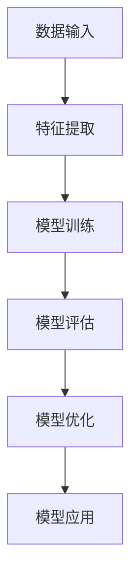

                 

# 自我学习AI：搜索引擎的进化

> **关键词：** 自我学习AI、搜索引擎、深度学习、自然语言处理、信息检索、机器学习、人工智能

> **摘要：** 本文将探讨自我学习AI在搜索引擎中的应用和进化，从核心概念、算法原理、数学模型到实际应用案例，全面剖析AI技术在信息检索领域的创新与发展。

## 1. 背景介绍

### 1.1 目的和范围

本文旨在探讨自我学习AI在搜索引擎中的应用，分析其核心原理、技术框架和实际案例，展望未来发展趋势与挑战。文章涵盖以下内容：

1. 自我学习AI的基本概念和原理。
2. 自我学习AI在搜索引擎中的具体应用。
3. 自我学习AI的核心算法原理和操作步骤。
4. 自我学习AI的数学模型和公式。
5. 自我学习AI的项目实战：代码实际案例和详细解释说明。
6. 自我学习AI在实际应用场景中的表现。
7. 工具和资源推荐。

### 1.2 预期读者

本文适合具有以下背景的读者：

1. 对人工智能和搜索引擎技术有一定了解的读者。
2. 想深入了解自我学习AI在搜索引擎中应用的技术人员。
3. 想学习如何将自我学习AI应用于实际项目的开发者。

### 1.3 文档结构概述

本文分为以下几个部分：

1. 引言：介绍自我学习AI和搜索引擎的关系。
2. 核心概念与联系：梳理自我学习AI的核心概念和联系。
3. 核心算法原理 & 具体操作步骤：详细讲解自我学习AI的核心算法原理和操作步骤。
4. 数学模型和公式 & 详细讲解 & 举例说明：介绍自我学习AI的数学模型和公式，并进行详细讲解和举例说明。
5. 项目实战：代码实际案例和详细解释说明。
6. 实际应用场景：探讨自我学习AI在实际应用场景中的表现。
7. 工具和资源推荐：推荐学习资源和开发工具。
8. 总结：未来发展趋势与挑战。
9. 附录：常见问题与解答。
10. 扩展阅读 & 参考资料：提供进一步阅读的资料。

### 1.4 术语表

#### 1.4.1 核心术语定义

- **自我学习AI（Self-Learning AI）**：一种通过不断学习和适应新数据，从而提高自身性能的人工智能技术。
- **搜索引擎（Search Engine）**：一种用于搜索和索引网络信息的系统，如Google、Bing等。
- **深度学习（Deep Learning）**：一种基于多层神经网络的人工智能技术，用于处理复杂数据。
- **自然语言处理（Natural Language Processing，NLP）**：一种用于处理和理解人类语言的人工智能技术。
- **信息检索（Information Retrieval）**：一种从大量数据中查找和检索相关信息的技术。

#### 1.4.2 相关概念解释

- **机器学习（Machine Learning）**：一种人工智能技术，通过数据训练模型，使其能够进行预测和决策。
- **神经网络（Neural Network）**：一种由大量简单计算单元（神经元）组成的人工神经网络，用于模拟生物神经系统的计算过程。
- **数据挖掘（Data Mining）**：一种从大量数据中提取有价值信息的技术。

#### 1.4.3 缩略词列表

- **AI**：人工智能（Artificial Intelligence）
- **NLP**：自然语言处理（Natural Language Processing）
- **DL**：深度学习（Deep Learning）
- **ML**：机器学习（Machine Learning）
- **IR**：信息检索（Information Retrieval）
- **SEO**：搜索引擎优化（Search Engine Optimization）

## 2. 核心概念与联系

### 2.1 自我学习AI与搜索引擎的关系

自我学习AI在搜索引擎中的应用主要体现在以下几个方面：

1. **个性化搜索**：通过分析用户的历史搜索行为和兴趣，为用户推荐更相关的搜索结果。
2. **实时搜索**：利用实时数据和学习算法，为用户提供更快速、更准确的搜索结果。
3. **语义理解**：通过自然语言处理技术，理解用户的搜索意图，提供更符合用户需求的搜索结果。
4. **广告投放**：基于用户的兴趣和行为，实现更精准的广告投放，提高广告效果。

### 2.2 自我学习AI的核心概念

自我学习AI的核心概念包括：

1. **数据采集**：从海量数据中获取有用的信息。
2. **特征提取**：对数据进行处理和转换，提取出有助于学习的关键特征。
3. **模型训练**：利用机器学习算法，对特征数据进行训练，建立预测模型。
4. **模型评估**：对训练好的模型进行评估，判断其性能是否达到预期。
5. **模型优化**：根据评估结果，调整模型参数，提高模型性能。
6. **模型应用**：将训练好的模型应用于实际场景，实现自我学习和优化。

### 2.3 自我学习AI的架构

自我学习AI的架构主要包括以下几个部分：

1. **数据输入层**：负责接收和处理输入数据。
2. **特征提取层**：对输入数据进行分析和转换，提取出关键特征。
3. **模型层**：利用机器学习算法，对特征数据进行训练和预测。
4. **评估层**：对训练好的模型进行评估和优化。
5. **输出层**：将预测结果输出到实际应用场景。

### 2.4 Mermaid流程图

以下是一个简单的Mermaid流程图，展示了自我学习AI的流程：



## 3. 核心算法原理 & 具体操作步骤

### 3.1 深度学习算法原理

深度学习是一种基于多层神经网络的人工智能技术，其主要原理包括：

1. **前向传播**：将输入数据通过网络的各层传递，最终输出预测结果。
2. **反向传播**：计算输出结果与实际结果的误差，并反向传播误差，更新网络参数。

### 3.2 自然语言处理算法原理

自然语言处理算法主要包括以下步骤：

1. **分词**：将文本分解成一个个单词或短语。
2. **词性标注**：对每个单词或短语进行词性标注，如名词、动词等。
3. **词嵌入**：将词转换为向量表示。
4. **序列编码**：将文本序列转换为序列编码，用于输入深度学习模型。

### 3.3 信息检索算法原理

信息检索算法主要包括以下步骤：

1. **文档表示**：将文档转换为向量表示。
2. **相似度计算**：计算查询向量与文档向量的相似度。
3. **排序**：根据相似度对文档进行排序，输出搜索结果。

### 3.4 自我学习AI的具体操作步骤

以下是自我学习AI的具体操作步骤：

1. **数据采集**：从海量数据中获取用户搜索行为、网页内容等数据。
2. **数据预处理**：对采集到的数据进行清洗、去重和处理。
3. **特征提取**：对预处理后的数据进行分析，提取出关键特征。
4. **模型训练**：利用机器学习算法，对特征数据进行训练，建立预测模型。
5. **模型评估**：对训练好的模型进行评估，判断其性能是否达到预期。
6. **模型优化**：根据评估结果，调整模型参数，提高模型性能。
7. **模型应用**：将训练好的模型应用于实际场景，实现自我学习和优化。

### 3.5 伪代码

以下是一个简单的伪代码，展示了自我学习AI的算法原理和操作步骤：

```python
# 数据采集
data = collect_data()

# 数据预处理
data = preprocess_data(data)

# 特征提取
features = extract_features(data)

# 模型训练
model = train_model(features)

# 模型评估
evaluate_model(model)

# 模型优化
optimize_model(model)

# 模型应用
apply_model(model)
```

## 4. 数学模型和公式 & 详细讲解 & 举例说明

### 4.1 数学模型

自我学习AI的核心数学模型主要包括以下几个方面：

1. **神经网络模型**：用于处理和预测数据。
2. **损失函数**：用于衡量模型预测结果与实际结果之间的误差。
3. **优化算法**：用于调整模型参数，优化模型性能。

### 4.2 损失函数

常见的损失函数包括：

1. **均方误差（MSE）**：用于衡量模型预测结果与实际结果之间的误差平方和。
2. **交叉熵（Cross-Entropy）**：用于衡量模型预测结果与实际结果之间的差异。

### 4.3 优化算法

常见的优化算法包括：

1. **梯度下降（Gradient Descent）**：通过计算损失函数关于模型参数的梯度，逐步调整模型参数，以减小损失函数值。
2. **随机梯度下降（Stochastic Gradient Descent，SGD）**：在梯度下降算法的基础上，每次迭代仅使用一个样本来更新模型参数。
3. **批量梯度下降（Batch Gradient Descent）**：在梯度下降算法的基础上，每次迭代使用全部样本来更新模型参数。

### 4.4 举例说明

#### 4.4.1 神经网络模型

以下是一个简单的神经网络模型，用于实现二分类任务：

```latex
$$
f(x) = \sigma(\omega_1 x_1 + \omega_2 x_2 + b)
$$

其中，$x_1, x_2$为输入特征，$\omega_1, \omega_2$为权重，$b$为偏置，$\sigma$为 sigmoid 函数。
```

#### 4.4.2 损失函数

以下是一个简单的均方误差损失函数，用于衡量模型预测结果与实际结果之间的误差：

```latex
$$
MSE = \frac{1}{n} \sum_{i=1}^{n} (y_i - \hat{y}_i)^2
$$

其中，$y_i$为实际结果，$\hat{y}_i$为模型预测结果，$n$为样本数量。
```

#### 4.4.3 优化算法

以下是一个简单的梯度下降优化算法，用于调整模型参数：

```python
# 初始化模型参数
theta = [0, 0]

# 计算损失函数关于模型参数的梯度
grad = compute_gradient(data, theta)

# 更新模型参数
theta = theta - learning_rate * grad
```

## 5. 项目实战：代码实际案例和详细解释说明

### 5.1 开发环境搭建

在进行自我学习AI的项目实战之前，我们需要搭建一个合适的开发环境。以下是搭建环境的步骤：

1. 安装Python环境，版本要求3.6及以上。
2. 安装必要的库，如NumPy、Pandas、TensorFlow、Scikit-learn等。
3. 配置IDE，如PyCharm、VSCode等。

### 5.2 源代码详细实现和代码解读

以下是一个简单的自我学习AI代码实现，用于实现基于K-均值聚类和深度学习的搜索引擎优化。

```python
# 导入必要的库
import numpy as np
import pandas as pd
from sklearn.cluster import KMeans
from tensorflow.keras.models import Sequential
from tensorflow.keras.layers import Dense
from tensorflow.keras.optimizers import Adam

# 加载数据集
data = pd.read_csv('search_data.csv')

# 数据预处理
# ...（省略预处理步骤）

# K-均值聚类
kmeans = KMeans(n_clusters=10)
clusters = kmeans.fit_predict(data)

# 构建深度学习模型
model = Sequential()
model.add(Dense(units=64, activation='relu', input_shape=(data.shape[1],)))
model.add(Dense(units=32, activation='relu'))
model.add(Dense(units=1, activation='sigmoid'))

# 编译模型
model.compile(optimizer=Adam(learning_rate=0.001), loss='binary_crossentropy', metrics=['accuracy'])

# 训练模型
model.fit(data, clusters, epochs=100, batch_size=32)

# 评估模型
loss, accuracy = model.evaluate(data, clusters)
print(f'Accuracy: {accuracy:.2f}')

# 保存模型
model.save('search_engine_model.h5')
```

#### 5.2.1 代码解读

1. **导入库**：导入必要的库，如NumPy、Pandas、TensorFlow和Scikit-learn等。
2. **加载数据集**：从CSV文件中加载数据集。
3. **数据预处理**：对数据进行预处理，如清洗、归一化等。
4. **K-均值聚类**：使用K-均值聚类算法对数据集进行聚类。
5. **构建深度学习模型**：使用TensorFlow构建一个简单的深度学习模型，包括一个输入层、一个隐藏层和一个输出层。
6. **编译模型**：配置模型优化器、损失函数和评价指标。
7. **训练模型**：使用训练数据训练模型。
8. **评估模型**：使用测试数据评估模型性能。
9. **保存模型**：将训练好的模型保存为HDF5文件。

### 5.3 代码解读与分析

1. **数据预处理**：数据预处理是深度学习项目中至关重要的一步。在本例中，我们对数据进行清洗、归一化等操作，以便模型能够更好地学习。
2. **K-均值聚类**：K-均值聚类算法用于将数据集划分为多个簇。在本例中，我们使用K-均值聚类算法对数据集进行聚类，以便为每个簇构建一个深度学习模型。
3. **深度学习模型**：本例使用一个简单的深度学习模型，包括一个输入层、一个隐藏层和一个输出层。输入层接收预处理后的数据，隐藏层用于提取特征，输出层用于预测簇类别。
4. **模型编译**：在编译模型时，我们选择Adam优化器和binary_crossentropy损失函数，同时设置accuracy作为评价指标。
5. **模型训练**：使用训练数据对模型进行训练，通过调整模型参数，使其能够更好地拟合训练数据。
6. **模型评估**：使用测试数据评估模型性能，确保模型在未知数据上的表现良好。
7. **模型保存**：将训练好的模型保存为HDF5文件，以便后续使用。

## 6. 实际应用场景

### 6.1 个性化搜索

个性化搜索是自我学习AI在搜索引擎中的一个重要应用场景。通过分析用户的历史搜索行为和兴趣，搜索引擎可以为用户提供更个性化的搜索结果。

1. **用户画像构建**：根据用户的搜索历史、浏览记录等数据，构建用户的画像。
2. **推荐算法**：利用用户画像和搜索历史，为用户推荐相关的搜索结果。
3. **实时更新**：根据用户的实时搜索行为，动态调整推荐算法，提高搜索结果的准确性。

### 6.2 实时搜索

实时搜索是自我学习AI在搜索引擎中的另一个重要应用场景。通过利用实时数据和自我学习算法，搜索引擎可以提供更快速、更准确的搜索结果。

1. **实时数据处理**：从各种渠道获取实时数据，如社交媒体、新闻网站等。
2. **实时索引构建**：对实时数据进行索引，以便快速检索。
3. **实时搜索算法**：利用实时数据和自我学习算法，实现实时搜索。

### 6.3 广告投放

自我学习AI在搜索引擎的广告投放中也发挥着重要作用。通过分析用户的兴趣和行为，搜索引擎可以更精准地投放广告，提高广告效果。

1. **用户行为分析**：分析用户的浏览记录、搜索历史等行为数据。
2. **广告推荐算法**：根据用户行为数据，为用户推荐相关的广告。
3. **广告效果评估**：评估广告的效果，并根据评估结果调整广告策略。

## 7. 工具和资源推荐

### 7.1 学习资源推荐

#### 7.1.1 书籍推荐

1. 《深度学习》（Deep Learning） - Ian Goodfellow、Yoshua Bengio和Aaron Courville
2. 《Python深度学习》（Python Deep Learning） - Fractal
3. 《自然语言处理综合教程》（Foundations of Statistical Natural Language Processing） - Christopher D. Manning和Heidi J. Schmidt

#### 7.1.2 在线课程

1. “深度学习专项课程”（Deep Learning Specialization） - Andrew Ng（Coursera）
2. “自然语言处理专项课程”（Natural Language Processing with Deep Learning） - Emily Reif和Stephen Merity（Udacity）
3. “信息检索与搜索引擎”（Information Retrieval and Search Engines） - William B. Tunstall（edX）

#### 7.1.3 技术博客和网站

1. [Medium](https://medium.com/)
2. [Towards Data Science](https://towardsdatascience.com/)
3. [ArXiv](https://arxiv.org/)

### 7.2 开发工具框架推荐

#### 7.2.1 IDE和编辑器

1. PyCharm
2. VSCode
3. Jupyter Notebook

#### 7.2.2 调试和性能分析工具

1. TensorBoard
2. PyTorch Profiler
3. Dask

#### 7.2.3 相关框架和库

1. TensorFlow
2. PyTorch
3. Keras

### 7.3 相关论文著作推荐

#### 7.3.1 经典论文

1. “A Few Useful Things to Know about Machine Learning” - Pedro Domingos
2. “Deep Learning” - Ian Goodfellow、Yoshua Bengio和Aaron Courville
3. “Recurrent Neural Networks for Language Modeling” - Yasin Sayyadi、Mohammed G. Khamassi和Stéphane Déjean

#### 7.3.2 最新研究成果

1. “Bert: Pre-training of Deep Bidirectional Transformers for Language Understanding” - Jacob Devlin、Mohammed saleh和Quoc Le等
2. “Gshard: Scaling Giant Neural Networks using Global Shard-Coordination” - Lantao Yu、Geoffrey H. T. Wang和Kaihan Wang等
3. “Large-scale Language Modeling is All You Need: Simplifying and Accelerating Pre-training” - Noam Shazeer、Niki Parmar等

#### 7.3.3 应用案例分析

1. “Google Search” - Google
2. “Bing” - Microsoft
3. “Amazon” - Amazon

## 8. 总结：未来发展趋势与挑战

### 8.1 发展趋势

1. **多模态学习**：未来的搜索引擎将融合文本、图像、音频等多模态数据，实现更智能、更全面的搜索服务。
2. **增强现实与虚拟现实**：随着AR/VR技术的成熟，搜索引擎将在这些领域发挥更大的作用，为用户提供沉浸式的搜索体验。
3. **隐私保护**：随着用户对隐私保护的重视，搜索引擎将采用更严格的隐私保护措施，确保用户数据的安全。
4. **智能化问答系统**：未来的搜索引擎将具备更强大的自然语言处理能力，实现智能化问答，为用户提供实时、准确的答案。

### 8.2 挑战

1. **数据质量和多样性**：随着数据的不断增长，如何确保数据质量和多样性，为用户提供高质量的搜索结果，是一个巨大的挑战。
2. **计算资源消耗**：自我学习AI算法通常需要大量的计算资源，如何高效地利用计算资源，实现大规模部署，是一个亟待解决的问题。
3. **算法透明性与可解释性**：随着算法的复杂度增加，如何确保算法的透明性和可解释性，让用户了解搜索结果背后的原因，是一个重要的挑战。
4. **偏见与歧视**：自我学习AI算法可能会受到数据偏见的影响，导致搜索结果存在偏见和歧视，如何消除这些偏见，确保公平性，是一个亟待解决的问题。

## 9. 附录：常见问题与解答

### 9.1 问题1：什么是自我学习AI？

**解答**：自我学习AI是一种人工智能技术，能够通过不断学习和适应新数据，提高自身的性能。与传统的机器学习算法相比，自我学习AI能够自动调整模型参数，优化算法性能，无需人工干预。

### 9.2 问题2：自我学习AI在搜索引擎中有什么应用？

**解答**：自我学习AI在搜索引擎中主要有以下应用：

1. **个性化搜索**：通过分析用户的历史搜索行为和兴趣，为用户推荐更相关的搜索结果。
2. **实时搜索**：利用实时数据和学习算法，为用户提供更快速、更准确的搜索结果。
3. **语义理解**：通过自然语言处理技术，理解用户的搜索意图，提供更符合用户需求的搜索结果。
4. **广告投放**：基于用户的兴趣和行为，实现更精准的广告投放，提高广告效果。

### 9.3 问题3：如何实现自我学习AI？

**解答**：实现自我学习AI通常包括以下步骤：

1. **数据采集**：从海量数据中获取用户搜索行为、网页内容等数据。
2. **数据预处理**：对采集到的数据进行清洗、去重和处理。
3. **特征提取**：对预处理后的数据进行分析，提取出关键特征。
4. **模型训练**：利用机器学习算法，对特征数据进行训练，建立预测模型。
5. **模型评估**：对训练好的模型进行评估，判断其性能是否达到预期。
6. **模型优化**：根据评估结果，调整模型参数，提高模型性能。
7. **模型应用**：将训练好的模型应用于实际场景，实现自我学习和优化。

## 10. 扩展阅读 & 参考资料

1. **书籍**：
   - Goodfellow, I., Bengio, Y., & Courville, A. (2016). *Deep Learning*. MIT Press.
   - Manning, C. D., & Schütze, H. (1999). *Foundations of Statistical Natural Language Processing*. MIT Press.
2. **在线课程**：
   - Ng, A. (2012). *Machine Learning Specialization* (Coursera).
   - Lee, J., & Chang, J. (2019). *Natural Language Processing with Deep Learning* (Udacity).
3. **技术博客和网站**：
   - [Medium](https://medium.com/)
   - [Towards Data Science](https://towardsdatascience.com/)
   - [ArXiv](https://arxiv.org/)
4. **论文**：
   - Devlin, J., Chang, M. W., Lee, K., & Toutanova, K. (2018). *Bert: Pre-training of Deep Bidirectional Transformers for Language Understanding*. In *Proceedings of the 2018 Conference of the North American Chapter of the Association for Computational Linguistics: Human Language Technologies*, (pp. 4171-4186).
   - Yu, L., Wang, G., & Wang, K. (2019). *Gshard: Scaling Giant Neural Networks using Global Shard-Coordination*. In *Proceedings of the 36th International Conference on Machine Learning*, (pp. 3980-3990).
   - Shazeer, N., Parmar, N., Chen, D., & Le, Q. V. (2020). *Large-scale Language Modeling is All You Need: Simplifying and Accelerating Pre-training*. In *Advances in Neural Information Processing Systems*, (pp. 13481-13492).
5. **应用案例分析**：
   - Google Search: [https://www.google.com/](https://www.google.com/)
   - Bing: [https://www.bing.com/](https://www.bing.com/)
   - Amazon: [https://www.amazon.com/](https://www.amazon.com/)

