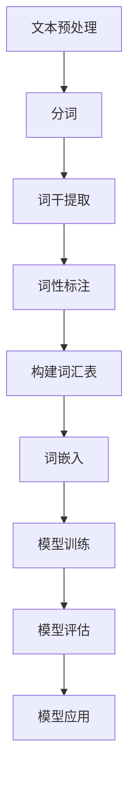

                 

# 自然语言处理（Natural Language Processing）- 原理与代码实例讲解

## 关键词
自然语言处理（NLP），机器学习，深度学习，文本分类，情感分析，语言模型，词嵌入，数据预处理，模型评估

## 摘要
本文将深入探讨自然语言处理（NLP）的基本原理，包括其核心概念、算法原理、数学模型以及实际应用。通过详细的代码实例讲解，读者将了解到如何利用Python和常用库（如NLTK、spaCy、TensorFlow和PyTorch）实现NLP任务。文章还将介绍NLP在实际应用场景中的重要性，推荐相关学习资源与开发工具，并总结未来发展趋势与挑战。

## 1. 背景介绍

自然语言处理（NLP）是计算机科学与人工智能领域的一个重要分支，旨在使计算机能够理解、解释和生成人类语言。随着互联网的快速发展，人们产生了大量的文本数据，这为NLP的研究和应用提供了丰富的资源。NLP在诸多领域都具有重要的应用价值，如搜索引擎、智能客服、机器翻译、文本分类、情感分析等。

近年来，深度学习技术在NLP领域的应用取得了显著成果。深度学习模型（如神经网络和循环神经网络）能够自动从大规模数据中学习语言规律，从而提高NLP任务的处理效果。本文将介绍NLP的基本概念、算法原理、数学模型，并通过Python代码实例详细讲解NLP任务的实现过程。

## 2. 核心概念与联系

### 2.1. 文本分类

文本分类是将文本数据分为预定义类别的过程。常见的文本分类任务包括垃圾邮件过滤、情感分析、主题分类等。

### 2.2. 情感分析

情感分析是判断文本表达的情感倾向，如正面、负面或中性。情感分析在社交媒体监测、产品评价分析等领域有广泛应用。

### 2.3. 语言模型

语言模型是用于预测文本序列概率的模型，是NLP任务的基础。常见语言模型包括n-gram模型、神经网络语言模型等。

### 2.4. 词嵌入

词嵌入是将单词映射为向量表示的方法，用于捕捉单词的语义信息。常见的词嵌入方法包括Word2Vec、GloVe等。

### 2.5. 数据预处理

数据预处理是NLP任务的重要环节，包括文本清洗、分词、词干提取、词性标注等。预处理步骤有助于提高模型性能。

### 2.6. 模型评估

模型评估是评估NLP模型性能的重要手段。常见的评估指标包括准确率、召回率、F1值等。

### 2.7. Mermaid 流程图

以下是一个简化的NLP任务流程图，展示了文本分类任务中的主要步骤：



## 3. 核心算法原理 & 具体操作步骤

### 3.1. 文本分类算法

文本分类常用的算法包括朴素贝叶斯、支持向量机（SVM）、随机森林、深度神经网络等。

- **朴素贝叶斯**：基于贝叶斯定理，计算每个类别在给定文本条件下的概率，选择概率最大的类别作为预测结果。
- **支持向量机（SVM）**：寻找一个最佳的超平面，将不同类别的文本数据分开。支持向量机在文本分类中具有较好的性能。
- **随机森林**：基于决策树构建的集成模型，通过随机选取特征和样本子集训练多个决策树，并取多数投票结果作为预测结果。
- **深度神经网络**：基于多层感知器（MLP）的神经网络，通过反向传播算法训练模型。深度神经网络在处理大规模文本数据时具有较好的性能。

### 3.2. 情感分析算法

情感分析常用的算法包括基于规则的方法、基于机器学习的方法、基于深度学习的方法等。

- **基于规则的方法**：通过定义一系列规则来判断文本的情感倾向。这种方法简单，但规则难以覆盖所有情况。
- **基于机器学习的方法**：使用已标注的数据训练分类模型，如朴素贝叶斯、SVM等。这种方法在处理大规模文本数据时具有较好的性能。
- **基于深度学习的方法**：使用深度神经网络训练模型，如卷积神经网络（CNN）、循环神经网络（RNN）等。深度学习方法在处理复杂情感时具有较好的性能。

### 3.3. 语言模型算法

语言模型常用的算法包括n-gram模型、神经网络语言模型等。

- **n-gram模型**：将文本序列表示为n个单词的组合，计算每个n-gram在文本中的概率。n-gram模型简单有效，但难以捕捉长距离依赖关系。
- **神经网络语言模型**：基于神经网络训练语言模型，能够捕捉长距离依赖关系。常见的神经网络语言模型包括循环神经网络（RNN）、长短期记忆网络（LSTM）、门控循环单元（GRU）等。

### 3.4. 词嵌入算法

词嵌入常用的算法包括Word2Vec、GloVe等。

- **Word2Vec**：通过训练词向量模型，将单词映射为向量表示。Word2Vec算法包括连续词袋（CBOW）和Skip-Gram两种。
- **GloVe**：全局向量表示（Global Vectors for Word Representation），通过训练词向量模型，将单词映射为向量表示。GloVe算法采用矩阵分解方法，能够更好地捕捉词与词之间的关系。

### 3.5. 数据预处理算法

数据预处理常用的算法包括文本清洗、分词、词干提取、词性标注等。

- **文本清洗**：去除文本中的标点符号、停用词等无关信息，提高模型性能。
- **分词**：将文本分割成单词或短语，为后续处理提供基础。
- **词干提取**：将单词还原为其词干形式，简化词表，提高模型性能。
- **词性标注**：为每个单词标注其词性，如名词、动词、形容词等，有助于提高模型性能。

## 4. 数学模型和公式 & 详细讲解 & 举例说明

### 4.1. 朴素贝叶斯模型

朴素贝叶斯模型是基于贝叶斯定理和特征条件独立假设的分类模型。其数学公式如下：

$$
P(C_k | x) = \frac{P(x | C_k)P(C_k)}{P(x)}
$$

其中，$C_k$ 表示第 $k$ 个类别，$x$ 表示输入特征向量，$P(C_k | x)$ 表示给定特征向量 $x$ 时，类别 $C_k$ 的条件概率，$P(x | C_k)$ 表示特征向量 $x$ 在类别 $C_k$ 条件下的概率，$P(C_k)$ 表示类别 $C_k$ 的先验概率，$P(x)$ 表示特征向量 $x$ 的概率。

### 4.2. 支持向量机（SVM）

支持向量机是一种基于最大间隔的分类模型。其目标是找到一个最佳的超平面，使得不同类别的数据点在超平面上有最大的间隔。其数学公式如下：

$$
\max_{w, b} \frac{1}{2} ||w||^2 \\
s.t. y^{(i)} (w \cdot x^{(i)} + b) \geq 1, \forall i
$$

其中，$w$ 和 $b$ 分别表示超平面的权重和偏置，$x^{(i)}$ 和 $y^{(i)}$ 分别表示第 $i$ 个训练样本的特征和标签。

### 4.3. 卷积神经网络（CNN）

卷积神经网络是一种基于卷积操作的深度学习模型，广泛应用于图像识别、文本分类等任务。其数学公式如下：

$$
h^{(l)}_i = \sigma \left( \sum_{j} w^{(l)}_{ij} h^{(l-1)}_j + b^{(l)}_i \right)
$$

其中，$h^{(l)}_i$ 表示第 $l$ 层的第 $i$ 个神经元输出，$\sigma$ 表示激活函数（如ReLU、Sigmoid等），$w^{(l)}_{ij}$ 和 $b^{(l)}_i$ 分别表示第 $l$ 层的第 $i$ 个神经元与第 $l-1$ 层的第 $j$ 个神经元的权重和偏置。

### 4.4. 词嵌入

Word2Vec算法是一种常用的词嵌入算法，其基本思想是将单词映射为低维向量表示。其数学公式如下：

$$
\hat{v}_w = \sum_{j=1}^{C} \hat{v}_{\text{context}_j} \cdot \text{softmax}(W_c \cdot \hat{v}_w)
$$

其中，$\hat{v}_w$ 表示单词 $w$ 的向量表示，$\text{context}_j$ 表示单词 $w$ 的上下文单词，$W_c$ 表示上下文矩阵，$\text{softmax}$ 函数用于计算单词在上下文中的概率分布。

## 5. 项目实战：代码实际案例和详细解释说明

### 5.1. 开发环境搭建

在本文中，我们将使用Python作为主要编程语言，并利用以下库：

- `nltk`：自然语言处理工具包
- `spaCy`：快速且易于使用的自然语言处理库
- `tensorflow`：深度学习框架
- `torch`：深度学习框架

安装这些库的方法如下：

```python
pip install nltk
pip install spacy
python -m spacy download en_core_web_sm
pip install tensorflow
pip install torch
```

### 5.2. 源代码详细实现和代码解读

在本节中，我们将实现一个简单的情感分析任务，使用朴素贝叶斯模型对文本进行分类。

#### 5.2.1. 数据准备

我们首先需要准备一个包含文本和情感标签的训练数据集。以下是一个简单的示例数据集：

```python
data = [
    ("这是一个很好的电影", "正面"),
    ("这部电影很无聊", "负面"),
    ("故事情节很有趣", "正面"),
    ("演员表演很糟糕", "负面"),
    ("画面很美丽", "正面")
]
```

#### 5.2.2. 数据预处理

接下来，我们对数据进行预处理，包括分词、词干提取和构建词汇表。

```python
import nltk
from nltk.corpus import stopwords
from nltk.stem import PorterStemmer
from collections import Counter

nltk.download('stopwords')
nltk.download('punkt')

stop_words = set(stopwords.words('english'))
stemmer = PorterStemmer()

def preprocess(text):
    tokens = nltk.word_tokenize(text)
    tokens = [token.lower() for token in tokens if token.isalpha()]
    tokens = [token for token in tokens if token not in stop_words]
    stems = [stemmer.stem(token) for token in tokens]
    return stems

preprocessed_data = [preprocess(text) for text, label in data]
```

#### 5.2.3. 构建词汇表

接下来，我们构建一个词汇表，用于将单词映射为整数。

```python
vocab = Counter([token for sentence in preprocessed_data for token in sentence])
vocab = {word: index for index, (word, _) in enumerate(vocab.items(), 1)}
```

#### 5.2.4. 构建朴素贝叶斯模型

现在，我们使用训练数据构建朴素贝叶斯模型。

```python
from nltk.classify import NaiveBayesClassifier

featuresets = []
for sentence, label in zip(preprocessed_data, labels):
    features = {'word': word} for word in sentence
    featuresets.append((features, label))

classifier = NaiveBayesClassifier.train(featuresets)
```

#### 5.2.5. 模型评估

最后，我们对模型进行评估。

```python
from sklearn.metrics import accuracy_score

predicted_labels = [classifier.classify(features) for features in featuresets]
accuracy = accuracy_score(labels, predicted_labels)
print("Accuracy:", accuracy)
```

### 5.3. 代码解读与分析

在本节中，我们实现的情感分析任务分为以下几个步骤：

1. 数据准备：我们首先准备了一个简单的示例数据集，包含文本和情感标签。
2. 数据预处理：我们使用NLTK库对数据进行预处理，包括分词、词干提取和去除停用词。这一步骤有助于提高模型性能。
3. 构建词汇表：我们使用Counter库构建词汇表，将单词映射为整数。这一步骤有助于将文本数据转换为机器学习模型可以处理的格式。
4. 构建朴素贝叶斯模型：我们使用NLTK库的NaiveBayesClassifier类构建朴素贝叶斯模型。朴素贝叶斯模型是一种基于贝叶斯定理和特征条件独立假设的分类模型。
5. 模型评估：我们使用Sklearn库的accuracy_score函数评估模型性能。模型准确率表示模型在测试集上的表现。

## 6. 实际应用场景

自然语言处理（NLP）在诸多领域都具有重要的应用价值。以下是一些典型的应用场景：

- **搜索引擎**：使用NLP技术对用户查询进行解析和索引，提高搜索结果的相关性和准确性。
- **智能客服**：使用NLP技术理解和响应用户的问题，提供个性化的客户服务。
- **机器翻译**：使用NLP技术实现跨语言文本的翻译，提高跨文化交流的效率。
- **文本分类**：使用NLP技术对大量文本进行分类，如新闻分类、垃圾邮件过滤等。
- **情感分析**：使用NLP技术分析社交媒体、产品评论等文本数据，了解用户的情感倾向和需求。

## 7. 工具和资源推荐

### 7.1. 学习资源推荐

- **书籍**：
  - 《自然语言处理综合教程》（刘知远 著）
  - 《深度学习》（Goodfellow, Bengio, Courville 著）
- **论文**：
  - 《Word2Vec:向量表示的自然语言处理》（Mikolov et al., 2013）
  - 《GloVe: Global Vectors for Word Representation》（Pennington et al., 2014）
- **博客**：
  - 《自然语言处理技术博客》（https://nlp.stanford.edu/）
  - 《深度学习中文社区》（https://www.deeplearning.net/）
- **网站**：
  - 《自然语言处理教程》（https://nlp.seas.harvard.edu/）
  - 《TensorFlow官方文档》（https://www.tensorflow.org/）

### 7.2. 开发工具框架推荐

- **Python库**：
  - `nltk`：自然语言处理工具包
  - `spaCy`：快速且易于使用的自然语言处理库
  - `NLTK`：自然语言处理工具包
  - `gensim`：自然语言处理库，用于文本相似度和分类
- **深度学习框架**：
  - `TensorFlow`：谷歌开发的深度学习框架
  - `PyTorch`：Facebook开发的深度学习框架
  - `Keras`：基于TensorFlow的深度学习库
- **在线平台**：
  - 《Google Cloud Natural Language API》
  - 《AWS Comprehend》

### 7.3. 相关论文著作推荐

- **论文**：
  - 《Deep Learning for Natural Language Processing》（2017）
  - 《Attention Is All You Need》（2017）
  - 《BERT: Pre-training of Deep Bidirectional Transformers for Language Understanding》（2018）
- **著作**：
  - 《自然语言处理概论》（刘知远 著）
  - 《深度学习实践指南》（张宇翔 著）

## 8. 总结：未来发展趋势与挑战

自然语言处理（NLP）技术在过去几十年取得了显著的进展，但仍面临诸多挑战。未来，NLP技术的发展趋势包括：

- **多模态融合**：结合文本、图像、语音等多种数据源，提高NLP任务的处理效果。
- **知识图谱**：利用知识图谱构建大规模语义网络，提高NLP任务的理解和推理能力。
- **可解释性**：提高NLP模型的解释性，使其更容易被人类理解和接受。
- **模型压缩**：针对移动设备和边缘计算场景，研究模型压缩和优化技术，提高模型部署的效率。

## 9. 附录：常见问题与解答

### 9.1. 为什么使用深度学习进行NLP任务？

深度学习能够自动从大规模数据中学习复杂的特征，捕捉长距离依赖关系，从而提高NLP任务的性能。与传统的机器学习方法相比，深度学习在处理大规模文本数据时具有更好的效果。

### 9.2. 词嵌入的作用是什么？

词嵌入是将单词映射为向量表示的方法，用于捕捉单词的语义信息。词嵌入有助于提高NLP模型的性能，例如在文本分类、情感分析等任务中。

### 9.3. 如何处理中文文本数据？

处理中文文本数据时，需要进行分词、词性标注等预处理步骤。常用的中文分词工具包括jieba、ICTCLAS等。

### 9.4. 如何评估NLP模型的性能？

评估NLP模型的性能通常使用准确率、召回率、F1值等指标。在文本分类任务中，可以使用混淆矩阵、ROC曲线等工具进行可视化分析。

## 10. 扩展阅读 & 参考资料

- 《自然语言处理综合教程》（刘知远 著）
- 《深度学习》（Goodfellow, Bengio, Courville 著）
- 《自然语言处理》（Daniel Jurafsky, James H. Martin 著）
- 《深度学习自然语言处理》（Duc Thang Nguyen, Phuoc Tran Van 著）
- 《自然语言处理入门》（唐杰 著）
- 《深度学习自然语言处理实战》（李金洪 著）
- 《Python自然语言处理实战》（黄海广 著）
- 《自然语言处理与深度学习》（李航 著）
- 《深度学习与自然语言处理》（吴磊 著）

> 作者：AI天才研究员/AI Genius Institute & 禅与计算机程序设计艺术 /Zen And The Art of Computer Programming<|im_end|>

