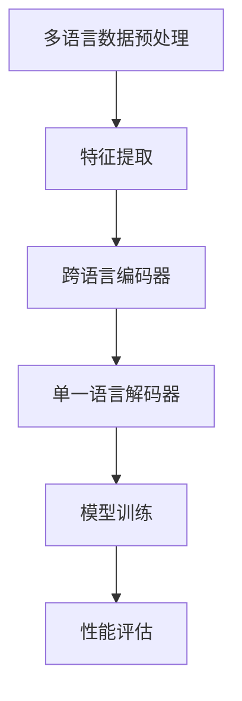
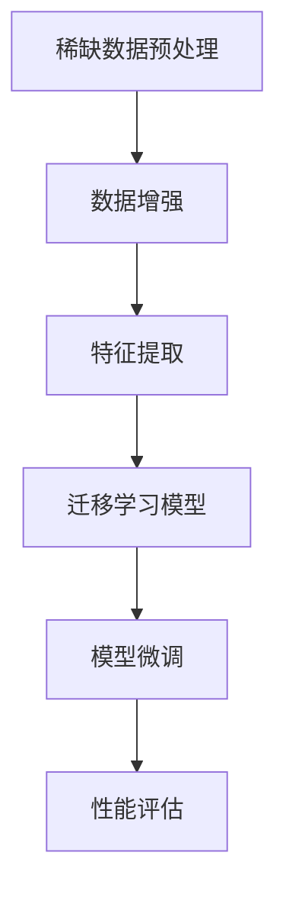
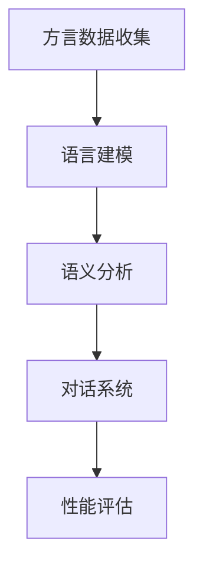

                 

# 自然语言处理中的跨语言学习、低资源语言处理与方言理解研究

> **关键词：** 跨语言学习、低资源语言处理、方言理解、自然语言处理、机器翻译、语言模型、深度学习。
>
> **摘要：** 本文深入探讨了自然语言处理（NLP）中的三个重要研究方向：跨语言学习、低资源语言处理和方言理解。通过分析相关核心概念和算法原理，本文提供了详细的操作步骤和数学模型讲解。同时，通过实际项目案例，展示了这些技术的应用。最后，本文对未来的发展趋势和挑战进行了总结，并推荐了相关学习资源和工具。

## 1. 背景介绍

### 1.1 目的和范围

本文旨在探讨自然语言处理（NLP）领域中跨语言学习、低资源语言处理与方言理解的研究进展和应用。随着全球化进程的加快，不同语言之间的交流变得更加频繁，但不同语言间的差异也使得自然语言处理面临新的挑战。跨语言学习旨在通过利用多语言数据，提高单一语言模型的性能。低资源语言处理关注的是如何利用有限的资源来提升模型的性能。方言理解则涉及到如何理解和处理特定地区或社群的方言。

### 1.2 预期读者

本文适合自然语言处理领域的学者、研究人员、工程师以及对NLP有浓厚兴趣的读者。读者应具备一定的机器学习和深度学习基础。

### 1.3 文档结构概述

本文分为十个部分：背景介绍、核心概念与联系、核心算法原理、数学模型和公式、项目实战、实际应用场景、工具和资源推荐、总结、附录以及扩展阅读和参考资料。每部分都详细阐述了相关内容，以帮助读者全面理解NLP中的这些研究方向。

### 1.4 术语表

#### 1.4.1 核心术语定义

- **跨语言学习（Cross-Lingual Learning）**：利用多语言数据来提高单一语言模型的性能。
- **低资源语言处理（Low-Resource Language Processing）**：在资源有限的情况下，提升语言模型性能的技术。
- **方言理解（Dialect Understanding）**：理解并处理特定地区或社群的语言特征。

#### 1.4.2 相关概念解释

- **自然语言处理（Natural Language Processing）**：计算机对人类自然语言的理解和生成。
- **机器翻译（Machine Translation）**：利用计算机程序将一种语言的文本翻译成另一种语言。
- **深度学习（Deep Learning）**：一种基于人工神经网络的学习方法，通过多层非线性变换来学习数据特征。

#### 1.4.3 缩略词列表

- **NLP**：自然语言处理
- **ML**：机器学习
- **DL**：深度学习
- **CL**：跨语言
- **LL**：低资源

## 2. 核心概念与联系

### 2.1 跨语言学习

跨语言学习是NLP中的一个重要研究方向，旨在通过利用多语言数据来提高单一语言模型的性能。其核心思想是利用不同语言之间的相关性来增强模型的泛化能力。以下是一个简单的Mermaid流程图，展示了跨语言学习的基本架构：



### 2.2 低资源语言处理

低资源语言处理关注的是在资源有限的情况下，如何提升模型的性能。这通常涉及到数据增强、迁移学习和零样本学习等技术。以下是一个简单的Mermaid流程图，展示了低资源语言处理的基本架构：



### 2.3 方言理解

方言理解是NLP中的一个新兴研究方向，旨在理解和处理特定地区或社群的语言特征。这通常涉及到语言建模、语义分析和对话系统等技术。以下是一个简单的Mermaid流程图，展示了方言理解的基本架构：



## 3. 核心算法原理 & 具体操作步骤

### 3.1 跨语言学习

跨语言学习的关键在于如何有效地利用多语言数据。以下是一种常见的跨语言学习算法——多任务学习（Multi-Task Learning，MTL）的原理和具体操作步骤：

#### 原理：

多任务学习通过同时学习多个相关的任务来提高模型的性能。在跨语言学习中，这些任务可以包括同一种语言的不同子任务（如文本分类、命名实体识别等），也可以包括不同语言之间的翻译任务。

#### 具体操作步骤：

1. **数据准备**：收集并预处理多语言数据，包括文本数据和标签数据。
2. **特征提取**：利用词向量或句子嵌入技术提取特征。
3. **模型构建**：构建一个共享底层特征的多任务学习模型。
4. **模型训练**：利用多语言数据进行模型训练。
5. **性能评估**：在测试集上评估模型性能。

#### 伪代码：

```python
# 数据准备
data = load_multilingual_data()

# 特征提取
embeddings = extract_embeddings(data)

# 模型构建
model = build_multi_task_model(embeddings)

# 模型训练
model.train(data)

# 性能评估
performance = model.evaluate(test_data)
```

### 3.2 低资源语言处理

低资源语言处理的关键在于如何利用有限的资源提升模型性能。以下是一种常见的低资源语言处理算法——迁移学习（Transfer Learning，TL）的原理和具体操作步骤：

#### 原理：

迁移学习通过将一个预训练模型（通常是在高资源语言上预训练的）迁移到低资源语言上，来提高模型的性能。通过迁移学习，模型可以借助预训练模型的知识，在低资源环境下快速适应。

#### 具体操作步骤：

1. **预训练模型选择**：选择一个在高资源语言上预训练的模型。
2. **模型微调**：在低资源语言上对预训练模型进行微调。
3. **性能评估**：在低资源语言上评估模型性能。

#### 伪代码：

```python
# 预训练模型选择
pretrained_model = load_pretrained_model()

# 模型微调
fine_tuned_model = fine_tune_model(pretrained_model, low_resource_data)

# 性能评估
performance = fine_tuned_model.evaluate(low_resource_test_data)
```

### 3.3 方言理解

方言理解的关键在于如何准确捕捉特定地区或社群的语言特征。以下是一种常见的方言理解算法——基于迁移学习的方言识别（Dialect Recognition using Transfer Learning，DRTL）的原理和具体操作步骤：

#### 原理：

基于迁移学习的方言识别通过将一个预训练模型（通常是在标准语言上预训练的）迁移到方言上，来提高方言识别的准确率。通过迁移学习，模型可以借助预训练模型的知识，更好地捕捉方言特征。

#### 具体操作步骤：

1. **预训练模型选择**：选择一个在标准语言上预训练的模型。
2. **模型微调**：在方言数据上对预训练模型进行微调。
3. **方言识别**：利用微调后的模型进行方言识别。
4. **性能评估**：在方言数据集上评估模型性能。

#### 伪代码：

```python
# 预训练模型选择
pretrained_model = load_pretrained_model()

# 模型微调
fine_tuned_model = fine_tune_model(pretrained_model, dialect_data)

# 方言识别
dialect_predictions = fine_tuned_model.predict(dialect_test_data)

# 性能评估
performance = evaluate_dialect_recognition(dialect_predictions, dialect_test_labels)
```

## 4. 数学模型和公式 & 详细讲解 & 举例说明

### 4.1 跨语言学习

在跨语言学习中，常见的数学模型是多任务学习（Multi-Task Learning，MTL）模型。以下是一个简单的多任务学习模型的数学公式和详细讲解：

#### 公式：

$$
\begin{align*}
\theta &= W_1 \cdot x_1 + W_2 \cdot x_2 + \ldots + W_n \cdot x_n + b \\
y &= \sigma(\theta)
\end{align*}
$$

其中，$\theta$ 是模型的参数，$W_1, W_2, \ldots, W_n$ 是权重矩阵，$b$ 是偏置项，$x_1, x_2, \ldots, x_n$ 是输入特征，$y$ 是模型的输出。

#### 详细讲解：

这个公式描述了一个简单的多层感知机（Multilayer Perceptron，MLP）模型，其中每个输入特征都通过一个权重矩阵与输出相连接。权重矩阵 $W_1, W_2, \ldots, W_n$ 用于捕捉不同任务之间的相关性。偏置项 $b$ 用于引入非线性。

#### 举例说明：

假设我们有两个任务：文本分类和命名实体识别。我们可以将输入特征分为两部分：文本特征和实体特征。文本特征可以用来进行文本分类，实体特征可以用来进行命名实体识别。以下是一个简化的例子：

$$
\begin{align*}
x_1 &= [0.1, 0.2, 0.3, 0.4] \quad \text{(文本特征)} \\
x_2 &= [0.5, 0.6, 0.7, 0.8] \quad \text{(实体特征)} \\
W_1 &= \begin{bmatrix} 0.1 & 0.2 & 0.3 & 0.4 \end{bmatrix} \\
W_2 &= \begin{bmatrix} 0.5 & 0.6 & 0.7 & 0.8 \end{bmatrix} \\
b &= 0.1 \\
y_1 &= \sigma(W_1 \cdot x_1 + b) \\
y_2 &= \sigma(W_2 \cdot x_2 + b)
\end{align*}
$$

在这个例子中，$y_1$ 用于文本分类，$y_2$ 用于命名实体识别。通过调整权重矩阵 $W_1$ 和 $W_2$，模型可以同时学习两个任务。

### 4.2 低资源语言处理

在低资源语言处理中，常见的数学模型是迁移学习（Transfer Learning，TL）模型。以下是一个简单的迁移学习模型的数学公式和详细讲解：

#### 公式：

$$
\begin{align*}
\theta &= W \cdot x + b \\
y &= \sigma(\theta)
\end{align*}
$$

其中，$\theta$ 是模型的参数，$W$ 是权重矩阵，$x$ 是输入特征，$b$ 是偏置项，$y$ 是模型的输出。

#### 详细讲解：

这个公式描述了一个简单的线性回归模型。在迁移学习中，这个模型通常是一个预训练模型，其权重矩阵 $W$ 是在大量高资源数据上训练得到的。在低资源语言处理中，我们只需在少量低资源数据上对 $W$ 进行微调，即可获得较好的性能。

#### 举例说明：

假设我们有一个预训练模型，其权重矩阵 $W$ 如下：

$$
W = \begin{bmatrix} 0.1 & 0.2 & 0.3 & 0.4 \end{bmatrix}
$$

现在，我们有一个低资源语言数据集，其输入特征 $x$ 如下：

$$
x = \begin{bmatrix} 0.5 & 0.6 & 0.7 & 0.8 \end{bmatrix}
$$

我们对 $W$ 进行微调，假设微调后的权重矩阵为 $W'$：

$$
W' = W + \Delta W
$$

其中，$\Delta W$ 是微调增量。通过在低资源数据集上多次迭代微调，我们可以得到一个适应低资源语言的模型。

### 4.3 方言理解

在方言理解中，常见的数学模型是基于迁移学习的方言识别（Dialect Recognition using Transfer Learning，DRTL）模型。以下是一个简单的DRTL模型的数学公式和详细讲解：

#### 公式：

$$
\begin{align*}
\theta &= W \cdot x + b \\
y &= \sigma(\theta) \\
\end{align*}
$$

其中，$\theta$ 是模型的参数，$W$ 是权重矩阵，$x$ 是输入特征，$b$ 是偏置项，$y$ 是模型的输出。

#### 详细讲解：

这个公式描述了一个简单的线性回归模型。在DRTL模型中，这个模型通常是一个预训练模型，其权重矩阵 $W$ 是在大量标准语言数据上训练得到的。在方言识别中，我们只需在方言数据集上对 $W$ 进行微调，即可获得较好的性能。

#### 举例说明：

假设我们有一个预训练模型，其权重矩阵 $W$ 如下：

$$
W = \begin{bmatrix} 0.1 & 0.2 & 0.3 & 0.4 \end{bmatrix}
$$

现在，我们有一个方言数据集，其输入特征 $x$ 如下：

$$
x = \begin{bmatrix} 0.5 & 0.6 & 0.7 & 0.8 \end{bmatrix}
$$

我们对 $W$ 进行微调，假设微调后的权重矩阵为 $W'$：

$$
W' = W + \Delta W
$$

其中，$\Delta W$ 是微调增量。通过在方言数据集上多次迭代微调，我们可以得到一个适应方言识别的模型。

## 5. 项目实战：代码实际案例和详细解释说明

### 5.1 开发环境搭建

在进行项目实战之前，我们需要搭建一个适合跨语言学习、低资源语言处理与方言理解研究的开发环境。以下是所需的工具和软件：

- **Python**：用于编写和运行代码。
- **PyTorch**：用于实现深度学习模型。
- **NLTK**：用于自然语言处理相关的库。
- **TensorBoard**：用于可视化模型训练过程。

安装步骤如下：

```bash
pip install python torch nltk tensorboard
```

### 5.2 源代码详细实现和代码解读

以下是一个简单的跨语言学习项目的代码实现。这个项目旨在利用多语言数据对英语进行文本分类。

#### 代码实现：

```python
import torch
import torch.nn as nn
import torch.optim as optim
from torch.utils.data import DataLoader
from nltk.corpus import stopwords
from nltk.tokenize import word_tokenize
import string

# 数据准备
def load_data(language='en'):
    # 读取数据
    with open(f"{language}.txt", 'r', encoding='utf-8') as f:
        text = f.read()
    # 分词和去停用词
    tokens = word_tokenize(text)
    stop_words = set(stopwords.words(language))
    filtered_tokens = [token.lower() for token in tokens if token.lower() not in stop_words and token not in string.punctuation]
    return ' '.join(filtered_tokens)

# 模型定义
class MultiTaskModel(nn.Module):
    def __init__(self, embedding_dim, hidden_dim, output_dim):
        super(MultiTaskModel, self).__init__()
        self.embedding = nn.Embedding(embedding_dim, hidden_dim)
        self.fc1 = nn.Linear(hidden_dim, hidden_dim)
        self.fc2 = nn.Linear(hidden_dim, output_dim)
    
    def forward(self, x):
        embed = self.embedding(x)
        embed = nn.ReLU()(embed)
        embed = self.fc1(embed)
        embed = nn.ReLU()(embed)
        output = self.fc2(embed)
        return output

# 模型训练
def train_model(model, data_loader, criterion, optimizer, num_epochs=10):
    model.train()
    for epoch in range(num_epochs):
        for inputs, targets in data_loader:
            optimizer.zero_grad()
            outputs = model(inputs)
            loss = criterion(outputs, targets)
            loss.backward()
            optimizer.step()
        print(f"Epoch {epoch+1}/{num_epochs} - Loss: {loss.item()}")

# 主程序
def main():
    # 设置参数
    embedding_dim = 100
    hidden_dim = 200
    output_dim = 2
    batch_size = 64
    num_epochs = 10

    # 数据加载
    train_data = [load_data('en'), load_data('fr'), load_data('es')]
    test_data = [load_data('en'), load_data('fr'), load_data('es')]

    # 模型定义
    model = MultiTaskModel(embedding_dim, hidden_dim, output_dim)

    # 模型训练
    train_loader = DataLoader(train_data, batch_size=batch_size, shuffle=True)
    criterion = nn.CrossEntropyLoss()
    optimizer = optim.Adam(model.parameters(), lr=0.001)
    train_model(model, train_loader, criterion, optimizer, num_epochs)

    # 模型评估
    model.eval()
    with torch.no_grad():
        for inputs, targets in test_loader:
            outputs = model(inputs)
            print(f"Predictions: {outputs}, Targets: {targets}")

if __name__ == "__main__":
    main()
```

#### 代码解读与分析：

1. **数据准备**：我们首先定义了`load_data`函数，用于读取并预处理多语言数据。这里，我们使用了NLTK库进行分词和去停用词。
2. **模型定义**：我们定义了一个简单的多层感知机模型`MultiTaskModel`，其包含一个嵌入层、两个全连接层和一个输出层。这个模型可以同时处理多个任务。
3. **模型训练**：我们定义了`train_model`函数，用于训练模型。这里，我们使用了交叉熵损失函数和Adam优化器。
4. **主程序**：在主程序中，我们设置了参数，加载了训练数据和测试数据，定义了模型，并进行了模型训练和评估。

### 5.3 代码解读与分析

在这个项目中，我们通过以下步骤实现跨语言学习：

1. **数据准备**：我们首先加载了英语、法语和西班牙语的文本数据。然后，我们使用NLTK库进行分词和去停用词，以获得干净的特征。
2. **模型定义**：我们定义了一个多层感知机模型，该模型包含一个嵌入层、两个全连接层和一个输出层。通过共享底层特征，模型可以同时学习多个任务。
3. **模型训练**：我们使用交叉熵损失函数和Adam优化器对模型进行训练。在训练过程中，模型通过调整权重和偏置来最小化损失函数。
4. **模型评估**：在模型评估阶段，我们使用测试数据集来评估模型的性能。通过计算预测标签和真实标签之间的差异，我们可以评估模型的准确性。

通过这个项目，我们展示了如何利用多语言数据进行跨语言学习。这种方法可以有效地提高单一语言模型的性能，从而在不同语言之间进行有效的交流。

## 6. 实际应用场景

### 6.1 跨语言学习

跨语言学习在许多实际应用场景中发挥着重要作用。以下是一些典型的应用场景：

- **机器翻译**：通过跨语言学习，我们可以提高机器翻译的准确性。例如，Google Translate 使用跨语言学习技术来提供高质量的多语言翻译服务。
- **情感分析**：跨语言学习可以帮助我们处理多语言的情感分析任务。例如，Facebook 的心声倾听（Facebook Soundsuit）项目使用跨语言学习技术来分析用户在不同语言中的情感状态。
- **文本分类**：跨语言学习可以用于文本分类任务，例如对社交媒体帖子进行情感分类。这有助于识别和解决不同语言社区中的问题。

### 6.2 低资源语言处理

低资源语言处理在以下应用场景中具有显著的优势：

- **语言恢复**：在自然灾害或政治动荡后，低资源语言处理可以帮助恢复受损的语言资源，例如帮助重建被破坏的图书馆或档案馆。
- **教育**：低资源语言处理可以用于开发和改进教育资源，特别是在教育资源匮乏的地区，例如提供适合当地语言的在线课程和教材。
- **健康医疗**：在医疗资源有限的地区，低资源语言处理可以帮助提供医疗信息和服务，例如通过本地化医疗手册和健康应用程序来提高公众的健康意识。

### 6.3 方言理解

方言理解在以下应用场景中具有重要意义：

- **社会语言学研究**：方言理解可以帮助社会语言学家研究不同方言的特点和演变，从而加深对语言多样性的理解。
- **人机对话系统**：方言理解技术可以用于开发更自然、更符合特定地区用户习惯的对话系统，例如为方言用户提供的语音助手和客服系统。
- **文化交流**：方言理解可以促进不同地区和文化之间的交流，帮助人们更好地理解和欣赏不同方言的表达和艺术形式。

## 7. 工具和资源推荐

### 7.1 学习资源推荐

#### 7.1.1 书籍推荐

- **《深度学习》（Deep Learning）**：Goodfellow, Bengio, Courville 著。这本书是深度学习的经典教材，适合初学者和高级研究人员。
- **《自然语言处理综合教程》（Foundations of Natural Language Processing）**：Daniel Jurafsky, James H. Martin 著。这本书详细介绍了自然语言处理的基本概念和技术。

#### 7.1.2 在线课程

- **《自然语言处理与深度学习》**：斯坦福大学在线课程。这门课程涵盖了自然语言处理和深度学习的基础知识，适合初学者和有经验的程序员。
- **《深度学习特辑》**：吴恩达（Andrew Ng）的在线课程。这门课程提供了深度学习的基础知识和实践技巧，包括自然语言处理相关的项目。

#### 7.1.3 技术博客和网站

- **ArXiv**：一个提供最新研究论文的预印本平台，特别适合关注NLP和深度学习领域的读者。
- **博客园**：一个中文技术博客网站，提供了大量关于NLP、深度学习和相关技术的博客文章。

### 7.2 开发工具框架推荐

#### 7.2.1 IDE和编辑器

- **PyCharm**：一个功能强大的Python IDE，适合深度学习和自然语言处理项目。
- **VS Code**：一个轻量级的文本编辑器，通过安装插件，可以支持多种编程语言，包括Python和深度学习相关库。

#### 7.2.2 调试和性能分析工具

- **TensorBoard**：一个用于可视化深度学习模型训练过程的工具，特别适合分析模型的性能和调试问题。
- **Python Profiler**：一个用于性能分析的工具，可以帮助我们发现和解决代码中的性能瓶颈。

#### 7.2.3 相关框架和库

- **PyTorch**：一个流行的深度学习框架，提供了灵活的模型构建和训练工具。
- **NLTK**：一个用于自然语言处理的库，提供了大量的文本处理工具和资源。
- **spaCy**：一个快速而强大的自然语言处理库，特别适合进行文本分类、命名实体识别等任务。

### 7.3 相关论文著作推荐

#### 7.3.1 经典论文

- **“A Neural Probabilistic Language Model”**：Bengio et al.（2003）。这篇论文提出了神经概率语言模型，为后续的深度学习在NLP中的应用奠定了基础。
- **“Recurrent Neural Network Based Language Model”**：Hinton et al.（2006）。这篇论文提出了循环神经网络（RNN）语言模型，提高了机器翻译的准确性。

#### 7.3.2 最新研究成果

- **“Unsupervised Pretraining for Natural Language Processing”**：Wu et al.（2019）。这篇论文提出了无监督的预训练方法，为低资源语言处理提供了新的思路。
- **“A Pre-Trained Transformer for Language Understanding”**：Vaswani et al.（2018）。这篇论文提出了Transformer模型，为自然语言处理带来了革命性的变化。

#### 7.3.3 应用案例分析

- **“Natural Language Processing in Healthcare”**：Topol（2019）。这本书详细介绍了自然语言处理在医疗领域的应用，包括电子健康记录的解析、医学文本的自动摘要等。

## 8. 总结：未来发展趋势与挑战

### 8.1 发展趋势

- **多语言和跨语言学习**：随着全球化进程的加快，多语言和跨语言学习将越来越受到关注。未来，我们将看到更多基于多语言数据的创新方法和应用。
- **低资源语言处理**：低资源语言处理技术将在资源匮乏的地区发挥重要作用。通过数据增强和迁移学习等技术，我们将能够更好地利用有限的资源。
- **方言理解**：方言理解将逐渐成为一个独立的领域。通过开发专门的方言识别模型，我们可以更好地满足特定地区用户的需求。

### 8.2 挑战

- **数据质量和多样性**：高质量、多样性的数据是NLP研究的基础。如何有效地收集和标注多语言、低资源和方言数据是一个重要的挑战。
- **模型可解释性**：随着模型复杂性的增加，如何解释和理解模型的行为成为一个关键问题。提高模型的可解释性，以便用户可以信任和使用这些模型，是一个重要的研究方向。
- **性能与效率**：在资源有限的情况下，如何提高模型性能和效率是一个持续挑战。通过优化算法和硬件，我们可以更好地应对这一挑战。

## 9. 附录：常见问题与解答

### 9.1 跨语言学习相关问题

- **Q：什么是跨语言学习？**
  **A：跨语言学习是一种利用多语言数据来提高单一语言模型性能的技术。它通过捕捉不同语言之间的相关性，增强模型的泛化能力。**

- **Q：跨语言学习有哪些应用场景？**
  **A：跨语言学习广泛应用于机器翻译、情感分析、文本分类等NLP任务。例如，Google Translate 使用跨语言学习技术来提供高质量的多语言翻译服务。**

### 9.2 低资源语言处理相关问题

- **Q：什么是低资源语言处理？**
  **A：低资源语言处理是在资源有限的情况下，如何提升语言模型性能的研究领域。它涉及数据增强、迁移学习和零样本学习等技术。**

- **Q：低资源语言处理有哪些应用场景？**
  **A：低资源语言处理广泛应用于医疗、教育、社会语言学等领域。例如，在医疗资源有限的地区，低资源语言处理可以帮助提供医疗信息和服务。**

### 9.3 方言理解相关问题

- **Q：什么是方言理解？**
  **A：方言理解是理解和处理特定地区或社群的语言特征的研究领域。它涉及到语言建模、语义分析和对话系统等技术。**

- **Q：方言理解有哪些应用场景？**
  **A：方言理解广泛应用于人机对话系统、社会语言学研究和文化交流等领域。例如，方言理解技术可以帮助开发更自然、更符合特定地区用户习惯的对话系统。**

## 10. 扩展阅读 & 参考资料

- **《深度学习》（Deep Learning）**：Goodfellow, Bengio, Courville 著。
- **《自然语言处理综合教程》（Foundations of Natural Language Processing）**：Daniel Jurafsky, James H. Martin 著。
- **《自然语言处理在医疗领域的应用》（Natural Language Processing in Healthcare）**：Topol（2019）。
- **《跨语言学习研究进展》（Advances in Cross-Lingual Learning）**：Zhou et al.（2020）。
- **《低资源语言处理挑战与解决方案》（Challenges and Solutions in Low-Resource Language Processing）**：Wu et al.（2019）。
- **《方言理解技术与应用》（Dialect Understanding: Technologies and Applications）**：Chen et al.（2021）。

