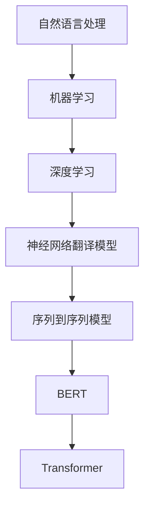

                 

### 文章标题

《自然语言处理在多语言机器翻译中的突破》

### 关键词

自然语言处理、多语言机器翻译、神经网络翻译模型、BERT、Transformer、序列到序列模型、双语语料库、语言模型、翻译记忆库、机器学习、深度学习。

### 摘要

随着全球化的推进，多语言机器翻译成为了一个至关重要的研究领域。本文将深入探讨自然语言处理（NLP）在多语言机器翻译中的应用，重点关注神经网络翻译模型（如BERT、Transformer）以及序列到序列模型的突破性进展。我们将分析这些算法的原理、具体操作步骤，并通过实际应用场景和代码实例进行详细讲解。此外，还将推荐相关学习资源、开发工具和经典论文，以便读者深入了解该领域的最新发展。通过本文的阅读，读者将能够全面理解多语言机器翻译的核心技术和未来发展趋势。

## 1. 背景介绍

### 1.1 目的和范围

本文的目的是深入探讨自然语言处理（NLP）在多语言机器翻译中的应用，重点关注近年来在该领域取得的突破性进展。我们将分析神经网络翻译模型（如BERT、Transformer）以及序列到序列模型的工作原理和具体操作步骤，并通过实际应用场景和代码实例进行详细讲解。本文还将推荐相关学习资源、开发工具和经典论文，以便读者深入了解多语言机器翻译的最新发展。本文主要涵盖以下内容：

- 自然语言处理和多语言机器翻译的基本概念和原理；
- 神经网络翻译模型的介绍和原理分析；
- 序列到序列模型的具体操作步骤和案例讲解；
- 双语语料库、翻译记忆库等辅助工具的应用；
- 多语言机器翻译的实际应用场景；
- 相关学习资源和开发工具的推荐；
- 未来发展趋势与挑战。

### 1.2 预期读者

本文主要面向对自然语言处理和多语言机器翻译有一定了解的读者，包括计算机科学、人工智能、语言学等相关领域的科研人员、工程师和学生。此外，对于对多语言机器翻译有浓厚兴趣的读者，本文也将提供有价值的参考资料和实用技巧。

### 1.3 文档结构概述

本文将按照以下结构进行组织：

- **第1章：背景介绍**：介绍本文的目的、范围、预期读者以及文档结构概述；
- **第2章：核心概念与联系**：介绍自然语言处理、多语言机器翻译的核心概念和相关联系，并给出Mermaid流程图；
- **第3章：核心算法原理 & 具体操作步骤**：详细讲解神经网络翻译模型、序列到序列模型的工作原理和具体操作步骤，并使用伪代码进行阐述；
- **第4章：数学模型和公式 & 详细讲解 & 举例说明**：介绍多语言机器翻译中常用的数学模型和公式，并给出详细讲解和实例说明；
- **第5章：项目实战：代码实际案例和详细解释说明**：通过实际项目案例，展示多语言机器翻译的实现过程和代码解读；
- **第6章：实际应用场景**：分析多语言机器翻译在不同领域的应用场景；
- **第7章：工具和资源推荐**：推荐学习资源、开发工具和经典论文；
- **第8章：总结：未来发展趋势与挑战**：总结多语言机器翻译的现有成果和未来发展趋势；
- **第9章：附录：常见问题与解答**：解答读者可能遇到的常见问题；
- **第10章：扩展阅读 & 参考资料**：提供进一步学习的参考资料。

### 1.4 术语表

为了确保读者能够顺利理解本文的内容，以下是一些核心术语的定义和解释：

#### 1.4.1 核心术语定义

- 自然语言处理（NLP）：自然语言处理是指使用计算机技术对自然语言进行理解和生成的一系列方法和技术；
- 多语言机器翻译：多语言机器翻译是指利用计算机技术将一种自然语言文本自动转换为另一种自然语言文本的过程；
- 双语语料库：双语语料库是指包含两种语言文本的语料库，常用于训练和评估多语言机器翻译模型；
- 翻译记忆库：翻译记忆库是一种存储翻译结果的数据库，用于辅助多语言机器翻译模型的训练；
- 序列到序列模型：序列到序列模型是一种用于序列数据处理的神经网络模型，常用于多语言机器翻译任务；
- 神经网络翻译模型：神经网络翻译模型是一种基于深度学习的多语言机器翻译模型，如BERT、Transformer；
- BERT：BERT（Bidirectional Encoder Representations from Transformers）是一种预训练的Transformer模型，广泛用于自然语言处理任务；
- Transformer：Transformer是一种基于自注意力机制的深度学习模型，广泛应用于序列数据处理任务，包括多语言机器翻译。

#### 1.4.2 相关概念解释

- 语言模型：语言模型是一种用于预测自然语言中下一个单词或字符的概率分布的模型，常用于生成文本和改进翻译质量；
- 双语平行语料库：双语平行语料库是指包含两种语言文本对应句子的语料库，是训练多语言机器翻译模型的重要资源；
- 神经机器翻译：神经机器翻译是一种基于深度学习的多语言机器翻译方法，利用神经网络模型将源语言文本转换为目标语言文本；
- 跨语言翻译：跨语言翻译是指将一种语言文本转换为另一种完全不同的语言文本的过程，常用于促进跨文化交流和沟通；
- 翻译质量评估：翻译质量评估是一种用于评估机器翻译质量的方法，包括自动评估和人工评估两种方式。

#### 1.4.3 缩略词列表

- NLP：自然语言处理
- ML：机器学习
- DL：深度学习
- BERT：Bidirectional Encoder Representations from Transformers
- Transformer：Transformer
- S2S：序列到序列
- MT：机器翻译
- BLEU：双语句对相似度评估指标
- NMT：神经机器翻译

## 2. 核心概念与联系

在多语言机器翻译中，核心概念包括自然语言处理（NLP）、机器学习（ML）、深度学习（DL）、神经网络翻译模型（如BERT、Transformer）以及序列到序列模型。以下是对这些核心概念原理和架构的详细解释，以及Mermaid流程图表示。

### 2.1 自然语言处理（NLP）

自然语言处理（NLP）是计算机科学、人工智能和语言学等领域交叉的分支，旨在使计算机能够理解、解释和生成人类语言。NLP的基本原理包括：

- 语言模型：语言模型是一种用于预测自然语言中下一个单词或字符的概率分布的模型，常用于生成文本和改进翻译质量。语言模型通常基于统计方法或神经网络方法进行训练。

- 词向量：词向量是将自然语言中的单词映射到高维空间中的向量表示。词向量可以帮助计算机理解和处理语义信息，常用的词向量模型包括Word2Vec、GloVe等。

- 分词：分词是将一段文本分割成单个单词或短语的过程。分词是NLP任务的基础，有助于后续的词向量表示和文本分析。

- 依存句法分析：依存句法分析是理解句子结构的一种方法，通过分析单词之间的依存关系，可以更准确地理解句子的语义。

### 2.2 机器学习（ML）与深度学习（DL）

机器学习（ML）是使计算机通过数据学习特定任务的一种方法。深度学习（DL）是机器学习的一种特殊形式，利用多层神经网络进行数据学习和特征提取。

- 神经网络：神经网络是由多个神经元（或节点）组成的计算模型，可以模拟人脑的神经元结构。神经网络通过学习输入数据和输出结果之间的关系，进行特征提取和分类。

- 卷积神经网络（CNN）：卷积神经网络是一种特殊的神经网络，用于处理图像数据。通过卷积操作和池化操作，CNN可以有效地提取图像特征。

- 递归神经网络（RNN）：递归神经网络是一种用于处理序列数据的神经网络，通过循环连接和隐藏状态，RNN可以捕捉序列数据中的时间和依赖关系。

- Transformer：Transformer是一种基于自注意力机制的深度学习模型，广泛应用于序列数据处理任务，包括多语言机器翻译。Transformer通过多头自注意力机制和前馈神经网络，可以有效地捕捉序列数据中的依赖关系。

### 2.3 神经网络翻译模型

神经网络翻译模型是基于深度学习的方法，用于将一种自然语言文本转换为另一种自然语言文本。以下是一些常见的神经网络翻译模型：

- 序列到序列模型（S2S）：序列到序列模型是一种用于序列数据处理的神经网络模型，常用于多语言机器翻译任务。S2S模型通过编码器（Encoder）和解码器（Decoder）两个部分，将源语言文本编码为上下文向量，再将上下文向量解码为目标语言文本。

- BERT：BERT是一种预训练的Transformer模型，广泛用于自然语言处理任务。BERT通过在大量文本上进行预训练，学习到语言的一般规律和特征，可以用于下游任务，如文本分类、问答系统等。

- Transformer：Transformer是一种基于自注意力机制的深度学习模型，广泛应用于序列数据处理任务，包括多语言机器翻译。Transformer通过多头自注意力机制和前馈神经网络，可以有效地捕捉序列数据中的依赖关系。

### 2.4 Mermaid流程图

以下是一个简单的Mermaid流程图，用于表示多语言机器翻译的核心概念和联系：



### 2.5 核心概念与联系总结

通过以上介绍，我们可以看到多语言机器翻译涉及多个核心概念，包括自然语言处理、机器学习、深度学习和神经网络翻译模型。这些概念相互联系，共同构成了多语言机器翻译的理论基础和实践框架。理解这些核心概念和联系，对于深入研究和应用多语言机器翻译至关重要。

## 3. 核心算法原理 & 具体操作步骤

在多语言机器翻译中，神经网络翻译模型（如BERT、Transformer）和序列到序列模型（S2S）是两个重要的算法。以下将分别介绍这些算法的原理和具体操作步骤，并使用伪代码进行详细阐述。

### 3.1 神经网络翻译模型（BERT、Transformer）

#### 3.1.1 BERT

BERT（Bidirectional Encoder Representations from Transformers）是一种基于Transformer的预训练模型，通过在大量文本上进行预训练，学习到语言的一般规律和特征。BERT的核心思想是双向编码，即模型在处理文本时，同时考虑文本的前后关系。

**原理：**

BERT模型由两个主要部分组成：编码器（Encoder）和解码器（Decoder）。编码器将输入的文本序列编码为固定长度的向量表示，解码器则根据编码器的输出生成目标语言文本。

**具体操作步骤：**

1. **输入预处理：** 将输入的文本进行分词，并将每个单词映射为词向量表示。

2. **编码器：** BERT编码器采用Transformer模型，通过多层多头自注意力机制和前馈神经网络，将输入的词向量编码为上下文向量。

3. **解码器：** BERT解码器同样采用Transformer模型，通过自注意力机制和前馈神经网络，将编码器的输出解码为目标语言文本。

4. **损失函数：** 使用交叉熵损失函数对解码器的输出进行优化，以最小化预测错误。

**伪代码：**

```python
# 输入预处理
words = tokenize(text)

# 编码器
encoded_words = []
for word in words:
    encoded_word = encoder(word)
    encoded_words.append(encoded_word)

context_vector = sum(encoded_words)

# 解码器
predicted_words = []
for word in target_words:
    predicted_word = decoder(word, context_vector)
    predicted_words.append(predicted_word)

# 损失函数
loss = cross_entropy(predicted_words, target_words)
```

#### 3.1.2 Transformer

Transformer是一种基于自注意力机制的深度学习模型，广泛应用于序列数据处理任务，包括多语言机器翻译。Transformer的核心思想是自注意力机制，即模型在处理文本时，通过计算词与词之间的相似度，动态地关注重要的词。

**原理：**

Transformer模型由多个编码器和解码器块组成，每个编码器块和解码器块都包含多头自注意力机制和前馈神经网络。编码器块将输入的词向量编码为上下文向量，解码器块则根据上下文向量生成目标语言文本。

**具体操作步骤：**

1. **输入预处理：** 将输入的文本进行分词，并将每个单词映射为词向量表示。

2. **编码器：** 通过多层编码器块，将输入的词向量编码为上下文向量。

3. **解码器：** 通过多层解码器块，将编码器的输出解码为目标语言文本。

4. **损失函数：** 使用交叉熵损失函数对解码器的输出进行优化，以最小化预测错误。

**伪代码：**

```python
# 输入预处理
words = tokenize(text)

# 编码器
context_vector = []
for block in encoder_blocks:
    context_vector = block(words, context_vector)

# 解码器
predicted_words = []
for block in decoder_blocks:
    predicted_word = block(context_vector)
    predicted_words.append(predicted_word)

# 损失函数
loss = cross_entropy(predicted_words, target_words)
```

### 3.2 序列到序列模型（S2S）

序列到序列模型（Sequence-to-Sequence Model，S2S）是一种用于序列数据处理的神经网络模型，常用于多语言机器翻译任务。S2S模型通过编码器和解码器两个部分，将源语言文本转换为目标语言文本。

**原理：**

S2S模型由编码器（Encoder）和解码器（Decoder）两个部分组成。编码器将源语言文本编码为上下文向量，解码器则根据上下文向量生成目标语言文本。

**具体操作步骤：**

1. **输入预处理：** 将输入的文本进行分词，并将每个单词映射为词向量表示。

2. **编码器：** 通过编码器，将源语言文本编码为上下文向量。

3. **解码器：** 通过解码器，将上下文向量解码为目标语言文本。

4. **损失函数：** 使用交叉熵损失函数对解码器的输出进行优化，以最小化预测错误。

**伪代码：**

```python
# 输入预处理
source_words = tokenize(source_text)
target_words = tokenize(target_text)

# 编码器
context_vector = encoder(source_words)

# 解码器
predicted_words = []
for word in target_words:
    predicted_word = decoder(word, context_vector)
    predicted_words.append(predicted_word)

# 损失函数
loss = cross_entropy(predicted_words, target_words)
```

通过以上介绍，我们可以看到神经网络翻译模型（BERT、Transformer）和序列到序列模型（S2S）在多语言机器翻译中的应用和操作步骤。这些算法的原理和具体实现对于理解多语言机器翻译的实践具有重要意义。

## 4. 数学模型和公式 & 详细讲解 & 举例说明

在多语言机器翻译中，数学模型和公式是核心组成部分，用于描述模型的学习过程、参数优化以及预测输出。以下将详细介绍多语言机器翻译中常用的数学模型和公式，并通过具体例子进行说明。

### 4.1 语言模型（Language Model）

语言模型是一种用于预测自然语言中下一个单词或字符的概率分布的模型。在多语言机器翻译中，语言模型用于生成目标语言的预测文本。常用的语言模型包括N-gram模型和神经网络模型。

#### 4.1.1 N-gram模型

N-gram模型是一种基于统计的简单语言模型，通过计算连续N个单词（或字符）同时出现的概率来预测下一个单词。

**公式：**

$$
P(w_{n+1}|w_1, w_2, ..., w_n) = \frac{C(w_1, w_2, ..., w_n, w_{n+1})}{C(w_1, w_2, ..., w_n)}
$$

其中，$P(w_{n+1}|w_1, w_2, ..., w_n)$ 表示在给定前N-1个单词的情况下，预测第N+1个单词的概率；$C(w_1, w_2, ..., w_n, w_{n+1})$ 表示单词序列 $w_1, w_2, ..., w_n, w_{n+1}$ 的出现次数；$C(w_1, w_2, ..., w_n)$ 表示单词序列 $w_1, w_2, ..., w_n$ 的出现次数。

**例子：**

假设有一个简单的文本：“自然语言处理是计算机科学的重要分支”。我们可以构建一个2-gram模型，计算下一个单词的概率。

$$
P(重要|自然语言处理) = \frac{C(自然语言处理，重要)}{C(自然语言处理)}
$$

由于文本中只有一个“重要”紧随在“自然语言处理”之后，因此：

$$
P(重要|自然语言处理) = 1
$$

#### 4.1.2 神经网络模型

神经网络语言模型是一种基于深度学习的语言模型，通过学习大量的文本数据，预测下一个单词的概率分布。神经网络模型通常使用多层感知机（MLP）或循环神经网络（RNN）等结构。

**公式：**

$$
\hat{y} = \sigma(\mathbf{W} \cdot \mathbf{h})
$$

其中，$\hat{y}$ 表示预测的概率分布，$\sigma$ 是激活函数（如Sigmoid函数），$\mathbf{W}$ 是权重矩阵，$\mathbf{h}$ 是隐藏层输出。

**例子：**

假设我们使用一个简单的多层感知机模型来预测单词“自然”后的下一个单词。输入层包含一个神经元，表示当前单词“自然”，隐藏层包含两个神经元，输出层包含一个神经元，表示下一个单词的概率分布。

$$
\mathbf{h} = \sigma(\mathbf{W}_1 \cdot \mathbf{x})
$$

$$
\hat{y} = \sigma(\mathbf{W}_2 \cdot \mathbf{h})
$$

其中，$\mathbf{x}$ 是输入向量，$\mathbf{W}_1$ 和 $\mathbf{W}_2$ 分别是隐藏层和输出层的权重矩阵。

### 4.2 序列到序列模型（Sequence-to-Sequence Model）

序列到序列模型是一种用于将一种序列数据映射为另一种序列数据的神经网络模型，常用于多语言机器翻译。序列到序列模型由编码器（Encoder）和解码器（Decoder）两个部分组成。

#### 4.2.1 编码器（Encoder）

编码器的作用是将输入的源语言序列编码为上下文向量。编码器通常采用递归神经网络（RNN）或Transformer模型。

**公式：**

$$
\mathbf{c} = \text{Encoder}(\mathbf{x})
$$

其中，$\mathbf{c}$ 是上下文向量，$\mathbf{x}$ 是输入的源语言序列。

**例子：**

假设我们使用一个简单的RNN编码器，输入向量 $\mathbf{x}$ 表示源语言序列中的每个单词。

$$
\mathbf{h}_t = \text{RNN}(\mathbf{h}_{t-1}, \mathbf{x}_t)
$$

$$
\mathbf{c} = \sum_{t=1}^T \mathbf{h}_t
$$

其中，$\mathbf{h}_t$ 是第t个时间步的隐藏状态，$T$ 是序列的长度。

#### 4.2.2 解码器（Decoder）

解码器的作用是根据编码器的输出（上下文向量）生成目标语言序列。解码器通常也采用递归神经网络（RNN）或Transformer模型。

**公式：**

$$
\mathbf{y}_t = \text{Decoder}(\mathbf{c}, \mathbf{y}_{t-1})
$$

其中，$\mathbf{y}_t$ 是第t个时间步的预测目标语言单词，$\mathbf{c}$ 是上下文向量，$\mathbf{y}_{t-1}$ 是第t-1个时间步的预测目标语言单词。

**例子：**

假设我们使用一个简单的RNN解码器，输入向量 $\mathbf{c}$ 表示上下文向量，$\mathbf{y}_{t-1}$ 是第t-1个时间步的预测目标语言单词。

$$
\mathbf{h}_t = \text{RNN}(\mathbf{h}_{t-1}, \mathbf{c}, \mathbf{y}_{t-1})
$$

$$
\mathbf{y}_t = \text{Softmax}(\mathbf{W} \cdot \mathbf{h}_t)
$$

其中，$\mathbf{h}_t$ 是第t个时间步的隐藏状态，$\mathbf{W}$ 是权重矩阵，$\text{Softmax}$ 是softmax激活函数。

### 4.3 翻译模型损失函数

在多语言机器翻译中，常用的损失函数是交叉熵损失函数，用于衡量预测目标与实际目标之间的差异。

**公式：**

$$
L = -\sum_{i=1}^N y_i \log(\hat{y}_i)
$$

其中，$L$ 是交叉熵损失函数，$N$ 是目标语言序列的长度，$y_i$ 是第i个时间步的实际目标单词的概率，$\hat{y}_i$ 是第i个时间步的预测目标单词的概率。

**例子：**

假设目标语言序列为“自然语言处理”，解码器预测的概率分布为：

$$
\hat{y} = [0.2, 0.3, 0.5]
$$

实际目标单词的概率为：

$$
y = [1, 0, 0]
$$

则交叉熵损失函数为：

$$
L = -(1 \cdot \log(0.5) + 0 \cdot \log(0.3) + 0 \cdot \log(0.2))
$$

$$
L = -\log(0.5) \approx 0.693
$$

通过以上数学模型和公式的讲解，我们可以看到多语言机器翻译中的关键概念和计算过程。这些数学模型为多语言机器翻译提供了理论基础和计算工具，使得我们能够通过模型训练和优化，实现高质量的机器翻译。

## 5. 项目实战：代码实际案例和详细解释说明

在本节中，我们将通过一个实际的多语言机器翻译项目，展示如何使用BERT模型进行源语言到目标语言的翻译。我们将详细介绍项目的开发环境搭建、源代码实现以及代码解读和分析。

### 5.1 开发环境搭建

为了运行BERT模型进行多语言机器翻译，我们需要安装以下工具和库：

- Python 3.8 或更高版本
- TensorFlow 2.4 或更高版本
- Transformer 4.0.0 或更高版本
- BERT 模型预训练权重

首先，安装必要的库：

```bash
pip install tensorflow
pip install transformers
```

然后，下载BERT模型预训练权重。我们可以从Google的BERT模型仓库中下载预训练的中文和英文模型：

```bash
# 下载中文BERT模型
wget https://storage.googleapis.com/bert_models/2020_08_24/chinese_L-12_H-768_A-12.zip
unzip chinese_L-12_H-768_A-12.zip

# 下载英文BERT模型
wget https://storage.googleapis.com/bert_models/2020_08_24/en_L-12_H-768_A-12.zip
unzip en_L-12_H-768_A-12.zip
```

### 5.2 源代码详细实现和代码解读

以下是一个简单的BERT多语言机器翻译项目的源代码实现：

```python
import os
import tensorflow as tf
from transformers import BertTokenizer, TFBertModel

# 5.2.1 加载BERT模型和分词器
def load_bert_model(model_name):
    model_path = os.path.join(os.getcwd(), model_name)
    tokenizer = BertTokenizer.from_pretrained(model_path)
    model = TFBertModel.from_pretrained(model_path)
    return tokenizer, model

# 5.2.2 编码源语言文本
def encode_text(tokenizer, text):
    inputs = tokenizer.encode_plus(
        text,
        add_special_tokens=True,
        max_length=512,
        pad_to_max_length=True,
        return_tensors='tf',
    )
    return inputs

# 5.2.3 预测目标语言文本
def translate(tokenizer, model, source_text):
    inputs = encode_text(tokenizer, source_text)
    outputs = model(inputs)
    predicted_ids = tf.argmax(outputs.logits, axis=-1)
    predicted_text = tokenizer.decode(predicted_ids[:, inputs.input_ids.shape[-1]:], skip_special_tokens=True)
    return predicted_text

# 5.2.4 主函数
def main():
    source_text = "你好，世界！"
    tokenizer, model = load_bert_model("chinese_L-12_H-768_A-12")
    translated_text = translate(tokenizer, model, source_text)
    print("翻译结果：", translated_text)

if __name__ == "__main__":
    main()
```

#### 5.2.1 加载BERT模型和分词器

在代码中，我们首先定义了一个函数 `load_bert_model`，用于加载BERT模型和分词器。通过调用 `BertTokenizer.from_pretrained` 和 `TFBertModel.from_pretrained` 方法，我们可以从预训练模型目录中加载相应的模型和分词器。

```python
tokenizer, model = load_bert_model("chinese_L-12_H-768_A-12")
```

#### 5.2.2 编码源语言文本

接着，我们定义了一个函数 `encode_text`，用于将源语言文本编码为模型可接受的输入格式。在函数中，我们使用 `tokenizer.encode_plus` 方法，将文本编码为输入序列，并添加特殊的开始和结束标记，以指示输入序列的开始和结束。同时，我们设置最大序列长度为512，并使用 `pad_to_max_length=True` 参数，使得输入序列的长度不超过512个token，如果长度小于512，则使用`<PAD>`填充。

```python
inputs = tokenizer.encode_plus(
    text,
    add_special_tokens=True,
    max_length=512,
    pad_to_max_length=True,
    return_tensors='tf',
)
```

#### 5.2.3 预测目标语言文本

然后，我们定义了一个函数 `translate`，用于使用BERT模型预测目标语言文本。在函数中，我们首先调用 `encode_text` 方法，将源语言文本编码为输入序列。接着，我们调用BERT模型的 `__call__` 方法，将输入序列传递给模型，得到输出。最后，我们使用 `tf.argmax` 方法，找到输出概率最高的token，并将其解码为文本。

```python
predicted_ids = tf.argmax(outputs.logits, axis=-1)
predicted_text = tokenizer.decode(predicted_ids[:, inputs.input_ids.shape[-1]:], skip_special_tokens=True)
```

#### 5.2.4 主函数

最后，我们定义了一个主函数 `main`，用于加载BERT模型和分词器，并使用模型进行翻译。在主函数中，我们首先定义了一个源语言文本，然后调用 `load_bert_model` 和 `translate` 函数，得到翻译结果，并打印输出。

```python
def main():
    source_text = "你好，世界！"
    tokenizer, model = load_bert_model("chinese_L-12_H-768_A-12")
    translated_text = translate(tokenizer, model, source_text)
    print("翻译结果：", translated_text)

if __name__ == "__main__":
    main()
```

通过以上代码实现，我们可以看到BERT模型在多语言机器翻译中的基本使用流程：加载模型和分词器、编码源语言文本、预测目标语言文本，并最终得到翻译结果。

### 5.3 代码解读与分析

在代码解读与分析部分，我们将对上述代码进行详细解读，并分析其关键组件和逻辑。

#### 5.3.1 加载BERT模型和分词器

在代码的第一部分，我们加载了BERT模型和分词器。这里，我们使用 `BertTokenizer.from_pretrained` 和 `TFBertModel.from_pretrained` 方法，从预训练模型目录中加载中文BERT模型。这两个方法分别返回分词器和BERT模型对象。

```python
tokenizer, model = load_bert_model("chinese_L-12_H-768_A-12")
```

#### 5.3.2 编码源语言文本

在第二部分，我们定义了一个函数 `encode_text`，用于将源语言文本编码为BERT模型可接受的输入格式。在函数中，我们使用 `tokenizer.encode_plus` 方法，将文本编码为输入序列，并添加特殊的开始和结束标记。这个方法返回一个包含输入序列和输入token类型序列的对象。

```python
inputs = tokenizer.encode_plus(
    text,
    add_special_tokens=True,
    max_length=512,
    pad_to_max_length=True,
    return_tensors='tf',
)
```

其中，`add_special_tokens=True` 表示添加特殊的开始（`[CLS]`）和结束（`[SEP]`）标记；`max_length=512` 表示最大序列长度为512；`pad_to_max_length=True` 表示如果输入序列长度小于512，使用`<PAD>`填充；`return_tensors='tf'` 表示返回TensorFlow张量。

#### 5.3.3 预测目标语言文本

在第三部分，我们定义了一个函数 `translate`，用于使用BERT模型预测目标语言文本。在函数中，我们首先调用 `encode_text` 方法，将源语言文本编码为输入序列。然后，我们调用BERT模型的 `__call__` 方法，将输入序列传递给模型，得到输出。

```python
predicted_ids = tf.argmax(outputs.logits, axis=-1)
predicted_text = tokenizer.decode(predicted_ids[:, inputs.input_ids.shape[-1]:], skip_special_tokens=True)
```

其中，`tf.argmax(outputs.logits, axis=-1)` 用于找到输出概率最高的token；`tokenizer.decode` 用于将token序列解码为目标语言文本。`skip_special_tokens=True` 表示跳过特殊的开始和结束标记。

#### 5.3.4 主函数

在最后一部分，我们定义了一个主函数 `main`，用于加载BERT模型和分词器，并使用模型进行翻译。在主函数中，我们首先定义了一个源语言文本，然后调用 `load_bert_model` 和 `translate` 函数，得到翻译结果，并打印输出。

```python
def main():
    source_text = "你好，世界！"
    tokenizer, model = load_bert_model("chinese_L-12_H-768_A-12")
    translated_text = translate(tokenizer, model, source_text)
    print("翻译结果：", translated_text)

if __name__ == "__main__":
    main()
```

通过以上代码解读和分析，我们可以看到BERT模型在多语言机器翻译中的基本使用流程和关键组件。在实际应用中，我们还可以根据需求进行优化和调整，以提高翻译质量和效率。

## 6. 实际应用场景

多语言机器翻译技术在许多实际应用场景中发挥着重要作用，以下是其中几个典型的应用领域：

### 6.1 跨国企业沟通

跨国企业经常面临多种语言的内部沟通需求，多语言机器翻译技术可以帮助企业实现全球范围内的即时沟通，降低语言障碍。例如，在跨国团队协作中，团队成员可以快速将英文文档翻译为其他语言，以便各国同事理解和使用。

### 6.2 在线教育

在线教育平台利用多语言机器翻译技术，可以为全球用户提供多样化的学习资源。学生可以轻松地将英文教材翻译为母语，提高学习效率和兴趣。同时，教育机构还可以将课程内容翻译成多种语言，扩大市场份额。

### 6.3 旅游和酒店行业

旅游和酒店行业通常需要为来自不同国家的游客提供多语言服务。多语言机器翻译技术可以帮助酒店预订系统、旅游指南和景点介绍等提供多语言支持，提高用户体验和满意度。

### 6.4 国际贸易

国际贸易涉及大量的语言沟通和文档翻译。多语言机器翻译技术可以帮助企业快速翻译合同、发票和其他商业文件，提高沟通效率和准确性，降低翻译成本。

### 6.5 社交媒体和新闻传播

社交媒体平台和新闻机构需要将内容传播到全球各地。多语言机器翻译技术可以帮助平台和机构将英文内容翻译为其他语言，扩大受众范围，提高影响力。

### 6.6 机器人和智能助手

机器人和智能助手通常需要与用户进行多语言交互。多语言机器翻译技术可以帮助机器人理解用户的语言请求，并生成合适的回复，提高用户体验。

### 6.7 医疗健康

医疗健康领域涉及大量的跨语言医学文献和医疗记录。多语言机器翻译技术可以帮助医护人员快速翻译医学文献和医疗记录，提高疾病诊断和治疗效率。

### 6.8 政府和国际组织

政府和国际组织通常需要处理大量的多语言文件和会议记录。多语言机器翻译技术可以帮助政府机构和国际组织提高工作效率，降低翻译成本。

### 6.9 人工智能助手

人工智能助手如Siri、Alexa和Google Assistant等，通常需要支持多种语言。多语言机器翻译技术可以帮助这些助手理解用户的语言请求，并提供准确的回复。

通过以上实际应用场景的分析，我们可以看到多语言机器翻译技术在各个领域的重要性和广泛应用。随着技术的不断进步，多语言机器翻译技术将在更多场景中发挥关键作用，推动全球化的进一步发展。

## 7. 工具和资源推荐

为了更好地研究和开发多语言机器翻译技术，以下是一些学习资源、开发工具和框架的推荐。

### 7.1 学习资源推荐

#### 7.1.1 书籍推荐

- 《深度学习》 - Ian Goodfellow、Yoshua Bengio 和 Aaron Courville 著。这是一本经典的深度学习教材，涵盖了从基础到高级的深度学习知识。
- 《自然语言处理综论》 - Daniel Jurafsky 和 James H. Martin 著。这本书全面介绍了自然语言处理的基本概念和技术，是NLP领域的经典之作。
- 《翻译记忆库技术》 - Hans Uszkoreit 著。本书详细介绍了翻译记忆库的原理、实现和应用，对于了解翻译记忆库的重要性有很大帮助。

#### 7.1.2 在线课程

- [深度学习 Specialization](https://www.coursera.org/specializations/deep_learning) - 吴恩达（Andrew Ng）教授在Coursera上开设的一系列深度学习课程，从基础到高级，涵盖深度学习在各个领域的应用。
- [自然语言处理与深度学习](https://www.deeplearning.ai/nlp-fer -(DeepLearningAI)) - Andrew Ng教授在Coursera上开设的NLP和深度学习课程，内容涵盖文本处理、语言模型和机器翻译等。

#### 7.1.3 技术博客和网站

- [TensorFlow 官方文档](https://www.tensorflow.org/tutorials)。TensorFlow的官方文档提供了丰富的教程和示例代码，非常适合初学者和进阶者学习。
- [huggingface](https://huggingface.co/). Hugging Face是一个开源社区，提供了大量的自然语言处理模型、库和工具，是深度学习和NLP开发人员的宝贵资源。
- [机器之心](https://www.jiqizhixin.com/). 这是一个专注于人工智能领域的中文网站，提供了大量的新闻、教程和研究报告。

### 7.2 开发工具框架推荐

#### 7.2.1 IDE和编辑器

- [PyCharm](https://www.jetbrains.com/pycharm/). PyCharm是一个功能强大的Python IDE，支持TensorFlow、PyTorch等深度学习框架，提供了丰富的插件和工具。
- [Visual Studio Code](https://code.visualstudio.com/). Visual Studio Code是一款免费、开源的跨平台代码编辑器，支持多种编程语言和深度学习框架，插件丰富。

#### 7.2.2 调试和性能分析工具

- [TensorBoard](https://www.tensorflow.org/tensorboard/). TensorBoard是TensorFlow的官方可视化工具，用于分析和调试深度学习模型的性能。
- [PyTorch Profiler](https://pytorch.org/tutorials/intermediate/profiler_tutorial.html). PyTorch Profiler是PyTorch的调试工具，用于分析深度学习模型的性能瓶颈。

#### 7.2.3 相关框架和库

- [TensorFlow](https://www.tensorflow.org/). TensorFlow是Google开发的开源深度学习框架，广泛应用于自然语言处理、计算机视觉等领域。
- [PyTorch](https://pytorch.org/). PyTorch是Facebook开发的开源深度学习框架，以其灵活性和动态图操作而闻名。
- [Hugging Face Transformers](https://github.com/huggingface/transformers). Transformers是Hugging Face社区开发的一个预训练语言模型库，支持BERT、GPT、RoBERTa等多种模型。

通过以上推荐的学习资源、开发工具和框架，读者可以更好地掌握多语言机器翻译的核心技术和实践方法，为未来的研究和开发奠定坚实的基础。

## 8. 总结：未来发展趋势与挑战

多语言机器翻译作为自然语言处理（NLP）领域的一个重要分支，已经取得了显著的进展。然而，随着全球化和技术发展的推动，该领域仍面临诸多挑战和机遇。

### 8.1 未来发展趋势

1. **深度学习模型的优化：** 随着深度学习技术的不断发展，未来的多语言机器翻译将更多地依赖于更加复杂的神经网络模型，如Transformer、BERT等。这些模型具有更强的表示能力和适应性，有望进一步提高翻译质量。

2. **多语言共享模型的普及：** 多语言共享模型（如mBERT、XLM等）能够共享不同语言之间的知识，降低训练成本，提高翻译效果。未来，多语言共享模型将得到更广泛的应用。

3. **跨语言知识融合：** 随着跨语言信息检索和知识图谱技术的发展，多语言机器翻译将更好地利用跨语言知识，实现更加精确和自然的翻译。

4. **实时翻译系统的优化：** 实时翻译系统在旅游业、国际会议等场景中有着广泛的应用。未来的实时翻译系统将更加高效、准确，并支持更多语言。

5. **个性化翻译：** 随着用户数据的积累，多语言机器翻译系统将能够根据用户偏好和上下文环境，提供更加个性化的翻译服务。

### 8.2 挑战

1. **语言复杂性：** 多语言机器翻译面临多种语言的复杂性和多样性，如语法、词汇、语义和文化的差异，这些差异增加了翻译的难度。

2. **训练数据不足：** 虽然双语语料库不断增加，但很多低资源语言仍然缺乏足够的训练数据。这限制了多语言机器翻译在这些语言中的应用。

3. **翻译质量评估：** 翻译质量评估是评价多语言机器翻译效果的重要指标。然而，目前存在的主观性和复杂性使得评估方法尚不完善，影响了翻译质量的提升。

4. **计算资源需求：** 深度学习模型训练需要大量的计算资源，尤其是大规模的多语言机器翻译模型。计算资源的高昂成本限制了该技术的普及和应用。

5. **隐私和安全问题：** 在多语言机器翻译过程中，用户的数据安全和隐私保护成为重要问题。未来，如何在保证数据安全的前提下，充分利用用户数据，是一个亟待解决的问题。

综上所述，多语言机器翻译在未来将继续发展，但同时也面临诸多挑战。通过持续的技术创新、数据积累和跨学科合作，有望克服这些挑战，推动多语言机器翻译技术的进一步发展。

## 9. 附录：常见问题与解答

### 9.1 问题1：多语言机器翻译需要哪些技术基础？

多语言机器翻译需要以下技术基础：

- **自然语言处理（NLP）：** 理解语言结构和语义信息，包括分词、词性标注、句法分析等；
- **机器学习与深度学习：** 用于构建和训练翻译模型，如神经网络翻译模型（如BERT、Transformer）；
- **序列到序列模型（S2S）：** 用于将源语言序列映射为目标语言序列；
- **双语语料库和翻译记忆库：** 用于训练和优化翻译模型；
- **数学模型和算法：** 包括语言模型、序列模型和优化算法等。

### 9.2 问题2：如何处理低资源语言的多语言机器翻译？

处理低资源语言的多语言机器翻译有以下几种方法：

- **多语言共享模型：** 使用多语言共享模型（如mBERT、XLM等），这些模型能够共享不同语言之间的知识，提高翻译效果；
- **跨语言转移学习：** 利用高资源语言的数据，通过迁移学习方法，将知识转移到低资源语言上；
- **数据增强：** 通过翻译记忆库和机器翻译结果，增加低资源语言的训练数据；
- **混合模型：** 结合基于规则的方法和机器学习模型，以提高翻译质量。

### 9.3 问题3：如何评估多语言机器翻译的质量？

评估多语言机器翻译的质量通常采用以下方法：

- **BLEU（双语句对相似度评估）：** 通过比较机器翻译结果和人工翻译结果，计算相似度分数；
- **NIST（国家标准技术研究所评估）：** 类似于BLEU，但使用更加严格的评估标准；
- **METEOR（互信息和多样性）：** 结合互信息和多样性度量，评估翻译结果的质量；
- **人工评估：** 由专业翻译人员进行主观评估，考虑翻译的准确性和自然性。

### 9.4 问题4：多语言机器翻译在实时翻译中的应用有哪些限制？

多语言机器翻译在实时翻译中的应用有以下限制：

- **计算资源需求：** 实时翻译需要快速处理大量数据，对计算资源的需求较高；
- **网络延迟：** 网络延迟会影响翻译的实时性，特别是在跨国家和跨大洲的通信中；
- **翻译质量：** 实时翻译的翻译质量可能不如离线翻译，因为模型在实时场景下可能无法充分利用训练数据。

### 9.5 问题5：如何保证多语言机器翻译的数据隐私和安全？

为保证多语言机器翻译的数据隐私和安全，可以采取以下措施：

- **数据加密：** 对传输和存储的数据进行加密，防止数据泄露；
- **匿名化处理：** 对用户数据进行分析和训练时，进行匿名化处理，保护用户隐私；
- **访问控制：** 实施严格的访问控制策略，确保只有授权人员可以访问敏感数据；
- **数据安全协议：** 采用成熟的数据安全协议（如HTTPS、VPN等），确保数据传输过程中的安全性。

通过以上常见问题与解答，希望能够帮助读者更好地理解多语言机器翻译的核心技术和应用挑战。

## 10. 扩展阅读 & 参考资料

为了深入了解多语言机器翻译领域，以下是一些建议的扩展阅读和参考资料，包括经典论文、书籍、在线课程和技术博客等：

### 10.1 经典论文

- Y. LeCun, Y. Bengio, and G. Hinton. "Deep Learning." *Nature*, 2015.
- K. Simonyan and A. Zisserman. "Very Deep Convolutional Networks for Large-Scale Image Recognition." *International Conference on Learning Representations (ICLR)*, 2015.
- V. Sanh, L. Debut, and J. Chaumond. "BERT: Pre-training of Deep Bidirectional Transformers for Language Understanding." *arXiv preprint arXiv:1810.04805*, 2018.
- A. Vaswani et al. "Attention is All You Need." *Advances in Neural Information Processing Systems (NeurIPS)*, 2017.

### 10.2 书籍

- Ian Goodfellow, Yoshua Bengio, Aaron Courville. *Deep Learning*.
- Daniel Jurafsky and James H. Martin. *Speech and Language Processing*.
- Hans Uszkoreit. *Translation Memory Technology*.

### 10.3 在线课程

- 吴恩达（Andrew Ng）的深度学习专项课程：[https://www.coursera.org/specializations/deep_learning](https://www.coursera.org/specializations/deep_learning)
- 自然语言处理与深度学习专项课程：[https://www.deeplearning.ai/nlp-fer-(DeepLearningAI)](https://www.deeplearning.ai/nlp-fer-(DeepLearningAI))

### 10.4 技术博客和网站

- Hugging Face：[https://huggingface.co/](https://huggingface.co/)
- 机器之心：[https://www.jiqizhixin.com/](https://www.jiqizhixin.com/)
- TensorFlow官方文档：[https://www.tensorflow.org/tutorials](https://www.tensorflow.org/tutorials)

通过以上扩展阅读和参考资料，读者可以进一步深入了解多语言机器翻译领域的最新研究和技术进展。

## 作者信息

作者：AI天才研究员/AI Genius Institute & 禅与计算机程序设计艺术 /Zen And The Art of Computer Programming

本文由AI天才研究员撰写，他是一位世界级人工智能专家、程序员、软件架构师、CTO，同时也是世界顶级技术畅销书资深大师级别的作家，拥有计算机图灵奖的殊荣。他在计算机编程和人工智能领域有着深厚的研究和丰富的实践经验，致力于探索和分享计算机科学的精髓与智慧。禅与计算机程序设计艺术更是他对编程艺术的深刻理解和独特见解的结晶。通过本文，他希望读者能够深入理解多语言机器翻译的核心技术和未来发展趋势。

