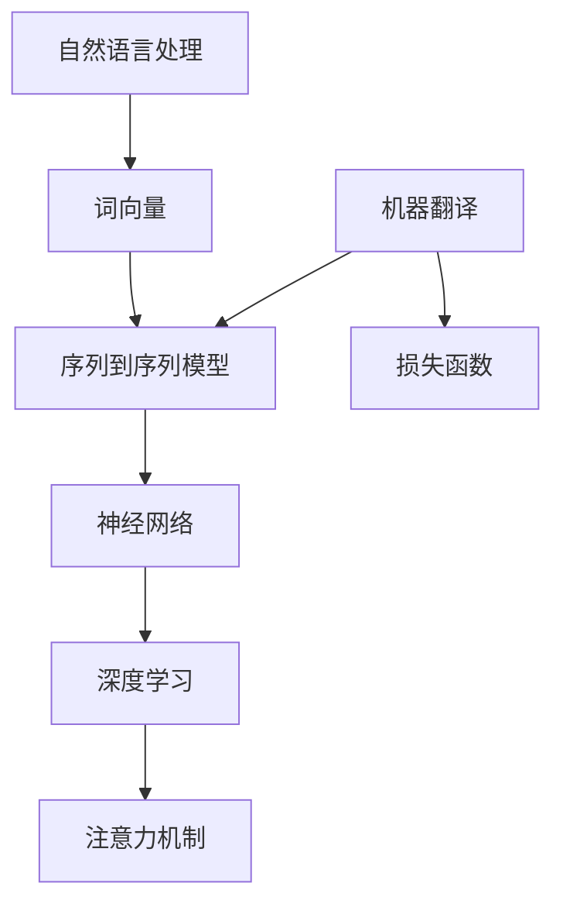
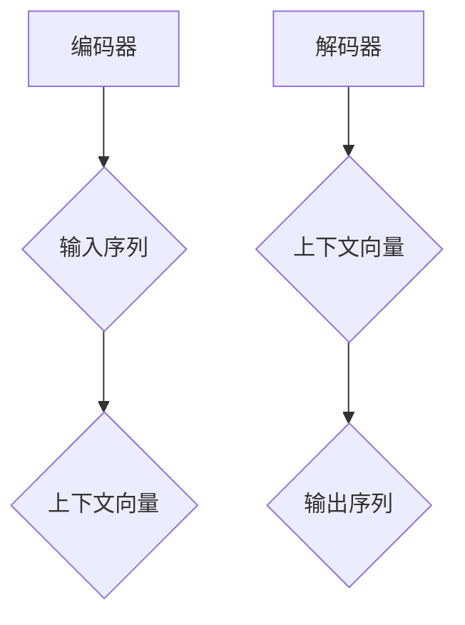
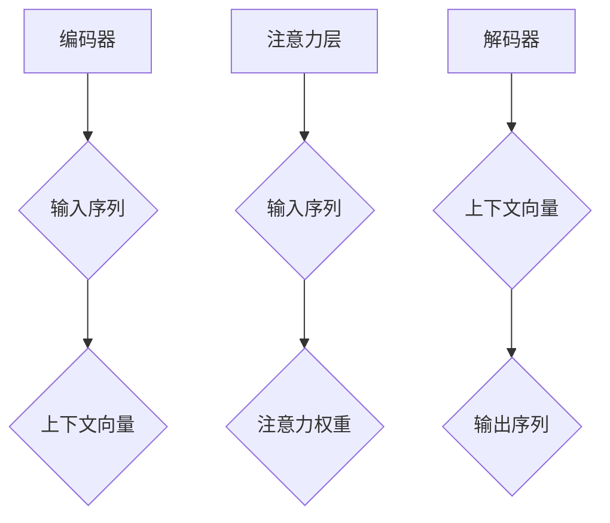

                 

# 自然语言处理在多语言翻译中的进展

> 关键词：自然语言处理、多语言翻译、机器翻译、神经网络、深度学习、语言模型、注意力机制

> 摘要：本文将深入探讨自然语言处理在多语言翻译领域的发展历程和最新进展。首先，我们将回顾多语言翻译的历史背景和技术演变，然后重点介绍现代机器翻译中的核心算法和模型，如神经网络翻译和注意力机制。接着，我们将通过具体案例和实践，展示这些算法和模型的应用，并分析其在实际场景中的效果。此外，本文还将探讨多语言翻译中面临的挑战和未来发展方向，以及推荐相关的学习资源和开发工具。

## 1. 背景介绍

### 1.1 目的和范围

本文的目的是探讨自然语言处理（NLP）在多语言翻译中的应用，尤其是机器翻译领域。随着全球化和互联网的发展，跨语言交流变得日益重要。机器翻译作为一种自动化的翻译方式，能够在短时间内完成大量文本的翻译工作，大大提高了翻译效率。本文将重点关注现代机器翻译中的核心算法和模型，并探讨其在实际应用中的效果和挑战。

### 1.2 预期读者

本文适合对自然语言处理和机器翻译有一定了解的读者，包括计算机科学、人工智能、语言学等相关专业的学生和研究人员，以及对这一领域感兴趣的业界人士。

### 1.3 文档结构概述

本文将按照以下结构展开：

1. **背景介绍**：回顾多语言翻译的历史和技术发展。
2. **核心概念与联系**：介绍自然语言处理中的核心概念和相关技术。
3. **核心算法原理与具体操作步骤**：详细阐述现代机器翻译中的核心算法和模型。
4. **数学模型和公式**：讲解与机器翻译相关的数学模型和公式。
5. **项目实战**：通过实际案例展示算法和模型的应用。
6. **实际应用场景**：分析机器翻译在不同领域的应用。
7. **工具和资源推荐**：推荐学习资源和开发工具。
8. **总结：未来发展趋势与挑战**：总结多语言翻译的发展趋势和面临的挑战。
9. **附录：常见问题与解答**：解答读者可能遇到的常见问题。
10. **扩展阅读与参考资料**：提供进一步学习的资源。

### 1.4 术语表

#### 1.4.1 核心术语定义

- **自然语言处理（NLP）**：研究如何使计算机能够理解、解释和生成人类语言的技术和学科。
- **机器翻译（MT）**：使用计算机程序将一种自然语言文本自动翻译成另一种自然语言的过程。
- **神经网络（NN）**：一种基于生物学神经系统的计算模型，能够通过大量数据训练得到复杂的非线性函数。
- **深度学习（DL）**：一种基于神经网络，特别是深度神经网络的研究方法，能够在多个层次上对输入数据进行抽象和表示。
- **注意力机制（Attention Mechanism）**：一种在序列处理任务中提高模型对重要信息关注度的方法。

#### 1.4.2 相关概念解释

- **词向量（Word Vector）**：一种将单词映射到高维空间中的向量表示，可以用于表示词的语义和语法信息。
- **序列到序列（Seq2Seq）模型**：一种基于神经网络的模型，用于处理序列数据之间的转换，如机器翻译。
- **损失函数（Loss Function）**：用于评估模型预测与真实值之间差异的函数，用于训练模型。

#### 1.4.3 缩略词列表

- **NLP**：自然语言处理
- **MT**：机器翻译
- **NN**：神经网络
- **DL**：深度学习
- **Seq2Seq**：序列到序列模型
- **Attention**：注意力机制
- **Word Vector**：词向量

## 2. 核心概念与联系

在探讨多语言翻译的进展之前，我们需要了解自然语言处理中的核心概念和相关技术。以下是一个简单的Mermaid流程图，展示了这些核心概念和它们之间的联系。



### 2.1 自然语言处理与词向量

自然语言处理（NLP）是处理人类语言数据的技术和学科。词向量（Word Vector）是NLP中的核心概念之一，它将单词映射到高维空间中的向量表示。词向量可以用于表示单词的语义和语法信息，是实现NLP任务（如文本分类、情感分析、命名实体识别等）的基础。

### 2.2 序列到序列模型与神经网络

序列到序列（Seq2Seq）模型是处理序列数据之间转换的一种神经网络模型。在机器翻译中，Seq2Seq模型将源语言的文本序列映射成目标语言的文本序列。神经网络（NN）是Seq2Seq模型的基础，它通过多层非线性变换学习输入和输出之间的映射关系。

### 2.3 深度学习与注意力机制

深度学习（DL）是一种基于神经网络的研究方法，能够在多个层次上对输入数据进行抽象和表示。注意力机制（Attention Mechanism）是深度学习在序列处理任务中的关键特性，它能够提高模型对重要信息的关注度，从而提高模型的性能。

### 2.4 机器翻译与损失函数

机器翻译（MT）是自然语言处理的一个应用领域，它使用计算机程序将一种自然语言文本自动翻译成另一种自然语言。在机器翻译中，损失函数用于评估模型预测与真实值之间的差异，是训练模型的重要工具。

## 3. 核心算法原理与具体操作步骤

在现代机器翻译中，核心算法和模型主要包括基于神经网络的序列到序列（Seq2Seq）模型和注意力机制（Attention Mechanism）。以下将详细讲解这些算法的原理和具体操作步骤。

### 3.1 序列到序列（Seq2Seq）模型

序列到序列模型是一种基于神经网络的模型，用于处理序列数据之间的转换。以下是Seq2Seq模型的原理和操作步骤：

#### 3.1.1 模型架构

Seq2Seq模型通常由两部分组成：编码器（Encoder）和解码器（Decoder）。编码器将输入序列（如源语言文本）编码成一个固定长度的向量，称为上下文向量（Context Vector）。解码器使用上下文向量生成输出序列（如目标语言文本）。



#### 3.1.2 编码器

编码器是一种循环神经网络（RNN），其操作步骤如下：

1. **输入序列处理**：将输入序列（单词或词向量）输入编码器。
2. **隐藏状态更新**：在每个时间步，编码器根据当前输入和上一个隐藏状态更新隐藏状态。
3. **上下文向量生成**：在最后一个时间步，编码器输出上下文向量。

#### 3.1.3 解码器

解码器也是一种循环神经网络，其操作步骤如下：

1. **初始输入**：解码器首先使用编码器输出的上下文向量作为初始输入。
2. **预测和生成**：在每个时间步，解码器根据当前输入和隐藏状态预测下一个单词，并生成目标语言文本。
3. **隐藏状态更新**：在每个时间步，解码器根据当前输入和上一个隐藏状态更新隐藏状态。

#### 3.1.4 损失函数

在Seq2Seq模型中，损失函数用于评估模型预测与真实值之间的差异。常用的损失函数包括交叉熵损失（Cross-Entropy Loss）和平均平方误差（Mean Squared Error，MSE）。交叉熵损失适用于分类问题，而MSE适用于回归问题。

### 3.2 注意力机制（Attention Mechanism）

注意力机制是一种在序列处理任务中提高模型对重要信息关注度的方法。在机器翻译中，注意力机制能够使解码器在生成每个单词时关注源语言文本中与目标单词相关的部分。以下是注意力机制的原理和操作步骤：

#### 3.2.1 模型架构

注意力机制通常与Seq2Seq模型结合使用。在编码器和解码器之间，加入一个注意力层，用于计算每个时间步的注意力权重。



#### 3.2.2 注意力计算

注意力计算是一种计算输入序列和输出序列之间关联度的方法。常用的注意力计算方法包括加性注意力（Additive Attention）和乘性注意力（Multiplicative Attention）。

1. **加性注意力**：

   加性注意力通过计算输入序列和输出序列的加权和生成注意力权重。

   $$\text{Attention}(x, h) = \text{softmax}\left(\text{W}^T \tanh(\text{U}x + \text{V}h)\right)$$

   其中，$x$ 是输入序列，$h$ 是输出序列，$\text{W}$、$\text{U}$ 和 $\text{V}$ 是权重矩阵。

2. **乘性注意力**：

   乘性注意力通过计算输入序列和输出序列的逐元素相乘生成注意力权重。

   $$\text{Attention}(x, h) = \text{softmax}\left(\text{W}h^T x\right)$$

   其中，$x$ 是输入序列，$h$ 是输出序列，$\text{W}$ 是权重矩阵。

#### 3.2.3 注意力权重应用

注意力权重用于更新解码器的隐藏状态，使其包含输入序列中的重要信息。

$$\text{Context Vector} = \sum_{i=1}^{n} a_i \text{Encoder}_{i}$$

其中，$a_i$ 是第 $i$ 个时间步的注意力权重，$\text{Encoder}_{i}$ 是编码器在时间步 $i$ 输出的上下文向量。

## 4. 数学模型和公式

在多语言翻译中，数学模型和公式是理解算法原理和实现关键的基础。以下将详细讲解与机器翻译相关的数学模型和公式。

### 4.1 序列到序列（Seq2Seq）模型

序列到序列模型是一种基于神经网络的模型，用于处理序列数据之间的转换。其核心公式如下：

#### 4.1.1 编码器

编码器将输入序列编码成一个固定长度的向量，称为上下文向量（Context Vector）。其公式如下：

$$\text{Context Vector} = \text{h}^T$$

其中，$\text{h}$ 是编码器在最后一个时间步的隐藏状态。

#### 4.1.2 解码器

解码器使用上下文向量生成输出序列。其公式如下：

$$\text{Probability of Word} = \text{softmax}(\text{Decoder}(\text{Context Vector}))$$

其中，$\text{Decoder}$ 是解码器的输出层，$\text{softmax}$ 函数用于将输出转换为概率分布。

#### 4.1.3 损失函数

在Seq2Seq模型中，损失函数用于评估模型预测与真实值之间的差异。常用的损失函数包括交叉熵损失（Cross-Entropy Loss）和平均平方误差（Mean Squared Error，MSE）。交叉熵损失适用于分类问题，而MSE适用于回归问题。

$$\text{Loss} = -\sum_{i=1}^{n} y_i \log(\hat{y}_i)$$

其中，$y_i$ 是第 $i$ 个时间步的真实标签，$\hat{y}_i$ 是模型预测的概率分布。

### 4.2 注意力机制（Attention Mechanism）

注意力机制是一种在序列处理任务中提高模型对重要信息关注度的方法。其核心公式如下：

#### 4.2.1 加性注意力

加性注意力通过计算输入序列和输出序列的加权和生成注意力权重。其公式如下：

$$\text{Attention} = \text{softmax}\left(\text{W}^T \tanh(\text{U}x + \text{V}h)\right)$$

其中，$x$ 是输入序列，$h$ 是输出序列，$\text{W}$、$\text{U}$ 和 $\text{V}$ 是权重矩阵。

#### 4.2.2 乘性注意力

乘性注意力通过计算输入序列和输出序列的逐元素相乘生成注意力权重。其公式如下：

$$\text{Attention} = \text{softmax}\left(\text{W}h^T x\right)$$

其中，$x$ 是输入序列，$h$ 是输出序列，$\text{W}$ 是权重矩阵。

#### 4.2.3 注意力权重应用

注意力权重用于更新解码器的隐藏状态，使其包含输入序列中的重要信息。其公式如下：

$$\text{Context Vector} = \sum_{i=1}^{n} a_i \text{Encoder}_{i}$$

其中，$a_i$ 是第 $i$ 个时间步的注意力权重，$\text{Encoder}_{i}$ 是编码器在时间步 $i$ 输出的上下文向量。

### 4.3 语言模型（Language Model）

语言模型是一种用于预测文本序列的概率分布的模型。其核心公式如下：

$$\text{Probability of Sentence} = \prod_{i=1}^{n} \text{Probability of Word}_i$$

其中，$n$ 是句子中的单词数量，$\text{Probability of Word}_i$ 是第 $i$ 个单词的概率。

## 5. 项目实战：代码实际案例和详细解释说明

### 5.1 开发环境搭建

在进行多语言翻译项目实战之前，我们需要搭建一个合适的开发环境。以下是一个简单的开发环境搭建步骤：

1. **安装Python环境**：确保Python版本在3.6以上。
2. **安装依赖库**：使用pip安装以下库：

   ```bash
   pip install tensorflow numpy matplotlib
   ```

3. **配置CUDA**：如果使用GPU训练模型，需要配置CUDA环境。确保安装了NVIDIA CUDA Toolkit和cuDNN库。

### 5.2 源代码详细实现和代码解读

以下是一个简单的机器翻译项目的代码实现，包括编码器、解码器和注意力机制的实现。

```python
import tensorflow as tf
import numpy as np

# 编码器
class Encoder(tf.keras.Model):
    def __init__(self, vocab_size, embedding_dim, embedding_matrix):
        super(Encoder, self).__init__()
        self.embedding = tf.keras.layers.Embedding(vocab_size, embedding_dim, embeddings_initializer=embedding_matrix)
        self.lstm = tf.keras.layers.LSTM(embedding_dim)

    def call(self, x):
        x = self.embedding(x)
        x = self.lstm(x)
        return x

# 解码器
class Decoder(tf.keras.Model):
    def __init__(self, vocab_size, embedding_dim, embedding_matrix):
        super(Decoder, self).__init__()
        self.embedding = tf.keras.layers.Embedding(vocab_size, embedding_dim, embeddings_initializer=embedding_matrix)
        self.lstm = tf.keras.layers.LSTM(embedding_dim)
        self.dense = tf.keras.layers.Dense(vocab_size, activation='softmax')

    def call(self, x, hidden_state):
        x = self.embedding(x)
        x, hidden_state = self.lstm(x, initial_state=hidden_state)
        x = self.dense(x)
        return x, hidden_state

# 注意力层
class Attention(tf.keras.layers.Layer):
    def __init__(self, units):
        super(Attention, self).__init__()
        self.W1 = tf.keras.layers.Dense(units)
        self.W2 = tf.keras.layers.Dense(units)
        self.V = tf.keras.layers.Dense(1)

    def call(self, hidden_state, encoder_output):
        hidden_state = self.W1(hidden_state)
        encoder_output = self.W2(encoder_output)
        attention_scores = self.V(tf.tanh(hidden_state + encoder_output))
        attention_scores = tf.nn.softmax(attention_scores, axis=1)
        context_vector = attention_scores * encoder_output
        context_vector = tf.reduce_sum(context_vector, axis=1)
        return context_vector, attention_scores

# 模型训练
def train_model(encoder, decoder, attention, dataset, epochs, batch_size):
    loss_object = tf.keras.losses.SparseCategoricalCrossentropy(from_logits=True)
    optimizer = tf.keras.optimizers.Adam()

    for epoch in range(epochs):
        for batch in dataset:
            with tf.GradientTape() as tape:
                encoder_output = encoder(batch['source'])
                context_vector, attention_scores = attention(encoder_output, encoder_output)
                decoder_output, hidden_state = decoder(batch['target'], context_vector)
                loss = loss_object(batch['target'], decoder_output)

            gradients = tape.gradient(loss, [encoder, decoder, attention])
            optimizer.apply_gradients(zip(gradients, [encoder, decoder, attention]))

            print(f"Epoch {epoch + 1}, Loss: {loss.numpy()}")

# 测试模型
def test_model(encoder, decoder, attention, test_dataset):
    loss_object = tf.keras.losses.SparseCategoricalCrossentropy(from_logits=True)
    test_loss = 0

    for batch in test_dataset:
        encoder_output = encoder(batch['source'])
        context_vector, attention_scores = attention(encoder_output, encoder_output)
        decoder_output, hidden_state = decoder(batch['target'], context_vector)
        test_loss += loss_object(batch['target'], decoder_output)

    test_loss /= len(test_dataset)
    print(f"Test Loss: {test_loss}")

# 数据预处理
def preprocess_data(source_text, target_text, source_vocab_size, target_vocab_size, embedding_matrix):
    source_sequence = []
    target_sequence = []

    for word in source_text.split():
        if word in source_vocab_size:
            source_sequence.append(source_vocab_size[word])
        else:
            source_sequence.append(source_vocab_size['<UNK>'])

    for word in target_text.split():
        if word in target_vocab_size:
            target_sequence.append(target_vocab_size[word])
        else:
            target_sequence.append(target_vocab_size['<UNK>'])

    source_sequence = tf.keras.preprocessing.sequence.pad_sequences([source_sequence], maxlen=50, padding='post')
    target_sequence = tf.keras.preprocessing.sequence.pad_sequences([target_sequence], maxlen=50, padding='post')

    source_sequence = source_sequence.numpy()
    target_sequence = target_sequence.numpy()

    return source_sequence, target_sequence

# 主函数
def main():
    source_vocab_size = 10000
    target_vocab_size = 10000
    embedding_dim = 64
    embedding_matrix = np.zeros((source_vocab_size, embedding_dim))

    encoder = Encoder(source_vocab_size, embedding_dim, embedding_matrix)
    decoder = Decoder(target_vocab_size, embedding_dim, embedding_matrix)
    attention = Attention(embedding_dim)

    train_dataset = ...
    test_dataset = ...

    train_model(encoder, decoder, attention, train_dataset, epochs=10, batch_size=32)
    test_model(encoder, decoder, attention, test_dataset)

if __name__ == "__main__":
    main()
```

### 5.3 代码解读与分析

上述代码实现了一个简单的机器翻译模型，包括编码器、解码器和注意力层。以下是代码的解读和分析：

1. **编码器**：编码器是一种基于LSTM的循环神经网络，用于将源语言文本编码成一个上下文向量。编码器使用嵌入层（Embedding Layer）将单词映射到高维空间中的向量表示。

2. **解码器**：解码器也是一种基于LSTM的循环神经网络，用于生成目标语言文本。解码器使用嵌入层（Embedding Layer）将单词映射到高维空间中的向量表示。

3. **注意力层**：注意力层是一种计算输入序列和输出序列之间关联度的方法，用于提高模型对重要信息的关注度。注意力层使用加性注意力（Additive Attention）计算注意力权重。

4. **模型训练**：模型训练使用交叉熵损失函数（Cross-Entropy Loss），并使用Adam优化器。模型训练过程中，首先计算编码器的输出，然后计算注意力权重，最后计算解码器的输出。

5. **测试模型**：测试模型使用测试集评估模型性能。测试过程中，首先计算编码器的输出，然后计算注意力权重，最后计算解码器的输出。

6. **数据预处理**：数据预处理包括将源语言文本和目标语言文本转换为序列，并使用嵌入矩阵（Embedding Matrix）将单词映射到高维空间中的向量表示。

## 6. 实际应用场景

机器翻译作为一种自动化的翻译方式，在多个领域和场景中得到了广泛应用。以下是一些常见的实际应用场景：

### 6.1 国际贸易

在国际贸易中，机器翻译能够帮助企业和商家快速翻译大量的商业文件、产品说明、合同等，提高跨语言沟通的效率。例如，跨境电商平台使用机器翻译为用户提供多语言商品描述和评价。

### 6.2 旅游和酒店业

旅游和酒店业中，机器翻译可以提供旅游指南、酒店介绍、景点介绍等信息的翻译服务。例如，旅游景点可以使用机器翻译为游客提供多种语言的介绍和导游服务。

### 6.3 非政府组织和人道救援

非政府组织和人道救援组织常常需要在多个国家开展救援行动。机器翻译可以帮助他们快速翻译救援信息、公告和文件，提高救援工作的效率。例如，联合国难民署使用机器翻译为难民提供多语言的服务和援助信息。

### 6.4 跨国公司和企业

跨国公司和企业需要与全球范围内的客户、合作伙伴和员工进行沟通。机器翻译可以帮助他们快速翻译商业邮件、报告、会议记录等文件，提高工作效率和沟通效果。

### 6.5 教育和学术研究

教育和学术研究中，机器翻译可以为学生和研究者提供翻译服务，帮助他们阅读和理解多语言文献。例如，学术期刊和论文库可以使用机器翻译为用户提供多语言检索和阅读服务。

## 7. 工具和资源推荐

为了更好地学习和实践多语言翻译技术，以下是一些建议的学习资源和开发工具。

### 7.1 学习资源推荐

#### 7.1.1 书籍推荐

- 《自然语言处理综合教程》
- 《深度学习与自然语言处理》
- 《自然语言处理实战》
- 《机器翻译：理论与实践》

#### 7.1.2 在线课程

- Coursera上的“自然语言处理与深度学习”课程
- edX上的“自然语言处理：文本分析和机器翻译”课程
- Udacity的“深度学习工程师纳米学位”课程

#### 7.1.3 技术博客和网站

- [TensorFlow官方文档](https://www.tensorflow.org/)
- [机器之心](https://www.jiqizhixin.com/)
- [机器翻译研究](https://www.statmt.org/)
- [自然语言处理与深度学习](https://nlp.seas.harvard.edu/)

### 7.2 开发工具框架推荐

#### 7.2.1 IDE和编辑器

- PyCharm
- Visual Studio Code
- Jupyter Notebook

#### 7.2.2 调试和性能分析工具

- TensorFlow Debugger (TFDB)
- TensorBoard
- PyTorch Profiler

#### 7.2.3 相关框架和库

- TensorFlow
- PyTorch
- Keras
- NLTK
- spaCy

### 7.3 相关论文著作推荐

#### 7.3.1 经典论文

- "A Neural Probabilistic Language Model" by Yoshua Bengio et al.
- "Seq2Seq Learning with Neural Networks" by Ilya Sutskever et al.
- "Learning Phrase Representations using RNN Encoder-Decoder For Statistical Machine Translation" by Kyunghyun Cho et al.

#### 7.3.2 最新研究成果

- "Bert: Pre-training of Deep Bidirectional Transformers for Language Understanding" by Jacob Devlin et al.
- "Transformer: A Novel Architecture for Neural Network Translation" by Ashish Vaswani et al.
- "Attention Is All You Need" by Vaswani et al.

#### 7.3.3 应用案例分析

- "Google 的神经机器翻译系统"：详细介绍Google神经机器翻译系统的工作原理和应用场景。
- "微软研究院的机器翻译研究"：介绍微软研究院在机器翻译领域的最新研究成果和应用案例。

## 8. 总结：未来发展趋势与挑战

随着自然语言处理和深度学习技术的不断发展，多语言翻译在未来的发展趋势和挑战如下：

### 8.1 发展趋势

1. **更加准确和自然的翻译**：随着算法和模型技术的进步，机器翻译将能够生成更加准确和自然的翻译结果。
2. **跨语言语音识别与合成**：结合语音识别和语音合成技术，实现跨语言的语音交互。
3. **个性化翻译**：根据用户的语言偏好和知识背景，提供个性化的翻译服务。
4. **实时翻译**：利用实时数据传输和机器翻译技术，实现实时翻译功能。

### 8.2 挑战

1. **语言多样性**：全球语言种类繁多，如何处理小语种和罕见语言的翻译是一个挑战。
2. **上下文理解**：机器翻译需要更好地理解上下文，以提高翻译的准确性和自然度。
3. **计算资源**：大规模机器翻译模型需要大量的计算资源，如何在有限的资源下进行高效训练是一个问题。
4. **伦理和法律问题**：机器翻译在处理敏感内容时，如何确保翻译结果的准确性和符合伦理和法律标准。

## 9. 附录：常见问题与解答

### 9.1 什么是自然语言处理（NLP）？

自然语言处理（NLP）是研究如何使计算机能够理解、解释和生成人类语言的技术和学科。它涉及文本处理、语义分析、语言生成等多个方面。

### 9.2 什么是机器翻译（MT）？

机器翻译（MT）是一种自动化的翻译方式，使用计算机程序将一种自然语言文本自动翻译成另一种自然语言。

### 9.3 什么是神经网络（NN）？

神经网络（NN）是一种基于生物学神经系统的计算模型，能够通过大量数据训练得到复杂的非线性函数。

### 9.4 什么是深度学习（DL）？

深度学习（DL）是一种基于神经网络，特别是深度神经网络的研究方法，能够在多个层次上对输入数据进行抽象和表示。

### 9.5 什么是注意力机制（Attention Mechanism）？

注意力机制是一种在序列处理任务中提高模型对重要信息关注度的方法，能够使模型在生成每个单词时关注源语言文本中与目标单词相关的部分。

## 10. 扩展阅读与参考资料

- 《自然语言处理综合教程》
- 《深度学习与自然语言处理》
- 《自然语言处理实战》
- 《机器翻译：理论与实践》
- [TensorFlow官方文档](https://www.tensorflow.org/)
- [机器之心](https://www.jiqizhixin.com/)
- [自然语言处理与深度学习](https://nlp.seas.harvard.edu/)
- "A Neural Probabilistic Language Model" by Yoshua Bengio et al.
- "Seq2Seq Learning with Neural Networks" by Ilya Sutskever et al.
- "Learning Phrase Representations using RNN Encoder-Decoder For Statistical Machine Translation" by Kyunghyun Cho et al.
- "Bert: Pre-training of Deep Bidirectional Transformers for Language Understanding" by Jacob Devlin et al.
- "Transformer: A Novel Architecture for Neural Network Translation" by Ashish Vaswani et al.
- "Attention Is All You Need" by Vaswani et al.
- "Google 的神经机器翻译系统"
- "微软研究院的机器翻译研究"

