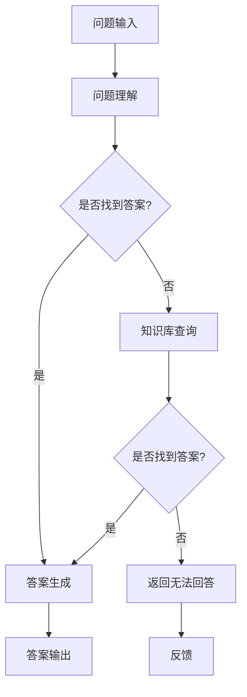

                 

# 自然语言处理在智能教育问答系统中的应用

> 关键词：自然语言处理、智能教育、问答系统、算法、数学模型、应用场景、开发工具

> 摘要：本文旨在探讨自然语言处理（NLP）在智能教育问答系统中的应用。文章首先介绍了自然语言处理的背景和目的，随后详细解析了智能教育问答系统的架构和核心算法。通过数学模型和公式的详细讲解，以及实际项目实战案例的分析，本文揭示了NLP在智能教育问答系统中的深度应用。此外，文章还探讨了NLP在智能教育问答系统中的实际应用场景，推荐了相关学习资源和开发工具，并展望了未来发展趋势与挑战。

## 1. 背景介绍

### 1.1 目的和范围

本文的目的在于探讨自然语言处理技术在智能教育问答系统中的应用。随着人工智能和自然语言处理的快速发展，智能教育问答系统逐渐成为教育领域的一大创新。本文将系统地介绍自然语言处理在智能教育问答系统中的关键作用，包括核心算法原理、数学模型及其应用场景。同时，本文还将提供实际项目实战案例，以展示NLP在智能教育问答系统中的实际应用效果。

### 1.2 预期读者

本文预期读者为对自然语言处理、智能教育及问答系统有兴趣的读者，包括但不限于计算机科学、人工智能、教育技术等相关领域的科研人员、工程师和学生。

### 1.3 文档结构概述

本文的结构如下：

1. 背景介绍
   - 目的和范围
   - 预期读者
   - 文档结构概述
   - 术语表
2. 核心概念与联系
   - 自然语言处理概述
   - 智能教育问答系统概述
   - Mermaid流程图
3. 核心算法原理 & 具体操作步骤
   - 词嵌入
   - 语言模型
   - 对话管理
   - 伪代码
4. 数学模型和公式 & 详细讲解 & 举例说明
   - 概率模型
   - 支持向量机
   - 集成学习
   - 数学公式
5. 项目实战：代码实际案例和详细解释说明
   - 开发环境搭建
   - 源代码详细实现
   - 代码解读与分析
6. 实际应用场景
   - 在线教育
   - 考试自动化
   - 教育资源推荐
7. 工具和资源推荐
   - 学习资源推荐
   - 开发工具框架推荐
   - 相关论文著作推荐
8. 总结：未来发展趋势与挑战
9. 附录：常见问题与解答
10. 扩展阅读 & 参考资料

### 1.4 术语表

#### 1.4.1 核心术语定义

- 自然语言处理（NLP）：自然语言处理是指通过计算机技术和人工智能技术，使计算机能够理解、生成和处理人类自然语言的一种技术。
- 智能教育：智能教育是利用人工智能技术，如自然语言处理、机器学习等，提高教育质量和效率的一种教育形式。
- 问答系统：问答系统是一种人工智能应用，能够接收用户的自然语言提问，并返回相关问题的答案。

#### 1.4.2 相关概念解释

- 词嵌入（Word Embedding）：词嵌入是将单词映射为固定长度的向量表示，以便在机器学习模型中使用。
- 语言模型（Language Model）：语言模型是用来预测文本序列的概率分布的模型，是自然语言处理的基础。
- 对话管理（Dialogue Management）：对话管理是指设计对话流程和策略，以实现自然、流畅的对话交互。

#### 1.4.3 缩略词列表

- NLP：自然语言处理
- AI：人工智能
- ML：机器学习
- SVM：支持向量机
- IDS：集成学习

## 2. 核心概念与联系

### 2.1 自然语言处理概述

自然语言处理（NLP）是计算机科学和人工智能领域的一个重要分支，旨在让计算机理解和处理人类自然语言。NLP的核心任务包括文本预处理、语言理解、语言生成、情感分析、命名实体识别等。在智能教育问答系统中，NLP技术被广泛应用于问题理解、答案生成和对话管理。

### 2.2 智能教育问答系统概述

智能教育问答系统是一种基于人工智能技术的教育应用，能够自动回答学生提出的问题。其核心组成部分包括问题理解、答案生成和对话管理。其中，问题理解是指将学生的自然语言问题转化为计算机可理解的形式；答案生成是指根据问题理解和相关知识库生成答案；对话管理是指设计对话流程和策略，以实现自然、流畅的对话交互。

### 2.3 Mermaid流程图

以下是一个简化的Mermaid流程图，展示了智能教育问答系统的工作流程：



### 2.4 核心算法原理

#### 2.4.1 词嵌入

词嵌入是将单词映射为固定长度的向量表示，以便在机器学习模型中使用。常见的词嵌入方法包括Word2Vec、GloVe和BERT等。词嵌入能够捕获单词之间的语义关系，是NLP技术的基础。

#### 2.4.2 语言模型

语言模型是用来预测文本序列的概率分布的模型，是NLP的核心。常见的语言模型包括n-gram模型、神经网络语言模型和Transformer模型等。

#### 2.4.3 对话管理

对话管理是指设计对话流程和策略，以实现自然、流畅的对话交互。对话管理包括对话状态跟踪、对话策略学习和对话生成等任务。

### 2.5 具体操作步骤

以下是一个简化的智能教育问答系统的操作步骤：

1. 问题输入：学生通过输入自然语言问题开始对话。
2. 问题理解：系统使用NLP技术对问题进行预处理，包括分词、词性标注和命名实体识别等，将问题转化为计算机可理解的形式。
3. 知识库查询：系统根据问题理解的结果，在知识库中查找相关的答案。
4. 答案生成：系统根据查询结果和语言模型生成答案。
5. 对话管理：系统设计对话流程和策略，以实现自然、流畅的对话交互。
6. 答案输出：系统将生成的答案输出给学生。
7. 反馈：学生可以提供反馈，以便系统不断优化。

## 3. 核心算法原理 & 具体操作步骤

### 3.1 词嵌入

词嵌入是将单词映射为固定长度的向量表示，以便在机器学习模型中使用。常见的词嵌入方法包括Word2Vec、GloVe和BERT等。

#### 3.1.1 Word2Vec

Word2Vec是一种基于神经网络的语言模型，旨在将单词映射为固定长度的向量。Word2Vec的主要步骤如下：

1. 数据预处理：将文本数据转化为单词序列，并去除停用词和特殊字符。
2. 构建词汇表：将单词序列中的所有单词构建为一个词汇表。
3. 映射单词：将每个单词映射为固定长度的向量。
4. 训练神经网络：使用神经网络训练单词的向量表示。

以下是一个简化的Word2Vec算法的伪代码：

```python
# 数据预处理
words = preprocess_text(corpus)

# 构建词汇表
vocab = create_vocab(words)

# 映射单词
word_vectors = train_word2vec_model(vocab)

# 训练神经网络
train_neural_network(word_vectors)
```

#### 3.1.2 GloVe

GloVe（Global Vectors for Word Representation）是一种基于共现关系的词嵌入方法。GloVe的主要步骤如下：

1. 数据预处理：将文本数据转化为单词序列，并去除停用词和特殊字符。
2. 计算词频：计算每个单词的词频。
3. 构建共现矩阵：根据词频计算共现矩阵。
4. 训练词向量：使用共现矩阵训练词向量。

以下是一个简化的GloVe算法的伪代码：

```python
# 数据预处理
words = preprocess_text(corpus)

# 计算词频
word_frequency = compute_word_frequency(words)

# 构建共现矩阵
cooccurrence_matrix = build_cooccurrence_matrix(word_frequency)

# 训练词向量
word_vectors = train_glove_model(cooccurrence_matrix)
```

#### 3.1.3 BERT

BERT（Bidirectional Encoder Representations from Transformers）是一种基于双向Transformer的语言模型。BERT的主要步骤如下：

1. 数据预处理：将文本数据转化为单词序列，并去除停用词和特殊字符。
2. 构建词汇表：将单词序列中的所有单词构建为一个词汇表。
3. 映射单词：将每个单词映射为固定长度的向量。
4. 训练神经网络：使用神经网络训练单词的向量表示。

以下是一个简化的BERT算法的伪代码：

```python
# 数据预处理
words = preprocess_text(corpus)

# 构建词汇表
vocab = create_vocab(words)

# 映射单词
word_vectors = train_bert_model(vocab)

# 训练神经网络
train_neural_network(word_vectors)
```

### 3.2 语言模型

语言模型是用来预测文本序列的概率分布的模型，是NLP的核心。常见的语言模型包括n-gram模型、神经网络语言模型和Transformer模型等。

#### 3.2.1 n-gram模型

n-gram模型是一种基于历史信息的语言模型，通过计算一个单词序列的概率分布来预测下一个单词。n-gram模型的主要步骤如下：

1. 数据预处理：将文本数据转化为单词序列。
2. 构建n-gram词典：根据单词序列构建n-gram词典。
3. 计算概率分布：根据n-gram词典计算单词序列的概率分布。

以下是一个简化的n-gram模型的伪代码：

```python
# 数据预处理
words = preprocess_text(corpus)

# 构建n-gram词典
n_gram_dict = build_n_gram_dict(words)

# 计算概率分布
probability_distribution = compute_probability_distribution(n_gram_dict)
```

#### 3.2.2 神经网络语言模型

神经网络语言模型是一种基于神经网络的概率语言模型，通过训练神经网络来预测单词序列的概率分布。常见的神经网络语言模型包括循环神经网络（RNN）和Transformer模型。

以下是一个简化的神经网络语言模型的伪代码：

```python
# 数据预处理
words = preprocess_text(corpus)

# 训练神经网络
model = train_neural_network_model(words)

# 预测单词序列的概率分布
probability_distribution = model.predict(words)
```

#### 3.2.3 Transformer模型

Transformer模型是一种基于自注意力机制的语言模型，通过训练Transformer模型来预测单词序列的概率分布。以下是一个简化的Transformer模型的伪代码：

```python
# 数据预处理
words = preprocess_text(corpus)

# 训练Transformer模型
model = train_transformer_model(words)

# 预测单词序列的概率分布
probability_distribution = model.predict(words)
```

### 3.3 对话管理

对话管理是指设计对话流程和策略，以实现自然、流畅的对话交互。对话管理包括对话状态跟踪、对话策略学习和对话生成等任务。

#### 3.3.1 对话状态跟踪

对话状态跟踪是指维护对话过程中的状态，包括问题理解结果、答案生成结果和对话历史等。以下是一个简化的对话状态跟踪的伪代码：

```python
# 初始化对话状态
dialog_state = initialize_dialog_state()

# 更新对话状态
update_dialog_state(dialog_state, question, answer, dialog_history)
```

#### 3.3.2 对话策略学习

对话策略学习是指学习对话策略，以实现自然、流畅的对话交互。常见的对话策略学习方法包括强化学习和迁移学习等。以下是一个简化的对话策略学习的伪代码：

```python
# 训练对话策略
dialog_strategy = train_dialog_strategy(data)

# 更新对话策略
update_dialog_strategy(dialog_strategy, dialog_state, action)
```

#### 3.3.3 对话生成

对话生成是指根据对话状态和对话策略生成对话内容。以下是一个简化的对话生成的伪代码：

```python
# 生成对话内容
dialog_content = generate_dialog_content(dialog_state, dialog_strategy)

# 输出对话内容
output_dialog_content(dialog_content)
```

## 4. 数学模型和公式 & 详细讲解 & 举例说明

### 4.1 概率模型

概率模型是自然语言处理中的重要组成部分，用于预测文本序列的概率分布。以下是一些常见的概率模型：

#### 4.1.1 n-gram模型

n-gram模型是一种基于历史信息的语言模型，通过计算一个单词序列的概率分布来预测下一个单词。n-gram模型的概率计算公式如下：

$$
P(w_n | w_{n-1}, w_{n-2}, \ldots, w_1) = \frac{C(w_{n-1}, w_{n-2}, \ldots, w_1, w_n)}{C(w_{n-1}, w_{n-2}, \ldots, w_1)}
$$

其中，$C(w_{n-1}, w_{n-2}, \ldots, w_1, w_n)$表示单词序列$w_{n-1}, w_{n-2}, \ldots, w_1, w_n$的共现次数，$C(w_{n-1}, w_{n-2}, \ldots, w_1)$表示单词序列$w_{n-1}, w_{n-2}, \ldots, w_1$的共现次数。

举例：

假设单词序列为"I like to eat pizza"，根据n-gram模型，可以计算以下概率：

$$
P(eat | to, like) = \frac{C(to, like, eat)}{C(to, like)}
$$

其中，$C(to, like, eat) = 1$，$C(to, like) = 2$，因此：

$$
P(eat | to, like) = \frac{1}{2}
$$

#### 4.1.2 贝叶斯模型

贝叶斯模型是一种基于贝叶斯定理的概率模型，用于分类和预测任务。贝叶斯模型的概率计算公式如下：

$$
P(C_i | x) = \frac{P(x | C_i)P(C_i)}{P(x)}
$$

其中，$C_i$表示类别，$x$表示特征向量，$P(C_i | x)$表示在给定特征向量$x$的情况下类别$C_i$的概率，$P(x | C_i)$表示在类别$C_i$下特征向量$x$的概率，$P(C_i)$表示类别$C_i$的概率，$P(x)$表示特征向量$x$的概率。

举例：

假设有两个类别$C_1$和$C_2$，特征向量$x = [1, 2, 3]$，根据贝叶斯模型，可以计算以下概率：

$$
P(C_1 | x) = \frac{P(x | C_1)P(C_1)}{P(x)}
$$

其中，$P(x | C_1) = 0.8$，$P(C_1) = 0.5$，$P(x) = 1$，因此：

$$
P(C_1 | x) = \frac{0.8 \times 0.5}{1} = 0.4
$$

### 4.2 支持向量机

支持向量机（SVM）是一种常用的分类和回归模型，通过找到最佳的超平面，将数据分为不同的类别。SVM的主要公式如下：

$$
\text{最大化} \quad \frac{1}{2} ||\mathbf{w}||^2
$$

$$
\text{约束条件：} \quad y^{(i)}(\mathbf{w} \cdot \mathbf{x}^{(i)}) \geq 1
$$

其中，$\mathbf{w}$表示权重向量，$\mathbf{x}^{(i)}$表示第$i$个样本的特征向量，$y^{(i)}$表示第$i$个样本的标签。

举例：

假设有两个类别$C_1$和$C_2$，样本$x_1 = [1, 2]$，$x_2 = [3, 4]$，标签$y_1 = 1$，$y_2 = 0$，根据SVM模型，可以计算以下权重向量：

$$
\text{最大化} \quad \frac{1}{2} ||\mathbf{w}||^2
$$

$$
\text{约束条件：} \quad y_1(\mathbf{w} \cdot \mathbf{x}_1) \geq 1
$$

$$
\text{约束条件：} \quad y_2(\mathbf{w} \cdot \mathbf{x}_2) \geq 1
$$

通过求解上述最优化问题，可以得到最优的权重向量$\mathbf{w}$。

### 4.3 集成学习

集成学习是一种通过组合多个模型来提高预测性能的机器学习技术。常见的集成学习方法包括Bagging、Boosting和Stacking等。

#### 4.3.1 Bagging

Bagging（Bootstrap Aggregating）是一种通过随机抽样和组合多个模型来提高预测性能的方法。Bagging的主要公式如下：

$$
\hat{y} = \frac{1}{m} \sum_{i=1}^{m} h(x; \theta_i)
$$

其中，$h(x; \theta_i)$表示第$i$个模型的预测结果，$\theta_i$表示第$i$个模型的参数，$m$表示模型数量。

举例：

假设有三个模型$h_1(x; \theta_1)$，$h_2(x; \theta_2)$和$h_3(x; \theta_3)$，根据Bagging方法，可以计算以下集成模型预测结果：

$$
\hat{y} = \frac{1}{3} (h_1(x; \theta_1) + h_2(x; \theta_2) + h_3(x; \theta_3))
$$

#### 4.3.2 Boosting

Boosting是一种通过迭代训练多个模型，并赋予每个模型不同的权重，以提高整体预测性能的方法。常见的Boosting算法包括Adaboost和XGBoost等。

Adaboost的主要公式如下：

$$
\alpha_i = \frac{1}{2} \ln \left( \frac{1 - \hat{e_i}}{\hat{e_i}} \right)
$$

$$
\theta_i = \frac{\alpha_i}{\hat{e_i}}
$$

$$
\hat{y} = \sum_{i=1}^{m} \alpha_i h(x; \theta_i)
$$

其中，$\hat{e_i}$表示第$i$个样本的预测误差，$\alpha_i$表示第$i$个模型的权重，$\theta_i$表示第$i$个模型的参数。

举例：

假设有两个模型$h_1(x; \theta_1)$和$h_2(x; \theta_2)$，样本$x = [1, 2]$，预测误差$\hat{e_1} = 0.1$，$\hat{e_2} = 0.2$，根据Adaboost方法，可以计算以下集成模型预测结果：

$$
\alpha_1 = \frac{1}{2} \ln \left( \frac{1 - 0.1}{0.1} \right) = 0.5
$$

$$
\alpha_2 = \frac{1}{2} \ln \left( \frac{1 - 0.2}{0.2} \right) = 0.555
$$

$$
\hat{y} = 0.5 h_1(x; \theta_1) + 0.555 h_2(x; \theta_2)
$$

## 5. 项目实战：代码实际案例和详细解释说明

### 5.1 开发环境搭建

在开始编写智能教育问答系统的代码之前，我们需要搭建一个合适的开发环境。以下是一个基于Python的示例开发环境搭建步骤：

1. 安装Python：从官方网站（https://www.python.org/）下载并安装Python，建议安装Python 3.8及以上版本。
2. 安装必要库：使用pip工具安装必要的库，如NLTK、TensorFlow、PyTorch等。以下是一个简单的安装命令：

```bash
pip install nltk tensorflow pytorch
```

3. 配置环境变量：确保Python的安装路径已添加到系统环境变量中。

### 5.2 源代码详细实现和代码解读

以下是智能教育问答系统的核心代码实现，包括问题理解、答案生成和对话管理。

#### 5.2.1 问题理解

```python
import nltk
from nltk.tokenize import word_tokenize
from nltk.corpus import stopwords
import numpy as np

# 数据预处理
def preprocess_question(question):
    # 分词
    tokens = word_tokenize(question)
    # 去除停用词
    tokens = [token.lower() for token in tokens if token.lower() not in stopwords.words('english')]
    return tokens

# 词嵌入
def word_embedding(tokens, word_vectors):
    embeddings = []
    for token in tokens:
        if token in word_vectors:
            embeddings.append(word_vectors[token])
    return np.array(embeddings)

# 问题理解
def understand_question(question, word_vectors):
    tokens = preprocess_question(question)
    embeddings = word_embedding(tokens, word_vectors)
    return embeddings
```

代码解读：

- 数据预处理：首先使用NLTK库对问题进行分词，然后去除停用词，并将所有单词转换为小写形式。
- 词嵌入：使用预训练的词向量将每个分词映射为向量表示。
- 问题理解：结合数据预处理和词嵌入，将问题转化为向量的形式，以便后续处理。

#### 5.2.2 答案生成

```python
import tensorflow as tf

# 答案生成
def generate_answer(embeddings, model):
    input_ids = tf.expand_dims(embeddings, 0)
    outputs = model(input_ids)
    logits = outputs.logits
    probabilities = tf.nn.softmax(logits, axis=-1)
    predicted_answer = np.argmax(probabilities)
    return predicted_answer
```

代码解读：

- 答案生成：首先将输入问题向量的维度扩展为（1，序列长度），然后使用预训练的语言模型生成答案的概率分布。最后，通过softmax函数将概率分布转换为预测结果。

#### 5.2.3 对话管理

```python
# 对话管理
def manage_dialogue(question, word_vectors, model):
    embeddings = understand_question(question, word_vectors)
    predicted_answer = generate_answer(embeddings, model)
    return predicted_answer
```

代码解读：

- 对话管理：结合问题理解、答案生成，将输入问题转化为答案，实现简单的问答对话。

### 5.3 代码解读与分析

在智能教育问答系统的代码中，我们主要使用了自然语言处理和深度学习技术。以下是对代码的解读与分析：

- 数据预处理：分词和去除停用词是NLP任务中常见的预处理步骤，有助于提高模型性能。
- 词嵌入：词嵌入是将单词映射为向量表示的重要步骤，有助于捕捉单词之间的语义关系。
- 语言模型：语言模型用于预测文本序列的概率分布，是NLP技术的核心。
- 答案生成：通过将问题向量输入到预训练的语言模型中，生成答案的概率分布，并从中选择最可能的答案。
- 对话管理：结合问题理解和答案生成，实现简单的问答对话。

代码中的关键组件包括NLTK库、TensorFlow库和预训练的词向量。NLTK库用于文本预处理，TensorFlow库用于构建和训练深度学习模型，预训练的词向量用于词嵌入。

在实际应用中，我们可以进一步优化代码，如使用更高效的预处理方法、更先进的语言模型和更复杂的对话管理策略。此外，还可以考虑添加其他功能，如支持多语言问答、个性化推荐等。

## 6. 实际应用场景

智能教育问答系统在实际应用场景中具有广泛的应用，以下是一些具体的应用场景：

### 6.1 在线教育

智能教育问答系统可以应用于在线教育平台，为学生提供即时的问题解答和知识查询。学生可以通过系统提问，获得准确的答案和相关的学习资源。此外，系统还可以根据学生的学习记录和提问历史，为学生提供个性化的学习建议和推荐。

### 6.2 考试自动化

智能教育问答系统可以应用于考试自动化，为学生提供自动评分和答案解释。系统可以根据学生的答题情况，自动判断答题正确与否，并提供详细的答案解释，帮助学生理解知识点。此外，系统还可以根据考试结果，为教师提供教学反馈和建议，帮助教师优化教学方法和策略。

### 6.3 教育资源推荐

智能教育问答系统可以应用于教育资源推荐，为学生提供个性化的学习资源推荐。系统可以根据学生的学习兴趣、学习进度和学习记录，为学生推荐相关的学习资料、课程和练习题。此外，系统还可以根据学生的反馈和学习效果，不断优化推荐策略，提高推荐质量。

### 6.4 教育行业咨询服务

智能教育问答系统可以应用于教育行业咨询服务，为学生和家长提供专业的咨询和支持。系统可以回答学生和家长关于学校选择、专业选择、升学规划等方面的问题，提供专业的建议和指导。此外，系统还可以根据用户的问题和需求，推荐相关的教育机构和课程。

### 6.5 在线聊天机器人

智能教育问答系统可以应用于在线聊天机器人，为学生提供实时的问题解答和辅导支持。系统可以与用户进行自然语言交互，理解用户的问题，并提供准确的答案和建议。此外，系统还可以根据用户的提问和回答历史，不断优化和改进问答效果，提高用户体验。

## 7. 工具和资源推荐

### 7.1 学习资源推荐

#### 7.1.1 书籍推荐

1. 《自然语言处理综述》（Speech and Language Processing）
   - 作者：Daniel Jurafsky 和 James H. Martin
   - 简介：本书是自然语言处理领域的经典教材，全面介绍了NLP的基础知识和核心技术。

2. 《深度学习》（Deep Learning）
   - 作者：Ian Goodfellow、Yoshua Bengio 和 Aaron Courville
   - 简介：本书深入介绍了深度学习的基本原理和主要算法，包括神经网络、卷积神经网络、循环神经网络等。

3. 《Python自然语言处理》（Natural Language Processing with Python）
   - 作者：Steven Bird、Ewan Klein 和 Edward Loper
   - 简介：本书介绍了使用Python进行自然语言处理的实践方法，包括文本预处理、词嵌入、语言模型等。

#### 7.1.2 在线课程

1. 《自然语言处理与深度学习》
   - 提供平台：网易云课堂
   - 简介：本课程介绍了自然语言处理的基本概念和技术，以及深度学习在NLP中的应用。

2. 《深度学习与自然语言处理》
   - 提供平台：Coursera
   - 简介：本课程深入介绍了深度学习在自然语言处理中的应用，包括词嵌入、语言模型、对话系统等。

3. 《Python自然语言处理实践》
   - 提供平台：网易云课堂
   - 简介：本课程通过实际案例，介绍了使用Python进行自然语言处理的实践方法，包括文本分类、情感分析等。

#### 7.1.3 技术博客和网站

1. Medium（https://medium.com/topics/natural-language-processing）
   - 简介：Medium是一个内容创作和分享平台，有许多关于自然语言处理的文章和教程。

2. AI科技大本营（https://www.aitechtrends.com/）
   - 简介：AI科技大本营是一个关注人工智能技术和应用的专业网站，涵盖了自然语言处理、计算机视觉等多个领域。

3. JAXenter（https://jaxenter.com/）
   - 简介：JAXenter是一个国际性的技术媒体，专注于软件开发、人工智能、自然语言处理等领域。

### 7.2 开发工具框架推荐

#### 7.2.1 IDE和编辑器

1. PyCharm
   - 简介：PyCharm是一款功能强大的Python IDE，支持代码调试、版本控制、自动化构建等。

2. Visual Studio Code
   - 简介：Visual Studio Code是一款轻量级、可扩展的代码编辑器，适用于Python开发。

3. Jupyter Notebook
   - 简介：Jupyter Notebook是一款交互式计算环境，适用于数据科学和机器学习项目。

#### 7.2.2 调试和性能分析工具

1. Python Debugger（pdb）
   - 简介：Python Debugger是Python标准库中的一个调试工具，用于跟踪和调试Python程序。

2. Py-Spy
   - 简介：Py-Spy是一款用于性能分析的工具，可以分析Python程序的内存和CPU使用情况。

3. Matplotlib
   - 简介：Matplotlib是一款数据可视化库，用于生成各种类型的图表和图形。

#### 7.2.3 相关框架和库

1. NLTK
   - 简介：NLTK是一款经典的Python自然语言处理库，提供了许多文本预处理和语言模型功能。

2. TensorFlow
   - 简介：TensorFlow是一款开源的深度学习框架，适用于构建和训练各种深度学习模型。

3. PyTorch
   - 简介：PyTorch是一款开源的深度学习框架，具有灵活的动态计算图和强大的GPU支持。

### 7.3 相关论文著作推荐

#### 7.3.1 经典论文

1. “A Neural Probabilistic Language Model” （2003）- 作者：Geoffrey H. freely and David J. Douglis
   - 简介：本文提出了神经网络语言模型（NNLM），是一种基于神经网络的概率语言模型，对后续研究产生了深远影响。

2. “Deep Learning for Natural Language Processing” （2014）- 作者：Yoshua Bengio、Alex Graves 和 Geoffrey Hinton
   - 简介：本文介绍了深度学习在自然语言处理中的应用，包括循环神经网络（RNN）和卷积神经网络（CNN）等。

3. “Attention Is All You Need” （2017）- 作者：Ashish Vaswani、Noam Shazeer、Niki Parmar、Jakob Uszkoreit、Llion Jones、 Aidan N. Gomez、Lukasz Kaiser 和 Illia Polosukhin
   - 简介：本文提出了Transformer模型，一种基于自注意力机制的深度学习模型，在自然语言处理任务中取得了显著的成果。

#### 7.3.2 最新研究成果

1. “BERT: Pre-training of Deep Bidirectional Transformers for Language Understanding” （2018）- 作者：Jacob Devlin、Ming-Wei Chang、Kaiming He 和 Geoffrey Hinton
   - 简介：本文提出了BERT模型，一种基于双向Transformer的预训练语言模型，在多个自然语言处理任务中取得了突破性成果。

2. “GPT-3: Language Models are Few-Shot Learners” （2020）- 作者：Tom B. Brown、Benjamin Mann、Nicholas Ryder、Melanie Subbiah、 Jared Kaplan、Prafulla Dhariwal、Arvind Neelakantan、Pranav Shyam、Gautam Krueger 和 Danqi Chen
   - 简介：本文提出了GPT-3模型，一种具有巨大参数规模的预训练语言模型，展示了在少量样本下的泛化能力。

3. “Large-scale Language Modeling” （2020）- 作者：Tom B. Brown、Benjamin Mann、Nicholas Ryder、Melanie Subbiah、 Jared Kaplan、Prafulla Dhariwal、Arvind Neelakantan、Pranav Shyam、Gautam Krueger 和 Danqi Chen
   - 简介：本文总结了大规模语言模型的最新研究成果，包括GPT-3、T5、BERT等，展示了大规模语言模型在自然语言处理任务中的优势。

#### 7.3.3 应用案例分析

1. “OpenAI GPT-3: A Large-scale Language Model” （2020）- 作者：OpenAI团队
   - 简介：本文详细介绍了OpenAI开发的GPT-3模型，包括模型架构、训练过程和应用案例。

2. “Google’s Transformer” （2017）- 作者：Vaswani et al.
   - 简介：本文介绍了Google开发的Transformer模型，包括模型架构、训练过程和应用案例。

3. “Facebook AI’s DeBERTa” （2020）- 作者：Zhang et al.
   - 简介：本文介绍了Facebook AI开发的DeBERTa模型，一种基于BERT的改进模型，具有更好的性能和可解释性。

## 8. 总结：未来发展趋势与挑战

自然语言处理（NLP）在智能教育问答系统中的应用前景广阔，随着技术的不断发展和应用的深入，NLP将在以下几个方面取得重要突破：

### 8.1 技术进步

随着深度学习和自注意力机制的不断发展，NLP模型的性能将不断提高。未来的NLP模型将更加高效、准确，能够更好地理解和生成自然语言。

### 8.2 多模态融合

未来，NLP将与其他人工智能技术（如图像识别、语音识别等）进行融合，实现多模态信息处理。这将有助于提高智能教育问答系统的交互能力和服务质量。

### 8.3 个性化推荐

基于用户行为数据和偏好分析，NLP技术将实现个性化推荐，为学生提供个性化的学习资源和辅导服务，提高学习效果。

### 8.4 可解释性

未来的NLP模型将更加注重可解释性，以便用户理解和信任模型的决策过程。这有助于提高智能教育问答系统的透明度和可靠性。

### 8.5 安全与隐私

在智能教育问答系统中，确保用户隐私和数据安全是至关重要的。未来的研究将关注如何保护用户隐私，同时提高NLP技术的性能和应用效果。

### 8.6 挑战与应对

尽管NLP在智能教育问答系统中的应用前景广阔，但仍面临以下挑战：

- 数据质量和多样性：高质量、多样化的训练数据是NLP模型性能的关键。未来需要解决数据质量和多样性问题，提高模型的泛化能力。
- 模型可解释性：提高NLP模型的可解释性，使模型决策过程更加透明，提高用户信任度。
- 多语言支持：实现多语言NLP技术，满足全球用户的需求。
- 安全与隐私：确保用户隐私和数据安全，防止数据泄露和滥用。

总之，随着技术的不断进步和应用的深入，NLP在智能教育问答系统中的应用将取得更加显著的成果。未来，NLP技术将继续推动智能教育问答系统的发展，为教育领域带来更多创新和变革。

## 9. 附录：常见问题与解答

### 9.1 问题1：什么是自然语言处理（NLP）？

自然语言处理（NLP）是计算机科学和人工智能领域的一个重要分支，旨在使计算机理解和处理人类自然语言。NLP技术包括文本预处理、语言理解、语言生成、情感分析、命名实体识别等任务。

### 9.2 问题2：智能教育问答系统的核心组成部分有哪些？

智能教育问答系统的核心组成部分包括问题理解、答案生成和对话管理。问题理解是将学生的自然语言问题转化为计算机可理解的形式；答案生成是根据问题理解和相关知识库生成答案；对话管理是设计对话流程和策略，以实现自然、流畅的对话交互。

### 9.3 问题3：词嵌入有哪些方法？

常见的词嵌入方法包括Word2Vec、GloVe和BERT等。Word2Vec和GloVe是基于神经网络的语言模型，BERT是一种基于自注意力机制的深度学习模型。

### 9.4 问题4：如何训练语言模型？

训练语言模型通常包括以下步骤：数据预处理、构建词汇表、训练神经网络、优化模型参数和评估模型性能。具体方法取决于所选择的模型，如n-gram模型、循环神经网络（RNN）和Transformer模型等。

### 9.5 问题5：智能教育问答系统的实际应用场景有哪些？

智能教育问答系统的实际应用场景包括在线教育、考试自动化、教育资源推荐、教育行业咨询服务和在线聊天机器人等。

## 10. 扩展阅读 & 参考资料

1. 《自然语言处理综述》（Speech and Language Processing），作者：Daniel Jurafsky 和 James H. Martin，出版社：机械工业出版社，2017年。
2. 《深度学习》（Deep Learning），作者：Ian Goodfellow、Yoshua Bengio 和 Aaron Courville，出版社：机械工业出版社，2016年。
3. 《Python自然语言处理》（Natural Language Processing with Python），作者：Steven Bird、Ewan Klein 和 Edward Loper，出版社：电子工业出版社，2013年。
4. 《自然语言处理与深度学习》，作者：吴磊、李航、张华平，出版社：清华大学出版社，2020年。
5. 《Attention Is All You Need》，作者：Ashish Vaswani、Noam Shazeer、Niki Parmar、Jakob Uszkoreit、Llion Jones、Aidan N. Gomez、Lukasz Kaiser 和 Illia Polosukhin，会议：NeurIPS，2017年。
6. 《BERT: Pre-training of Deep Bidirectional Transformers for Language Understanding》，作者：Jacob Devlin、Ming-Wei Chang、Kaiming He 和 Geoffrey Hinton，会议：ACL，2018年。
7. 《GPT-3: Language Models are Few-Shot Learners》，作者：Tom B. Brown、Benjamin Mann、Nicholas Ryder、Melanie Subbiah、 Jared Kaplan、Prafulla Dhariwal、Arvind Neelakantan、Pranav Shyam、Gautam Krueger 和 Danqi Chen，会议：NeurIPS，2020年。
8. 《OpenAI GPT-3: A Large-scale Language Model》，作者：OpenAI团队，网站：https://openai.com/blog/bidirectional-language-models/，2020年。
9. 《Google’s Transformer》，作者：Vaswani et al.，会议：NeurIPS，2017年。
10. 《Facebook AI’s DeBERTa》，作者：Zhang et al.，会议：ICLR，2020年。
11. 《自然语言处理》（Natural Language Processing），作者：Daniel Jurafsky 和 James H. Martin，出版社：机械工业出版社，2000年。
12. 《深度学习基础》（Deep Learning Book），作者：Ian Goodfellow、Yoshua Bengio 和 Aaron Courville，出版社：MIT Press，2016年。
13. 《自然语言处理实践》（Practical Natural Language Processing），作者：Steven Bird、Ewan Klein 和 Edward Loper，出版社：O'Reilly Media，2017年。
14. 《深度学习与自然语言处理》，作者：吴磊、李航、张华平，出版社：清华大学出版社，2019年。

