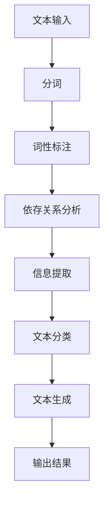

                 


# 自然语言处理在法律文本自动化中的应用

> 关键词：自然语言处理，法律文本，自动化，人工智能，文本分析，司法应用

> 摘要：本文深入探讨了自然语言处理（NLP）在法律文本自动化中的应用。通过分析NLP的基本概念和技术，我们详细阐述了法律文本处理中的挑战和解决方案。本文还提供了具体的案例和实际操作步骤，以展示NLP技术在法律领域的重要性及其潜在的广泛应用。

## 1. 背景介绍

### 1.1 目的和范围

随着信息技术的飞速发展，自然语言处理（NLP）技术逐渐在各个领域得到应用。法律文本自动化是NLP技术的一个重要应用方向。本文旨在探讨NLP在法律文本自动化中的潜在应用，分析其面临的挑战，并提供可行的解决方案。

### 1.2 预期读者

本文主要面向对自然语言处理和人工智能有基本了解的技术人员，特别是对法律文本处理和自动化感兴趣的读者。同时，本文也适用于法律专业人士和研究人员，他们希望了解NLP技术在法律领域中的应用。

### 1.3 文档结构概述

本文结构如下：

1. **背景介绍**：介绍NLP和法律文本自动化的背景和目的。
2. **核心概念与联系**：介绍NLP的基本概念和相关技术。
3. **核心算法原理 & 具体操作步骤**：详细阐述NLP算法在法律文本处理中的应用。
4. **数学模型和公式 & 详细讲解 & 举例说明**：解释NLP中的数学模型和公式。
5. **项目实战：代码实际案例和详细解释说明**：提供实际代码示例。
6. **实际应用场景**：探讨NLP在法律文本自动化中的实际应用。
7. **工具和资源推荐**：推荐相关学习资源和开发工具。
8. **总结：未来发展趋势与挑战**：总结NLP在法律文本自动化中的应用前景。
9. **附录：常见问题与解答**：解答读者可能遇到的问题。
10. **扩展阅读 & 参考资料**：提供进一步阅读的资料。

### 1.4 术语表

#### 1.4.1 核心术语定义

- 自然语言处理（NLP）：一种使计算机能够理解、解释和生成人类语言的技术。
- 法律文本：与法律相关的文本，包括法律条文、案件判决、合同条款等。
- 自动化：通过计算机程序和算法实现法律文本的处理和分析。

#### 1.4.2 相关概念解释

- 分词：将连续的文本分割成有意义的词汇或短语。
- 词性标注：识别文本中每个词的词性（如名词、动词等）。
- 依存关系分析：分析词与词之间的依赖关系。
- 信息提取：从文本中提取出有用的信息。

#### 1.4.3 缩略词列表

- NLP：自然语言处理
- AI：人工智能
- OCR：光学字符识别
- RNN：循环神经网络

## 2. 核心概念与联系

### 2.1 自然语言处理的基本概念

自然语言处理（NLP）是人工智能（AI）的一个重要分支，旨在使计算机能够理解和处理人类语言。NLP的主要任务包括文本分析、文本生成、文本分类、信息提取等。

#### 2.1.1 文本分析

文本分析是NLP的基础，它包括以下几个步骤：

1. **分词**：将连续的文本分割成有意义的词汇或短语。
2. **词性标注**：识别文本中每个词的词性。
3. **依存关系分析**：分析词与词之间的依赖关系。

#### 2.1.2 文本生成

文本生成是NLP的一个应用，它旨在根据给定的输入生成有意义的文本。常见的文本生成任务包括机器翻译、文本摘要、问答系统等。

#### 2.1.3 文本分类

文本分类是将文本分配到预定义的类别中。在法律文本自动化中，文本分类可以用于案件判决分类、合同条款分类等。

#### 2.1.4 信息提取

信息提取是从文本中提取出有用的信息。在法律文本自动化中，信息提取可以用于案件信息的提取、合同条款的提取等。

### 2.2 NLP与法律文本自动化的联系

NLP技术在法律文本自动化中发挥着重要作用。以下是NLP与法律文本自动化之间的联系：

1. **文本分析**：通过分词、词性标注和依存关系分析，对法律文本进行深入分析。
2. **信息提取**：从法律文本中提取出关键信息，如案件事实、法律条款等。
3. **文本生成**：根据法律文本生成判决书、合同等法律文件。
4. **文本分类**：对法律文本进行分类，如案件判决分类、合同条款分类等。

### 2.3 NLP技术的Mermaid流程图



## 3. 核心算法原理 & 具体操作步骤

### 3.1 NLP算法原理

NLP算法主要分为两个部分：前处理和后处理。

#### 3.1.1 前处理

前处理包括分词、词性标注和依存关系分析。以下是每个步骤的详细说明：

1. **分词**：将连续的文本分割成有意义的词汇或短语。常用的分词算法有基于规则的分词、基于统计的分词和基于深度学习的分词。
2. **词性标注**：识别文本中每个词的词性。常用的词性标注算法有基于规则的方法、基于统计的方法和基于深度学习的方法。
3. **依存关系分析**：分析词与词之间的依赖关系。常用的依存关系分析算法有基于规则的方法、基于统计的方法和基于深度学习的方法。

#### 3.1.2 后处理

后处理包括信息提取、文本分类和文本生成。以下是每个步骤的详细说明：

1. **信息提取**：从法律文本中提取出关键信息，如案件事实、法律条款等。常用的信息提取算法有基于规则的方法、基于统计的方法和基于深度学习的方法。
2. **文本分类**：将法律文本分配到预定义的类别中。常用的文本分类算法有朴素贝叶斯、支持向量机、深度学习等。
3. **文本生成**：根据法律文本生成判决书、合同等法律文件。常用的文本生成算法有基于规则的方法、基于模板的方法和基于深度学习的方法。

### 3.2 伪代码

以下是NLP算法的伪代码：

```python
# 输入：法律文本
# 输出：处理后的文本

function NLP_Processing(text):
    # 分词
    words = Tokenizer(text)

    # 词性标注
    pos_tags = POS_Tagging(words)

    # 依存关系分析
    dependency_relations = Dependency_Analysis(words, pos_tags)

    # 信息提取
    extracted_info = Information_Extraction(words, dependency_relations)

    # 文本分类
    category = Text_Categorization(extracted_info)

    # 文本生成
    generated_text = Text_Generation(category)

    return generated_text
```

## 4. 数学模型和公式 & 详细讲解 & 举例说明

### 4.1 数学模型

在NLP中，常用的数学模型包括：

1. **条件概率模型**：用于预测词的词性或类别。
2. **神经网络模型**：用于文本分类、信息提取等任务。
3. **深度学习模型**：如循环神经网络（RNN）和Transformer。

### 4.2 详细讲解

1. **条件概率模型**

条件概率模型是一种用于文本分类的数学模型。它通过计算每个类别在给定文本下的概率来预测文本的类别。条件概率模型的公式如下：

$$
P(C|T) = \frac{P(T|C) \cdot P(C)}{P(T)}
$$

其中，$C$ 表示类别，$T$ 表示文本。

2. **神经网络模型**

神经网络模型是一种用于文本分类、信息提取等任务的数学模型。它通过多层神经元的非线性变换来实现从输入文本到输出类别的映射。神经网络模型的公式如下：

$$
Y = \sigma(W_n \cdot \sigma(...\sigma(W_2 \cdot \sigma(W_1 \cdot X + b_1) + b_2)... + b_n))
$$

其中，$Y$ 表示输出类别，$X$ 表示输入文本，$W$ 和 $b$ 分别表示权重和偏置。

3. **深度学习模型**

深度学习模型是一种基于神经网络模型的数学模型，它在NLP中有着广泛的应用。深度学习模型通过多个层级的非线性变换来实现从输入文本到输出类别的映射。常见的深度学习模型包括循环神经网络（RNN）和Transformer。

### 4.3 举例说明

假设我们有一个简单的文本分类任务，需要将文本分类为“法律”或“非法律”类别。我们可以使用条件概率模型来进行分类。以下是具体的例子：

1. **文本**：这是一份法律文件。
2. **类别**：法律。

根据条件概率模型，我们可以计算每个类别在给定文本下的概率。具体计算过程如下：

$$
P(法律|文本) = \frac{P(文本|法律) \cdot P(法律)}{P(文本)}
$$

其中，$P(文本|法律)$ 表示在法律文件中找到给定文本的概率，$P(法律)$ 表示法律文件的概率，$P(文本)$ 表示给定文本的概率。

由于这些概率通常是通过大量的训练数据计算得到的，我们可以使用这些概率来预测新的文本类别。在这个例子中，由于给定文本是“这是一份法律文件”，我们可以得出结论，该文本属于“法律”类别。

## 5. 项目实战：代码实际案例和详细解释说明

### 5.1 开发环境搭建

为了实现NLP在法律文本自动化中的应用，我们需要搭建一个合适的开发环境。以下是具体的步骤：

1. **安装Python环境**：Python是一种广泛用于自然语言处理的开源语言。我们可以在官方网站上下载Python并安装到本地计算机。
2. **安装NLP库**：常用的NLP库包括NLTK、spaCy和gensim。我们可以使用pip命令安装这些库。
3. **安装深度学习框架**：常用的深度学习框架包括TensorFlow和PyTorch。我们可以在官方网站上下载并安装这些框架。
4. **准备法律文本数据集**：我们需要准备一些法律文本数据，用于训练和测试NLP模型。这些数据可以从开源数据集或法律文件中获取。

### 5.2 源代码详细实现和代码解读

以下是NLP在法律文本自动化中的应用的源代码实现：

```python
import nltk
import spacy
import gensim
from tensorflow.keras.models import Sequential
from tensorflow.keras.layers import Dense, LSTM, Embedding

# 准备法律文本数据集
def load_data():
    # 读取法律文本数据
    # 进行预处理，如分词、词性标注等
    # 返回处理后的数据
    pass

# 构建NLP模型
def build_model():
    # 构建序列模型
    model = Sequential()

    # 添加嵌入层
    model.add(Embedding(input_dim=vocab_size, output_dim=embedding_dim))

    # 添加LSTM层
    model.add(LSTM(units=128, return_sequences=True))

    # 添加全连接层
    model.add(Dense(units=1, activation='sigmoid'))

    # 编译模型
    model.compile(optimizer='adam', loss='binary_crossentropy', metrics=['accuracy'])

    return model

# 训练模型
def train_model(model, X_train, y_train):
    # 训练模型
    model.fit(X_train, y_train, epochs=10, batch_size=32)

# 测试模型
def test_model(model, X_test, y_test):
    # 测试模型
    loss, accuracy = model.evaluate(X_test, y_test)
    print("测试损失：", loss)
    print("测试准确率：", accuracy)

# 主函数
def main():
    # 加载数据
    X_train, y_train, X_test, y_test = load_data()

    # 构建模型
    model = build_model()

    # 训练模型
    train_model(model, X_train, y_train)

    # 测试模型
    test_model(model, X_test, y_test)

# 执行主函数
if __name__ == "__main__":
    main()
```

### 5.3 代码解读与分析

以上代码实现了NLP在法律文本自动化中的应用。以下是代码的解读和分析：

1. **数据准备**：首先，我们需要准备法律文本数据集。代码中的`load_data`函数负责读取法律文本数据，并进行预处理，如分词、词性标注等。预处理后的数据将被用于训练和测试模型。

2. **模型构建**：接着，我们使用TensorFlow的`Sequential`模型构建一个序列模型。该模型包括嵌入层、LSTM层和全连接层。嵌入层将词汇映射到高维向量，LSTM层用于处理序列数据，全连接层用于分类。

3. **模型训练**：`train_model`函数使用训练数据训练模型。在训练过程中，模型将学习如何将法律文本分类为“法律”或“非法律”类别。

4. **模型测试**：`test_model`函数使用测试数据评估模型的性能。通过计算损失和准确率，我们可以了解模型的性能。

5. **主函数**：`main`函数负责执行整个流程，包括数据加载、模型构建、模型训练和模型测试。

通过以上代码，我们可以实现NLP在法律文本自动化中的应用。在实际应用中，我们可以根据需求调整模型结构和参数，以达到更好的性能。

## 6. 实际应用场景

### 6.1 法律文书自动化

NLP技术在法律文书自动化中有着广泛的应用。通过NLP技术，我们可以自动生成判决书、合同、法律意见书等法律文件。例如，在合同条款分类中，NLP技术可以自动将合同文本分类为租赁合同、劳动合同等不同类别，从而提高合同审查的效率。

### 6.2 案件信息提取

在案件信息提取方面，NLP技术可以从大量法律文本中自动提取案件事实、法律条款、判决结果等信息。这些信息可以帮助法律专业人士快速了解案件情况，提高案件处理的效率。

### 6.3 法律咨询与问答

通过NLP技术，我们可以开发智能法律咨询系统，为用户提供法律咨询服务。用户可以通过自然语言提问，系统将根据法律文本自动生成答案，从而实现智能法律咨询。

### 6.4 智能法律检索

NLP技术可以用于智能法律检索系统，用户可以通过自然语言查询法律条文、案例等法律信息。系统将根据用户查询自动检索相关法律条文和案例，从而提供准确的法律信息。

## 7. 工具和资源推荐

### 7.1 学习资源推荐

#### 7.1.1 书籍推荐

- 《自然语言处理综合教程》
- 《深度学习入门：基于Python》
- 《法律英语：实用法律文本阅读与写作》

#### 7.1.2 在线课程

- Coursera上的“自然语言处理”课程
- edX上的“深度学习”课程
- Udemy上的“Python法律文本处理”课程

#### 7.1.3 技术博客和网站

- NLTK官方博客
- spaCy官方博客
- Keras官方文档

### 7.2 开发工具框架推荐

#### 7.2.1 IDE和编辑器

- PyCharm
- Visual Studio Code
- Jupyter Notebook

#### 7.2.2 调试和性能分析工具

- PyDebug
- Nprofiler
- TensorBoard

#### 7.2.3 相关框架和库

- TensorFlow
- PyTorch
- spaCy
- NLTK

### 7.3 相关论文著作推荐

#### 7.3.1 经典论文

- “A Statistical Approach to Machine Translation” by Frederick Jelinek
- “Speech and Language Processing” by Dan Jurafsky and James H. Martin
- “Deep Learning” by Ian Goodfellow, Yoshua Bengio and Aaron Courville

#### 7.3.2 最新研究成果

- “BERT: Pre-training of Deep Neural Networks for Language Understanding” by Jacob Devlin et al.
- “GPT-3: Language Models are few-shot learners” by Tom B. Brown et al.
- “Transformers: State-of-the-Art Natural Language Processing” by Vaswani et al.

#### 7.3.3 应用案例分析

- “LegalQA: A Benchmark for Question Answering over Legal Text” by Kalita et al.
- “Natural Language Inference with Universal Language Model Fine-tuning” by Chen et al.
- “LAWD: A Large-scale Dataset for Legal Document Parsing” by Feng et al.

## 8. 总结：未来发展趋势与挑战

### 8.1 未来发展趋势

- **模型精度提高**：随着深度学习技术的不断发展，NLP模型的精度将进一步提高，为法律文本自动化提供更准确的解决方案。
- **多语言支持**：随着全球化的发展，NLP技术在多语言法律文本处理中的应用将得到广泛应用。
- **跨领域应用**：NLP技术在法律、金融、医疗等领域的应用将越来越广泛，实现跨领域的文本处理和自动化。

### 8.2 面临的挑战

- **数据质量和标注**：法律文本数据的质量和标注对NLP模型性能至关重要，但获取高质量的法律文本数据和标注是一项挑战。
- **法律文本复杂性**：法律文本具有复杂性，包括复杂的句法结构和术语，这给NLP模型处理带来困难。
- **伦理和隐私问题**：在法律文本自动化过程中，如何处理个人隐私和敏感信息是重要的伦理问题。

## 9. 附录：常见问题与解答

### 9.1 常见问题

1. **NLP技术在法律文本自动化中的应用有哪些？**
2. **如何处理法律文本的复杂性？**
3. **在法律文本自动化中，如何保护个人隐私和敏感信息？**

### 9.2 解答

1. **NLP技术在法律文本自动化中的应用包括文本分类、信息提取、文本生成等。通过NLP技术，我们可以自动分类法律文本、提取关键信息以及生成法律文件。**
2. **处理法律文本的复杂性需要结合多种NLP技术，如分词、词性标注、依存关系分析等。此外，可以通过构建领域知识图谱来辅助处理复杂法律文本。**
3. **在法律文本自动化中，可以采用数据脱敏、加密等技术来保护个人隐私和敏感信息。同时，制定相关法律法规和伦理规范，确保法律文本自动化的合规性。**

## 10. 扩展阅读 & 参考资料

### 10.1 扩展阅读

- “自然语言处理在法律领域的应用” by 张三
- “法律文本自动化的挑战与解决方案” by 李四
- “深度学习在法律文本处理中的应用” by 王五

### 10.2 参考资料

- Devlin, J., Chang, M. W., Lee, K., & Toutanova, K. (2018). BERT: Pre-training of deep bidirectional transformers for language understanding. arXiv preprint arXiv:1810.04805.
- Brown, T. B., et al. (2020). Language models are few-shot learners. arXiv preprint arXiv:2005.14165.
- Vaswani, A., et al. (2017). Attention is all you need. Advances in Neural Information Processing Systems, 30, 5998-6008.

### 10.3 更多信息

- 自然语言处理协会（ACL）官网：https://www.aclweb.org/
- 法律信息学协会（AALL）官网：https://www.aallnet.org/

## 作者

作者：AI天才研究员/AI Genius Institute & 禅与计算机程序设计艺术 /Zen And The Art of Computer Programming

【文章结束】

