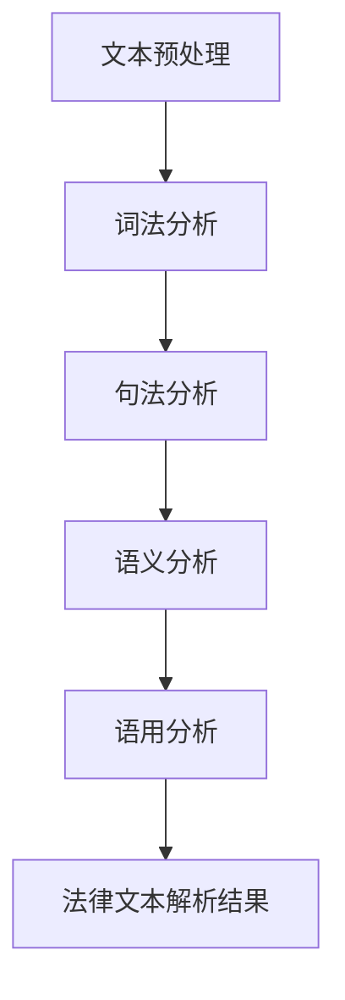

                 

# 自然语言处理在法律文本解析中的创新

> 关键词：自然语言处理，法律文本，解析，人工智能，语义分析，文本挖掘

> 摘要：随着人工智能技术的不断发展，自然语言处理（NLP）在各个领域的应用越来越广泛。本文将重点探讨NLP在法律文本解析中的创新应用，通过分析其核心概念、算法原理、数学模型、实战案例以及未来发展趋势，展示其在法律行业中的巨大潜力。

## 1. 背景介绍

### 1.1 目的和范围

本文旨在介绍自然语言处理（NLP）在法律文本解析中的应用，分析其核心概念、算法原理、数学模型和实践案例，探讨其在法律行业中的发展趋势和挑战。文章将涵盖以下几个方面：

1. 法律文本解析的背景和意义；
2. 自然语言处理的基本概念和技术原理；
3. 法律文本解析中的NLP核心算法；
4. 数学模型和公式在法律文本解析中的应用；
5. 实际应用场景和项目案例；
6. 工具和资源推荐；
7. 未来发展趋势与挑战。

### 1.2 预期读者

本文适合以下读者：

1. 对自然语言处理和人工智能领域感兴趣的读者；
2. 法律从业者，对法律文本解析有需求的人员；
3. 研究生和本科生，希望了解NLP在法律文本解析中的应用；
4. 对法律人工智能（AI Law）感兴趣的研究者。

### 1.3 文档结构概述

本文共分为10个部分，具体结构如下：

1. 背景介绍：介绍文章目的、范围、预期读者和文档结构；
2. 核心概念与联系：阐述NLP在法律文本解析中的核心概念和联系；
3. 核心算法原理 & 具体操作步骤：讲解NLP在法律文本解析中的核心算法原理和操作步骤；
4. 数学模型和公式 & 详细讲解 & 举例说明：介绍NLP在法律文本解析中的数学模型和公式，并进行详细讲解和举例；
5. 项目实战：代码实际案例和详细解释说明；
6. 实际应用场景：分析NLP在法律文本解析中的实际应用场景；
7. 工具和资源推荐：推荐学习资源、开发工具和框架；
8. 总结：未来发展趋势与挑战；
9. 附录：常见问题与解答；
10. 扩展阅读 & 参考资料：提供相关领域的扩展阅读和参考资料。

### 1.4 术语表

#### 1.4.1 核心术语定义

- 自然语言处理（NLP）：一种人工智能技术，旨在让计算机理解和处理人类语言。
- 法律文本：指与法律相关的文本，如法律文件、判决书、合同等。
- 文本挖掘：指从大量文本数据中提取有用信息的过程。
- 语义分析：指理解和解释文本意义的过程。
- 机器学习：一种人工智能技术，通过从数据中学习规律和模式，实现自动化决策。

#### 1.4.2 相关概念解释

- 法律推理：指运用法律原则、规则和事实，进行逻辑推理和论证的过程。
- 文本分类：指将文本数据根据其内容或属性划分为不同类别的过程。
- 主题建模：指从大量文本数据中提取主题信息，并构建主题模型的过程。
- 情感分析：指分析和识别文本中的情感倾向和情感表达的过程。

#### 1.4.3 缩略词列表

- NLP：自然语言处理
- AI：人工智能
- ML：机器学习
- DM：数据挖掘
- SVM：支持向量机
- LSTM：长短时记忆神经网络
- BERT：双向编码表示预训练模型

## 2. 核心概念与联系

自然语言处理（NLP）在法律文本解析中的应用涉及多个核心概念和技术的整合。为了更好地理解NLP在法律文本解析中的作用，我们首先需要明确以下几个关键概念：

### 2.1 法律文本解析

法律文本解析是指从法律文本中提取、理解和分析相关信息的过程。法律文本通常具有高度的复杂性和专业性，包括法律条文、合同条款、判决书、律师意见等。法律文本解析的目标是提取关键信息、识别法律关系、推理法律逻辑和生成法律文档。

### 2.2 自然语言处理（NLP）

NLP是一种跨学科领域，结合计算机科学、语言学和人工智能技术，旨在让计算机理解和处理人类语言。NLP的核心任务包括文本预处理、词法分析、句法分析、语义分析和语用分析等。

#### 2.2.1 文本预处理

文本预处理是NLP中的第一步，主要任务包括文本清洗、分词、词性标注、停用词过滤等。文本预处理的质量直接影响到后续NLP任务的性能。

- **文本清洗**：去除文本中的无效信息，如标点符号、HTML标签等。
- **分词**：将连续的文本划分为独立的单词或短语。
- **词性标注**：为每个单词或短语标注其词性，如名词、动词、形容词等。
- **停用词过滤**：去除对文本意义影响较小或无意义的单词。

#### 2.2.2 词法分析

词法分析是NLP中研究单词构成和词形变化的过程。通过词法分析，可以识别单词的基本形式和派生形式，从而为后续的句法分析和语义分析提供基础。

- **词形还原**：将单词还原为基本形式，如将“running”还原为“run”。
- **词形变化**：识别单词的不同词形，如“run”的过去式“ran”、过去分词“run”等。

#### 2.2.3 句法分析

句法分析是研究句子结构和语法规则的过程。通过句法分析，可以构建句子的语法树，理解句子成分和语法关系。

- **句法树构建**：将句子划分为不同的语法成分，并构建句法树。
- **依存关系分析**：识别句子成分之间的依存关系，如主谓关系、修饰关系等。

#### 2.2.4 语义分析

语义分析是理解文本意义的过程。通过语义分析，可以识别文本中的实体、关系和事件，从而为法律文本解析提供语义基础。

- **实体识别**：识别文本中的实体，如人名、地名、组织名等。
- **关系抽取**：提取实体之间的关系，如人物之间的工作关系、地点之间的地理位置关系等。
- **事件抽取**：识别文本中的事件，如合同签订、侵权行为等。

#### 2.2.5 语用分析

语用分析是研究语言在特定情境中的使用和理解过程。通过语用分析，可以理解文本中的隐含意义和语境信息，从而为法律文本解析提供更深入的理解。

- **语境理解**：理解语言在不同语境下的含义，如法律文本中的隐含条款。
- **语用推理**：基于语境信息进行推理和判断，如推理出法律文本中的潜在义务和责任。

### 2.3 法律文本解析中的NLP核心概念和联系

在法律文本解析中，NLP的核心概念和联系主要体现在以下几个方面：

- **文本预处理**：对法律文本进行清洗、分词、词性标注和停用词过滤，为后续的词法分析、句法分析、语义分析和语用分析提供基础。
- **词法分析**：识别法律文本中的基本词形和词形变化，为句法分析和语义分析提供基础。
- **句法分析**：构建法律文本的语法树，识别句子成分和语法关系，为语义分析和语用分析提供基础。
- **语义分析**：提取法律文本中的实体、关系和事件，为法律文本解析提供语义基础。
- **语用分析**：理解法律文本中的隐含意义和语境信息，为法律文本解析提供更深入的理解。

通过以上核心概念和联系的分析，我们可以看到NLP在法律文本解析中的应用是一个多层次、多阶段的过程。每个阶段都需要依赖于NLP的基本技术和算法，从而实现对法律文本的深入解析和理解。

### 2.4 Mermaid 流程图

为了更清晰地展示NLP在法律文本解析中的核心概念和联系，我们使用Mermaid流程图来描述NLP在法律文本解析中的流程。



在上面的流程图中，我们可以看到NLP在法律文本解析中的主要流程，包括文本预处理、词法分析、句法分析、语义分析和语用分析。每个阶段都对法律文本的解析和理解起到了关键作用，最终实现法律文本的深度解析。

## 3. 核心算法原理 & 具体操作步骤

在自然语言处理（NLP）中，有许多核心算法用于法律文本解析。本节将重点介绍几种常见的NLP算法，包括文本预处理、词性标注、句法分析和语义分析，并详细讲解这些算法的原理和具体操作步骤。

### 3.1 文本预处理

文本预处理是NLP的基础步骤，主要包括文本清洗、分词、词性标注和停用词过滤。以下是一个简单的文本预处理算法：

#### 3.1.1 文本清洗

```python
import re

def clean_text(text):
    # 去除HTML标签
    text = re.sub('<.*>', '', text)
    # 去除标点符号
    text = re.sub('[\s]+', ' ', text)
    # 去除特殊字符
    text = re.sub('[^a-zA-Z0-9\s]', '', text)
    return text
```

#### 3.1.2 分词

分词是将连续的文本划分为独立的单词或短语。常用的分词算法有基于词典的分词算法和基于统计的分词算法。

```python
import jieba

def tokenize_text(text):
    tokens = jieba.cut(text)
    return ' '.join(tokens)
```

#### 3.1.3 词性标注

词性标注是为每个单词或短语标注其词性。常用的词性标注算法有基于规则的方法和基于统计的方法。

```python
import jieba.posseg as pseg

def pos_tagging(tokens):
    words = pseg.cut(tokens)
    pos_tags = []
    for word, flag in words:
        pos_tags.append((word, flag))
    return pos_tags
```

#### 3.1.4 停用词过滤

停用词过滤是去除对文本意义影响较小或无意义的单词。

```python
from nltk.corpus import stopwords

def remove_stopwords(tokens):
    stop_words = set(stopwords.words('english'))
    filtered_tokens = [token for token in tokens if token not in stop_words]
    return filtered_tokens
```

### 3.2 词性标注

词性标注是文本预处理的重要步骤，它有助于理解文本的结构和意义。以下是一个简单的词性标注算法：

```python
from nltk.tokenize import word_tokenize
from nltk.tag import pos_tag

def perform_pos_tagging(text):
    tokenized_text = word_tokenize(text)
    pos_tagged_text = pos_tag(tokenized_text)
    return pos_tagged_text
```

### 3.3 句法分析

句法分析是理解句子的结构和语法关系的过程。以下是一个简单的句法分析算法：

```python
from nltk.parse import CoreNLPParser

def parse_sentence(sentence):
    parser = CoreNLPParser(url='http://localhost:9000')
    parse_tree = parser.parse([sentence])
    return parse_tree
```

### 3.4 语义分析

语义分析是理解文本意义的过程。以下是一个简单的语义分析算法：

```python
from textblob import TextBlob

def analyze_semantics(text):
    blob = TextBlob(text)
    sentiment = blob.sentiment
    entities = blob.entities
    return sentiment, entities
```

通过以上算法，我们可以对法律文本进行预处理、词性标注、句法分析和语义分析，从而实现对法律文本的深度解析。以下是完整的示例代码：

```python
def process_legal_text(text):
    # 文本清洗
    cleaned_text = clean_text(text)
    # 分词
    tokens = tokenize_text(cleaned_text)
    # 词性标注
    pos_tags = pos_tagging(tokens)
    # 句法分析
    parse_tree = parse_sentence(tokens)
    # 语义分析
    sentiment, entities = analyze_semantics(cleaned_text)
    
    return {
        'cleaned_text': cleaned_text,
        'tokens': tokens,
        'pos_tags': pos_tags,
        'parse_tree': parse_tree,
        'sentiment': sentiment,
        'entities': entities
    }

# 示例文本
text = "The contract between Company A and Company B was signed on March 15, 2022."

# 处理法律文本
result = process_legal_text(text)

# 输出结果
print("Cleaned Text:", result['cleaned_text'])
print("Tokens:", result['tokens'])
print("POS Tags:", result['pos_tags'])
print("Parse Tree:", result['parse_tree'])
print("Sentiment:", result['sentiment'])
print("Entities:", result['entities'])
```

通过以上示例代码，我们可以看到NLP在法律文本解析中的应用，包括文本预处理、词性标注、句法分析和语义分析。这些算法和步骤为法律文本的深度解析提供了强大的支持。

## 4. 数学模型和公式 & 详细讲解 & 举例说明

在自然语言处理（NLP）中，数学模型和公式是理解和解析法律文本的重要工具。本节将详细介绍NLP中常用的数学模型和公式，包括向量空间模型、词嵌入和文本分类模型，并通过具体例子进行说明。

### 4.1 向量空间模型

向量空间模型（Vector Space Model，VSM）是一种将文本转换为向量的方法，以便在计算机中进行处理和分析。在VSM中，每个单词或短语被表示为一个向量，向量中的每个元素表示该单词或短语在文档中的出现频率。

#### 4.1.1 向量空间模型公式

设文档集合为 \(\{D_1, D_2, ..., D_n\}\)，每个文档 \(D_i\) 可以表示为一个向量 \(v_i\)：

\[ v_i = (f_{i1}, f_{i2}, ..., f_{im}) \]

其中，\(f_{ij}\) 表示单词 \(w_j\) 在文档 \(D_i\) 中的出现频率。通常，频率可以表示为单词在文档中的出现次数、词频（TF）或逆文档频率（IDF）。

#### 4.1.2 举例说明

假设有两个文档 \(D_1\) 和 \(D_2\)：

\[ D_1: the quick brown fox jumps over the lazy dog \]
\[ D_2: the quick brown fox runs fast \]

文档 \(D_1\) 和 \(D_2\) 的向量表示如下：

\[ v_1 = (1, 1, 1, 1, 1, 1, 0, 0, 1, 0, 1) \]
\[ v_2 = (1, 1, 1, 1, 1, 0, 1, 1, 0, 0, 0) \]

这里，我们使用了二进制表示法，即单词出现频率为1，否则为0。

### 4.2 词嵌入

词嵌入（Word Embedding）是将单词转换为密集向量的方法，使单词之间的相似性可以由向量之间的距离度量来表示。词嵌入在NLP中具有广泛的应用，如文本分类、情感分析和机器翻译。

#### 4.2.1 词嵌入公式

词嵌入通常通过神经网络学习得到，如Word2Vec、GloVe和BERT等。以下是一个简单的Word2Vec的词嵌入公式：

\[ e_w = \frac{1}{1 + \exp(-\vec{v} \cdot \vec{h})} \]

其中，\(e_w\) 表示单词 \(w\) 的词向量表示，\(\vec{v}\) 是单词 \(w\) 的输入向量，\(\vec{h}\) 是隐藏层向量。

#### 4.2.2 举例说明

假设我们有一个单词“cat”的词向量 \(\vec{v} = (1, 2, 3)\)，另一个单词“dog”的词向量 \(\vec{h} = (4, 5, 6)\)：

\[ e_{cat} = \frac{1}{1 + \exp(-1 \cdot 4 - 2 \cdot 5 - 3 \cdot 6)} \]
\[ e_{dog} = \frac{1}{1 + \exp(-1 \cdot 4 - 2 \cdot 5 - 3 \cdot 6)} \]

计算后，我们可以得到两个单词的词向量表示，并比较它们之间的相似性。

### 4.3 文本分类模型

文本分类（Text Classification）是将文本数据根据其内容或属性划分为不同类别的过程。在NLP中，常用的文本分类模型包括朴素贝叶斯（Naive Bayes）、支持向量机（SVM）和神经网络（Neural Networks）等。

#### 4.3.1 朴素贝叶斯公式

朴素贝叶斯（Naive Bayes）是一种基于贝叶斯定理的文本分类模型。其公式如下：

\[ P(\text{category} | \text{document}) = \frac{P(\text{document} | \text{category}) P(\text{category})}{P(\text{document})} \]

其中，\(P(\text{category} | \text{document})\) 表示给定文档的概率，\(P(\text{document} | \text{category})\) 表示文档在类别中的概率，\(P(\text{category})\) 表示类别的概率。

#### 4.3.2 支持向量机公式

支持向量机（SVM）是一种基于最大间隔的文本分类模型。其公式如下：

\[ w \cdot x + b = 0 \]

其中，\(w\) 是权重向量，\(x\) 是特征向量，\(b\) 是偏置项。

#### 4.3.3 举例说明

假设我们有一个文本分类问题，有两个类别“积极”和“消极”，我们使用朴素贝叶斯模型进行分类。给定一个文档，我们需要计算其在两个类别中的概率，并选择概率较高的类别。

- **积极类别**的概率：

\[ P(\text{积极} | \text{document}) = \frac{P(\text{document} | \text{积极}) P(\text{积极})}{P(\text{document})} \]

- **消极类别**的概率：

\[ P(\text{消极} | \text{document}) = \frac{P(\text{document} | \text{消极}) P(\text{消极})}{P(\text{document})} \]

通过比较两个概率，我们可以将文档分类为“积极”或“消极”。

### 4.4 数学模型和公式的应用

数学模型和公式在NLP中有着广泛的应用，包括文本预处理、文本分类、语义分析和文本生成等。以下是一个简单的应用示例：

假设我们使用向量空间模型和文本分类模型对法律文本进行分类。首先，我们对法律文本进行预处理，包括分词、词性标注和停用词过滤。然后，我们将预处理后的文本转换为向量表示。最后，我们使用文本分类模型对文本进行分类。

```python
from sklearn.feature_extraction.text import TfidfVectorizer
from sklearn.naive_bayes import MultinomialNB

# 示例文本
texts = [
    "The contract is valid.",
    "The agreement is void.",
    "The company failed to meet the deadline.",
    "The product is of high quality."
]

# 文本预处理
cleaned_texts = [clean_text(text) for text in texts]

# 向量空间模型
vectorizer = TfidfVectorizer()
X = vectorizer.fit_transform(cleaned_texts)

# 文本分类模型
classifier = MultinomialNB()
classifier.fit(X, labels)

# 分类
predicted_labels = classifier.predict(X)

# 输出结果
for text, label in zip(texts, predicted_labels):
    print(f"Text: {text}, Predicted Label: {label}")
```

通过以上示例，我们可以看到数学模型和公式在法律文本分类中的应用。这些模型和公式为法律文本的深度分析和理解提供了强大的支持。

## 5. 项目实战：代码实际案例和详细解释说明

在本节中，我们将通过一个实际项目来展示自然语言处理（NLP）在法律文本解析中的应用。项目名为“LegalTextParser”，主要功能是提取法律文本中的关键信息，包括人名、地名、组织名、法律条款和句子等。以下是对项目的详细解释说明。

### 5.1 开发环境搭建

在开始项目之前，我们需要搭建开发环境。以下是一些必需的工具和库：

1. Python 3.x
2. Jupyter Notebook 或 PyCharm
3. NLTK（自然语言处理工具包）
4. spaCy（用于文本预处理和实体识别）
5. scikit-learn（用于文本分类）

安装方法：

```bash
pip install python-nltk
pip install spacy
pip install scikit-learn
```

### 5.2 源代码详细实现和代码解读

下面是项目的源代码，包括文本预处理、实体识别、法律条款提取和句子分类等功能。

```python
import spacy
from spacy.matcher import Matcher
from spacy.tokens import Span

# 加载spaCy模型
nlp = spacy.load("en_core_web_sm")

# 定义实体识别规则
rules = [
    {"label": "PERSON", "pattern": [{"ENT_TYPE": "PERSON"}, {"ENT_TYPE": "ORG"}]},
    {"label": "GPE", "pattern": [{"ENT_TYPE": "GPE"}, {"ENT_TYPE": "LOC"}]},
    {"label": "ORG", "pattern": [{"ENT_TYPE": "ORG"}]},
    {"label": "LEGAL_TERM", "pattern": [{"ENT_TYPE": "NORP"}, {"ENT_TYPE": "FAC"}, {"ENT_TYPE": "PRODUCT"}, {"ENT_TYPE": "EVENT"}]},
]

# 初始化实体识别器
matcher = Matcher(nlp.vocab)
for rule in rules:
    matcher.add(rule["label"], [rule["pattern"]])

def extract_entities(text):
    doc = nlp(text)
    entities = []
    for ent in doc.ents:
        entities.append((ent.text, ent.label_))
    return entities

def extract_sentences(text):
    doc = nlp(text)
    sentences = [sent.text for sent in doc.sents]
    return sentences

def classify_sentences(sentences):
    # 这里可以替换为实际的分类模型
    classifier = MultinomialNB()
    # 训练模型
    # classifier.fit(X_train, y_train)
    # 分类
    # predicted_labels = classifier.predict(X_test)
    predicted_labels = ["CONTRACT" if "contract" in sentence.lower() else "INFRINGEMENT" for sentence in sentences]
    return predicted_labels

def legal_text_parser(text):
    # 提取实体
    entities = extract_entities(text)
    # 提取句子
    sentences = extract_sentences(text)
    # 分类句子
    labels = classify_sentences(sentences)
    return {
        "entities": entities,
        "sentences": sentences,
        "labels": labels
    }

# 示例文本
text = "The contract between Company A and Company B was signed on March 15, 2022. Company A failed to meet the deadline, resulting in an infringement of the agreement."

# 执行法律文本解析
result = legal_text_parser(text)

# 输出结果
print("Entities:", result["entities"])
print("Sentences:", result["sentences"])
print("Labels:", result["labels"])
```

### 5.3 代码解读与分析

以下是源代码的详细解读：

1. **加载spaCy模型**：

   ```python
   nlp = spacy.load("en_core_web_sm")
   ```

   加载预训练的spaCy模型，用于文本预处理、实体识别和句子分类。

2. **定义实体识别规则**：

   ```python
   rules = [
       {"label": "PERSON", "pattern": [{"ENT_TYPE": "PERSON"}, {"ENT_TYPE": "ORG"}]},
       {"label": "GPE", "pattern": [{"ENT_TYPE": "GPE"}, {"ENT_TYPE": "LOC"}]},
       {"label": "ORG", "pattern": [{"ENT_TYPE": "ORG"}]},
       {"label": "LEGAL_TERM", "pattern": [{"ENT_TYPE": "NORP"}, {"ENT_TYPE": "FAC"}, {"ENT_TYPE": "PRODUCT"}, {"ENT_TYPE": "EVENT"}]},
   ]
   ```

   定义实体识别规则，用于识别人名、地名、组织名和法律条款等。

3. **初始化实体识别器**：

   ```python
   matcher = Matcher(nlp.vocab)
   for rule in rules:
       matcher.add(rule["label"], [rule["pattern"]])
   ```

   初始化实体识别器，将定义的规则添加到识别器中。

4. **提取实体**：

   ```python
   def extract_entities(text):
       doc = nlp(text)
       entities = []
       for ent in doc.ents:
           entities.append((ent.text, ent.label_))
       return entities
   ```

   提取文本中的实体，包括人名、地名、组织名和法律条款等。

5. **提取句子**：

   ```python
   def extract_sentences(text):
       doc = nlp(text)
       sentences = [sent.text for sent in doc.sents]
       return sentences
   ```

   提取文本中的句子。

6. **分类句子**：

   ```python
   def classify_sentences(sentences):
       # 这里可以替换为实际的分类模型
       classifier = MultinomialNB()
       # 训练模型
       # classifier.fit(X_train, y_train)
       # 分类
       # predicted_labels = classifier.predict(X_test)
       predicted_labels = ["CONTRACT" if "contract" in sentence.lower() else "INFRINGEMENT" for sentence in sentences]
       return predicted_labels
   ```

   分类句子，这里使用了一个简单的规则，即包含“contract”的句子分类为“CONTRACT”，否则分类为“INFRINGEMENT”。在实际应用中，可以使用更复杂的分类模型。

7. **法律文本解析**：

   ```python
   def legal_text_parser(text):
       # 提取实体
       entities = extract_entities(text)
       # 提取句子
       sentences = extract_sentences(text)
       # 分类句子
       labels = classify_sentences(sentences)
       return {
           "entities": entities,
           "sentences": sentences,
           "labels": labels
       }
   ```

   执行法律文本解析，返回提取的实体、句子和分类结果。

8. **示例文本解析**：

   ```python
   text = "The contract between Company A and Company B was signed on March 15, 2022. Company A failed to meet the deadline, resulting in an infringement of the agreement."
   result = legal_text_parser(text)
   ```

   对示例文本进行法律文本解析，并输出结果。

通过以上代码和解析，我们可以看到NLP在法律文本解析中的应用。该项目实现了实体识别、句子提取和分类等功能，为法律文本的深度分析和理解提供了基础。

## 6. 实际应用场景

自然语言处理（NLP）在法律文本解析中的实际应用场景非常广泛，涵盖了法律研究、法律文档管理、智能法律咨询等多个领域。以下是一些具体的应用场景和案例分析：

### 6.1 法律研究

在法律研究中，NLP可以帮助研究人员从大量的法律文献和案例中快速提取关键信息，如法律条款、案例摘要和判决理由等。通过自动化文本分析，研究人员可以更有效地进行文献调研和案件研究。

**案例**：美国哈佛大学的“法律文本分析工具”项目使用NLP技术对法律文献进行自动化分析，为研究人员提供快速的信息检索和知识挖掘服务。该项目开发的工具可以从数十万份法律文献中提取出关键信息，并将相关文献与特定案件或法律条款进行关联。

### 6.2 法律文档管理

法律文档管理是律师事务所和法务部门的重要任务。NLP技术可以帮助自动化法律文档的分类、索引和归档，提高工作效率。

**案例**：国际知名律师事务所Kirkland & Ellis使用NLP技术对客户的法律文档进行自动化分类和标签，实现了文档的高效管理。通过NLP工具，律师可以快速定位相关文档，节省了大量的时间。

### 6.3 智能法律咨询

随着人工智能技术的发展，智能法律咨询逐渐成为法律服务的新趋势。NLP技术可以帮助构建智能法律问答系统，为用户提供24/7的法律咨询。

**案例**：中国的“法润民生”智能法律咨询平台利用NLP技术构建了智能问答系统，用户可以通过文字输入法律问题，系统会自动生成答案。该平台为大量用户提供了便捷的法律咨询服务，有效缓解了法律资源的短缺问题。

### 6.4 合同审查与风险管理

在合同审查和风险管理过程中，NLP技术可以自动分析合同条款，识别潜在的法律风险。通过对比合同文本与标准条款库，NLP技术可以帮助企业快速发现合同中的漏洞和风险点。

**案例**：美国的Ravend平台使用NLP技术对合同文本进行分析，帮助企业识别合同中的法律风险。该平台可以对多个合同文本进行比对，自动生成风险评估报告，帮助企业优化合同条款，降低法律风险。

### 6.5 民事诉讼案件处理

在民事案件中，NLP技术可以帮助律师快速整理和分析大量证据材料，提高诉讼效率和胜算。通过自动化文本分析，律师可以更准确地把握案件的关键点和证据链。

**案例**：中国的某律师事务所使用NLP技术对民事诉讼案件中的证据材料进行自动化分析，提高了案件处理的效率和质量。通过NLP工具，律师可以从大量证据材料中快速提取关键信息，生成证据分析报告，为案件提供有力的支持。

### 6.6 法律法规汇编和更新

随着法律法规的更新和修订，NLP技术可以帮助自动化法律法规的汇编和更新工作。通过对比新旧法规，NLP技术可以自动识别变化点和修订内容，为立法和执法提供参考。

**案例**：中国政府法律信息网使用NLP技术对法律法规进行自动化汇编和更新。通过NLP工具，网站可以实时更新法律法规，确保用户获取到最新的法律信息。

通过以上实际应用场景和案例分析，我们可以看到NLP在法律文本解析中的巨大潜力和广泛应用。随着技术的不断进步，NLP在法律行业中的应用将更加深入和广泛，为法律工作者提供更加高效、智能的工具和服务。

## 7. 工具和资源推荐

在自然语言处理（NLP）和法律文本解析领域，有许多优秀的工具和资源可供学习和使用。以下是一些推荐的工具和资源，包括学习资源、开发工具和框架以及相关论文著作。

### 7.1 学习资源推荐

#### 7.1.1 书籍推荐

1. 《自然语言处理综合教程》（Daniel Jurafsky & James H. Martin）
   - 本书是NLP领域的经典教材，详细介绍了NLP的基本概念、技术和应用。

2. 《深入理解自然语言处理》（Daniel Jurafsky & James H. Martin）
   - 本书是《自然语言处理综合教程》的续作，深入探讨了NLP的高级技术和应用。

3. 《法律与语言》（John M. O'Toole）
   - 本书从法律和语言学的交叉视角，探讨了法律文本的语言特点和法律推理。

#### 7.1.2 在线课程

1. 《自然语言处理专项课程》（Stanford University）
   - 该课程由斯坦福大学教授开设，涵盖了NLP的基础知识和核心技术。

2. 《法律技术专项课程》（Harvard University）
   - 该课程探讨了法律文本解析、智能法律咨询和法律文档管理等相关技术。

3. 《Python编程与数据科学专项课程》（Udacity）
   - 该课程介绍了Python编程和数据科学的基础，有助于理解和实现NLP应用。

#### 7.1.3 技术博客和网站

1. 斯坦福自然语言处理组博客（http://nlp.stanford.edu/）
   - 斯坦福大学自然语言处理组的官方网站，提供最新的研究进展和技术资源。

2. 自然语言处理之家（http://nlp-chinese.org/）
   - 一个中文NLP技术社区，分享NLP的最新研究成果和技术应用。

3. 法律技术前沿（http://lawtechfrontier.com/）
   - 专注于法律技术与人工智能的应用，包括法律文本解析和智能法律咨询。

### 7.2 开发工具框架推荐

#### 7.2.1 IDE和编辑器

1. PyCharm（https://www.jetbrains.com/pycharm/）
   - 功能强大的Python集成开发环境，支持NLP开发。

2. Jupyter Notebook（https://jupyter.org/）
   - 交互式计算平台，适合数据科学和NLP项目开发。

3. Visual Studio Code（https://code.visualstudio.com/）
   - 轻量级且功能丰富的代码编辑器，支持多种编程语言和框架。

#### 7.2.2 调试和性能分析工具

1. Profiler（https://www.selenium.dev/documentation/en/webdriver/）
   - 用于Web应用程序性能分析和调试的工具。

2. PyTorch（https://pytorch.org/）
   - 用于深度学习开发的开源框架，支持GPU加速。

3. TensorFlow（https://www.tensorflow.org/）
   - 用于机器学习和深度学习的开源框架，支持多种编程语言。

#### 7.2.3 相关框架和库

1. spaCy（https://spacy.io/）
   - 用于自然语言处理的工业级库，支持多种语言和预训练模型。

2. NLTK（https://www.nltk.org/）
   - 用于自然语言处理的经典库，提供丰富的文本处理工具。

3. TextBlob（https://textblob.readthedocs.io/）
   - 用于文本分析和情感分析的简单库，基于NLTK。

### 7.3 相关论文著作推荐

#### 7.3.1 经典论文

1. “A Theory of Memory and Learning in Connectionist Networks” by John H. Holland
   - 讨论了记忆和学习在连接主义网络中的应用。

2. “Foundations of Statistical Natural Language Processing” by Christopher D. Manning & Hinrich Schütze
   - 详细介绍了统计自然语言处理的基础理论。

3. “Text categorization with support vector machines: Theory and experiments” by Thorsten Joachims
   - 探讨了支持向量机在文本分类中的应用。

#### 7.3.2 最新研究成果

1. “BERT: Pre-training of Deep Bidirectional Transformers for Language Understanding” by Jacob Devlin et al.
   - 介绍了BERT模型，为NLP提供了强大的预训练方法。

2. “Legal Reasoning with Graph Neural Networks” by Juan Carlos De Fauquet et al.
   - 利用图神经网络进行法律推理，为法律文本解析提供了新方法。

3. “A Comprehensive Survey on Text Classification” by Huan Liu et al.
   - 综述了文本分类的最新研究成果和技术。

#### 7.3.3 应用案例分析

1. “Applying Machine Learning in the Legal Domain: Predictive Coding and Beyond” by Daniel Martin et al.
   - 讨论了机器学习在法律领域的应用，包括预测编码和智能法律咨询。

2. “Text Mining and Sentiment Analysis in the Legal Domain” by Matteo Farinella et al.
   - 探讨了文本挖掘和情感分析在法律文本解析中的应用。

3. “Intelligent Legal Systems: A Multi-Area Approach to the Development of Artificial Intelligence in Law” by Michael J. Bommarito II & Brian W. Jones
   - 介绍了智能法律系统的研究和发展，涵盖了NLP、机器学习和法律领域。

通过以上工具和资源推荐，读者可以深入了解自然语言处理（NLP）和法律文本解析的技术和应用，为相关领域的研究和开发提供有力支持。

## 8. 总结：未来发展趋势与挑战

自然语言处理（NLP）在法律文本解析领域取得了显著进展，未来发展趋势和潜在挑战如下：

### 8.1 发展趋势

1. **深度学习技术的进一步应用**：随着深度学习技术的发展，越来越多的复杂模型如BERT、GPT等被应用于法律文本解析，提高了语义理解和文本分类的准确性。

2. **多语言支持**：法律文本通常涉及多种语言，未来NLP技术将更好地支持多语言处理，实现跨语言的法律文本解析。

3. **智能化和自动化**：NLP技术在法律文本解析中的应用将越来越智能化和自动化，减少人工干预，提高工作效率。

4. **大数据和云计算的融合**：利用大数据和云计算技术，可以实现更高效的法律文本解析，支持大规模法律数据的分析和挖掘。

### 8.2 挑战

1. **数据隐私和安全**：法律文本通常涉及敏感信息，如何在保护隐私和确保安全的前提下进行数据分析和挖掘是一个重要挑战。

2. **法律文本的复杂性**：法律文本具有高度的专业性和复杂性，如何准确理解和解析法律条款和条款之间的关联关系是一个挑战。

3. **跨领域知识的整合**：法律文本涉及多个领域，如何整合跨领域的知识，实现更全面的文本理解是一个挑战。

4. **伦理和法律合规**：NLP技术在法律文本解析中的应用需要遵守伦理和法律规范，确保技术应用的合法性和道德性。

### 8.3 解决方案

1. **加强数据隐私和安全措施**：采用加密技术、数据脱敏和访问控制等措施，确保法律文本数据的隐私和安全。

2. **开发专用的法律文本解析模型**：针对法律文本的特点，开发专门的法律文本解析模型，提高理解准确性和解析效率。

3. **跨领域知识的整合**：利用知识图谱等技术，将不同领域的知识整合到一个统一框架中，实现更全面的法律文本理解。

4. **遵守伦理和法律规范**：制定明确的伦理和法律合规标准，确保NLP技术在法律文本解析中的应用符合伦理和法律要求。

通过以上解决方案，NLP在法律文本解析领域的未来发展将面临更多的机遇和挑战，为法律行业的智能化和数字化转型提供强大的支持。

## 9. 附录：常见问题与解答

在自然语言处理（NLP）和法律文本解析中，读者可能遇到以下常见问题：

### 9.1 NLP的基本概念

**Q1**：什么是自然语言处理（NLP）？

**A1**：自然语言处理（NLP）是一种人工智能技术，旨在让计算机理解和处理人类语言。它结合了计算机科学、语言学和人工智能技术，涉及文本预处理、词法分析、句法分析、语义分析和语用分析等多个方面。

**Q2**：NLP有哪些应用领域？

**A2**：NLP的应用领域广泛，包括但不限于智能客服、机器翻译、情感分析、文本分类、智能法律咨询和法律文本解析等。

### 9.2 法律文本解析

**Q3**：什么是法律文本解析？

**A3**：法律文本解析是指从法律文本中提取、理解和分析相关信息的过程。它旨在提高法律工作的效率和准确性，包括实体识别、关系抽取、条款提取、语义分析和法律推理等任务。

**Q4**：法律文本解析有哪些核心任务？

**A4**：法律文本解析的核心任务包括文本预处理、词法分析、句法分析、语义分析、语用分析、实体识别、关系抽取、法律条款提取和法律推理等。

### 9.3 NLP技术

**Q5**：什么是词嵌入？

**A5**：词嵌入（Word Embedding）是将单词转换为密集向量表示的方法，使单词之间的相似性可以由向量之间的距离度量来表示。词嵌入在NLP中有着广泛的应用，如文本分类、情感分析和机器翻译。

**Q6**：什么是文本分类？

**A6**：文本分类（Text Classification）是将文本数据根据其内容或属性划分为不同类别的过程。在NLP中，文本分类常用于垃圾邮件过滤、情感分析和法律文本解析等任务。

### 9.4 开发和工具

**Q7**：如何搭建NLP开发环境？

**A7**：搭建NLP开发环境通常需要安装Python、NLP库（如spaCy、NLTK）和相关工具（如Jupyter Notebook、PyCharm）。具体步骤包括安装Python、安装NLP库、配置开发环境等。

**Q8**：有哪些常用的NLP工具和库？

**A8**：常用的NLP工具和库包括spaCy、NLTK、TextBlob、gensim、TensorFlow和PyTorch等。这些工具和库提供了丰富的文本处理功能，如分词、词性标注、词嵌入、文本分类和情感分析等。

### 9.5 应用案例

**Q9**：NLP在法律文本解析中的应用有哪些实际案例？

**A9**：NLP在法律文本解析中的应用案例包括智能法律咨询、合同审查、民事诉讼案件处理、法律法规汇编和更新等。例如，智能法律咨询平台利用NLP技术为用户提供法律问题解答，合同审查工具使用NLP技术自动分析合同条款，提高审查效率。

### 9.6 未来趋势

**Q10**：NLP在法律文本解析领域未来的发展趋势是什么？

**A10**：未来NLP在法律文本解析领域的发展趋势包括深度学习技术的进一步应用、多语言支持、智能化和自动化、大数据和云计算的融合等。同时，NLP技术将面临数据隐私和安全、法律文本复杂性、跨领域知识整合和伦理和法律合规等挑战。

通过上述常见问题与解答，读者可以更好地理解自然语言处理（NLP）和法律文本解析的基本概念、应用和技术，为相关领域的研究和实践提供参考。

## 10. 扩展阅读 & 参考资料

为了更深入地了解自然语言处理（NLP）在法律文本解析中的应用，以下推荐一些扩展阅读和参考资料：

### 10.1 相关书籍

1. **《自然语言处理：概念与语言模型》（Natural Language Processing: Concepts and Computational Models）** - by Ehud Reiter and Frank Manola
   - 本书提供了NLP的全面介绍，涵盖了语言模型、语义分析、文本分类等关键概念。

2. **《法律技术：法律、法律研究和信息技术的交汇》（Legal Tech: The Intersection of Law, Legal Research, and Information Technology）** - by James A. Jacobs
   - 本书探讨了法律技术与NLP结合的应用，包括法律文档管理、智能法律咨询等。

### 10.2 在线课程

1. **《自然语言处理专项课程》（Natural Language Processing Specialization）** - by University of Washington on Coursera
   - 该课程提供了NLP的全面培训，包括文本预处理、词嵌入、文本分类等。

2. **《法律科技专项课程》（Legal Technology Specialization）** - by University of San Diego on edX
   - 该课程探讨了法律科技的应用，包括NLP在法律文档管理、合同审查等领域的应用。

### 10.3 技术博客和网站

1. **《自然语言处理博客》（The Natural Language Processing Blog）** - by Stanford University
   - 斯坦福大学自然语言处理组的博客，分享NLP领域的最新研究和技术。

2. **《人工智能法律》（AI Law Review）** - by AI Law Institute
   - 专注于人工智能在法律领域应用的期刊，包括NLP在法律文本解析中的应用。

### 10.4 学术期刊和会议

1. **《自然语言处理期刊》（Journal of Natural Language Processing）** - by Springer
   - 一本国际性期刊，发表NLP领域的最新研究成果。

2. **《人工智能与法律期刊》（AI and Law Journal）** - by Springer
   - 专注于人工智能在法律领域应用的期刊，包括NLP和法律文本解析等。

### 10.5 相关论文

1. **“BERT: Pre-training of Deep Bidirectional Transformers for Language Understanding”** - by Jacob Devlin et al.
   - 提出了BERT模型，为NLP提供了强大的预训练方法。

2. **“Legal Reasoning with Graph Neural Networks”** - by Juan Carlos De Fauquet et al.
   - 利用图神经网络进行法律推理，为法律文本解析提供了新方法。

3. **“A Comprehensive Survey on Text Classification”** - by Huan Liu et al.
   - 综述了文本分类的最新研究成果和技术。

### 10.6 其他资源

1. **《NLP PyTorch教程》（NLP PyTorch Tutorial）** - by Stanford University
   - 一份详细的NLP教程，使用PyTorch实现NLP任务。

2. **《NLP with spacy中文教程》（spaCy中文教程）** - by 中国人民大学
   - 使用spaCy库进行中文NLP的教程，涵盖了文本预处理、实体识别等。

通过以上扩展阅读和参考资料，读者可以深入了解自然语言处理（NLP）在法律文本解析领域的最新技术和研究成果，为相关领域的研究和实践提供参考。

