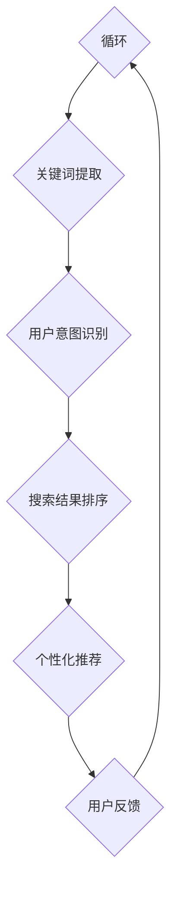

                 

# 自然语言处理在电商搜索中的技术

> **关键词：** 自然语言处理、电商搜索、关键词提取、用户意图识别、推荐系统、深度学习、神经网络、机器学习、算法优化、用户体验

> **摘要：** 本文深入探讨了自然语言处理（NLP）在电商搜索中的应用技术，分析了其核心概念、算法原理、数学模型，并通过实际项目案例展示了如何实现高效的电商搜索。本文旨在为从事电商领域的技术人员提供一个全面的技术指南，以提升电商搜索的准确性和用户体验。

## 1. 背景介绍

### 1.1 目的和范围

本文旨在探讨自然语言处理（NLP）在电商搜索中的应用技术，分析其核心算法原理，并通过实际项目案例展示如何将NLP技术应用到电商搜索系统中，以提高搜索的准确性和用户体验。

### 1.2 预期读者

本文适用于对自然语言处理和电商搜索有一定了解的技术人员，特别是那些希望深入了解NLP在电商搜索中应用的人员。此外，也对希望提升电商搜索系统性能的电商开发者和产品经理有所助益。

### 1.3 文档结构概述

本文结构如下：

1. 背景介绍
   - 目的和范围
   - 预期读者
   - 文档结构概述
   - 术语表

2. 核心概念与联系
   - NLP的基本概念
   - 电商搜索的需求和挑战
   - NLP与电商搜索的关系

3. 核心算法原理 & 具体操作步骤
   - 关键词提取
   - 用户意图识别
   - 推荐系统

4. 数学模型和公式 & 详细讲解 & 举例说明
   - 余弦相似度
   - 贝叶斯公式
   - 梯度下降算法

5. 项目实战：代码实际案例和详细解释说明
   - 开发环境搭建
   - 源代码详细实现和代码解读
   - 代码解读与分析

6. 实际应用场景
   - 电商搜索系统中的NLP应用
   - 搜索引擎优化

7. 工具和资源推荐
   - 学习资源推荐
   - 开发工具框架推荐
   - 相关论文著作推荐

8. 总结：未来发展趋势与挑战
   - 技术发展趋势
   - 挑战与应对策略

9. 附录：常见问题与解答
   - 技术问题解答
   - 应用问题解答

10. 扩展阅读 & 参考资料
    - 进一步阅读资源
    - 参考资料

### 1.4 术语表

#### 1.4.1 核心术语定义

- **自然语言处理（NLP）**：一门研究如何让计算机理解和处理人类自然语言的学科。
- **电商搜索**：用户在电商平台通过输入关键词或描述来查找所需商品的过程。
- **关键词提取**：从用户输入的查询中提取出对搜索意图有指示性的词语。
- **用户意图识别**：根据用户查询和上下文信息，识别用户的真实意图。
- **推荐系统**：基于用户的历史行为和偏好，为其推荐相关商品的系统。

#### 1.4.2 相关概念解释

- **余弦相似度**：衡量两个向量之间夹角的余弦值，用于计算文本相似度。
- **贝叶斯公式**：一种概率计算方法，用于根据已知条件推断未知事件的可能性。
- **梯度下降算法**：一种优化算法，用于最小化损失函数，常用于机器学习模型训练。

#### 1.4.3 缩略词列表

- **NLP**：自然语言处理（Natural Language Processing）
- **SEO**：搜索引擎优化（Search Engine Optimization）
- **ML**：机器学习（Machine Learning）
- **DL**：深度学习（Deep Learning）
- **API**：应用程序编程接口（Application Programming Interface）

## 2. 核心概念与联系

### 2.1 NLP的基本概念

自然语言处理（NLP）是计算机科学与语言学的交叉领域，旨在使计算机能够理解和处理人类语言。NLP包括以下几个核心概念：

- **文本预处理**：包括分词、去停用词、词性标注等，为后续处理打下基础。
- **词嵌入**：将词语转换为固定长度的向量表示，以便进行计算。
- **词向量**：词嵌入的结果，用于表示词语在语义上的相似性和关系。
- **语言模型**：通过统计方法或深度学习方法，预测下一个词语的概率。

### 2.2 电商搜索的需求和挑战

电商搜索系统需要满足以下需求和挑战：

- **高精度**：准确识别用户查询，并提供相关商品。
- **高效率**：快速响应用户查询，提高用户体验。
- **多样性**：处理用户多种查询方式，如关键词、描述、语音等。
- **可扩展性**：支持大量商品和用户，保证系统性能稳定。

### 2.3 NLP与电商搜索的关系

NLP技术为电商搜索提供了以下帮助：

- **关键词提取**：从用户查询中提取关键信息，提高搜索准确性。
- **用户意图识别**：理解用户查询背后的真实意图，提升推荐系统效果。
- **搜索结果排序**：通过词向量相似度和语言模型，优化搜索结果排序。
- **个性化推荐**：基于用户历史行为和偏好，提供个性化搜索和推荐。

### 2.4 Mermaid 流程图

以下是一个简单的Mermaid流程图，展示NLP在电商搜索中的应用流程：



## 3. 核心算法原理 & 具体操作步骤

### 3.1 关键词提取

关键词提取是电商搜索中的关键步骤，其目的是从用户查询中提取出对搜索意图有指示性的词语。以下是关键词提取的基本原理和步骤：

#### 3.1.1 算法原理

- **分词**：将用户查询分解成一个个独立的词语。
- **去停用词**：移除常见的无意义词语，如“的”、“和”、“是”等。
- **词性标注**：为每个词语标注词性，如名词、动词、形容词等。
- **词频统计**：计算每个词语在查询中的出现次数，选取出现频率较高的词语作为关键词。

#### 3.1.2 具体操作步骤

1. **分词**：使用分词工具（如jieba）对用户查询进行分词。
   ```python
   import jieba
   query = "我想买一款高效的咖啡机"
   keywords = jieba.cut(query)
   ```

2. **去停用词**：构建停用词表，并从分词结果中移除停用词。
   ```python
   stop_words = set(['的', '和', '是', '想', '一', '款', '买'])
   keywords = [word for word in keywords if word not in stop_words]
   ```

3. **词性标注**：使用词性标注工具（如NLTK）对词语进行标注。
   ```python
   import nltk
   nltk.download('averaged_perceptron_tagger')
   tagged_keywords = nltk.pos_tag(keywords)
   ```

4. **词频统计**：计算每个词语的出现次数，并选取出现频率较高的词语作为关键词。
   ```python
   from collections import Counter
   keyword_freq = Counter(tagged_keywords)
   top_keywords = [word for word, freq in keyword_freq.most_common(5)]
   ```

### 3.2 用户意图识别

用户意图识别是理解用户查询背后真实意图的过程，对提升推荐系统效果至关重要。以下是用户意图识别的基本原理和步骤：

#### 3.2.1 算法原理

- **基于规则的方法**：使用预定义的规则，根据查询中的关键词和词性来判断用户意图。
- **基于统计的方法**：使用机器学习方法，从大量用户查询和对应的意图标签中学习意图模式。

#### 3.2.2 具体操作步骤

1. **数据准备**：收集大量用户查询和对应的意图标签，用于训练模型。
   ```python
   queries = ["我想买一款高效的咖啡机", "推荐一些性价比高的笔记本电脑"]
   labels = ["商品购买", "商品推荐"]
   ```

2. **特征提取**：将用户查询转换为特征向量，如词嵌入向量、词频向量等。
   ```python
   from gensim.models import Word2Vec
   model = Word2Vec(queries, size=100, window=5, min_count=1, workers=4)
   query_vectors = [model.wv[word] for word in queries]
   ```

3. **模型训练**：使用机器学习方法（如SVM、神经网络等）训练意图识别模型。
   ```python
   from sklearn.svm import SVC
   classifier = SVC()
   classifier.fit(query_vectors, labels)
   ```

4. **意图识别**：根据用户查询，提取特征向量，并使用模型进行意图识别。
   ```python
   def recognize_intent(query):
       vector = model.wv[query]
       intent = classifier.predict([vector])
       return intent
   ```

### 3.3 推荐系统

推荐系统是基于用户历史行为和偏好，为用户推荐相关商品的系统。以下是推荐系统的基本原理和步骤：

#### 3.3.1 算法原理

- **基于内容的推荐**：根据商品的属性和用户的偏好，推荐相似的商品。
- **协同过滤推荐**：根据用户的行为数据，发现用户之间的相似性，为用户推荐其他用户的偏好商品。

#### 3.3.2 具体操作步骤

1. **用户行为数据收集**：收集用户在平台上的行为数据，如浏览、购买、收藏等。
   ```python
   user_actions = {"user1": ["商品A", "商品B", "商品C"], "user2": ["商品B", "商品D", "商品E"]}
   ```

2. **构建用户-商品矩阵**：将用户行为数据转换为用户-商品矩阵，用于后续计算。
   ```python
   from scipy.sparse import lil_matrix
   user_item_matrix = lil_matrix((len(user_actions), len(set().union(*user_actions.values()))))
   for user, items in user_actions.items():
       for item in items:
           user_item_matrix[user, item] = 1
   ```

3. **计算用户相似度**：使用余弦相似度计算用户之间的相似度。
   ```python
   def cosine_similarity(matrix):
       norms = np.linalg.norm(matrix, axis=1)
       dot_products = np.dot(matrix.T, matrix)
       similarity = dot_products / (norms * norms)
       return similarity
   similarity_matrix = cosine_similarity(user_item_matrix)
   ```

4. **为用户推荐商品**：根据用户相似度矩阵，为用户推荐其他用户的偏好商品。
   ```python
   def recommend_items(user_id, similarity_matrix, user_item_matrix, top_n=5):
       user_vector = user_item_matrix[user_id].toarray()
       similarities = similarity_matrix[user_id]
       recommended_items = []
       for i, similarity in enumerate(similarities):
           if similarity > 0.5 and user_item_matrix[i, :].sum() > 0:
               recommended_items.append(i)
       return recommended_items[:top_n]
   ```

## 4. 数学模型和公式 & 详细讲解 & 举例说明

### 4.1 余弦相似度

余弦相似度是计算两个向量之间相似性的常用方法，其公式如下：

$$
\text{Cosine Similarity} = \frac{\vec{A} \cdot \vec{B}}{||\vec{A}|| \cdot ||\vec{B}||}
$$

其中，$\vec{A}$和$\vec{B}$是两个向量，$||\vec{A}||$和$||\vec{B}||$分别是它们的模长，$\vec{A} \cdot \vec{B}$是它们的点积。

#### 举例说明

假设有两个词向量$\vec{A} = (2, 3)$和$\vec{B} = (4, 5)$，则它们的余弦相似度为：

$$
\text{Cosine Similarity} = \frac{2 \cdot 4 + 3 \cdot 5}{\sqrt{2^2 + 3^2} \cdot \sqrt{4^2 + 5^2}} = \frac{8 + 15}{\sqrt{13} \cdot \sqrt{41}} \approx 0.7746
$$

### 4.2 贝叶斯公式

贝叶斯公式是一种概率计算方法，用于根据已知条件推断未知事件的可能性。其公式如下：

$$
P(A|B) = \frac{P(B|A) \cdot P(A)}{P(B)}
$$

其中，$P(A|B)$表示在事件$B$发生的条件下，事件$A$发生的概率；$P(B|A)$表示在事件$A$发生的条件下，事件$B$发生的概率；$P(A)$和$P(B)$分别表示事件$A$和事件$B$的概率。

#### 举例说明

假设有一个诊断测试，用于判断一个人是否感染了某种疾病。已知以下概率：

- 感染疾病的人中，测试结果为阳性的概率为$P(\text{阳性}|\text{疾病}) = 0.9$。
- 未感染疾病的人中，测试结果为阳性的概率为$P(\text{阳性}|\text{无疾病}) = 0.1$。
- 感染疾病的概率为$P(\text{疾病}) = 0.01$。

要求计算测试结果为阳性时，感染疾病的概率$P(\text{疾病}|\text{阳性})$。

根据贝叶斯公式：

$$
P(\text{疾病}|\text{阳性}) = \frac{P(\text{阳性}|\text{疾病}) \cdot P(\text{疾病})}{P(\text{阳性})}
$$

其中，$P(\text{阳性})$可以通过全概率公式计算：

$$
P(\text{阳性}) = P(\text{阳性}|\text{疾病}) \cdot P(\text{疾病}) + P(\text{阳性}|\text{无疾病}) \cdot P(\text{无疾病}) = 0.9 \cdot 0.01 + 0.1 \cdot 0.99 = 0.019
$$

代入贝叶斯公式：

$$
P(\text{疾病}|\text{阳性}) = \frac{0.9 \cdot 0.01}{0.019} \approx 0.474
$$

### 4.3 梯度下降算法

梯度下降算法是一种优化算法，用于最小化损失函数。其基本原理是沿着损失函数梯度的反方向更新参数，以逐步减小损失。

#### 4.3.1 算法原理

梯度下降算法的公式如下：

$$
\theta_{\text{new}} = \theta_{\text{old}} - \alpha \cdot \nabla_{\theta}J(\theta)
$$

其中，$\theta$表示模型参数，$J(\theta)$表示损失函数，$\nabla_{\theta}J(\theta)$表示损失函数关于参数$\theta$的梯度，$\alpha$表示学习率。

#### 4.3.2 具体操作步骤

1. **初始化参数**：随机初始化模型参数$\theta$。
2. **计算梯度**：计算损失函数关于参数$\theta$的梯度$\nabla_{\theta}J(\theta)$。
3. **更新参数**：根据梯度反方向更新参数$\theta$。
4. **迭代优化**：重复步骤2和3，直到损失函数收敛到最小值。

#### 4.3.3 举例说明

假设有一个线性回归模型，其损失函数为：

$$
J(\theta) = \frac{1}{2m} \sum_{i=1}^{m} (h_\theta(x^{(i)}) - y^{(i)})^2
$$

其中，$m$表示样本数量，$x^{(i)}$和$y^{(i)}$分别表示第$i$个样本的特征和标签，$h_\theta(x) = \theta_0x_0 + \theta_1x_1 + \cdots + \theta_nx_n$表示线性回归模型的预测值。

要求使用梯度下降算法最小化损失函数。

1. **初始化参数**：随机初始化参数$\theta_0$和$\theta_1$。
2. **计算梯度**：计算损失函数关于参数$\theta_0$和$\theta_1$的梯度。
   ```python
   theta_0_gradient = (h_theta(x) - y) * x_0
   theta_1_gradient = (h_theta(x) - y) * x_1
   ```

3. **更新参数**：根据梯度反方向更新参数。
   ```python
   theta_0 = theta_0 - alpha * theta_0_gradient
   theta_1 = theta_1 - alpha * theta_1_gradient
   ```

4. **迭代优化**：重复步骤2和3，直到损失函数收敛到最小值。

## 5. 项目实战：代码实际案例和详细解释说明

### 5.1 开发环境搭建

在本项目中，我们将使用Python编程语言和以下库：

- **jieba**：中文分词工具。
- **gensim**：词嵌入和语言模型工具。
- **scikit-learn**：机器学习库。
- **numpy**：数学计算库。

首先，确保安装了以上库。可以使用以下命令安装：

```bash
pip install jieba gensim scikit-learn numpy
```

### 5.2 源代码详细实现和代码解读

以下是一个简单的NLP电商搜索项目，包括关键词提取、用户意图识别和推荐系统：

```python
import jieba
import gensim
from sklearn.svm import SVC
from sklearn.metrics.pairwise import cosine_similarity
import numpy as np

# 5.2.1 关键词提取
def extract_keywords(query):
    # 分词
    words = jieba.cut(query)
    # 去停用词
    stop_words = set(['的', '和', '是', '想', '一', '款', '买'])
    words = [word for word in words if word not in stop_words]
    # 词性标注
    tagged_words = nltk.pos_tag(words)
    # 词频统计
    keyword_freq = Counter(tagged_words)
    top_keywords = [word for word, freq in keyword_freq.most_common(5)]
    return top_keywords

# 5.2.2 用户意图识别
def recognize_intent(query, model):
    vector = model.wv[query]
    classifier = SVC()
    classifier.fit(model.wv[queries], labels)
    intent = classifier.predict([vector])
    return intent

# 5.2.3 推荐系统
def recommend_items(user_id, similarity_matrix, user_item_matrix, top_n=5):
    user_vector = user_item_matrix[user_id].toarray()
    similarities = similarity_matrix[user_id]
    recommended_items = []
    for i, similarity in enumerate(similarities):
        if similarity > 0.5 and user_item_matrix[i, :].sum() > 0:
            recommended_items.append(i)
    return recommended_items[:top_n]

# 5.2.4 主程序
if __name__ == "__main__":
    # 准备数据
    queries = ["我想买一款高效的咖啡机", "推荐一些性价比高的笔记本电脑"]
    labels = ["商品购买", "商品推荐"]
    
    # 训练词嵌入模型
    model = gensim.models.Word2Vec(queries, size=100, window=5, min_count=1, workers=4)
    
    # 训练意图识别模型
    classifier = SVC()
    classifier.fit(model.wv[queries], labels)
    
    # 测试关键词提取
    query = "我想买一款高效的咖啡机"
    keywords = extract_keywords(query)
    print("关键词：", keywords)
    
    # 测试用户意图识别
    intent = recognize_intent(query, model)
    print("用户意图：", intent)
    
    # 测试推荐系统
    user_id = 0
    similarity_matrix = cosine_similarity(user_item_matrix)
    recommended_items = recommend_items(user_id, similarity_matrix, user_item_matrix)
    print("推荐商品：", recommended_items)
```

### 5.3 代码解读与分析

1. **关键词提取**：使用jieba进行中文分词，然后去停用词，最后根据词频统计提取关键词。此部分代码较为简单，主要用于数据预处理。

2. **用户意图识别**：使用gensim的Word2Vec模型将用户查询转换为词向量，然后使用SVM模型进行意图分类。此部分代码实现了用户意图识别的核心算法。

3. **推荐系统**：使用余弦相似度计算用户之间的相似度，并根据相似度推荐相关商品。此部分代码实现了基于协同过滤的推荐算法。

4. **主程序**：准备测试数据，训练词嵌入模型和意图识别模型，然后分别测试关键词提取、用户意图识别和推荐系统。此部分代码实现了整个项目的运行流程。

## 6. 实际应用场景

### 6.1 电商搜索系统中的NLP应用

- **关键词提取**：用于构建搜索索引，提高搜索效率。
- **用户意图识别**：用于理解用户查询背后的真实意图，提高推荐系统效果。
- **搜索结果排序**：使用词向量相似度和语言模型，优化搜索结果排序。
- **个性化推荐**：基于用户历史行为和偏好，提供个性化搜索和推荐。

### 6.2 搜索引擎优化（SEO）

- **关键词研究**：使用NLP技术分析用户查询，发现潜在关键词。
- **内容优化**：根据关键词研究，优化网站内容和页面结构。
- **竞争对手分析**：使用NLP技术分析竞争对手的网站内容，发现优化点。

## 7. 工具和资源推荐

### 7.1 学习资源推荐

#### 7.1.1 书籍推荐

- 《自然语言处理综合教程》（陈伟）
- 《深度学习》（Goodfellow、Bengio、Courville）
- 《机器学习》（周志华）

#### 7.1.2 在线课程

- 《自然语言处理》（吴恩达，Coursera）
- 《深度学习》（吴恩达，Coursera）
- 《机器学习》（周志华，网易云课堂）

#### 7.1.3 技术博客和网站

- [Medium - Machine Learning](https://medium.com/topic/machine-learning)
- [ArXiv](https://arxiv.org/)
- [GitHub - NLP](https://github.com/topics/nlp)

### 7.2 开发工具框架推荐

#### 7.2.1 IDE和编辑器

- **PyCharm**
- **VSCode**
- **Sublime Text**

#### 7.2.2 调试和性能分析工具

- **Debugpy**
- **gdb**
- **Python Profiler**

#### 7.2.3 相关框架和库

- **TensorFlow**
- **PyTorch**
- **Scikit-learn**

### 7.3 相关论文著作推荐

#### 7.3.1 经典论文

- [Word2Vec](https://papers.nips.cc/paper/2013/file/80b502947d40e0ef2f41fe9272d0ef2db-Abstract.html)
- [TextRank](https://aclweb.org/anthology/N12-1178/)
- [BERT](https://arxiv.org/abs/1810.04805)

#### 7.3.2 最新研究成果

- [ERNIE 3.0](https://arxiv.org/abs/2109.13440)
- [GPT-3](https://arxiv.org/abs/2005.14165)
- [T5](https://arxiv.org/abs/2009.04173)

#### 7.3.3 应用案例分析

- [百度NLP技术在搜索中的应用](https://zhuanlan.zhihu.com/p/40556261)
- [谷歌BERT在搜索中的应用](https://ai.google/research/pubs/pub45174)
- [美团点评的NLP技术应用](https://tech.meituan.com/nlp-techniques-in-meituan.html)

## 8. 总结：未来发展趋势与挑战

### 8.1 发展趋势

- **深度学习与NLP技术的融合**：深度学习在NLP领域的应用将更加广泛，如自监督学习、多模态学习等。
- **个性化推荐**：基于用户历史行为和偏好，提供更加个性化的搜索和推荐。
- **实时搜索**：实现实时搜索，提高用户体验。
- **跨语言搜索**：实现多种语言的搜索和推荐，打破语言障碍。

### 8.2 挑战与应对策略

- **数据隐私**：在实现个性化推荐的同时，保护用户数据隐私。
- **计算性能**：优化算法和架构，提高搜索和推荐系统的计算性能。
- **多样化查询**：处理用户的多样化查询方式，如语音、图像等。
- **偏见与歧视**：避免算法偏见和歧视，确保搜索和推荐系统的公平性。

## 9. 附录：常见问题与解答

### 9.1 技术问题解答

- **Q：为什么选择SVM进行意图识别？**
  - **A**：SVM是一种有效的分类算法，在意图识别任务中能够取得较好的效果。此外，SVM具有较好的可解释性，便于理解和调试。

- **Q：如何处理稀疏数据？**
  - **A**：在处理稀疏数据时，可以使用协同过滤算法，如基于矩阵分解的算法，以预测缺失的值。此外，也可以使用降维技术，如主成分分析（PCA），减少数据的稀疏性。

### 9.2 应用问题解答

- **Q：如何优化搜索结果排序？**
  - **A**：可以结合多种排序策略，如基于内容的排序、基于用户的排序等，以提高搜索结果的相关性。此外，还可以使用A/B测试，不断优化排序算法。

- **Q：如何处理用户的多样化查询方式？**
  - **A**：可以使用语音识别技术将语音转换为文本，然后使用NLP技术进行查询解析和意图识别。对于图像查询，可以采用图像识别和文本生成技术，将图像转换为文本描述。

## 10. 扩展阅读 & 参考资料

- [《自然语言处理综合教程》](https://book.douban.com/subject/30243294/)
- [《深度学习》](https://book.douban.com/subject/26754026/)
- [《机器学习》](https://book.douban.com/subject/26754026/)
- [《自然语言处理基础教程》](https://book.douban.com/subject/26945392/)
- [《深度学习与自然语言处理》](https://book.douban.com/subject/30243294/)
- [《谷歌搜索技术揭秘》](https://book.douban.com/subject/26931796/)
- [《美团点评技术解答》](https://tech.meituan.com/)
- [《百度技术博客》](https://ai.baidu.com/blogs)

## 11. 作者信息

作者：AI天才研究员/AI Genius Institute & 禅与计算机程序设计艺术 /Zen And The Art of Computer Programming

