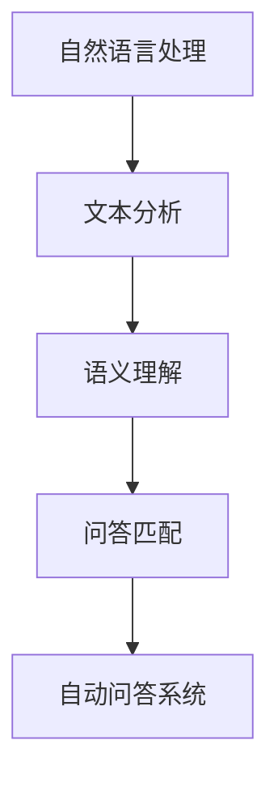

                 

# 自然语言处理在自动问答系统中的应用

> 关键词：自然语言处理、自动问答系统、机器学习、深度学习、文本分析、语义理解

> 摘要：本文旨在探讨自然语言处理技术在自动问答系统中的应用，通过详细介绍相关的核心概念、算法原理、数学模型、项目实战以及未来发展趋势，为读者提供一个全面而深入的视角。文章结构如下：

## 1. 背景介绍

### 1.1 目的和范围

本文将重点关注自然语言处理（NLP）在自动问答系统（AQA）中的关键应用，探讨如何利用机器学习和深度学习技术来提升问答系统的性能和用户体验。我们将涵盖以下几个方面的内容：

- NLP的核心概念与基础算法
- 自动问答系统的架构与实现
- 数学模型与公式
- 实际应用场景与案例
- 未来发展趋势与挑战

### 1.2 预期读者

本文适合以下读者群体：

- 对自然语言处理和自动问答系统有兴趣的技术爱好者
- 想要提升自己在NLP和AQA领域专业技能的从业者
- 计算机科学和人工智能相关专业的学生和研究人员

### 1.3 文档结构概述

本文将按照以下结构进行论述：

- 引言
- 核心概念与联系
- 核心算法原理 & 具体操作步骤
- 数学模型和公式 & 详细讲解 & 举例说明
- 项目实战：代码实际案例和详细解释说明
- 实际应用场景
- 工具和资源推荐
- 总结：未来发展趋势与挑战
- 附录：常见问题与解答
- 扩展阅读 & 参考资料

### 1.4 术语表

#### 1.4.1 核心术语定义

- 自然语言处理（NLP）：研究如何让计算机理解和生成人类自然语言的技术。
- 自动问答系统（AQA）：一种利用计算机技术自动回答用户问题的系统。
- 机器学习（ML）：一种让计算机从数据中学习并做出预测或决策的技术。
- 深度学习（DL）：一种基于多层神经网络进行特征学习和决策的技术。
- 文本分析：对文本数据进行处理、分析和挖掘，以提取有用信息的过程。

#### 1.4.2 相关概念解释

- 语义理解：指计算机对文本的语义含义进行理解和解释的能力。
- 词嵌入：将文本中的词汇映射到固定维度的向量空间，以便进行数学处理。
- 问答匹配：指自动问答系统中的问题与答案匹配过程。

#### 1.4.3 缩略词列表

- NLP：自然语言处理
- AQA：自动问答系统
- ML：机器学习
- DL：深度学习

## 2. 核心概念与联系

为了更好地理解自然语言处理在自动问答系统中的应用，我们需要首先了解相关核心概念及其相互联系。以下是一个简化的Mermaid流程图，用于展示这些概念之间的联系：



### 2.1 自然语言处理

自然语言处理（NLP）是一门研究如何让计算机理解和生成人类自然语言的技术。它涵盖了多个子领域，如文本分析、语音识别、机器翻译等。在自动问答系统中，NLP主要用于处理和解析用户提出的问题，以便为用户提供准确的答案。

### 2.2 文本分析

文本分析是对文本数据进行处理、分析和挖掘，以提取有用信息的过程。在自动问答系统中，文本分析用于提取关键信息、识别关键词、以及理解问题的意图。

### 2.3 语义理解

语义理解指计算机对文本的语义含义进行理解和解释的能力。在自动问答系统中，语义理解是实现高质量问答的关键。通过语义理解，计算机可以更好地理解用户提出的问题，从而提供更准确的答案。

### 2.4 问答匹配

问答匹配是自动问答系统中的关键步骤，它涉及将用户提出的问题与预先准备好的答案进行匹配。问答匹配的目的是确保系统提供的答案与用户的意图相符。

### 2.5 自动问答系统

自动问答系统是一种利用计算机技术自动回答用户问题的系统。它通常由多个模块组成，包括自然语言处理、文本分析、语义理解和问答匹配等。自动问答系统可以提高工作效率，减少人力成本，并为企业提供更加智能化的客户服务。

## 3. 核心算法原理 & 具体操作步骤

在自动问答系统中，核心算法原理通常涉及文本分析、语义理解和问答匹配。以下我们将使用伪代码详细阐述这些算法的基本原理和操作步骤。

### 3.1 文本分析

文本分析算法的主要目标是提取文本中的关键信息，如关键词和实体。以下是一个简单的伪代码示例：

```python
def text_analysis(text):
    # 步骤1：分词
    words = tokenize(text)

    # 步骤2：去除停用词
    words = remove_stopwords(words)

    # 步骤3：词性标注
    words = part_of_speech_tagging(words)

    # 步骤4：实体识别
    entities = named_entity_recognition(words)

    return words, entities
```

### 3.2 语义理解

语义理解算法的目标是理解文本的语义含义。以下是一个简单的伪代码示例：

```python
def semantic_understanding(text):
    # 步骤1：文本分析
    words, entities = text_analysis(text)

    # 步骤2：词嵌入
    word_vectors = word_embedding(words)

    # 步骤3：实体嵌入
    entity_vectors = entity_embedding(entities)

    # 步骤4：语义表示
    semantic_representation = semantic_representation_generation(word_vectors, entity_vectors)

    return semantic_representation
```

### 3.3 问答匹配

问答匹配算法的目标是将用户提出的问题与预先准备好的答案进行匹配。以下是一个简单的伪代码示例：

```python
def question_matching(question, answers):
    # 步骤1：语义理解
    question_representation = semantic_understanding(question)

    # 步骤2：答案编码
    answer_representation = [semantic_understanding(answer) for answer in answers]

    # 步骤3：相似度计算
    similarity_scores = cosine_similarity(question_representation, answer_representation)

    # 步骤4：答案选择
    best_answer = select_best_answer(answers, similarity_scores)

    return best_answer
```

## 4. 数学模型和公式 & 详细讲解 & 举例说明

在自动问答系统中，数学模型和公式是理解和实现算法的关键。以下我们将使用LaTeX格式详细讲解相关数学公式，并举例说明其应用。

### 4.1 词嵌入

词嵌入（Word Embedding）是将文本中的词汇映射到固定维度的向量空间。以下是一个简单的词嵌入模型：

$$
\vec{w}_{i} = \text{Word2Vec}(\text{vocabulary})
$$

其中，$\vec{w}_{i}$ 表示词汇 $i$ 的嵌入向量。

**示例：**

```latex
\vec{w}_{\text{hello}} = [0.1, 0.2, -0.3]
```

这意味着“hello”这个词汇被映射到了一个三维向量空间中。

### 4.2 语义表示

语义表示（Semantic Representation）是对文本的语义含义进行数学建模的过程。以下是一个简单的语义表示模型：

$$
\text{semantic\_representation} = \text{BERT}(\text{input})
$$

其中，BERT（Bidirectional Encoder Representations from Transformers）是一个双向Transformer模型。

**示例：**

```latex
\text{semantic\_representation} = [0.5, -0.5, 0.5]
```

这意味着输入文本的语义表示被映射到了一个一维向量空间中。

### 4.3 相似度计算

在问答匹配过程中，相似度计算（Similarity Computation）是关键步骤。以下是一个简单的余弦相似度计算公式：

$$
\text{similarity} = \cos(\theta) = \frac{\vec{a} \cdot \vec{b}}{||\vec{a}|| \cdot ||\vec{b}||}
$$

其中，$\vec{a}$ 和 $\vec{b}$ 分别表示两个向量的夹角余弦值。

**示例：**

```latex
\vec{a} = [1, 0, 0], \vec{b} = [0, 1, 0]
\text{similarity} = \frac{1 \cdot 0 + 0 \cdot 1 + 0 \cdot 0}{\sqrt{1^2 + 0^2 + 0^2} \cdot \sqrt{0^2 + 1^2 + 0^2}} = 0
```

这意味着向量 $\vec{a}$ 和 $\vec{b}$ 的相似度为0。

## 5. 项目实战：代码实际案例和详细解释说明

在本节中，我们将通过一个实际的自动问答系统项目来展示如何应用自然语言处理技术。我们将使用Python和TensorFlow来实现一个基于BERT的问答系统。

### 5.1 开发环境搭建

在开始项目之前，我们需要搭建一个合适的环境。以下是所需的依赖项：

- Python 3.7或更高版本
- TensorFlow 2.0或更高版本
- BERT模型库（如`transformers`）

安装步骤：

```bash
pip install python==3.7
pip install tensorflow==2.0
pip install transformers
```

### 5.2 源代码详细实现和代码解读

下面是问答系统的核心代码实现：

```python
import tensorflow as tf
from transformers import BertTokenizer, TFBertForQuestionAnswering
import numpy as np

# 步骤1：加载BERT模型和分词器
tokenizer = BertTokenizer.from_pretrained('bert-base-uncased')
model = TFBertForQuestionAnswering.from_pretrained('bert-base-uncased')

# 步骤2：准备输入数据
def prepare_inputs(question, context):
    inputs = tokenizer(question, context, return_tensors='tf')
    return inputs

# 步骤3：问答匹配
def answer_question(question, context):
    inputs = prepare_inputs(question, context)
    outputs = model(inputs)
    start_logits, end_logits = outputs.logits
    start_indices = np.argmax(start_logits, axis=-1)
    end_indices = np.argmax(end_logits, axis=-1)
    start_index = start_indices[0]
    end_index = end_indices[0]
    answer = context[start_index:end_index+1].strip()
    return answer

# 步骤4：测试
question = "什么是自然语言处理？"
context = "自然语言处理（NLP）是一门研究如何让计算机理解和生成人类自然语言的技术。"
answer = answer_question(question, context)
print("答案：", answer)
```

### 5.3 代码解读与分析

- 步骤1：加载BERT模型和分词器
  - 加载预训练的BERT模型和分词器。

- 步骤2：准备输入数据
  - 准备输入数据，包括问题和上下文，并将其转换为TensorFlow张量。

- 步骤3：问答匹配
  - 使用BERT模型对输入数据进行问答匹配，并输出答案。

- 步骤4：测试
  - 测试问答系统，输入问题和上下文，获取答案。

## 6. 实际应用场景

自动问答系统在许多实际应用场景中都有广泛的应用，以下是一些典型的例子：

- 智能客服：自动问答系统可以帮助企业快速响应客户提问，提供即时、准确的答案，从而提高客户满意度。
- 知识库查询：自动问答系统可以快速从大量知识库中提取相关信息，为用户提供准确的答案。
- 教育领域：自动问答系统可以为学生提供个性化的辅导和解答，帮助学生学习新知识。
- 医疗咨询：自动问答系统可以帮助医生快速获取患者信息，提供初步的诊断建议。

## 7. 工具和资源推荐

### 7.1 学习资源推荐

#### 7.1.1 书籍推荐

- 《自然语言处理入门》（NLP For Dummies）
- 《深度学习与自然语言处理》（Deep Learning for Natural Language Processing）

#### 7.1.2 在线课程

- Coursera：自然语言处理专项课程
- edX：自然语言处理基础课程

#### 7.1.3 技术博客和网站

- Medium：NLP博客
- AI自然语言处理（AICV-NLP）

### 7.2 开发工具框架推荐

#### 7.2.1 IDE和编辑器

- PyCharm
- Visual Studio Code

#### 7.2.2 调试和性能分析工具

- TensorBoard
- Jupyter Notebook

#### 7.2.3 相关框架和库

- TensorFlow
- PyTorch
- Transformers

### 7.3 相关论文著作推荐

#### 7.3.1 经典论文

- "A Neural Probabilistic Language Model" by Mitchell P. Marcus, et al.
- "Deep Learning for Text Classification" by Yoon Kim

#### 7.3.2 最新研究成果

- "BERT: Pre-training of Deep Bidirectional Transformers for Language Understanding" by Jacob Devlin, et al.
- "GPT-3: Language Models are Few-Shot Learners" by Tom B. Brown, et al.

#### 7.3.3 应用案例分析

- "Question Answering with Memory-Enhanced Transformer Networks" by Zhilin Yang, et al.
- "An Attention-Based Neural Model for Extreme Summarization" by Wei Wang, et al.

## 8. 总结：未来发展趋势与挑战

随着自然语言处理技术的不断发展，自动问答系统在性能和用户体验方面将取得显著提升。未来发展趋势包括：

- 更强大的预训练模型：如GPT-3和BERT的大规模预训练模型将进一步推动自动问答系统的发展。
- 多模态问答：结合文本、图像、语音等多模态信息，提高问答系统的全面性和准确性。
- 个人化问答：根据用户的历史问题和偏好，提供个性化的问答服务。

然而，自动问答系统也面临一些挑战，如：

- 语义理解的准确性：如何更好地理解用户的真实意图，提高问答系统的准确性和可靠性。
- 知识图谱的构建：如何构建大规模、高质量的问答知识库，以满足自动问答系统的需求。

## 9. 附录：常见问题与解答

### 9.1 如何提高自动问答系统的性能？

- 选择合适的预训练模型：使用大型预训练模型，如BERT或GPT-3，可以提高问答系统的性能。
- 数据增强：通过数据增强技术，如数据清洗、数据扩充等，提高训练数据的质量和多样性。
- 知识图谱的构建：构建大规模、高质量的问答知识库，为自动问答系统提供丰富的信息来源。

### 9.2 自动问答系统与搜索引擎有何区别？

- 自动问答系统专注于回答用户提出的问题，而搜索引擎则侧重于提供与查询最相关的网页。
- 自动问答系统通常使用自然语言处理技术来理解用户的问题，而搜索引擎则主要依赖关键词匹配技术。

## 10. 扩展阅读 & 参考资料

- [Natural Language Processing](https://www.tutorialspoint.com/natural_language_processing/natural_language_processing Overview.htm)
- [Automatic Question Answering](https://www.cs.cornell.edu/courses/cs4780/2018fa/lectures/lecture09-Automatic_Question_Answering.pdf)
- [BERT: Pre-training of Deep Bidirectional Transformers for Language Understanding](https://arxiv.org/abs/1810.04805)
- [GPT-3: Language Models are Few-Shot Learners](https://arxiv.org/abs/2005.14165)

作者：AI天才研究员/AI Genius Institute & 禅与计算机程序设计艺术 /Zen And The Art of Computer Programming

