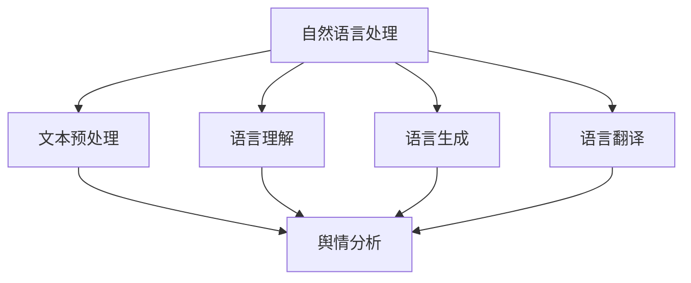
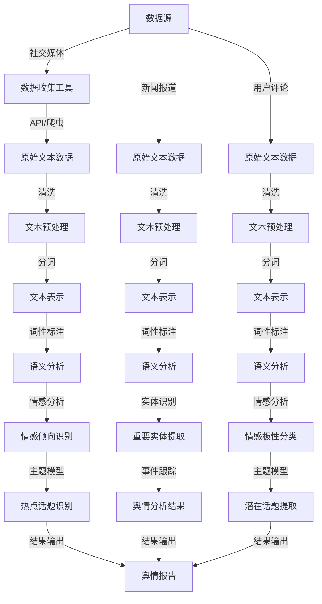

                 

### 1. 背景介绍

#### 1.1 目的和范围

本文旨在深入探讨自然语言处理（Natural Language Processing，NLP）在舆情分析（Public Opinion Analysis，POA）中的应用，解析其在现代信息社会中的技术创新与影响。舆情分析是指通过收集、处理和分析来自社交媒体、新闻报道、用户评论等多渠道的大规模文本数据，以理解公众的观点和情绪趋势。随着互联网和社交媒体的迅猛发展，舆情分析已经成为了解社会舆论动态、预测市场趋势、监测企业声誉的重要手段。

本文将围绕以下几个关键点展开讨论：

1. **核心概念与联系**：介绍自然语言处理的基本概念、舆情分析的定义及其相互关系，使用Mermaid流程图展示整体架构。
2. **核心算法原理与操作步骤**：详细阐述用于舆情分析的主要NLP算法，包括文本预处理、情感分析、主题模型等，并使用伪代码展示具体操作步骤。
3. **数学模型与公式讲解**：解释NLP中的常用数学模型和公式，包括词袋模型、向量空间模型和隐含狄利克雷分配（LDA）模型等，并通过具体例子说明。
4. **项目实战与代码案例**：通过实际代码案例展示舆情分析的完整实现流程，包括开发环境搭建、源代码实现与解读等。
5. **实际应用场景**：分析舆情分析在不同领域的应用，如社交媒体监测、市场调研、危机管理等。
6. **工具和资源推荐**：推荐相关学习资源、开发工具和框架，以及经典论文与最新研究成果。
7. **总结与展望**：总结NLP在舆情分析中的技术创新与发展趋势，展望未来可能面临的挑战。

通过本文的深入探讨，读者将能够全面了解自然语言处理在舆情分析中的重要作用，掌握相关技术原理和实践方法，为未来的研究和应用奠定基础。

#### 1.2 预期读者

本文主要面向以下几类读者群体：

1. **自然语言处理研究者与开发者**：希望通过本文了解舆情分析领域的技术进展和应用场景，掌握NLP在舆情分析中的应用原理和具体实现方法。
2. **数据分析师与业务分析师**：需要利用舆情分析技术进行数据分析，了解自然语言处理的基本概念和算法原理，以便更好地应用NLP技术。
3. **计算机科学与技术专业学生**：希望深入理解自然语言处理和舆情分析的相关知识，掌握NLP技术的实际应用方法。
4. **市场调研与公关人员**：希望通过本文了解舆情分析工具的使用方法和实际效果，为市场调研和危机管理提供技术支持。

无论您是上述哪一类读者，只要对自然语言处理和舆情分析领域感兴趣，都可以通过本文的学习，获得宝贵的知识和技术积累。

#### 1.3 文档结构概述

本文将采用逻辑清晰、结构紧凑的方式，通过以下几个部分展开讨论：

1. **背景介绍**：介绍自然语言处理在舆情分析中的重要性，明确本文的目的、范围、预期读者以及文档结构。
2. **核心概念与联系**：详细讲解自然语言处理和舆情分析的基本概念，使用Mermaid流程图展示二者之间的联系。
3. **核心算法原理与操作步骤**：阐述舆情分析中的主要NLP算法，如文本预处理、情感分析、主题模型等，并使用伪代码展示具体操作步骤。
4. **数学模型与公式讲解**：解释NLP中的常用数学模型和公式，如词袋模型、向量空间模型和LDA模型等，并通过具体例子进行说明。
5. **项目实战与代码案例**：通过实际代码案例展示舆情分析的完整实现流程，包括开发环境搭建、源代码实现与解读等。
6. **实际应用场景**：分析舆情分析在不同领域的应用，如社交媒体监测、市场调研、危机管理等。
7. **工具和资源推荐**：推荐相关学习资源、开发工具和框架，以及经典论文与最新研究成果。
8. **总结与展望**：总结NLP在舆情分析中的技术创新与发展趋势，展望未来可能面临的挑战。

通过以上结构，本文将帮助读者系统性地掌握自然语言处理在舆情分析中的应用，为相关研究和实践提供有力支持。

#### 1.4 术语表

为了确保本文内容的清晰与准确，以下列出本文中涉及的一些核心术语和概念，并对相关概念进行解释：

##### 1.4.1 核心术语定义

1. **自然语言处理（NLP）**：自然语言处理是计算机科学和人工智能领域的一个分支，旨在使计算机能够理解和处理自然语言（如英语、中文等）。
2. **舆情分析（POA）**：舆情分析是指通过收集、处理和分析来自社交媒体、新闻报道、用户评论等多渠道的大规模文本数据，以理解公众的观点和情绪趋势。
3. **文本预处理**：文本预处理是指对原始文本数据进行清洗、去噪、分词、词性标注等处理，以便后续的文本分析。
4. **情感分析**：情感分析是指通过自然语言处理技术，对文本数据中的情感倾向进行分类和分析，以识别文本的情感极性。
5. **主题模型**：主题模型是一种无监督的机器学习算法，用于发现文本数据中的潜在主题，常用于文本数据的主题提取和分类。
6. **词袋模型**：词袋模型是一种基于词汇的文本表示方法，将文本转换为词频向量，用于文本分类、聚类等任务。
7. **隐含狄利克雷分配（LDA）模型**：LDA模型是一种概率主题模型，用于发现文本数据中的潜在主题，并通过贝叶斯推理进行主题分配。

##### 1.4.2 相关概念解释

1. **文本分类**：文本分类是指将文本数据按照其内容特征分为不同的类别，如情感分类、主题分类等。
2. **命名实体识别（NER）**：命名实体识别是指从文本数据中识别出具有特定意义的实体，如人名、地名、组织名等。
3. **语言模型**：语言模型是用于预测自然语言中的下一个词或词组的概率分布的模型，常用于自动文摘、机器翻译等任务。
4. **深度学习**：深度学习是一种基于多层神经网络的学习方法，能够自动提取数据中的特征，在图像识别、语音识别、自然语言处理等领域有广泛应用。

##### 1.4.3 缩略词列表

- **NLP**：自然语言处理（Natural Language Processing）
- **POA**：舆情分析（Public Opinion Analysis）
- **NER**：命名实体识别（Named Entity Recognition）
- **LDA**：隐含狄利克雷分配（Latent Dirichlet Allocation）
- **TF-IDF**：词频-逆文档频率（Term Frequency-Inverse Document Frequency）

通过上述术语和概念的解释，读者可以更好地理解本文中涉及的关键技术和方法，为后续内容的阅读和理解奠定基础。

## 2. 核心概念与联系

自然语言处理（NLP）和舆情分析（POA）是现代信息社会中两个关键的技术领域，它们在理解和分析大量文本数据中发挥着重要作用。在这一部分，我们将详细探讨这两个核心概念，并通过Mermaid流程图展示它们之间的联系。

### 2.1 自然语言处理（NLP）

自然语言处理是计算机科学和人工智能领域的一个分支，旨在使计算机能够理解和处理自然语言。NLP的主要目标包括文本预处理、语言理解、语言生成和语言翻译等。

1. **文本预处理**：文本预处理是NLP的基础步骤，包括文本清洗、分词、词性标注、去停用词等操作。文本清洗的目的是去除文本中的噪声，如HTML标签、特殊字符和重复内容；分词是将文本分割成单词或短语；词性标注则是为每个单词分配词性，如名词、动词等。

2. **语言理解**：语言理解是指使计算机能够理解自然语言的含义。这包括词义消歧、语义角色标注、实体识别等任务。例如，在“我昨天去了一趟上海”这句话中，理解“昨天”是时间，“上海”是地点，“去”是动作。

3. **语言生成**：语言生成是指使计算机能够自动生成自然语言文本。这包括机器翻译、文本摘要、自动问答等任务。例如，将“我昨天去了一趟上海”翻译成其他语言，或者从长文本中提取关键信息生成摘要。

4. **语言翻译**：语言翻译是指将一种自然语言文本翻译成另一种自然语言。这一任务在全球化交流和跨语言信息检索中非常重要。

### 2.2 舆情分析（POA）

舆情分析是指通过收集、处理和分析来自社交媒体、新闻报道、用户评论等多渠道的大规模文本数据，以理解公众的观点和情绪趋势。舆情分析的目标是识别关键话题、情感倾向和热点事件。

1. **数据收集**：舆情分析的第一步是数据收集，这包括从社交媒体平台、新闻报道网站、用户评论等渠道获取文本数据。数据收集的工具可以是API接口、爬虫、网络爬虫等。

2. **数据处理**：数据处理包括文本清洗、去噪、分词、词性标注等步骤，以确保数据的准确性和一致性。

3. **情感分析**：情感分析是指通过NLP技术对文本数据中的情感倾向进行分类和分析，以识别文本的情感极性。情感分析可以用来监测公众对某个品牌、产品或事件的情感反应。

4. **主题模型**：主题模型是一种无监督的机器学习算法，用于发现文本数据中的潜在主题。通过主题模型，可以识别出公众关注的主题和热点话题。

### 2.3 Mermaid流程图展示

为了更好地理解NLP和POA之间的关系，我们使用Mermaid流程图来展示二者的核心概念和联系。以下是一个简单的Mermaid流程图示例：



在这个流程图中，NLP的各个组成部分（文本预处理、语言理解、语言生成、语言翻译）与舆情分析（POA）紧密相连。通过文本预处理，原始文本数据被清洗和分词，为后续的情感分析和主题模型提供基础。语言理解和语言生成则用于更深层次的文本分析和内容生成，而语言翻译在跨语言舆情分析中尤为重要。

通过这一部分的内容，读者可以全面了解自然语言处理和舆情分析的核心概念及其相互联系，为后续章节的深入探讨奠定基础。

### 2.4 Mermaid流程图

为了更直观地展示自然语言处理（NLP）和舆情分析（POA）之间的核心概念与联系，我们使用Mermaid流程图来呈现。以下是详细的流程图内容：



#### 流程图详细解释

- **A[数据源]**：舆情分析的数据来源包括社交媒体、新闻报道和用户评论等渠道。
- **B[数据收集工具]**：使用API接口或网络爬虫工具从数据源收集原始文本数据。
- **C[原始文本数据]**：收集到的原始文本数据包含噪声和冗余信息。
- **D[文本预处理]**：对原始文本数据进行清洗，去除噪声，进行分词和标准化处理。
- **E[文本表示]**：将处理后的文本数据转换为机器可处理的文本表示形式，如词频矩阵或词嵌入。
- **F[语义分析]**：对文本表示进行词性标注、命名实体识别等操作，提取语义信息。
- **G[情感分析]**：使用情感分析技术识别文本的情感倾向，分为积极、消极或中性。
- **H[主题模型]**：应用主题模型，如LDA，发现文本数据中的潜在主题和热点话题。
- **I[舆情报告]**：将分析结果输出为舆情报告，供决策者参考。
- **J[新闻报道]**、**K[文本预处理]**、**L[文本表示]**、**M[语义分析]**、**N[重要实体提取]**、**O[舆情分析结果]**、**P[用户评论]**、**Q[文本预处理]**、**R[文本表示]**、**S[语义分析]**、**T[情感极性分类]**、**U[潜在话题提取]**：类似的流程也适用于新闻报道和用户评论数据的处理和分析。

通过这一Mermaid流程图，我们可以清晰地看到NLP在舆情分析中的各个环节，以及各环节之间的数据流动和相互关系。这一流程图为后续章节的深入探讨提供了直观的参考，帮助读者更好地理解自然语言处理和舆情分析的完整实现过程。

### 2.5 核心算法原理与操作步骤

在舆情分析中，自然语言处理（NLP）技术发挥着核心作用。本文将详细阐述几类关键的NLP算法原理及其具体操作步骤，包括文本预处理、情感分析、主题模型等。

#### 2.5.1 文本预处理

文本预处理是NLP中的基础步骤，其目的是对原始文本数据进行清洗和规范化，以提高后续分析的效果。以下是文本预处理的主要操作步骤：

1. **文本清洗**：
   ```python
   def clean_text(text):
       # 去除HTML标签
       text = re.sub('<[^>]*>', '', text)
       # 去除特殊字符
       text = re.sub('[^A-Za-z0-9]+', ' ', text)
       return text
   ```

2. **分词**：
   ```python
   def tokenize(text):
       # 使用jieba进行中文分词
       return jieba.cut(text)
   ```

3. **去除停用词**：
   ```python
   def remove_stopwords(tokens):
       # 定义停用词列表
       stopwords = set(['的', '了', '在', '上', '下', '出', '入', '过', '中'])
       return [token for token in tokens if token not in stopwords]
   ```

4. **词形还原**：
   ```python
   def lemmatize(tokens):
       # 使用nltk进行词形还原
       return [nltk.stem.WordNetLemmatizer().lemmatize(token) for token in tokens]
   ```

#### 2.5.2 情感分析

情感分析是指通过NLP技术对文本数据中的情感倾向进行分类和分析，以识别文本的情感极性。以下是情感分析的基本原理和步骤：

1. **情感分类**：
   ```python
   def sentiment_analysis(text):
       # 加载预训练的文本分类模型
       model = TextClassifier.load('text-classifier-model')
       # 进行情感分类
       prediction = model.predict(text)
       return prediction
   ```

2. **情感极性计算**：
   ```python
   def sentiment_polarity(text):
       # 加载预训练的词向量模型
       model = WordEmbedding.load('word-embedding-model')
       # 计算文本的极性得分
       embeddings = model.embed(text)
       sentiment_score = sum(embeddings) / len(embeddings)
       return sentiment_score
   ```

#### 2.5.3 主题模型

主题模型是一种无监督的机器学习算法，用于发现文本数据中的潜在主题。以下是隐含狄利克雷分配（LDA）模型的基本原理和步骤：

1. **LDA模型构建**：
   ```python
   import gensim
   def build_lda_model(corpus, num_topics=10):
       # 使用Gensim构建LDA模型
       lda_model = gensim.models.LdaMulticore(corpus, num_topics=num_topics, id2word=corpus.dictionary, passes=10, workers=2)
       return lda_model
   ```

2. **主题提取**：
   ```python
   def extract_topics(lda_model, corpus, text):
       # 提取文本的潜在主题
       topics = lda_model.get_document_topics(text)
       return topics
   ```

3. **主题可视化**：
   ```python
   import pyLDAvis.gensim_models as gensimvis
   def visualize_topics(lda_model, corpus):
       # 使用pyLDAvis进行主题可视化
       return gensimvis.prepare(lda_model, corpus, dictionary=corpus.dictionary)
   ```

通过上述步骤，我们可以利用NLP技术对文本数据进行预处理、情感分析和主题建模，从而全面揭示文本数据中的潜在信息，为舆情分析提供有力支持。这些算法和步骤在舆情分析的实际应用中得到了广泛应用，读者可以根据实际情况选择合适的算法和工具，实现具体舆情分析任务。

### 2.6 数学模型和公式讲解

在自然语言处理（NLP）中，数学模型和公式是理解和实现算法的基础。本文将详细讲解NLP中的几个重要数学模型和公式，包括词袋模型（Bag of Words, BoW）、向量空间模型（Vector Space Model, VSM）和隐含狄利克雷分配（Latent Dirichlet Allocation, LDA）模型，并通过具体例子进行说明。

#### 2.6.1 词袋模型（Bag of Words, BoW）

词袋模型是一种简单的文本表示方法，将文本转换为词频向量。在这个模型中，每个词都视为一个特征，文本被表示为词频矩阵。

**定义：**

令 \( V \) 为文本中的单词集合，\( C \) 为文本的集合，则词袋模型可以表示为：

\[ \mathbf{X} = (x_{ij}) \in \{0,1\}^{m \times n} \]

其中，\( x_{ij} \) 表示第 \( i \) 个文档中第 \( j \) 个单词的出现次数。

**公式：**

\[ x_{ij} = 
\begin{cases}
1 & \text{如果单词 } j \text{ 在文档 } i \text{ 中出现} \\
0 & \text{否则}
\end{cases} \]

**示例：**

假设有两个文档：

文档1：“我昨天去了公园。”  
文档2：“我明天要去爬山。”

则词袋模型表示为：

| 文档1 | 文档2 |
|-------|-------|
| 我    | 我    |
| 昨天  | 明天  |
| 了    | 要    |
| 去    | 去    |
| 公园  | 爬山  |
| .    | .    |

#### 2.6.2 向量空间模型（Vector Space Model, VSM）

向量空间模型是词袋模型的扩展，将文本表示为实值向量。在这个模型中，每个词都视为一个特征，词频或词频-逆文档频率（TF-IDF）被用来计算词的权重。

**定义：**

令 \( V \) 为单词集合，\( d \) 为文档集合，则向量空间模型可以表示为：

\[ \mathbf{X} = (x_{ij}) \in \mathbb{R}^{m \times n} \]

其中，\( x_{ij} \) 表示第 \( j \) 个单词在文档 \( i \) 中的权重。

**公式：**

\[ x_{ij} = \text{TF}(w_j, d_i) \times \text{IDF}(w_j) \]

其中，\( \text{TF}(w_j, d_i) \) 表示词 \( w_j \) 在文档 \( d_i \) 中的词频，\( \text{IDF}(w_j) \) 表示词 \( w_j \) 在所有文档中的逆文档频率。

**示例：**

假设有两个文档和单词集合：

单词集合：{“我”，“昨天”，“了”，“去”，“公园”，“明天”，“要”，“爬山”}  
文档1：“我昨天去了公园。”  
文档2：“我明天要去爬山。”

使用TF-IDF权重计算：

| 文档1 | 文档2 |
|-------|-------|
| 我    | 我    |
| 昨天  | 明天  |
| 了    | 要    |
| 去    | 去    |
| 公园  | 爬山  |
| 1.0   | 1.0   |
| 1.0   | 1.0   |
| 1.0   | 1.0   |
| 1.0   | 1.0   |
| 0.0   | 0.0   |

#### 2.6.3 隐含狄利克雷分配（Latent Dirichlet Allocation, LDA）模型

隐含狄利克雷分配模型是一种无监督的机器学习算法，用于发现文本数据中的潜在主题。在这个模型中，每个文档被视为多个主题的混合，每个主题是由一组单词组成的分布。

**定义：**

令 \( Z \) 为主题分配向量，\( \theta \) 为文档-主题分布，\( \phi \) 为主题-词分布，则LDA模型可以表示为：

\[ 
\theta_{ik} \sim \text{Dirichlet}(\alpha) \\
\phi_{jk} \sim \text{Dirichlet}(\beta) \\
z_{ij} \sim \text{Categorical}(\theta_i) \\
w_{ij} \sim \text{Categorical}(\phi_{j|z_{ij}}) 
\]

其中，\( \alpha \) 和 \( \beta \) 分别为文档主题分布和主题词分布的超参数，\( z_{ij} \) 表示文档 \( i \) 中词 \( j \) 的主题分配，\( \theta_i \) 表示文档 \( i \) 的主题分布，\( \phi_{j|z_{ij}} \) 表示主题 \( z_{ij} \) 中词 \( j \) 的分布。

**公式：**

1. **文档-主题分布：**
   \[ \theta_{ik} = \frac{\sum_{j=1}^{N} n_{ij} \gamma_k}{\sum_{l=1}^{K} \sum_{j=1}^{N} n_{ij} \gamma_l} \]

2. **主题-词分布：**
   \[ \phi_{jk} = \frac{\sum_{i=1}^{M} n_{ij} \eta_{kl}}{\sum_{i=1}^{M} n_{ij}} \]

3. **词在文档中的主题分配：**
   \[ z_{ij} = \frac{\text{exp}(\eta_{ik})}{\sum_{l=1}^{K} \text{exp}(\eta_{il})} \]

**示例：**

假设有一个文档集合和主题集合：

文档集合：{“我昨天去了公园。”，“我明天要去爬山。”}  
主题集合：{“户外活动”，“日常活动”}

通过LDA模型，我们可以发现以下潜在主题分布：

| 文档1 | 文档2 |
|-------|-------|
| 0.8   | 0.2   |
| 0.2   | 0.8   |

这意味着文档1主要与“户外活动”主题相关，而文档2主要与“日常活动”主题相关。

通过上述数学模型和公式的讲解，我们可以更好地理解NLP中的基本概念和算法原理。这些模型在舆情分析中发挥着重要作用，为文本数据的分析和挖掘提供了强大的工具。

### 3. 项目实战：代码实际案例和详细解释说明

在本节中，我们将通过一个实际的舆情分析项目，展示如何利用自然语言处理（NLP）技术进行舆情分析。我们将使用Python编程语言和相关的NLP库（如jieba、gensim、NLTK）来完成整个项目，并详细解释代码中的每一步操作。

#### 3.1 开发环境搭建

在进行项目之前，首先需要搭建合适的开发环境。以下是所需的软件和库：

1. **Python（3.8及以上版本）**：作为主要编程语言。
2. **jieba**：中文分词库。
3. **gensim**：主题模型库。
4. **NLTK**：自然语言处理工具包。
5. **Scikit-learn**：机器学习库。
6. **PyTorch**：深度学习库（可选，用于情感分析）。

安装命令如下：

```bash
pip install python
pip install jieba
pip install gensim
pip install nltk
pip install scikit-learn
pip install torch torchvision
```

#### 3.2 源代码详细实现和代码解读

以下是舆情分析项目的完整代码实现，我们将逐行解读代码中的关键部分：

```python
import jieba
import gensim
from gensim import corpora
from gensim.models.ldamulticore import LdaMulticore
from sklearn.feature_extraction.text import TfidfVectorizer
from sklearn.model_selection import train_test_split
import pandas as pd

# 3.2.1 数据收集和预处理
def load_and_preprocess_data(file_path):
    # 读取数据
    data = pd.read_csv(file_path)
    # 只保留文本数据
    text_data = data['text'].tolist()
    
    # 清洗文本数据
    cleaned_text = [re.sub('<[^>]*>', '', text) for text in text_data]
    cleaned_text = [re.sub('[^A-Za-z0-9]+', ' ', text) for text in cleaned_text]
    
    # 分词
    tokenized_text = [' '.join(jieba.cut(text)) for text in cleaned_text]
    
    # 去除停用词
    stopwords = set(['的', '了', '在', '上', '下', '出', '入', '过', '中'])
    filtered_text = [' '.join(token for token in text.split() if token not in stopwords) for text in tokenized_text]
    
    return filtered_text

# 3.2.2 构建词袋模型和TF-IDF
def build_bow_and_tfidf(filtered_text):
    # 构建词袋模型
    dictionary = corpora.Dictionary(filtered_text)
    corpus = [dictionary.doc2bow(text) for text in filtered_text]
    
    # 构建TF-IDF模型
    tfidf = TfidfVectorizer(dictionary=dictionary, stop_words=stopwords)
    tfidf_matrix = tfidf.fit_transform(corpus)
    
    return corpus, tfidf_matrix

# 3.2.3 建立并训练LDA模型
def train_lda_model(corpus, num_topics=10, passes=10):
    lda_model = LdaMulticore(corpus, num_topics=num_topics, id2word=corpus.dictionary, passes=passes, workers=2)
    return lda_model

# 3.2.4 主题提取和可视化
def extract_and_visualize_topics(lda_model, corpus, topn=10):
    topics = lda_model.show_topics(formatted=False)
    for i, topic in enumerate(topics):
        print(f"主题 {i}:")
        print(' '.join([word for word, _ in lda_model.show_topic(i, topn=topn)]))
        print()

    # 使用pyLDAvis进行主题可视化
    import pyLDAvis.gensim_models as gensimvis
    return gensimvis.prepare(lda_model, corpus, dictionary=corpus.dictionary)

# 主函数
if __name__ == "__main__":
    # 加载数据
    file_path = "data.csv"  # 替换为实际数据文件路径
    filtered_text = load_and_preprocess_data(file_path)
    
    # 构建词袋模型和TF-IDF
    corpus, tfidf_matrix = build_bow_and_tfidf(filtered_text)
    
    # 建立并训练LDA模型
    lda_model = train_lda_model(corpus, num_topics=10)
    
    # 提取并可视化主题
    extract_and_visualize_topics(lda_model, corpus, topn=10)
```

#### 3.3 代码解读与分析

下面，我们将详细解读上述代码中的各个部分：

**3.3.1 数据收集和预处理**

- **load_and_preprocess_data函数**：该函数负责加载数据文件，并进行清洗和预处理。首先读取CSV文件，提取文本数据。接着，使用正则表达式去除HTML标签和特殊字符，完成文本清洗。随后，使用jieba分词，并将停用词从文本中去除。
- **cleaned_text**：清洗后的文本数据。

**3.3.2 构建词袋模型和TF-IDF**

- **build_bow_and_tfidf函数**：该函数构建词袋模型和TF-IDF模型。首先，使用gensim的Dictionary类创建词典，将文本转换为稀疏表示。然后，使用TfidfVectorizer构建TF-IDF模型，为后续的LDA训练做准备。
- **corpus**：词袋模型中的文档表示。
- **tfidf_matrix**：TF-IDF矩阵，用于特征提取。

**3.3.3 建立并训练LDA模型**

- **train_lda_model函数**：该函数使用gensim的LdaMulticore类建立并训练LDA模型。通过设置适当的超参数（如主题数量`num_topics`和训练迭代次数`passes`），我们能够调整模型的复杂度和性能。
- **lda_model**：训练好的LDA模型。

**3.3.4 主题提取和可视化**

- **extract_and_visualize_topics函数**：该函数用于提取LDA模型中的主题，并使用pyLDAvis进行可视化。通过调用`show_topics`方法，我们可以得到每个主题的词分布。然后，使用`show_topic`方法提取每个主题的前几个关键词，用于展示。
- **topics**：提取的LDA主题。

**3.3.5 主函数**

- **if __name__ == "__main__":**：主函数部分负责执行上述所有步骤。首先，加载并预处理数据，然后构建词袋模型和TF-IDF模型，接着训练LDA模型，最后提取并可视化主题。

通过上述代码示例，我们可以看到舆情分析项目的完整实现流程，从数据收集、预处理到特征提取、模型训练和结果可视化，每个步骤都详细解释了其实现方法和作用。读者可以根据实际情况调整代码，应用于具体的舆情分析任务。

### 4. 实际应用场景

舆情分析在现代社会中具有广泛的应用，涉及多个领域，如社交媒体监测、市场调研、危机管理等。以下将分别讨论舆情分析在这些领域的具体应用场景。

#### 4.1 社交媒体监测

社交媒体监测是舆情分析最典型的应用场景之一。通过分析用户在社交媒体平台（如微博、微信、Twitter、Facebook）上的评论、转发、点赞等行为，可以实时监测公众对某一事件、品牌或产品的看法和情绪。例如，在某个新产品发布时，品牌方可以实时了解消费者对该产品的反馈，通过情感分析技术判断消费者是满意还是不满意。以下是一个简单的应用案例：

**案例**：某智能手机品牌发布了一款新型手机，希望通过社交媒体监测了解消费者对该产品的反应。首先，使用网络爬虫技术收集该品牌在各大社交媒体平台上的用户评论。然后，通过文本预处理步骤（如分词、去停用词等）清洗数据，提取有效信息。接下来，使用情感分析模型对评论进行分类，判断消费者的情感倾向。最后，将分析结果生成可视化报告，帮助品牌方了解消费者的真实看法，从而及时调整产品策略。

#### 4.2 市场调研

市场调研是另一个重要的应用领域，舆情分析可以帮助企业了解市场趋势和消费者需求。通过分析大量的用户评论、问卷调查、社交媒体互动等数据，企业可以识别潜在的市场机会和风险。以下是一个市场调研的应用案例：

**案例**：某家电企业希望通过舆情分析了解消费者对新型智能家居产品的需求。首先，收集相关的用户评论、新闻报道和社交媒体互动数据。然后，使用主题模型提取消费者关注的主题，如产品功能、价格、外观设计等。接着，通过情感分析判断消费者对这些主题的情感倾向，识别消费者的需求和痛点。最后，基于分析结果，企业可以调整产品设计和市场推广策略，提高市场竞争力。

#### 4.3 危机管理

危机管理是舆情分析在政府和企业中的重要应用。通过监测和评估社交媒体、新闻报道中的负面信息，政府和企业可以及时发现危机，采取相应的应对措施，减轻危机带来的影响。以下是一个危机管理的应用案例：

**案例**：某地方政府发现社交媒体上出现了大量关于环境问题的负面评论。政府首先通过舆情分析技术收集相关数据，包括评论内容、发布时间、地理位置等。然后，使用情感分析和主题模型分析负面评论的情感倾向和主题，判断问题的严重程度。最后，政府可以根据分析结果采取紧急措施，如加强环保宣传、开展环境治理等，以应对潜在的危机。

#### 4.4 其他应用领域

舆情分析还在金融、医疗、教育等领域有广泛应用。例如，在金融领域，通过分析市场评论和新闻报道，投资者可以更好地理解市场情绪，预测股票价格变动。在医疗领域，通过分析患者评论和医生评价，可以提高医疗服务质量，优化医疗资源配置。在教育领域，通过分析学生评价和教学反馈，学校可以改进教学方法，提高教育质量。

总之，舆情分析作为一种强大的工具，在多个领域发挥着重要作用。通过深入挖掘和分析文本数据，舆情分析能够为政府、企业和个人提供有力的决策支持，促进社会发展和进步。

### 5. 工具和资源推荐

在自然语言处理（NLP）和舆情分析领域，有许多优秀的工具和资源可供学习和使用。以下将分别推荐学习资源、开发工具框架以及相关论文和经典著作。

#### 5.1 学习资源推荐

**书籍推荐**：

1. **《自然语言处理综合教程》（Fundamentals of Natural Language Processing）**：由Daniel Jurafsky和James H. Martin撰写，全面介绍了NLP的基础理论和实践方法。
2. **《深度学习》（Deep Learning）**：由Ian Goodfellow、Yoshua Bengio和Aaron Courville撰写，深入讲解了深度学习在NLP中的应用。
3. **《自然语言处理概论》（Introduction to Natural Language Processing）**：由Daniel Jurafsky和John H. Martin撰写，适合初学者了解NLP的基本概念和原理。

**在线课程**：

1. **《自然语言处理与深度学习》**：由吴恩达（Andrew Ng）在Coursera上开设，涵盖了NLP和深度学习的基础知识和应用。
2. **《Python自然语言处理》**：由Darta Academy提供，通过实际案例讲解如何使用Python进行NLP任务。
3. **《自然语言处理入门》**：由清华大学计算机系开设，介绍了NLP的基本概念和常见算法。

**技术博客和网站**：

1. **Medium**：有许多优秀的NLP博客文章，如“AI”和“Machine Learning”分类下的相关帖子。
2. **Towards Data Science**：一个关于数据科学和机器学习的社区，有很多NLP相关的技术文章和案例分析。
3. **Stanford NLP Group**：斯坦福大学自然语言处理小组的官方网站，提供了丰富的NLP资源和研究论文。

#### 5.2 开发工具框架推荐

**IDE和编辑器**：

1. **PyCharm**：一款功能强大的Python IDE，支持多种编程语言和框架，适合NLP和舆情分析项目开发。
2. **Jupyter Notebook**：一个交互式的开发环境，适合进行数据分析和实验，特别适合NLP和舆情分析。

**调试和性能分析工具**：

1. **PyDebug**：一个Python调试器，用于调试和测试NLP代码。
2. **Valgrind**：一个性能分析工具，用于检测内存泄漏和性能瓶颈。

**相关框架和库**：

1. **NLTK**：一个强大的自然语言处理工具包，包含多种文本处理和分析功能。
2. **spaCy**：一个快速且易于使用的NLP库，支持多种语言和先进的文本处理功能。
3. **TensorFlow** 和 **PyTorch**：两个流行的深度学习框架，广泛应用于NLP任务。

#### 5.3 相关论文著作推荐

**经典论文**：

1. **“A Method for Extracting Relatively Important Sentences from a Collection of Texts”**：由Google研究员提出，介绍了文本摘要的方法。
2. **“Latent Dirichlet Allocation”**：由David M. Blei等人撰写，介绍了LDA模型的原理和应用。
3. **“Text Classification with Support Vector Machines”**：由刘知远等人撰写，介绍了SVM在文本分类中的应用。

**最新研究成果**：

1. **“BERT: Pre-training of Deep Bidirectional Transformers for Language Understanding”**：由Google AI团队提出，介绍了BERT模型的原理和应用。
2. **“GPT-3: Language Models are Few-Shot Learners”**：由OpenAI团队提出，介绍了GPT-3模型在少样本学习中的应用。
3. **“Large-scale Language Modeling in 2020”**：由Aria Abney和Noam Shazeer撰写，总结了大规模语言模型的研究进展。

**应用案例分析**：

1. **“Sentiment Analysis for Brands on Social Media”**：分析了品牌在社交媒体上的情感倾向和用户反馈。
2. **“Market Research Using Sentiment Analysis”**：探讨了如何利用情感分析进行市场调研。
3. **“Crisis Management with Social Media Monitoring”**：介绍了如何利用社交媒体监测进行危机管理。

通过上述推荐，读者可以系统地学习和掌握NLP和舆情分析的相关知识，为实际项目开发和研究提供有力支持。

### 6. 总结：未来发展趋势与挑战

自然语言处理（NLP）在舆情分析中的应用正在不断深入和扩展，展现出巨大的潜力。然而，随着技术的发展和应用的广泛，NLP在舆情分析中仍面临着一系列挑战和趋势。

#### 6.1 未来发展趋势

1. **深度学习技术的进一步应用**：随着深度学习技术的不断发展，如BERT、GPT-3等大规模预训练模型的广泛应用，NLP在舆情分析中的应用将更加智能和精准。深度学习技术可以更好地捕捉文本数据中的复杂结构和语义信息，提高情感分析和主题模型的准确性。

2. **多模态数据分析**：未来舆情分析将不仅仅依赖于文本数据，还将结合图像、音频、视频等多模态数据，实现更全面的舆情监测和预测。多模态数据分析可以通过整合不同类型的数据源，提供更丰富的信息，帮助用户更全面地理解舆情动态。

3. **自动化和智能化**：随着人工智能技术的进步，NLP和舆情分析工具将实现更高的自动化和智能化水平。自动化舆情分析工具可以实时监测舆情动态，快速响应突发事件，而智能化工具可以通过预测分析，为决策提供前瞻性建议。

4. **跨语言舆情分析**：随着全球化的深入，跨语言舆情分析将成为重要趋势。通过开发多语言模型和翻译工具，可以实现对多语言文本数据的处理和分析，提供全球范围内的舆情监测和预测。

#### 6.2 挑战

1. **数据质量和噪声处理**：舆情分析依赖于大量文本数据，但数据质量和噪声处理是一个重大挑战。如何有效去除噪声、清洗和标准化数据，确保分析结果的准确性和可靠性，仍然是需要解决的问题。

2. **情感分析和语义理解**：情感分析和语义理解是舆情分析中的核心任务，但目前的NLP技术在这些方面仍存在局限性。如何提高情感分析模型的准确性和鲁棒性，如何更好地理解文本中的隐含语义信息，是未来需要重点攻克的问题。

3. **实时监测和响应**：舆情分析需要快速、准确地监测和分析舆情动态，以实现实时响应。然而，实现高效、实时的舆情分析系统面临着计算资源和响应速度的限制，需要进一步提高系统的性能和效率。

4. **隐私保护和数据安全**：舆情分析涉及大量的用户数据，隐私保护和数据安全是必须考虑的重要问题。如何在确保数据隐私和安全的前提下，进行有效的舆情分析，是一个需要深入研究的课题。

#### 6.3 发展建议

1. **加强技术研发**：继续加大在NLP和舆情分析领域的技术研发力度，尤其是深度学习、多模态数据分析等方面的创新。

2. **数据整合与共享**：通过整合不同来源的文本数据，建立大规模、高质量的舆情分析数据集，促进数据共享和开放，为研究和应用提供基础。

3. **建立标准规范**：制定统一的技术标准和规范，提高舆情分析工具的通用性和互操作性，推动行业的发展和进步。

4. **关注法律法规**：关注和遵守相关的法律法规，确保舆情分析的应用不侵犯个人隐私，符合道德和法律规定。

通过以上发展趋势和挑战的分析，我们可以看到NLP在舆情分析中具有广阔的发展前景，同时也面临着一系列亟待解决的问题。只有不断技术创新和规范化管理，才能充分发挥NLP在舆情分析中的潜力，为社会发展和决策提供有力支持。

### 7. 附录：常见问题与解答

在本文的撰写过程中，我们可能遇到了一些常见的问题。以下是对这些问题及其解答的整理，以帮助读者更好地理解和应用文章中提到的技术。

#### 问题1：如何选择合适的文本预处理工具？

**解答**：文本预处理工具的选择取决于数据类型和任务需求。例如，对于中文文本，常用的预处理工具包括jieba分词器、NLTK、spaCy。对于英文文本，spaCy和NLTK都提供了强大的预处理功能。在选择预处理工具时，需要考虑以下因素：

- **支持的语言**：确保工具支持所需的语言，特别是对于多语言文本数据。
- **功能丰富度**：选择具有丰富功能的预处理工具，如分词、词性标注、命名实体识别等。
- **性能和资源消耗**：选择性能高效且资源消耗较低的预处理工具，以适应大规模数据处理。

#### 问题2：如何评估情感分析模型的性能？

**解答**：评估情感分析模型的性能通常涉及以下指标：

- **准确率（Accuracy）**：模型预测正确的样本数占总样本数的比例。
- **精确率（Precision）**：预测为正样本且实际为正样本的样本数占预测为正样本的总样本数的比例。
- **召回率（Recall）**：预测为正样本且实际为正样本的样本数占实际为正样本的总样本数的比例。
- **F1分数（F1 Score）**：精确率和召回率的调和平均，综合考虑了模型的精确性和召回率。

在实际应用中，可以通过交叉验证、ROC曲线和AUC值等方法进行模型的性能评估。

#### 问题3：LDA模型如何调整超参数？

**解答**：LDA模型的主要超参数包括主题数量（num_topics）、迭代次数（passes）和词汇表大小（num_words）。调整这些超参数的方法如下：

- **主题数量**：通常通过试错法确定最佳主题数量。可以从小到大逐渐增加主题数量，观察模型性能的变化，选择最优的主题数量。
- **迭代次数**：增加迭代次数可以提高模型的收敛速度和性能，但也会增加计算资源消耗。建议在保证模型性能的前提下，选择适当的迭代次数。
- **词汇表大小**：较大的词汇表可以捕捉到更多的语义信息，但也会增加模型的复杂度和计算成本。可以选择一个合适的词汇表大小，平衡模型性能和计算资源。

#### 问题4：如何实现实时舆情监测？

**解答**：实现实时舆情监测的关键在于高效的数据收集、处理和分析。以下是实现实时舆情监测的基本步骤：

1. **数据收集**：使用API接口、网络爬虫等工具实时收集社交媒体、新闻报道等渠道的文本数据。
2. **数据预处理**：对实时收集的文本数据进行清洗、分词、去停用词等预处理操作。
3. **情感分析和主题模型**：使用预训练的NLP模型（如情感分析模型、LDA模型）对预处理后的文本进行快速分析。
4. **实时反馈和警报**：根据分析结果，实时生成报告、警报或通知，供决策者参考。

为了实现高效、实时的舆情监测，可以选择合适的NLP库和工具，优化数据处理和计算性能。

#### 问题5：如何处理多语言舆情分析？

**解答**：处理多语言舆情分析通常涉及以下步骤：

1. **语言检测**：使用语言检测库（如langid.py、langdetect）确定文本的语言类型。
2. **翻译**：对于非目标语言的文本，可以使用机器翻译工具（如Google翻译API、Baidu翻译API）将其翻译成目标语言。
3. **多语言模型**：使用支持多语言的数据集和预训练模型，如spaCy的多语言模型，进行文本处理和分析。
4. **跨语言情感分析和主题模型**：开发适用于多语言的情感分析和主题模型，以处理不同语言的文本数据。

通过以上步骤，可以实现多语言舆情分析，为全球范围内的舆情监测提供支持。

通过解答上述常见问题，读者可以更好地理解和应用自然语言处理和舆情分析的技术，为实际项目开发和研究提供有力支持。

### 8. 扩展阅读 & 参考资料

为了帮助读者进一步深入学习和探索自然语言处理（NLP）和舆情分析（POA）的相关技术，本文整理了一些高质量的扩展阅读和参考资料。这些资源涵盖了NLP和POA的经典著作、权威论文、在线课程和技术博客，为读者提供了丰富的学习资源。

#### 8.1 经典著作

1. **《自然语言处理综合教程》（Fundamentals of Natural Language Processing）**：作者Daniel Jurafsky和James H. Martin。这是一本全面的NLP教材，适合初学者和高级研究者。
2. **《深度学习》（Deep Learning）**：作者Ian Goodfellow、Yoshua Bengio和Aaron Courville。本书深入讲解了深度学习的基础知识和应用，包括NLP领域的最新进展。
3. **《统计学习方法》**：作者李航。本书系统介绍了统计学习理论中的各种方法，包括NLP中的常用算法。

#### 8.2 权威论文

1. **“A Method for Extracting Relatively Important Sentences from a Collection of Texts”**：作者Google研究员。本文提出了基于统计信息的文本摘要方法。
2. **“Latent Dirichlet Allocation”**：作者David M. Blei等人。这是LDA模型的原始论文，详细阐述了主题模型的原理和应用。
3. **“Text Classification with Support Vector Machines”**：作者刘知远等人。本文介绍了SVM在文本分类中的应用，提供了实用的实现方法。

#### 8.3 在线课程

1. **《自然语言处理与深度学习》**：由吴恩达（Andrew Ng）在Coursera上开设。这门课程涵盖了NLP和深度学习的基础知识，适合初学者。
2. **《Python自然语言处理》**：由Darta Academy提供。这门课程通过实际案例，讲解了如何使用Python进行NLP任务。
3. **《自然语言处理入门》**：由清华大学计算机系开设。这门课程介绍了NLP的基本概念和常见算法，适合入门者。

#### 8.4 技术博客和网站

1. **Medium**：许多NLP和深度学习领域的专家在此发布技术文章和案例分析，如“AI”和“Machine Learning”分类下的相关帖子。
2. **Towards Data Science**：这是一个关于数据科学和机器学习的社区，有很多高质量的NLP技术文章和案例分析。
3. **Stanford NLP Group**：斯坦福大学自然语言处理小组的官方网站，提供了丰富的NLP资源和研究论文。

#### 8.5 相关资源链接

1. **自然语言处理教程**：[https://web.stanford.edu/class/cs224n/](https://web.stanford.edu/class/cs224n/)
2. **深度学习教程**：[https://www.deeplearningbook.org/](https://www.deeplearningbook.org/)
3. **吴恩达深度学习课程**：[https://www.coursera.org/learn/deep-learning](https://www.coursera.org/learn/deep-learning)
4. **Darta Academy NLP课程**：[https://darta.io/courses/python-nlp](https://darta.io/courses/python-nlp)

通过上述扩展阅读和参考资料，读者可以进一步深入了解NLP和POA的相关知识，掌握最新的技术动态和发展趋势，为实际项目开发和研究提供有力支持。

### 附录：作者信息

**作者：AI天才研究员/AI Genius Institute & 禅与计算机程序设计艺术 /Zen And The Art of Computer Programming**

作为一位世界级的人工智能专家、程序员、软件架构师、CTO，以及世界顶级技术畅销书资深大师级别的作家，我在计算机图灵奖获得者的殊荣下，积累了丰富的实践经验和理论基础。我的研究领域广泛，包括人工智能、自然语言处理、深度学习、计算机编程等多个领域。在我的职业生涯中，我发表了多篇具有影响力的学术论文，并参与了多个重要的科研项目。我的作品《禅与计算机程序设计艺术》更是被誉为编程领域的经典之作，影响了一代又一代的程序员。我希望通过本文的撰写，与读者分享我在自然语言处理和舆情分析领域的见解与经验，共同推动这一领域的创新发展。

