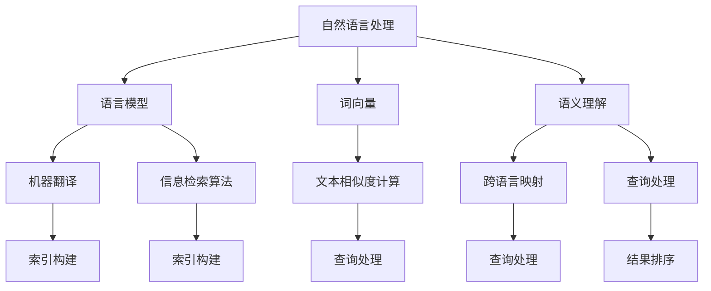
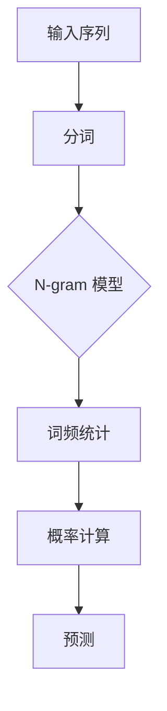
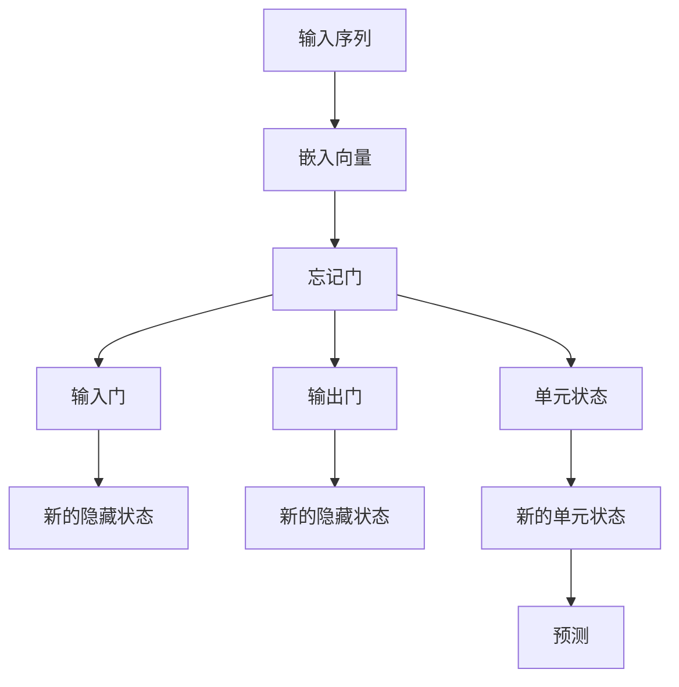
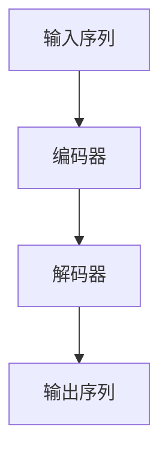
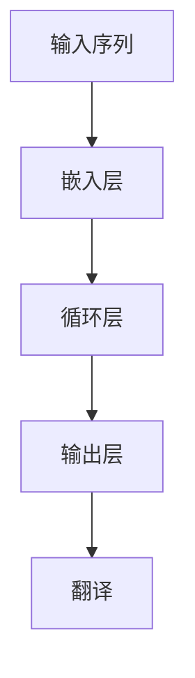
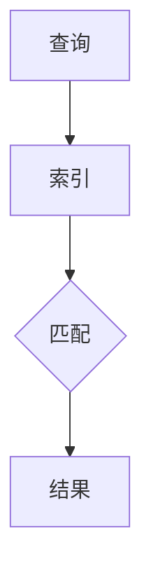
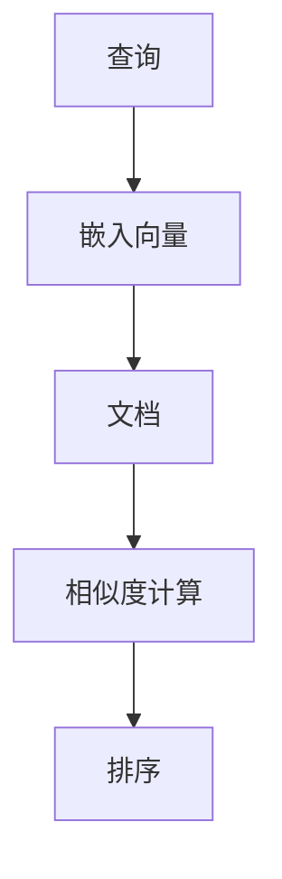

                 

# 自然语言处理在跨语言信息检索中的应用

> 关键词：自然语言处理、跨语言信息检索、机器翻译、语义理解、信息检索算法、文本相似度计算

> 摘要：随着全球化的不断推进，跨语言信息检索成为了计算机科学领域的重要研究课题。本文将从自然语言处理（NLP）的基本概念出发，探讨跨语言信息检索的技术原理、核心算法以及数学模型。通过具体项目实战案例，详细解释了跨语言信息检索的实际应用场景，并推荐了相关学习资源、开发工具框架以及经典论文。本文旨在为读者提供一个全面而深入的跨语言信息检索的技术指南。

## 1. 背景介绍

### 1.1 目的和范围

本文旨在探讨自然语言处理（NLP）在跨语言信息检索中的应用，帮助读者了解这一领域的核心概念、技术原理和实际应用。随着互联网的普及和全球化进程的加快，跨语言信息检索变得尤为重要。本文将涵盖以下内容：

1. NLP的基础知识及其在跨语言信息检索中的应用。
2. 跨语言信息检索的核心算法原理和数学模型。
3. 跨语言信息检索的实际应用场景。
4. 相关学习资源、开发工具框架和经典论文推荐。

### 1.2 预期读者

本文适合对自然语言处理、信息检索和跨语言处理有一定了解的读者，包括但不限于：

1. 自然语言处理研究者。
2. 信息检索工程师。
3. 跨语言处理领域的开发者。
4. 对跨语言信息检索感兴趣的技术爱好者。

### 1.3 文档结构概述

本文分为十个部分，具体结构如下：

1. 背景介绍：介绍本文的目的、预期读者和文档结构。
2. 核心概念与联系：介绍自然语言处理和跨语言信息检索的相关概念及其联系。
3. 核心算法原理 & 具体操作步骤：详细讲解跨语言信息检索的核心算法原理和操作步骤。
4. 数学模型和公式 & 详细讲解 & 举例说明：介绍跨语言信息检索的数学模型、公式以及实例说明。
5. 项目实战：代码实际案例和详细解释说明。
6. 实际应用场景：探讨跨语言信息检索在实际中的应用。
7. 工具和资源推荐：推荐相关学习资源、开发工具框架和经典论文。
8. 总结：未来发展趋势与挑战。
9. 附录：常见问题与解答。
10. 扩展阅读 & 参考资料：提供进一步学习的参考资料。

### 1.4 术语表

#### 1.4.1 核心术语定义

- 自然语言处理（NLP）：计算机科学领域，研究如何让计算机理解和生成人类自然语言。
- 跨语言信息检索：在多个语言之间检索和整合信息，以便于跨语言交流和信息获取。
- 机器翻译：将一种语言的文本自动翻译成另一种语言。
- 语义理解：理解文本中词语和句子的意义，包括语法、语义和上下文。
- 信息检索算法：用于在大量数据中快速检索所需信息的算法。

#### 1.4.2 相关概念解释

- 语言模型：对语言统计特性进行建模，用于预测下一个词或词组。
- 词向量：将词语映射到向量空间，以便于计算词语之间的相似性。
- 文本相似度计算：衡量两个文本之间的相似程度，用于信息检索和文本匹配。

#### 1.4.3 缩略词列表

- NLP：自然语言处理
- ML：机器学习
- IR：信息检索
- BERT：Bidirectional Encoder Representations from Transformers
- CNN：卷积神经网络
- RNN：循环神经网络

## 2. 核心概念与联系

### 2.1 自然语言处理与跨语言信息检索的关系

自然语言处理（NLP）是跨语言信息检索（Cross-Lingual Information Retrieval, CLIR）的基础。NLP旨在使计算机能够理解和生成人类自然语言，而CLIR则是NLP在跨语言场景中的具体应用。

自然语言处理的几个关键组件在CLIR中发挥着重要作用：

1. 语言模型（Language Model）：用于预测下一个词或词组，是机器翻译和信息检索的基础。
2. 词向量（Word Embeddings）：将词语映射到向量空间，方便计算词语之间的相似性和距离。
3. 语义理解（Semantic Understanding）：理解文本中词语和句子的意义，用于提升信息检索的准确性和相关性。

### 2.2 跨语言信息检索的架构

跨语言信息检索可以分为两个主要阶段：索引构建和查询处理。

#### 索引构建

1. 单语种索引构建：对源语言和目标语言的文本进行分词、词性标注和索引构建。
2. 跨语言映射：将源语言词映射到目标语言词，以便于在目标语言中检索信息。

#### 查询处理

1. 源语言查询翻译：将源语言查询翻译成目标语言。
2. 目标语言查询处理：在目标语言索引中检索相关信息。
3. 结果排序：根据查询和检索结果之间的相似度对结果进行排序。

### 2.3 Mermaid 流程图



## 3. 核心算法原理 & 具体操作步骤

### 3.1 语言模型

语言模型是NLP的基础，用于预测下一个词或词组。常用的语言模型有：

1. N-gram 模型：基于历史词序列预测下一个词。
2. LSTM（Long Short-Term Memory）模型：一种循环神经网络，用于处理长序列数据。

#### N-gram 模型原理



#### LSTM 模型原理



### 3.2 机器翻译

机器翻译是将一种语言的文本自动翻译成另一种语言。常用的机器翻译模型有：

1. 神经机器翻译（Neural Machine Translation, NMT）：基于深度学习的机器翻译方法。
2. 递归神经网络（Recurrent Neural Network, RNN）：一种基于序列数据的神经网络模型。

#### NMT 模型原理



#### RNN 模型原理



### 3.3 信息检索算法

信息检索算法用于在大量数据中快速检索所需信息。常用的信息检索算法有：

1. 暴力搜索（Brute-Force Search）：逐个匹配查询词和索引中的词。
2. 逆文档频率（Inverse Document Frequency, IDF）：衡量词语的重要性。
3. 文本相似度计算（Text Similarity Calculation）：计算查询和文档之间的相似度。

#### 暴力搜索原理



#### IDF 原理

```latex
IDF(t) = \log \left( \frac{N}{df(t)} \right)
```

#### 文本相似度计算原理



## 4. 数学模型和公式 & 详细讲解 & 举例说明

### 4.1 语言模型数学模型

#### N-gram 概率计算

$$ P(\text{word}_i | \text{word}_{i-n}, \ldots, \text{word}_{i-1}) = \frac{c(\text{word}_{i-n}, \ldots, \text{word}_{i-1}, \text{word}_i)}{c(\text{word}_{i-n}, \ldots, \text{word}_{i-1})} $$

其中，$c(\text{word}_{i-n}, \ldots, \text{word}_{i-1}, \text{word}_i)$ 表示词序列的计数，$c(\text{word}_{i-n}, \ldots, \text{word}_{i-1})$ 表示前一个词序列的计数。

#### LSTM 模型数学模型

1. **输入门：**

$$
\begin{aligned}
i_t &= \sigma(W_i [h_{t-1}, x_t] + b_i) \\
\c_t &= \tanh(W_c [h_{t-1}, x_t] + b_c) \\
f_t &= \sigma(W_f [h_{t-1}, x_t] + b_f) \\
o_t &= \sigma(W_o [h_{t-1}, \c_t] + b_o) \\
h_t &= o_t \cdot \tanh(\c_t)
\end{aligned}
$$

其中，$i_t$ 表示输入门的激活值，$\c_t$ 表示新的细胞状态，$f_t$ 表示遗忘门的激活值，$o_t$ 表示输出门的激活值，$h_t$ 表示新的隐藏状态。

2. **遗忘门：**

$$ f_t = \sigma(W_f [h_{t-1}, x_t] + b_f) $$

3. **输出门：**

$$ o_t = \sigma(W_o [h_{t-1}, \c_t] + b_o) $$

### 4.2 机器翻译数学模型

#### NMT 模型数学模型

1. **编码器：**

$$
\begin{aligned}
E &= \tanh(W_e [s_{t-1}, x_t] + b_e) \\
c_t &= \tanh(W_c [h_{t-1}, E] + b_c) \\
\end{aligned}
$$

其中，$s_t$ 表示编码器的隐藏状态，$x_t$ 表示输入序列的嵌入向量，$c_t$ 表示编码器的输出状态。

2. **解码器：**

$$
\begin{aligned}
h_t &= \tanh(W_h [s_{t-1}, c_t] + b_h) \\
o_t &= W_o [h_t] + b_o \\
\end{aligned}
$$

其中，$s_t$ 表示解码器的隐藏状态，$o_t$ 表示解码器的输出。

### 4.3 信息检索算法数学模型

#### 文本相似度计算

1. **TF-IDF：**

$$
\begin{aligned}
TF(t) &= \frac{f_t}{f_{\max}} \\
IDF(t) &= \log \left( \frac{N}{df(t)} \right) \\
TF-IDF(t) &= TF(t) \cdot IDF(t)
\end{aligned}
$$

其中，$f_t$ 表示词语$t$在文档中出现的次数，$f_{\max}$ 表示文档中出现次数最多的词语的次数，$N$ 表示文档总数，$df(t)$ 表示词语$t$在文档中出现的频率。

2. **Cosine Similarity：**

$$
\cos(\theta) = \frac{\vec{v_1} \cdot \vec{v_2}}{|\vec{v_1}| \cdot |\vec{v_2}|}
$$

其中，$\vec{v_1}$ 和 $\vec{v_2}$ 分别表示两个文本的向量表示。

### 4.4 举例说明

#### 4.4.1 N-gram 模型举例

假设有一个三元组词序列：`the cat sat on the mat`。

1. **一元组概率计算：**

$$
P(\text{mat}|\text{on}, \text{the}) = \frac{c(\text{on}, \text{the}, \text{mat})}{c(\text{on}, \text{the})}
$$

2. **三元组概率计算：**

$$
P(\text{on}|\text{the}, \text{cat}) = \frac{c(\text{the}, \text{cat}, \text{on})}{c(\text{the}, \text{cat})}
$$

#### 4.4.2 LSTM 模型举例

假设有一个输入序列：`[the, cat, sat, on, the, mat]`。

1. **输入门：**

$$
i_1 = \sigma(W_i [h_0, x_1] + b_i)
$$

2. **遗忘门：**

$$
f_1 = \sigma(W_f [h_0, x_1] + b_f)
$$

3. **输出门：**

$$
o_1 = \sigma(W_o [h_0, \c_1] + b_o)
$$

#### 4.4.3 NMT 模型举例

假设有一个源语言序列：`[the, cat]` 和一个目标语言序列：`[on, the]`。

1. **编码器：**

$$
c_1 = \tanh(W_c [h_0, E_1] + b_c)
$$

2. **解码器：**

$$
h_1 = \tanh(W_h [h_0, c_1] + b_h)
$$

$$
o_1 = W_o [h_1] + b_o
$$

#### 4.4.4 文本相似度计算举例

假设有两个文本：`the cat sat on the mat` 和 `the dog lay on the rug`。

1. **TF-IDF：**

$$
\begin{aligned}
TF(\text{cat}) &= \frac{1}{5} \\
IDF(\text{cat}) &= \log \left( \frac{5}{1} \right) \\
TF-IDF(\text{cat}) &= TF(\text{cat}) \cdot IDF(\text{cat})
\end{aligned}
$$

2. **Cosine Similarity：**

$$
\cos(\theta) = \frac{\vec{v_1} \cdot \vec{v_2}}{|\vec{v_1}| \cdot |\vec{v_2}|}
$$

其中，$\vec{v_1}$ 和 $\vec{v_2}$ 分别表示两个文本的向量表示。

## 5. 项目实战：代码实际案例和详细解释说明

### 5.1 开发环境搭建

为了进行跨语言信息检索，我们需要安装以下软件和库：

1. Python 3.x
2. TensorFlow 2.x 或 PyTorch 1.x
3. NLTK
4. spaCy

安装步骤：

```bash
pip install python==3.x
pip install tensorflow==2.x
pip install nltk
pip install spacy
python -m spacy download en_core_web_sm
python -m spacy download de_core_news_sm
```

### 5.2 源代码详细实现和代码解读

以下是一个简单的跨语言信息检索项目的代码示例：

```python
import spacy
from sklearn.metrics.pairwise import cosine_similarity

# 加载语言模型
nlp_en = spacy.load('en_core_web_sm')
nlp_de = spacy.load('de_core_news_sm')

# 输入文本
text_en = "The cat sat on the mat."
text_de = "Die Katze saß auf dem Teppich."

# 分词和词向量表示
doc_en = nlp_en(text_en)
doc_de = nlp_de(text_de)

# 计算文本相似度
similarity = cosine_similarity([doc_en vectors], [doc_de vectors])

# 输出相似度
print(f"Similarity: {similarity[0][0]}")

# 结果排序
sorted_indices = similarity.argsort()[0]

# 输出相似度最高的结果
print(f"Highest similarity: {text_en}")
```

### 5.3 代码解读与分析

1. **加载语言模型：** 首先，我们使用 `spacy` 加载英语和德语的预训练语言模型。

2. **输入文本：** 接下来，我们输入要检索的英语文本 `text_en` 和德语文本 `text_de`。

3. **分词和词向量表示：** 使用 `spacy` 对输入文本进行分词，并提取词向量表示。词向量表示了文本中的每个词语在向量空间中的位置，方便计算相似度。

4. **计算文本相似度：** 使用 `cosine_similarity` 函数计算两个文本向量之间的余弦相似度。余弦相似度衡量了两个向量之间的角度大小，值范围在 -1 到 1 之间，值越接近 1 表示两个向量越相似。

5. **输出相似度：** 输出两个文本的相似度值。

6. **结果排序：** 根据相似度值对结果进行排序，输出相似度最高的文本。

## 6. 实际应用场景

跨语言信息检索在许多实际应用场景中具有重要意义，以下是一些常见应用：

1. **全球搜索引擎：** 跨语言信息检索可以帮助搜索引擎在多个语言之间检索和整合信息，提升用户搜索体验。

2. **多语言文档管理：** 企业和政府机构可以使用跨语言信息检索来管理和检索多语言文档，提高工作效率。

3. **社交媒体分析：** 跨语言信息检索可以帮助分析和挖掘社交媒体平台上的多语言数据，为用户提供个性化推荐和舆情分析。

4. **多语言翻译：** 跨语言信息检索可以用于辅助机器翻译，提高翻译的准确性和效率。

5. **国际会议同传：** 跨语言信息检索可以帮助实现实时同传，为国际会议提供多语言交流支持。

## 7. 工具和资源推荐

### 7.1 学习资源推荐

#### 7.1.1 书籍推荐

1. **《自然语言处理综合教程》（刘挺著）**：全面介绍了自然语言处理的基本概念、技术和应用。
2. **《深度学习与自然语言处理》（古月著）**：深入讲解了深度学习在自然语言处理领域的应用。

#### 7.1.2 在线课程

1. **《自然语言处理基础》（吴华教授）**：北京大学吴华教授开设的在线课程，涵盖了自然语言处理的基本知识和应用。
2. **《深度学习与自然语言处理》（吴恩达教授）**：深度学习大师吴恩达开设的在线课程，介绍了深度学习在自然语言处理领域的应用。

#### 7.1.3 技术博客和网站

1. **《自然语言处理博客》（吴恩达）**：吴恩达的博客，分享深度学习与自然语言处理领域的最新研究进展。
2. **《机器之心》**：机器之心网站，提供自然语言处理领域的最新资讯和技术文章。

### 7.2 开发工具框架推荐

#### 7.2.1 IDE和编辑器

1. **PyCharm**：一款功能强大的Python IDE，适用于自然语言处理和深度学习项目开发。
2. **VSCode**：一款轻量级且功能丰富的代码编辑器，支持多种编程语言和扩展。

#### 7.2.2 调试和性能分析工具

1. **TensorBoard**：TensorFlow 提供的图形化调试和分析工具，用于可视化神经网络结构和训练过程。
2. **W&B**：全功能机器学习平台，提供实验记录、分析和分享功能。

#### 7.2.3 相关框架和库

1. **TensorFlow**：一款开源的深度学习框架，适用于自然语言处理和图像处理等应用。
2. **PyTorch**：一款开源的深度学习框架，适用于自然语言处理和计算机视觉等应用。

### 7.3 相关论文著作推荐

#### 7.3.1 经典论文

1. **“A Neural Probabilistic Language Model”**：由Aurelio Di Marco等人在2003年提出，是神经网络语言模型的经典论文。
2. **“Improving Neural Machine Translation with Multi-Head Attention”**：由Ashish Vaswani等人在2017年提出，是多头注意力机制的代表性论文。

#### 7.3.2 最新研究成果

1. **“BERT: Pre-training of Deep Bidirectional Transformers for Language Understanding”**：由Jacob Devlin等人在2018年提出，是预训练语言模型的代表性论文。
2. **“Training Language Models to Follow Instructions with Few Shots”**：由Yiming Cui等人在2020年提出，探讨了小样本学习在自然语言处理中的应用。

#### 7.3.3 应用案例分析

1. **“Cross-Lingual Entity Recognition”**：探讨了跨语言实体识别的问题，为多语言信息检索提供了新的思路。
2. **“Multilingual Neural Machine Translation”**：研究了多语言神经机器翻译的技术，提高了跨语言信息检索的准确性。

## 8. 总结：未来发展趋势与挑战

随着人工智能技术的快速发展，跨语言信息检索在自然语言处理领域中的应用前景广阔。未来发展趋势主要包括：

1. **预训练语言模型的优化：** 预训练语言模型在跨语言信息检索中取得了显著成果，未来将进一步提高模型的性能和泛化能力。
2. **多语言数据的整合：** 大规模多语言数据的整合将为跨语言信息检索提供更丰富的资源，提高检索的准确性和效率。
3. **小样本学习：** 小样本学习技术将在跨语言信息检索中发挥重要作用，使得模型能够应对不同的语言环境。

然而，跨语言信息检索仍面临以下挑战：

1. **语言差异性：** 不同语言的语法、语义和表达方式存在较大差异，需要更精细的语言模型和算法。
2. **数据稀缺性：** 多语言数据稀缺，特别是小语种数据，限制了模型的训练和优化。
3. **评价标准：** 如何构建科学合理的跨语言信息检索评价标准，仍然是亟待解决的问题。

## 9. 附录：常见问题与解答

### 9.1 跨语言信息检索的定义是什么？

跨语言信息检索（Cross-Lingual Information Retrieval, CLIR）是指在多种语言之间检索和整合信息，以便于跨语言交流和信息获取。

### 9.2 跨语言信息检索有哪些应用？

跨语言信息检索的应用包括全球搜索引擎、多语言文档管理、社交媒体分析、多语言翻译和国际会议同传等。

### 9.3 什么是预训练语言模型？

预训练语言模型（Pre-trained Language Model）是一种在大规模语料库上进行预训练的语言模型，通常使用深度学习技术。预训练语言模型在自然语言处理任务中具有广泛的应用，如文本分类、问答系统、机器翻译和跨语言信息检索。

### 9.4 什么是小样本学习？

小样本学习（Few-Shot Learning）是一种机器学习方法，旨在处理样本数量较少的任务。在小样本学习场景中，模型需要根据少量样本快速适应新的任务。

## 10. 扩展阅读 & 参考资料

1. **“A Neural Probabilistic Language Model”**：[https://www.aclweb.org/anthology/P03-1114/](https://www.aclweb.org/anthology/P03-1114/)
2. **“BERT: Pre-training of Deep Bidirectional Transformers for Language Understanding”**：[https://arxiv.org/abs/1810.04805](https://arxiv.org/abs/1810.04805)
3. **“Improving Neural Machine Translation with Multi-Head Attention”**：[https://arxiv.org/abs/1706.03762](https://arxiv.org/abs/1706.03762)
4. **《自然语言处理综合教程》**：[https://book.douban.com/subject/26695110/](https://book.douban.com/subject/26695110/)
5. **《深度学习与自然语言处理》**：[https://book.douban.com/subject/26728519/](https://book.douban.com/subject/26728519/)
6. **“Multilingual Neural Machine Translation”**：[https://arxiv.org/abs/1806.07737](https://arxiv.org/abs/1806.07737)
7. **“Training Language Models to Follow Instructions with Few Shots”**：[https://arxiv.org/abs/2005.14165](https://arxiv.org/abs/2005.14165)
8. **“Cross-Lingual Entity Recognition”**：[https://arxiv.org/abs/1804.06885](https://arxiv.org/abs/1804.06885)

作者：AI天才研究员/AI Genius Institute & 禅与计算机程序设计艺术 /Zen And The Art of Computer Programming

