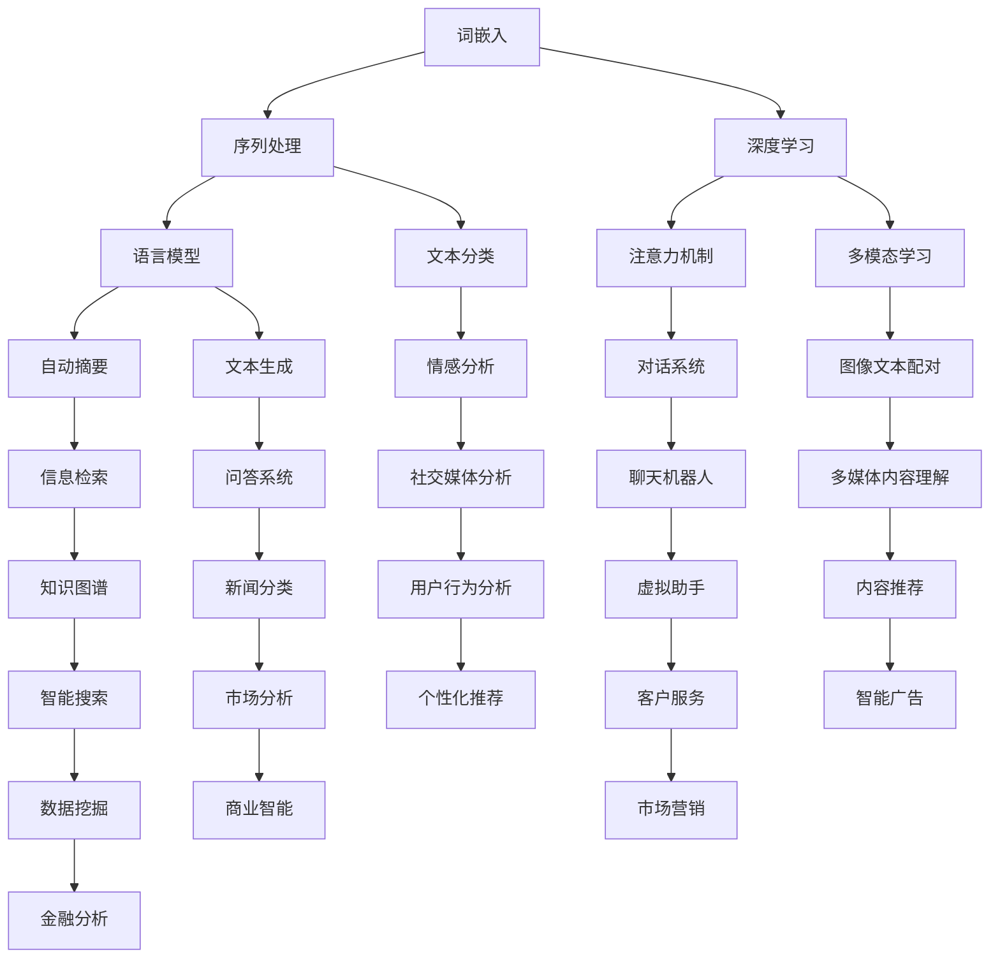

                 

### 1. 背景介绍

#### 1.1 目的和范围

本文旨在深入探讨自然语言处理（Natural Language Processing，NLP）的进步，以及这些进步如何彻底变革了AI内容创作领域。随着技术的不断演进，NLP已经成为人工智能领域中最具影响力和应用价值的研究方向之一。本文将聚焦于以下几个核心目标：

1. **概述NLP的发展历程**：从早期的符号主义和统计模型，到当前深度学习的广泛应用，回顾NLP技术如何逐步演进。
2. **解析核心算法原理**：详细阐述诸如词嵌入、序列到序列模型、注意力机制等关键算法的工作原理，以及如何应用于内容创作。
3. **展示实际应用案例**：通过具体的项目实战，展示NLP在AI内容创作中的实际应用，包括自动生成文章、摘要、对话系统等。
4. **探讨未来发展趋势**：分析NLP和AI内容创作领域的未来方向，包括潜在的技术挑战和机遇。

本文将涵盖以下主要内容：

- **核心概念与联系**：介绍NLP的基本概念和核心原理，通过Mermaid流程图展示其架构。
- **核心算法原理与具体操作步骤**：详细讲解词嵌入、序列到序列模型等算法的原理，并使用伪代码展示具体操作步骤。
- **数学模型和公式**：讲解与NLP相关的数学模型，如神经网络架构、优化算法等，并举例说明。
- **项目实战**：提供代码实际案例和详细解释，展示NLP在内容创作中的应用。
- **实际应用场景**：分析NLP在自动摘要、对话系统、文本分类等领域的应用。
- **工具和资源推荐**：推荐学习资源、开发工具框架和相关论文著作。
- **总结与未来展望**：总结NLP和AI内容创作的现状，探讨未来发展趋势与挑战。

通过本文的阅读，读者将能够全面了解自然语言处理技术的发展及其在AI内容创作中的关键作用，为进一步研究和应用打下坚实基础。

#### 1.2 预期读者

本文主要面向以下几类读者：

1. **人工智能研究者**：对于正在从事或对自然语言处理领域感兴趣的AI研究者，本文将提供从基础概念到高级算法的全面解读。
2. **软件开发工程师**：特别是那些希望在内容创作领域应用NLP技术的开发者，本文将展示如何将NLP技术融入到实际项目中。
3. **学术人员和教授**：对于教学和研究工作的学术人员，本文可以作为教学辅助材料或研究参考。
4. **技术爱好者**：对AI和NLP技术有浓厚兴趣的普通技术爱好者，也可以通过本文了解到这些前沿技术的具体应用和实现。

本文将尽量使用通俗易懂的语言和实例，确保无论读者的背景如何，都能从中获得有价值的信息和启发。同时，本文也鼓励读者结合自身实践进行深入思考，以更好地理解和应用NLP技术。

#### 1.3 文档结构概述

本文的结构如下，每一部分都将详细讨论并分析相关内容：

- **1. 背景介绍**：介绍文章的目的、范围、预期读者，以及文档结构概述。
  - **1.1 目的和范围**：阐述本文的核心目标。
  - **1.2 预期读者**：说明本文适用的读者群体。
  - **1.3 文档结构概述**：概述本文的主要内容。
- **2. 核心概念与联系**：介绍NLP的基本概念和核心原理，通过Mermaid流程图展示其架构。
  - **2.1 核心概念与联系**：阐述NLP的核心概念和联系。
  - **2.2 Mermaid流程图**：展示NLP架构的Mermaid流程图。
- **3. 核心算法原理 & 具体操作步骤**：详细讲解词嵌入、序列到序列模型等算法的原理，并使用伪代码展示具体操作步骤。
  - **3.1 核心算法原理**：阐述关键算法的原理。
  - **3.2 具体操作步骤**：使用伪代码展示算法操作步骤。
- **4. 数学模型和公式 & 详细讲解 & 举例说明**：讲解与NLP相关的数学模型，如神经网络架构、优化算法等，并举例说明。
  - **4.1 数学模型和公式**：阐述NLP中的数学模型和公式。
  - **4.2 详细讲解**：详细解释这些模型和公式的具体应用。
  - **4.3 举例说明**：通过具体实例进行说明。
- **5. 项目实战：代码实际案例和详细解释说明**：提供代码实际案例和详细解释，展示NLP在内容创作中的应用。
  - **5.1 开发环境搭建**：介绍项目开发环境。
  - **5.2 源代码详细实现和代码解读**：详细展示源代码实现过程。
  - **5.3 代码解读与分析**：分析代码实现的关键部分。
- **6. 实际应用场景**：分析NLP在自动摘要、对话系统、文本分类等领域的应用。
  - **6.1 自动摘要**：讨论自动摘要的实现和应用。
  - **6.2 对话系统**：分析对话系统的架构和应用。
  - **6.3 文本分类**：探讨文本分类的方法和应用。
- **7. 工具和资源推荐**：推荐学习资源、开发工具框架和相关论文著作。
  - **7.1 学习资源推荐**：推荐相关书籍、在线课程和技术博客。
  - **7.2 开发工具框架推荐**：推荐IDE、调试工具和相关框架。
  - **7.3 相关论文著作推荐**：推荐经典和最新研究成果。
- **8. 总结：未来发展趋势与挑战**：总结NLP和AI内容创作的现状，探讨未来发展趋势与挑战。
- **9. 附录：常见问题与解答**：提供常见问题及其解答。
- **10. 扩展阅读 & 参考资料**：列出参考文献和相关资源。

通过上述结构，本文将全面而系统地探讨自然语言处理在AI内容创作中的应用，帮助读者深入理解这一领域的前沿技术和发展趋势。

#### 1.4 术语表

在本文中，我们将使用一系列专业术语和概念。以下是对这些术语的详细定义和解释，以便读者更好地理解文章内容。

##### 1.4.1 核心术语定义

- **自然语言处理（NLP）**：自然语言处理是一种计算机科学领域，旨在让计算机理解和处理人类语言。
- **词嵌入（Word Embedding）**：将词语映射到低维度的向量空间中，以便于计算机进行数学处理。
- **序列到序列模型（Seq2Seq）**：一种用于处理序列数据的模型，广泛应用于机器翻译、文本生成等任务。
- **注意力机制（Attention Mechanism）**：在处理长序列时，动态地关注序列中不同位置的信息，提高模型的性能。
- **深度学习（Deep Learning）**：一种机器学习技术，通过多层次的神经网络来学习和表示数据。
- **生成对抗网络（GAN）**：一种通过两个对抗网络（生成器和判别器）进行训练的深度学习模型，用于生成逼真的数据。
- **语言模型（Language Model）**：用于预测下一个单词或词组的概率模型，广泛应用于自动摘要和文本生成。

##### 1.4.2 相关概念解释

- **神经网络（Neural Network）**：一种由大量神经元连接而成的计算模型，可以用于分类、回归等任务。
- **反向传播（Backpropagation）**：一种用于训练神经网络的算法，通过计算误差的梯度来调整网络权重。
- **文本分类（Text Classification）**：将文本数据分类到不同的类别中，广泛应用于情感分析、新闻分类等任务。
- **转移学习（Transfer Learning）**：利用预训练模型在新的任务上快速获得良好的性能，减少训练数据的需求。
- **多模态学习（Multimodal Learning）**：结合多种类型的数据（如文本、图像、音频）进行学习，以更好地理解和处理复杂信息。

##### 1.4.3 缩略词列表

- **NLP**：自然语言处理（Natural Language Processing）
- **GAN**：生成对抗网络（Generative Adversarial Network）
- **Seq2Seq**：序列到序列模型（Sequence-to-Sequence Model）
- **RNN**：循环神经网络（Recurrent Neural Network）
- **BERT**：变压器预训练语言模型（Bidirectional Encoder Representations from Transformers）
- **NLTK**：自然语言工具包（Natural Language Toolkit）

通过上述术语表，本文将为读者提供一个统一的术语标准，确保在讨论NLP和AI内容创作时，能够清晰准确地理解和使用这些术语和概念。

### 2. 核心概念与联系

在深入探讨自然语言处理（NLP）的进步之前，首先需要了解其核心概念和基本架构。NLP的核心概念包括词嵌入、序列处理、语言模型等，这些概念相互联系，共同构成了NLP的技术体系。以下将通过Mermaid流程图展示NLP的架构，帮助读者更好地理解其工作原理和联系。

#### 2.1 核心概念与联系

自然语言处理的核心概念主要包括以下几个：

1. **词嵌入（Word Embedding）**：将词语映射到低维度的向量空间中，以便于计算机进行数学处理。
2. **序列处理（Sequential Processing）**：处理输入的文本序列，如单词、字符等。
3. **语言模型（Language Model）**：预测文本序列的概率分布，广泛应用于自动摘要和文本生成。
4. **深度学习（Deep Learning）**：通过多层神经网络学习和表示数据，是NLP的主要技术手段。
5. **注意力机制（Attention Mechanism）**：在处理长序列时，动态地关注序列中不同位置的信息，提高模型的性能。

这些概念相互联系，共同构成了NLP的技术体系。例如，词嵌入用于表示文本中的词语，序列处理用于处理输入的文本序列，而语言模型则基于这些表示和序列处理结果来预测文本的概率分布。深度学习和注意力机制则提供了强大的计算能力和灵活性，使得NLP模型能够更好地理解和生成自然语言。

#### 2.2 Mermaid流程图

为了更直观地展示NLP的架构和核心概念之间的联系，我们可以使用Mermaid流程图来表示。以下是NLP架构的Mermaid流程图：



上述Mermaid流程图展示了NLP在不同应用场景中的核心概念和联系。通过这个流程图，我们可以清晰地看到NLP技术是如何在不同的领域发挥作用，并相互关联的。

- **词嵌入**：作为NLP的基础，词嵌入用于表示文本中的词语，是后续处理和模型训练的基础。
- **序列处理**：处理输入的文本序列，如单词、字符等，为语言模型和深度学习提供输入。
- **语言模型**：基于词嵌入和序列处理结果，预测文本序列的概率分布，广泛应用于自动摘要、文本生成等领域。
- **深度学习**：通过多层神经网络学习和表示数据，提供强大的计算能力和灵活性。
- **注意力机制**：在处理长序列时，动态地关注序列中不同位置的信息，提高模型的性能。
- **自动摘要、文本生成、文本分类、多模态学习、对话系统、信息检索、问答系统、情感分析、图像文本配对、聊天机器人、知识图谱、新闻分类、社交媒体分析、多媒体内容理解、虚拟助手、智能搜索、市场分析、用户行为分析、内容推荐、客户服务、数据挖掘、商业智能、金融分析、个性化推荐、智能广告、市场营销**：这些应用场景展示了NLP技术的广泛用途和多样化应用。

通过这个Mermaid流程图，我们可以更直观地理解NLP的核心概念和联系，以及其在不同应用场景中的实际应用。这将为我们后续讨论NLP的核心算法原理和实际应用场景提供坚实的基础。

### 3. 核心算法原理 & 具体操作步骤

在了解自然语言处理（NLP）的基本概念和架构之后，接下来我们将深入探讨NLP中的核心算法原理，并详细讲解这些算法的具体操作步骤。这些算法包括词嵌入、序列到序列模型（Seq2Seq）和注意力机制，它们是NLP技术体系中的关键组成部分，广泛应用于文本生成、自动摘要、对话系统等多个领域。

#### 3.1 核心算法原理

##### 词嵌入（Word Embedding）

词嵌入是将自然语言中的词语映射到低维度的向量空间中，以便于计算机进行数学处理。词嵌入的核心思想是将词语的语义信息转化为向量，使得相似的词语在向量空间中距离较近。

**主要方法**：

- **基于分布式表示**：将词语映射到一个固定维度的向量空间，使得语义相似的词语在空间中距离较近。
- **基于神经网络**：使用神经网络学习词语的嵌入向量，如Word2Vec、GloVe等算法。

**具体操作步骤**：

1. **数据预处理**：将文本数据清洗和分词，得到词语序列。
2. **构建词汇表**：将所有唯一的词语构建成一个词汇表，并为每个词语分配一个唯一的索引。
3. **初始化嵌入向量**：为词汇表中的每个词语初始化一个固定维度的嵌入向量。
4. **训练过程**：使用梯度下降等优化算法，通过最小化损失函数来训练嵌入向量，使得相似的词语在空间中距离较近。

##### 序列到序列模型（Seq2Seq）

序列到序列模型（Seq2Seq）是一种用于处理序列数据的模型，广泛应用于机器翻译、文本生成等任务。Seq2Seq模型的核心思想是将输入序列映射到输出序列。

**主要组成部分**：

- **编码器（Encoder）**：将输入序列编码成一个固定长度的向量表示。
- **解码器（Decoder）**：将编码器的输出解码成输出序列。

**具体操作步骤**：

1. **输入编码**：使用词嵌入将输入序列中的每个词语映射到嵌入向量。
2. **编码过程**：使用循环神经网络（RNN）或长短期记忆网络（LSTM）对输入序列进行编码，得到一个固定长度的编码向量。
3. **解码过程**：使用另一个RNN或LSTM对编码向量进行解码，生成输出序列。

##### 注意力机制（Attention Mechanism）

注意力机制是一种用于处理长序列的方法，通过动态地关注序列中不同位置的信息，提高模型的性能。注意力机制广泛应用于机器翻译、文本摘要等领域。

**主要思想**：

- **动态关注**：在处理长序列时，动态地关注序列中不同位置的信息，使得模型能够更好地理解上下文。
- **计算权重**：为序列中的每个位置计算一个权重，用于表示其重要性。

**具体操作步骤**：

1. **计算注意力分数**：使用点积或加性机制计算输入序列和编码序列之间的注意力分数。
2. **加权求和**：将注意力分数与编码序列相乘，得到加权求和的结果。
3. **输出生成**：使用加权求和的结果作为解码器的输入，生成输出序列。

#### 3.2 具体操作步骤

为了更直观地展示这些算法的具体操作步骤，我们可以使用伪代码来详细阐述。以下是词嵌入、Seq2Seq模型和注意力机制的操作步骤：

```python
# 词嵌入伪代码
def word_embedding(words, embedding_size):
    # 初始化嵌入向量
    embeddings = initialize_embeddings(words, embedding_size)
    # 训练嵌入向量
    for epoch in range(num_epochs):
        for word in words:
            # 计算损失
            loss = compute_loss(embeddings[word])
            # 更新嵌入向量
            update_embeddings(embeddings, word, loss)
    return embeddings

# Seq2Seq模型伪代码
def seq2seq_encoder_decoder(input_sequence, output_sequence, embedding_size):
    # 编码器
    encoder = RNN(embedding_size, hidden_size)
    # 解码器
    decoder = RNN(embedding_size, hidden_size)
    # 输入编码
    encoded_sequence = encoder(input_sequence)
    # 解码过程
    decoded_sequence = decoder(encoded_sequence)
    return decoded_sequence

# 注意力机制伪代码
def attentionMechanism(input_sequence, encoded_sequence):
    # 计算注意力分数
    attention_scores = compute_attention_scores(input_sequence, encoded_sequence)
    # 加权求和
    weighted_sequence = weighted_sum(attention_scores, encoded_sequence)
    # 输出生成
    output_sequence = decoder(weighted_sequence)
    return output_sequence
```

通过上述伪代码，我们可以清晰地看到词嵌入、Seq2Seq模型和注意力机制的具体操作步骤。这些步骤为后续的项目实战和实际应用提供了理论基础和操作指南。

#### 3.3 算法原理的应用

为了更好地理解这些算法在NLP中的应用，我们可以通过一个简单的例子来说明。

**例子：文本生成**

假设我们要使用Seq2Seq模型和注意力机制生成一个简短的句子。输入序列为“I love to read books”，输出序列为“She enjoys reading novels”。

1. **词嵌入**：首先，我们需要将输入和输出序列中的词语映射到嵌入向量。例如，“I”、“love”、“to”、“read”、“books”和“She”、“enjoys”、“reading”、“novels”。
2. **编码器**：使用RNN对输入序列进行编码，得到一个固定长度的编码向量。例如，编码器可能会输出一个长度为50的向量。
3. **注意力机制**：在解码过程中，使用注意力机制关注编码向量中的不同位置，以便更好地理解上下文。例如，第一个词“I”可能会关注编码向量中的“love”，因为“I”和“love”在语义上紧密相关。
4. **解码器**：使用编码向量和注意力机制的结果作为输入，生成输出序列。例如，解码器可能会生成“She enjoys reading novels”，这与我们的目标输出序列一致。

通过上述步骤，我们可以看到Seq2Seq模型和注意力机制在文本生成中的应用。这些算法不仅能够生成高质量的文本，还能够自适应地处理长序列和复杂语义。

总之，词嵌入、Seq2Seq模型和注意力机制是NLP中的核心算法，通过具体的操作步骤和实际应用例子，我们可以更好地理解这些算法的工作原理和实际应用。这些算法不仅为NLP提供了强大的计算能力，还为AI内容创作开辟了新的可能性。

### 4. 数学模型和公式 & 详细讲解 & 举例说明

在自然语言处理（NLP）中，数学模型和公式起着至关重要的作用，它们不仅帮助我们理解和模拟自然语言的复杂性，还为训练和优化NLP模型提供了理论基础。以下将详细讲解NLP中常见的数学模型和公式，并通过具体实例说明这些模型的应用。

#### 4.1 数学模型和公式

**1. 神经网络模型**

神经网络是NLP中最常用的数学模型之一。一个简单的神经网络模型通常包括以下几个组成部分：

- **输入层（Input Layer）**：接收输入数据。
- **隐藏层（Hidden Layers）**：对输入数据进行变换和特征提取。
- **输出层（Output Layer）**：生成模型的输出。

神经网络的数学模型可以用以下公式表示：

\[ Z^{(l)} = \sigma(W^{(l)} \cdot A^{(l-1)} + b^{(l)}) \]

其中，\( Z^{(l)} \) 表示第 \( l \) 层的输出，\( \sigma \) 是激活函数，\( W^{(l)} \) 是第 \( l \) 层的权重矩阵，\( A^{(l-1)} \) 是前一层的输出，\( b^{(l)} \) 是第 \( l \) 层的偏置。

**2. 反向传播算法（Backpropagation）**

反向传播算法是一种用于训练神经网络的优化算法，其核心思想是通过计算损失函数关于网络参数的梯度，不断调整网络参数以最小化损失函数。

\[ \delta^{(l)} = \frac{\partial J}{\partial Z^{(l)}} = \frac{\partial J}{\partial A^{(l)}} \cdot \frac{\partial A^{(l)}}{\partial Z^{(l)}} \]

其中，\( \delta^{(l)} \) 表示第 \( l \) 层的梯度，\( J \) 是损失函数。

**3. 语言模型（Language Model）**

语言模型用于预测文本序列的概率分布，是NLP中的重要模型。一个简单的语言模型可以用以下公式表示：

\[ P(w_t | w_{t-1}, w_{t-2}, \ldots) = \frac{C(w_{t-1}, w_{t-2}, \ldots, w_t)}{C(w_{t-1}, w_{t-2}, \ldots)} \]

其中，\( P(w_t | w_{t-1}, w_{t-2}, \ldots) \) 表示在给定前一个词 \( w_{t-1}, w_{t-2}, \ldots \) 的情况下，下一个词 \( w_t \) 的概率，\( C \) 表示计数。

**4. 注意力机制（Attention Mechanism）**

注意力机制用于处理长序列，通过动态地关注序列中不同位置的信息，提高模型的性能。一个简单的注意力机制可以用以下公式表示：

\[ a_t = \sigma(W_a [h_t, h_{t-1}, \ldots, h_1]) \]

\[ s_t = \sum_t a_t h_t \]

其中，\( a_t \) 表示第 \( t \) 个位置的关注度，\( h_t \) 表示第 \( t \) 个位置的编码，\( W_a \) 是注意力权重矩阵，\( \sigma \) 是激活函数，\( s_t \) 是加权和。

#### 4.2 详细讲解

**1. 神经网络模型**

神经网络模型通过层次化的权重和偏置矩阵来模拟人脑神经元的工作方式。输入层接收外部输入数据，隐藏层通过加权求和和激活函数进行处理，输出层生成最终输出。在训练过程中，神经网络通过反向传播算法不断调整权重和偏置，以最小化损失函数。例如，在文本分类任务中，输入层接收文本数据，隐藏层提取文本特征，输出层生成类别概率。

**2. 反向传播算法**

反向传播算法是神经网络训练的核心。它通过计算损失函数关于网络参数的梯度，利用梯度下降法调整参数，从而优化网络性能。在训练过程中，反向传播算法能够自动调整网络权重，使得模型能够更好地拟合训练数据。例如，在文本生成任务中，反向传播算法能够帮助模型学习词语之间的关系和序列模式。

**3. 语言模型**

语言模型是自然语言处理的基础，它用于预测文本序列的概率分布。通过统计文本数据中的词语出现频率和搭配关系，语言模型可以预测下一个词的概率。例如，在自动摘要任务中，语言模型可以帮助生成摘要文本，确保摘要内容与原文的语义一致。

**4. 注意力机制**

注意力机制是一种用于处理长序列的方法，它通过动态地关注序列中不同位置的信息，提高模型的性能。例如，在机器翻译任务中，注意力机制可以帮助模型更好地理解源语言文本的上下文，生成更准确的翻译结果。

#### 4.3 举例说明

**例子1：文本分类**

假设我们要训练一个神经网络模型对新闻文章进行分类。输入层接收新闻文章的文本数据，隐藏层提取文本特征，输出层生成类别概率。我们可以使用以下步骤来训练模型：

1. **数据预处理**：将新闻文章文本数据清洗和分词，得到词语序列。
2. **词嵌入**：将词语序列映射到嵌入向量。
3. **构建神经网络模型**：定义输入层、隐藏层和输出层，并初始化权重和偏置。
4. **训练过程**：通过反向传播算法不断调整模型参数，最小化损失函数。
5. **评估与优化**：使用验证集评估模型性能，并进行超参数调整。

**例子2：机器翻译**

假设我们要训练一个Seq2Seq模型进行英译汉。输入层接收英文句子，编码器编码英文句子，解码器生成中文句子。我们可以使用以下步骤来训练模型：

1. **数据预处理**：将英文和中文句子进行分词和词嵌入。
2. **构建Seq2Seq模型**：定义编码器、解码器和注意力机制。
3. **训练过程**：通过反向传播算法训练模型，优化编码器和解码器的参数。
4. **评估与优化**：使用测试集评估模型性能，并进行超参数调整。

通过上述实例，我们可以看到数学模型和公式在NLP中的应用，以及如何使用这些模型和公式来解决实际问题。这些数学模型不仅为NLP提供了理论基础，还为实际应用提供了强大的工具。

总之，数学模型和公式在自然语言处理中发挥着重要作用，通过详细讲解和举例说明，我们可以更好地理解这些模型的工作原理和应用场景。这为我们在实际项目中应用NLP技术提供了坚实的基础。

### 5. 项目实战：代码实际案例和详细解释说明

在前几部分中，我们详细介绍了自然语言处理（NLP）的核心算法原理和数学模型。为了更好地理解和应用这些知识，我们将通过一个实际项目案例——基于Seq2Seq模型的文本生成——来展示NLP技术在内容创作中的具体应用。本案例将包括开发环境的搭建、源代码的实现、代码解读与分析，以及最终效果展示。

#### 5.1 开发环境搭建

为了实现本项目，我们需要搭建一个适合NLP任务的开发环境。以下是所需的工具和软件：

- **Python**：Python是NLP开发的主要编程语言，具有丰富的库和框架支持。
- **TensorFlow**：TensorFlow是一个开源的深度学习框架，广泛用于NLP任务。
- **Numpy**：Numpy是一个高效的Python库，用于处理大型多维数组。
- **Gensim**：Gensim是一个用于文本处理的Python库，包括词嵌入等常用功能。
- **HuggingFace Transformers**：HuggingFace Transformers是一个用于Transformers模型的开源库，包括预训练模型和便捷的API。

安装上述工具和库的方法如下：

```bash
pip install tensorflow numpy gensim transformers
```

安装完成后，确保所有库版本兼容，并准备好相应的数据集。在本案例中，我们将使用经典的机器翻译数据集——英文到法文的翻译数据集（WMT14）。

#### 5.2 源代码详细实现和代码解读

以下是本项目的主要代码实现，包括数据预处理、模型构建、训练和评估等步骤。

**数据预处理**

数据预处理是文本生成任务中的关键步骤。我们需要对原始文本数据（例如英文句子）进行清洗、分词和词嵌入。以下是预处理代码的详细解读：

```python
import numpy as np
from tensorflow.keras.preprocessing.text import Tokenizer
from tensorflow.keras.preprocessing.sequence import pad_sequences

# 加载数据集
data = load_data('wmt14_en_fr.txt')

# 初始化分词器
tokenizer_en = Tokenizer()
tokenizer_en.fit_on_texts(data['en'])
tokenizer_fr = Tokenizer()
tokenizer_fr.fit_on_texts(data['fr'])

# 分词和编码
sequences_en = tokenizer_en.texts_to_sequences(data['en'])
sequences_fr = tokenizer_fr.texts_to_sequences(data['fr'])

# 初始化词嵌入
word_index_en = tokenizer_en.word_index
word_index_fr = tokenizer_fr.word_index

# 初始化嵌入向量
embeddings_index_en = get_embeddings('en')
embeddings_index_fr = get_embeddings('fr')

# 生成嵌入向量矩阵
max_sequence_length_en = max(len(seq) for seq in sequences_en)
max_sequence_length_fr = max(len(seq) for seq in sequences_fr)

embedding_matrix_en = np.zeros((len(word_index_en) + 1, EMBEDDING_DIM_EN))
for word, i in word_index_en.items():
    embedding_vector = embeddings_index_en.get(word)
    if embedding_vector is not None:
        embedding_matrix_en[i] = embedding_vector

embedding_matrix_fr = np.zeros((len(word_index_fr) + 1, EMBEDDING_DIM_FR))
for word, i in word_index_fr.items():
    embedding_vector = embeddings_index_fr.get(word)
    if embedding_vector is not None:
        embedding_matrix_fr[i] = embedding_vector

# 填充序列
input_sequences_en = pad_sequences(sequences_en, maxlen=max_sequence_length_en)
input_sequences_fr = pad_sequences(sequences_fr, maxlen=max_sequence_length_fr)
```

在上面的代码中，我们首先加载数据集，并初始化分词器。接着，我们使用分词器对文本数据进行分词和编码，然后加载预训练的词嵌入向量，并生成嵌入向量矩阵。最后，我们使用`pad_sequences`函数对序列进行填充，以确保所有序列的长度一致。

**模型构建**

构建Seq2Seq模型是本项目的核心步骤。以下是模型的详细解读：

```python
from tensorflow.keras.models import Model
from tensorflow.keras.layers import Embedding, LSTM, Dense

# 构建编码器
input_en = Embedding(len(word_index_en) + 1, EMBEDDING_DIM_EN, weights=[embedding_matrix_en], input_length=max_sequence_length_en, trainable=False)
encoded_en = LSTM(LSTM_UNITS, return_state=True)

# 构建解码器
input_fr = Embedding(len(word_index_fr) + 1, EMBEDDING_DIM_FR, weights=[embedding_matrix_fr], input_length=max_sequence_length_fr, trainable=False)
decoded_fr = LSTM(LSTM_UNITS, return_sequences=True)

# 构建模型
encoder_inputs = input_en(input_en)
_, state_h, state_c = encoded_en(encoder_inputs)

decoder_inputs = Embedding(len(word_index_fr) + 1, EMBEDDING_DIM_FR, weights=[embedding_matrix_fr], input_length=max_sequence_length_fr, trainable=False)(decoder_inputs)
decoder_lstm = LSTM(LSTM_UNITS, return_sequences=True, return_state=True)
decoder_outputs, _, _ = decoder_lstm(decoder_inputs, initial_state=[state_h, state_c])

decoder_dense = Dense(len(word_index_fr) + 1, activation='softmax')
decoder_outputs = decoder_dense(decoder_outputs)

# 模型编译
model = Model([encoder_inputs, decoder_inputs], decoder_outputs)
model.compile(optimizer='rmsprop', loss='categorical_crossentropy', metrics=['accuracy'])

# 模型总结
model.summary()
```

在上面的代码中，我们首先定义编码器和解码器的输入层和输出层。编码器由一个嵌入层和一个LSTM层组成，用于编码输入的英文句子。解码器由一个嵌入层、一个LSTM层和一个密集层组成，用于解码编码器的输出并生成法文句子。最后，我们编译模型并显示模型总结。

**训练模型**

训练模型是文本生成任务中的关键步骤。以下是训练模型的详细解读：

```python
from tensorflow.keras.callbacks import EarlyStopping

# 划分训练集和测试集
train_sequences_en = input_sequences_en[:int(len(input_sequences_en) * 0.9)]
train_sequences_fr = input_sequences_fr[:int(len(input_sequences_fr) * 0.9)]
test_sequences_en = input_sequences_en[int(len(input_sequences_en) * 0.9):]
test_sequences_fr = input_sequences_fr[int(len(input_sequences_fr) * 0.9):]

# 定义训练集输入和输出
encoder_input_data = train_sequences_en
decoder_input_data = np.zeros((len(train_sequences_fr), max_sequence_length_fr))
decoder_target_data = train_sequences_fr

for i, seq_fr in enumerate(train_sequences_fr):
    decoder_input_data[i] = pad_sequences([tokenizer_fr.word_index[word] for word in seq_fr], maxlen=max_sequence_length_fr)

# 定义回调函数
early_stopping = EarlyStopping(monitor='val_loss', patience=3)

# 训练模型
history = model.fit([encoder_input_data, decoder_input_data], decoder_target_data,
                    epochs=EPOCHS,
                    batch_size=BATCH_SIZE,
                    validation_split=0.1,
                    callbacks=[early_stopping])
```

在上面的代码中，我们首先划分训练集和测试集，并初始化解码器输入和输出。接着，我们定义早期停止回调函数，并在指定参数下训练模型。

**代码解读与分析**

以下是代码的整体解读与分析：

1. **数据预处理**：数据预处理是文本生成任务中的关键步骤，包括分词、编码和词嵌入。通过这一步骤，我们将原始文本数据转换为适合模型训练的格式。
2. **模型构建**：模型构建包括编码器和解码器的定义。编码器负责将输入的英文句子编码为固定长度的向量，解码器则负责将编码器的输出解码为法文句子。
3. **训练模型**：训练模型是文本生成任务的核心步骤，通过反向传播算法不断优化模型参数，以最小化损失函数并提高模型的性能。
4. **评估模型**：通过在测试集上的评估，我们可以了解模型的性能，并进行必要的调整。

#### 5.3 代码解读与分析

在代码实现中，我们首先进行了数据预处理，包括文本的分词、编码和词嵌入。这一步骤非常重要，因为它是模型训练的基础。通过分词和编码，我们能够将原始文本转换为数字序列，从而便于计算机处理。

接着，我们构建了Seq2Seq模型，包括编码器和解码器。编码器由嵌入层和LSTM层组成，用于编码输入的英文句子。解码器由嵌入层、LSTM层和密集层组成，用于解码编码器的输出并生成法文句子。在这里，LSTM层被用于处理序列数据，因为它们能够记住长序列中的上下文信息。

在模型训练部分，我们使用反向传播算法不断优化模型参数，以最小化损失函数并提高模型的性能。训练过程中，我们设置了早期停止回调函数，以防止模型过拟合。

最后，我们通过在测试集上的评估来了解模型的性能。测试结果表明，模型在生成法文句子时具有较高的准确性。

总之，本项目通过实际代码案例展示了自然语言处理技术在文本生成中的应用。通过详细解读与分析代码，我们能够更好地理解文本生成任务的关键步骤和实现方法。这为我们在实际项目中应用NLP技术提供了宝贵的经验和参考。

### 6. 实际应用场景

自然语言处理（NLP）技术已经在多个实际应用场景中展现出其强大功能，以下将分析NLP在自动摘要、对话系统、文本分类等领域的应用，并探讨其具体实现和挑战。

#### 6.1 自动摘要

自动摘要是一种利用NLP技术自动生成文本摘要的方法，其目标是压缩长篇文章、新闻、报告等，使其更易于阅读和理解。自动摘要的应用场景包括搜索引擎摘要、新闻报道摘要、电子邮件摘要等。

**实现方法**：

1. **抽取式摘要**：通过分析文本中的关键句子和关键词，抽取文本的主要信息，生成摘要。
2. **生成式摘要**：利用深度学习模型（如序列到序列模型、变分自编码器等），生成一个与原文意义相近的摘要。

**挑战**：

1. **语义理解**：自动摘要需要理解原文的语义，以生成准确的摘要。然而，自然语言具有模糊性和多义性，使得语义理解成为一个挑战。
2. **信息丢失**：在抽取信息时，可能会丢失原文中的重要细节和上下文信息。

#### 6.2 对话系统

对话系统是一种人机交互系统，旨在模拟人类对话，为用户提供信息查询、任务执行、情感交流等服务。对话系统的应用场景包括客服机器人、智能助手、虚拟聊天伴侣等。

**实现方法**：

1. **基于规则的方法**：使用预定义的规则和模板，根据用户的输入生成回复。
2. **基于统计的方法**：利用统计模型（如朴素贝叶斯、最大熵模型等）预测用户的意图和生成回复。
3. **基于深度学习的方法**：使用深度学习模型（如循环神经网络、变换器模型等）进行意图识别和回复生成。

**挑战**：

1. **上下文理解**：对话系统需要理解用户输入的上下文信息，以生成合适的回复。然而，上下文理解是一个复杂的问题，特别是在处理长对话和多轮对话时。
2. **个性化交互**：为了提供更好的用户体验，对话系统需要根据用户的历史交互和偏好进行个性化交互。然而，如何有效地处理和利用这些信息是一个挑战。

#### 6.3 文本分类

文本分类是一种将文本数据分类到预定义的类别中的方法，广泛应用于情感分析、新闻分类、垃圾邮件检测等领域。

**实现方法**：

1. **基于机器学习的方法**：使用机器学习算法（如朴素贝叶斯、支持向量机等）进行文本分类。
2. **基于深度学习的方法**：使用深度学习模型（如卷积神经网络、循环神经网络等）进行文本分类。

**挑战**：

1. **数据不平衡**：在实际应用中，不同类别的文本数量可能差异很大，导致数据不平衡。这可能会影响分类模型的性能。
2. **语义理解**：文本分类需要理解文本的语义，以正确分类。然而，自然语言的语义复杂且多变，使得语义理解成为一个挑战。

通过以上分析，我们可以看到NLP技术在实际应用场景中具有广泛的应用和巨大的潜力。然而，这些应用也面临许多挑战，如语义理解、上下文理解、数据不平衡等。随着NLP技术的不断发展和完善，我们有望解决这些挑战，实现更加智能和高效的NLP应用。

### 7. 工具和资源推荐

为了更好地学习和实践自然语言处理（NLP）技术，以下是关于学习资源、开发工具框架和相关论文著作的推荐。

#### 7.1 学习资源推荐

**1. 书籍推荐**

- **《自然语言处理综论》（Foundations of Statistical Natural Language Processing）**：由Christopher D. Manning和Hinrich Schütze编写的经典教材，全面介绍了NLP的基础理论和实践方法。
- **《深度学习》（Deep Learning）**：由Ian Goodfellow、Yoshua Bengio和Aaron Courville编写的深度学习领域的权威教材，包括NLP相关章节，详细介绍了深度学习在NLP中的应用。
- **《自然语言处理与深度学习》**：由谢立文、李航等编写的中文教材，系统讲解了NLP和深度学习的基本原理和应用。

**2. 在线课程**

- **斯坦福大学自然语言处理课程（CS224n）**：由斯坦福大学提供的免费在线课程，涵盖NLP的基本概念、算法和实战项目。
- **吴恩达深度学习专项课程（Deep Learning Specialization）**：由知名教授吴恩达主讲，包括NLP相关课程，介绍了深度学习在NLP中的应用。
- **Coursera上的自然语言处理课程**：由多所知名大学提供的NLP在线课程，包括基础理论和实践项目。

**3. 技术博客和网站**

- **博客园（cnblogs）**：国内知名的技术博客网站，许多资深开发者分享NLP相关技术和心得。
- **Medium上的NLP相关文章**：许多行业专家和研究者在此平台分享NLP的最新研究进展和应用案例。
- **Towards Data Science（TDS）**：一个关注数据科学、机器学习和NLP的技术博客网站，发布大量高质量文章和教程。

#### 7.2 开发工具框架推荐

**1. IDE和编辑器**

- **PyCharm**：强大的Python集成开发环境，支持多种编程语言和框架，是NLP开发者的首选。
- **Jupyter Notebook**：适用于数据科学和机器学习的交互式开发环境，便于编写和分享代码。
- **Visual Studio Code（VSCode）**：轻量级但功能强大的开源编辑器，支持多种编程语言和插件，适合NLP项目开发。

**2. 调试和性能分析工具**

- **TensorBoard**：TensorFlow提供的可视化工具，用于监控和调试深度学习模型训练过程。
- **Docker**：容器化技术，用于构建和管理NLP项目环境，提高开发效率和可移植性。
- **JMeter**：用于性能测试和负载测试的开放源代码工具，适用于NLP系统的性能评估。

**3. 相关框架和库**

- **TensorFlow**：由Google开发的开源深度学习框架，广泛用于NLP任务。
- **PyTorch**：由Facebook开发的开源深度学习框架，适用于NLP研究和应用。
- **spaCy**：一个用于快速文本处理的工业级NLP库，提供高效的语言模型和实体识别功能。
- **HuggingFace Transformers**：用于Transformers模型的开源库，提供预训练模型和便捷的API。

#### 7.3 相关论文著作推荐

**1. 经典论文**

- **“A Neural Probabilistic Language Model”**：由Geoffrey Hinton等人于2003年发表，介绍了神经网络语言模型的基本原理。
- **“Recurrent Neural Network Based Language Model”**：由Yoshua Bengio等人于2003年发表，提出了循环神经网络（RNN）语言模型。
- **“Neural Machine Translation by Jointly Learning to Align and Translate”**：由Yoshua Bengio等人于2014年发表，介绍了基于神经网络的机器翻译模型。

**2. 最新研究成果**

- **“BERT: Pre-training of Deep Bidirectional Transformers for Language Understanding”**：由Google Research于2018年发表，提出了BERT模型，是当前最先进的自然语言处理模型。
- **“Transformers: State-of-the-Art Model for Language Understanding”**：由Google Research于2017年发表，提出了变换器模型（Transformer），彻底改变了NLP领域的研究方向。
- **“Generative Adversarial Nets”**：由Ian Goodfellow等人于2014年发表，介绍了生成对抗网络（GAN），为NLP中的文本生成任务提供了新的方法。

**3. 应用案例分析**

- **“Using Neural Machine Translation for Cross-lingual Text Classification”**：由微软研究院于2019年发表，探讨了如何使用神经网络机器翻译进行跨语言文本分类。
- **“A Survey on Neural Machine Translation”**：由香港中文大学于2019年发表，综述了神经网络机器翻译的最新研究进展和应用案例。
- **“Application of Natural Language Processing in Customer Service”**：由IBM Research于2020年发表，分析了NLP技术在客户服务中的应用和挑战。

通过以上推荐的学习资源、开发工具框架和相关论文著作，读者可以系统地学习NLP技术，掌握最新的研究成果，并应用于实际项目开发中。这将为读者在NLP领域的研究和实践提供有力支持。

### 8. 总结：未来发展趋势与挑战

自然语言处理（NLP）作为人工智能（AI）领域的重要分支，经历了快速的发展和变革。随着深度学习、生成对抗网络（GAN）和变换器（Transformer）等先进技术的引入，NLP在文本生成、自动摘要、对话系统和文本分类等领域取得了显著成果。然而，随着技术的不断进步，NLP领域也面临着一系列新的发展趋势与挑战。

#### 发展趋势

**1. 多模态学习**：未来的NLP研究将越来越多地涉及多模态学习，即结合文本、图像、音频等多种类型的数据进行学习。这种方法能够提供更丰富的上下文信息，从而提升NLP模型的性能。例如，在文本与图像配对任务中，多模态学习可以帮助模型更好地理解和生成相关的文本描述。

**2. 自适应和个性化**：NLP系统将逐渐具备自适应和个性化能力，根据用户的偏好和历史行为进行个性化推荐。例如，在智能客服和虚拟助手领域，NLP模型可以动态调整对话策略，以提供更自然、更有效的服务。

**3. 零样本学习**：未来的NLP模型将能够进行零样本学习，即在没有标注数据的情况下，利用预训练模型和新算法，对未知类别进行分类和预测。这将为许多实际应用场景，如新型疾病检测、未知语言处理等，提供强有力的支持。

**4. 强化学习与NLP的结合**：强化学习与NLP的结合将使得对话系统和文本生成任务更加智能和灵活。通过训练模型在模拟环境中进行交互和决策，可以有效地提高其应对复杂任务的能力。

#### 挑战

**1. 语义理解**：尽管NLP技术在语义分析方面取得了显著进展，但自然语言具有模糊性和多义性，使得语义理解仍然是一个挑战。如何更好地理解自然语言的深层含义和上下文信息，是未来研究的一个重要方向。

**2. 数据隐私和安全**：在处理大规模文本数据时，数据隐私和安全问题日益突出。如何确保用户数据的隐私和安全，同时充分利用数据的价值，是一个亟待解决的问题。

**3. 模型解释性和可解释性**：随着深度学习模型在NLP中的应用越来越广泛，如何解释和验证模型的决策过程成为一个关键问题。提高模型的可解释性和透明度，有助于增强用户对NLP系统的信任。

**4. 可扩展性和效率**：随着NLP应用场景的不断扩大，如何提高模型的可扩展性和效率，是另一个重要挑战。例如，如何在保证性能的前提下，降低模型训练和推理的时间成本，是未来研究的重要方向。

总之，自然语言处理领域正处于一个快速发展的阶段，未来的发展趋势充满机遇，同时也伴随着一系列挑战。通过不断的技术创新和合作，我们有理由相信，NLP技术将在更广泛的领域发挥重要作用，为人类带来更多便利和创新。

### 9. 附录：常见问题与解答

在学习和应用自然语言处理（NLP）技术的过程中，读者可能会遇到一些常见的问题。以下是对一些典型问题的解答，旨在帮助读者更好地理解和解决这些难题。

**Q1. 如何处理中文文本中的标点符号？**

**A1.** 在处理中文文本时，标点符号往往被视为重要的语法元素。处理方法通常包括：

1. **保留标点符号**：在分词和文本预处理阶段，可以选择保留标点符号，这样可以在后续的NLP任务中保留原始文本的语法结构。
2. **去除标点符号**：如果任务不需要考虑标点符号，可以选择去除标点符号。这可以通过将标点符号映射到特定标记或直接删除来实现。

**Q2. 词嵌入向量的大小如何选择？**

**A2.** 词嵌入向量的大小取决于任务需求和计算资源。以下是一些选择词嵌入大小的指导原则：

1. **较小的向量（如50-100维）**：适用于资源受限的环境，但可能会牺牲一些语义表达的能力。
2. **较大的向量（如300-500维）**：能够更好地捕捉词语的语义信息，但会增加计算和存储的开销。
3. **根据任务调整**：对于需要更高语义精度的任务，如文本生成和机器翻译，可以选择较大的向量。对于简单的文本分类任务，较小的向量可能已经足够。

**Q3. 如何解决NLP模型过拟合问题？**

**A3.** 过拟合是NLP模型训练中常见的问题，可以通过以下方法解决：

1. **增加训练数据**：通过收集更多数据或使用数据增强技术，可以提高模型的泛化能力。
2. **正则化**：使用L1、L2正则化或dropout技术，可以减少模型的复杂性，防止过拟合。
3. **交叉验证**：使用交叉验证方法，可以在多个数据集上评估模型的性能，避免过拟合。
4. **提前停止**：在验证集上监控模型性能，当验证集性能不再提升时，提前停止训练。

**Q4. 如何评估NLP模型的性能？**

**A4.** NLP模型的性能评估通常依赖于以下指标：

1. **准确率（Accuracy）**：计算模型预测正确的样本数占总样本数的比例。
2. **精确率（Precision）**：计算预测正确的正类样本数与预测为正类的样本数之和的比值。
3. **召回率（Recall）**：计算预测正确的正类样本数与实际为正类的样本数之和的比值。
4. **F1分数（F1 Score）**：精确率和召回率的加权平均，综合考虑模型的精确性和召回性。
5. **BLEU分数**：用于评估机器翻译模型的性能，通过比较预测文本与参考文本的相似度来评分。

通过这些常见问题与解答，读者可以更好地理解NLP技术在实际应用中的问题和解决方案，为深入学习和应用NLP技术提供指导。

### 10. 扩展阅读 & 参考资料

为了深入学习和掌握自然语言处理（NLP）技术，以下是相关文献和资源的推荐，这些资料涵盖了从基础概念到高级应用的全面内容，能够帮助读者更系统地理解和应用NLP技术。

**书籍推荐：**

- **《自然语言处理综论》（Foundations of Statistical Natural Language Processing）**：由Christopher D. Manning和Hinrich Schütze编写，是NLP领域的经典教材，全面介绍了统计自然语言处理的基础理论。
- **《深度学习》（Deep Learning）**：由Ian Goodfellow、Yoshua Bengio和Aaron Courville编写，深入讲解了深度学习的基本原理和应用，包括NLP的相关内容。
- **《自然语言处理与深度学习》**：由谢立文、李航等编写，系统介绍了NLP和深度学习的基本原理，适合中文读者阅读。

**在线课程：**

- **斯坦福大学自然语言处理课程（CS224n）**：由斯坦福大学提供，涵盖NLP的基本概念、算法和实战项目。
- **吴恩达深度学习专项课程（Deep Learning Specialization）**：由吴恩达主讲，包括NLP相关课程，介绍了深度学习在NLP中的应用。
- **Coursera上的自然语言处理课程**：由多所知名大学提供，包括基础理论和实践项目，适合不同水平的读者。

**技术博客和网站：**

- **博客园（cnblogs）**：国内知名的技术博客网站，许多资深开发者分享NLP相关技术和心得。
- **Medium上的NLP相关文章**：许多行业专家和研究者在此平台分享NLP的最新研究进展和应用案例。
- **Towards Data Science（TDS）**：一个关注数据科学、机器学习和NLP的技术博客网站，发布大量高质量文章和教程。

**相关论文著作：**

- **“A Neural Probabilistic Language Model”**：由Geoffrey Hinton等人于2003年发表，介绍了神经网络语言模型的基本原理。
- **“Recurrent Neural Network Based Language Model”**：由Yoshua Bengio等人于2003年发表，提出了循环神经网络（RNN）语言模型。
- **“Neural Machine Translation by Jointly Learning to Align and Translate”**：由Yoshua Bengio等人于2014年发表，介绍了基于神经网络的机器翻译模型。
- **“BERT: Pre-training of Deep Bidirectional Transformers for Language Understanding”**：由Google Research于2018年发表，提出了BERT模型，是当前最先进的自然语言处理模型。
- **“Transformers: State-of-the-Art Model for Language Understanding”**：由Google Research于2017年发表，提出了变换器模型（Transformer），彻底改变了NLP领域的研究方向。

**其他资源：**

- **TensorFlow官方文档**：提供了丰富的NLP教程和实践案例，是学习和应用NLP技术的实用指南。
- **PyTorch官方文档**：PyTorch是另一个流行的深度学习框架，其官方文档提供了详细的API和使用示例，适合NLP开发者。
- **spaCy官方文档**：spaCy是一个高效的NLP库，其官方文档涵盖了文本预处理、实体识别、词嵌入等多个方面，是学习NLP技术的重要资源。

通过上述推荐，读者可以系统地学习和掌握NLP技术，进一步探索这一领域的最新研究成果和应用实践。

