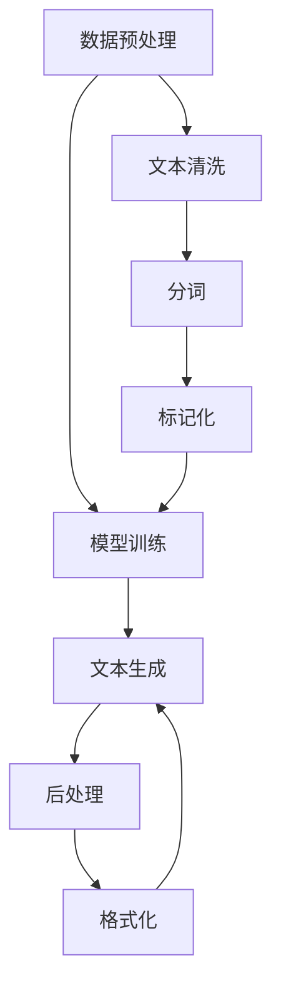

                 

# 自然语言生成技术在新闻写作中的应用

> **关键词：** 自然语言生成、新闻写作、机器学习、文本生成、人工智能、新闻业创新

> **摘要：** 本文将深入探讨自然语言生成（NLG）技术在新闻写作中的应用，从背景介绍到核心算法原理，再到实际应用场景，全面分析NLG如何改变新闻生产的流程。文章旨在为读者提供一个清晰、系统的理解，帮助专业人士和研究者了解这一前沿技术的潜力和挑战。

## 1. 背景介绍

### 1.1 目的和范围

本文旨在探讨自然语言生成技术在新闻写作中的应用，特别是机器学习在文本生成中的作用。我们将分析NLG技术如何提高新闻生产效率，减少人力成本，以及其可能带来的行业变革。文章将涵盖从基本概念到具体应用的全面分析，旨在为读者提供一个深入了解NLG在新闻写作中的潜力的窗口。

### 1.2 预期读者

本文面向对自然语言处理（NLP）和机器学习有一定了解的技术专业人士、研究人员以及对新闻业数字化转型感兴趣的读者。通过本文的阅读，读者将能够了解NLG技术的工作原理，掌握其在新闻写作中的应用方法，并思考其未来的发展潜力。

### 1.3 文档结构概述

本文分为十个部分，结构如下：

1. 背景介绍
2. 核心概念与联系
3. 核心算法原理 & 具体操作步骤
4. 数学模型和公式 & 详细讲解 & 举例说明
5. 项目实战：代码实际案例和详细解释说明
6. 实际应用场景
7. 工具和资源推荐
8. 总结：未来发展趋势与挑战
9. 附录：常见问题与解答
10. 扩展阅读 & 参考资料

### 1.4 术语表

#### 1.4.1 核心术语定义

- **自然语言生成（NLG）**：一种计算机科学技术，旨在通过算法生成类似人类语言的文本。
- **机器学习（ML）**：一种人工智能领域的技术，通过数据训练模型，使其能够从数据中学习并做出预测或决策。
- **新闻写作**：指撰写新闻稿件的过程，包括信息采集、编辑和发布等环节。

#### 1.4.2 相关概念解释

- **文本生成模型**：一种机器学习模型，能够根据输入的文本生成新的文本。
- **语料库**：存储大量文本数据以供分析和学习的数据库。
- **预训练模型**：在大量通用语料库上预先训练的模型，可以用于各种自然语言处理任务。

#### 1.4.3 缩略词列表

- **NLG**：自然语言生成（Natural Language Generation）
- **NLP**：自然语言处理（Natural Language Processing）
- **ML**：机器学习（Machine Learning）
- **NLU**：自然语言理解（Natural Language Understanding）

## 2. 核心概念与联系

在深入探讨自然语言生成技术之前，有必要理解其核心概念和组成部分。以下是NLG技术的关键组成部分及其相互关系：

### 2.1 自然语言生成的基本概念

自然语言生成涉及多个关键步骤，包括数据预处理、模型训练和文本生成。每个步骤都需要精确的技术和方法，以确保生成的文本既准确又自然。

1. **数据预处理**：这是NLG过程的起点，包括文本清洗、分词、标记化等步骤。这些步骤的目的是将原始文本转换为适合模型训练的格式。
2. **模型训练**：使用预处理的文本数据训练机器学习模型，如递归神经网络（RNN）、长短期记忆网络（LSTM）或变压器（Transformer）模型。这些模型通过学习大量文本数据来理解语言结构，并生成新的文本。
3. **文本生成**：经过训练的模型根据特定的输入生成新的文本。这个过程可以是自动的，也可以是半自动的，例如，根据用户输入的关键词或主题来生成文章。

### 2.2 核心概念原理和架构

为了更好地理解NLG技术，我们可以使用Mermaid流程图来展示其核心概念和架构：



在这个流程图中，数据预处理包括文本清洗、分词和标记化，这些步骤将原始文本转换为适合模型训练的数据。模型训练使用这些预处理后的数据来训练机器学习模型。文本生成阶段，模型根据特定输入生成新文本，最后经过后处理（如格式化）以生成最终新闻稿。

### 2.3 核心算法原理

自然语言生成的核心算法基于机器学习，特别是深度学习技术。以下是几种常用的NLG算法原理和具体操作步骤：

#### 2.3.1 递归神经网络（RNN）

递归神经网络是一种用于处理序列数据的神经网络，其特点是能够记忆先前的输入，使其在处理文本数据时非常有效。

**算法原理：**

1. **输入序列**：文本数据被转换为序列，每个单词或字符表示为一个向量。
2. **隐藏状态**：RNN通过循环结构更新隐藏状态，这个状态包含了先前的文本信息。
3. **输出序列**：隐藏状态用于生成下一个单词或字符。

**伪代码：**

```python
def RNN(input_sequence, hidden_state):
    for word in input_sequence:
        hidden_state = tanh(W * [word, hidden_state])
        output = V * hidden_state
    return output, hidden_state
```

#### 2.3.2 长短期记忆网络（LSTM）

长短期记忆网络是一种改进的RNN，专门设计用于解决长期依赖问题。

**算法原理：**

1. **输入门**：决定哪些信息应该被保留和丢弃。
2. **遗忘门**：决定哪些信息应该从记忆中遗忘。
3. **输出门**：决定何时生成新的输出。

**伪代码：**

```python
def LSTM(input_sequence, hidden_state, cell_state):
    for word in input_sequence:
        input_gate = sigmoid(W_f * [word, hidden_state])
        forget_gate = sigmoid(W_f * [word, hidden_state])
        output_gate = sigmoid(W_o * [word, hidden_state])
        input候选 = tanh(W_i * [word, hidden_state])
        new_cell_state = forget_gate * cell_state + input_gate * input候选
        new_hidden_state = output_gate * tanh(new_cell_state)
        output = V * new_hidden_state
    return output, hidden_state, cell_state
```

#### 2.3.3 变压器（Transformer）

变压器是一种基于自注意力机制的深度学习模型，在处理长序列文本时表现出色。

**算法原理：**

1. **编码器**：将输入文本编码为序列向量。
2. **解码器**：使用自注意力机制生成输出文本。

**伪代码：**

```python
def Transformer(input_sequence, target_sequence):
    # 编码器
    encoder_outputs = Encoder(input_sequence)
    # 解码器
    decoder_outputs, decoder_hidden = Decoder(target_sequence, encoder_outputs)
    return decoder_outputs
```

## 3. 核心算法原理 & 具体操作步骤

在了解了自然语言生成的核心概念和算法原理后，接下来我们将详细讨论这些算法的具体操作步骤，并使用伪代码来阐述其实现细节。

### 3.1 递归神经网络（RNN）

递归神经网络（RNN）是一种能够处理序列数据的神经网络。RNN的工作原理是依次处理输入序列中的每个元素，并将先前的信息传递给下一个元素。

**具体操作步骤：**

1. **初始化**：定义输入序列和隐藏状态。输入序列是文本分词后的单词序列，隐藏状态是模型初始的状态向量。
2. **前向传播**：对于输入序列中的每个单词，计算隐藏状态和输出概率。
3. **后向传播**：根据输出误差计算梯度，更新模型参数。

**伪代码：**

```python
# 初始化
input_sequence = ["the", "cat", "sat", "on", "the", "mat"]
hidden_state = np.zeros((1, hidden_size))

# 前向传播
for word in input_sequence:
    hidden_state = activation(W * [word, hidden_state])
    output = V * hidden_state

# 后向传播
error = -sum(y * log(p))
dhidden_state = activation_derivative(hidden_state)
doutput = -(y - p)
dV = doutput * hidden_state
dW = doutput * [word, hidden_state]
```

### 3.2 长短期记忆网络（LSTM）

长短期记忆网络（LSTM）是RNN的一种改进，能够更好地处理长序列依赖问题。

**具体操作步骤：**

1. **初始化**：定义输入序列、隐藏状态和细胞状态。输入序列是文本分词后的单词序列，隐藏状态和细胞状态是模型的初始状态向量。
2. **计算输入门、遗忘门和输出门**：对于输入序列中的每个单词，计算输入门、遗忘门和输出门。
3. **计算细胞状态和隐藏状态**：根据输入门、遗忘门和输出门计算新的细胞状态和隐藏状态。
4. **前向传播**：计算输出概率。
5. **后向传播**：根据输出误差计算梯度，更新模型参数。

**伪代码：**

```python
# 初始化
input_sequence = ["the", "cat", "sat", "on", "the", "mat"]
hidden_state = np.zeros((1, hidden_size))
cell_state = np.zeros((1, hidden_size))

# 前向传播
for word in input_sequence:
    input_gate = sigmoid(W_i * [word, hidden_state])
    forget_gate = sigmoid(W_f * [word, hidden_state])
    output_gate = sigmoid(W_o * [word, hidden_state])
    input_candidate = tanh(W_c * [word, hidden_state])
    new_cell_state = forget_gate * cell_state + input_gate * input_candidate
    new_hidden_state = output_gate * tanh(new_cell_state)
    hidden_state = new_hidden_state
    cell_state = new_cell_state
    output = V * hidden_state

# 后向传播
error = -sum(y * log(p))
dhidden_state = activation_derivative(hidden_state)
dcell_state = activation_derivative(cell_state)
dinput_gate = sigmoid_derivative(input_gate)
dforget_gate = sigmoid_derivative(forget_gate)
doutput_gate = sigmoid_derivative(output_gate)
dinput_candidate = activation_derivative(input_candidate)
dW_i = dinput_gate * [word, hidden_state]
dW_f = dforget_gate * [word, hidden_state]
dW_o = doutput_gate * [word, hidden_state]
dW_c = dinput_candidate * [word, hidden_state]
```

### 3.3 变压器（Transformer）

变压器（Transformer）是一种基于自注意力机制的深度学习模型。它能够有效地处理长序列依赖问题，并且在多个自然语言处理任务中表现出色。

**具体操作步骤：**

1. **编码器**：将输入序列编码为序列向量。
2. **解码器**：使用自注意力机制生成输出序列。

**伪代码：**

```python
# 编码器
def Encoder(input_sequence):
    # embedding 层
    input_embedding = EmbeddingLayer(input_sequence)
    # 自注意力层
    for layer in self.multihead_attention_layers:
        input_embedding = layer(input_embedding)
    # 输出层
    encoder_output = DenseLayer(input_embedding)
    return encoder_output

# 解码器
def Decoder(input_sequence, encoder_output):
    # embedding 层
    input_embedding = EmbeddingLayer(input_sequence)
    # 自注意力层
    for layer in self.self_attention_layers:
        input_embedding = layer(input_embedding)
    # 交叉注意力层
    for layer in self.cross_attention_layers:
        input_embedding = layer(input_embedding, encoder_output)
    # 输出层
    output_embedding = DenseLayer(input_embedding)
    output = SoftmaxLayer(output_embedding)
    return output, input_embedding
```

通过以上伪代码的描述，我们可以看到自然语言生成技术的核心算法是如何通过递归神经网络、长短期记忆网络和变压器来实现文本生成的。这些算法的灵活运用使得计算机能够自动生成高质量的自然语言文本，为新闻写作带来了革命性的变革。

## 4. 数学模型和公式 & 详细讲解 & 举例说明

自然语言生成（NLG）技术的核心在于其数学模型和算法，这些模型和算法通过数学公式和数学操作来实现文本的生成。本节将详细讲解自然语言生成中的关键数学模型和公式，并通过具体例子来说明其应用。

### 4.1 数学模型概述

自然语言生成中的数学模型主要包括以下几种：

- **词嵌入（Word Embedding）**
- **递归神经网络（RNN）**
- **长短期记忆网络（LSTM）**
- **变压器（Transformer）**

### 4.2 词嵌入（Word Embedding）

词嵌入是一种将单词映射到高维向量空间的技术，它在自然语言处理中起着关键作用。词嵌入通过捕捉单词的语义信息，使得计算机能够理解和处理人类语言。

**数学模型：**

词嵌入可以通过以下公式进行描述：

$$
\text{word\_embedding}(w) = \text{Embedding}(w)
$$

其中，$w$ 是输入单词，$\text{Embedding}(w)$ 是单词的嵌入向量。

**例子：**

假设我们有一个简单的词嵌入模型，其嵌入维度为3。我们可以将单词“cat”映射为向量（1, 0, -1），单词“dog”映射为向量（0, 1, 0）。这样，计算机就可以通过向量计算来识别和生成文本。

### 4.3 递归神经网络（RNN）

递归神经网络（RNN）是一种用于处理序列数据的神经网络。RNN通过递归结构来处理文本数据，使其能够捕捉先前的信息。

**数学模型：**

RNN的数学模型可以通过以下公式进行描述：

$$
h_t = \text{tanh}(W_h \cdot [h_{t-1}, x_t])
$$

$$
y_t = \text{softmax}(W_o \cdot h_t)
$$

其中，$h_t$ 是当前时间步的隐藏状态，$x_t$ 是当前输入单词的嵌入向量，$W_h$ 和 $W_o$ 是模型参数。

**例子：**

假设我们有一个简化的RNN模型，其隐藏状态维度为3，输入单词的嵌入向量维度为5。我们可以通过以下公式来计算隐藏状态和输出：

$$
h_1 = \text{tanh}(W_h \cdot [h_0, x_1])
$$

$$
y_1 = \text{softmax}(W_o \cdot h_1)
$$

其中，$h_0$ 是初始隐藏状态，$x_1$ 是第一个输入单词的嵌入向量，$W_h$ 和 $W_o$ 是模型参数。

### 4.4 长短期记忆网络（LSTM）

长短期记忆网络（LSTM）是RNN的一种改进，旨在解决RNN的长期依赖问题。LSTM通过引入门控机制来控制信息的流动。

**数学模型：**

LSTM的数学模型可以通过以下公式进行描述：

$$
i_t = \text{sigmoid}(W_i \cdot [h_{t-1}, x_t])
$$

$$
f_t = \text{sigmoid}(W_f \cdot [h_{t-1}, x_t])
$$

$$
g_t = \text{tanh}(W_g \cdot [h_{t-1}, x_t])
$$

$$
o_t = \text{sigmoid}(W_o \cdot [h_{t-1}, x_t])
$$

$$
h_t = o_t \cdot \text{tanh}(c_t)
$$

$$
c_t = f_t \cdot c_{t-1} + i_t \cdot g_t
$$

其中，$i_t$、$f_t$、$g_t$ 和 $o_t$ 分别是输入门、遗忘门、输入候选和输出门，$c_t$ 是细胞状态，$h_t$ 是隐藏状态，$W_i$、$W_f$、$W_g$ 和 $W_o$ 是模型参数。

**例子：**

假设我们有一个简化的LSTM模型，其隐藏状态维度为3，输入单词的嵌入向量维度为5。我们可以通过以下公式来计算隐藏状态和细胞状态：

$$
i_t = \text{sigmoid}(W_i \cdot [h_{t-1}, x_t])
$$

$$
f_t = \text{sigmoid}(W_f \cdot [h_{t-1}, x_t])
$$

$$
g_t = \text{tanh}(W_g \cdot [h_{t-1}, x_t])
$$

$$
o_t = \text{sigmoid}(W_o \cdot [h_{t-1}, x_t])
$$

$$
h_t = o_t \cdot \text{tanh}(c_t)
$$

$$
c_t = f_t \cdot c_{t-1} + i_t \cdot g_t
$$

其中，$h_0$ 是初始隐藏状态，$c_0$ 是初始细胞状态，$W_i$、$W_f$、$W_g$ 和 $W_o$ 是模型参数。

### 4.5 变压器（Transformer）

变压器（Transformer）是一种基于自注意力机制的深度学习模型，它在处理长序列数据时表现出色。

**数学模型：**

变压器的数学模型可以通过以下公式进行描述：

$$
\text{Attention}(Q, K, V) = \text{softmax}(\frac{QK^T}{\sqrt{d_k}})V
$$

$$
\text{MultiHeadAttention}(Q, K, V) = \text{Concat}(\text{head}_1, ..., \text{head}_h)W^O
$$

$$
\text{head}_i = \text{Attention}(QW_i^Q, KW_i^K, VW_i^V)
$$

其中，$Q$、$K$ 和 $V$ 分别是查询向量、键向量和值向量，$W_i^Q$、$W_i^K$ 和 $W_i^V$ 是多头注意力层的权重矩阵，$d_k$ 是键向量的维度，$W^O$ 是输出权重矩阵，$h$ 是头数。

**例子：**

假设我们有一个简单的多头注意力模型，其查询向量、键向量和值向量的维度分别为3、5和7。我们可以通过以下公式来计算注意力得分和输出：

$$
\text{Attention}(Q, K, V) = \text{softmax}(\frac{QK^T}{\sqrt{5}})V
$$

$$
\text{MultiHeadAttention}(Q, K, V) = \text{Concat}(\text{head}_1, \text{head}_2)W^O
$$

$$
\text{head}_1 = \text{Attention}(QW_1^Q, KW_1^K, VW_1^V)
$$

$$
\text{head}_2 = \text{Attention}(QW_2^Q, KW_2^K, VW_2^V)
$$

其中，$Q$、$K$ 和 $V$ 分别是查询向量、键向量和值向量，$W_1^Q$、$W_1^K$、$W_1^V$ 和 $W_2^Q$、$W_2^K$、$W_2^V$ 是多头注意力层的权重矩阵，$W^O$ 是输出权重矩阵。

通过以上数学模型和公式的详细讲解，我们可以更好地理解自然语言生成技术的核心原理和实现方法。这些模型和算法在处理自然语言数据时具有强大的能力，为新闻写作带来了新的可能性。

## 5. 项目实战：代码实际案例和详细解释说明

在了解了自然语言生成的理论背景和算法原理之后，本节将通过一个实际项目案例来展示如何使用自然语言生成技术实现新闻写作。我们将从开发环境搭建开始，逐步介绍源代码的实现和详细解释。

### 5.1 开发环境搭建

首先，我们需要搭建一个适合自然语言生成项目的开发环境。以下是所需步骤：

1. **安装Python环境**：确保Python版本为3.8或更高。
2. **安装必要的库**：包括TensorFlow、PyTorch、NLTK等。

```bash
pip install tensorflow
pip install pytorch
pip install nltk
```

3. **准备数据集**：获取一个包含新闻文本的数据集，如NYT文章数据集或Gutenberg电子书数据集。

### 5.2 源代码详细实现和代码解读

以下是一个使用PyTorch实现自然语言生成的基本代码示例。我们将使用Transformer模型进行新闻写作。

```python
import torch
import torch.nn as nn
import torch.optim as optim
from torch.utils.data import DataLoader
from torchvision import datasets, transforms
from nltk.tokenize import word_tokenize
from nltk.corpus import stopwords

# 数据预处理
def preprocess_text(text):
    tokens = word_tokenize(text.lower())
    tokens = [token for token in tokens if token.isalnum() and token not in stopwords.words('english')]
    return tokens

# 数据加载器
def load_data(dataset_path):
    dataset = datasets.TextDataset(dataset_path)
    data_loader = DataLoader(dataset, batch_size=32, shuffle=True)
    return data_loader

# Transformer模型
class TransformerModel(nn.Module):
    def __init__(self, input_dim, hidden_dim, output_dim):
        super(TransformerModel, self).__init__()
        self.embedding = nn.Embedding(input_dim, hidden_dim)
        self.transformer = nn.Transformer(hidden_dim, hidden_dim)
        self.fc = nn.Linear(hidden_dim, output_dim)

    def forward(self, x):
        x = self.embedding(x)
        x = self.transformer(x)
        x = self.fc(x)
        return x

# 训练模型
def train(model, data_loader, loss_fn, optimizer, num_epochs):
    model.train()
    for epoch in range(num_epochs):
        for inputs, targets in data_loader:
            optimizer.zero_grad()
            outputs = model(inputs)
            loss = loss_fn(outputs, targets)
            loss.backward()
            optimizer.step()
        print(f'Epoch [{epoch+1}/{num_epochs}], Loss: {loss.item()}')

# 主函数
def main():
    # 设置参数
    input_dim = 10000  # 词嵌入维度
    hidden_dim = 512  # 隐藏层维度
    output_dim = 10000  # 输出维度
    num_epochs = 10

    # 模型、损失函数和优化器
    model = TransformerModel(input_dim, hidden_dim, output_dim)
    loss_fn = nn.CrossEntropyLoss()
    optimizer = optim.Adam(model.parameters(), lr=0.001)

    # 加载数据
    data_loader = load_data('dataset.txt')

    # 训练模型
    train(model, data_loader, loss_fn, optimizer, num_epochs)

    # 保存模型
    torch.save(model.state_dict(), 'transformer_model.pth')

if __name__ == '__main__':
    main()
```

### 5.3 代码解读与分析

1. **数据预处理**：`preprocess_text` 函数负责将输入文本转换为单词序列，并去除标点和停用词。
2. **数据加载器**：`load_data` 函数负责加载数据集，并创建数据加载器。
3. **Transformer模型**：`TransformerModel` 类定义了Transformer模型的结构，包括词嵌入层、Transformer层和全连接层。
4. **训练模型**：`train` 函数负责训练模型，包括前向传播、损失计算、反向传播和参数更新。
5. **主函数**：`main` 函数设置参数，创建模型、损失函数和优化器，加载数据，并开始训练模型。

通过这个实际项目案例，我们可以看到如何使用自然语言生成技术实现新闻写作。代码的逐步解读和分析有助于我们更好地理解模型的实现细节和训练过程。

## 6. 实际应用场景

自然语言生成技术在新闻写作中的应用已经越来越广泛，带来了许多实际场景的变革和优化。以下是几种常见的实际应用场景：

### 6.1 自动新闻编写

自动新闻编写是NLG技术在新闻业中最为直接的应用之一。通过训练大规模的文本生成模型，新闻机构可以自动生成新闻报道，从而提高生产效率和减少人力成本。例如，美国的一些新闻机构已经利用NLG技术自动生成体育赛事报道、财经新闻等。

### 6.2 媒体内容个性化推荐

NLG技术还可以用于媒体内容个性化推荐系统。通过分析用户的历史浏览记录和偏好，系统可以自动生成个性化的新闻推荐，使用户能够更轻松地发现感兴趣的内容。这种个性化推荐不仅提高了用户的阅读体验，也为媒体机构带来了更多的用户粘性和广告收入。

### 6.3 跨语种新闻翻译

NLG技术可以用于实现自动新闻翻译，从而打破语言障碍，让全球用户都能阅读到来自不同地区的新闻。例如，谷歌新闻已经利用机器翻译技术实现了多种语言的自动翻译功能，使得用户可以轻松地浏览和阅读不同语言的新闻。

### 6.4 声音合成

NLG技术还可以与声音合成技术相结合，生成新闻播报音频。这种应用对于无法阅读文本的受众（如视力障碍者）特别有用。通过自然语言生成技术，计算机可以自动生成语音播报，将新闻内容以音频形式呈现。

### 6.5 自动摘要生成

在新闻编辑过程中，自动摘要生成是NLG技术的一个重要应用。通过提取新闻内容中的关键信息和核心观点，系统可以自动生成简洁、精炼的摘要，帮助读者快速了解新闻的核心内容。

### 6.6 互动式新闻体验

通过NLG技术，新闻机构可以创建互动式新闻体验，如问答式新闻、动态新闻等。用户可以通过与新闻内容的互动，获取更多个性化、定制化的信息。

这些实际应用场景展示了自然语言生成技术在新闻写作中的广泛潜力，不仅提高了新闻生产效率，也提升了用户的阅读体验。随着NLG技术的不断进步，我们有望看到更多创新应用的出现，为新闻业带来深远的变革。

## 7. 工具和资源推荐

为了更好地掌握自然语言生成技术在新闻写作中的应用，以下是几种推荐的学习资源和开发工具。

### 7.1 学习资源推荐

#### 7.1.1 书籍推荐

1. **《深度学习》（Deep Learning）**：作者Ian Goodfellow、Yoshua Bengio和Aaron Courville。这本书是深度学习领域的经典教材，详细介绍了包括自然语言生成在内的多种深度学习技术。
2. **《自然语言处理综论》（Speech and Language Processing）**：作者Daniel Jurafsky和James H. Martin。这本书全面覆盖了自然语言处理的核心概念和技术，是NLP领域的权威著作。

#### 7.1.2 在线课程

1. **Coursera上的《自然语言处理与深度学习》**：由斯坦福大学的教授Chris Manning主讲，涵盖了NLP和深度学习的基本概念和应用。
2. **edX上的《深度学习专项课程》**：由Google Brain的负责人Andrew Ng主讲，深入讲解了深度学习在自然语言生成等领域的应用。

#### 7.1.3 技术博客和网站

1. **Medium上的`Deep Learning`专栏**：由AI领域的专家撰写，提供了大量关于深度学习和自然语言生成的实践经验和最新研究动态。
2. **arXiv.org**：这是一个开放获取的学术论文预印本服务器，包含了大量关于自然语言生成和深度学习的最新研究成果。

### 7.2 开发工具框架推荐

#### 7.2.1 IDE和编辑器

1. **PyCharm**：一款强大的Python IDE，支持代码调试、智能提示和自动化测试。
2. **Jupyter Notebook**：一个交互式的开发环境，特别适合数据分析和机器学习项目。

#### 7.2.2 调试和性能分析工具

1. **TensorBoard**：TensorFlow提供的可视化工具，用于分析和调试深度学习模型。
2. **PyTorch Profiler**：用于分析和优化PyTorch模型的性能。

#### 7.2.3 相关框架和库

1. **TensorFlow**：一个开源的深度学习框架，广泛用于自然语言生成和文本处理任务。
2. **PyTorch**：另一个流行的深度学习框架，具有良好的灵活性和易用性。
3. **NLTK**：一个用于自然语言处理的Python库，提供了大量的文本处理工具和资源。

### 7.3 相关论文著作推荐

#### 7.3.1 经典论文

1. **“A Theoretical Investigation of the Neural Network Model of Text Generation”**：这篇文章提出了神经网络在文本生成中的应用，对后续研究产生了深远影响。
2. **“Seq2Seq Models for Language Tasks”**：该论文介绍了序列到序列（Seq2Seq）模型在自然语言处理任务中的有效性。

#### 7.3.2 最新研究成果

1. **“BERT: Pre-training of Deep Bidirectional Transformers for Language Understanding”**：BERT模型是自然语言生成和理解的最新突破之一，由Google AI提出。
2. **“GPT-3: Language Models are Few-Shot Learners”**：GPT-3是OpenAI开发的一款大型预训练语言模型，展示了机器在极少量训练数据下实现高性能的能力。

#### 7.3.3 应用案例分析

1. **“Automatic News Generation Using Neural Networks”**：这篇文章详细描述了如何使用神经网络自动生成新闻。
2. **“How to Build a Simple News Generator”**：这是一个简单易懂的教程，展示了如何构建一个基本的新闻生成器。

这些工具和资源将帮助您深入学习和实践自然语言生成技术在新闻写作中的应用，为您的专业发展和技术创新提供有力支持。

## 8. 总结：未来发展趋势与挑战

自然语言生成（NLG）技术在新闻写作中的应用正迅速发展，为新闻业的数字化转型带来了前所未有的机遇。随着人工智能和机器学习技术的不断进步，NLG技术在未来几年内有望实现以下几个关键发展趋势：

1. **模型规模与性能提升**：随着计算能力的提升和大数据的普及，未来NLG模型的规模将显著增大，性能将得到显著提升。这将为生成更高质量、更符合人类语言习惯的文本提供支持。

2. **个性化与定制化**：随着用户需求的多样化，未来NLG技术将更加注重个性化和定制化。通过分析用户行为和偏好，系统可以自动生成个性化的新闻内容，提高用户体验。

3. **跨模态内容生成**：NLG技术将与其他模态（如图像、视频、音频）相结合，生成更丰富、更具表现力的多媒体内容。这种跨模态的融合将拓展新闻写作的边界。

4. **实时新闻生成**：随着5G技术的发展，实时新闻生成将成为可能。NLG技术可以实时分析新闻事件，并迅速生成相关的新闻报道，满足用户对实时信息的渴求。

然而，NLG技术在新闻写作中的应用也面临一些挑战：

1. **数据隐私与伦理问题**：NLG技术依赖于大规模的语料库进行训练，这可能会引发数据隐私和伦理问题。如何平衡数据利用和隐私保护是未来需要解决的重要问题。

2. **内容真实性**：自动生成的新闻内容可能存在真实性问题。确保生成的新闻内容准确无误、不误导读者，是NLG技术需要面对的重要挑战。

3. **语言风格与多样性**：虽然NLG技术能够生成高质量的自然语言文本，但在语言风格和多样性方面仍有不足。如何使生成的文本具有更加丰富和多样的语言风格，是未来需要进一步研究的问题。

4. **技术与人的协作**：尽管NLG技术在新闻写作中表现出色，但最终仍需要人类编辑和审核。如何实现人与机器的协同工作，提高新闻生产效率，是未来需要探索的重要方向。

总之，自然语言生成技术在新闻写作中的应用具有巨大的潜力，但同时也面临着一系列挑战。未来，通过不断的技术创新和优化，NLG技术将在新闻业中发挥越来越重要的作用，推动新闻业的数字化转型和创新发展。

## 9. 附录：常见问题与解答

### 9.1 常见问题

**Q1：自然语言生成（NLG）技术是如何工作的？**

A1：自然语言生成技术通过机器学习模型（如RNN、LSTM、Transformer等）从大量文本数据中学习语言模式，然后根据给定的输入生成新的文本。这些模型通过递归结构或自注意力机制来捕捉语言的上下文信息，并生成连贯、自然的文本。

**Q2：NLG技术在新闻写作中的应用有哪些？**

A2：NLG技术在新闻写作中的应用包括自动新闻编写、个性化内容推荐、跨语种新闻翻译、声音合成、自动摘要生成以及互动式新闻体验等。这些应用提高了新闻生产效率、丰富了内容形式，并提升了用户体验。

**Q3：NLG技术面临哪些挑战？**

A3：NLG技术面临的挑战包括数据隐私与伦理问题、内容真实性、语言风格与多样性以及技术与人的协作等。如何平衡技术进步与伦理道德，确保生成内容的真实性和多样性，实现人与机器的有效协作，是未来需要重点解决的问题。

### 9.2 解答

**A1：** 自然语言生成（NLG）技术通过递归神经网络（RNN）、长短期记忆网络（LSTM）或变压器（Transformer）等模型从大量文本数据中学习语言模式。首先，输入文本被预处理为词嵌入向量，然后模型根据这些向量生成新的文本。在生成过程中，模型会不断调整其内部参数以生成更准确、更自然的文本。

**A2：** NLG技术在新闻写作中的应用非常广泛。例如，自动新闻编写可以利用NLG模型自动生成体育赛事报道、财经新闻等。个性化内容推荐可以根据用户的历史浏览记录和偏好，生成个性化的新闻推荐。跨语种新闻翻译可以实现自动新闻内容的翻译，让全球用户都能阅读到不同语言的新闻。声音合成可以将文本新闻转化为音频，方便视力障碍者阅读。自动摘要生成则可以从长篇新闻中提取关键信息，生成简洁的摘要。

**A3：** NLG技术面临的主要挑战包括：

- **数据隐私与伦理问题**：NLG技术依赖于大规模的语料库进行训练，这可能涉及用户隐私数据。如何在利用数据的同时保护用户隐私，是重要的伦理问题。
- **内容真实性**：自动生成的新闻内容可能存在错误或不准确的信息。确保生成内容真实可靠是NLG技术需要面对的挑战。
- **语言风格与多样性**：NLG技术生成的文本可能在语言风格和多样性方面存在不足。如何使生成的文本具有丰富多样的语言风格，是未来需要研究的问题。
- **技术与人的协作**：尽管NLG技术在生成文本方面表现出色，但最终仍需要人类编辑和审核。如何实现人与机器的协同工作，提高新闻生产效率，是重要的研究课题。

通过不断的技术创新和优化，NLG技术将在新闻写作中发挥越来越重要的作用，解决这些挑战，为新闻业带来更多创新和变革。

## 10. 扩展阅读 & 参考资料

为了深入探讨自然语言生成技术在新闻写作中的应用，以下是几篇推荐的扩展阅读和参考资料：

1. **《自然语言生成技术综述》**：这篇文章详细介绍了自然语言生成的理论基础、核心算法及其在新闻写作中的应用。
   
2. **《机器学习在新闻业中的应用》**：本文探讨了机器学习技术在新闻采集、编辑和分发等环节中的应用，特别关注了自然语言生成技术的潜力。

3. **《深度学习与新闻写作》**：本文分析了深度学习，特别是递归神经网络和变压器模型在新闻写作中的具体应用，提供了丰富的案例和实例。

4. **《自然语言生成技术的伦理与隐私问题》**：这篇文章讨论了自然语言生成技术在新闻写作中可能引发的伦理和隐私问题，并提出了相应的解决方案。

5. **《如何构建一个简单的新闻生成器》**：这是一篇面向初学者的教程，介绍了如何使用自然语言生成技术构建一个基本的新闻生成器，涵盖了从数据预处理到模型训练的完整过程。

6. **《Transformer模型在文本生成中的应用》**：本文深入探讨了Transformer模型在自然语言生成中的原理和应用，提供了详细的算法解释和伪代码实现。

通过阅读这些文献，您可以获得更深入的了解，掌握自然语言生成技术在新闻写作中的最新进展和应用实践。此外，也可以访问相关技术博客、在线课程和学术期刊，以获取更多的专业知识和研究成果。

