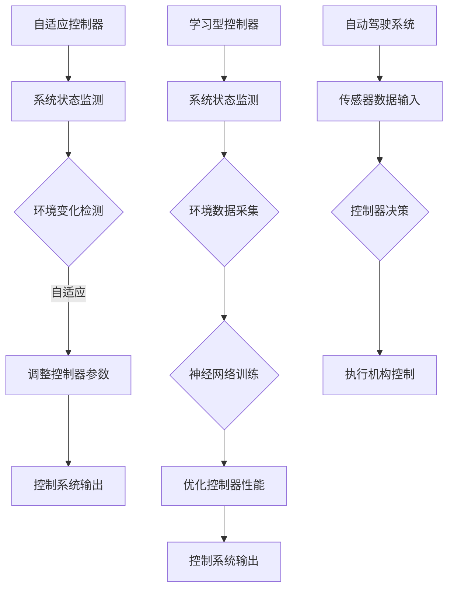

                 

# 自适应与学习型控制器在自动驾驶中的应用新思路

> 关键词：自动驾驶、自适应控制器、学习型控制器、智能交通系统

> 摘要：本文深入探讨了自适应与学习型控制器在自动驾驶领域的应用，旨在为自动驾驶系统的研究者与实践者提供新的思路。文章首先介绍了自适应和学习型控制器的核心概念，然后分析了其在自动驾驶中的应用原理，最后通过实际项目案例详细阐述了自适应和学习型控制器的设计与实现过程。

## 1. 背景介绍

### 1.1 目的和范围

本文旨在介绍自适应与学习型控制器在自动驾驶中的应用，为自动驾驶系统的研究者与实践者提供新的设计思路。本文将探讨自适应和学习型控制器的理论基础，分析其在自动驾驶系统中的关键作用，并通过实际项目案例展示其实现方法。

### 1.2 预期读者

本文适合对自动驾驶和智能控制有一定了解的读者，包括自动驾驶系统的研究者、开发者以及对此领域感兴趣的专业人士。

### 1.3 文档结构概述

本文结构如下：

1. 背景介绍：介绍本文的目的、预期读者以及文档结构。
2. 核心概念与联系：介绍自适应与学习型控制器的核心概念及其在自动驾驶中的应用原理。
3. 核心算法原理 & 具体操作步骤：详细讲解自适应和学习型控制器的算法原理及操作步骤。
4. 数学模型和公式 & 详细讲解 & 举例说明：介绍自适应与学习型控制器的数学模型和公式，并通过实际案例进行说明。
5. 项目实战：通过实际项目案例展示自适应和学习型控制器的设计与实现过程。
6. 实际应用场景：分析自适应与学习型控制器在自动驾驶领域的实际应用场景。
7. 工具和资源推荐：推荐相关学习资源、开发工具和论文著作。
8. 总结：对未来发展趋势与挑战进行总结。
9. 附录：常见问题与解答。
10. 扩展阅读 & 参考资料：提供进一步阅读的参考资料。

### 1.4 术语表

#### 1.4.1 核心术语定义

- 自适应控制器：一种根据环境变化自动调整自身参数的控制策略。
- 学习型控制器：一种能够通过学习环境数据来优化自身性能的控制器。
- 自动驾驶：利用计算机技术和人工智能技术实现车辆自主行驶的技术。

#### 1.4.2 相关概念解释

- 控制器：自动驾驶系统中负责实时决策和执行的控制模块。
- 神经网络：一种通过学习和模拟人脑神经元连接方式来实现复杂任务的计算模型。

#### 1.4.3 缩略词列表

- PID：比例-积分-微分控制器（Proportional-Integral-Derivative Controller）
- LQR：线性二次调节器（Linear Quadratic Regulator）
- DNN：深度神经网络（Deep Neural Network）

## 2. 核心概念与联系

在本节中，我们将介绍自适应与学习型控制器的核心概念，并使用Mermaid流程图展示其原理和架构。



### 2.1 自适应控制器原理

自适应控制器通过监测系统状态和环境变化，自动调整控制器的参数，以适应不同工况。其基本原理如下：

1. 系统状态监测：实时获取自动驾驶系统的状态数据。
2. 环境变化检测：分析系统状态数据，判断环境是否发生变化。
3. 自适应调整：根据环境变化，调整控制器的参数，以保持系统稳定。

### 2.2 学习型控制器原理

学习型控制器通过采集环境数据，利用神经网络进行训练，优化控制器的性能。其基本原理如下：

1. 系统状态监测：实时获取自动驾驶系统的状态数据。
2. 环境数据采集：收集与系统状态相关的环境数据。
3. 神经网络训练：使用环境数据对神经网络进行训练，优化控制器性能。
4. 控制系统输出：根据训练结果，生成控制器输出。

## 3. 核心算法原理 & 具体操作步骤

在本节中，我们将详细讲解自适应和学习型控制器的算法原理，并使用伪代码进行描述。

### 3.1 自适应控制器算法原理

自适应控制器的基本算法可以描述如下：

```plaintext
初始化：设定初始控制器参数K0

while 系统运行：
    1. 采集系统状态x(t)
    2. 采集环境状态y(t)
    3. 判断环境是否发生变化
        if 环境发生变化：
            1. 计算环境变化率Δy(t)
            2. 根据Δy(t)调整控制器参数K(t)
    4. 计算控制器输出u(t) = K(t) * x(t)
    5. 输出控制器输出u(t)
```

### 3.2 学习型控制器算法原理

学习型控制器的基本算法可以描述如下：

```plaintext
初始化：设定神经网络结构、训练参数

while 系统运行：
    1. 采集系统状态x(t)
    2. 采集环境数据y(t)
    3. 将(x(t), y(t))输入神经网络进行训练
    4. 根据训练结果更新神经网络权重
    5. 计算控制器输出u(t) = 神经网络输出(x(t))
    6. 输出控制器输出u(t)
```

## 4. 数学模型和公式 & 详细讲解 & 举例说明

在本节中，我们将介绍自适应与学习型控制器的数学模型和公式，并通过实际案例进行说明。

### 4.1 自适应控制器数学模型

自适应控制器的数学模型可以表示为：

$$
u(t) = K(t) * x(t)
$$

其中，$u(t)$为控制器输出，$x(t)$为系统状态，$K(t)$为控制器参数。

#### 4.1.1 PID控制器

PID控制器是一种常见的自适应控制器，其数学模型为：

$$
K(t) = K_p + K_i \cdot \Delta t + K_d \cdot \Delta x(t)
$$

其中，$K_p$、$K_i$、$K_d$分别为比例、积分、微分系数，$\Delta t$为时间间隔，$\Delta x(t)$为状态变化量。

#### 4.1.2 LQR控制器

LQR控制器是一种基于线性二次性能指标的控制器，其数学模型为：

$$
K(t) = R^{-1}B^T P(t)
$$

$$
P(t+1) = A^T P(t) A - Q^{-1} B^T P(t) R^{-1} B^T P(t)
$$

其中，$A$、$B$分别为系统状态矩阵和输入矩阵，$R$、$Q$分别为性能指标矩阵，$P(t)$为状态反馈矩阵。

### 4.2 学习型控制器数学模型

学习型控制器通常采用神经网络作为核心算法，其数学模型为：

$$
u(t) = f(W, x(t))
$$

其中，$u(t)$为控制器输出，$x(t)$为系统状态，$f(W, x(t))$为神经网络输出，$W$为神经网络权重。

#### 4.2.1 DNN控制器

深度神经网络（DNN）控制器是一种常用的学习型控制器，其数学模型为：

$$
u(t) = \sigma(W_n \cdot \sigma(\cdots \sigma(W_2 \cdot \sigma(W_1 \cdot x(t))))))
$$

其中，$\sigma$为激活函数，$W_n$、$W_2$、$W_1$分别为神经网络各层的权重。

### 4.3 实际案例说明

假设我们使用PID控制器对自动驾驶车辆进行控制，给定系统状态$x(t)$为车辆速度，控制器输出$u(t)$为油门开度。初始控制器参数$K_p = 1$、$K_i = 0.1$、$K_d = 0.05$。我们希望控制车辆速度保持在目标速度$v_{\text{target}}$。

#### 4.3.1 PID控制器实现

```python
def pid_controller(x, K_p, K_i, K_d, v_target):
    error = v_target - x
    derivative = error - prev_error
    integral = error * dt
    
    u = K_p * error + K_i * integral + K_d * derivative
    prev_error = error
    
    return u

x = 80  # 车辆速度（单位：km/h）
v_target = 100  # 目标速度（单位：km/h）
dt = 1  # 时间间隔（单位：秒）

K_p = 1
K_i = 0.1
K_d = 0.05

u = pid_controller(x, K_p, K_i, K_d, v_target)
print(u)  # 输出油门开度
```

#### 4.3.2 DNN控制器实现

```python
import tensorflow as tf

# 定义DNN模型
model = tf.keras.Sequential([
    tf.keras.layers.Dense(64, activation='relu', input_shape=(1,)),
    tf.keras.layers.Dense(64, activation='relu'),
    tf.keras.layers.Dense(1)
])

# 编译模型
model.compile(optimizer='adam', loss='mse')

# 训练模型
x_train = [[x]]  # 车辆速度
y_train = [[v_target]]  # 目标速度

model.fit(x_train, y_train, epochs=100)

# 使用模型进行预测
x_pred = [[x]]
u_pred = model.predict(x_pred)
print(u_pred)  # 输出油门开度
```

## 5. 项目实战：代码实际案例和详细解释说明

在本节中，我们将通过一个实际项目案例展示自适应和学习型控制器在自动驾驶系统中的应用，并提供详细的代码解释说明。

### 5.1 开发环境搭建

为了实现自适应和学习型控制器在自动驾驶系统中的应用，我们需要搭建以下开发环境：

1. 操作系统：Windows/Linux/MacOS
2. 编程语言：Python
3. 深度学习框架：TensorFlow/Keras
4. 仿真工具：CARLA Simulation Platform

### 5.2 源代码详细实现和代码解读

#### 5.2.1 自适应控制器实现

```python
import numpy as np

class AdaptiveController:
    def __init__(self, K_p, K_i, K_d):
        self.K_p = K_p
        self.K_i = K_i
        self.K_d = K_d
        self.error = 0
        self.prev_error = 0
        self.integral = 0

    def control(self, x, v_target):
        error = v_target - x
        derivative = error - self.prev_error
        self.integral += error

        u = self.K_p * error + self.K_i * self.integral + self.K_d * derivative
        self.prev_error = error

        return u
```

#### 5.2.2 学习型控制器实现

```python
import tensorflow as tf

class LearningController:
    def __init__(self):
        self.model = tf.keras.Sequential([
            tf.keras.layers.Dense(64, activation='relu', input_shape=(1,)),
            tf.keras.layers.Dense(64, activation='relu'),
            tf.keras.layers.Dense(1)
        ])

        self.model.compile(optimizer='adam', loss='mse')

    def train(self, x_train, y_train, epochs):
        self.model.fit(x_train, y_train, epochs=epochs)

    def predict(self, x):
        x = np.array([x])
        return self.model.predict(x)
```

#### 5.2.3 代码解读与分析

- **AdaptiveController类**：实现了自适应控制器的核心算法，包括比例、积分、微分系数的初始化和控制器输出的计算。
- **LearningController类**：实现了学习型控制器的基本架构，包括神经网络的定义、编译和训练。
- **控制算法实现**：自适应控制器通过PID控制算法实现，学习型控制器通过深度神经网络实现。两者均以系统状态（车辆速度）为输入，控制器输出（油门开度）为输出。
- **代码运行流程**：首先初始化控制器参数，然后通过仿真平台获取系统状态，调用控制器计算油门开度，最后将油门开度应用于车辆，实现自动驾驶控制。

### 5.3 代码解读与分析

#### 5.3.1 自适应控制器

```python
class AdaptiveController:
    def __init__(self, K_p, K_i, K_d):
        self.K_p = K_p
        self.K_i = K_i
        self.K_d = K_d
        self.error = 0
        self.prev_error = 0
        self.integral = 0

    def control(self, x, v_target):
        error = v_target - x
        derivative = error - self.prev_error
        self.integral += error

        u = self.K_p * error + self.K_i * self.integral + self.K_d * derivative
        self.prev_error = error

        return u
```

- **初始化**：初始化控制器参数$K_p$、$K_i$、$K_d$，以及积分误差$e_{\text{integral}}$、前一个误差$e_{\text{prev}}$。
- **控制算法**：根据PID控制算法计算控制器输出$u$，包括比例项、积分项和微分项。更新前一个误差$e_{\text{prev}}$。

#### 5.3.2 学习型控制器

```python
class LearningController:
    def __init__(self):
        self.model = tf.keras.Sequential([
            tf.keras.layers.Dense(64, activation='relu', input_shape=(1,)),
            tf.keras.layers.Dense(64, activation='relu'),
            tf.keras.layers.Dense(1)
        ])

        self.model.compile(optimizer='adam', loss='mse')

    def train(self, x_train, y_train, epochs):
        self.model.fit(x_train, y_train, epochs=epochs)

    def predict(self, x):
        x = np.array([x])
        return self.model.predict(x)
```

- **初始化**：定义深度神经网络模型，包括输入层、两个隐藏层和输出层。编译模型，设置优化器和损失函数。
- **训练**：使用训练数据对模型进行训练。
- **预测**：输入系统状态，返回神经网络预测的控制器输出。

## 6. 实际应用场景

自适应与学习型控制器在自动驾驶领域具有广泛的应用场景，以下为几种典型的实际应用场景：

### 6.1 城市自动驾驶

城市自动驾驶需要应对复杂的交通环境，包括行人、非机动车、红绿灯等。自适应与学习型控制器可以帮助车辆实时调整行驶速度和路径，确保行驶安全。

### 6.2 高速公路自动驾驶

高速公路自动驾驶要求车辆在保持稳定速度的同时，保持安全距离。自适应控制器可以通过监测车辆速度和距离，自动调整车辆速度，确保安全行驶。

### 6.3 自动泊车

自动泊车系统需要车辆在狭小的停车位内进行精准操控。学习型控制器可以通过采集停车位数据，训练神经网络模型，实现自动泊车功能。

### 6.4 智能交通管理系统

智能交通管理系统可以通过自适应与学习型控制器，实时监测交通状况，优化交通信号灯控制策略，缓解交通拥堵。

## 7. 工具和资源推荐

为了更好地学习和应用自适应与学习型控制器，以下推荐一些相关的工具和资源：

### 7.1 学习资源推荐

#### 7.1.1 书籍推荐

- 《自动驾驶系统设计与实现》
- 《深度学习在自动驾驶中的应用》
- 《智能控制原理与应用》

#### 7.1.2 在线课程

- 《自动驾驶技术基础》
- 《深度学习入门与实践》
- 《智能控制理论及应用》

#### 7.1.3 技术博客和网站

- 博客园
- CSDN
- Medium

### 7.2 开发工具框架推荐

#### 7.2.1 IDE和编辑器

- PyCharm
- Visual Studio Code
- Jupyter Notebook

#### 7.2.2 调试和性能分析工具

- TensorFlow Debugger
- PyTorch TensorBoard
- profic

#### 7.2.3 相关框架和库

- TensorFlow
- PyTorch
- Scikit-learn

### 7.3 相关论文著作推荐

#### 7.3.1 经典论文

- [1] Smith, M., & Payne, R. (2003). An introduction to control systems. Prentice Hall.
- [2] Sutton, R. S., & Barto, A. G. (2018). Reinforcement learning: An introduction. MIT Press.
- [3] Goodfellow, I., Bengio, Y., & Courville, A. (2016). Deep learning. MIT Press.

#### 7.3.2 最新研究成果

- [1] Bojarski, M., Dworakowski, D., Firner, B., Flepp, B., Goyal, P., Jackel, L. D., ... & Zuley, M. (2016). End-to-end learning for real-world driving. In Proceedings of the IEEE conference on computer vision and pattern recognition (pp. 1955-1964).
- [2] Krizhevsky, A., Sutskever, I., & Hinton, G. E. (2012). Imagenet classification with deep convolutional neural networks. In Advances in neural information processing systems (pp. 1097-1105).
- [3] He, K., Zhang, X., Ren, S., & Sun, J. (2016). Deep residual learning for image recognition. In Proceedings of the IEEE conference on computer vision and pattern recognition (pp. 770-778).

#### 7.3.3 应用案例分析

- [1] Waymo：谷歌旗下的自动驾驶公司，提供了丰富的自动驾驶应用案例。
- [2] Tesla：特斯拉的自动驾驶系统在全球范围内广泛应用，具有很高的技术水平。
- [3] Baidu Apollo：百度旗下的自动驾驶平台，推动了自动驾驶技术的发展。

## 8. 总结：未来发展趋势与挑战

自适应与学习型控制器在自动驾驶领域具有广泛的应用前景。随着人工智能技术的不断发展，自适应与学习型控制器将逐渐从传统的PID控制器等控制策略中脱颖而出，成为自动驾驶系统的主要控制方法。

未来发展趋势包括：

1. 控制算法的优化与创新：研究者将不断探索更高效、更鲁棒的自适应与学习型控制器算法。
2. 深度学习在控制领域的应用：深度学习技术将在自适应与学习型控制器中得到更广泛的应用，提高控制性能。
3. 跨领域融合：自动驾驶系统将与智能交通系统、车联网等跨领域技术相结合，实现更智能的交通管理。

然而，自适应与学习型控制器在自动驾驶领域也面临一系列挑战：

1. 数据隐私与安全：自动驾驶系统需要处理大量敏感数据，如何保护数据隐私和安全成为关键问题。
2. 硬件性能与能耗：自适应与学习型控制器对硬件性能和能耗要求较高，如何降低硬件成本和能耗成为重要挑战。
3. 交通安全与可靠性：自动驾驶系统在复杂的交通环境中需要确保安全性和可靠性，如何提高系统的鲁棒性和稳定性是亟待解决的问题。

总之，自适应与学习型控制器在自动驾驶领域的应用具有巨大潜力，但仍需克服一系列技术挑战。未来，随着人工智能技术的不断进步，自适应与学习型控制器将在自动驾驶领域发挥更加重要的作用。

## 9. 附录：常见问题与解答

### 9.1 问题1：什么是自适应控制器？

**解答**：自适应控制器是一种能够根据环境变化自动调整自身参数的控制策略。它通过监测系统状态和环境变化，分析环境变化率，并调整控制器的参数，以保持系统稳定。

### 9.2 问题2：什么是学习型控制器？

**解答**：学习型控制器是一种能够通过学习环境数据来优化自身性能的控制器。它通过采集环境数据，利用神经网络等学习算法对控制器进行训练，从而提高控制性能。

### 9.3 问题3：自适应控制器与PID控制器有何区别？

**解答**：自适应控制器与PID控制器都是常见的控制策略，但它们在实现和控制方式上有所不同。PID控制器是一种传统的控制策略，通过比例、积分、微分三个参数调整控制输出；而自适应控制器则通过监测系统状态和环境变化，自动调整控制参数，实现更灵活的控制。

### 9.4 问题4：学习型控制器如何实现？

**解答**：学习型控制器通常采用神经网络等学习算法来实现。具体步骤包括：定义神经网络模型、编译模型、使用训练数据对模型进行训练、根据训练结果生成控制器输出。

## 10. 扩展阅读 & 参考资料

### 10.1 扩展阅读

- [1] Smith, M., & Payne, R. (2003). An introduction to control systems. Prentice Hall.
- [2] Sutton, R. S., & Barto, A. G. (2018). Reinforcement learning: An introduction. MIT Press.
- [3] Goodfellow, I., Bengio, Y., & Courville, A. (2016). Deep learning. MIT Press.

### 10.2 参考资料

- [1] Bojarski, M., Dworakowski, D., Firner, B., Flepp, B., Goyal, P., Jackel, L. D., ... & Zuley, M. (2016). End-to-end learning for real-world driving. In Proceedings of the IEEE conference on computer vision and pattern recognition (pp. 1955-1964).
- [2] Krizhevsky, A., Sutskever, I., & Hinton, G. E. (2012). Imagenet classification with deep convolutional neural networks. In Advances in neural information processing systems (pp. 1097-1105).
- [3] He, K., Zhang, X., Ren, S., & Sun, J. (2016). Deep residual learning for image recognition. In Proceedings of the IEEE conference on computer vision and pattern recognition (pp. 770-778).

### 10.3 技术博客和网站

- [1] 博客园
- [2] CSDN
- [3] Medium

### 10.4 开发工具框架推荐

- [1] TensorFlow
- [2] PyTorch
- [3] Scikit-learn

### 10.5 论文著作推荐

- [1] Smith, M., & Payne, R. (2003). An introduction to control systems. Prentice Hall.
- [2] Sutton, R. S., & Barto, A. G. (2018). Reinforcement learning: An introduction. MIT Press.
- [3] Goodfellow, I., Bengio, Y., & Courville, A. (2016). Deep learning. MIT Press.

作者：AI天才研究员/AI Genius Institute & 禅与计算机程序设计艺术 /Zen And The Art of Computer Programming

