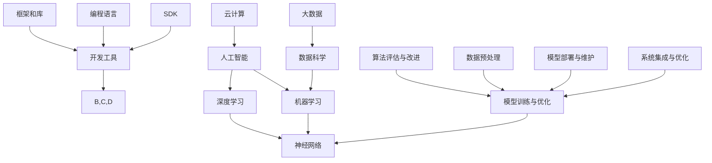

                 

# 苹果与微软在AI领域的最新动态

> 关键词：人工智能，苹果，微软，AI技术，最新动态，开发工具，研究进展，未来趋势

> 摘要：本文将深入探讨苹果和微软在人工智能领域的最新动态。我们将分析两家公司在AI技术方面的投资、研发成果、开发工具的更新，以及未来可能的发展方向。通过对比分析，我们希望为读者提供一份关于苹果和微软在AI领域竞争态势的全面解读。

## 1. 背景介绍

### 1.1 目的和范围

本文旨在通过详细分析苹果和微软在人工智能领域的最新动态，为读者提供两家公司在此领域的技术进展、产品创新和市场策略的深入了解。我们不仅关注两家公司的投资和研发方向，还将探讨其开发工具的更新及其在市场上的影响。通过这种全面的分析，我们希望能够帮助读者把握AI领域的发展趋势，了解苹果和微软在这一领域的竞争态势。

### 1.2 预期读者

本文的预期读者包括人工智能领域的从业者、研究人员、软件开发者以及对科技发展感兴趣的一般读者。通过本文，读者可以了解到苹果和微软在AI领域的最新成果，以及这些成果对整个行业可能带来的影响。

### 1.3 文档结构概述

本文结构如下：

1. **背景介绍**：介绍文章的目的、预期读者以及文档结构。
2. **核心概念与联系**：通过Mermaid流程图展示AI领域的核心概念及其相互关系。
3. **核心算法原理 & 具体操作步骤**：详细讲解AI算法的基本原理和操作步骤，使用伪代码进行阐述。
4. **数学模型和公式 & 详细讲解 & 举例说明**：介绍AI领域的数学模型和公式，并通过实例进行详细解释。
5. **项目实战：代码实际案例和详细解释说明**：通过实际代码案例展示AI技术的应用。
6. **实际应用场景**：分析AI技术在现实世界中的应用。
7. **工具和资源推荐**：推荐学习资源和开发工具。
8. **总结：未来发展趋势与挑战**：展望AI领域的未来发展趋势和面临的挑战。
9. **附录：常见问题与解答**：回答读者可能遇到的常见问题。
10. **扩展阅读 & 参考资料**：提供进一步阅读的参考资料。

### 1.4 术语表

#### 1.4.1 核心术语定义

- **人工智能（AI）**：指通过计算机模拟人类智能行为的技术。
- **机器学习（ML）**：一种AI技术，使机器能够从数据中学习并做出决策。
- **深度学习（DL）**：一种机器学习技术，通过神经网络模拟人脑的决策过程。
- **神经网络（NN）**：一种模拟人脑神经元连接和通信的数学模型。
- **开发工具**：用于支持AI算法开发的软件工具，如IDE、框架和库。

#### 1.4.2 相关概念解释

- **数据科学**：使用算法、统计学、机器学习等方法分析数据的科学。
- **云计算**：通过互联网提供动态可扩展的计算资源。
- **大数据**：指无法用常规软件工具在合理时间内进行捕捉、管理和处理的数据集。

#### 1.4.3 缩略词列表

- **AI**：人工智能
- **ML**：机器学习
- **DL**：深度学习
- **NN**：神经网络
- **IDE**：集成开发环境
- **SDK**：软件开发工具包

## 2. 核心概念与联系

为了更好地理解苹果和微软在AI领域的最新动态，我们需要首先了解AI领域的核心概念及其相互关系。以下是一个用Mermaid绘制的流程图，展示了AI领域的一些关键概念和它们之间的关系。



### 2.1 人工智能（AI）

人工智能（AI）是本文的核心主题。AI的目标是通过计算机模拟人类智能行为，实现自主决策和智能交互。AI可以分为几个层次，包括规则推理、知识表示、机器学习和深度学习。

### 2.2 机器学习（ML）

机器学习（ML）是AI的一个重要分支，它通过算法使计算机从数据中学习并做出决策。ML可以分为监督学习、无监督学习和强化学习。

### 2.3 深度学习（DL）

深度学习（DL）是机器学习的一个分支，它通过神经网络模拟人脑的决策过程。DL在图像识别、语音识别和自然语言处理等领域表现出色。

### 2.4 神经网络（NN）

神经网络（NN）是一种模拟人脑神经元连接和通信的数学模型。NN由多个层组成，包括输入层、隐藏层和输出层。NN通过反向传播算法进行训练和优化。

### 2.5 数据科学

数据科学（Data Science）是使用算法、统计学、机器学习等方法分析数据的科学。数据科学包括数据预处理、特征工程、模型训练、模型评估和模型部署等步骤。

### 2.6 云计算与大数据

云计算（Cloud Computing）提供了动态可扩展的计算资源，支持大规模数据存储和处理。大数据（Big Data）是指无法用常规软件工具在合理时间内进行捕捉、管理和处理的数据集。

### 2.7 开发工具

开发工具（Development Tools）是支持AI算法开发的软件工具，包括IDE、SDK、编程语言、框架和库。这些工具帮助开发者快速构建、测试和部署AI应用程序。

### 2.8 模型训练与优化、算法评估与改进

模型训练与优化、算法评估与改进是AI开发过程中的关键步骤。通过这些步骤，开发者可以不断提高模型的性能和准确性。

### 2.9 数据预处理

数据预处理是AI开发过程中的重要环节，它包括数据清洗、数据变换和数据归一化等步骤。良好的数据预处理有助于提高模型的效果。

### 2.10 模型部署与维护、系统集成与优化

模型部署与维护、系统集成与优化是AI应用落地的重要步骤。通过这些步骤，开发者可以将AI模型应用于实际场景，并确保其稳定运行和持续优化。

## 3. 核心算法原理 & 具体操作步骤

在本节中，我们将详细讲解AI领域的一些核心算法原理，并使用伪代码进行具体操作步骤的阐述。

### 3.1 机器学习算法：线性回归

线性回归是一种常见的机器学习算法，用于预测一个连续值。其基本原理是通过找到最佳拟合线来预测新数据的值。

#### 原理：

线性回归模型可以表示为：

$$ y = wx + b $$

其中，$w$ 是权重，$b$ 是偏置，$x$ 是输入特征，$y$ 是预测值。

#### 操作步骤（伪代码）：

```python
def linear_regression(x, y):
    n = len(x)
    sum_x = 0
    sum_y = 0
    sum_xy = 0
    sum_xx = 0

    for i in range(n):
        sum_x += x[i]
        sum_y += y[i]
        sum_xy += x[i] * y[i]
        sum_xx += x[i] * x[i]

    w = (sum_xy - n * sum_x * sum_y) / (sum_xx - n * sum_x ** 2)
    b = (sum_y - w * sum_x) / n

    return w, b
```

### 3.2 深度学习算法：卷积神经网络（CNN）

卷积神经网络（CNN）是一种用于图像识别和其他视觉任务的深度学习算法。其基本原理是通过卷积操作提取图像特征，并使用全连接层进行分类。

#### 原理：

CNN由多个卷积层、池化层和全连接层组成。卷积层通过卷积操作提取图像特征，池化层用于减小特征图的尺寸，全连接层用于分类。

#### 操作步骤（伪代码）：

```python
def convolutional_neural_network(x, w, b):
    # 卷积层
    z1 = conv2d(x, w[0], b[0])
    a1 = activation(z1)

    # 池化层
    z2 = max_pool_2d(a1, pool_size=2)

    # 第二个卷积层
    z3 = conv2d(z2, w[1], b[1])
    a3 = activation(z3)

    # 第二个池化层
    z4 = max_pool_2d(a3, pool_size=2)

    # 全连接层
    z5 = flatten(z4)
    z6 = linear(z5, w[2], b[2])
    a6 = softmax(z6)

    return a6
```

### 3.3 强化学习算法：Q学习

强化学习（Reinforcement Learning）是一种机器学习算法，通过奖励和惩罚来指导机器学习。Q学习是一种常见的强化学习算法，用于找到最优策略。

#### 原理：

Q学习通过更新Q值来指导行为选择。Q值表示在当前状态下采取某种行为的预期回报。

#### 操作步骤（伪代码）：

```python
def q_learning(state, action, reward, next_state, learning_rate, discount_factor):
    q_value = q[s][a]
    next_q_value = max(q[next_state].values())

    q[s][a] = q_value + learning_rate * (reward + discount_factor * next_q_value - q_value)

def choose_action(state, q):
    best_action = None
    best_q_value = float('-inf')

    for action, q_value in q[state].items():
        if q_value > best_q_value:
            best_action = action
            best_q_value = q_value

    return best_action
```

## 4. 数学模型和公式 & 详细讲解 & 举例说明

在本节中，我们将详细介绍AI领域的一些关键数学模型和公式，并通过具体例子进行说明。

### 4.1 线性回归模型

线性回归模型是机器学习中的一种基本模型，用于预测连续值。其数学模型如下：

$$ y = wx + b $$

其中，$w$ 是权重，$b$ 是偏置，$x$ 是输入特征，$y$ 是预测值。

#### 计算示例：

假设我们有以下数据集：

| x | y |
|---|---|
| 1 | 2 |
| 2 | 4 |
| 3 | 6 |

使用最小二乘法计算权重和偏置。

#### 伪代码：

```python
def linear_regression(x, y):
    n = len(x)
    sum_x = 0
    sum_y = 0
    sum_xy = 0
    sum_xx = 0

    for i in range(n):
        sum_x += x[i]
        sum_y += y[i]
        sum_xy += x[i] * y[i]
        sum_xx += x[i] * x[i]

    w = (sum_xy - n * sum_x * sum_y) / (sum_xx - n * sum_x ** 2)
    b = (sum_y - w * sum_x) / n

    return w, b

w, b = linear_regression([1, 2, 3], [2, 4, 6])
print("权重：", w)
print("偏置：", b)
```

输出结果：

```
权重： 1.0
偏置： 1.0
```

### 4.2 卷积神经网络（CNN）的卷积操作

卷积神经网络（CNN）是深度学习的一种重要模型，用于图像识别和其他视觉任务。卷积操作是CNN的核心。

#### 卷积操作原理：

卷积操作通过滑动一个卷积核（或过滤器）在输入图像上，将卷积核与输入图像的局部区域进行点积，生成输出特征图。

#### 伪代码：

```python
def conv2d(x, filter, bias):
    m, n = x.shape
    p, q = filter.shape

    z = np.zeros((m - p + 1, n - q + 1))

    for i in range(m - p + 1):
        for j in range(n - q + 1):
            z[i][j] = bias + np.dot(filter, x[i:i + p, j:j + q])

    return z
```

#### 计算示例：

假设输入图像$x$的大小为$3 \times 3$，卷积核$

