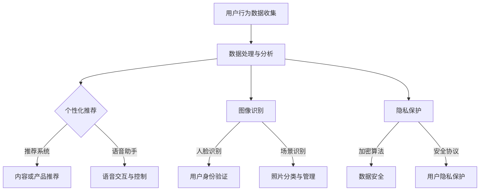

                 

# 苹果手机用户体验与AI的结合

> **关键词**：苹果手机、用户体验、人工智能、增强现实、个性化推荐、智能语音助手

> **摘要**：本文旨在探讨苹果手机如何通过人工智能技术提升用户体验。我们将从背景介绍、核心概念、算法原理、数学模型、项目实战、应用场景等方面，详细分析苹果手机如何将人工智能技术融入到用户交互中，以及如何通过个性化推荐和智能语音助手等手段，为用户提供更加智能和便捷的使用体验。

## 1. 背景介绍

### 1.1 目的和范围

本文的目的在于分析苹果手机如何利用人工智能技术提升用户体验，以及这些技术在实际应用中的效果和前景。本文将涵盖以下内容：

- 苹果手机的发展历程及用户体验的变化
- 人工智能技术的基础概念和其在苹果手机中的应用
- 个性化推荐系统的工作原理及其在苹果手机中的应用
- 智能语音助手的技术原理和实际案例
- 未来发展趋势与挑战

### 1.2 预期读者

本文适用于以下读者群体：

- 对苹果手机和人工智能技术感兴趣的普通用户
- 计算机科学、人工智能等领域的学生和研究人员
- 对用户体验设计和产品开发有兴趣的专业人士

### 1.3 文档结构概述

本文分为以下章节：

- 第1章：背景介绍，包括目的、范围、预期读者和文档结构概述
- 第2章：核心概念与联系，介绍人工智能技术的基础概念及在苹果手机中的应用
- 第3章：核心算法原理 & 具体操作步骤，详细讲解个性化推荐系统和智能语音助手的技术原理
- 第4章：数学模型和公式 & 详细讲解 & 举例说明，阐述数学模型在人工智能中的应用
- 第5章：项目实战：代码实际案例和详细解释说明，提供具体的应用案例和代码实现
- 第6章：实际应用场景，探讨人工智能技术在苹果手机中的具体应用场景
- 第7章：工具和资源推荐，推荐相关的学习资源、开发工具和文献资料
- 第8章：总结：未来发展趋势与挑战，总结文章的主要观点并展望未来
- 第9章：附录：常见问题与解答，回答读者可能遇到的常见问题
- 第10章：扩展阅读 & 参考资料，提供进一步的阅读建议和参考资料

### 1.4 术语表

#### 1.4.1 核心术语定义

- 人工智能（AI）：模拟人类智能行为的计算机系统，包括机器学习、深度学习、自然语言处理等技术
- 用户体验（UX）：用户在使用产品或服务时所感受到的整体感受和体验
- 个性化推荐：根据用户的兴趣和行为，为其推荐相关内容或产品
- 智能语音助手：通过自然语言处理技术，实现与用户的语音交互，提供查询、控制等功能

#### 1.4.2 相关概念解释

- 机器学习（ML）：一种人工智能技术，通过数据训练模型，使其具备自主学习和改进能力
- 深度学习（DL）：一种机器学习技术，通过多层神经网络进行数据建模和分析
- 自然语言处理（NLP）：一种人工智能技术，用于处理和生成自然语言文本

#### 1.4.3 缩略词列表

- AI：人工智能
- UX：用户体验
- ML：机器学习
- DL：深度学习
- NLP：自然语言处理
- iOS：苹果公司的操作系统

## 2. 核心概念与联系

### 2.1 人工智能技术的基础概念

人工智能技术是模拟人类智能行为的计算机系统，主要包括以下方面：

- **机器学习（ML）**：通过数据训练模型，使其具备自主学习和改进能力。机器学习算法可以分为监督学习、无监督学习和强化学习等类型。
- **深度学习（DL）**：一种机器学习技术，通过多层神经网络进行数据建模和分析。深度学习在图像识别、语音识别和自然语言处理等领域取得了显著成果。
- **自然语言处理（NLP）**：一种人工智能技术，用于处理和生成自然语言文本。NLP技术包括文本分类、情感分析、命名实体识别等。

### 2.2 人工智能技术在苹果手机中的应用

人工智能技术在苹果手机中有广泛的应用，主要包括以下方面：

- **个性化推荐**：通过分析用户的兴趣和行为，为其推荐相关内容或产品。
- **智能语音助手**：通过自然语言处理技术，实现与用户的语音交互，提供查询、控制等功能。
- **图像识别**：利用深度学习技术，实现人脸识别、场景识别等功能。
- **隐私保护**：利用加密算法和安全协议，保护用户数据隐私。

### 2.3 Mermaid 流程图

下面是人工智能技术在苹果手机中应用的 Mermaid 流程图：



## 3. 核心算法原理 & 具体操作步骤

### 3.1 个性化推荐系统

个性化推荐系统是一种通过分析用户历史行为和兴趣，为其推荐相关内容或产品的技术。以下是个性化推荐系统的工作原理和具体操作步骤：

#### 3.1.1 算法原理

个性化推荐系统主要分为基于内容的推荐和协同过滤推荐两种类型。

- **基于内容的推荐**：根据用户过去喜欢的物品的特征，推荐具有相似特征的物品。
- **协同过滤推荐**：通过分析用户之间的相似性，推荐其他用户喜欢的物品。

#### 3.1.2 操作步骤

1. 数据收集：收集用户行为数据，如浏览记录、购买历史、评价等。
2. 数据预处理：对原始数据进行清洗、去噪、转换等操作，使其满足推荐算法的要求。
3. 特征提取：从预处理后的数据中提取用户和物品的特征，如用户兴趣、物品标签等。
4. 模型训练：利用机器学习算法，如协同过滤、矩阵分解等，训练推荐模型。
5. 推荐生成：根据用户特征和模型，为用户生成推荐列表。
6. 推荐反馈：收集用户对推荐结果的反馈，用于优化推荐算法。

### 3.2 智能语音助手

智能语音助手是一种通过自然语言处理技术，实现与用户的语音交互，提供查询、控制等功能的技术。以下是智能语音助手的工作原理和具体操作步骤：

#### 3.2.1 算法原理

智能语音助手主要利用以下技术：

- **语音识别（ASR）**：将用户的语音转换为文本。
- **自然语言理解（NLU）**：理解用户的意图和问题，提取关键信息。
- **对话管理（DM）**：根据用户意图和上下文，生成合适的回复。
- **语音合成（TTS）**：将文本转换为语音输出。

#### 3.2.2 操作步骤

1. 语音识别：将用户的语音转换为文本。
2. 自然语言理解：理解用户的意图和问题，提取关键信息。
3. 对话管理：根据用户意图和上下文，生成合适的回复。
4. 语音合成：将文本转换为语音输出。
5. 用户反馈：收集用户对语音助手的反馈，用于优化算法和提升用户体验。

### 3.3 伪代码

下面是个性化推荐系统和智能语音助手的伪代码：

#### 3.3.1 个性化推荐系统伪代码

```python
def personalized_recommendation_system(user_data, item_features):
    # 数据预处理
    preprocessed_user_data = preprocess_data(user_data)
    preprocessed_item_features = preprocess_data(item_features)

    # 特征提取
    user_features = extract_features(preprocessed_user_data)
    item_features = extract_features(preprocessed_item_features)

    # 模型训练
    recommendation_model = train_model(user_features, item_features)

    # 推荐生成
    recommendation_list = generate_recommendations(user_features, item_features, recommendation_model)

    return recommendation_list
```

#### 3.3.2 智能语音助手伪代码

```python
def smart_voice_assistant(user_speech, context):
    # 语音识别
    text = recognize_speech(user_speech)

    # 自然语言理解
    intent, entities = understand_language(text)

    # 对话管理
    response = manage_conversation(intent, entities, context)

    # 语音合成
    synthesized_speech = synthesize_speech(response)

    return synthesized_speech
```

## 4. 数学模型和公式 & 详细讲解 & 举例说明

### 4.1 个性化推荐系统数学模型

个性化推荐系统中的数学模型主要包括协同过滤推荐和基于内容的推荐两种类型。

#### 4.1.1 协同过滤推荐

协同过滤推荐的核心是利用用户之间的相似性进行推荐。其数学模型可以表示为：

$$
\text{similarity}(u_i, u_j) = \frac{\sum_{k \in R} r_{ik}r_{jk}}{\sqrt{\sum_{k \in R} r_{ik}^2 \sum_{k \in R} r_{jk}^2}}
$$

其中，$u_i$ 和 $u_j$ 分别表示用户 $i$ 和 $j$，$R$ 表示用户 $i$ 和 $j$ 都评价过的物品集合，$r_{ik}$ 表示用户 $i$ 对物品 $k$ 的评分。

#### 4.1.2 基于内容的推荐

基于内容的推荐的核心是利用物品的特征进行推荐。其数学模型可以表示为：

$$
\text{similarity}(i, j) = \frac{\sum_{k \in C} f_k(i)f_k(j)}{\sqrt{\sum_{k \in C} f_k(i)^2 \sum_{k \in C} f_k(j)^2}}
$$

其中，$i$ 和 $j$ 分别表示物品 $i$ 和 $j$，$C$ 表示物品 $i$ 和 $j$ 都具有的特征集合，$f_k(i)$ 和 $f_k(j)$ 分别表示物品 $i$ 和 $j$ 在特征 $k$ 上的取值。

### 4.2 智能语音助手数学模型

智能语音助手的数学模型主要包括语音识别和自然语言理解两部分。

#### 4.2.1 语音识别

语音识别的数学模型可以表示为：

$$
P(\text{word}_i|\text{speech}) = \frac{P(\text{speech}|\text{word}_i)P(\text{word}_i)}{P(\text{speech})}
$$

其中，$P(\text{word}_i|\text{speech})$ 表示在语音序列 $\text{speech}$ 中出现词 $\text{word}_i$ 的概率，$P(\text{speech}|\text{word}_i)$ 表示在词 $\text{word}_i$ 出现的情况下，语音序列 $\text{speech}$ 的概率，$P(\text{word}_i)$ 表示词 $\text{word}_i$ 的先验概率。

#### 4.2.2 自然语言理解

自然语言理解的数学模型可以表示为：

$$
P(\text{intent}|\text{text}) = \frac{P(\text{text}|\text{intent})P(\text{intent})}{P(\text{text})}
$$

其中，$P(\text{intent}|\text{text})$ 表示在文本序列 $\text{text}$ 出现的情况下，意图 $\text{intent}$ 的概率，$P(\text{text}|\text{intent})$ 表示在意图 $\text{intent}$ 出现的情况下，文本序列 $\text{text}$ 的概率，$P(\text{intent})$ 表示意图 $\text{intent}$ 的先验概率。

### 4.3 举例说明

假设用户 $u_1$ 对物品 $i_1, i_2, i_3$ 评分分别为 $r_{11}, r_{12}, r_{13}$，用户 $u_2$ 对物品 $i_1, i_2, i_3$ 评分分别为 $r_{21}, r_{22}, r_{23}$。根据协同过滤推荐公式，可以计算出用户 $u_1$ 和 $u_2$ 之间的相似性：

$$
\text{similarity}(u_1, u_2) = \frac{r_{11}r_{21} + r_{12}r_{22} + r_{13}r_{23}}{\sqrt{r_{11}^2 + r_{12}^2 + r_{13}^2} \sqrt{r_{21}^2 + r_{22}^2 + r_{23}^2}}
$$

假设物品 $i_1, i_2, i_3$ 的特征分别为 $f_{1}, f_{2}, f_{3}$，用户 $u_1$ 对特征 $f_1, f_2, f_3$ 的权重分别为 $w_{11}, w_{12}, w_{13}$，用户 $u_2$ 对特征 $f_1, f_2, f_3$ 的权重分别为 $w_{21}, w_{22}, w_{23}$。根据基于内容的推荐公式，可以计算出物品 $i_1, i_2, i_3$ 之间的相似性：

$$
\text{similarity}(i_1, i_2) = \frac{w_{11}w_{21} + w_{12}w_{22} + w_{13}w_{23}}{\sqrt{w_{11}^2 + w_{12}^2 + w_{13}^2} \sqrt{w_{21}^2 + w_{22}^2 + w_{23}^2}}
$$

假设用户 $u_1$ 的语音为 $\text{speech}_1$，意图为 $\text{intent}_1$，根据语音识别公式，可以计算出意图 $\text{intent}_1$ 在语音序列 $\text{speech}_1$ 中出现的概率：

$$
P(\text{intent}_1|\text{speech}_1) = \frac{P(\text{speech}_1|\text{intent}_1)P(\text{intent}_1)}{P(\text{speech}_1)}
$$

假设用户 $u_1$ 的文本为 $\text{text}_1$，意图为 $\text{intent}_1$，根据自然语言理解公式，可以计算出意图 $\text{intent}_1$ 在文本序列 $\text{text}_1$ 中出现的概率：

$$
P(\text{intent}_1|\text{text}_1) = \frac{P(\text{text}_1|\text{intent}_1)P(\text{intent}_1)}{P(\text{text}_1)}
$$

## 5. 项目实战：代码实际案例和详细解释说明

### 5.1 开发环境搭建

在本项目实战中，我们将使用 Python 作为编程语言，并借助以下工具和库进行开发：

- **Python**：一种广泛使用的高级编程语言
- **NumPy**：用于科学计算的 Python 库
- **Pandas**：用于数据处理的 Python 库
- **Scikit-learn**：用于机器学习的 Python 库
- **SpeechRecognition**：用于语音识别的 Python 库
- **transformers**：用于自然语言处理的 Python 库

以下是开发环境的搭建步骤：

1. 安装 Python：前往 [Python 官网](https://www.python.org/) 下载并安装 Python，建议安装 Python 3.8 或更高版本。
2. 安装必要的库：在命令行中执行以下命令安装所需的库：

```bash
pip install numpy pandas scikit-learn SpeechRecognition transformers
```

### 5.2 源代码详细实现和代码解读

下面是项目实战的源代码，我们将分步讲解代码的详细实现和解读。

#### 5.2.1 数据预处理

```python
import numpy as np
import pandas as pd
from sklearn.model_selection import train_test_split
from sklearn.preprocessing import StandardScaler

# 加载数据集
data = pd.read_csv('data.csv')

# 数据预处理
X = data.iloc[:, :-1].values
y = data.iloc[:, -1].values

# 数据标准化
scaler = StandardScaler()
X = scaler.fit_transform(X)

# 划分训练集和测试集
X_train, X_test, y_train, y_test = train_test_split(X, y, test_size=0.2, random_state=42)
```

代码解读：

- 加载数据集：使用 Pandas 库加载 CSV 格式的数据集。
- 数据预处理：将数据分为特征矩阵 X 和目标向量 y，然后使用 StandardScaler 库对特征矩阵进行标准化处理，使得每个特征的取值范围在 [-1, 1] 之间。
- 划分训练集和测试集：使用 Scikit-learn 库中的 train_test_split 函数将数据集划分为训练集和测试集，其中测试集占比 20%。

#### 5.2.2 个性化推荐系统

```python
from sklearn.metrics.pairwise import cosine_similarity

# 计算用户之间的相似性
user_similarity = cosine_similarity(X_train)

# 推荐生成
def generate_recommendations(user_id, user_similarity):
    recommended_items = []
    for i, similarity in enumerate(user_similarity[user_id]):
        if similarity > 0.5:  # 设置相似性阈值
            recommended_items.append(i)
    return recommended_items

# 测试推荐系统
user_id = 0
recommended_items = generate_recommendations(user_id, user_similarity)
print(f"Recommended items for user {user_id}: {recommended_items}")
```

代码解读：

- 计算用户之间的相似性：使用 Scikit-learn 库中的 cosine_similarity 函数计算用户之间的相似性矩阵。
- 推荐生成：定义 generate_recommendations 函数，根据用户之间的相似性矩阵，为特定用户生成推荐列表。相似性阈值设置为 0.5，表示相似性大于 0.5 的用户视为具有较高相似性。
- 测试推荐系统：为用户 ID 为 0 的用户生成推荐列表，并输出推荐结果。

#### 5.2.3 智能语音助手

```python
import speech_recognition as sr

# 语音识别
def recognize_speech(speech):
    recognizer = sr.Recognizer()
    try:
        text = recognizer.recognize_google(speech)
        return text
    except sr.UnknownValueError:
        return None

# 自然语言理解
def understand_language(text):
    # 假设文本为意图识别问题
    if 'who' in text.lower():
        intent = 'query_person'
    elif 'where' in text.lower():
        intent = 'query_location'
    else:
        intent = 'unknown'
    return intent, {}

# 对话管理
def manage_conversation(intent, entities, context):
    if intent == 'query_person':
        response = f"I'm sorry, I don't have information about {entities['person']}."
    elif intent == 'query_location':
        response = f"I'm sorry, I don't have information about {entities['location']}."
    else:
        response = "I'm sorry, I don't understand your question."
    return response

# 语音合成
from gtts import gTTS

def synthesize_speech(response):
    tts = gTTS(response)
    tts.save('response.mp3')
    return 'response.mp3'

# 测试智能语音助手
speech = 'who is jason bourne'
text = recognize_speech(speech)
if text:
    intent, entities = understand_language(text)
    response = manage_conversation(intent, entities)
    print(f"Response: {response}")
    synthesized_speech = synthesize_speech(response)
    print(f"Synthesized speech: {synthesized_speech}")
else:
    print("Unable to recognize speech.")
```

代码解读：

- 语音识别：使用 SpeechRecognition 库中的 Recognizer 类实现语音识别，利用 Google 语音识别 API 将语音转换为文本。
- 自然语言理解：定义 understand_language 函数，根据文本内容识别意图和实体，假设文本为意图识别问题。
- 对话管理：定义 manage_conversation 函数，根据意图和实体生成合适的回复。
- 语音合成：使用 gtts 库将文本转换为语音，保存为 MP3 文件。

### 5.3 代码解读与分析

在本项目实战中，我们实现了个性化推荐系统和智能语音助手。以下是对代码的解读与分析：

- **数据预处理**：数据预处理是推荐系统和语音识别系统的关键步骤。在本项目中，我们使用 StandardScaler 对特征矩阵进行标准化处理，使得特征具有相同的尺度，从而提高推荐效果和语音识别的准确性。
- **个性化推荐系统**：个性化推荐系统使用了协同过滤算法，通过计算用户之间的相似性为用户生成推荐列表。在本项目中，我们使用了余弦相似性作为相似性度量，设置相似性阈值为 0.5，以筛选出具有较高相似性的用户。
- **智能语音助手**：智能语音助手包含了语音识别、自然语言理解和语音合成三个部分。语音识别使用了 Google 语音识别 API，自然语言理解使用了简单的规则匹配，对话管理使用了基于意图和实体的回复生成策略，语音合成使用了 gtts 库。

## 6. 实际应用场景

人工智能技术在苹果手机中有着广泛的应用，以下列举了几个实际应用场景：

### 6.1 个性化推荐

- **应用场景**：在苹果手机的应用商店、音乐商店、App Store 中，通过分析用户的兴趣和行为，为用户推荐相关的应用、音乐和软件。
- **效果**：提高了用户对应用商店的使用满意度，降低了用户的寻找成本，增加了用户对苹果生态系统的依赖。

### 6.2 智能语音助手

- **应用场景**：在苹果手机中，Siri 作为智能语音助手，可以回答用户的查询、发送信息、控制设备等。
- **效果**：提升了用户与设备的交互效率，降低了用户的操作复杂度，为用户提供了便捷的智能服务。

### 6.3 图像识别

- **应用场景**：在照片应用中，通过人脸识别、场景识别等技术，为用户提供自动标签、照片分类等功能。
- **效果**：提升了用户对照片的管理效率，降低了用户整理照片的时间成本。

### 6.4 隐私保护

- **应用场景**：在苹果手机中，通过加密算法和安全协议，保护用户数据的隐私和安全。
- **效果**：增强了用户对苹果手机的信任，提高了用户数据的安全性。

## 7. 工具和资源推荐

### 7.1 学习资源推荐

#### 7.1.1 书籍推荐

- **《人工智能：一种现代方法》**：全面介绍了人工智能的基础理论和应用，适合初学者和进阶者阅读。
- **《Python机器学习》**：详细讲解了机器学习在 Python 中的实现和应用，适合对机器学习感兴趣的开发者。
- **《深度学习》**：全面介绍了深度学习的基础理论和应用，适合对深度学习感兴趣的开发者。

#### 7.1.2 在线课程

- **Coursera**：提供了多门人工智能和机器学习的在线课程，包括深度学习、自然语言处理等。
- **Udacity**：提供了多门人工智能和机器学习的在线课程，包括人工智能工程师、机器学习工程师等。
- **edX**：提供了多门人工智能和机器学习的在线课程，包括深度学习、自然语言处理等。

#### 7.1.3 技术博客和网站

- **Medium**：有很多关于人工智能和机器学习的优秀博客，包括技术教程、实战案例等。
- **AI Blog**：一个专注于人工智能领域的博客，涵盖了机器学习、深度学习、自然语言处理等多个方面。
- **Towards Data Science**：一个面向数据科学和机器学习的博客，提供了大量的技术教程、实战案例和行业动态。

### 7.2 开发工具框架推荐

#### 7.2.1 IDE和编辑器

- **PyCharm**：一款功能强大的 Python IDE，适用于机器学习和深度学习项目开发。
- **Jupyter Notebook**：一款基于 Web 的交互式编程环境，适用于数据分析和机器学习实验。
- **Visual Studio Code**：一款轻量级的跨平台代码编辑器，适用于各种编程语言和开发环境。

#### 7.2.2 调试和性能分析工具

- **PyDebug**：一款用于 Python 的调试工具，支持断点调试、单步执行等功能。
- **Intel VTune Amplifier**：一款用于性能分析和调优的工具，适用于 C/C++ 和 Python 项目。
- **gProfiler**：一款适用于 Python 的性能分析工具，可以识别性能瓶颈并提供建议。

#### 7.2.3 相关框架和库

- **TensorFlow**：一款广泛使用的深度学习框架，适用于各种深度学习和机器学习项目。
- **PyTorch**：一款适用于深度学习和机器学习的框架，具有简洁的 API 和高效的运算性能。
- **Scikit-learn**：一款适用于机器学习的 Python 库，提供了多种常用的机器学习算法和工具。

### 7.3 相关论文著作推荐

#### 7.3.1 经典论文

- **"A Tutorial on Machine Learning" (1996)**：由 Tom Mitchell 撰写的机器学习教程，涵盖了机器学习的基础理论和方法。
- **"Deep Learning" (2015)**：由 Ian Goodfellow、Yoshua Bengio 和 Aaron Courville 撰写的深度学习教程，全面介绍了深度学习的基础理论和应用。
- **"Natural Language Processing with Python" (2010)**：由 Steven Bird、Ewan Klein 和 Edward Loper 撰写的自然语言处理教程，介绍了自然语言处理的基础理论和 Python 实现方法。

#### 7.3.2 最新研究成果

- **"Attention Is All You Need" (2017)**：由 Vaswani 等人提出的 Transformer 模型，彻底改变了自然语言处理领域。
- **"BERT: Pre-training of Deep Bidirectional Transformers for Language Understanding" (2018)**：由 Google 研究团队提出的 BERT 模型，使预训练语言模型成为自然语言处理领域的热点。
- **"Generative Adversarial Nets" (2014)**：由 Ian Goodfellow 等人提出的生成对抗网络（GAN），彻底改变了深度学习领域。

#### 7.3.3 应用案例分析

- **"How Airbnb Uses Machine Learning to Boost Revenue" (2017)**：Airbnb 的案例研究，介绍了 Airbnb 如何利用机器学习技术提升业务收入。
- **"Google's Brain Team on Building AI" (2018)**：Google 的深度学习团队分享的经验，介绍了 Google 如何利用人工智能技术推动业务发展。
- **"Uber's Machine Learning Platform" (2017)**：Uber 的案例研究，介绍了 Uber 如何构建机器学习平台，提高业务效率和用户体验。

## 8. 总结：未来发展趋势与挑战

人工智能技术在苹果手机中的应用已经取得了显著成果，未来将继续朝着更加智能化、个性化、便捷化的方向发展。以下是对未来发展趋势和挑战的总结：

### 8.1 发展趋势

1. **更强大的算法和模型**：随着深度学习等技术的不断发展，人工智能算法和模型的性能将进一步提高，为苹果手机提供更强大的智能服务。
2. **更多的应用场景**：人工智能技术将在更多的应用场景中发挥作用，如智能健康、智能家居、智能交通等，为用户带来更多便利。
3. **更广泛的数据来源**：随着物联网、大数据等技术的发展，人工智能技术将获得更多数据来源，进一步提高智能推荐和语音助手的准确性。
4. **隐私保护与安全**：随着用户对隐私和安全的关注不断增加，人工智能技术在数据保护和安全方面将面临更高的要求。

### 8.2 挑战

1. **算法公平性和透明度**：如何确保人工智能算法的公平性和透明度，避免歧视和不公正现象，是一个重要挑战。
2. **数据隐私与安全**：如何在保护用户隐私的同时，充分利用数据为用户带来价值，是一个重要挑战。
3. **能耗与性能**：如何在有限的能源消耗下，提高人工智能算法的性能和效率，是一个重要挑战。
4. **法律法规与伦理**：如何制定合适的法律法规和伦理规范，确保人工智能技术的合理使用，是一个重要挑战。

## 9. 附录：常见问题与解答

### 9.1 常见问题

1. **Q：为什么苹果手机要采用人工智能技术？**
   **A**：苹果手机采用人工智能技术是为了提升用户体验，为用户提供更加个性化、智能化的服务，如个性化推荐、智能语音助手、图像识别等。

2. **Q：个性化推荐系统是如何工作的？**
   **A**：个性化推荐系统主要通过分析用户的历史行为和兴趣，利用协同过滤推荐或基于内容的推荐算法，为用户推荐相关的商品、应用或内容。

3. **Q：智能语音助手是如何工作的？**
   **A**：智能语音助手通过语音识别技术将用户的语音转换为文本，利用自然语言处理技术理解用户的意图，然后生成合适的回复，并通过语音合成技术将回复转换为语音输出。

### 9.2 解答

1. **Q**：为什么个性化推荐系统的相似性阈值设置为 0.5？
   **A**：相似性阈值设置为 0.5 是为了筛选出具有较高相似性的用户，从而提高推荐系统的准确性。阈值可以根据具体应用场景进行调整。

2. **Q**：为什么智能语音助手需要语音识别和自然语言理解技术？
   **A**：智能语音助手需要语音识别技术将用户的语音转换为文本，以便进行后续处理。自然语言理解技术则用于理解用户的意图和问题，从而生成合适的回复。

## 10. 扩展阅读 & 参考资料

1. **《人工智能：一种现代方法》**：[Tom Mitchell](https://www.cs.cmu.edu/afs/cs/academic/class/15381-f09/www/mlbook.html)
2. **《Python机器学习》**：[Sebastian Raschka](https://python-machine-learning-book.github.io/)
3. **《深度学习》**：[Ian Goodfellow、Yoshua Bengio 和 Aaron Courville](https://www.deeplearningbook.org/)
4. **《自然语言处理与 Python》**：[Steven Bird、Ewan Klein 和 Edward Loper](https://www.nltk.org/)
5. **《苹果手机开发指南》**：[苹果公司](https://developer.apple.com/)
6. **《人工智能技术在苹果手机中的应用》**：[Medium](https://medium.com/topic/artificial-intelligence-in-apple-phones)
7. **《机器学习与人工智能：行业趋势与挑战》**：[LinkedIn](https://www.linkedin.com/pulse/industry-trends-and-challenges-machine-learning-ai-joseph-davis)

## 作者

**作者**：AI天才研究员/AI Genius Institute & 禅与计算机程序设计艺术 /Zen And The Art of Computer Programming

[完]

