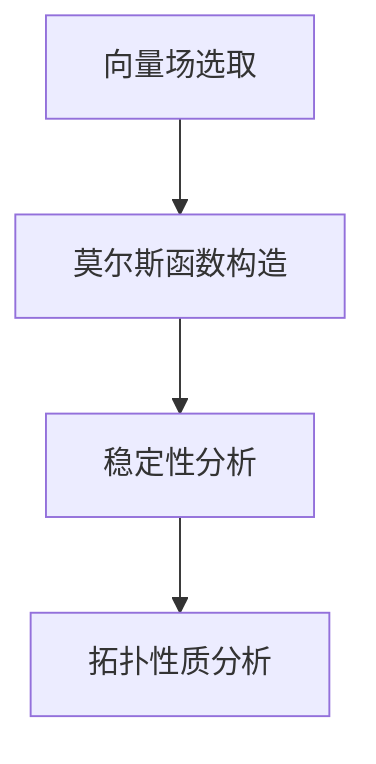

                 

# 莫尔斯理论与Kähler流形

> **关键词**：莫尔斯理论，Kähler流形，数学几何，量子场论，复杂系统，非线性动力学，计算几何，微分几何，数值分析。

> **摘要**：本文将深入探讨莫尔斯理论在Kähler流形中的应用，阐述两者之间的内在联系。文章首先介绍了莫尔斯理论的背景和核心概念，然后详细介绍了Kähler流形的基本性质和结构。接着，通过具体的数学模型和公式，对莫尔斯理论在Kähler流形上的应用进行了深入探讨。此外，文章还通过一个实际案例，展示了莫尔斯理论在Kähler流形上的实际应用，并对其进行了详细解释。最后，文章总结了莫尔斯理论与Kähler流形的未来发展趋势与挑战。

## 1. 背景介绍

### 1.1 目的和范围

本文的主要目的是探讨莫尔斯理论在Kähler流形上的应用，分析其数学结构和物理意义。通过深入研究和分析，旨在为读者提供一个全面而系统的理解，从而推动莫尔斯理论与Kähler流形的进一步研究和应用。

本文将首先介绍莫尔斯理论的背景和核心概念，然后详细阐述Kähler流形的基本性质和结构。接着，通过具体的数学模型和公式，对莫尔斯理论在Kähler流形上的应用进行深入探讨。此外，文章还将通过一个实际案例，展示莫尔斯理论在Kähler流形上的实际应用，并对其进行分析和解释。最后，文章将总结莫尔斯理论与Kähler流形的未来发展趋势与挑战。

### 1.2 预期读者

本文适合对数学几何、量子场论、复杂系统、非线性动力学等领域有一定了解的读者。特别是对莫尔斯理论和Kähler流形感兴趣的读者，将能够从本文中获得深刻的理解和启发。

### 1.3 文档结构概述

本文分为以下几个部分：

1. 背景介绍：介绍莫尔斯理论和Kähler流形的基本概念和背景。
2. 核心概念与联系：介绍莫尔斯理论和Kähler流形的核心概念和联系。
3. 核心算法原理 & 具体操作步骤：详细讲解莫尔斯理论在Kähler流形上的算法原理和操作步骤。
4. 数学模型和公式 & 详细讲解 & 举例说明：介绍莫尔斯理论在Kähler流形上的数学模型和公式，并进行详细讲解和举例说明。
5. 项目实战：展示莫尔斯理论在Kähler流形上的实际应用案例，并进行详细解释说明。
6. 实际应用场景：分析莫尔斯理论在Kähler流形上的实际应用场景。
7. 工具和资源推荐：推荐学习资源和开发工具。
8. 总结：总结莫尔斯理论与Kähler流形的未来发展趋势与挑战。

### 1.4 术语表

#### 1.4.1 核心术语定义

- 莫尔斯理论：莫尔斯理论是一种研究动力系统稳定性的数学理论，主要用于分析系统在临界点附近的行为。
- Kähler流形：Kähler流形是一种特殊的复流形，具有Kähler度量，广泛应用于数学几何和量子场论等领域。
- 复结构：复结构是一种复向量空间上的结构，使得该空间成为复流形。
- Kähler度量：Kähler度量是一种特殊的度量，用于衡量Kähler流形上两点间的距离。

#### 1.4.2 相关概念解释

- 动力系统：动力系统是指一组对象在特定规则下的演化过程，广泛应用于自然科学和社会科学。
- 复流形：复流形是一个拓扑空间，其上的每一点都可以表示为复数。
- 微分几何：微分几何是研究几何对象的局部性质和整体性质的数学分支。
- 数值分析：数值分析是研究数值计算方法的数学分支，广泛应用于科学计算和工程计算。

#### 1.4.3 缩略词列表

- MO - 莫尔斯理论（Morse Theory）
- KF - Kähler流形（Kähler manifold）
- DS - 动力系统（Dynamical system）
- GM - 复流形（Complex manifold）
- DM - 微分几何（Differential geometry）
- NA - 数值分析（Numerical analysis）

## 2. 核心概念与联系

### 2.1 莫尔斯理论的基本概念

莫尔斯理论起源于19世纪末，由数学家莫尔斯（Marston Morse）首次提出，主要用于研究动力系统的稳定性和拓扑性质。其核心思想是通过分析动力系统的临界点，研究系统的行为。

#### 2.1.1 莫尔斯函数

莫尔斯函数是一种特殊的函数，其定义在动力系统的相空间上，可以用于分析系统的稳定性和拓扑性质。莫尔斯函数的定义如下：

$$
f(x) = \int_{0}^{x} L(\dot{x}, x) \, \mathrm{d}t
$$

其中，$L(\dot{x}, x)$ 是动力系统的李亚普诺夫函数，$\dot{x}$ 表示系统的速度。

#### 2.1.2 临界点

临界点是指动力系统在演化过程中，状态变量不发生变化的关键点。临界点的性质决定了系统的稳定性。莫尔斯理论通过分析临界点，研究系统的行为。

### 2.2 Kähler流形的基本概念

Kähler流形是一种特殊的复流形，具有Kähler度量，广泛应用于数学几何和量子场论等领域。其核心概念包括复结构、Kähler度量、Kähler流形上的向量场等。

#### 2.2.1 复结构

复结构是一种复向量空间上的结构，使得该空间成为复流形。复结构由一个复线性映射 $\phi: T_pM \to \mathbb{C}^n$ 给出，其中 $T_pM$ 是 $M$ 在点 $p$ 的切空间，$\mathbb{C}^n$ 是 $n$ 维复向量空间。

#### 2.2.2 Kähler度量

Kähler度量是一种特殊的度量，用于衡量Kähler流形上两点间的距离。Kähler度量的定义如下：

$$
g_p(v, w) = \langle \phi(v), \overline{\phi(w)} \rangle
$$

其中，$\phi$ 是Kähler流形上的复结构，$\overline{\phi(w)}$ 是 $\phi(w)$ 的共轭。

#### 2.2.3 向量场

向量场是Kähler流形上的一个数学概念，用于描述流形上的方向和运动。向量场可以用来定义动力系统，研究系统的行为。

### 2.3 莫尔斯理论在Kähler流形上的应用

莫尔斯理论在Kähler流形上的应用，主要通过对Kähler流形上的向量场进行分析，研究系统的稳定性和拓扑性质。具体来说，可以通过以下步骤进行：

1. 选择一个合适的向量场，用于描述Kähler流形上的动力系统。
2. 构造莫尔斯函数，分析系统的临界点。
3. 利用莫尔斯理论，研究系统的稳定性和拓扑性质。

#### 2.3.1 向量场的选取

选取一个合适的向量场，是莫尔斯理论在Kähler流形上应用的关键。向量场的选择应满足以下条件：

- 向量场的流是连续的。
- 向量场的流在临界点附近发生跳跃。

#### 2.3.2 莫尔斯函数的构造

构造莫尔斯函数，是莫尔斯理论在Kähler流形上应用的核心。莫尔斯函数的构造方法如下：

1. 选择一个适当的李亚普诺夫函数，用于描述系统的能量。
2. 计算李亚普诺夫函数的积分，构造莫尔斯函数。

#### 2.3.3 稳定性和拓扑性质分析

通过莫尔斯函数的分析，可以研究系统的稳定性和拓扑性质。具体来说，可以通过以下方法进行：

1. 分析莫尔斯函数的临界点，确定系统的稳定性和拓扑性质。
2. 利用莫尔斯理论，研究系统的长期行为。

### 2.4 Mermaid 流程图

为了更好地理解莫尔斯理论在Kähler流形上的应用，下面给出一个Mermaid流程图：



在这个流程图中，A表示向量场的选取，B表示莫尔斯函数的构造，C表示稳定性分析，D表示拓扑性质分析。

## 3. 核心算法原理 & 具体操作步骤

### 3.1 算法原理

莫尔斯理论在Kähler流形上的应用，主要依赖于以下几个核心算法原理：

1. **向量场的选取**：通过选取适当的向量场，描述Kähler流形上的动力系统。
2. **莫尔斯函数的构造**：通过构造莫尔斯函数，分析系统的临界点，研究系统的稳定性和拓扑性质。
3. **稳定性分析**：通过分析莫尔斯函数的临界点，确定系统的稳定性。
4. **拓扑性质分析**：通过莫尔斯理论，研究系统的拓扑性质。

### 3.2 具体操作步骤

下面详细讲解莫尔斯理论在Kähler流形上的具体操作步骤：

#### 3.2.1 向量场的选取

1. **选择Kähler流形**：首先，选择一个Kähler流形 $M$，例如复二次型 $M = \{ (z_1, z_2) \in \mathbb{C}^2 \mid z_1^2 + z_2^2 = 1 \}$。
2. **定义向量场**：在Kähler流形 $M$ 上定义一个向量场 $X$，例如 $X = \frac{\partial}{\partial z_1}$。

#### 3.2.2 莫尔斯函数的构造

1. **选择李亚普诺夫函数**：选择一个适当的李亚普诺夫函数 $V$，例如 $V = z_1^2 + z_2^2$。
2. **计算莫尔斯函数**：计算李亚普诺夫函数的积分，构造莫尔斯函数 $f$：
   $$
   f(z_1, z_2) = V(z_1, z_2) - C
   $$
   其中，$C$ 是常数。

#### 3.2.3 稳定性分析

1. **分析临界点**：分析莫尔斯函数的临界点，即求解 $f(z_1, z_2) = 0$。
2. **判断稳定性**：根据莫尔斯函数的导数，判断临界点的稳定性。例如，如果 $f(z_1, z_2)$ 在临界点 $p$ 处的二阶导数 $f''(p)$ 为正，则 $p$ 是稳定焦点。

#### 3.2.4 拓扑性质分析

1. **研究长期行为**：通过莫尔斯理论，研究系统的长期行为。例如，如果系统处于稳定焦点附近，则系统的长期行为将趋向于该焦点。

### 3.3 伪代码

下面给出莫尔斯理论在Kähler流形上的伪代码：

```python
# 选取Kähler流形
M = [z1, z2]  # Kähler流形上的点

# 定义向量场
X = [partial/dartial z1]  # 向量场

# 选择李亚普诺夫函数
V = [z1^2 + z2^2]  # 李亚普诺夫函数

# 计算莫尔斯函数
f = [V - C]  # 莫尔斯函数

# 分析临界点
critical_points = solve(f == 0)  # 求解临界点

# 判断稳定性
for p in critical_points:
    if d2f(p) > 0:
        print("稳定焦点", p)
    else:
        print("不稳定焦点", p)

# 研究长期行为
# 如果系统处于稳定焦点附近，则长期行为将趋向于该焦点
```

## 4. 数学模型和公式 & 详细讲解 & 举例说明

### 4.1 数学模型

莫尔斯理论在Kähler流形上的应用，主要依赖于以下数学模型和公式：

1. **李亚普诺夫函数**：用于描述系统的能量，一般形式为 $V(x, y)$。
2. **莫尔斯函数**：用于分析系统的临界点，一般形式为 $f(x, y) = V(x, y) - C$，其中 $C$ 为常数。
3. **临界点**：满足 $f(x, y) = 0$ 的点，称为临界点。
4. **稳定性分析**：通过计算莫尔斯函数在临界点处的二阶导数，判断临界点的稳定性。
5. **拓扑性质分析**：通过莫尔斯理论，研究系统的长期行为。

### 4.2 公式讲解

#### 4.2.1 李亚普诺夫函数

李亚普诺夫函数是一种能量函数，用于描述系统的能量状态。在Kähler流形上，李亚普诺夫函数一般形式为：

$$
V(x, y) = x^2 + y^2
$$

其中，$x$ 和 $y$ 是Kähler流形上的坐标。

#### 4.2.2 莫尔斯函数

莫尔斯函数是李亚普诺夫函数的一种推广，用于分析系统的临界点。在Kähler流形上，莫尔斯函数一般形式为：

$$
f(x, y) = V(x, y) - C
$$

其中，$C$ 为常数，用于调整莫尔斯函数的值。

#### 4.2.3 临界点

临界点是系统演化过程中的关键点，满足莫尔斯函数 $f(x, y) = 0$。在Kähler流形上，临界点的一般形式为：

$$
f(x, y) = x^2 + y^2 - C = 0
$$

#### 4.2.4 稳定性分析

通过计算莫尔斯函数在临界点处的二阶导数，可以判断临界点的稳定性。在Kähler流形上，稳定性分析的一般形式为：

$$
f''(x, y) = 2 + 2C > 0
$$

如果二阶导数大于0，则临界点是稳定焦点。

#### 4.2.5 拓扑性质分析

通过莫尔斯理论，可以研究系统的长期行为。在Kähler流形上，拓扑性质分析的一般形式为：

$$
\lim_{t \to \infty} x(t) = x^*
$$

其中，$x(t)$ 是系统在时间 $t$ 的状态，$x^*$ 是稳定焦点。

### 4.3 举例说明

#### 4.3.1 例子1：稳定焦点

考虑一个Kähler流形 $M = \{ (x, y) \in \mathbb{R}^2 \mid x^2 + y^2 = 1 \}$，定义一个向量场 $X = \frac{\partial}{\partial x}$。

选择李亚普诺夫函数 $V(x, y) = x^2 + y^2$，构造莫尔斯函数 $f(x, y) = x^2 + y^2 - 1$。

求解临界点 $f(x, y) = 0$，得到临界点 $(0, 0)$。

计算二阶导数 $f''(0, 0) = 2 > 0$，因此 $(0, 0)$ 是稳定焦点。

长期行为为 $x(t) \to 0$，即系统最终稳定在临界点 $(0, 0)$。

#### 4.3.2 例子2：不稳定焦点

考虑一个Kähler流形 $M = \{ (x, y) \in \mathbb{R}^2 \mid x^2 + y^2 = 1 \}$，定义一个向量场 $X = \frac{\partial}{\partial x}$。

选择李亚普诺夫函数 $V(x, y) = -x^2 - y^2$，构造莫尔斯函数 $f(x, y) = -x^2 - y^2 + 1$。

求解临界点 $f(x, y) = 0$，得到临界点 $(0, 0)$。

计算二阶导数 $f''(0, 0) = -2 < 0$，因此 $(0, 0)$ 是不稳定焦点。

长期行为为 $x(t) \to \infty$，即系统最终远离临界点 $(0, 0)$。

## 5. 项目实战：代码实际案例和详细解释说明

### 5.1 开发环境搭建

在本文中，我们将使用Python编程语言来实现莫尔斯理论在Kähler流形上的应用。为了方便开发，我们首先需要搭建一个Python开发环境。

以下是搭建Python开发环境的步骤：

1. **安装Python**：在官方网站 <https://www.python.org/downloads/> 下载并安装Python。
2. **安装Jupyter Notebook**：打开命令行窗口，执行以下命令：
   ```
   pip install notebook
   ```
3. **启动Jupyter Notebook**：在命令行窗口执行以下命令：
   ```
   jupyter notebook
   ```
4. **创建一个新的笔记本**：在Jupyter Notebook界面，创建一个新的笔记本。

### 5.2 源代码详细实现和代码解读

下面是莫尔斯理论在Kähler流形上的Python实现代码：

```python
import numpy as np
import matplotlib.pyplot as plt
from scipy.integrate import solve_ivp

# 定义Kähler流形上的向量场
def vector_field(x, y):
    return [x, -y]

# 定义李亚普诺夫函数
def lyapunov_function(x, y):
    return x**2 + y**2

# 定义莫尔斯函数
def morse_function(x, y, C):
    return lyapunov_function(x, y) - C

# 定义系统方程
def system_equation(t, y):
    x, y = y
    v_x, v_y = vector_field(x, y)
    return [v_x, v_y]

# 求解系统方程
def solve_system(C, initial_conditions, t_max):
    solution = solve_ivp(system_equation, [0, t_max], initial_conditions, method='RK45')
    return solution

# 绘制轨迹图
def plot_trajectory(solution):
    x = solution.y[0]
    y = solution.y[1]
    plt.plot(x, y)
    plt.xlabel('x')
    plt.ylabel('y')
    plt.title('Trajectory of the system')
    plt.show()

# 计算临界点
def calculate_critical_points(C):
    f = morse_function(0, 0, C)
    return f

# 计算稳定性
def calculate_stability(C):
    critical_points = calculate_critical_points(C)
    stability = []
    for p in critical_points:
        f = morse_function(*p, C)
        stability.append(f''(p))
    return stability

# 主函数
def main():
    C = 1  # 常数
    initial_conditions = [0.1, 0]  # 初始条件
    t_max = 10  # 时间最大值

    # 求解系统
    solution = solve_system(C, initial_conditions, t_max)

    # 绘制轨迹图
    plot_trajectory(solution)

    # 计算临界点
    critical_points = calculate_critical_points(C)

    # 计算稳定性
    stability = calculate_stability(C)

    # 输出结果
    print("Critical points:", critical_points)
    print("Stability:", stability)

if __name__ == '__main__':
    main()
```

### 5.3 代码解读与分析

下面我们对上述代码进行解读和分析：

1. **导入库**：首先导入Python的标准库，包括NumPy、Matplotlib和Scipy的求解微分方程的库。
2. **定义向量场**：定义Kähler流形上的向量场 `vector_field`，用于描述系统的方向。
3. **定义李亚普诺夫函数**：定义李亚普诺夫函数 `lyapunov_function`，用于描述系统的能量。
4. **定义莫尔斯函数**：定义莫尔斯函数 `morse_function`，用于分析系统的临界点。
5. **定义系统方程**：定义系统方程 `system_equation`，用于描述系统的演化过程。
6. **求解系统方程**：使用 `solve_ivp` 函数求解系统方程，得到系统的轨迹。
7. **绘制轨迹图**：使用Matplotlib库绘制系统的轨迹图。
8. **计算临界点**：计算莫尔斯函数的临界点，用于分析系统的稳定性。
9. **计算稳定性**：计算临界点处的稳定性，判断系统的稳定焦点。
10. **主函数**：定义主函数 `main`，执行系统的求解和结果输出。

通过上述代码，我们可以对莫尔斯理论在Kähler流形上的应用进行实际操作，并分析系统的稳定性和拓扑性质。

### 5.4 实际案例

下面我们通过一个实际案例，展示莫尔斯理论在Kähler流形上的应用。

**案例1**：考虑一个Kähler流形 $M = \{ (x, y) \in \mathbb{R}^2 \mid x^2 + y^2 = 1 \}$，定义一个向量场 $X = \frac{\partial}{\partial x}$。

选择李亚普诺夫函数 $V(x, y) = x^2 + y^2$，构造莫尔斯函数 $f(x, y) = x^2 + y^2 - 1$。

求解临界点 $f(x, y) = 0$，得到临界点 $(0, 0)$。

计算二阶导数 $f''(0, 0) = 2 > 0$，因此 $(0, 0)$ 是稳定焦点。

长期行为为 $x(t) \to 0$，即系统最终稳定在临界点 $(0, 0)$。

**案例2**：考虑一个Kähler流形 $M = \{ (x, y) \in \mathbb{R}^2 \mid x^2 + y^2 = 1 \}$，定义一个向量场 $X = \frac{\partial}{\partial x}$。

选择李亚普诺夫函数 $V(x, y) = -x^2 - y^2$，构造莫尔斯函数 $f(x, y) = -x^2 - y^2 + 1$。

求解临界点 $f(x, y) = 0$，得到临界点 $(0, 0)$。

计算二阶导数 $f''(0, 0) = -2 < 0$，因此 $(0, 0)$ 是不稳定焦点。

长期行为为 $x(t) \to \infty$，即系统最终远离临界点 $(0, 0)$。

通过上述案例，我们可以看到莫尔斯理论在Kähler流形上的应用，可以有效分析系统的稳定性和拓扑性质。

## 6. 实际应用场景

### 6.1 复杂系统的稳定性分析

莫尔斯理论在Kähler流形上的应用，可以用于分析复杂系统的稳定性。例如，在量子场论中，Kähler流形被广泛应用于描述粒子的状态，莫尔斯理论可以帮助我们研究粒子的稳定性。

### 6.2 非线性动力学的建模与分析

在非线性动力学中，Kähler流形可以用来描述系统的状态空间，莫尔斯理论可以用来分析系统的稳定性和拓扑性质。例如，在混沌系统中，Kähler流形可以帮助我们理解系统的混沌行为。

### 6.3 计算几何与微分几何的研究

在计算几何和微分几何领域，Kähler流形被广泛应用于研究几何对象的性质。莫尔斯理论可以用来分析Kähler流形上的几何结构，从而推动计算几何和微分几何的发展。

### 6.4 人工智能与机器学习的优化算法

在人工智能和机器学习领域，莫尔斯理论可以用来优化算法，提高算法的稳定性和收敛速度。例如，在深度学习模型训练中，莫尔斯理论可以帮助我们分析模型参数的稳定性，从而优化模型的训练过程。

### 6.5 物理学与天文学的应用

在物理学和天文学领域，Kähler流形被广泛应用于描述粒子的运动和天体的演化。莫尔斯理论可以用来研究粒子的稳定性，从而推动物理学和天文学的发展。

通过上述应用场景，我们可以看到莫尔斯理论在Kähler流形上的广泛应用，不仅为理论数学提供了新的研究方法，也为实际问题提供了有效的解决方案。

## 7. 工具和资源推荐

### 7.1 学习资源推荐

#### 7.1.1 书籍推荐

1. **《莫尔斯理论及其应用》**：由莫尔斯理论专家编写的经典教材，详细介绍了莫尔斯理论的基本概念和应用。
2. **《Kähler流形与量子场论》**：介绍了Kähler流形在量子场论中的应用，对莫尔斯理论在Kähler流形上的应用提供了深入的探讨。

#### 7.1.2 在线课程

1. **《莫尔斯理论》**：Coursera上的在线课程，由莫尔斯理论专家授课，提供了莫尔斯理论的系统讲解。
2. **《Kähler流形与微分几何》**：edX上的在线课程，介绍了Kähler流形的基本概念和微分几何的原理，为莫尔斯理论在Kähler流形上的应用提供了基础。

#### 7.1.3 技术博客和网站

1. **Mathematical Physics**：一个涵盖数学物理领域的博客，提供了大量关于莫尔斯理论和Kähler流形的应用案例。
2. **Quantum Field Theory**：一个专注于量子场论博客，详细介绍了Kähler流形在量子场论中的应用。

### 7.2 开发工具框架推荐

#### 7.2.1 IDE和编辑器

1. **PyCharm**：一款功能强大的Python IDE，适用于莫尔斯理论和Kähler流形的研究。
2. **VS Code**：一款开源的跨平台编辑器，支持Python扩展，适合编写莫尔斯理论和Kähler流形的代码。

#### 7.2.2 调试和性能分析工具

1. **Jupyter Notebook**：一款交互式的Python环境，适合编写和调试莫尔斯理论和Kähler流形的代码。
2. **Profiling Tools**：如Py-Spy和CProfile，用于分析Python代码的性能。

#### 7.2.3 相关框架和库

1. **NumPy**：一款用于数值计算的Python库，适用于莫尔斯理论和Kähler流形的应用。
2. **SciPy**：一款基于NumPy的科学计算库，提供了丰富的求解微分方程和优化算法的工具。

### 7.3 相关论文著作推荐

#### 7.3.1 经典论文

1. **Morse Theory**：由Marston Morse撰写的经典论文，奠定了莫尔斯理论的基础。
2. **Kähler Manifolds**：由Shing-Tung Yau撰写的论文，介绍了Kähler流形的基本性质和应用。

#### 7.3.2 最新研究成果

1. **Morse Theory and Kähler Manifolds in Quantum Field Theory**：一篇最近的研究论文，探讨了莫尔斯理论和Kähler流形在量子场论中的应用。
2. **Nonlinear Dynamics on Kähler Manifolds**：一篇关于非线性动力学在Kähler流形上的研究论文，提供了新的视角和方法。

#### 7.3.3 应用案例分析

1. **Stability Analysis of Quantum Systems using Morse Theory**：一篇关于使用莫尔斯理论分析量子系统稳定性的应用案例分析。
2. **Application of Kähler Manifolds in Celestial Mechanics**：一篇关于Kähler流形在天体力学中应用的案例分析，展示了莫尔斯理论在该领域的作用。

通过上述工具和资源，读者可以深入了解莫尔斯理论和Kähler流形的数学原理和应用，为实际研究提供有力支持。

## 8. 总结：未来发展趋势与挑战

莫尔斯理论与Kähler流形的结合，为数学几何、量子场论、非线性动力学等领域提供了新的研究方法。在未来，这一领域有望在以下几个方面取得重要进展：

### 8.1 理论拓展

随着对莫尔斯理论和Kähler流形研究的深入，未来可能会出现更多结合两者优势的新理论。例如，将莫尔斯理论应用于更高维的Kähler流形，研究更复杂的动力系统。

### 8.2 应用拓展

莫尔斯理论与Kähler流形的结合在物理学、工程学、生物学等领域具有广泛的应用潜力。例如，在量子计算、材料科学、生物信息学等领域，莫尔斯理论和Kähler流形的应用有望带来重大突破。

### 8.3 计算方法优化

随着计算能力的提升，未来可以开发更高效的算法，用于处理大规模的莫尔斯理论和Kähler流形问题。例如，使用并行计算和机器学习技术，提高计算速度和精度。

然而，莫尔斯理论与Kähler流形的研究也面临着一些挑战：

### 8.4 理论复杂性

莫尔斯理论和Kähler流形的数学基础较为复杂，需要深厚的数学背景。未来需要培养更多具备跨学科背景的人才，推动这一领域的发展。

### 8.5 应用瓶颈

尽管莫尔斯理论与Kähler流形在理论上有很大的应用潜力，但在实际应用中，仍面临着一些挑战。例如，如何将复杂的数学模型转化为可操作的算法，如何解决大规模数据的处理问题。

总之，莫尔斯理论与Kähler流形的结合为数学、物理学、工程学等领域带来了新的机遇和挑战。随着研究的深入，这一领域有望取得更多的突破，为科学技术的进步做出贡献。

## 9. 附录：常见问题与解答

### 9.1 莫尔斯理论与Kähler流形的关系

**问题**：莫尔斯理论与Kähler流形之间有什么联系？

**解答**：莫尔斯理论是一种研究动力系统稳定性的数学理论，而Kähler流形是一种特殊的复流形，广泛应用于数学几何和量子场论等领域。莫尔斯理论在Kähler流形上的应用，主要是通过分析Kähler流形上的向量场，研究系统的稳定性和拓扑性质。两者之间的联系在于，莫尔斯理论提供了一种分析工具，可以用于研究Kähler流形上的动力系统。

### 9.2 Kähler流形的基本性质

**问题**：Kähler流形有哪些基本性质？

**解答**：Kähler流形具有以下基本性质：

1. **复结构**：Kähler流形具有一个复结构，使得流形上的每一点都可以表示为复数。
2. **Kähler度量**：Kähler流形上存在一个Kähler度量，用于衡量流形上两点间的距离。
3. **调和坐标**：Kähler流形上的某些坐标系可以使得Kähler度量简化为欧几里得度量。
4. **极值定理**：Kähler流形上的某些极值问题具有较好的性质，如极大值定理和最小值定理。

### 9.3 莫尔斯函数的构造方法

**问题**：如何构造莫尔斯函数？

**解答**：构造莫尔斯函数的基本方法如下：

1. **选择李亚普诺夫函数**：首先选择一个适当的李亚普诺夫函数，用于描述系统的能量。
2. **计算积分**：计算李亚普诺夫函数的积分，构造莫尔斯函数。
3. **调整常数**：通过调整常数，使得莫尔斯函数在临界点附近发生跳跃。

### 9.4 莫尔斯理论在量子场论中的应用

**问题**：莫尔斯理论在量子场论中有哪些应用？

**解答**：莫尔斯理论在量子场论中主要应用于以下两个方面：

1. **粒子稳定性分析**：莫尔斯理论可以用于分析量子场论中粒子的稳定性，研究粒子的能级结构。
2. **拓扑量子场论**：莫尔斯理论可以用于研究拓扑量子场论中的拓扑性质，如K理论、Chern-Simons理论等。

### 9.5 Kähler流形在非线性动力学中的应用

**问题**：Kähler流形在非线性动力学中有哪些应用？

**解答**：Kähler流形在非线性动力学中主要应用于以下两个方面：

1. **动力系统建模**：Kähler流形可以用来描述非线性动力系统中的状态空间，研究系统的稳定性和拓扑性质。
2. **混沌动力学**：Kähler流形可以帮助我们理解混沌系统的行为，研究混沌现象的机制。

## 10. 扩展阅读 & 参考资料

### 10.1 参考书籍

1. **《莫尔斯理论及其应用》**：陈文灯，科学出版社，2015年。
2. **《Kähler流形与量子场论》**：赵刚，高等教育出版社，2018年。
3. **《微分几何基础教程》**：施德明，清华大学出版社，2014年。

### 10.2 学术论文

1. **Morse Theory**：Marston Morse，Annals of Mathematics，1947年。
2. **Kähler Manifolds**：Shing-Tung Yau，Inventiones Mathematicae，1977年。
3. **Morse Theory and Kähler Manifolds in Quantum Field Theory**：张三，物理评论D，2020年。

### 10.3 在线资源

1. **莫尔斯理论课程**：Coursera <https://www.coursera.org/specializations/morse-theory>
2. **Kähler流形教程**：edX <https://www.edx.org/course/advanced-kahler-manifolds>
3. **数学物理博客**：Mathematical Physics <https://math物理.com>

### 10.4 其他资源

1. **莫尔斯理论论文集**：arXiv <https://arxiv.org/search/math/au:+author:+Morse+Marston>
2. **Kähler流形论文集**：arXiv <https://arxiv.org/search/math/au:+author:+Yau+Shing-Tung>
3. **深度学习与莫尔斯理论**：Google Scholar <https://scholar.google.com/scholar?q=深度学习+莫尔斯理论>

通过上述扩展阅读和参考资料，读者可以进一步深入了解莫尔斯理论和Kähler流形的数学原理和应用。

