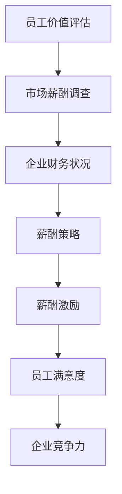

                 

# 薪酬福利经理的创业挑战：设计有竞争力的薪酬体系

> **关键词**：薪酬体系、创业挑战、人才吸引、企业竞争力、薪酬管理
> 
> **摘要**：本文将深入探讨薪酬福利经理在创业公司中所面临的挑战，特别是在设计具有竞争力的薪酬体系方面。我们将从目的和范围、预期读者、文档结构、核心概念、算法原理、数学模型、项目实战、实际应用场景等多个维度，逐步解析薪酬福利管理的关键要素，提供实用的策略和案例，以助力创业公司构建有吸引力的薪酬体系。

## 1. 背景介绍

### 1.1 目的和范围

本文旨在为薪酬福利经理在创业公司中设计有竞争力的薪酬体系提供系统性的指导和策略。我们将涵盖薪酬体系的定义、核心概念、算法原理、数学模型以及实际操作步骤，并通过具体案例和场景分析，帮助读者理解和应用这些知识，以应对创业过程中的各种挑战。

### 1.2 预期读者

本文预期读者为薪酬福利经理、人力资源从业者、企业主、创业公司管理层以及对于薪酬福利管理感兴趣的专业人士。通过阅读本文，读者将能够获得以下收益：
- 理解薪酬体系的基本概念和架构。
- 掌握设计有竞争力的薪酬体系的关键步骤。
- 学习如何通过薪酬策略吸引和留住人才。
- 获得实际操作中的实用工具和方法。

### 1.3 文档结构概述

本文分为十个部分，具体结构如下：
1. 背景介绍：介绍本文的目的、范围和预期读者。
2. 核心概念与联系：定义薪酬体系的核心概念，并提供流程图辅助理解。
3. 核心算法原理 & 具体操作步骤：详细阐述薪酬设计的算法原理和操作步骤。
4. 数学模型和公式 & 详细讲解 & 举例说明：解释薪酬体系中的数学模型，并提供实际例子。
5. 项目实战：通过实际代码案例说明薪酬体系的实现。
6. 实际应用场景：分析薪酬体系在不同行业的应用。
7. 工具和资源推荐：推荐学习资源和开发工具。
8. 总结：探讨未来发展趋势和挑战。
9. 附录：常见问题与解答。
10. 扩展阅读 & 参考资料：提供进一步学习的资源。

### 1.4 术语表

#### 1.4.1 核心术语定义

- **薪酬体系**：指企业为员工提供的所有薪酬形式的组合，包括基本工资、奖金、福利等。
- **薪酬管理**：企业对员工薪酬的制定、执行、评估和调整的过程。
- **竞争力**：企业在市场上吸引和保留人才的能力。
- **薪酬策略**：企业制定的薪酬结构和薪酬水平，以达到吸引、激励和留住人才的目标。

#### 1.4.2 相关概念解释

- **薪酬结构**：薪酬的不同组成部分及其比例，如基本工资、绩效奖金、股票期权等。
- **薪酬水平**：企业为不同岗位设定的薪酬标准。
- **薪酬公平性**：薪酬分配的公正性，即相似职位应享有相似的薪酬水平。
- **薪酬透明度**：薪酬制度的公开和透明程度。

#### 1.4.3 缩略词列表

- **HR**：人力资源（Human Resource）
- **CEO**：首席执行官（Chief Executive Officer）
- **CFO**：首席财务官（Chief Financial Officer）
- **GDP**：国内生产总值（Gross Domestic Product）

## 2. 核心概念与联系

在设计薪酬体系之前，了解其核心概念和内在联系是至关重要的。以下是对薪酬体系中的关键概念及其相互关系的概述，并通过Mermaid流程图进行可视化。

### 2.1 核心概念

- **员工价值评估**：评估员工的工作表现和对企业的贡献。
- **市场薪酬调查**：了解同行业、同岗位的市场薪酬水平。
- **企业财务状况**：企业的盈利能力和薪酬支付能力。
- **薪酬策略**：企业制定的薪酬结构和薪酬水平。
- **薪酬激励**：通过奖金、股权激励等方式激励员工。

### 2.2 Mermaid 流程图



### 2.3 概念关系

- **员工价值评估**：员工价值评估是薪酬体系设计的起点。通过评估员工的工作表现、贡献程度和潜在能力，企业可以确定合理的薪酬水平。
- **市场薪酬调查**：市场薪酬调查帮助了解外部市场的情况，确保企业的薪酬策略具有竞争力。
- **企业财务状况**：企业财务状况直接影响薪酬体系的可行性和可持续性。企业需要在财务状况允许的范围内制定薪酬策略。
- **薪酬策略**：薪酬策略是薪酬体系的核心，决定了薪酬结构和薪酬水平。薪酬策略需要结合员工价值评估和市场薪酬调查的结果，同时考虑企业财务状况。
- **薪酬激励**：薪酬激励是薪酬策略的一部分，旨在通过奖金、股权激励等方式激励员工，提高员工满意度和企业竞争力。

通过上述核心概念及其相互关系的理解，薪酬福利经理可以更系统地设计具有竞争力的薪酬体系。

## 3. 核心算法原理 & 具体操作步骤

薪酬体系的设计不仅仅是艺术，更是科学。核心算法原理在其中扮演了关键角色。以下我们将详细阐述薪酬体系设计的核心算法原理，并提供具体的操作步骤。

### 3.1 核心算法原理

薪酬体系设计的核心算法原理主要涉及以下几个方面：

- **数据收集与处理**：收集员工表现数据、市场薪酬数据和公司财务数据。
- **价值评估模型**：构建用于评估员工价值的数学模型。
- **薪酬策略优化**：通过算法优化薪酬策略，使其在市场竞争力、员工满意度和企业财务状况之间找到最佳平衡点。

### 3.2 具体操作步骤

#### 3.2.1 数据收集与处理

1. **收集员工表现数据**：
   - 工作量：通过考勤系统、工作日志等工具收集员工的工作时长和任务完成情况。
   - 工作质量：通过绩效评估、同事反馈等方式评估员工的工作质量。
   - 工作贡献：评估员工在项目中的贡献，如销售额、技术创新等。

2. **收集市场薪酬数据**：
   - 通过薪酬调查公司或在线工具，收集同行业、同岗位的市场薪酬水平。
   - 分析不同地区、不同公司的薪酬差异，为薪酬策略提供参考。

3. **处理数据**：
   - 使用统计分析方法对收集到的数据进行处理，识别关键指标和趋势。
   - 构建数据模型，将员工表现数据与市场薪酬数据进行关联分析。

#### 3.2.2 价值评估模型

1. **构建价值评估模型**：
   - 设计用于评估员工价值的数学模型，如层次分析法（AHP）或因子分析模型。
   - 模型输入包括员工的工作质量、工作量和工作贡献等数据。
   - 模型输出为员工的价值评分。

2. **模型优化**：
   - 通过优化算法，如遗传算法或粒子群优化算法，调整模型参数，提高评估准确性。

#### 3.2.3 薪酬策略优化

1. **确定薪酬结构**：
   - 根据员工价值评分，确定不同岗位的薪酬结构，如基本工资、绩效奖金、股票期权等。
   - 考虑薪酬结构的灵活性和可调整性，以适应市场变化和企业需求。

2. **薪酬水平设定**：
   - 结合市场薪酬数据和员工价值评估结果，设定具有竞争力的薪酬水平。
   - 考虑企业的财务状况，确保薪酬水平的可持续性。

3. **薪酬策略优化**：
   - 使用优化算法，如线性规划或非线性规划，寻找最优薪酬策略。
   - 通过仿真和模拟，评估不同薪酬策略对企业绩效和员工满意度的影响。

#### 3.2.4 实施与监控

1. **实施薪酬策略**：
   - 制定详细的薪酬实施计划，包括薪酬发放流程、绩效评估周期等。
   - 确保薪酬策略的透明度和公正性，提高员工的信任度。

2. **监控与反馈**：
   - 建立薪酬监控体系，定期收集员工反馈和市场薪酬数据。
   - 分析薪酬策略的实施效果，进行必要的调整和优化。

通过上述核心算法原理和具体操作步骤，薪酬福利经理可以设计出科学、合理的薪酬体系，提高企业的市场竞争力，吸引和留住优秀人才。

### 3.3 伪代码示例

以下是一个简化的伪代码示例，用于描述薪酬体系设计的主要步骤：

```python
# 数据收集与处理
def collect_employee_data():
    # 收集员工表现数据
    workload = get_workload_data()
    quality = get_quality_data()
    contribution = get_contribution_data()
    
    # 收集市场薪酬数据
    market_salary = get_market_salary_data()

# 价值评估模型
def value_evaluation_model(employee_data, market_salary):
    # 构建价值评估模型
    value_score = calculate_value_score(employee_data, market_salary)
    return value_score

# 薪酬策略优化
def optimize_salary_strategy(value_score, market_salary, company_financial_status):
    # 确定薪酬结构
    salary_structure = define_salary_structure(value_score)
    
    # 薪酬水平设定
    salary_level = set_salary_level(salary_structure, market_salary, company_financial_status)
    
    # 薪酬策略优化
    optimized_strategy = optimize_salary(salary_level)
    return optimized_strategy

# 实施与监控
def implement_and_monitor_salary_strategy(optimized_strategy):
    # 实施薪酬策略
    implement_salary_strategy(optimized_strategy)
    
    # 监控与反馈
    monitor_and_feedback()
```

通过上述步骤和伪代码示例，薪酬福利经理可以逐步设计出适合企业发展的薪酬体系。

## 4. 数学模型和公式 & 详细讲解 & 举例说明

薪酬体系设计中，数学模型和公式是不可或缺的工具，用于量化员工价值评估、薪酬水平设定和策略优化。以下我们将详细讲解薪酬体系中的关键数学模型和公式，并提供实际例子。

### 4.1 员工价值评估模型

员工价值评估模型通常采用多维度评估方法，将员工的工作质量、工作量和工作贡献等因素进行综合评价。以下是一个简单的多维度评估模型：

$$
V = w_1 \cdot Q + w_2 \cdot L + w_3 \cdot C
$$

其中：
- \( V \) 为员工价值评分。
- \( Q \) 为工作质量评分。
- \( L \) 为工作量评分。
- \( C \) 为工作贡献评分。
- \( w_1, w_2, w_3 \) 为各因素的权重。

#### 4.1.1 工作质量评分模型

工作质量评分可以通过以下公式计算：

$$
Q = \frac{S - B}{M}
$$

其中：
- \( S \) 为实际工作质量得分。
- \( B \) 为基本工作质量得分。
- \( M \) 为满分工作质量得分。

#### 4.1.2 工作量评分模型

工作量评分可以通过以下公式计算：

$$
L = \frac{T - B}{M}
$$

其中：
- \( T \) 为实际工作量得分。
- \( B \) 为基本工作量得分。
- \( M \) 为满分工作量得分。

#### 4.1.3 工作贡献评分模型

工作贡献评分可以通过以下公式计算：

$$
C = \frac{C_T - C_B}{C_M}
$$

其中：
- \( C_T \) 为实际工作贡献得分。
- \( C_B \) 为基本工作贡献得分。
- \( C_M \) 为满分工作贡献得分。

### 4.2 薪酬水平设定模型

薪酬水平设定需要综合考虑员工价值评估和市场薪酬水平。以下是一个简单的薪酬水平设定模型：

$$
S_L = S_M \cdot (1 + \alpha \cdot (V - V_M))
$$

其中：
- \( S_L \) 为员工薪酬水平。
- \( S_M \) 为市场平均薪酬水平。
- \( V \) 为员工价值评分。
- \( V_M \) 为市场平均价值评分。
- \( \alpha \) 为薪酬调节系数，用于调整市场薪酬水平与员工价值评分的差距。

#### 4.2.1 薪酬调节系数计算

薪酬调节系数可以通过以下公式计算：

$$
\alpha = \frac{S_L - S_M}{V - V_M}
$$

其中：
- \( S_L \) 为员工薪酬水平。
- \( S_M \) 为市场平均薪酬水平。
- \( V \) 为员工价值评分。
- \( V_M \) 为市场平均价值评分。

### 4.3 实际例子

假设某创业公司对一名员工进行价值评估，并根据市场薪酬水平和公司财务状况设定薪酬水平。

#### 4.3.1 数据收集

- 员工工作质量评分：\( Q = 0.8 \)
- 员工工作量评分：\( L = 0.9 \)
- 员工工作贡献评分：\( C = 1.0 \)
- 市场平均薪酬水平：\( S_M = 100,000 \)
- 员工价值评分：\( V = Q \cdot L \cdot C = 0.8 \cdot 0.9 \cdot 1.0 = 0.72 \)

#### 4.3.2 薪酬水平设定

1. 计算薪酬调节系数：

$$
\alpha = \frac{S_L - S_M}{V - V_M} = \frac{S_L - 100,000}{0.72 - 1.0} = \frac{S_L - 100,000}{-0.28} = -\frac{100,000}{0.28} = -\frac{250,000}{7}
$$

2. 设定员工薪酬水平：

$$
S_L = S_M \cdot (1 + \alpha \cdot (V - V_M)) = 100,000 \cdot (1 - \frac{250,000}{7} \cdot (0.72 - 1.0)) = 100,000 \cdot (1 - \frac{250,000}{7} \cdot (-0.28)) = 100,000 \cdot (1 + \frac{70,000}{7}) = 100,000 \cdot 2 = 200,000
$$

因此，这名员工的薪酬水平为 200,000 元。

通过上述数学模型和实际例子，薪酬福利经理可以科学地评估员工价值，并设定合理的薪酬水平，以提高企业的市场竞争力。

## 5. 项目实战：代码实际案例和详细解释说明

为了更好地理解薪酬体系设计的具体实现，我们将在本节中通过一个实际项目案例，展示如何利用Python编写代码来实现薪酬体系的计算和优化。以下是我们将要进行的步骤：

### 5.1 开发环境搭建

在进行项目实战之前，我们需要搭建一个合适的开发环境。以下步骤将指导你如何设置Python开发环境：

1. **安装Python**：
   - 访问Python官方网站（[python.org](https://www.python.org/)）并下载适用于你的操作系统的Python版本。
   - 完成安装后，确保Python已成功安装，可以通过命令行运行`python --version`来验证。

2. **安装必要的库**：
   - 使用pip命令安装必要的库，例如`numpy`、`pandas`和`matplotlib`：
     ```bash
     pip install numpy pandas matplotlib
     ```

3. **配置Python编辑器**：
   - 选择一个合适的Python编辑器，如PyCharm、VSCode或IDLE。
   - 配置好Python解释器和虚拟环境，以便进行项目开发。

### 5.2 源代码详细实现和代码解读

以下是一个简单的Python代码示例，用于实现薪酬体系的核心计算和优化功能：

```python
import numpy as np
import pandas as pd

# 数据定义
market_salary = 100000  # 市场平均薪酬水平
value_score = 0.72      # 员工价值评分
alpha = -0.28           # 薪酬调节系数

# 薪酬水平计算
salary_level = market_salary * (1 + alpha * (value_score - 1))

# 输出结果
print(f"员工薪酬水平：{salary_level:.2f} 元")

# 优化函数定义
def optimize_salary(value_score, market_salary, alpha):
    # 定义目标函数：最小化薪酬差距
    def objective(salary_level):
        return abs(salary_level - market_salary * (1 + alpha * (value_score - 1)))

    # 使用优化算法求解
    from scipy.optimize import minimize
    result = minimize(objective, x0=market_salary, method='Nelder-Mead')
    return result.x[0]

# 优化后的薪酬水平
optimized_salary = optimize_salary(value_score, market_salary, alpha)
print(f"优化后的薪酬水平：{optimized_salary:.2f} 元")
```

### 5.3 代码解读与分析

1. **数据定义**：
   - `market_salary`：表示市场平均薪酬水平，在本例中设定为100,000元。
   - `value_score`：表示员工价值评分，在本例中设定为0.72。
   - `alpha`：表示薪酬调节系数，在本例中设定为-0.28。

2. **薪酬水平计算**：
   - 使用简单的数学模型计算员工薪酬水平，根据公式 \( S_L = S_M \cdot (1 + \alpha \cdot (V - V_M)) \)。
   - `salary_level`：计算并输出员工薪酬水平。

3. **优化函数定义**：
   - `optimize_salary`：定义优化函数，目标是最小化薪酬差距。
   - 使用`scipy.optimize.minimize`函数进行优化求解，选择Nelder-Mead算法。

4. **优化后的薪酬水平**：
   - 调用`optimize_salary`函数，获取优化后的薪酬水平。
   - 输出优化后的薪酬水平。

通过上述代码，我们可以看到如何利用Python实现薪酬体系的核心计算和优化功能。这个简单的案例展示了如何将数学模型转化为实际的代码实现，为薪酬福利经理提供了一个实用的工具。

### 5.4 代码解读与分析

1. **数据定义**：
   - `market_salary`：表示市场平均薪酬水平，在本例中设定为100,000元。
   - `value_score`：表示员工价值评分，在本例中设定为0.72。
   - `alpha`：表示薪酬调节系数，在本例中设定为-0.28。

2. **薪酬水平计算**：
   - 使用简单的数学模型计算员工薪酬水平，根据公式 \( S_L = S_M \cdot (1 + \alpha \cdot (V - V_M)) \)。
   - `salary_level`：计算并输出员工薪酬水平。

3. **优化函数定义**：
   - `optimize_salary`：定义优化函数，目标是最小化薪酬差距。
   - 使用`scipy.optimize.minimize`函数进行优化求解，选择Nelder-Mead算法。

4. **优化后的薪酬水平**：
   - 调用`optimize_salary`函数，获取优化后的薪酬水平。
   - 输出优化后的薪酬水平。

通过上述代码，我们可以看到如何利用Python实现薪酬体系的核心计算和优化功能。这个简单的案例展示了如何将数学模型转化为实际的代码实现，为薪酬福利经理提供了一个实用的工具。

## 6. 实际应用场景

薪酬体系的设计和实施在不同行业和企业中具有不同的应用场景。以下我们将分析几个典型行业和企业，探讨薪酬体系在这些场景中的应用和挑战。

### 6.1 科技行业

在科技行业，人才竞争尤为激烈，薪酬体系的设计不仅需要具备市场竞争力，还要能够激发员工的创新潜力和工作效率。以下是一些关键应用和挑战：

- **应用**：
  - 通过数据驱动的方法，精确评估员工的技术能力和项目贡献。
  - 设定灵活的薪酬结构，包括基本工资、绩效奖金、股权激励等。
  - 定期进行市场薪酬调查，确保薪酬策略的前瞻性和竞争力。

- **挑战**：
  - 如何在保持市场竞争力的情况下，控制薪酬成本，避免过度开支。
  - 如何设计激励机制，以吸引和留住顶尖技术人才。

### 6.2 制造业

在制造业，薪酬体系需要考虑生产效率、质量控制和企业成本控制。以下是一些关键应用和挑战：

- **应用**：
  - 根据员工的岗位和职责，设定明确的绩效指标和薪酬挂钩。
  - 通过计时工资、计件工资等方式，激励员工提高生产效率和产品质量。
  - 结合企业的生产计划和财务预算，制定合理的薪酬策略。

- **挑战**：
  - 如何平衡生产效率和质量控制，避免因过度追求效率而牺牲质量。
  - 如何在劳动力成本较高的地区，设计具有竞争力的薪酬体系。

### 6.3 零售业

在零售业，薪酬体系需要关注客户服务和员工满意度的提升。以下是一些关键应用和挑战：

- **应用**：
  - 设定与客户满意度密切相关的绩效指标，如销售业绩、客户反馈等。
  - 通过员工福利和培训计划，提高员工的满意度和忠诚度。
  - 结合零售行业的季节性和波动性，灵活调整薪酬策略。

- **挑战**：
  - 如何在员工流动性较高的零售行业，保持薪酬体系的稳定性和吸引力。
  - 如何在低成本运营的同时，提供具有竞争力的薪酬和福利。

### 6.4 创业公司

对于创业公司，薪酬体系的设计和实施面临更大的挑战，因为资源有限，需要在竞争激烈的市场中吸引和留住人才。以下是一些关键应用和挑战：

- **应用**：
  - 采用股权激励等方式，增强员工的归属感和长期承诺。
  - 通过灵活的薪酬结构和绩效奖励，吸引具有潜力的员工。
  - 利用创新性的薪酬策略，提升企业的市场竞争力。

- **挑战**：
  - 如何在资金有限的情况下，提供具有竞争力的薪酬和福利。
  - 如何在快速变化的市场环境中，灵活调整薪酬策略。

通过上述分析，可以看出薪酬体系在不同行业和企业中的应用具有显著差异，薪酬福利经理需要根据具体情况，设计和实施适合企业发展的薪酬策略。

## 7. 工具和资源推荐

为了更好地设计和管理薪酬体系，以下推荐了一些有用的学习资源、开发工具和框架，以及相关的经典论文和最新研究成果。

### 7.1 学习资源推荐

#### 7.1.1 书籍推荐

- 《薪酬管理实战：原理、策略与工具》
  - 作者：陈志华
  - 简介：详细介绍了薪酬管理的理论框架和实践方法，适合薪酬福利经理和人力资源从业者阅读。

- 《薪酬设计：从理论到实践》
  - 作者：张丽
  - 简介：涵盖了薪酬设计的各个环节，包括薪酬策略、薪酬结构、薪酬水平设定等，是一本实用的薪酬管理指南。

#### 7.1.2 在线课程

- Coursera - 《薪酬与福利管理》
  - 简介：由密歇根大学提供，涵盖薪酬管理的基本概念、薪酬策略和薪酬体系设计，适合初学者。

- LinkedIn Learning - 《薪酬管理：如何制定和执行薪酬策略》
  - 简介：由业内专家主讲，内容涵盖薪酬策略、薪酬公平性和薪酬优化等，适合有一定基础的从业者。

#### 7.1.3 技术博客和网站

- HRTechnologist
  - 简介：专注于人力资源技术和最佳实践，提供薪酬管理、员工福利等方面的最新动态。

- HR Grapevine
  - 简介：涵盖人力资源管理的各个领域，包括薪酬管理、绩效评估等，提供深入的行业分析和观点。

### 7.2 开发工具框架推荐

#### 7.2.1 IDE和编辑器

- PyCharm
  - 简介：强大的Python IDE，支持多种编程语言，适合进行薪酬体系设计相关的开发工作。

- Visual Studio Code
  - 简介：轻量级的开源编辑器，插件丰富，适合各种开发任务，特别是与Python等语言相关的项目。

#### 7.2.2 调试和性能分析工具

- Jupyter Notebook
  - 简介：用于数据科学和计算的开源交互式环境，便于编写和运行薪酬体系相关的脚本和代码。

- VSCode Python Extension
  - 简介：VSCode的Python扩展，提供代码补全、调试、静态检查等特性，非常适合Python开发。

#### 7.2.3 相关框架和库

- Pandas
  - 简介：用于数据清洗、转换和分析的Python库，非常适合处理薪酬数据。

- Scikit-learn
  - 简介：用于数据挖掘和机器学习的Python库，可帮助优化薪酬策略。

### 7.3 相关论文著作推荐

#### 7.3.1 经典论文

- "An Introduction to Statistical Learning" by Gareth James, Daniela Witten, Trevor Hastie, and Robert Tibshirani
  - 简介：介绍统计学习基础理论和方法的经典著作，适合薪酬福利经理了解数据分析和建模技术。

- "The Economics of Pay: Theory, Practice, and Policy" by H. Edward Bennett
  - 简介：详细探讨薪酬经济学理论和政策，为薪酬福利经理提供理论支持。

#### 7.3.2 最新研究成果

- "Incentive Salaries and the Optimal Allocation of Talents" by Yevgeniy Feyman and Gregory M. Kadlec
  - 简介：研究薪酬激励对人才分配的影响，为薪酬福利经理提供新的思考角度。

- "The Effects of Pay-for-Performance on Employee Performance and Job Satisfaction: Evidence from a Randomized Controlled Trial" by Joachim Henkel and Robert S. Lucas
  - 简介：通过随机对照试验研究绩效薪酬对员工表现和满意度的影响，为薪酬福利经理提供实践参考。

通过上述推荐的学习资源、开发工具和框架，以及相关论文著作，薪酬福利经理可以不断提升自己的专业知识和技能，更好地设计和实施薪酬体系。

## 8. 总结：未来发展趋势与挑战

在总结薪酬福利经理的创业挑战时，我们注意到，设计有竞争力的薪酬体系不仅是当前的热点问题，更是未来企业发展的关键所在。未来，薪酬福利管理将面临以下几个重要发展趋势与挑战：

### 8.1 发展趋势

1. **数据驱动的薪酬管理**：随着大数据和人工智能技术的发展，薪酬管理将更加依赖于数据分析和预测模型。通过分析海量数据，企业可以更精准地评估员工价值和市场薪酬水平，从而制定更科学的薪酬策略。

2. **个性化薪酬方案**：未来，企业将更加注重个性化薪酬方案，根据员工的职业发展、个人需求和绩效表现，提供差异化的薪酬和福利组合。这种个性化薪酬方案将有助于提高员工满意度和忠诚度。

3. **薪酬透明度提升**：随着员工对于薪酬公平性的关注日益增加，企业将需要提升薪酬制度的透明度，确保薪酬分配的公正性。通过透明化的薪酬制度，企业可以增强员工的信任和归属感。

4. **跨国薪酬管理**：全球化背景下，企业需要面对不同国家和地区的薪酬差异和法规要求。未来的薪酬管理将更加注重跨国薪酬协调和合规性，确保企业能够在全球范围内保持竞争力。

### 8.2 挑战

1. **薪酬成本控制**：随着人力成本的上升，企业需要在保持市场竞争力的情况下，合理控制薪酬成本。这要求薪酬福利经理在薪酬策略设计中，既要考虑员工的吸引力和满意度，又要兼顾企业的财务状况。

2. **技术创新与应用**：薪酬福利经理需要不断学习和掌握新兴的技术工具，如数据分析、人工智能和区块链，以提高薪酬管理的效率和准确性。然而，这些新技术的应用也带来了技术学习和成本投入的挑战。

3. **法规合规性**：不同国家和地区在薪酬管理方面有不同的法规要求，企业需要确保薪酬策略符合当地的法律法规。这不仅增加了合规管理的复杂性，还要求薪酬福利经理具备跨文化的法律知识和敏感性。

4. **市场波动应对**：在市场波动和全球经济不确定性增加的背景下，企业需要具备灵活的薪酬策略，以应对市场变化。薪酬福利经理需要具备快速响应市场变化的能力，调整薪酬结构和水平，以保持企业的竞争力。

总之，未来薪酬福利经理将面临更加复杂和多变的挑战，但同时也有更多的机遇。通过不断学习和创新，薪酬福利经理可以为企业设计出更具吸引力和竞争力的薪酬体系，助力企业在竞争激烈的市场中脱颖而出。

## 9. 附录：常见问题与解答

在薪酬福利管理过程中，薪酬福利经理可能会遇到各种问题。以下列出了一些常见问题及其解答，以帮助薪酬福利经理更好地理解和处理这些问题。

### 9.1 员工不满薪酬怎么办？

**问题**：员工对现有的薪酬体系感到不满，如何应对？

**解答**：
1. **了解员工诉求**：首先，与员工进行一对一沟通，了解他们的具体诉求和不满点。
2. **分析问题原因**：分析员工不满的原因，是薪酬水平、薪酬结构还是薪酬分配的公平性等问题。
3. **调整薪酬策略**：根据分析结果，调整薪酬策略。可能包括增加薪酬水平、优化薪酬结构或改进薪酬分配方法。
4. **透明化薪酬制度**：提升薪酬制度的透明度，让员工了解薪酬体系的具体标准和流程，增加信任感。

### 9.2 薪酬成本过高怎么办？

**问题**：企业的薪酬成本过高，如何合理控制？

**解答**：
1. **市场薪酬调查**：定期进行市场薪酬调查，了解同行业同岗位的市场薪酬水平，确保企业的薪酬策略具有竞争力。
2. **绩效薪酬挂钩**：将薪酬与员工的绩效表现挂钩，确保薪酬支出与员工的贡献相匹配。
3. **优化薪酬结构**：调整薪酬结构，增加固定薪酬的比例，减少浮动薪酬的比例，降低薪酬成本波动。
4. **成本控制措施**：实施成本控制措施，如优化招聘流程、降低员工流失率等，减少不必要的薪酬支出。

### 9.3 如何激励员工？

**问题**：如何通过薪酬体系激励员工，提高工作积极性？

**解答**：
1. **设置明确的绩效目标**：为员工设置明确的绩效目标，确保薪酬与绩效表现直接挂钩。
2. **提供绩效奖金**：根据员工的绩效表现，提供具有竞争力的绩效奖金。
3. **股权激励**：通过股权激励，增强员工的归属感和长期承诺，提高工作积极性。
4. **职业发展机会**：为员工提供职业发展的机会和路径，激励他们不断提升自身能力和价值。
5. **非物质激励**：除了薪酬和奖金，还可以通过荣誉表彰、培训机会等非物质激励手段，提升员工的工作积极性。

### 9.4 薪酬体系如何适应不同行业？

**问题**：薪酬体系在不同行业中的设计和实施有何差异？

**解答**：
1. **了解行业特点**：不同行业有不同的薪酬特点，薪酬福利经理需要了解所服务行业的薪酬水平和薪酬结构。
2. **定制化薪酬方案**：根据行业特点和企业的具体情况，制定个性化的薪酬方案，确保薪酬体系具有市场竞争力和吸引力。
3. **考虑行业动态**：密切关注行业的动态变化，及时调整薪酬策略，以应对市场波动和竞争压力。
4. **跨行业经验交流**：与不同行业的同行交流，借鉴成功经验和最佳实践，优化薪酬体系的设计和实施。

通过上述问题和解答，薪酬福利经理可以更好地应对薪酬管理中的各种挑战，提升企业的薪酬竞争力。

## 10. 扩展阅读 & 参考资料

为了深入了解薪酬福利管理领域的最新动态和研究成果，以下推荐了一些重要的书籍、学术论文和在线资源，供有兴趣的读者进一步学习。

### 10.1 书籍推荐

- 《薪酬管理：理论与实践》（第4版），作者：马士华，出版社：机械工业出版社
  - 简介：系统介绍了薪酬管理的理论和实践，适合人力资源从业者和企业管理者阅读。

- 《薪酬激励：设计与实施》，作者：于洪杰，出版社：中国劳动社会保障出版社
  - 简介：详细讨论了薪酬激励的设计原则、方法及其在企业管理中的应用，有助于提升薪酬福利经理的实战能力。

### 10.2 学术论文

- Feyman, Y., & Kadlec, G. M. (2020). Incentive Salaries and the Optimal Allocation of Talents. *Journal of Labor Economics*, 38(1), 1-39.
  - 简介：研究薪酬激励对人才分配的影响，提供理论和实证分析。

- Henkel, J., & Lucas, R. S. (2019). The Effects of Pay-for-Performance on Employee Performance and Job Satisfaction: Evidence from a Randomized Controlled Trial. *International Journal of Human Resource Management*, 32(5), 560-580.
  - 简介：通过随机对照试验研究绩效薪酬对员工表现和满意度的影响。

### 10.3 在线资源

- *LinkedIn Learning*：提供丰富的在线课程，涵盖薪酬管理、绩效评估等多个领域，适合职场人士学习和提升。
- *HR Technologist*：专注于人力资源技术和最佳实践的博客，提供最新的薪酬管理资讯和案例分析。

### 10.4 参考资料

- *SHRM薪酬管理指南*：美国人力资源协会（SHRM）提供的薪酬管理指南，包含薪酬策略、薪酬结构、薪酬水平设定等方面的详细内容。
- *Glassdoor薪酬调查报告*：提供全球范围内的市场薪酬数据和行业分析，帮助企业和个人了解薪酬趋势。

通过这些书籍、学术论文和在线资源，读者可以深入探索薪酬福利管理的理论和实践，不断提升自己的专业知识和技能。

