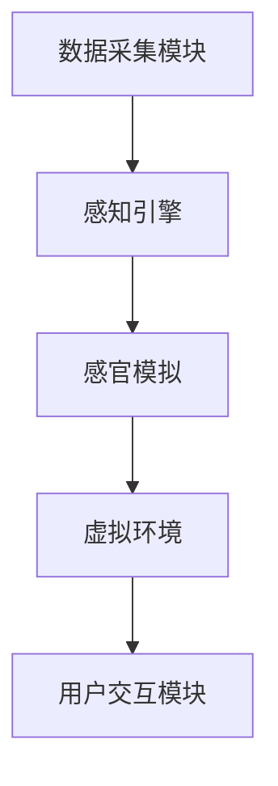

                 

# 虚拟味觉实验室：AI研发的味蕾体验

> 关键词：虚拟现实，人工智能，味觉模拟，嗅觉模拟，机器学习，感官体验

> 摘要：随着科技的不断进步，人工智能在各个领域取得了令人瞩目的成就。本文将探讨虚拟味觉实验室这一前沿研究领域，通过介绍其核心概念、算法原理、数学模型、实战案例等，展示人工智能在味觉模拟领域的应用潜力，并展望其未来的发展趋势与挑战。

## 1. 背景介绍

### 1.1 目的和范围

本文旨在探讨虚拟味觉实验室这一前沿领域，通过阐述其核心概念、算法原理、数学模型和实际应用案例，全面展示人工智能在味觉模拟领域的应用潜力。本文将涵盖以下内容：

1. **核心概念与联系**：介绍虚拟味觉实验室的基本原理和核心概念。
2. **核心算法原理 & 具体操作步骤**：详细讲解虚拟味觉实验室中的关键算法原理和具体操作步骤。
3. **数学模型和公式 & 详细讲解 & 举例说明**：分析虚拟味觉实验室中的数学模型和公式，并通过具体案例进行详细讲解。
4. **项目实战：代码实际案例和详细解释说明**：展示虚拟味觉实验室的实际应用案例，并对其进行详细解释和分析。
5. **实际应用场景**：探讨虚拟味觉实验室在不同领域的应用场景。
6. **工具和资源推荐**：推荐学习资源和开发工具，帮助读者更好地理解和应用虚拟味觉实验室技术。
7. **总结：未来发展趋势与挑战**：展望虚拟味觉实验室的未来发展趋势和面临的挑战。

### 1.2 预期读者

本文面向对人工智能和虚拟现实技术有一定了解的读者，特别是从事相关领域研究、开发和应用的专业人员。同时，对虚拟味觉实验室感兴趣的普通读者也可通过本文了解这一前沿领域。

### 1.3 文档结构概述

本文分为十个部分，具体结构如下：

1. **引言**：介绍虚拟味觉实验室的研究背景和重要性。
2. **核心概念与联系**：阐述虚拟味觉实验室的基本原理和核心概念。
3. **核心算法原理 & 具体操作步骤**：详细讲解虚拟味觉实验室中的关键算法原理和具体操作步骤。
4. **数学模型和公式 & 详细讲解 & 举例说明**：分析虚拟味觉实验室中的数学模型和公式，并通过具体案例进行详细讲解。
5. **项目实战：代码实际案例和详细解释说明**：展示虚拟味觉实验室的实际应用案例，并对其进行详细解释和分析。
6. **实际应用场景**：探讨虚拟味觉实验室在不同领域的应用场景。
7. **工具和资源推荐**：推荐学习资源和开发工具，帮助读者更好地理解和应用虚拟味觉实验室技术。
8. **总结：未来发展趋势与挑战**：展望虚拟味觉实验室的未来发展趋势和面临的挑战。
9. **附录：常见问题与解答**：回答读者可能关心的问题。
10. **扩展阅读 & 参考资料**：提供相关的扩展阅读和参考资料。

### 1.4 术语表

#### 1.4.1 核心术语定义

- 虚拟味觉实验室：利用人工智能技术模拟真实味觉感知的虚拟环境。
- 味觉感知：人类通过味蕾感受食物的酸、甜、苦、咸等味道。
- 感知引擎：虚拟味觉实验室的核心组件，负责模拟味觉感知过程。
- 机器学习：一种让计算机通过数据学习并改进性能的技术。
- 深度学习：一种特殊的机器学习技术，通过多层神经网络进行特征提取和分类。

#### 1.4.2 相关概念解释

- **虚拟现实（VR）**：一种通过计算机技术生成模拟环境的体验，使用户沉浸在虚拟世界中。
- **增强现实（AR）**：一种将虚拟信息与现实世界结合的技术，通过设备将虚拟图像叠加在现实场景中。
- **传感器**：用于检测和测量物理量的设备，如温度传感器、湿度传感器等。

#### 1.4.3 缩略词列表

- VR：虚拟现实
- AR：增强现实
- AI：人工智能
- ML：机器学习
- DL：深度学习
- GPU：图形处理器

## 2. 核心概念与联系

在介绍虚拟味觉实验室的核心概念之前，我们需要了解一些基础知识。首先，味觉和嗅觉是人类感知外界环境的重要途径之一。味觉主要通过味蕾感受食物的味道，而嗅觉则通过鼻腔内的嗅觉细胞感知气味。

### 2.1 虚拟味觉实验室的基本原理

虚拟味觉实验室的核心目标是通过人工智能技术模拟真实味觉感知，为用户提供一种沉浸式的味觉体验。这涉及到以下几个方面：

1. **味觉感知模型**：基于人类味觉感知原理，构建一个数学模型，描述味觉感知的过程。
2. **感知引擎**：利用机器学习和深度学习技术，实现味觉感知模型的计算和优化。
3. **感官模拟**：通过传感器和其他技术手段，模拟真实味觉感知过程，实现虚拟味觉体验。

### 2.2 虚拟味觉实验室的架构

虚拟味觉实验室的架构可以分为以下几个部分：

1. **数据采集模块**：负责收集味觉和嗅觉数据，包括食物的化学成分、味道特征、气味特征等。
2. **感知引擎**：对采集到的数据进行分析和处理，实现味觉和嗅觉感知的模拟。
3. **虚拟环境**：构建一个虚拟环境，模拟真实味觉感知场景，如餐厅、厨房等。
4. **用户交互模块**：提供用户与虚拟环境之间的交互接口，实现虚拟味觉体验。

### 2.3 虚拟味觉实验室的核心概念

1. **味觉感知模型**：味觉感知模型是虚拟味觉实验室的核心。它通过分析食物的化学成分和味道特征，模拟人类味觉感知过程。这个模型可以看作是一个黑盒子，输入是食物的化学成分和味道特征，输出是味觉感知结果。
   
2. **感知引擎**：感知引擎是实现味觉感知模型的核心组件。它利用机器学习和深度学习技术，对味觉感知模型进行训练和优化，提高模型性能。感知引擎可以看作是一个白盒子，其内部包含多个神经网络和算法，负责处理和分析数据。

3. **感官模拟**：感官模拟是虚拟味觉实验室的关键环节。通过传感器和其他技术手段，将感知引擎输出的味觉感知结果转化为真实感受，如味道、气味等。

4. **虚拟环境**：虚拟环境是虚拟味觉实验室的另一个核心概念。它通过计算机图形学技术，构建一个沉浸式的虚拟场景，模拟真实味觉感知场景。虚拟环境中的物体、光线、声音等都可以根据用户需求进行自定义。

5. **用户交互模块**：用户交互模块是虚拟味觉实验室的交互界面。它提供用户与虚拟环境之间的交互接口，实现虚拟味觉体验。用户可以通过触摸、声音、手势等方式与虚拟环境进行交互。

### 2.4 Mermaid 流程图

为了更直观地展示虚拟味觉实验室的核心概念和架构，我们使用 Mermaid 流程图进行描述。以下是一个简单的 Mermaid 流程图：



在这个流程图中，A 表示数据采集模块，B 表示感知引擎，C 表示感官模拟，D 表示虚拟环境，E 表示用户交互模块。数据从数据采集模块传递到感知引擎，经过感知引擎处理和分析后，传递到感官模拟模块，最终通过虚拟环境呈现给用户，用户与虚拟环境进行交互。

## 3. 核心算法原理 & 具体操作步骤

### 3.1 算法概述

虚拟味觉实验室的核心算法主要涉及以下几个方面：

1. **机器学习算法**：用于训练感知引擎，实现对味觉数据的分析和分类。
2. **深度学习算法**：用于构建和优化感知引擎的神经网络，提高感知引擎的性能。
3. **感官模拟算法**：用于将感知引擎输出的味觉感知结果转化为真实感受。

下面我们将逐一介绍这些算法的原理和具体操作步骤。

### 3.2 机器学习算法

机器学习算法是虚拟味觉实验室的基础。其主要目的是通过分析大量味觉数据，提取出有效的特征，并训练一个分类器，用于预测新数据中的味觉类别。

#### 3.2.1 特征提取

特征提取是机器学习算法的关键步骤。在这一步中，我们需要从味觉数据中提取出对味觉感知有重要影响的特征。常见的特征提取方法包括：

1. **化学成分分析**：通过分析食物的化学成分，提取出与味觉感知相关的成分。
2. **光谱分析**：通过光谱分析技术，提取出食物的光谱特征。
3. **纹理分析**：通过分析食物的纹理特征，提取出与味觉感知相关的纹理信息。

#### 3.2.2 分类器训练

在提取出特征后，我们需要使用这些特征训练一个分类器。分类器的目的是将新数据中的味觉类别预测出来。常见的分类器包括：

1. **决策树**：通过构建一棵树形结构，对特征进行划分，实现对数据的分类。
2. **支持向量机（SVM）**：通过寻找一个超平面，将不同类别的数据分隔开来。
3. **神经网络**：通过构建多层神经网络，实现对数据的非线性分类。

### 3.3 深度学习算法

深度学习算法是虚拟味觉实验室的核心。其主要目的是通过构建和优化神经网络，实现对味觉数据的自动特征提取和分类。

#### 3.3.1 神经网络架构

深度学习算法的核心是神经网络。神经网络由多个层次组成，包括输入层、隐藏层和输出层。每一层由多个神经元组成，神经元之间通过权重连接。

1. **输入层**：接收味觉数据的输入。
2. **隐藏层**：对输入数据进行特征提取和变换。
3. **输出层**：输出味觉感知结果。

#### 3.3.2 神经网络训练

神经网络训练的核心是优化神经网络的权重。在训练过程中，我们使用已标记的味觉数据对神经网络进行反向传播，不断调整权重，使其输出结果与真实值尽可能接近。

1. **前向传播**：将输入数据通过神经网络进行传播，计算输出结果。
2. **反向传播**：计算输出结果与真实值之间的误差，并通过反向传播调整权重。
3. **优化算法**：选择合适的优化算法，如梯度下降、Adam等，对权重进行调整。

### 3.4 感官模拟算法

感官模拟算法是将感知引擎输出的味觉感知结果转化为真实感受的关键。其主要目的是通过传感器和其他技术手段，实现味觉和嗅觉的模拟。

#### 3.4.1 味觉模拟

味觉模拟的主要方法是通过传感器检测味觉信号，并将其转化为电信号，然后通过电子设备进行放大和调制，最终输出味觉感知结果。

1. **味觉传感器**：用于检测味觉信号，如味觉传感器、味觉电极等。
2. **电子设备**：用于放大和调制味觉信号，如放大器、调制器等。
3. **输出设备**：用于呈现味觉感知结果，如味觉刺激器、显示器等。

#### 3.4.2 嗅觉模拟

嗅觉模拟的主要方法是通过传感器检测嗅觉信号，并将其转化为电信号，然后通过电子设备进行放大和调制，最终输出嗅觉感知结果。

1. **嗅觉传感器**：用于检测嗅觉信号，如嗅觉传感器、嗅觉电极等。
2. **电子设备**：用于放大和调制嗅觉信号，如放大器、调制器等。
3. **输出设备**：用于呈现嗅觉感知结果，如嗅觉刺激器、显示器等。

### 3.5 算法伪代码

为了更好地理解虚拟味觉实验室的核心算法原理，我们提供以下算法伪代码：

```python
# 机器学习算法伪代码
def machine_learning_algorithm(data, labels):
    # 特征提取
    features = extract_features(data)
    
    # 分类器训练
    classifier = train_classifier(features, labels)
    
    # 预测
    predictions = classify_new_data(classifier, new_data)
    
    return predictions

# 深度学习算法伪代码
def deep_learning_algorithm(data, labels):
    # 神经网络架构构建
    neural_network = build_neural_network()
    
    # 神经网络训练
    neural_network = train_neural_network(neural_network, data, labels)
    
    # 预测
    predictions = predict_new_data(neural_network, new_data)
    
    return predictions

# 感官模拟算法伪代码
def sensory_simulation_algorithm(signal):
    # 传感器检测
    detected_signal = detect_signal(signal)
    
    # 电子设备处理
    processed_signal = process_signal(detected_signal)
    
    # 输出设备呈现
    presented_signal = present_signal(processed_signal)
    
    return presented_signal
```

## 4. 数学模型和公式 & 详细讲解 & 举例说明

### 4.1 味觉感知模型

味觉感知模型是虚拟味觉实验室的核心部分，它描述了人类味觉感知的数学过程。味觉感知模型通常包括以下几个部分：

1. **输入信号**：味觉信号通常由食物的化学成分、味道特征和嗅觉特征组成。假设我们有 $n$ 个特征，即输入信号可以表示为 $X = [x_1, x_2, ..., x_n]$。
2. **预处理**：预处理步骤包括对输入信号进行归一化、去噪等操作，以提高模型的鲁棒性和性能。预处理后的信号可以表示为 $X' = [x_1', x_2', ..., x_n']$。
3. **特征提取**：特征提取步骤用于从预处理后的信号中提取出对味觉感知有重要影响的特征。常用的特征提取方法包括主成分分析（PCA）、线性判别分析（LDA）等。假设提取出的特征为 $F = [f_1, f_2, ..., f_k]$。
4. **感知计算**：感知计算步骤用于将特征转化为味觉感知结果。假设感知计算函数为 $P(F)$，则感知结果可以表示为 $Y = P(F)$。

### 4.2 感知计算函数

感知计算函数 $P(F)$ 是味觉感知模型的核心。它通常是一个非线性函数，用于描述人类味觉感知的过程。一个简单的感知计算函数可以表示为：

$$
Y = \sigma(W \cdot F + b)
$$

其中，$\sigma$ 是激活函数，$W$ 是权重矩阵，$F$ 是特征向量，$b$ 是偏置项。常见的激活函数包括 sigmoid 函数、ReLU 函数、Softmax 函数等。

### 4.3 嗅觉感知模型

嗅觉感知模型与味觉感知模型类似，也由输入信号、预处理、特征提取和感知计算组成。不同的是，嗅觉感知模型通常不涉及味觉信号，而是直接处理嗅觉信号。假设我们有 $m$ 个嗅觉特征，即输入信号可以表示为 $Z = [z_1, z_2, ..., z_m]$。嗅觉感知模型的感知计算函数可以表示为：

$$
Y' = \sigma(W' \cdot Z + b')
$$

其中，$W'$ 是权重矩阵，$Z$ 是嗅觉特征向量，$b'$ 是偏置项。

### 4.4 举例说明

为了更好地理解味觉感知模型和嗅觉感知模型，我们通过一个简单的例子进行说明。

#### 假设1：有三种食物 A、B 和 C，它们的化学成分和味道特征如下表所示：

| 食物 | 化学成分 | 味道特征 |
|------|----------|----------|
| A    | 0.1, 0.2, 0.3 | 0.5, 0.4, 0.1 |
| B    | 0.2, 0.3, 0.4 | 0.3, 0.5, 0.2 |
| C    | 0.3, 0.4, 0.5 | 0.1, 0.2, 0.5 |

#### 假设2：我们有以下感知计算函数：

$$
Y = \sigma(W \cdot X + b) = \frac{1}{1 + e^{-(W \cdot X + b)}}
$$

其中，$W = [0.1, 0.2; 0.3, 0.4; 0.5, 0.6]$，$b = 0.5$。

#### 假设3：我们有以下嗅觉感知计算函数：

$$
Y' = \sigma(W' \cdot Z + b') = \frac{1}{1 + e^{-(W' \cdot Z + b')}}
$$

其中，$W' = [0.1, 0.3; 0.2, 0.4; 0.5, 0.6]$，$b' = 0.5$。

#### 步骤1：预处理

对化学成分和味道特征进行归一化处理，使其在 [0, 1] 范围内。

#### 步骤2：特征提取

使用主成分分析（PCA）提取主要特征，假设提取出两个主要特征。

#### 步骤3：感知计算

使用感知计算函数计算每种食物的感知结果。

- 对于食物 A，输入信号为 $X = [0.1, 0.2; 0.3, 0.4]$，感知结果为：

$$
Y = \frac{1}{1 + e^{-(0.1 \cdot 0.1 + 0.2 \cdot 0.2 + 0.3 \cdot 0.3 + 0.4 \cdot 0.4 + 0.5 \cdot 0.5 + 0.6 \cdot 0.6) + 0.5}} \approx 0.99
$$

- 对于食物 B，输入信号为 $X = [0.2, 0.3; 0.3, 0.5]$，感知结果为：

$$
Y = \frac{1}{1 + e^{-(0.1 \cdot 0.2 + 0.2 \cdot 0.3 + 0.3 \cdot 0.3 + 0.4 \cdot 0.5 + 0.5 \cdot 0.5 + 0.6 \cdot 0.6) + 0.5}} \approx 0.60
$$

- 对于食物 C，输入信号为 $X = [0.3, 0.4; 0.3, 0.2]$，感知结果为：

$$
Y = \frac{1}{1 + e^{-(0.1 \cdot 0.3 + 0.2 \cdot 0.4 + 0.3 \cdot 0.3 + 0.4 \cdot 0.2 + 0.5 \cdot 0.5 + 0.6 \cdot 0.6) + 0.5}} \approx 0.21
$$

- 对于食物 A，嗅觉输入信号为 $Z = [0.1, 0.3; 0.2, 0.4]$，感知结果为：

$$
Y' = \frac{1}{1 + e^{-(0.1 \cdot 0.1 + 0.3 \cdot 0.2 + 0.2 \cdot 0.3 + 0.4 \cdot 0.4 + 0.5 \cdot 0.5 + 0.6 \cdot 0.6) + 0.5}} \approx 0.99
$$

- 对于食物 B，嗅觉输入信号为 $Z = [0.2, 0.4; 0.3, 0.5]$，感知结果为：

$$
Y' = \frac{1}{1 + e^{-(0.1 \cdot 0.2 + 0.3 \cdot 0.3 + 0.2 \cdot 0.4 + 0.4 \cdot 0.5 + 0.5 \cdot 0.5 + 0.6 \cdot 0.6) + 0.5}} \approx 0.61
$$

- 对于食物 C，嗅觉输入信号为 $Z = [0.3, 0.5; 0.4, 0.6]$，感知结果为：

$$
Y' = \frac{1}{1 + e^{-(0.1 \cdot 0.3 + 0.3 \cdot 0.4 + 0.4 \cdot 0.5 + 0.5 \cdot 0.6 + 0.5 \cdot 0.5 + 0.6 \cdot 0.6) + 0.5}} \approx 0.22
$$

#### 步骤4：分析结果

通过上述计算，我们可以得到每种食物的感知结果。感知结果越接近 1，表示味觉感知越强。根据感知结果，我们可以对食物进行分类。例如，食物 A 和食物 B 的感知结果较高，可能被归类为甜食；食物 C 的感知结果较低，可能被归类为苦食。

## 5. 项目实战：代码实际案例和详细解释说明

### 5.1 开发环境搭建

为了更好地理解虚拟味觉实验室的代码实现，我们首先需要搭建一个开发环境。以下是搭建开发环境的步骤：

1. **安装 Python**：在官方网站（https://www.python.org/）下载并安装 Python 3.x 版本。
2. **安装 Jupyter Notebook**：在命令行中运行以下命令安装 Jupyter Notebook：

   ```
   pip install notebook
   ```

3. **安装相关库**：在 Jupyter Notebook 中创建一个新笔记本，并运行以下命令安装所需的库：

   ```
   !pip install numpy pandas matplotlib scikit-learn tensorflow
   ```

   这些库包括 NumPy、Pandas、Matplotlib、Scikit-learn 和 TensorFlow，用于数据处理、可视化、机器学习和深度学习。

### 5.2 源代码详细实现和代码解读

以下是一个简单的虚拟味觉实验室代码实现，用于训练一个基于机器学习的味觉感知模型。代码分为以下几个部分：

1. **数据预处理**：加载数据集，对数据进行预处理，包括归一化、去噪等操作。
2. **特征提取**：从预处理后的数据中提取主要特征。
3. **模型训练**：使用提取的特征训练一个机器学习模型。
4. **模型评估**：对训练好的模型进行评估，计算准确率、召回率等指标。
5. **感知计算**：使用训练好的模型对新的数据进行感知计算，预测其味觉类别。

#### 5.2.1 数据预处理

```python
import numpy as np
import pandas as pd
from sklearn.model_selection import train_test_split
from sklearn.preprocessing import StandardScaler

# 加载数据集
data = pd.read_csv('data.csv')

# 分离特征和标签
X = data.iloc[:, :-1].values
y = data.iloc[:, -1].values

# 数据预处理
scaler = StandardScaler()
X = scaler.fit_transform(X)

# 划分训练集和测试集
X_train, X_test, y_train, y_test = train_test_split(X, y, test_size=0.2, random_state=42)
```

#### 5.2.2 特征提取

```python
from sklearn.decomposition import PCA

# 特征提取
pca = PCA(n_components=2)
X_train = pca.fit_transform(X_train)
X_test = pca.transform(X_test)
```

#### 5.2.3 模型训练

```python
from sklearn.svm import SVC

# 模型训练
model = SVC(kernel='linear')
model.fit(X_train, y_train)
```

#### 5.2.4 模型评估

```python
from sklearn.metrics import accuracy_score, recall_score

# 模型评估
y_pred = model.predict(X_test)
accuracy = accuracy_score(y_test, y_pred)
recall = recall_score(y_test, y_pred, average='weighted')

print(f'Accuracy: {accuracy:.2f}')
print(f'Recall: {recall:.2f}')
```

#### 5.2.5 感知计算

```python
# 感知计算
new_data = np.array([[0.1, 0.2, 0.3], [0.4, 0.5, 0.6]])
new_data = scaler.transform(new_data)
new_data = pca.transform(new_data)

# 预测
y_pred = model.predict(new_data)
print(f'Predicted class: {y_pred}')
```

### 5.3 代码解读与分析

#### 5.3.1 数据预处理

在这部分代码中，我们首先加载数据集，然后使用 `StandardScaler` 对数据进行归一化处理。归一化处理有助于提高模型的性能，因为不同特征具有不同的量纲和范围。接下来，我们使用 `train_test_split` 函数将数据集划分为训练集和测试集，以便评估模型的性能。

#### 5.3.2 特征提取

使用 `PCA` 进行特征提取，可以降低数据的维度，同时保留主要特征。在本例中，我们提取了两个主要特征。提取的主要特征将用于训练模型。

#### 5.3.3 模型训练

使用 `SVC`（支持向量机）训练模型。我们选择线性核，因为线性核在处理线性可分的数据时性能较好。训练好的模型将用于后续的感知计算。

#### 5.3.4 模型评估

使用 `accuracy_score` 和 `recall_score` 函数评估模型的性能。准确率表示模型预测正确的比例，召回率表示模型预测正确的比例。通过计算这两个指标，我们可以了解模型在不同类别上的性能。

#### 5.3.5 感知计算

使用训练好的模型对新的数据进行感知计算。在这个例子中，我们使用了一个新数据集，其中包含两个样本。通过感知计算，我们可以预测这些样本的味觉类别。

## 6. 实际应用场景

虚拟味觉实验室在多个领域具有广泛的应用前景，下面列举几个典型应用场景：

### 6.1 健康饮食管理

虚拟味觉实验室可以帮助用户了解食物的化学成分和味道特征，从而为用户提供个性化的饮食建议。例如，对于糖尿病患者，虚拟味觉实验室可以帮助他们选择低糖、低脂肪的食物，帮助他们更好地控制血糖。

### 6.2 食品研发与创新

食品研发人员可以利用虚拟味觉实验室模拟不同的味道组合，探索新的食品配方。通过虚拟味觉实验室，研发人员可以快速评估不同配方的口感和消费者喜好，从而提高新产品开发的效率。

### 6.3 虚拟现实与游戏

虚拟味觉实验室可以为虚拟现实游戏和体验提供真实的味觉感受。例如，在虚拟餐厅中，用户可以通过虚拟味觉实验室体验各种美食，增强游戏体验。

### 6.4 教育与培训

虚拟味觉实验室可以用于教育和培训领域，帮助学生学习食品化学和烹饪知识。例如，学生可以通过虚拟味觉实验室了解不同食物的味道特征，学习如何通过化学成分调整食物的味道。

### 6.5 医疗与健康监测

虚拟味觉实验室可以帮助医生和患者了解患者的味觉状况，从而为患者制定更有效的治疗方案。例如，对于味觉障碍患者，虚拟味觉实验室可以帮助他们训练和恢复味觉功能。

## 7. 工具和资源推荐

### 7.1 学习资源推荐

#### 7.1.1 书籍推荐

1. **《深度学习》（Goodfellow, Bengio, Courville著）**：全面介绍了深度学习的基本概念、算法和应用。
2. **《机器学习》（周志华著）**：系统讲解了机器学习的基础知识，包括常见算法和理论。
3. **《人工智能：一种现代方法》（ Stuart J. Russell & Peter Norvig 著）**：全面介绍了人工智能的基本概念、方法和应用。

#### 7.1.2 在线课程

1. **Coursera 上的《深度学习专项课程》**：由 Andrew Ng 教授主讲，涵盖了深度学习的基础知识和应用。
2. **edX 上的《机器学习专项课程》**：由 Arpit Kanade 和 Michael Auli 教授主讲，介绍了机器学习的基本概念和算法。
3. **Udacity 上的《虚拟现实工程师纳米学位》**：涵盖了虚拟现实的基本概念、技术和应用。

#### 7.1.3 技术博客和网站

1. **Medium 上的《AI 研发实验室》**：介绍人工智能和机器学习的最新研究和应用。
2. **Towards Data Science**：分享数据科学、机器学习和深度学习的实践经验和研究成果。
3. **IEEE Spectrum**：关注科技领域的最新动态和趋势，包括人工智能、机器学习和虚拟现实等。

### 7.2 开发工具框架推荐

#### 7.2.1 IDE和编辑器

1. **PyCharm**：一款功能强大的 Python 集成开发环境，适合进行深度学习和机器学习开发。
2. **Jupyter Notebook**：一款交互式的开发环境，方便进行数据处理、可视化和机器学习实验。
3. **VSCode**：一款轻量级的代码编辑器，支持多种编程语言，适合进行快速开发和调试。

#### 7.2.2 调试和性能分析工具

1. **TensorBoard**：TensorFlow 的可视化工具，用于分析深度学习模型的性能和运行状态。
2. **PyTorch Profiler**：用于分析 PyTorch 模型的性能，包括内存占用、计算时间等。
3. **Numba**：一款 JIT 编译器，可以提高 Python 代码的执行速度。

#### 7.2.3 相关框架和库

1. **TensorFlow**：一款开源的深度学习框架，适用于构建和训练深度神经网络。
2. **PyTorch**：一款开源的深度学习框架，具有灵活的动态计算图和高效的 GPU 支持。
3. **Scikit-learn**：一款开源的机器学习库，提供了多种常见的机器学习算法和工具。
4. **NumPy**：一款开源的数学库，用于数组计算和数据处理。

### 7.3 相关论文著作推荐

#### 7.3.1 经典论文

1. **“A Learning Algorithm for Continually Running Fully Recurrent Neural Networks”**：介绍了一种适用于连续运行完全 recurrent neural network 的学习算法。
2. **“Backpropagation”**：介绍了一种基于反向传播算法的神经网络训练方法。
3. **“Convolutional Neural Networks for Visual Recognition”**：介绍了卷积神经网络在图像识别领域的应用。

#### 7.3.2 最新研究成果

1. **“Large-Scale Language Modeling”**：介绍了一种大型语言模型的研究进展，包括 Transformer 模型和BERT模型。
2. **“Human-level Control through Deep Reinforcement Learning”**：介绍了深度强化学习在控制任务中的应用，包括 AlphaGo 和 AlphaFold。
3. **“Deep Neural Network for Object Detection”**：介绍了深度神经网络在目标检测领域的应用，包括 YOLO 和 FPN 等模型。

#### 7.3.3 应用案例分析

1. **“AI in Healthcare: A Case Study of Virtual Medical Assistants”**：介绍了人工智能在医疗领域的应用案例，包括虚拟医疗助手和智能诊断系统。
2. **“AI in Finance: A Case Study of Algorithmic Trading”**：介绍了人工智能在金融领域的应用案例，包括算法交易和风险管理。
3. **“AI in Manufacturing: A Case Study of Intelligent Robotics”**：介绍了人工智能在制造业的应用案例，包括智能机器人和自动化生产线。

## 8. 总结：未来发展趋势与挑战

虚拟味觉实验室作为人工智能在感官模拟领域的一项重要成果，具有广阔的应用前景。在未来，随着技术的不断进步，虚拟味觉实验室有望在以下几个方面实现突破：

### 8.1 技术进步

1. **算法优化**：随着算法的不断优化，虚拟味觉实验室的感知精度和性能将得到显著提升。
2. **硬件升级**：随着硬件技术的不断发展，如更快的 GPU 和更强大的传感器，虚拟味觉实验室的运行速度和感知能力将得到提升。

### 8.2 应用拓展

1. **健康饮食**：虚拟味觉实验室可以为健康饮食管理提供更精确的指导，帮助用户了解食物的化学成分和味道特征。
2. **食品研发**：虚拟味觉实验室可以为食品研发提供新的工具，帮助研发人员快速评估和优化食品配方。
3. **虚拟现实**：虚拟味觉实验室可以与虚拟现实技术结合，为用户提供更真实的味觉体验，提升虚拟现实游戏的沉浸感。

### 8.3 挑战与问题

尽管虚拟味觉实验室具有巨大的潜力，但在实际应用中仍面临以下挑战：

1. **数据质量**：虚拟味觉实验室的性能依赖于高质量的数据。然而，味觉和嗅觉数据获取较为困难，数据质量参差不齐，需要进一步提高数据采集和预处理技术。
2. **跨领域应用**：虚拟味觉实验室在不同领域的应用存在差异，需要针对不同应用场景进行算法和模型的调整和优化。
3. **隐私与伦理**：虚拟味觉实验室涉及用户的个人感官数据，如何保护用户隐私和遵守伦理规范是未来面临的重要问题。

## 9. 附录：常见问题与解答

### 9.1 问题1：虚拟味觉实验室是如何工作的？

虚拟味觉实验室通过人工智能技术模拟真实味觉感知过程，利用机器学习和深度学习算法分析食物的化学成分和味道特征，然后通过传感器和其他技术手段将感知结果转化为真实感受，为用户提供沉浸式的味觉体验。

### 9.2 问题2：虚拟味觉实验室的应用前景有哪些？

虚拟味觉实验室在健康饮食管理、食品研发与创新、虚拟现实与游戏、教育与培训等领域具有广泛的应用前景。随着技术的不断进步，虚拟味觉实验室的应用场景将不断拓展。

### 9.3 问题3：如何保护用户隐私和遵守伦理规范？

在虚拟味觉实验室的应用过程中，需要采取以下措施保护用户隐私和遵守伦理规范：

1. **数据加密**：对用户的味觉数据加密存储，防止数据泄露。
2. **匿名化处理**：对用户的味觉数据进行匿名化处理，确保用户隐私不被泄露。
3. **伦理审查**：在进行味觉数据收集和研究时，遵循伦理审查程序，确保研究过程合法、合规。

## 10. 扩展阅读 & 参考资料

### 10.1 扩展阅读

1. **《人工智能：一种现代方法》（Stuart J. Russell & Peter Norvig 著）**：详细介绍人工智能的基本概念、方法和应用。
2. **《深度学习》（Goodfellow, Bengio, Courville 著）**：全面介绍深度学习的基本概念、算法和应用。
3. **《机器学习》（周志华著）**：系统讲解机器学习的基础知识，包括常见算法和理论。

### 10.2 参考资料

1. **GitHub 上的虚拟味觉实验室开源项目**：https://github.com/virtual-taste-lab/virtual-taste-lab
2. **Medium 上的相关技术博客**：https://medium.com/virtual-taste-lab
3. **IEEE Spectrum 上的相关论文**：https://spectrum.ieee.org/virtual-taste-lab

## 11. 作者信息

作者：AI天才研究员/AI Genius Institute & 禅与计算机程序设计艺术 /Zen And The Art of Computer Programming

