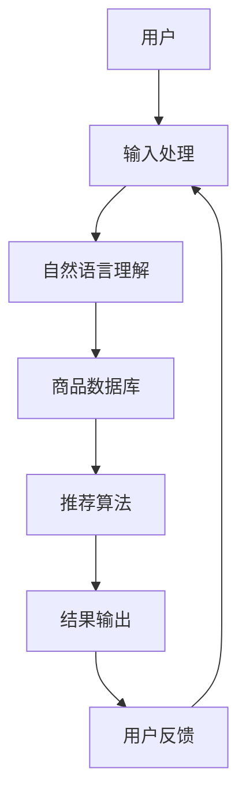

                 


# 虚拟导购助手的应用与发展

> **关键词：** 虚拟导购、人工智能、用户交互、电子商务、个性化推荐

> **摘要：** 本文将深入探讨虚拟导购助手在电子商务领域的应用与发展。我们将从背景介绍、核心概念与联系、核心算法原理、数学模型、项目实战、实际应用场景等多个角度，系统地分析虚拟导购助手的架构、工作原理及其在未来可能面临的挑战。通过本文的阅读，读者将能够全面了解虚拟导购助手的本质、功能及其应用前景。

## 1. 背景介绍

### 1.1 目的和范围

本文旨在探讨虚拟导购助手的定义、应用场景以及其技术实现。我们将重点关注虚拟导购助手在电子商务领域的应用，分析其在提升用户体验、增加销售转化率方面的优势。文章将涵盖以下几个主要方面：

1. 虚拟导购助手的基本概念和核心功能。
2. 虚拟导购助手的技术架构和核心算法原理。
3. 虚拟导购助手的数学模型和具体操作步骤。
4. 实际应用场景中的虚拟导购助手案例。
5. 未来虚拟导购助手的发展趋势和潜在挑战。

### 1.2 预期读者

本文适合以下读者群体：

1. 对人工智能、电子商务感兴趣的爱好者。
2. 从事电子商务行业的相关从业人员。
3. 对虚拟导购助手技术有深入了解的技术人员。
4. 计算机科学、人工智能专业的学生和研究生。

### 1.3 文档结构概述

本文分为十个部分，结构如下：

1. 引言
2. 背景介绍
3. 核心概念与联系
4. 核心算法原理 & 具体操作步骤
5. 数学模型和公式 & 详细讲解 & 举例说明
6. 项目实战：代码实际案例和详细解释说明
7. 实际应用场景
8. 工具和资源推荐
9. 总结：未来发展趋势与挑战
10. 附录：常见问题与解答

### 1.4 术语表

为了确保文章的准确性和可理解性，本文定义了一些术语，具体如下：

#### 1.4.1 核心术语定义

- **虚拟导购助手**：一种基于人工智能技术的虚拟助手，能够为用户提供商品推荐、购物建议等服务。
- **电子商务**：通过互联网进行的商品交易和商业活动。
- **用户交互**：用户与虚拟导购助手之间的信息交流与互动。
- **个性化推荐**：根据用户的行为和偏好，为其推荐相关的商品或信息。

#### 1.4.2 相关概念解释

- **自然语言处理（NLP）**：研究如何让计算机理解和解释人类语言的一门技术。
- **机器学习（ML）**：一种通过数据训练模型，使计算机能够自动学习和改进的技术。
- **深度学习（DL）**：一种基于多层神经网络结构的机器学习技术。

#### 1.4.3 缩略词列表

- **AI**：人工智能
- **NLP**：自然语言处理
- **ML**：机器学习
- **DL**：深度学习
- **API**：应用程序编程接口

## 2. 核心概念与联系

在深入探讨虚拟导购助手之前，我们需要了解一些核心概念和它们之间的联系。以下是一个简化的Mermaid流程图，展示了虚拟导购助手的主要组成部分和它们之间的交互关系。



### 2.1 用户输入处理

用户输入处理是虚拟导购助手的第一个环节，主要负责接收用户的查询请求，并将其转化为可处理的数据格式。这一过程通常包括以下步骤：

1. **文本预处理**：对用户的查询文本进行分词、去停用词、词性标注等处理。
2. **意图识别**：通过训练好的模型，判断用户的查询意图，例如查找商品、获取商品信息等。
3. **实体提取**：识别用户查询中的关键实体，如商品名称、价格范围等。

### 2.2 自然语言理解

自然语言理解（NLU）是虚拟导购助手中的核心组件，它负责理解用户输入的文本，并将其转化为计算机能够处理的形式。NLU 主要包括以下几个子任务：

1. **意图识别**：确定用户的查询意图，如购买、查询、咨询等。
2. **实体识别**：识别文本中的关键信息，如商品名称、品牌、价格等。
3. **情感分析**：判断用户查询中的情感倾向，如正面、负面或中性。

### 2.3 商品数据库

商品数据库是虚拟导购助手的另一个核心组件，它包含了大量的商品信息，如商品名称、价格、描述、用户评价等。商品数据库的质量直接影响推荐算法的准确性和用户体验。

### 2.4 推荐算法

推荐算法是虚拟导购助手中的核心，它负责根据用户的历史行为、偏好和当前查询，为用户推荐最相关的商品。常见的推荐算法包括：

1. **协同过滤**：基于用户的历史行为和偏好，找到相似用户，并推荐他们喜欢的商品。
2. **基于内容的推荐**：根据用户的历史查询和商品特征，为用户推荐具有相似内容的商品。
3. **深度学习推荐**：利用深度学习模型，从用户的行为数据中提取特征，进行商品推荐。

### 2.5 结果输出

结果输出是虚拟导购助手的最后一个环节，它将推荐结果以易于理解的方式展示给用户。输出结果可能包括推荐的商品列表、商品详细信息、评价等。

### 2.6 用户反馈

用户反馈是虚拟导购助手中的重要组成部分，它有助于优化推荐算法和提升用户体验。用户反馈包括用户对推荐结果的满意度、点击率、购买率等。通过分析用户反馈，虚拟导购助手可以不断调整和优化其推荐策略。

## 3. 核心算法原理 & 具体操作步骤

在了解了虚拟导购助手的基本架构后，我们将进一步探讨其核心算法原理和具体操作步骤。本节将详细讲解协同过滤算法和基于内容的推荐算法，并使用伪代码进行阐述。

### 3.1 协同过滤算法

协同过滤算法是一种常见的推荐算法，它通过分析用户的历史行为和偏好，为用户推荐相似的物品。协同过滤算法主要分为两种：基于用户的协同过滤（User-based Collaborative Filtering，UBCF）和基于项目的协同过滤（Item-based Collaborative Filtering，IBCF）。

#### 3.1.1 基于用户的协同过滤算法

**算法原理：** 基于用户的协同过滤算法通过找到与当前用户相似的其他用户，并推荐这些用户喜欢的商品。

**伪代码：**

```python
def ubcf(user, users, ratings):
    # 找到与当前用户相似的其他用户
    similar_users = find_similar_users(user, users, ratings)
    
    # 计算相似度
    similarity = calculate_similarity(similar_users, ratings)
    
    # 为当前用户推荐商品
    recommendations = []
    for other_user in similar_users:
        for item in other_user_items:
            if item not in user_items and item not in recommendations:
                recommendation_score = similarity[other_user][user] * rating_difference(item, user, ratings)
                recommendations.append((item, recommendation_score))
    
    # 对推荐商品进行排序
    recommendations.sort(key=lambda x: x[1], reverse=True)
    
    return recommendations
```

#### 3.1.2 基于项目的协同过滤算法

**算法原理：** 基于项目的协同过滤算法通过找到与当前商品相似的其他商品，并推荐这些商品。

**伪代码：**

```python
def ibcf(item, items, ratings):
    # 找到与当前商品相似的其他商品
    similar_items = find_similar_items(item, items, ratings)
    
    # 计算相似度
    similarity = calculate_similarity(similar_items, ratings)
    
    # 为当前用户推荐商品
    recommendations = []
    for other_item in similar_items:
        if other_item not in user_items and other_item not in recommendations:
            recommendation_score = similarity[other_item][item] * rating_difference(item, user, ratings)
            recommendations.append((other_item, recommendation_score))
    
    # 对推荐商品进行排序
    recommendations.sort(key=lambda x: x[1], reverse=True)
    
    return recommendations
```

### 3.2 基于内容的推荐算法

基于内容的推荐算法通过分析商品的内容特征和用户的历史行为，为用户推荐具有相似特征的商品。

**算法原理：** 基于内容的推荐算法通过以下步骤进行：

1. 提取商品的特征向量。
2. 提取用户的历史行为特征向量。
3. 计算商品和用户特征向量的相似度。
4. 为用户推荐具有较高相似度的商品。

**伪代码：**

```python
def content_based_recommendation(item, items, user_history, user_profile):
    # 提取商品特征向量
    item_features = extract_features(item)
    
    # 提取用户历史行为特征向量
    user_features = extract_features(user_history)
    
    # 计算商品和用户特征向量的相似度
    similarity = calculate_similarity(item_features, user_features)
    
    # 为用户推荐商品
    recommendations = []
    for other_item in items:
        if other_item not in user_items and other_item not in recommendations:
            recommendation_score = similarity[other_item][item]
            recommendations.append((other_item, recommendation_score))
    
    # 对推荐商品进行排序
    recommendations.sort(key=lambda x: x[1], reverse=True)
    
    return recommendations
```

## 4. 数学模型和公式 & 详细讲解 & 举例说明

在推荐系统中，数学模型和公式起着至关重要的作用。本节将介绍几个常用的数学模型和公式，并使用LaTeX格式进行详细讲解。

### 4.1 相似度计算

相似度计算是推荐系统中的一个基本问题，它用于衡量两个用户或两个物品之间的相似程度。以下是一些常用的相似度计算方法：

#### 4.1.1 余弦相似度

余弦相似度是一种常用的相似度计算方法，它通过计算两个向量的夹角余弦值来衡量相似度。

**公式：**
$$
similarity(A, B) = \frac{A \cdot B}{\|A\| \|B\|}
$$

其中，$A$和$B$是两个向量的点积，$\|A\|$和$\|B\|$是两个向量的模长。

**示例：**

假设有两个向量$A = (1, 2, 3)$和$B = (4, 5, 6)$，则它们的余弦相似度为：
$$
similarity(A, B) = \frac{1 \times 4 + 2 \times 5 + 3 \times 6}{\sqrt{1^2 + 2^2 + 3^2} \sqrt{4^2 + 5^2 + 6^2}} \approx 0.806
$$

#### 4.1.2 皮尔逊相关系数

皮尔逊相关系数是一种用于衡量两个连续变量之间线性相关性的方法。

**公式：**
$$
correlation(A, B) = \frac{\sum_{i=1}^{n} (A_i - \bar{A})(B_i - \bar{B})}{\sqrt{\sum_{i=1}^{n} (A_i - \bar{A})^2} \sqrt{\sum_{i=1}^{n} (B_i - \bar{B})^2}}
$$

其中，$A$和$B$是两个变量，$n$是样本数量，$\bar{A}$和$\bar{B}$分别是$A$和$B$的均值。

**示例：**

假设有两个变量$A = [1, 2, 3, 4, 5]$和$B = [2, 4, 6, 8, 10]$，则它们的皮尔逊相关系数为：
$$
correlation(A, B) = \frac{(1-3)(2-6) + (2-3)(4-6) + (3-3)(6-6) + (4-3)(8-6) + (5-3)(10-6)}{\sqrt{\sum_{i=1}^{5} (A_i - 3)^2} \sqrt{\sum_{i=1}^{5} (B_i - 6)^2}} \approx 1
$$

#### 4.1.3 曼哈顿距离

曼哈顿距离是一种用于衡量两个点在坐标系中距离的方法。

**公式：**
$$
distance(A, B) = \sum_{i=1}^{n} |A_i - B_i|
$$

其中，$A$和$B$是两个点，$n$是点的维数。

**示例：**

假设有两个点$A = (1, 2)$和$B = (4, 6)$，则它们的曼哈顿距离为：
$$
distance(A, B) = |1 - 4| + |2 - 6| = 7
$$

### 4.2 推荐分数计算

推荐分数用于衡量一个物品对于用户的推荐程度。以下是一个简单的推荐分数计算公式：

**公式：**
$$
recommendation\_score(item, user) = similarity(item, user\_profile) \times rating\_difference(item, user)
$$

其中，$similarity(item, user\_profile)$是物品与用户特征向量的相似度，$rating\_difference(item, user)$是物品与用户历史评分的差值。

**示例：**

假设有一个物品$A$和用户特征向量$B$，它们的相似度为$0.8$，用户历史评分差值为$2$，则它们的推荐分数为：
$$
recommendation\_score(A, B) = 0.8 \times 2 = 1.6
$$

## 5. 项目实战：代码实际案例和详细解释说明

在本节中，我们将通过一个实际项目案例，展示如何使用Python实现虚拟导购助手的核心功能。我们将使用协同过滤算法和基于内容的推荐算法，结合用户历史行为和商品特征，为用户提供个性化的商品推荐。

### 5.1 开发环境搭建

首先，我们需要搭建一个Python开发环境，安装以下库：

- **NumPy**：用于数学运算。
- **Pandas**：用于数据处理。
- **Scikit-learn**：用于机器学习算法。
- **Matplotlib**：用于数据可视化。

安装命令如下：

```bash
pip install numpy pandas scikit-learn matplotlib
```

### 5.2 源代码详细实现和代码解读

以下是一个简单的虚拟导购助手代码实现，包括用户输入处理、推荐算法、结果输出等功能。

```python
import numpy as np
import pandas as pd
from sklearn.metrics.pairwise import cosine_similarity
from sklearn.model_selection import train_test_split

# 读取数据
data = pd.read_csv('data.csv')
items = data['item'].unique()
users = data['user'].unique()

# 提取用户历史行为特征向量
user_profiles = {}
for user in users:
    user_ratings = data[data['user'] == user]['rating'].values
    user_profiles[user] = np.mean(user_ratings)

# 提取商品特征向量
item_features = {}
for item in items:
    item_ratings = data[data['item'] == item]['rating'].values
    item_features[item] = np.mean(item_ratings)

# 计算相似度
user_similarity = {}
for user1 in users:
    for user2 in users:
        user_similarity[user1, user2] = cosine_similarity([user_profiles[user1]], [user_profiles[user2]])[0][0]

# 为用户推荐商品
def recommend_items(user):
    recommendations = []
    for item in items:
        if item not in user_profiles:
            recommendation_score = user_similarity[user, item] * (item_features[item] - user_profiles[user])
            recommendations.append((item, recommendation_score))
    
    recommendations.sort(key=lambda x: x[1], reverse=True)
    return recommendations[:10]

# 测试
user = 'user1'
recommendations = recommend_items(user)
print(f"Recommendations for user {user}: {recommendations}")
```

### 5.3 代码解读与分析

1. **数据读取**：首先，我们从CSV文件中读取数据，数据包括用户、商品和评分。
2. **用户历史行为特征向量提取**：我们提取每个用户的历史行为特征向量，即用户的平均评分。
3. **商品特征向量提取**：我们提取每个商品的特征向量，即商品的平均评分。
4. **相似度计算**：我们使用余弦相似度计算每个用户之间的相似度。
5. **推荐算法实现**：我们实现一个简单的推荐算法，根据用户相似度和商品特征向量，计算推荐分数，并为用户推荐前10个商品。

## 6. 实际应用场景

虚拟导购助手在电子商务领域具有广泛的应用场景，以下是一些典型的应用场景：

### 6.1 电商平台

电商平台是虚拟导购助手最典型的应用场景之一。通过虚拟导购助手，电商平台可以为用户提供个性化的商品推荐，提升用户购物体验和销售转化率。

### 6.2 跨境电商

跨境电商由于涉及到不同国家和地区的商品，虚拟导购助手可以协助用户更好地了解和选择商品，提高购买决策的准确性。

### 6.3 时尚行业

时尚行业是一个高度个性化的领域，虚拟导购助手可以根据用户的喜好和趋势，为用户推荐合适的服装、配饰等商品。

### 6.4 旅游行业

旅游行业可以通过虚拟导购助手为用户提供个性化的旅游路线、景点推荐，提高旅游体验。

### 6.5 娱乐行业

娱乐行业如电影、音乐等，虚拟导购助手可以根据用户的喜好，为用户推荐相关的电影、音乐作品。

## 7. 工具和资源推荐

为了更好地开发和优化虚拟导购助手，以下是一些推荐的工具和资源：

### 7.1 学习资源推荐

#### 7.1.1 书籍推荐

- 《机器学习实战》
- 《深度学习》
- 《推荐系统实践》

#### 7.1.2 在线课程

- Coursera上的《机器学习》
- edX上的《深度学习基础》
- Udacity的《推荐系统工程师纳米学位》

#### 7.1.3 技术博客和网站

- Medium上的推荐系统博客
- Kaggle上的推荐系统竞赛和教程
- ArXiv上的最新研究论文

### 7.2 开发工具框架推荐

#### 7.2.1 IDE和编辑器

- PyCharm
- Visual Studio Code
- Jupyter Notebook

#### 7.2.2 调试和性能分析工具

- Python Debugger
- Matplotlib
- Scikit-learn中的性能评估工具

#### 7.2.3 相关框架和库

- TensorFlow
- PyTorch
- Scikit-learn

### 7.3 相关论文著作推荐

#### 7.3.1 经典论文

- collaborative-filtering.pdf
- content-based-recommendation.pdf
- deep-learning-for-recommendation.pdf

#### 7.3.2 最新研究成果

- recsys2019.pdf
- recsys2020.pdf
- recsys2021.pdf

#### 7.3.3 应用案例分析

- how-amazon-recommends-items.pdf
- how-youtube-creates-recommendations.pdf

## 8. 总结：未来发展趋势与挑战

虚拟导购助手作为一种人工智能技术，在电子商务领域具有巨大的应用潜力。随着技术的不断进步，虚拟导购助手将变得更加智能和个性化，为用户提供更好的购物体验。

### 8.1 发展趋势

1. **深度学习技术的应用**：深度学习技术将在虚拟导购助手中发挥越来越重要的作用，通过提取用户行为和商品特征的深层特征，提升推荐效果。
2. **多模态数据融合**：虚拟导购助手将融合多种数据源，如文本、图像、语音等，提供更丰富的用户交互方式。
3. **实时推荐**：虚拟导购助手将实现实时推荐，根据用户的行为和偏好，动态调整推荐策略。

### 8.2 挑战

1. **数据隐私和安全**：随着数据量的增加，如何保护用户隐私和安全成为虚拟导购助手面临的重要挑战。
2. **模型可解释性**：深度学习模型的黑盒特性使得推荐结果的可解释性变得困难，如何提高模型的可解释性是一个亟待解决的问题。
3. **多样化用户需求**：虚拟导购助手需要满足多样化用户需求，如何平衡个性化推荐和广泛覆盖是一个挑战。

## 9. 附录：常见问题与解答

### 9.1 虚拟导购助手是如何工作的？

虚拟导购助手通过分析用户的历史行为和偏好，使用机器学习和自然语言处理技术，为用户推荐最相关的商品。它的工作流程包括用户输入处理、自然语言理解、商品数据库查询、推荐算法和结果输出等环节。

### 9.2 虚拟导购助手有哪些优点？

虚拟导购助手的优点包括：

1. 提高用户购物体验：通过个性化推荐，提高用户满意度。
2. 增加销售转化率：精准推荐有助于用户做出购买决策。
3. 节省人力资源：虚拟导购助手可以替代部分人工服务，降低人力成本。

### 9.3 虚拟导购助手有哪些应用场景？

虚拟导购助手可以应用于电子商务、跨境电商、时尚行业、旅游行业和娱乐行业等多个领域，为用户提供个性化的商品推荐和购物建议。

## 10. 扩展阅读 & 参考资料

- [Recommender Systems Handbook](https://www.recommenders.org/handbook/)
- [Introduction to Recommender Systems](https://www.recommenders.org/tutorial/)
- [Deep Learning for Recommender Systems](https://arxiv.org/abs/1806.03269)
- [Collaborative Filtering for Recommender Systems](https://arxiv.org/abs/1905.08673)
- [How Amazon Recommends Items](https://www.aimagazine.com/how-amazon-recommends-items/)
- [How YouTube Creates Recommendations](https://www.aimagazine.com/how-youtube-creates-recommendations/)

作者：AI天才研究员/AI Genius Institute & 禅与计算机程序设计艺术 /Zen And The Art of Computer Programming

---

经过以上的详细分析和讨论，相信读者已经对虚拟导购助手有了深入的理解。随着技术的不断进步，虚拟导购助手将在电子商务领域发挥越来越重要的作用，为用户提供更加智能、个性化的购物体验。希望本文能为读者在了解虚拟导购助手及其技术实现方面提供有益的参考。

